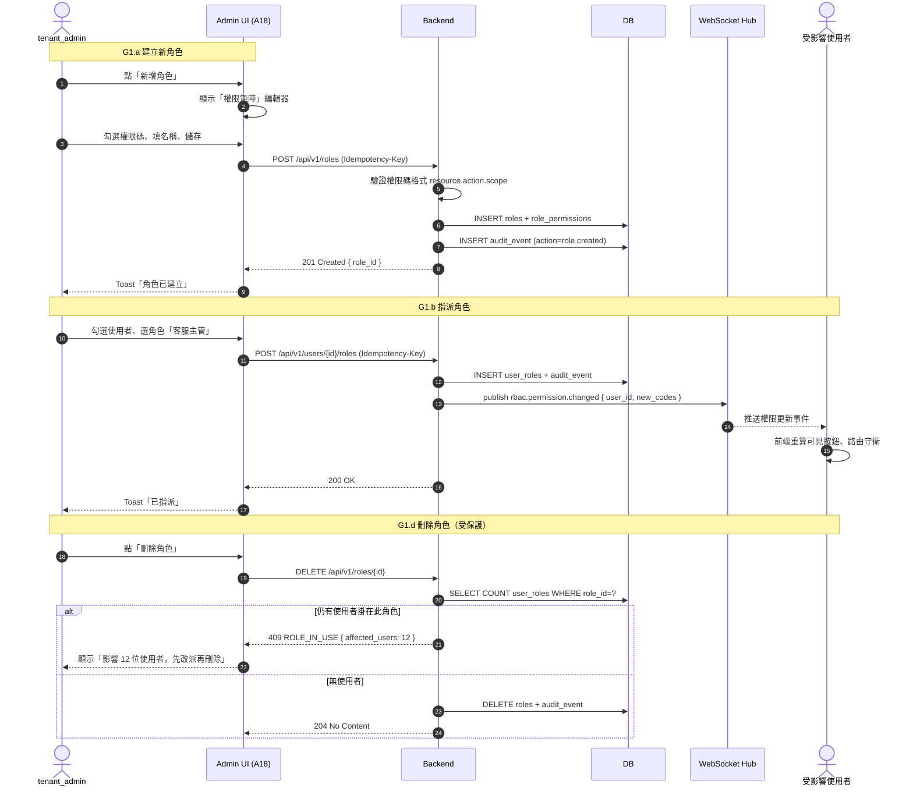
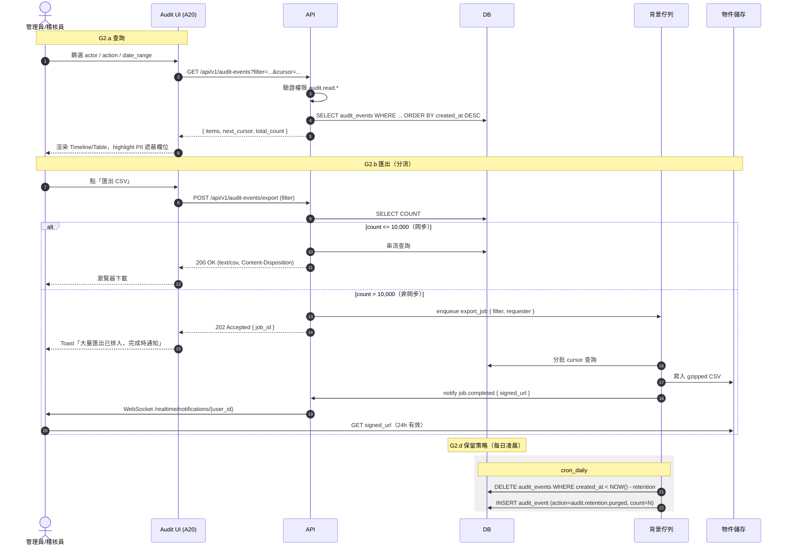
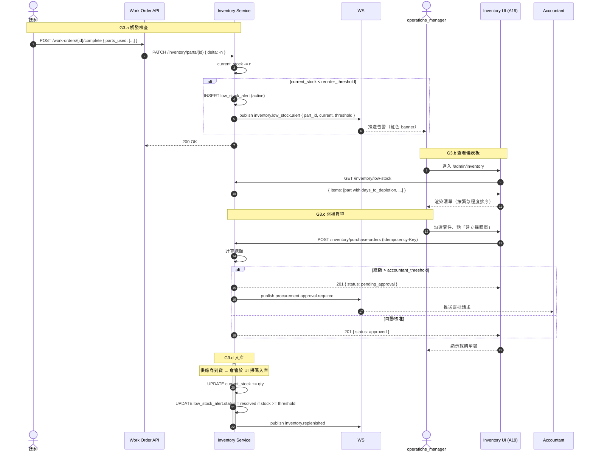
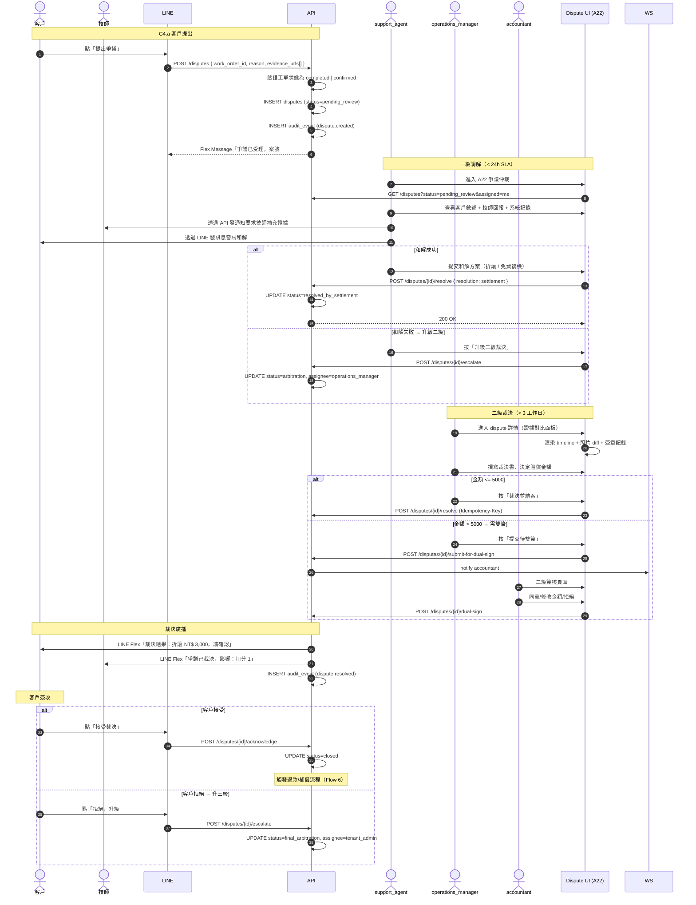

# E5x — 管理員治理流程規格書 (Admin Governance Flows)

> **文件版本**：v0.1（draft，待人工校對業務細節）
> **建立日期**：2026-04-23
> **狀態**：Claude 起草，待使用者逐節校對
> **適用範圍**：V2.0 管理員治理流程（非技師旁支）
> **觸發原因**：Pre-Week-2 驗證閘（plan §S）— 補齊 Flow 層完整度缺口
>
> **參考文件**：
> - `docs/02-design/specs/rbac-dynamic-spec.md` — RBAC 資料模型與 API
> - `docs/02-design/specs/audit-log-spec.md` — 稽核事件分類與保留政策
> - `docs/02-design/specs/inventory-management-spec.md` — 庫存資料模型
> - `docs/02-design/specs/warranty-dispute-spec.md` — 保固爭議狀態機
> - `docs/_flows-bdd-test/v-model-left/E5x--workflow-work-order.md` — 13 個工單 Flow
> - `docs/02-design/E5x--frontend-architecture.md §8.3` — 動態 RBAC 契約
>
> **與其他 Flow 文件的關係**：
> - `work-order-interaction-flows.md`：工單生命週期（技師為中心）
> - **本檔**：後台治理（管理員為中心）
> - `platform-multi-tenant/E5x--flows-multi-tenant.md`：V3.0 多租戶（待建）

---

## 目錄

1. [共通定義](#1-共通定義)
2. [Flow G1：RBAC 角色生命週期](#2-flow-g1rbac-角色生命週期)
3. [Flow G2：稽核日誌查詢與匯出](#3-flow-g2稽核日誌查詢與匯出)
4. [Flow G3：庫存低警報與補貨](#4-flow-g3庫存低警報與補貨)
5. [Flow G4：爭議仲裁獨立流程](#5-flow-g4爭議仲裁獨立流程)
6. [跨 Flow 關聯](#6-跨-flow-關聯)

---

## 1. 共通定義

### 1.1 角色（本檔登場）

> **權威角色清單：** 全系統角色定義與權限矩陣見 `specs/rbac-dynamic-spec.md §2`。
> 本節列出治理流程涉及的 8 個角色（含 Q2=A 新增 `operations_director`）。

| 角色 | 說明 | 關鍵權限 | 對應 work-order 角色 |
|:---|:---|:---|:---|
| `super_admin` | 平台最高權限，跨租戶 | 所有 `*.admin` 權限；唯一可授 `tenant_admin` | Admin（超集合） |
| `tenant_admin` | 租戶管理員 | 同租戶內所有治理權限 | Admin |
| `operations_director` | 營運總監（Q2=A 新增）| 工單覆核、雙簽核准、爭議三級裁決 | Admin（特化，Manager 之上）|
| `operations_manager` | 營運主管 | 工單指派/覆核、爭議二級審核 | Admin（特化） |
| `accountant` | 會計 | 退款/發票/對帳；**爭議金額裁決雙簽簽核人** | Finance |
| `support_agent` | 客服人員 | 對話、問題卡、客訴處理 | Admin（客服面向）|
| `dispatch_officer` | 派工員（✅ Q1=A 拍板獨立角色）| 工單派遣、人工介入、候選排序 | Admin（特化，新角色）|
| `auditor` | 稽核員（可外部審計） | **只讀**所有稽核事件 | （新角色，無對應） |

> **階層（Q2=A 拍板，PR #49 實作 ROLE_HIERARCHY）**：
> `super_admin` > `tenant_admin` ≅ `admin` > `operations_director` > `operations_manager` > `dispatch_officer` ≅ `support_agent` > `accountant` ≅ `auditor`
> （`can_grant` 採嚴格 > 比較，禁止平階授權；詳見 `api/services/role_service.py`）

> **角色映射說明**：[[E5x--workflow-work-order]] §2.1 用 6 角色（Customer / AI_System / Dispatch_Engine / Technician / Admin / Finance）；admin-governance 細化 Admin 為 5 子角色（tenant_admin / operations_director / operations_manager / support_agent / dispatch_officer）+ 額外 super_admin / auditor。dispatch_officer 獨立角色見 [[../decision-log/E7x--pm-alignment-Q1-Q10#2-q1-—-派工員是-v2-0-新角色還是客服子權限|PM Q1]] = ✅ A 拍板。

### 1.2 權限碼格式（對齊 `rbac-dynamic-spec.md`）

`<resource>.<action>.<scope>`，例：
- `refunds.approve.tenant` — 可核准本租戶所有退款
- `refunds.approve.own_team` — 僅可核准自己團隊的退款
- `audit.read.all` — 讀取所有稽核事件
- `inventory.write.warehouse_a` — 寫入 A 倉庫庫存

### 1.3 通用前置條件

所有治理操作必須：
1. 使用者已登入（Bearer JWT 有效）
2. `X-Tenant-ID` 與 JWT payload 一致
3. 對應權限碼驗證通過（後端 + 前端雙層檢查）
4. 寫操作附 `Idempotency-Key`（UUID v4，24h 窗）
5. 操作完成後產生稽核事件（見 Flow G2）

### 1.4 SLA（治理流程）

| 操作 | SLA | 超時處理 |
|:---|:---|:---|
| RBAC 角色變更生效 | < 5 秒（WS 即時推送） | 降級至下次登入生效 |
| 稽核查詢回應 | < 2 秒（含分頁） | 改非同步匯出 |
| 低庫存告警觸發 | 達閾值後 < 60 秒 | — |
| 爭議受理確認 | 提出後 < 24 小時 | 自動升級主管 |
| 爭議最終裁決 | 受理後 < 7 個工作日 | 自動升級至 `tenant_admin` |

---

## 2. Flow G1：RBAC 角色生命週期 — 對應 F-019

### 2.1 觸發條件

- **G1.a 建立角色**：`tenant_admin` 於 `/admin/roles` 新增自訂角色
- **G1.b 授權/撤銷**：管理員將角色指派/移除到 `user` 或 `technician`
- **G1.c 權限碼調整**：為既有角色增減 permission code
- **G1.d 角色刪除**：刪除不再使用的角色
- **G1.e 即時生效**：變更透過 WebSocket 廣播，所有登入 session 立即重繪 UI

### 2.2 參與角色

| Actor | 職責 |
|:---|:---|
| `tenant_admin` | 建立/修改角色、指派使用者 |
| `auditor` | 事後稽核（只讀） |
| 受影響使用者 | 被動接收權限更新（WS 推送） |
| 系統 | 產生稽核事件、廣播 WS、驗證權限碼格式 |

### 2.3 流程圖



### 2.4 狀態轉換表（角色與使用者 binding）

| 事件 | Before | After | 稽核 action |
|:---|:---|:---|:---|
| 建立角色 | — | `role.active` | `role.created` |
| 角色加權限 | `role.active` | `role.active`（permission set changed） | `role.permission.granted` |
| 角色刪權限 | `role.active` | `role.active` | `role.permission.revoked` |
| 指派角色給 user | user 無此角色 | user 有此角色 | `user.role.assigned` |
| 撤銷使用者角色 | user 有此角色 | user 無此角色 | `user.role.revoked` |
| 停用角色 | `role.active` | `role.disabled` | `role.disabled` |
| 刪除角色 | `role.active` 且 `user_count == 0` | — | `role.deleted` |

### 2.5 通知清單

| 事件 | 對象 | 通道 | 格式 |
|:---|:---|:---|:---|
| `user.role.assigned` | 受影響使用者 | WebSocket `/realtime/rbac` | `{ role_id, role_name, effective_at }` |
| `user.role.revoked` | 受影響使用者 | WebSocket `/realtime/rbac` | 同上 |
| `role.deleted` | 所有登入的管理員 | Dashboard Toast | `{ role_name, by, at }` |
| `role.permission.granted|revoked` | 該角色所有成員 | WebSocket | 全新 permission code set |

### 2.6 業務規則

- **R1**：`super_admin` 角色不可刪除、不可改名、不可增減權限（系統保留）
- **R2**：使用者至少保有一個角色；撤銷最後一個角色 → 拒絕（422）
- **R3**：權限碼格式驗證失敗（不符 `^[a-z_]+(\.[a-z_]+){2}$`）→ 422 `PERMISSION_CODE_INVALID`
- **R4**：跨租戶授權（給另一租戶使用者指派本租戶角色）→ 403 `TENANT_MISMATCH`
- **R5**：`role.disabled` 期間該角色的使用者保留關聯，但權限檢查視為無效；恢復 enabled 後權限自動回來
- **R6**：刪除角色必須先讓使用者數歸零（`ROLE_IN_USE` 409）
- **R7**：`auditor` 不可被授予任何 `*.write.*` 或 `*.delete.*` 權限（系統強制）

### 2.7 Error Path

| 情境 | error_code | HTTP | UX |
|:---|:---|:---|:---|
| 權限碼格式錯 | `PERMISSION_CODE_INVALID` | 422 | 表單紅框 + 格式提示 |
| 刪除時仍有使用者 | `ROLE_IN_USE` | 409 | 對話框列影響使用者 |
| 撤銷最後一個角色 | `VALIDATION_ERROR` | 422 | Toast「使用者至少需一個角色」 |
| 權限不足 | `FORBIDDEN` | 403 | 頁面降級為只讀 |

---

## 3. Flow G2：稽核日誌查詢與匯出 — 對應 F-020

### 3.1 觸發條件

- **G2.a 查詢**：管理員 / `auditor` 在 `/admin/audit-events` 篩選查詢
- **G2.b 匯出**：篩選結果匯出為 CSV（小量同步、大量背景）
- **G2.c 事件消費**：外部 SIEM 透過 webhook 訂閱（可選）
- **G2.d 保留策略**：事件超過保留期自動歸檔/刪除（定時任務）

### 3.2 參與角色

| Actor | 職責 |
|:---|:---|
| 所有登入角色 | 產生稽核事件（被動） |
| `operations_manager` / `tenant_admin` | 查詢/匯出 |
| `auditor` | 只讀查詢、外部匯出 |
| 系統 | 事件產出（同步）、保留策略排程（非同步） |

### 3.3 流程圖



### 3.4 事件分類（對齊 `audit-log-spec.md §2`）

| 類別 | 範例 action | 保留期 |
|:---|:---|:---|
| 認證類 | `user.login.success`, `user.login.failed`, `user.logout` | 180 天 |
| RBAC 類 | `role.created`, `user.role.assigned` | 3 年 |
| 工單類 | `work_order.created`, `work_order.status.changed` | 5 年 |
| 金流類 | `refund.approved`, `payment.confirmed`, `invoice.issued` | 7 年（稅法） |
| 敏感資料存取 | `customer.pii.viewed`, `audit.exported` | 3 年 |
| 系統類 | `audit.retention.purged` | 10 年 |

### 3.5 查詢能力

- **篩選**：actor（使用者/系統）、action（逗號分隔多選）、target_type、target_id、date_range、tenant_id（super_admin 限定）
- **排序**：`created_at`（預設 desc）、`severity`
- **分頁**：cursor-based，預設 50 筆、最大 200 筆
- **全文搜尋**：`q` 參數對 `actor_name` / `target_name` / `description` 做 ILIKE（索引 trigram）

### 3.6 PII 遮蔽規則（對齊 `audit-log-spec.md §6`）

| 欄位 | `auditor` 看到 | `tenant_admin` 看到 | `super_admin` 看到 |
|:---|:---|:---|:---|
| 客戶姓名 | `王***` | `王大明` | `王大明` |
| 客戶手機 | `09**-***-678` | `09**-***-678` | `0912-345-678` |
| 客戶地址 | `台北市中山區***` | `台北市中山區 XX 路 1 號` | 同左 |
| 金額 | 可見 | 可見 | 可見 |

### 3.7 業務規則

- **R1**：稽核事件寫入失敗不阻塞主業務，但要寫 `system.error` 事件到 fallback log
- **R2**：超過保留期的事件需在刪除前產出 `audit.retention.purged` 摘要事件（含筆數 hash）
- **R3**：匯出操作本身是稽核事件 `audit.exported`（actor + filter + count）
- **R4**：CSV 匯出檔簽章 URL 僅 24h 有效，且僅原請求者可下載
- **R5**：`auditor` 角色唯一限制：**不能**觸發 `audit.exported`（避免審計人員取走原始資料）— 改由 `tenant_admin` 代為匯出

### 3.8 Error Path

| 情境 | error_code | HTTP | UX |
|:---|:---|:---|:---|
| 匯出筆數超上限 | `AUDIT_EXPORT_TOO_LARGE` | 413 | 「請縮小範圍或使用背景匯出」 |
| 權限不足（看跨租戶）| `FORBIDDEN` | 403 | 頁面空狀態 |
| 簽章 URL 過期 | `NOT_FOUND` | 404 | 「下載連結已過期，請重新匯出」 |

---

## 4. Flow G3：庫存低警報與補貨 — 對應 F-007（材料申請）/ F-021（低庫存 alert）

### 4.1 觸發條件

- **G3.a 閾值觸發**：每次完工回報消耗零件 → 檢查 `current_stock` 是否跌破 `reorder_threshold`
- **G3.b 主動查詢**：管理員進入 `/admin/inventory` 看低庫存儀表板
- **G3.c 補貨單建立**：管理員針對低庫存零件開採購單 / 調撥單
- **G3.d 入庫**：供應商/倉管實際入庫 → 庫存回升 → 關閉告警

### 4.2 參與角色

| Actor | 職責 |
|:---|:---|
| 技師（被動） | 完工回報消耗零件 → 觸發閾值檢查 |
| `dispatch_officer` / `operations_manager` | 查詢低庫存、開補貨單 |
| `accountant` | 核准超額採購金額 |
| 供應商 / 倉管 | 入庫操作（本流程視為外部動作） |
| 系統 | 閾值檢查、WebSocket 告警、自動建立補貨草稿（可選） |

### 4.3 流程圖



### 4.4 狀態轉換表（低庫存告警）

| 事件 | Before | After |
|:---|:---|:---|
| 跌破閾值 | — | `alert.active` |
| 建立採購單 | `alert.active` | `alert.ordered` |
| 入庫回升閾值 | `alert.ordered` | `alert.resolved` |
| 24h 未處理 | `alert.active` | `alert.escalated`（通知主管） |

### 4.5 通知清單

| 事件 | 對象 | 通道 |
|:---|:---|:---|
| `inventory.low_stock.alert` | 訂閱 `/admin/inventory` 的管理員 | WebSocket `/realtime/inventory/low-stock` |
| `procurement.approval.required` | `accountant` | WebSocket + Email |
| `alert.escalated` | `tenant_admin` | LINE Notify + Email |

### 4.6 業務規則

- **R1**：`reorder_threshold` 由 `dispatch_operations_supplement.md §3.1` 定義（依零件分類）
- **R2**：補貨單金額 > 5 萬需 `accountant` 核准；> 20 萬需 `tenant_admin` 雙核
- **R3**：同一零件 24h 內多次跌破不重複推送（去重 key = `part_id + day`）
- **R4**：入庫數量超過 PO 訂量 110% 自動拒絕（避免誤入庫）
- **R5**：零件退貨（完工取消、範圍變更）需回補庫存並產 `inventory.returned` 事件
- **R6**：「緊急程度」計算公式（前端排序）：`days_to_depletion = current_stock / avg_daily_consumption_7d`

### 4.7 Error Path

| 情境 | error_code | HTTP |
|:---|:---|:---|
| 零件不存在 | `INVENTORY_PART_NOT_FOUND` | 404 |
| 庫存不足完工 | `INVENTORY_INSUFFICIENT` | 409 |
| 入庫超量 | `VALIDATION_ERROR` | 422 |
| 採購單金額需雙核但單一簽核 | `REFUND_DUAL_SIGN_REQUIRED` | 409（複用退款雙簽碼） |

---

## 5. Flow G4：爭議仲裁獨立流程 — 對應 F-013（雙簽）/ F-014（退款）

### 5.1 觸發條件

- **G4.a 客戶提出**：工單已完工後客戶於 LINE 點「有爭議」按鈕
- **G4.b 技師提出**：技師反映客戶刁難、惡意拒付
- **G4.c 管理員代開**：支付失敗多輪協商無果 → `support_agent` 代建立
- **G4.d 自動升級**：客訴 `anger_level >= 4` 且 24h 未解決 → 系統自動開爭議

### 5.2 參與角色

| Actor | 職責 |
|:---|:---|
| 客戶 | 提出爭議、提交證據、接受/拒絕裁決 |
| 技師 | 應訴、提交施工證據 |
| `support_agent` | 一級調解（嘗試和解） |
| `operations_manager` | 二級裁決（多數案件在此結案） |
| `accountant` | 金額裁決雙簽（> 5000 元時） |
| `tenant_admin` | 三級裁決（終審） |
| 系統 | SLA 計時、自動升級、證據封存、稽核 |

### 5.3 流程圖



### 5.4 狀態轉換表

| 事件 | Before | After | 備註 |
|:---|:---|:---|:---|
| 建立 | — | `pending_review` | SLA 24h |
| 受理 | `pending_review` | `under_review` | SA 開始調解 |
| 和解 | `under_review` | `resolved_by_settlement` | 終態 |
| 升級二級 | `under_review` | `arbitration` | |
| 提交雙簽 | `arbitration` | `awaiting_dual_sign` | 金額 > 5000 |
| 雙簽完成 | `awaiting_dual_sign` | `resolved_by_arbitration` | |
| 客戶接受 | `resolved_*` | `closed` | 觸發退款 |
| 客戶拒絕 | `resolved_by_arbitration` | `final_arbitration` | SLA 7 工作日 |
| 三級裁決 | `final_arbitration` | `closed_final` | 不可再上訴 |
| SLA 違反 | 任何中間態 | 原態（但標 `sla_violated=true`） | 自動升級 |

### 5.5 通知清單

| 事件 | 對象 | 通道 | 格式 |
|:---|:---|:---|:---|
| `dispute.created` | 對應工單的技師 | LINE Push + App | Flex |
| `dispute.created` | 分派的 `support_agent` | WebSocket + Email | — |
| `dispute.escalated` | `operations_manager` | WebSocket | — |
| `dispute.awaiting_dual_sign` | `accountant` | WebSocket + Email | — |
| `dispute.resolved` | 客戶 | LINE Flex（含裁決書 PDF） | Flex |
| `dispute.resolved` | 技師 | LINE Push + App | — |
| `dispute.sla_violated` | 原承辦 + 其主管 | WebSocket + LINE Notify | — |

### 5.6 業務規則

- **R1**：爭議建立時工單狀態必須為 `completed` 或 `confirmed`，否則 422
- **R2**：同一工單同時只能有一個 `active` 爭議（重複提出 → 409 `CONFLICT`）
- **R3**：爭議期間該工單的支付凍結（不論 pending 還是已付），結案後才釋放
- **R4**：技師 12 個月內累計被裁決失敗 3 次 → 觸發熔斷（對齊 `E5x--workflow-work-order.md §22`）
- **R5**：裁決書必填：事實認定、法規/規則引用、賠償金額、責任歸屬比例
- **R6**：爭議 PDF 歸檔 3 年（金流類保留 7 年與此不同，以長者為準）
- **R7**：保固爭議（Flow 7）與本流程分離：保固爭議是「責任判定 + 修復」、本流程是「金額賠償裁決」
- **R8**：`final_arbitration` 裁決前可邀請第三方調解（消保會、公會），流程標記 `external_mediation=true`
- **R9**：雙簽要求：爭議賠償 > 5000 元 同 Flow 6 退款雙簽門檻

### 5.7 Error Path

| 情境 | error_code | HTTP |
|:---|:---|:---|
| 工單狀態不符 | `VALIDATION_ERROR` | 422 |
| 重複爭議 | `CONFLICT` | 409 |
| SLA 違反 | 自動升級（非錯誤）| — |
| 單一簽核觸及雙簽門檻 | `REFUND_DUAL_SIGN_REQUIRED` | 409 |
| 第三方調解中阻擋結案 | `DISPUTE_SLA_OVERDUE`（錯借） | 410（TODO：應獨立碼 `DISPUTE_EXTERNAL_PENDING`） |

> **校對提醒**：§5.7 最後一行的錯誤碼使用不準，建議新增 `DISPUTE_EXTERNAL_PENDING`。此為本檔起草階段的已知問題，待 Stage 2 校對時正名並更新 `error-codes.md`。

---

## 6. 跨 Flow 關聯

### 6.1 本檔與 work-order-interaction-flows 的分界

| 議題 | 歸屬 | 理由 |
|:---|:---|:---|
| 工單生命週期狀態機 | work-order-flows | 技師操作為中心 |
| 退款審批雙簽（Flow 6）| work-order-flows | 客戶觸發、工單衍生 |
| 爭議仲裁 | **本檔 G4** | 管理員裁決為中心、跨多工單 |
| 保固索賠流程（Flow 7）| work-order-flows | 技師回場修復為中心 |
| RBAC | **本檔 G1** | 治理操作 |
| 稽核事件**產出** | work-order-flows 各 Flow 附帶 | 各流程自然產出 |
| 稽核事件**查詢/匯出** | **本檔 G2** | 管理員主動操作 |
| 庫存消耗（完工回報）| work-order-flows Flow 1 | 技師動作 |
| 庫存告警與補貨 | **本檔 G3** | 管理員處理 |

### 6.2 本檔觸發的事件 → 下游消費者

```
G1 RBAC 變更 ──→ /realtime/rbac ──→ 所有登入 session 重繪 UI
                                  ──→ audit_events 表

G2 匯出完成 ──→ /realtime/notifications/{user_id} ──→ 原請求者下載

G3 低庫存觸發 ──→ /realtime/inventory/low-stock ──→ inventory UI 紅色 banner
                                                ──→ tenant_admin LINE Notify（escalated）

G4 爭議裁決 ──→ LINE Push（客戶）
            ──→ App Push（技師）
            ──→ 若需退款 ──→ Flow 6 退款審批流
```

### 6.3 與 multi-tenant 的關係（待 `platform-multi-tenant/E5x--flows-multi-tenant.md` 建立後對齊）

- `super_admin` 跨租戶稽核查詢 → 指向 `platform-multi-tenant/E5x--flows-multi-tenant.md` G_MT_3 超管查詢
- 租戶設定變更（角色預設、閾值）→ 指向 `platform-multi-tenant/E5x--flows-multi-tenant.md` G_MT_1 租戶設定

---

## 7. 校對檢核表（給使用者）

起草階段自知的模糊處，需使用者校對：

- [ ] §1.1 角色清單是否完整？`auditor` 是否為本專案既有或新增？
- [ ] §1.4 SLA 數字（5 秒 / 2 秒 / 60 秒 / 24 小時 / 7 工作日）是否符合業務承諾？
- [ ] §2.6 R7「`auditor` 不可被授予寫權限」是否需要放寬（讓 auditor 能匯出？）
- [ ] §3.4 保留期（180 天 / 3 年 / 5 年 / 7 年 / 10 年）是否符合台灣法規與公司政策？
- [ ] §3.5 大量匯出門檻（10,000 筆）是否合理？
- [ ] §3.6 PII 遮蔽規則細節（特別是超管層級的開放度）
- [ ] §4.6 R2 金額門檻（5 萬 / 20 萬）是否與 Flow 6 退款門檻一致？
- [ ] §5.6 R9 爭議雙簽門檻（5000）是否與 Flow 6 退款雙簽門檻（§9.1 可能的 10000/100000）統一？
- [ ] §5.6 R4 技師熔斷閾值（12 個月 3 次）是否為新規則？還是已在 `E5x--workflow-work-order.md §22` 有等價規則？
- [ ] §5.6 R7 保固爭議 vs 金額爭議的分界是否清楚？
- [ ] §5.7 新錯誤碼 `DISPUTE_EXTERNAL_PENDING` 的命名
- [ ] §6.1 議題分界是否準確？

---

## 8. 變更記錄

| 日期 | 版本 | 變更摘要 |
|:---|:---|:---|
| 2026-04-23 | v0.1 | 初稿（Claude 起草）：4 個 Flow + 共通定義 + 跨 Flow 關聯 |
