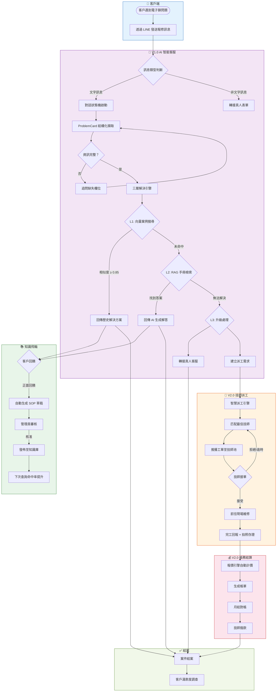

# 01 — Business Process Diagram（業務流程圖）

> **為什麼重要？** 先搞清楚業務怎麼跑，才能確保系統設計貼合實際營運。

## 概述

本圖描繪電子鎖售後服務從「客戶報修 → AI 診斷 → 解決/派工 → 結案」的完整業務流程，涵蓋 V1.0 AI 智能客服與 V2.0 技師派工兩大階段。

---

## 業務流程總覽

---

## 核心業務指標

| 流程環節 | KPI | 目標值 |
|:---------|:----|:------|
| AI 首次回應 | 回應時間 | < 5 秒 |
| L1 案例搜尋 | 命中率 | ≥ 70% |
| L1+L2 自助解決 | 解決率 | ≥ 60% |
| 技師接單 | 接單率 | ≥ 60% |
| 帳單準確度 | 零人工調整率 | ≥ 70% → 95% |
| 整體服務 | 客戶滿意度 | ≥ 4.5 / 5.0 |

---

## 業務角色參與矩陣

| 流程 | 客戶 | AI 系統 | 管理員 | 技師 |
|:-----|:----:|:-------:|:------:|:----:|
| 報修發起 | ●主導 | ○接收 | | |
| 問題診斷 | ○提供資訊 | ●主導 | | |
| 知識庫查詢 | | ●執行 | | |
| SOP 審核 | | ○生成 | ●審核 | |
| 派工分配 | | ●匹配 | ○監控 | ○接收 |
| 現場維修 | ○等待 | | ○追蹤 | ●執行 |
| 帳務結算 | | ●自動化 | ●審核 | ○確認 |

● = 主要負責 ○ = 參與協助
