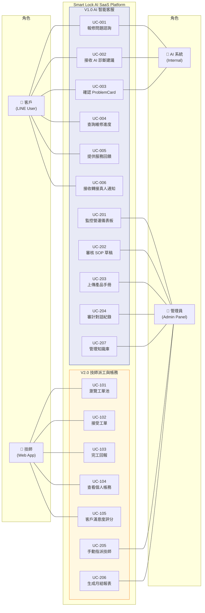

# 02 — Use Case Diagram（使用案例圖）

> **為什麼重要？** 定義角色與功能邊界，確保每個角色的需求都被系統覆蓋。

## 概述

本圖定義四大角色（客戶、技師、管理員、AI 系統）與各自可操作的功能邊界，明確區分 V1.0 與 V2.0 的功能範圍。

---

## 使用案例圖

---

## Use Case 清單

### V1.0 — 客戶 Use Cases

| ID | 名稱 | 說明 | 介面 |
|:---|:-----|:-----|:-----|
| UC-001 | 報修問題諮詢 | 客戶透過 LINE 描述電子鎖故障，AI 啟動對話狀態機 | LINE Bot |
| UC-002 | 接收 AI 診斷建議 | 接收 L1 案例 / L2 RAG / 影片卡片等解決方案 | LINE Flex Message |
| UC-003 | 確認 ProblemCard | 確認 AI 擷取的品牌、型號、故障現象是否正確 | LINE Flex Message |
| UC-004 | 查詢維修進度 | 查詢已建立工單的處理狀態 | LINE Bot |
| UC-005 | 提供服務回饋 | 對 AI 解答或技師服務給予評分與回饋 | LINE Bot |
| UC-006 | 接收轉接通知 | 接收 L3 升級後的真人客服轉接表單 | LINE Bot |

### V2.0 — 技師 Use Cases

| ID | 名稱 | 說明 | 介面 |
|:---|:-----|:-----|:-----|
| UC-101 | 瀏覽工單池 | 依距離、品牌、價格篩選可接工單 | Web App (PWA) |
| UC-102 | 接受工單 | 一鍵接單並提供預估到達時間 | Web App (PWA) |
| UC-103 | 完工回報 | 提交維修照片、使用零件、工時紀錄 | Web App (PWA) |
| UC-104 | 查看個人帳務 | 查看收入明細、撥款狀態 | Web App (PWA) |
| UC-105 | 客戶滿意度評分 | 維修後收集客戶滿意度並回饋 | Web App (PWA) |

### V1.0 + V2.0 — 管理員 Use Cases

| ID | 名稱 | 說明 | 介面 |
|:---|:-----|:-----|:-----|
| UC-201 | 監控營運儀表板 | 查看 KPI、警報、趨勢圖表 | Admin Panel |
| UC-202 | 審核 SOP 草稿 | 審核 AI 自動生成的 SOP，核准/退回 | Admin Panel |
| UC-203 | 上傳產品手冊 | 上傳 PDF → 分段 → 向量嵌入 | Admin Panel |
| UC-204 | 審計對話紀錄 | 監控情緒、升級危急案件 | Admin Panel |
| UC-205 | 手動指派技師 | 逾時工單手動指定技師 | Admin Panel |
| UC-206 | 生成月結報表 | 技師對帳、撥款報表 | Admin Panel |
| UC-207 | 管理知識庫 | 案例 CRUD、分類管理 | Admin Panel |
