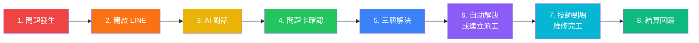
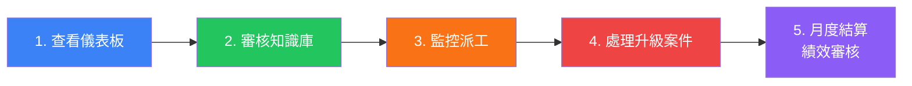
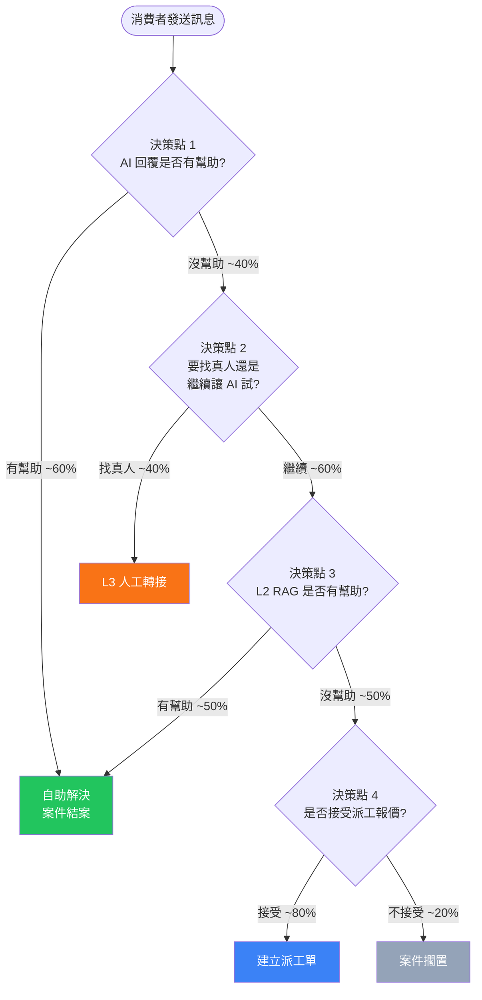
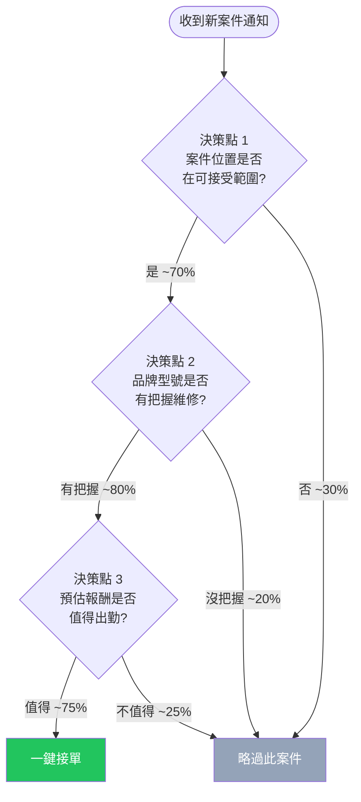
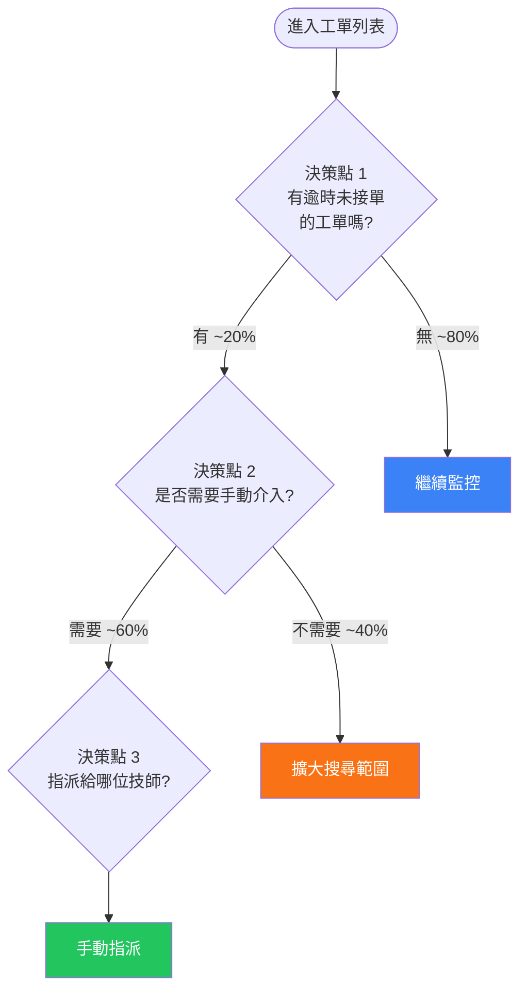

# 電子鎖智能客服與派工平台 — 使用者旅程地圖

> **版本:** v1.0 | **日期:** 2026-03-31
> **關聯文件:** `02_project_brief_and_prd.md`, `05_architecture_and_design_document.md`, `executive_architecture_overview.md`

---

## 目錄

- [1. 消費者旅程地圖 (Consumer Journey Map)](#1-消費者旅程地圖-consumer-journey-map)
- [2. 技師旅程地圖 (Technician Journey Map)](#2-技師旅程地圖-technician-journey-map)
- [3. 管理員旅程地圖 (Admin Journey Map)](#3-管理員旅程地圖-admin-journey-map)
- [4. 情緒曲線總覽 (Emotion Curves)](#4-情緒曲線總覽-emotion-curves)
- [5. 關鍵決策點分析 (Key Decision Points)](#5-關鍵決策點分析-key-decision-points)

---

## 1. 消費者旅程地圖 (Consumer Journey Map)

### 1.1 旅程總覽

消費者透過 LINE Bot 與平台互動，從發現電子鎖問題到最終解決（自助或派工），共經歷 8 個階段。




---

### 1.2 各階段詳細描述

#### 階段 1：問題發生


| 維度       | 內容                                                             |
| -------- | -------------------------------------------------------------- |
| **情境**   | 消費者在家中或辦公室遇到電子鎖故障——門鎖無法開啟、密碼失靈、電池耗盡警示、指紋辨識失敗、門鎖發出異常聲響、忘記管理密碼等。 |
| **行為**   | 嘗試基本排除（換電池、重新輸入密碼、重啟門鎖），上網搜尋解決方法，詢問身邊親友。                       |
| **想法**   | 「怎麼突然壞了？」「會不會是電池沒電？」「找誰修比較快？」                                  |
| **情緒**   | 焦慮 / 不安（尤其無法進門時為高度焦慮）                                          |
| **接觸點**  | 無（尚未與平台互動）                                                     |
| **系統動作** | 無                                                              |


#### 階段 2：開啟 LINE，向 Smart Lock Bot 發送訊息


| 維度       | 內容                                                                              |
| -------- | ------------------------------------------------------------------------------- |
| **情境**   | 消費者透過 LINE 搜尋或掃描 QR Code 加入品牌 LINE 官方帳號，點擊 Rich Menu 中的「報修諮詢」或直接發送文字訊息。         |
| **行為**   | 開啟 LINE App → 進入官方帳號 → 點擊 Rich Menu 按鈕或直接輸入文字描述問題。                              |
| **想法**   | 「用 LINE 就能報修，蠻方便的。」「希望能快點得到回覆。」                                                 |
| **情緒**   | 期待 / 略有不耐                                                                       |
| **接觸點**  | LINE App → 品牌官方帳號 → Rich Menu                                                   |
| **系統動作** | LINE Webhook 接收事件 → 建立或恢復 Conversation Session → 對話狀態機初始化為 `Idle` → 回覆歡迎訊息與引導提示 |


#### 階段 3：AI 對話 — 多輪對話蒐集資訊


| 維度       | 內容                                                                                                                                                   |
| -------- | ---------------------------------------------------------------------------------------------------------------------------------------------------- |
| **情境**   | AI 客服透過自然語言對話，逐步引導消費者提供關鍵資訊：品牌、型號、故障現象、安裝位置、緊急程度等。支援文字與圖片輸入。                                                                                         |
| **行為**   | 回答 AI 的追問（「請問是哪個品牌的電子鎖？」「可以描述一下故障狀況嗎？」），上傳故障部位照片，修正 AI 理解錯誤的資訊。                                                                                      |
| **想法**   | 「它好像真的聽得懂我在說什麼。」「問得蠻仔細的，希望能一次解決。」「怎麼還在問？快點幫我解決啦！」                                                                                                    |
| **情緒**   | 從期待逐漸轉為不耐（若對話輪次過多） / 若 AI 理解準確則感到驚喜                                                                                                                  |
| **接觸點**  | LINE 對話介面（文字、圖片、Flex Message 選項按鈕）                                                                                                                   |
| **系統動作** | ConversationManager 維持對話狀態（`Idle` → `Collecting`）→ ProblemCardEngine 即時從對話中擷取結構化欄位（品牌/型號/症狀/位置/緊急程度）→ AI 輔助推斷缺失欄位 → 針對不足資訊生成追問 → 圖片附件存儲至 ProblemCard |


#### 階段 4：ProblemCard 生成 — 消費者確認


| 維度       | 內容                                                                                                      |
| -------- | ------------------------------------------------------------------------------------------------------- |
| **情境**   | 系統蒐集足夠資訊後自動生成結構化的 ProblemCard（問題診斷卡），以 LINE Flex Message 格式展示給消費者確認。                                    |
| **行為**   | 審閱 Flex Message 中的問題摘要（品牌、型號、故障描述、位置），點擊「確認」或修正個別欄位。                                                    |
| **想法**   | 「整理得蠻清楚的。」「型號寫錯了，讓我改一下。」                                                                                |
| **情緒**   | 安心（問題被系統化記錄） / 輕微挫折（若需要修正）                                                                              |
| **接觸點**  | LINE Flex Message（ProblemCard 確認卡片）                                                                     |
| **系統動作** | ProblemCardEngine 生成 Flex Message → 消費者確認後 ProblemCard 狀態轉為 `confirmed` → 對話狀態轉為 `Resolving` → 觸發三層解決引擎 |


#### 階段 5：三層解決引擎 — L1 / L2 / L3


| 維度       | 內容                                                                                                                                                                                                               |
| -------- | ---------------------------------------------------------------------------------------------------------------------------------------------------------------------------------------------------------------- |
| **情境**   | 系統依序嘗試三個層級尋找解決方案：L1 案例庫向量搜尋 → L2 RAG 產品手冊推理 → L3 人工轉接/派工。                                                                                                                                                        |
| **行為**   | 接收 AI 提供的解決方案，嘗試按照步驟操作，點擊「有幫助」或「沒幫助」按鈕回饋。                                                                                                                                                                        |
| **想法**   | L1 命中：「太好了，有人遇過一樣的問題！」 / L2 命中：「原來手冊上有寫，我之前沒注意到。」 / L3 升級：「看來比較複雜，需要專業人員來看。」                                                                                                                                     |
| **情緒**   | L1/L2 命中 → 滿意、安心 / L3 升級 → 理解但略感失望                                                                                                                                                                               |
| **接觸點**  | LINE 文字回覆（步驟化解決方案）、「有幫助/沒幫助」快速回饋按鈕                                                                                                                                                                               |
| **系統動作** | **L1:** ResolutionService 對案例庫進行 pgvector 語意搜尋（相似度 >= 0.85），命中則回覆步驟化解決方案。**L2:** L1 未命中 → 觸發 RAG Pipeline，從產品手冊 chunks 中檢索 → Gemini 整合生成回覆（標註來源頁碼）。**L3:** L1+L2 均未命中，或消費者回饋「沒幫助」，或消費者要求「找真人」→ 轉人工客服通知 / 建立待派工單。 |


#### 階段 6：自助解決 或 建立派工


| 維度       | 內容                                                                                                                                 |
| -------- | ---------------------------------------------------------------------------------------------------------------------------------- |
| **情境**   | 根據三層引擎結果分流：(A) 消費者成功自行解決問題；(B) 問題需要技師現場維修，系統建立派工單並告知預估費用。                                                                          |
| **行為**   | (A) 回饋「有幫助」，結束對話。(B) 確認報價、提供詳細地址與偏好時段、等待技師接單通知。                                                                                    |
| **想法**   | (A)「不用找人來修，省了一筆錢！」 (B)「費用還算合理，希望師傅快點來。」                                                                                            |
| **情緒**   | (A) 滿意 / 成就感 (B) 接受 / 期待                                                                                                           |
| **接觸點**  | LINE Flex Message（報價單、地址確認表單）、LINE Push 通知（技師已接單）                                                                                  |
| **系統動作** | (A) 案件標記為「自助解決」→ 觸發 SOP 自動生成 → 記錄回饋。(B) ProblemCard → DispatchEngine 建立工單 → PricingEngine 自動報價 → 推送至符合條件技師的案件池 → 技師接單後 LINE 通知消費者。 |


#### 階段 7：技師到場，維修完工


| 維度       | 內容                                                       |
| -------- | -------------------------------------------------------- |
| **情境**   | 技師按照預約時間到場，根據 ProblemCard 與工單資訊進行維修。完工後提交完工報告。           |
| **行為**   | 等待技師到達，配合技師進行維修，確認維修結果。                                  |
| **想法**   | 「師傅很專業，已經知道問題在哪了。」「修好了，終於可以正常用了。」                        |
| **情緒**   | 等待中略焦慮 → 維修完成後滿意 / 放心                                    |
| **接觸點**  | LINE Push 通知（技師出發、預計到達時間）、現場互動                           |
| **系統動作** | 技師端提交完工報告（照片、材料清單、工時）→ 工單狀態更新為「待確認」→ LINE 通知消費者完工摘要與費用明細 |


#### 階段 8：結算與回饋


| 維度       | 內容                                                                                    |
| -------- | ------------------------------------------------------------------------------------- |
| **情境**   | 消費者確認維修結果，完成付款（現場現金/轉帳），系統結案。                                                         |
| **行為**   | 查看費用明細，現場付款，回覆對服務的整體感受。                                                               |
| **想法**   | 「整個流程還蠻順的。」「下次有問題還是用 LINE 就好。」                                                        |
| **情緒**   | 滿意 / 安心 / 若費用超出預期則有不滿                                                                 |
| **接觸點**  | LINE Flex Message（結案通知、費用明細）                                                          |
| **系統動作** | 工單狀態轉為 `Completed` → AccountingModule 記錄帳務（消費者付款、技師墊付款項）→ 案件歸檔 → 觸發 SOP 自動生成（若為新案例型態） |


---

## 2. 技師旅程地圖 (Technician Journey Map)

### 2.1 旅程總覽

技師透過 Web App（PWA）與平台互動，從收到推播通知到完成結算，共經歷 6 個階段。


---

### 2.2 各階段詳細描述

#### 階段 1：收到推播通知 — 新案件匹配


| 維度       | 內容                                                                                 |
| -------- | ---------------------------------------------------------------------------------- |
| **情境**   | 平台根據技師的品牌技能、服務區域、評分、可用時段自動匹配新案件，透過 Web Push 與 LINE 推播同時通知。                         |
| **行為**   | 查看手機推播通知，確認案件基本資訊（區域、品牌、問題類型）。                                                     |
| **想法**   | 「附近有新案子，看看值不值得接。」                                                                  |
| **情緒**   | 好奇 / 期待（有工作機會）                                                                     |
| **接觸點**  | Web Push Notification、LINE Push Message                                            |
| **系統動作** | DispatchEngine 匹配 Top-5 技師 → NotificationService 發送 Web Push + LINE 推播（含案件摘要與快速連結） |


#### 階段 2：瀏覽案件池 — 評估案件


| 維度       | 內容                                                          |
| -------- | ----------------------------------------------------------- |
| **情境**   | 技師打開 Web App 的案件池頁面，瀏覽所有符合自身條件的待派案件。                        |
| **行為**   | 在案件池中按距離、報酬、緊急程度排序，查看案件詳情（地址區域、品牌型號、問題摘要、ProblemCard、預估報酬）。 |
| **想法**   | 「這個地方離我蠻近的。」「dormakaba 的我比較拿手。」「預估報酬還可以。」                     |
| **情緒**   | 理性評估 / 若無合適案件則失望                                            |
| **接觸點**  | Technician Web App — 案件池頁面（`/pool`）                         |
| **系統動作** | API 回傳篩選後案件列表（僅符合技師技能 + 服務區域）→ 即時更新（Polling < 30 秒延遲）       |


#### 階段 3：接單，確認 ETA


| 維度       | 內容                                                                              |
| -------- | ------------------------------------------------------------------------------- |
| **情境**   | 技師決定接下案件，點擊「接單」按鈕並輸入預計到達時間。                                                     |
| **行為**   | 點擊「一鍵接單」→ 輸入預計到達時間 → 確認。                                                        |
| **想法**   | 「趕快按，不然被別人搶走了。」「大概一小時內可以到。」                                                     |
| **情緒**   | 積極 / 緊迫感（競爭性接單）                                                                 |
| **接觸點**  | Technician Web App — 案件詳情頁 → 接單確認對話框                                            |
| **系統動作** | 工單狀態變更為 `Assigned` → 案件從其他技師案件池中移除 → 消費者收到 LINE 通知（技師姓名、預計到達時間）→ 30 分鐘內未出發可免責取消 |


#### 階段 4：導航到場，執行維修


| 維度       | 內容                                                           |
| -------- | ------------------------------------------------------------ |
| **情境**   | 技師依照工單上的地址前往現場，參考 ProblemCard 上的診斷資訊進行維修。                    |
| **行為**   | 查看工單詳情中的地址與 ProblemCard → 導航前往 → 到場後確認故障 → 執行維修。             |
| **想法**   | 「ProblemCard 寫得蠻清楚的，大概知道要帶什麼工具。」「到了現場看情況比描述的複雜。」             |
| **情緒**   | 專注 / 若問題比預期複雜則有壓力                                            |
| **接觸點**  | Technician Web App — 工單詳情頁（`/my-orders/[id]`）、Google Maps 導航 |
| **系統動作** | 工單狀態更新為 `InProgress`（技師點擊「開始維修」）→ 記錄到場時間戳                    |


#### 階段 5：提交完工報告


| 維度       | 內容                                                                                 |
| -------- | ---------------------------------------------------------------------------------- |
| **情境**   | 維修完成後，技師在 Web App 上填寫完工報告。                                                         |
| **行為**   | 拍攝維修前/後對比照片（必填）→ 填寫實際施工內容 → 勾選使用材料 → 填寫實際工時 → 申報墊付金額（如有）→ 提交。                      |
| **想法**   | 「拍照記錄一下，免得後面有爭議。」「墊了材料費，記得申報。」                                                     |
| **情緒**   | 成就感（完成工作）/ 若表單太複雜則不耐                                                               |
| **接觸點**  | Technician Web App — 完工回報表單                                                        |
| **系統動作** | 照片上傳（壓縮至 < 5MB）→ 完工報告入庫 → 工單狀態變更為「待確認」→ LINE 通知消費者完工摘要與費用明細 → PricingEngine 計算最終費用 |


#### 階段 6：帳戶中心 — 查看結算


| 維度       | 內容                                                               |
| -------- | ---------------------------------------------------------------- |
| **情境**   | 技師在帳戶中心查看本次收入、累計收入、待結算金額、墊付款核銷狀態。                                |
| **行為**   | 開啟帳戶中心 → 查看本月收入摘要 → 檢視歷史工單與收入明細 → 確認墊付款核銷進度。                     |
| **想法**   | 「這個月做了不少案子。」「墊付款什麼時候下來？」                                         |
| **情緒**   | 滿意（收入增加）/ 焦慮（墊付款未核銷）                                             |
| **接觸點**  | Technician Web App — 帳戶中心頁面（`/account`）                          |
| **系統動作** | API 回傳技師個人帳務摘要（本月完成案件數、累計收入、待結算、已結算）→ 歷史工單列表（按月份篩選）→ 收入摘要匯出（PDF） |


---

## 3. 管理員旅程地圖 (Admin Journey Map)

### 3.1 日常工作流程

管理員透過 Admin Panel 進行日常營運管理，以下為典型的每日工作流程。




---

### 3.2 各階段詳細描述

#### 階段 1：查看儀表板 — 掌握全局


| 維度       | 內容                                                                           |
| -------- | ---------------------------------------------------------------------------- |
| **情境**   | 每日上班第一件事，登入 Admin Panel 查看營運儀表板。                                             |
| **行為**   | 查看今日對話數、自助解決率、待派工單數、異常告警 → 識別需要關注的指標 → 決定今日優先處理事項。                           |
| **想法**   | 「今天自助解決率下降了，要看看是不是知識庫需要更新。」「有 3 張工單超過 2 小時沒人接，要手動介入。」                        |
| **情緒**   | 專注 / 若指標異常則緊張                                                                |
| **接觸點**  | Admin Panel — 營運儀表板（`/dashboard`）                                            |
| **系統動作** | 自動載入今日 KPIs → 問題類別分布圓餅圖 → 每日對話量趨勢（近 30 天）→ 各品牌報修排行 → 異常工單標紅告警 → 資料每 5 分鐘自動更新 |


#### 階段 2：審核知識庫 — SOP 草稿佇列、手冊上傳


| 維度       | 內容                                                                                                                                               |
| -------- | ------------------------------------------------------------------------------------------------------------------------------------------------ |
| **情境**   | 檢查 AI 自動生成的 SOP 草稿佇列，審核品質後決定核准、退回或刪除。管理新上傳的產品手冊。                                                                                                 |
| **行為**   | 進入 SOP 審核佇列 → 逐一查看 SOP 草稿（對照原始對話與 ProblemCard）→ 核准 / 退回 / 刪除 → 確認核准的 SOP 已發布至知識庫。上傳新的產品手冊 PDF。                                                   |
| **想法**   | 「這個 SOP 寫得不錯，核准入庫。」「這個步驟描述不夠精確，退回讓 AI 重新生成。」                                                                                                     |
| **情緒**   | 專注 / 成就感（知識庫持續完善）                                                                                                                                |
| **接觸點**  | Admin Panel — SOP 審核佇列（`/knowledge-base/sop-drafts`）、手冊管理（`/knowledge-base/manuals`）                                                             |
| **系統動作** | 載入 `draft` 狀態 SOP 列表 → 審核後狀態變更（`approved` / `rejected` / `deleted`）→ 核准後自動向量化並索引至案例庫 → 60 秒內 AI 客服可命中新 SOP → 手冊上傳後觸發 PDF 切分 + Embedding Pipeline |


#### 階段 3：監控派工 — 工單狀態追蹤


| 維度       | 內容                                                                  |
| -------- | ------------------------------------------------------------------- |
| **情境**   | 查看待處理、進行中、已完成的工單，監控派工引擎運作狀態，處理逾時未接單的案件。                             |
| **行為**   | 進入工單列表 → 按狀態篩選（待派/已派/進行中/完成）→ 查看逾時工單 → 手動指派技師 → 檢視技師可用狀態。           |
| **想法**   | 「這張單超過 2 小時沒人接，我手動指派給李師傅。」「今天已完成 15 張單，效率不錯。」                       |
| **情緒**   | 掌控感 / 若大量逾時則有壓力                                                     |
| **接觸點**  | Admin Panel — 工單列表（`/work-orders`）、工單詳情（`/work-orders/[id]`）        |
| **系統動作** | 載入工單列表（含狀態篩選、搜尋）→ 逾時工單自動標紅 → 手動指派時顯示符合條件的技師列表（含狀態/距離/評分）→ 指派後推播通知技師 |


#### 階段 4：處理升級案件 — 情緒告警、客訴


| 維度       | 內容                                                                                                     |
| -------- | ------------------------------------------------------------------------------------------------------ |
| **情境**   | 處理 AI 偵測到負面情緒的對話、消費者客訴案件、技師回報的異常狀況。                                                                    |
| **行為**   | 查看情緒告警通知 → 進入對話詳情檢視上下文 → 決定是否介入 → 客訴案件建立/指派/追蹤。                                                        |
| **想法**   | 「這位客人很不滿，先電話聯繫安撫。」「客訴要在 24 小時內回覆。」                                                                     |
| **情緒**   | 緊張 / 責任感                                                                                               |
| **接觸點**  | Admin Panel — 對話詳情（`/conversations/[id]`）、客訴管理（V2.0）                                                   |
| **系統動作** | 情緒偵測引擎標記 `sentiment_label = "negative"` → LINE 推播通知管理員 → 對話列表中高亮顯示 → 客訴案件獨立狀態流程（待處理 → 處理中 → 待確認 → 已結案） |


#### 階段 5：月度結算與績效審核


| 維度       | 內容                                                                                              |
| -------- | ----------------------------------------------------------------------------------------------- |
| **情境**   | 每月初進行上月度的帳務結算、技師績效審核、營運報表產出。                                                                    |
| **行為**   | 進入帳務管理 → 審核技師月結報表 → 核准/退回墊付款申請 → 產生結算憑證 → 匯出 Excel 供會計系統匯入 → 審核技師績效指標。                          |
| **想法**   | 「這個月墊付款比較多，要確認發票都齊全。」「張師傅完成率高，但客訴也有 2 件，要關注。」                                                   |
| **情緒**   | 專注（數字密集工作）/ 完成後有成就感                                                                             |
| **接觸點**  | Admin Panel — 帳務管理（`/accounting`）、技師管理（`/technicians`）                                          |
| **系統動作** | 自動生成月度技師結算報表 → 逐筆/批量審核 → 核准後產生結算憑證（PDF）→ 匯出 Excel → 記帳憑證自動產出（借方/貸方科目）→ 技師績效統計（完成案件數、平均完工時間、客訴率） |


---

## 4. 情緒曲線總覽 (Emotion Curves)

### 4.1 消費者情緒曲線

```
情緒值
  5 |                                              ★ 自助解決
  4 |                          ●                 ●       ● 完工結算
  3 |              ●                                        
  2 |    ●                                           
  1 | ●                   (L3 轉派工)
  0 |─────────────────────────────────────────────────────→ 階段
    問題  開啟  AI    問題卡  三層   自助/   技師    結算
    發生  LINE  對話  確認   解決   派工    到場    回饋
```

**關鍵轉折點：**

- **最低點：** 階段 1（問題發生）— 焦慮、不安
- **回升點：** 階段 4（問題卡確認）— 問題被系統化記錄，感到安心
- **最高點：** 階段 6（自助解決）— 自己搞定的成就感
- **風險點：** 階段 3（AI 對話過長）— 若追問超過 5 輪，不耐感顯著上升

### 4.2 技師情緒曲線

```
情緒值
  5 |                   ●                    ● 提交完工
  4 |         ●                                    ● 查看收入
  3 |  ●                        ●                       
  2 |                                                
  1 |                                                
  0 |─────────────────────────────────────────────→ 階段
    收到    瀏覽    接單    到場    提交     帳戶
    通知    案件池  確認    維修    完工     結算
```

**關鍵轉折點：**

- **最高點：** 階段 3（成功搶到單）與 階段 5（完工提交）
- **風險點：** 階段 4（現場問題比 ProblemCard 描述更複雜）— 壓力上升
- **持續關注：** 階段 6（墊付款核銷速度）— 影響長期合作意願

### 4.3 管理員情緒曲線

```
情緒值
  5 |    ●                                    ● 結算完成
  4 |              ●              
  3 |                       ●                       
  2 |                              ●                
  1 |                                                
  0 |─────────────────────────────────────────────→ 階段
    儀表板  知識庫  監控    處理    月度
    概覽    審核   派工    客訴    結算
```

**關鍵轉折點：**

- **最高點：** 階段 1（一切正常時的掌控感）與 階段 5（月度結算完成）
- **最低點：** 階段 4（處理客訴）— 壓力最大
- **風險點：** 大量工單逾時（階段 3）— 需要密集手動介入

---

## 5. 關鍵決策點分析 (Key Decision Points)

### 5.1 消費者決策點




### 5.2 技師決策點




### 5.3 管理員決策點




---

> **文件結尾**
> 本文件定義了電子鎖智能客服與派工平台三類使用者的完整旅程地圖，作為 UX 設計、功能開發、測試驗收的參考依據。

