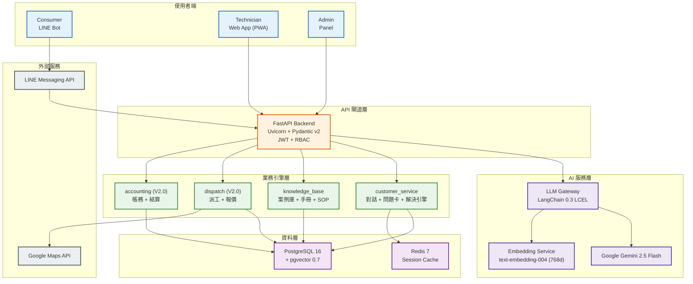
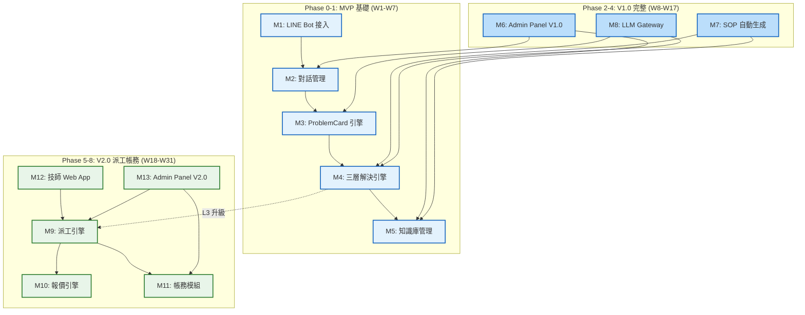
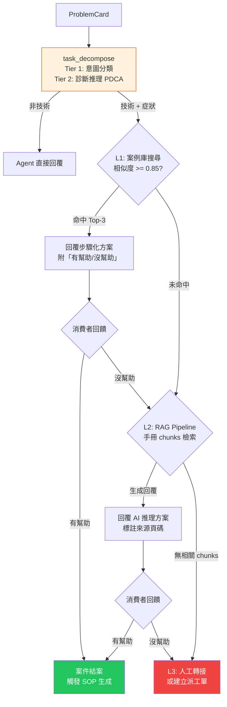
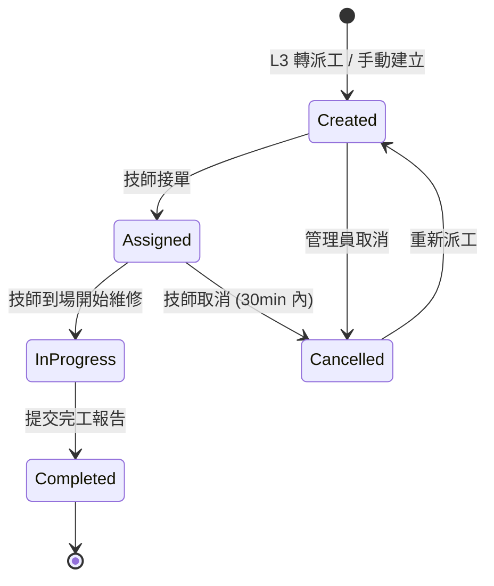
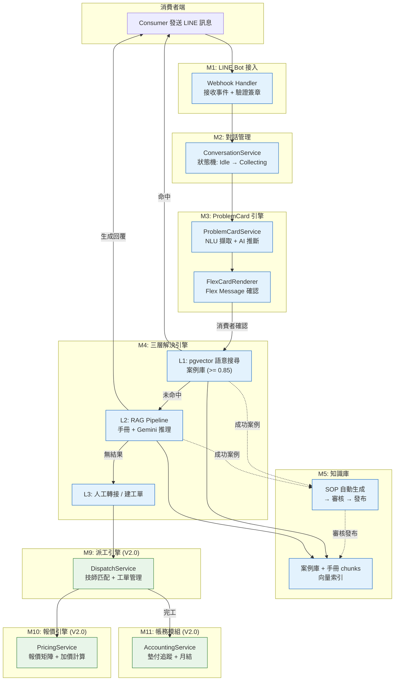
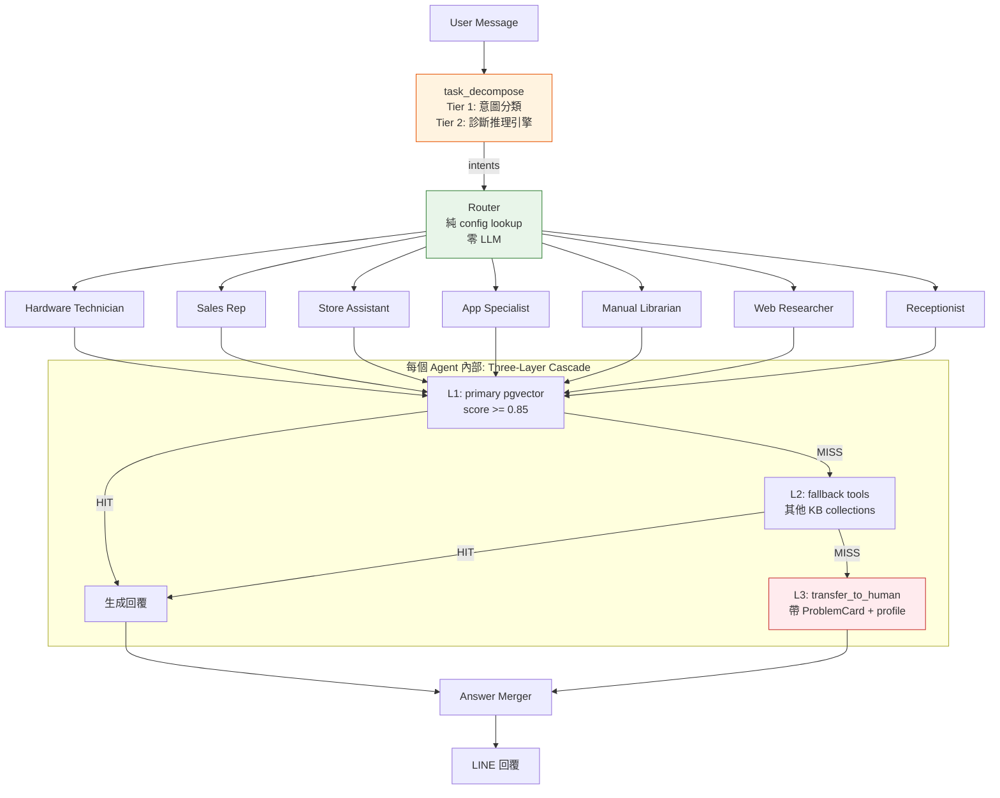
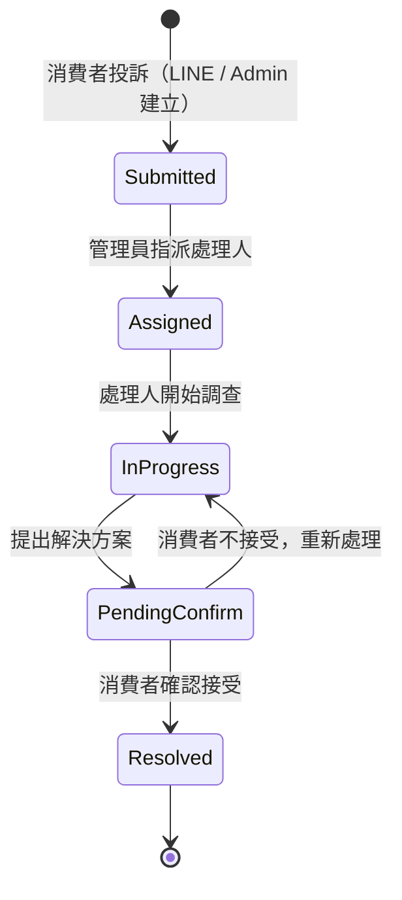
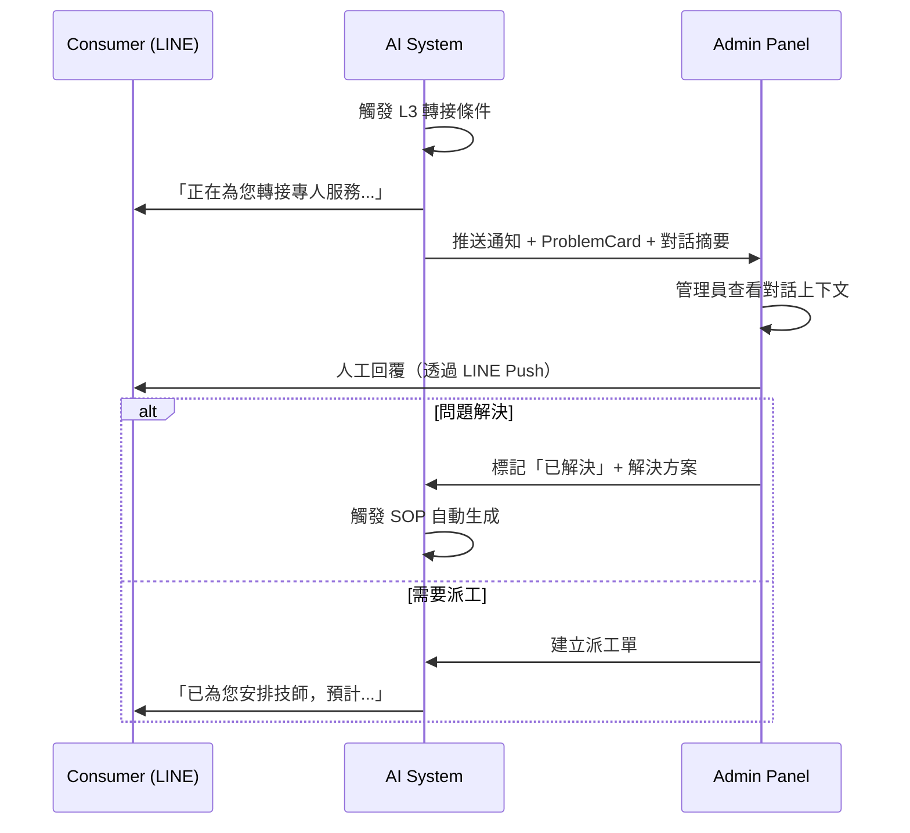

# 電子鎖智能客服與派工平台 — 模組分解與依賴關係

> **版本:** v1.0 | **日期:** 2026-03-31
> **關聯文件:** `02_project_brief_and_prd.md`, `05_architecture_and_design_document.md`, `executive_architecture_overview.md`, `WBS_電子鎖智能平台.md`

---

## 目錄

- [1. 系統架構總覽](#1-系統架構總覽)
- [2. 模組依賴關係](#2-模組依賴關係)
- [3. V1.0 模組詳細規格](#3-v10-模組詳細規格)
- [4. V2.0 模組詳細規格](#4-v20-模組詳細規格)
- [5. 跨模組共用服務](#5-跨模組共用服務)
- [6. 跨模組資料流](#6-跨模組資料流)
- [7. MVP 範圍與 12 週計畫](#7-mvp-範圍與-12-週計畫)

---

## 1. 系統架構總覽

### 1.1 三端架構圖



### 1.2 技術堆疊摘要

| 層級 | 技術選型 |
|:-----|:---------|
| 使用者介面 | LINE Messaging API (Consumer) / Next.js 14 + React 19 + shadcn/ui + Tailwind (Admin & Technician) |
| API 閘道 | FastAPI + Uvicorn / Pydantic v2 / OpenAPI / JWT + RBAC |
| AI 服務 | LangChain 0.3 LCEL / Google Gemini 2.5 Flash / text-embedding-004 / LangSmith |
| 資料存取 | SQLAlchemy 2.0 Async / asyncpg / Alembic Migration / aioredis |
| 基礎設施 | PostgreSQL 16 + pgvector 0.7 / Redis 7 / Docker Compose / TLS 1.2+ / AES-256 |

---

## 2. 模組依賴關係

### 2.1 分階段依賴圖



### 2.2 依賴矩陣

| 模組 | 依賴 | 被依賴 |
|:-----|:-----|:-------|
| M1: LINE Bot 接入 | LINE Messaging API | M2 對話管理 |
| M2: 對話管理 | M1, Redis | M3, M6 |
| M3: ProblemCard 引擎 | M2, LLM Gateway | M4, M9 |
| M4: 三層解決引擎 | M3, M5, LLM Gateway | M7, M9 |
| M5: 知識庫管理 | PostgreSQL + pgvector | M4, M6, M7 |
| M6: Admin Panel V1.0 | M2, M5 | -- |
| M9: 派工引擎 | M3 (ProblemCard), Google Maps | M10, M11, M12, M13 |
| M10: 報價引擎 | M9 | M11 |
| M11: 帳務模組 | M9, M10 | M12, M13 |
| M12: 技師 Web App | M9 | -- |
| M13: Admin Panel V2.0 | M6, M9, M11 | -- |

---

## 3. V1.0 模組詳細規格

### 3.1 M1: LINE Bot 接入模組

**職責：** 接收 LINE Webhook 事件、驗證簽章、路由事件至對應處理器、發送回覆訊息。

| 項目 | 內容 |
|:-----|:-----|
| **核心服務** | `WebhookHandler`, `MessageRouter`, `FlexMessageBuilder`, `RichMenuManager` |
| **AI 整合** | 無直接 AI 整合（純通訊層） |
| **關鍵技術** | FastAPI, line-bot-sdk-python 3, HMAC-SHA256 簽章驗證 |

**資料庫表：**

| 表名 | 關鍵欄位 | 說明 |
|:-----|:---------|:-----|
| `line_users` | `id`, `line_user_id`, `display_name`, `status_message`, `created_at` | LINE 用戶基本資料 |
| `webhook_events` | `id`, `event_type`, `line_user_id`, `payload`, `processed_at`, `created_at` | Webhook 事件日誌 |

---

### 3.2 M2: 對話管理模組

**職責：** 管理對話狀態機（Idle → Collecting → Resolving → Resolved）、Session 生命週期、多輪上下文維護。

| 項目 | 內容 |
|:-----|:-----|
| **核心服務** | `ConversationService`, `SessionManager`, `StateTransitionEngine`, `ContextTracker` |
| **AI 整合** | 對話上下文傳遞給 LLM Gateway 用於意圖識別 |
| **關鍵技術** | Redis（Session 暫存, TTL 30min）, 狀態機模式 |

**資料庫表：**

| 表名 | 關鍵欄位 | 說明 |
|:-----|:---------|:-----|
| `conversations` | `id`, `line_user_id`, `status` (idle/collecting/resolving/resolved), `started_at`, `resolved_at`, `resolution_path` (L1/L2/L3), `message_count` | 對話主表 |
| `messages` | `id`, `conversation_id`, `role` (user/assistant/system), `content`, `media_urls`, `created_at` | 對話訊息記錄 |

**Redis 結構：**

| Key Pattern | Value | TTL |
|:------------|:------|:----|
| `session:{line_user_id}` | JSON（對話狀態、已蒐集欄位、上下文摘要） | 30 min |

---

### 3.3 M3: ProblemCard 引擎

**職責：** 從自然語言對話中擷取結構化欄位，AI 輔助推斷缺失欄位，驗證完整性，生成 Flex Message 供消費者確認。

| 項目 | 內容 |
|:-----|:-----|
| **核心服務** | `ProblemCardService`, `FieldExtractor`, `CompletenessChecker`, `FlexCardRenderer` |
| **AI 整合** | Gemini 2.5 Flash — NLU 欄位擷取、缺失欄位推斷、意圖分類（維修/購買/諮詢/派工） |
| **關鍵技術** | LangChain LCEL, Pydantic Schema 約束輸出 |

**資料庫表：**

| 表名 | 關鍵欄位 | 說明 |
|:-----|:---------|:-----|
| `problem_cards` | `id`, `conversation_id`, `line_user_id`, `category`, `urgency`, `completeness_score`, `sentiment_label`, `status` (draft/confirmed/resolved), `domain_attributes` (JSONB), `created_at` | 問題診斷卡（領域無關核心 + JSONB 領域欄位） |

> **ProblemCard 領域無關設計**: 核心表欄位僅保留跨領域通用屬性（id, status, completeness_score, sentiment_label 等）。電子鎖特有欄位（brand, model, symptom, door_type, network_type, location, media_urls）遷入 `domain_attributes` JSONB，支援多垂直領域擴展而不需 Schema 變更。

**AI Prompt 範本：**
- 意圖識別 Prompt：分類用戶訊息為 `repair` / `purchase` / `inquiry` / `dispatch` / `other`
- 欄位擷取 Prompt：從對話上下文中提取 brand, model, symptom, location 等結構化欄位
- 追問生成 Prompt：根據缺失欄位生成自然的追問句

---

### 3.4 M4: 三層解決引擎 + 診斷推理引擎

**職責：** 基於 ProblemCard，透過 task_decompose 診斷推理引擎進行意圖分類與故障假設，再依序執行三層解決策略：L1 案例庫向量搜尋 → L2 RAG 手冊推理 → L3 人工轉接/建工單。

> 完整診斷架構設計詳見 `docs/agent-harness-refactor/diagnostic-intelligence-architecture.md`。

| 項目 | 內容 |
|:-----|:-----|
| **核心服務** | `ResolutionService`, `L1CaseSearcher`, `L2RAGPipeline`, `L3HumanHandoff`, `FeedbackCollector`, `DiagnosticReasoningEngine` |
| **AI 整合** | **診斷推理:** task_decompose 以 Software 3.0 模式運作（知識注入 LLM prompt → structured output），遵循 PDCA 循環。**L1:** pgvector 語意搜尋（text-embedding-004, 相似度 >= 0.85）。**L2:** RAG Pipeline — 手冊 chunks 檢索 + Gemini 整合生成（標註來源頁碼）。 |
| **關鍵技術** | pgvector HNSW 索引, LangChain LCEL Pipeline, Token 成本追蹤, FMEA 四層因果鏈 |

**診斷推理引擎（task_decompose Harness L1）：**

所有技術性查詢進入診斷推理引擎，遵循四層因果鏈：Symptom（用戶觀察）→ Failure（功能失效）→ Failure Mode（工程機制）→ Defect（物理證據，需到府確認）。

| 層級 | 角色 | 系統對應 | 可在對話中確認？ |
|:-----|:-----|:---------|:---------------|
| Symptom | 用戶看到/感覺到什麼 | `symptoms.toml` 標準標籤 + LLM 映射 | 可以 |
| Failure | 什麼功能壞了 | `failures` 定義表（JSON） | 可以推導 |
| Failure Mode | 怎麼壞的（工程機制） | `failure_modes` 表 + 故障樹 JSON | 間接推理 |
| Defect | 具體物理缺陷 | 技師到府確認 → 完工報告 | 無法（需到場） |

**資料庫表：**

| 表名 | 關鍵欄位 | 說明 |
|:-----|:---------|:-----|
| `resolution_attempts` | `id`, `problem_card_id`, `layer` (L1/L2/L3), `result`, `confidence_score`, `source_ids[]`, `feedback` (helpful/not_helpful), `created_at` | 解決嘗試記錄 |

**知識資產（診斷推理引擎使用）：**

| 資產類型 | 存儲 | 查詢方式 | 階段 |
|:---------|:-----|:---------|:-----|
| 故障樹 (KA-1) | JSON 檔案 `knowledge/fault_trees/*.json` | Python set 匹配（確定性） | Phase 1 專家建立 |
| SOP 流程 (KA-2) | JSON 檔案 `knowledge/sop/*.json` | Python dict lookup | Phase 1 數位化 |
| 症狀詞表 | TOML `taxonomy/symptoms.toml` | LLM prompt 注入 | V1.0 Day 1 |
| 元件拓撲 | TOML `taxonomy/components.toml` | Python dict（共因分析） | V1.0 Day 1 |
| 案例庫 (KA-3) | Phase 2 PostgreSQL `case_library` | SQL 結構化查詢 | Phase 2 完工回報累積 |

> 故障樹/SOP 使用 JSON 檔案而非 PostgreSQL 的理由：Phase 0-1 資料量小（20-50 份）、schema 仍在迭代、專家可直接編輯、Git 版本控制。當案例庫 > 500 筆或故障樹 > 100 份時遷移至 PostgreSQL，`KnowledgeLoader` 介面不變。

**解決流程：**



---

### 3.5 M5: 知識庫管理模組

**職責：** 案例庫 CRUD、PDF 手冊上傳/切分/Embedding、向量搜尋、SOP 自動生成/審核/發布、增量更新。

| 項目 | 內容 |
|:-----|:-----|
| **核心服務** | `KnowledgeBaseService`, `PDFParsingPipeline`, `EmbeddingBatchProcessor`, `SOPGeneratorService`, `SOPReviewWorkflow` |
| **AI 整合** | **Embedding:** text-embedding-004（768 維）批量向量化。**SOP 生成:** Gemini 從成功對話中分析並草擬 SOP（問題描述、適用條件、解決步驟、注意事項）。 |
| **關鍵技術** | PyMuPDF（PDF 解析）, pgvector HNSW 索引, 事件驅動（成功解決 → 觸發 SOP 生成） |

**資料庫表：**

| 表名 | 關鍵欄位 | 說明 |
|:-----|:---------|:-----|
| `case_entries` | `id`, `title`, `brand`, `model`, `symptom`, `solution_steps`, `embedding` (vector 768d), `source` (manual/auto_sop/import), `status` (active/archived), `hit_count`, `created_at` | 案例庫條目 |
| `manual_chunks` | `id`, `manual_id`, `chunk_index`, `content`, `embedding` (vector 768d), `page_number`, `created_at` | 手冊分段 |
| `manuals` | `id`, `brand`, `model`, `file_name`, `file_path`, `total_chunks`, `processing_status` (uploading/chunking/embedding/ready), `created_at` | 產品手冊 |
| `sop_drafts` | `id`, `conversation_id`, `problem_card_id`, `title`, `problem_description`, `applicable_conditions`, `solution_steps`, `precautions`, `status` (draft/approved/rejected/published), `reviewer_id`, `family_reviewer_id`, `created_at` | SOP 草稿 |

---

### 3.6 M-Harness: Agent Harness 框架 (harness/)

**職責：** LangGraph multi-agent 架構的 8 層運行時框架，為所有 AI agent 節點提供統一的任務分解、上下文組裝、治理閘門、安全邊界與可觀測性基礎設施。

| 項目 | 內容 |
|:-----|:-----|
| **核心服務** | `TaskDecomposer` (L1), `ContextAssembler` (L2), `GovernanceGate` (L3), `FeedbackLoop` (L4), `SafetyBoundary` (L5), `ObservabilityTap` (L6), `HumanEscalation` (L7), `EntropyTracker` (L8) |
| **AI 整合** | 包裹所有 LangGraph agent 節點，GraphState 注入 5 個 harness 欄位（harness_trace_id, governance_result, safety_flags, feedback_signals, entropy_score） |
| **關鍵技術** | LangGraph StateGraph, config.toml `[harness]` 區段集中配置, Phase 0 骨架全部 disabled |

**8 層架構摘要：**

| 層級 | 名稱 | 職責 | 護城河對應 |
|:-----|:-----|:-----|:-----------|
| L1 | Task Decomposition | 將使用者意圖拆解為可執行子任務 | Moat A + F |
| L2 | Context Assembly | 組裝 ProblemCard + 知識庫 + 對話歷史上下文 | Moat A + F |
| L3 | Governance Gate | 治理閘門：Token 預算、品質門檻、合規檢查 | -- |
| L4 | Feedback Loop | 收集使用者回饋 + 自動品質評估 | Moat F |
| L5 | Safety Boundary | Prompt Injection 攔截、PII 過濾、Output Guardrail | Moat F |
| L6 | Observability Tap | 結構化日誌、LangSmith 追蹤、成本歸因 | Moat J |
| L7 | Human Escalation | 人工介入判斷與升級路由 | -- |
| L8 | Entropy Tracker | 對話混亂度偵測、模型信心衰減追蹤 | Moat A + F |

---

### 3.7 M-Data: 資料管線模組 (data/)

**職責：** ETL 管線實作 Medallion Architecture，將原始數據（Bronze）清洗為結構化數據（Silver）再聚合為分析就緒數據（Gold）。

| 項目 | 內容 |
|:-----|:-----|
| **核心服務** | `BronzeIngestor`, `SilverTransformer`, `GoldAggregator`, `DataQualityChecker` |
| **AI 整合** | Silver 層觸發 Embedding 批量計算；Gold 層產出訓練語料供 Moat A 語言模型回訓 |
| **關鍵技術** | PostgreSQL JSONB, 事件驅動 ETL, 資料品質閘門 |

---

### 3.8 M-Frontend: 前端應用模組 (frontend/)

**職責：** V1.0 Admin Panel 前端應用，採用 Next.js 14 統一前端技術棧（取代原 Jinja2/HTMX 方案），V2.0 技師 Web App 共用同一代碼庫。

| 項目 | 內容 |
|:-----|:-----|
| **核心服務** | Next.js 14 App Router, React Server Components, shadcn/ui 元件庫 |
| **AI 整合** | 無直接 AI 整合（呈現層），透過 FastAPI REST API 消費後端服務 |
| **關鍵技術** | Next.js 14, TypeScript 5+, shadcn/ui + Tailwind CSS, PWA (V2.0 技師端) |

---

### 3.9 M6: Admin Panel V1.0

**職責：** 提供知識庫管理 UI、對話紀錄查詢、SOP 審核佇列、營運儀表板、系統設定。

| 項目 | 內容 |
|:-----|:-----|
| **核心服務** | `DashboardService`, `ConversationViewService`, `KnowledgeBaseAdminService`, `SOPReviewUIService` |
| **AI 整合** | 無直接 AI 整合（呈現層） |
| **關鍵技術** | Next.js 14 + shadcn/ui + Tailwind CSS（V1.0 起統一前端技術棧） |

**頁面清單：**

| 頁面 | 路由 | 主要功能 |
|:-----|:-----|:---------|
| 營運儀表板 | `/dashboard` | 今日對話數、自助解決率、問題分布、品牌排行 |
| 對話列表 | `/conversations` | 按日期/狀態/消費者篩選，標示解決途徑 |
| 對話詳情 | `/conversations/[id]` | 完整對話記錄、ProblemCard、解決路徑 |
| 問題卡列表 | `/problem-cards` | 按狀態/品牌/日期篩選 |
| 案例庫 | `/knowledge-base/cases` | 案例 CRUD、CSV 匯入 |
| 手冊管理 | `/knowledge-base/manuals` | PDF 上傳、處理進度、品牌分類 |
| SOP 審核佇列 | `/knowledge-base/sop-drafts` | 待審核 SOP 列表 |
| SOP 審核面板 | `/knowledge-base/sop-drafts/[id]` | 審核/核准/退回/刪除 |
| 系統設定 | `/settings` | 帳號管理、系統配置 |

---

## 4. V2.0 模組詳細規格

### 4.1 M9: 派工引擎

**職責：** 技師自動匹配（技能 x 地區 x 評分 x 可用時段）、工單生命週期管理（Created → Assigned → InProgress → Completed）、推播通知。

| 項目 | 內容 |
|:-----|:-----|
| **核心服務** | `DispatchService`, `TechnicianMatcher`, `WorkOrderLifecycleManager`, `NotificationDispatcher` |
| **AI 整合** | 無直接 AI 整合（規則引擎匹配） |
| **關鍵技術** | 匹配演算法（加權評分：距離 40% + 技能匹配 30% + 歷史評分 20% + 負載均衡 10%）, WebSocket (即時更新), Google Maps Distance API |

**資料庫表：**

| 表名 | 關鍵欄位 | 說明 |
|:-----|:---------|:-----|
| `work_orders` | `id`, `problem_card_id`, `technician_id`, `status` (created/assigned/in_progress/completed/cancelled), `address`, `latitude`, `longitude`, `estimated_price`, `final_price`, `eta`, `started_at`, `completed_at`, `created_at` | 派工工單 |
| `technicians` | `id`, `user_id`, `name`, `phone`, `skills[]` (品牌認證), `service_regions[]`, `availability_status` (available/busy/offline), `rating`, `total_completed`, `created_at` | 技師資料 |
| `technician_skills` | `id`, `technician_id`, `brand`, `lock_type`, `certification_date`, `expiry_date` | 技師技能認證 |
| `dispatch_logs` | `id`, `work_order_id`, `matched_technicians[]`, `accepted_by`, `dispatch_type` (auto/manual), `created_at` | 派工匹配記錄 |

**工單生命週期：**



---

### 4.2 M10: 報價引擎

**職責：** 維護品牌 x 鎖型 x 工項的標準報價矩陣，計算加價項目（夜間/假日/遠程/高樓），自動生成報價單。

| 項目 | 內容 |
|:-----|:-----|
| **核心服務** | `PricingService`, `PriceMatrixManager`, `SurchargeCalculator`, `QuotationGenerator` |
| **AI 整合** | 無直接 AI 整合（規則引擎） |
| **關鍵技術** | 規則引擎模式、多條件疊加計算 |

**資料庫表：**

| 表名 | 關鍵欄位 | 說明 |
|:-----|:---------|:-----|
| `price_rules` | `id`, `brand`, `lock_type`, `work_item`, `base_labor`, `base_material`, `total`, `effective_from`, `effective_to`, `version` | 標準報價矩陣 |
| `surcharge_rules` | `id`, `name`, `trigger_condition` (night/holiday/distance/high_floor), `surcharge_type` (fixed/percentage), `surcharge_value`, `priority`, `is_active`, `created_at` | 加價規則 |
| `quotations` | `id`, `work_order_id`, `base_price`, `surcharges[]`, `total_price`, `status` (draft/confirmed/final), `created_at` | 報價單 |

**預設加價規則：**

| 規則名稱 | 觸發條件 | 加價方式 |
|:---------|:---------|:---------|
| 夜間加價 | 22:00-06:00 | +30% |
| 假日加價 | 國定假日/週日 | +50% |
| 遠程加價 | 距離 > 30km | +$500 固定 |
| 高樓加價 | 樓層 > 5F（無電梯） | +$200/層 |

---

### 4.3 M11: 帳務模組

**職責：** 技師墊付款追蹤、月度結算報表、對帳單、記帳憑證（借方/貸方科目）產出。

| 項目 | 內容 |
|:-----|:-----|
| **核心服務** | `AccountingService`, `AdvanceTracker`, `MonthlySettlementGenerator`, `VoucherGenerator`, `ReconciliationService` |
| **AI 整合** | 無直接 AI 整合 |
| **關鍵技術** | PostgreSQL 交易（ACID）、PDF 報表生成、CSV/Excel 匯出 |

**資料庫表：**

| 表名 | 關鍵欄位 | 說明 |
|:-----|:---------|:-----|
| `transactions` | `id`, `work_order_id`, `technician_id`, `type` (payment/advance/settlement/refund), `amount`, `description`, `status` (pending/approved/rejected/settled), `created_at` | 帳務交易記錄 |
| `advance_claims` | `id`, `work_order_id`, `technician_id`, `amount`, `receipt_photo_url`, `status` (submitted/approved/rejected), `reviewed_by`, `reviewed_at` | 墊付款申請 |
| `monthly_settlements` | `id`, `technician_id`, `month`, `total_cases`, `total_labor`, `total_advances`, `deductions`, `net_amount`, `status` (draft/approved/paid), `approved_by`, `created_at` | 月度結算 |
| `accounting_vouchers` | `id`, `settlement_id`, `voucher_number`, `debit_account`, `credit_account`, `amount`, `description`, `created_at` | 記帳憑證 |

**完工報告（含診斷閉環）：**

> 完工報告不只是行政文件，而是知識閉環的關鍵數據。設計詳見 `diagnostic-intelligence-architecture.md` §3 Layer 6。

| 表名 | 關鍵欄位 | 說明 |
|:-----|:---------|:-----|
| `service_reports` | `id`, `work_order_id`, `problem_card_id`, `technician_id`, `predicted_fm_ids` (AI 預測的 Failure Mode), `actual_fm_id` (技師確認的實際 FM), `ai_prediction_hit` (Boolean), `defect_type` (material/process/design/operation/other), `defect_description`, `corrective_action`, `preventive_action`, `parts_used` (JSONB), `duration_minutes`, `total_cost`, `verification` (JSONB: fingerprint/bluetooth/password 各項通過), `customer_sign_off`, `created_at` | 完工報告（含 AI 假設驗證 + 缺陷分類 + 修復紀錄） |
| `service_report_artifacts` | `id`, `report_id`, `artifact_type` (photo/video/measurement), `storage_url`, `description`, `uploaded_at` | 完工報告附件（照片/影片/量測數據） |

> **缺陷分類漸進策略**: Phase 2 Day 1 僅提供 5 個粗分類（material/process/design/operation/other）+ 自由文字描述。累積 ~100 案後，從自由文字中提煉 Level 2 標準標籤（如 material → 排線接觸不良 / 電池接點氧化）。累積 ~500 案後標籤體系穩定。

---

### 4.4 M12: 技師 Web App

**職責：** 提供案件池瀏覽、一鍵接單、完工報告提交、個人帳務中心。Mobile-First PWA 設計。

| 項目 | 內容 |
|:-----|:-----|
| **核心服務** | `CasePoolService`, `OrderAcceptanceService`, `CompletionReportService`, `TechnicianAccountService` |
| **AI 整合** | 無直接 AI 整合（呈現層） |
| **關鍵技術** | Next.js 14 + PWA, Responsive Design (Mobile-First), Web Push API |

**頁面清單：**

| 頁面 | 路由 | 主要功能 |
|:-----|:-----|:---------|
| 技師登入 | `/tech-login` | 身分驗證 |
| 案件池 | `/pool` | 可接案件瀏覽、排序（距離/報酬/緊急度） |
| 我的工單 | `/my-orders` | 已接案件管理 |
| 工單詳情/完工回報 | `/my-orders/[id]` | 查看詳情、提交完工報告（照片+材料+工時） |
| 帳戶中心 | `/account` | 收入統計、墊付款狀態、歷史工單 |

---

### 4.5 M13: Admin Panel V2.0

**職責：** 在 V1.0 基礎上擴展：營運儀表板（派工指標）、派工監控、技師管理、帳務審核、客訴處理。

| 項目 | 內容 |
|:-----|:-----|
| **核心服務** | `OperationsDashboardService`, `DispatchMonitorService`, `TechnicianManagementService`, `AccountingAdminService`, `ComplaintManagementService` |
| **AI 整合** | 無直接 AI 整合（呈現層） |
| **關鍵技術** | Next.js 14 + shadcn/ui + Tailwind, Google Maps 視覺化 |

**新增頁面：**

| 頁面 | 路由 | 主要功能 |
|:-----|:-----|:---------|
| 工單列表 | `/work-orders` | 全生命週期追蹤、狀態篩選、逾時告警 |
| 工單詳情 | `/work-orders/[id]` | Timeline、手動指派、狀態變更 |
| 技師管理 | `/technicians` | 技師 CRUD、技能認證、服務區域 |
| 技師詳情 | `/technicians/[id]` | 績效統計、技能到期提醒 |
| 帳務管理 | `/accounting` | 月結報表、墊付款審核、憑證匯出 |

---

## 5. 跨模組共用服務

| 服務 | 職責 | 使用模組 |
|:-----|:-----|:---------|
| **UserManagement** | LINE 用戶綁定、技師/管理員帳號、JWT 認證、RBAC 權限 (admin / reviewer / technician / line_user) | 全模組 |
| **LLMGateway** | 統一 LLM 呼叫入口、Prompt 模板管理、Token 追蹤、Retry/Fallback、LangSmith 追蹤 | M3, M4, M5 (SOP) |
| **EmbeddingService** | text-embedding-004 批量向量化、向量正規化 | M4 (搜尋), M5 (索引) |
| **NotificationService** | LINE Push Message、Web Push (技師端)、系統內通知 | M1, M9, M12 |
| **ObservabilityStack** | 結構化日誌 (JSON + trace_id)、LangSmith LLM 追蹤、Health Check API | 全模組 |

---

## 6. 跨模組資料流

### 6.1 完整資料流圖：從報修到結算



---

## 7. MVP 範圍與 12 週計畫

### 7.1 MVP 定義（Phase 0-2, W1-W12）

MVP 聚焦於「AI 智能客服 + 知識庫管理」的閉環，不含派工與帳務。

| 週次 | 里程碑 | 交付模組 | 關鍵產出 |
|:-----|:-------|:---------|:---------|
| W1-W2 | Phase 0: 架構設計 | -- | SRS, DB Schema, API Spec, ProblemCard Schema |
| W3-W4 | LINE Bot 基礎 | M1: LINE Bot 接入, M2: 對話管理 | Bot 可對話、多輪 Session、圖片接收 |
| W4-W5 | 問題卡引擎 | M3: ProblemCard 引擎 | NLU 擷取、Flex Message 確認、意圖分類 |
| W5-W7 | 三層解決引擎 | M4: 三層解決引擎 | L1 向量搜尋、L2 RAG Pipeline、L3 人工轉接 |
| W7 | Admin 基礎 | M6: Admin Panel V1.0 (基礎) | 登入、ProblemCard 列表、對話記錄 |
| W8-W9 | 知識庫大規模匯入 | M5: 知識庫管理 | 全品牌手冊向量化、歷史案例匯入 |
| W9-W10 | Prompt 工程優化 | M4 調校 | 準確率 >= 80%（50 題測試） |
| W10-W11 | 自進化知識庫 | M5: SOP 自動生成 | SOP 自動生成 → 審核 → 一鍵發布 |
| W11-W12 | Admin 完整版 | M6: Admin Panel V1.0 (完整) | 儀表板、知識庫管理、SOP 審核 |

### 7.2 V2.0 延伸（Phase 5-8, W18-W31）

| 週次 | 里程碑 | 交付模組 |
|:-----|:-------|:---------|
| W18-W19 | V2.0 需求與設計 | -- |
| W20-W22 | 技師工作台 | M12: 技師 Web App |
| W22-W24 | 派工 + 報價 | M9: 派工引擎, M10: 報價引擎 |
| W25-W27 | 帳務系統 | M11: 帳務模組 |
| W27-W28 | Admin V2.0 | M13: Admin Panel V2.0 |
| W28-W31 | 整合測試 + UAT + 上線 | 全模組 |

### 7.3 知識資產冷啟動 Phase 與 SOW Phase 對齊

> 完整冷啟動設計詳見 `docs/agent-harness-refactor/optimization-strategy.md` §6 冷啟動策略。

診斷推理引擎的知識資產有獨立的成熟度階段（Phase 0/1/2），與 SOW 的 8 階段開發計畫（Phase 0-8）映射如下：

| 知識資產 Phase | SOW Phase | 週次 | 狀態 | 關鍵動作 |
|:--------------|:----------|:-----|:-----|:---------|
| **Phase 0 — 收集** | SOW Phase 1-4 (V1.0) | W3-W17 | 診斷 Tier 2 關閉，Tier 1 意圖分類啟用 | L7 收集 symptoms 組合 + 轉人上下文；L8 監測高頻未匹配症狀 |
| **Phase 1 — 建構** | SOW Phase 5 (V2.0 設計) | W17-W19 | 專家建立 TOP 20 故障樹 + SOP 數位化 | 匯出 L7 數據給維修專家；建立 10-20 份故障樹 JSON + 5-10 份 SOP JSON |
| **Phase 2 — 自轉** | SOW Phase 6+ (V2.0 開發) | W20+ | 診斷 Tier 2 開啟，知識閉環自動運轉 | 完工報告累積 → 故障樹權重統計修正 → 知識飛輪 |

| 知識資產 | Phase 0 | Phase 1 來源 | Phase 2 進化 |
|:---------|:--------|:------------|:------------|
| 症狀詞表 | 已建立 (symptoms.toml) | L8 unknown 頻率補充 | 持續新增 |
| 故障樹 | 不存在 | 維修專家 + L7 數據 → JSON | 案例庫統計修正權重 |
| SOP | 紙本/Word | 營運團隊數位化 → JSON | 業務調整時人工更新 |
| 案例庫 | 不存在 | — | V2.0 完工回報自動累積 |

---

## 8. 三機制疊加架構：Fan-out × Cascade × Harness

> 完整設計詳見 `docs/agent-harness-refactor/optimization-strategy.md`。

### 8.1 三機制角色分工

系統同時使用三個正交機制，各解決不同問題：

| 機制 | 解決什麼 | 層級 | 延遲成本 |
|:-----|:---------|:-----|:---------|
| **Multi-Agent Fan-out** | **問誰** — 意圖→知識庫派發 | Graph 層（task_decompose + router） | 0s（平行） |
| **Three-Layer Cascade** | **找不找得到** — 每個 agent 內部的 fallback | Agent 內部（tool execution） | +1-3s（worst case） |
| **Harness L5 Verify** | **答得好不好** — 品質閘門 | 跨 Agent（post-merge） | +1.5-5s（V1.2+ 啟用） |

### 8.2 巨觀流程：task_decompose → Router → Agent Cascade



### 8.3 M4 三層解決引擎與 Agent Cascade 的關係

M4 定義的「L1 案例庫搜尋 → L2 RAG → L3 轉人」是**巨觀解決路徑**；每個 Agent 內部的 Three-Layer Cascade 是**微觀 fallback 機制**。兩者嵌套而非衝突：

| 層次 | M4 巨觀（解決路徑） | Agent 微觀（Cascade） |
|:-----|:-------------------|:---------------------|
| L1 | `case_entries` pgvector ≥0.85 | Agent 主要知識庫 pgvector ≥0.85 |
| L2 | RAG Pipeline（manual_chunks + Gemini） | Agent fallback_tools（其他 KB collections） |
| L3 | 人工轉接 / 建工單 | transfer_to_human（帶完整上下文） |

> M4 的 L1 `case_entries` 搜尋由 task_decompose 在 Agent 啟動前執行（Tier 2 診斷推理引擎）。Agent 內部的 Cascade L1 是該 Agent 專屬知識庫的搜尋。

### 8.4 Agent-to-Resolution 對應表

| Agent | 主要 Vector Collection (L1) | Fallback Tools (L2) | 職責 |
|:------|:---------------------------|:--------------------|:-----|
| Hardware Technician | `kb_video` | `kb_line_chat`, `manual_chunks` | 硬體維修知識檢索 |
| Sales Representative | `kb_line_chat` | `kb_website` | LINE 對話服務記錄 |
| Store Assistant | `kb_website` | — | 官網門市資訊 |
| App Specialist | `kb_youtube` | `manual_chunks` | APP 教學影片知識 |
| Manual Librarian | `manual_chunks` | — | PDF 產品手冊 RAG |
| Web Researcher | DuckDuckGo (外部) | — | 即時網路搜尋 |
| Receptionist | 無檢索工具 | — | 通用接待，直接觸發 L3 |

### 8.5 Router 設計決策：零 LLM 確定性派發

```python
# Router — 純 config mapping，零 LLM，100% 可測試
def router(state: GraphState) -> dict:
    intents = state["intents"]  # from task_decompose
    intent_agent_map = load_intent_agent_map()  # from config.toml
    next_agents = [intent_agent_map[i] for i in intents]
    return {"next_agents": next_agents}
```

task_decompose（Harness L1）是唯一的「理解」節點，Router 只做查表派發。原雙 LLM 設計（task_decompose LLM + router LLM）合併為單 LLM，消除分類不一致風險並節省 ~1.5s 延遲。

### 8.6 三層命中率目標

| 層 | 目標 | 量測方式 |
|:---|:-----|:---------|
| L1（primary pgvector ≥0.85） | ≥ 60% | L7 Observability `l1_hit_rate` |
| L1+L2 合計 | ≥ 80% | L7 `l1_hit_rate + l2_fallback_rate` |
| L3（transfer_to_human） | ≤ 20% | L7 `l3_transfer_rate` |

---

## 9. Vector Collections 完整規格

### 9.1 向量表清單

系統共使用 **7 個向量存儲**（5 個知識庫 vector collections + 2 個核心業務 embedding 表），全部基於 PostgreSQL 16 + pgvector 0.7 HNSW 索引。

| 表名 / Collection | 維度 | 索引策略 | 用途 | 資料來源 | 對應 Agent |
|:-------------------|:-----|:---------|:-----|:---------|:-----------|
| `case_entries` | 768 | HNSW | L1 案例庫向量搜尋 | 歷史案例匯入 + SOP 自動生成 | — (L1 直接搜尋) |
| `manual_chunks` | 768 | HNSW | L2 RAG 手冊檢索 | PDF 手冊切分 | Manual Librarian |
| `kb_video` | 768 | HNSW | 硬體維修影片字幕/摘要 | YouTube 影片轉錄 | Hardware Technician |
| `kb_line_chat` | 768 | HNSW | LINE 對話服務記錄 | 歷史 LINE 對話匯入 | Sales Representative |
| `kb_website` | 768 | HNSW | 官網門市資訊 | 網站爬蟲 / 手動匯入 | Store Assistant |
| `kb_youtube` | 768 | HNSW | APP 教學影片知識 | YouTube 影片轉錄 | App Specialist |
| `kb_gdrive` | 768 | HNSW | Google Drive 內部文件 | Drive API 同步 | — (輔助檢索) |

### 9.2 與 SOW 資料模型的對應

- **SOW 核心表**: `case_entries` + `manual_chunks` — 這是三層解決引擎的主要資料來源。
- **ERD 擴展表**: `kb_video`, `kb_line_chat`, `kb_website`, `kb_youtube`, `kb_gdrive` — 這是 7-Agent 架構中各 Agent 的專屬知識庫。
- **實作順序**: V1.0 僅啟用 `case_entries` + `manual_chunks`；其餘 5 個 collection 隨知識庫擴展逐步啟用。

---

## 10. 異常流程設計

### 10.1 客訴與爭議處理



| 異常類型 | 觸發條件 | 處理流程 | 負責角色 |
|:---------|:---------|:---------|:---------|
| **消費者投訴** | 消費者主動提出 / 情緒偵測觸發 | 建立客訴單 → 管理員指派 → 調查 → 方案 → 確認 | Admin |
| **服務品質爭議** | 消費者評分 < 3 / 回饋「不滿意」 | 自動標記 → 管理員審核 → 聯繫消費者 → 補救措施 | Admin |
| **重複投訴** | 同消費者 30 天內 >= 2 次投訴 | 升級為 Red_Code → 優先處理 → 主管介入 | Admin + 主管 |

### 10.2 派工異常流程

| 異常類型 | 觸發條件 | 系統處理 | 通知對象 |
|:---------|:---------|:---------|:---------|
| **技師拒絕接單** | 所有匹配技師均未在 30 分鐘內接單 | 擴大匹配範圍 → 降低技能匹配門檻 → 管理員手動指派 | Admin |
| **技師取消已接單** | 接單後 30 分鐘內取消（免責）/ 超過 30 分鐘取消（記錄） | 工單狀態回退 `Created` → 重新派工 → 通知消費者延遲 | Consumer + Admin |
| **逾時未出發** | 接單後 > 預設 ETA 未標記出發 | 系統告警 → Admin 確認 → 可重新派工 | Admin |
| **現場改約/延後** | 技師到場後發現需二次上門 | 技師透過 App 申請改約 → Admin 審核 → 消費者確認新時段 | Consumer + Admin |
| **派工錯誤修正** | Admin 發現指派不當 | 手動撤回 → 重新指派 → 通知原技師與消費者 | Technician + Consumer |

### 10.3 現場施工異常

| 異常類型 | 觸發條件 | 系統處理 | 通知對象 |
|:---------|:---------|:---------|:---------|
| **現場加價** | 實際工項超出原報價範圍 | 技師透過 App 提交加價申請 → 消費者確認 → PricingEngine 重新計算 | Consumer |
| **材料短缺** | 現場所需材料未攜帶 | 技師標記「材料不足」→ 工單暫停 → 排二次上門 | Consumer + Admin |
| **無法維修** | 問題超出技師能力範圍 | 技師標記「無法維修」+ 原因 → 工單退回 → 升級資深技師或退費 | Consumer + Admin |
| **消費者不在場** | 預約時段消費者未到 | 技師等待 15 分鐘 → 標記「消費者未到」→ 可收取出車費 | Consumer + Admin |

### 10.4 財務異常

| 異常類型 | 觸發條件 | 系統處理 | 審核層級 |
|:---------|:---------|:---------|:---------|
| **報價爭議** | 消費者質疑報價金額 | 凍結帳務 → 管理員審核報價明細 → 調整或維持 | Admin |
| **退費申請** | 消費者要求退費 | 建立退費單 → 管理員審核 → 財務核准 → 執行退費 | Admin + 財務 |
| **墊付款爭議** | 技師墊付金額與發票不符 | 凍結結算 → 管理員核對 → 補差額或駁回 | Admin |
| **逾期未付款** | 消費者 > 7 天未完成付款 | 系統提醒 → 3 次催繳 → 標記為逾期 → 管理員人工跟進 | Admin |

### 10.5 知識庫與 AI 異常

| 異常類型 | 觸發條件 | 系統處理 |
|:---------|:---------|:---------|
| **AI 回覆品質下降** | 連續 3 天準確率 < 70% | 自動告警 → Admin 審核近期對話 → Prompt 調校 |
| **L1 命中率驟降** | 日命中率較 7 日均值下降 > 15% | 告警 → 檢查知識庫更新記錄 → 確認向量索引完整性 |
| **SOP 草稿品質差** | 審核退回率 > 50% | 告警 → 調整 SOP 生成 Prompt → 提高觸發門檻 |

---

## 11. Human-in-the-Loop (HITL) 設計

### 11.1 人工介入觸發條件

| 觸發場景 | 判定條件 | 介入方式 |
|:---------|:---------|:---------|
| **L1 + L2 均未命中** | 三層引擎 L1/L2 皆無有效結果 | 自動轉接人工客服 |
| **消費者主動要求** | 訊息包含「找真人」「轉接」等關鍵字 | 即時轉接 |
| **負面情緒升級** | 情緒偵測 >= 0.85 且連續 2 輪負面 | 優先轉接 + 管理員通知 |
| **危險操作偵測** | 消費者描述涉及觸電、門鎖卡死人員受困等安全風險 | 立即轉接 + 緊急標記 |
| **多輪未解決** | 同一 ProblemCard 超過 5 輪對話仍未解決 | 自動轉接 |
| **保固/價格爭議** | 涉及保固範圍、報價合理性等商業判斷 | 轉接管理員 |

### 11.2 人工接管流程



### 11.3 人工→系統回交

- **解決方案記錄**: 管理員在 Admin Panel 填寫解決方案 → 系統記錄至 `resolution_attempts`（layer = L3）→ 觸發 SOP 自動生成。
- **對話歷史保留**: 人工對話記錄與 AI 對話記錄統一存儲於 `messages` 表，`sender_type` 區分 `ai` / `human_agent`。
- **回交觸發**: 管理員標記案件為「已解決」後，系統自動恢復 AI 對話模式，發送滿意度調查。

### 11.4 離線時段處理

| 時段 | 行為 |
|:-----|:-----|
| **上班時間 (09:00-18:00)** | L3 觸發 → 即時推送管理員 → 期望 5 分鐘內回應 |
| **非上班時間** | L3 觸發 → 自動回覆「已記錄，上班時間優先處理」→ 建立待辦工單 → 隔日上班首先處理 |
| **緊急案件（非上班時間）** | 危險操作 / Red_Code → LINE 推送值班人員 → 電話通知 |

---

## 12. CRM 與客訴管理模組 (M14)

### 12.1 模組定義

**職責：** 客訴生命週期管理、消費者滿意度追蹤、技師評分模型、客戶歷史統一視圖。

| 項目 | 內容 |
|:-----|:-----|
| **核心服務** | `ComplaintService`, `SatisfactionSurveyService`, `TechnicianRatingService`, `CustomerProfileService` |
| **AI 整合** | 情緒偵測觸發自動建立客訴單；滿意度趨勢分析 |
| **關鍵技術** | PostgreSQL JSONB (客戶歷史), LINE Flex Message (滿意度問卷), 加權平均評分 |

### 12.2 資料庫表

| 表名 | 關鍵欄位 | 說明 |
|:-----|:---------|:-----|
| `complaints` | `id`, `consumer_id`, `work_order_id`, `type` (service_quality/price_dispute/delay/other), `description`, `status` (submitted/assigned/in_progress/pending_confirm/resolved), `assigned_to`, `resolution`, `created_at`, `resolved_at` | 客訴記錄 |
| `satisfaction_surveys` | `id`, `work_order_id`, `consumer_id`, `overall_rating` (1-5), `timeliness_rating`, `quality_rating`, `attitude_rating`, `comment`, `created_at` | 滿意度調查 |
| `technician_ratings` | `id`, `technician_id`, `period_start`, `period_end`, `avg_rating`, `completion_rate`, `on_time_rate`, `first_fix_rate`, `complaint_count`, `calculated_at` | 技師績效評分（週期性計算） |

### 12.3 客戶統一視圖

Admin Panel 中提供消費者完整歷史：

- 所有對話記錄（含 ProblemCard）
- 所有工單與維修記錄
- 所有客訴與處理結果
- 滿意度評分歷史
- 消費者標籤（VIP / 重複客訴 / 新客戶）

---

## 13. 使用者角色模型

### 13.1 角色定義

| 角色 | 身份 | 介面 | 權限範圍 | 階段 |
|:-----|:-----|:-----|:---------|:-----|
| **line_user** | 消費者 | LINE Bot | 自身對話記錄讀取、回饋提交 | V1.0 |
| **technician** | 簽約維修技師 | Technician Web App | 自身工單 CRUD、收入查看、完工報告提交 | V2.0 |
| **reviewer** | 知識庫審核員 | Admin Panel (受限) | 對話記錄唯讀、知識庫唯讀、SOP 審核（核准/退回） | V1.0 |
| **admin** | 營運管理員 | Admin Panel (完整) | 全資源 CRUD、系統設定、派工覆寫、帳務審核 | V1.0 |

### 13.2 V2.0+ 預留角色（B2B 擴展）

| 預留角色 | 身份 | 設計目的 | 啟用時機 |
|:---------|:-----|:---------|:---------|
| **brand_oem** | 品牌原廠 / OEM | 產品資料上傳 API、報修統計查閱、韌體更新公告 | 品牌合作階段 |
| **distributor** | 經銷商 / 服務中心 | 區域報修查閱、技師調度建議、庫存同步 | 經銷網路擴展 |
| **community_manager** | 社區 / 建商管理員 | 批量報修提交、社區設備統一管理、服務排程 | 社區/建案合作 |

> **實作說明**: RBAC 權限表在 V1.0 即建立完整 schema（含 `role`, `resource`, `action` 三元組），預留角色透過新增 role 記錄即可啟用，無需 Schema 變更。

### 13.3 RBAC 權限矩陣

| 資源 | line_user | technician | reviewer | admin |
|:-----|:----------|:-----------|:---------|:------|
| conversations (own) | R | — | R | CRUD |
| conversations (all) | — | — | R | CRUD |
| problem_cards | R (own) | R (assigned) | R | CRUD |
| knowledge_base | — | — | R | CRUD |
| sop_drafts | — | — | R + Approve/Reject | CRUD |
| work_orders | R (own) | RU (own) | R | CRUD |
| technicians | — | R (self) | — | CRUD |
| accounting | — | R (own) | — | CRUD |
| complaints | CU (own) | R (related) | R | CRUD |
| system_config | — | — | — | CRUD |

---

> **文件結尾**
> 本文件定義了電子鎖智能客服與派工平台的模組分解、依賴關係、資料庫設計與開發計畫，作為系統開發的架構參考。
