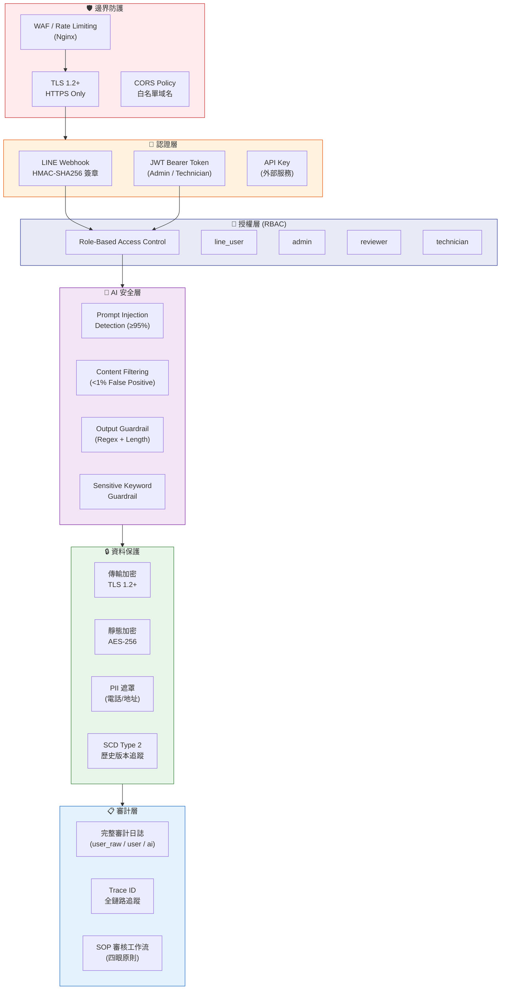
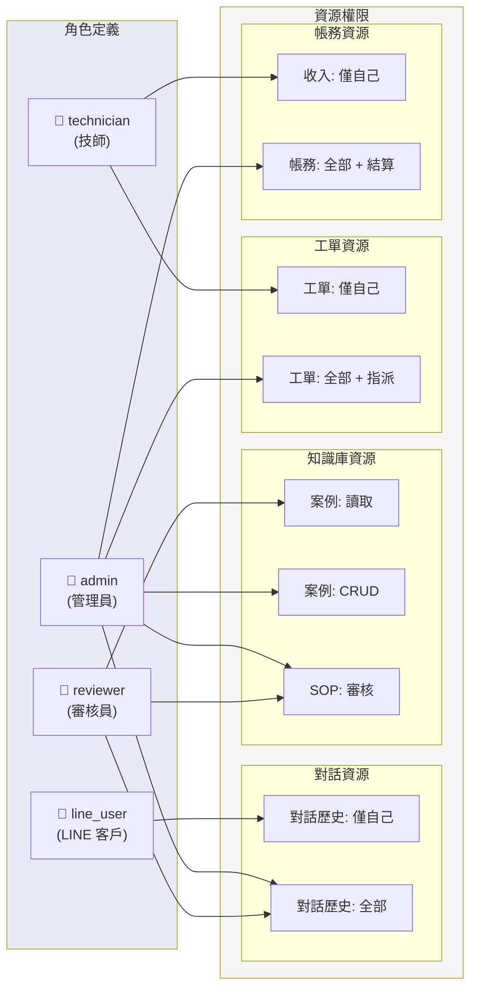
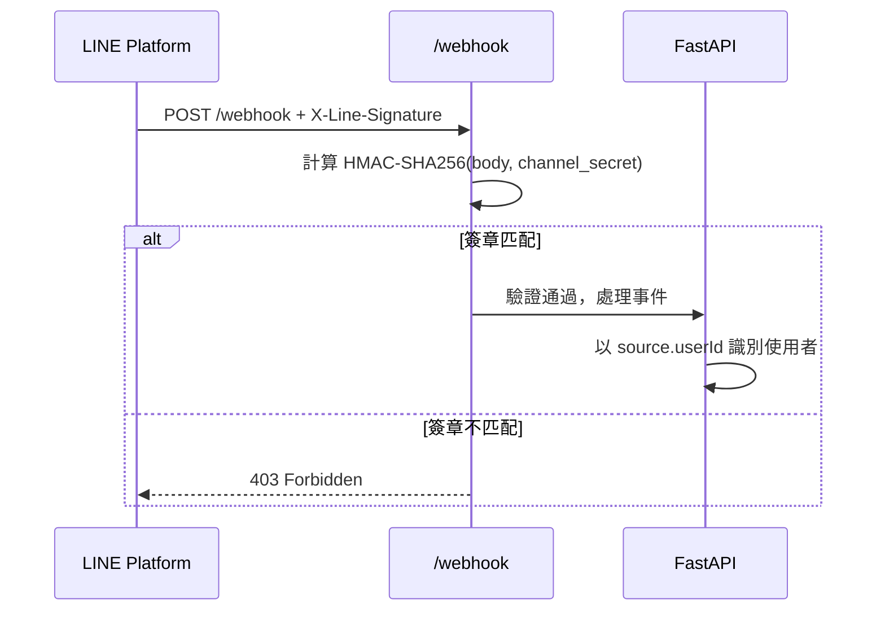
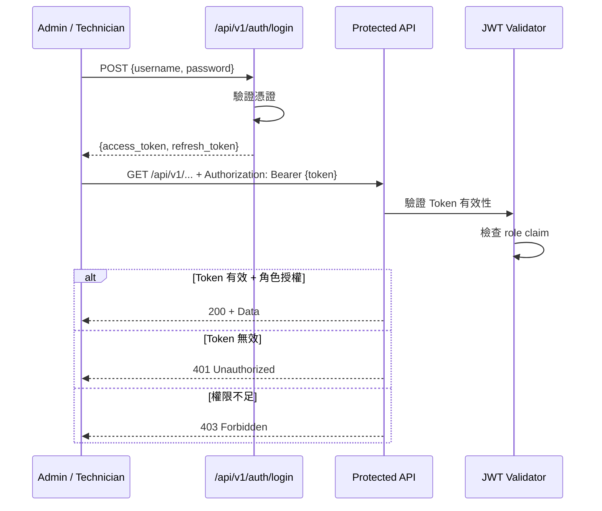
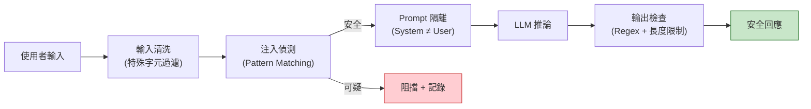

# 10 — Security / Permission Diagram（安全與權限圖）

> **為什麼重要？** 定義權限與風險控制，確保系統安全性符合企業級標準。

## 概述

本圖涵蓋平台的認證授權架構、RBAC 權限矩陣、資料保護策略、AI 安全防護以及合規審計機制。

---

## 安全架構總覽

---

## RBAC 權限矩陣

---

## 詳細權限矩陣

| 資源 | 操作 | line_user | technician | reviewer | admin |
|:-----|:-----|:---------:|:----------:|:--------:|:-----:|
| **對話歷史** | 讀取（自己） | ✅ | — | — | — |
| **對話歷史** | 讀取（全部） | — | — | ✅ | ✅ |
| **對話歷史** | 接收通知 | ✅ | — | — | — |
| **對話歷史** | 提供回饋 | ✅ | — | — | — |
| **知識庫案例** | 讀取 | — | — | ✅ | ✅ |
| **知識庫案例** | 新增/修改/刪除 | — | — | — | ✅ |
| **SOP 草稿** | 讀取 | — | — | ✅ | ✅ |
| **SOP 草稿** | 核准/退回 | — | — | — | ✅ |
| **產品手冊** | 上傳 | — | — | — | ✅ |
| **工單** | 讀取（自己） | — | ✅ | — | — |
| **工單** | 讀取（全部） | — | — | — | ✅ |
| **工單** | 接單/完工回報 | — | ✅ | — | — |
| **工單** | 建立/指派/取消 | — | — | — | ✅ |
| **技師資料** | 讀取（自己） | — | ✅ | — | — |
| **技師資料** | 管理（全部） | — | — | — | ✅ |
| **帳務/收入** | 查看（自己） | — | ✅ | — | — |
| **帳務/月結** | 生成/確認 | — | — | — | ✅ |
| **儀表板** | 查看 | — | — | — | ✅ |
| **系統設定** | 修改 | — | — | — | ✅ |

---

## 認證流程

### LINE 使用者認證

### Admin / Technician JWT 認證

---

## AI 安全防護

### Prompt Injection 防禦

### 安全指標

| 防護機制 | 目標 | 衡量方式 |
|:---------|:-----|:---------|
| Prompt Injection 偵測 | ≥ 95% 攔截率 | 測試集驗證 |
| 內容過濾 | < 1% 誤判率 | False Positive 統計 |
| 敏感關鍵字攔截 | 100% 攔截 | 「報價/價格/多少錢」→ 轉接人工 |
| 輸出長度限制 | ≤ 2000 字元 | Regex 檢查 |
| System Prompt 隔離 | 100% 隔離 | 架構保證（永不合併 user input） |

---

## 資料保護策略

| 保護層級 | 機制 | 適用範圍 |
|:---------|:-----|:---------|
| **傳輸中** | HTTPS / TLS 1.2+ | 所有 API 通訊 |
| **靜態** | AES-256 加密 | 敏感欄位（電話、地址、Email） |
| **PII 存取** | 角色限制 | 僅 admin 可查看完整 PII |
| **歷史追蹤** | SCD Type 2 | User Facts 異動歷史保留 |
| **審計日誌** | 全量記錄 | user_raw / user / ai 三類訊息 |
| **影像處理** | 僅附件存儲 | 不進行圖片 AI 分析（合約限制） |
| **密鑰管理** | .env + Secrets Manager | API Key、Channel Secret、DB 密碼 |

---

## 威脅模型摘要

| 威脅 | 風險等級 | 防護措施 |
|:-----|:---------|:---------|
| Prompt Injection | 高 | 輸入清洗 + 偵測模型 + Prompt 隔離 |
| 未授權 API 存取 | 高 | JWT + RBAC + Rate Limiting |
| 資料洩漏 | 高 | AES-256 + PII 遮罩 + 角色控制 |
| DDoS 攻擊 | 中 | Nginx Rate Limiting + CDN |
| LINE Webhook 偽造 | 中 | HMAC-SHA256 簽章驗證 |
| SQL Injection | 中 | SQLAlchemy ORM (參數化查詢) |
| XSS 攻擊 | 低 | Next.js 自動轉義 + CSP Headers |
| 密鑰外洩 | 高 | .env 不入版控 + Secrets Manager |
