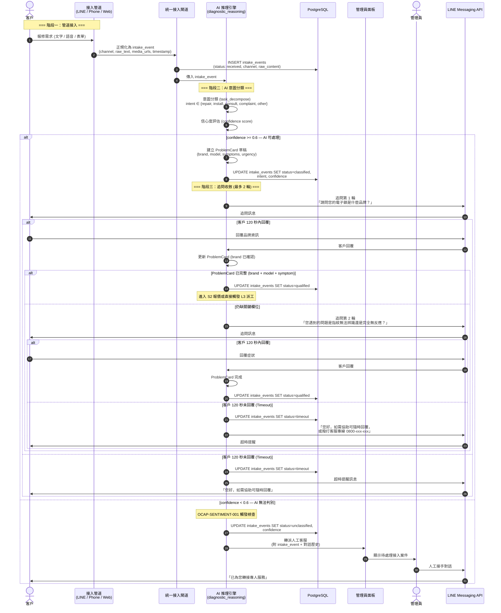
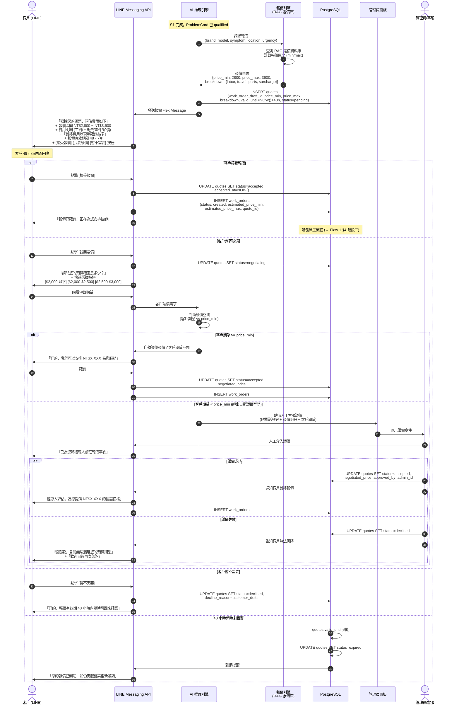
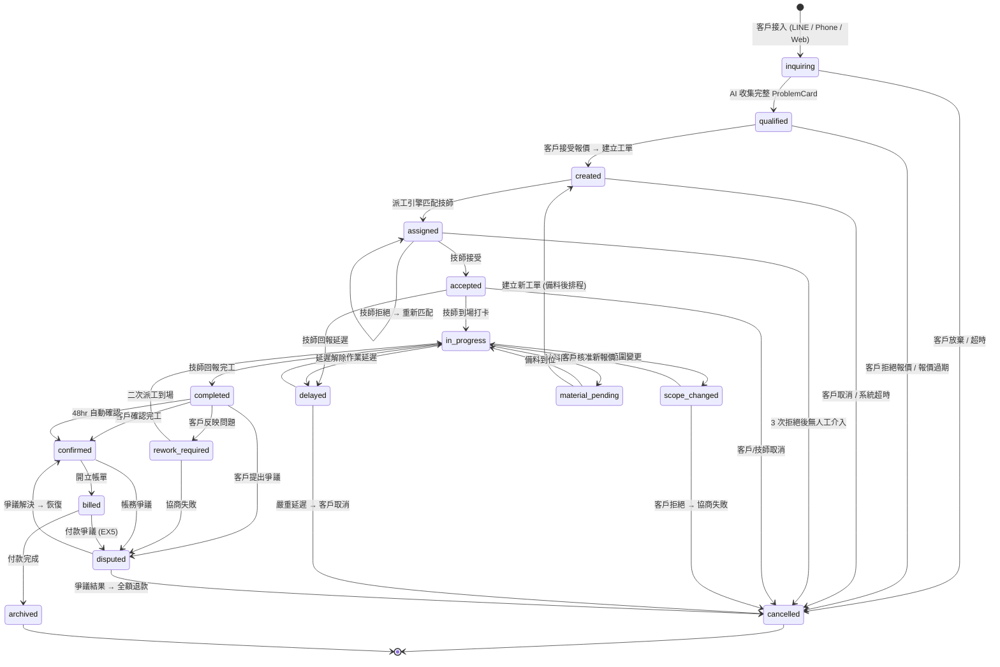
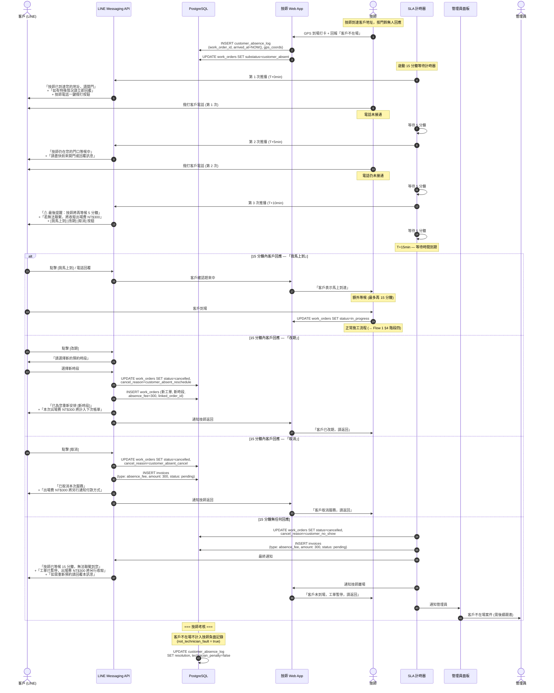
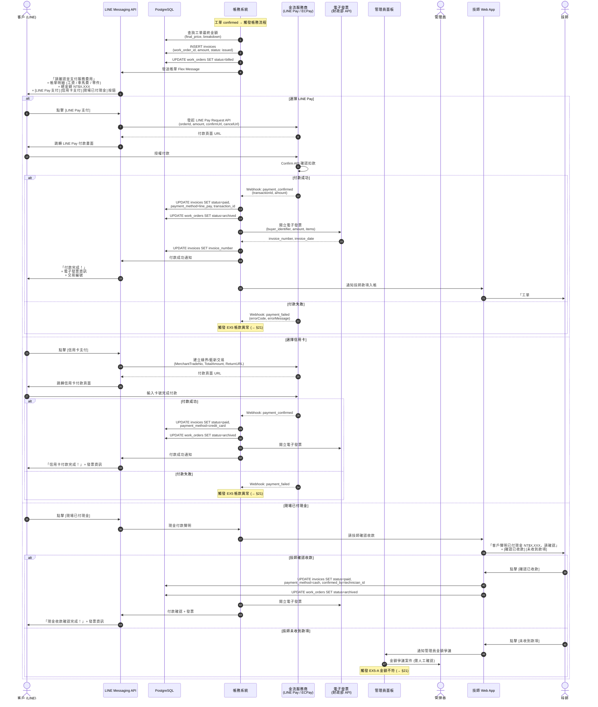
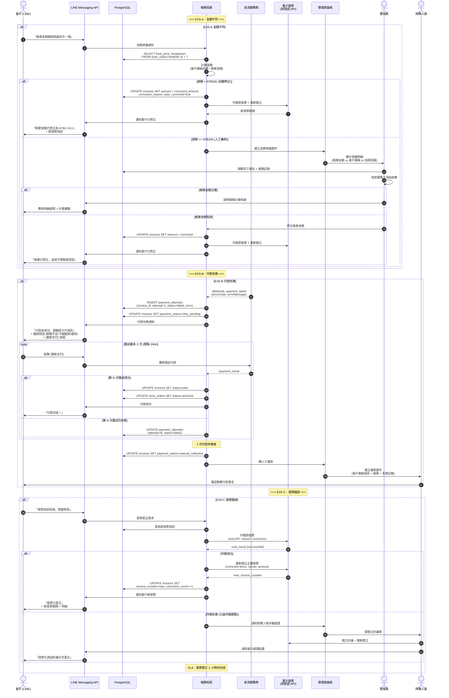
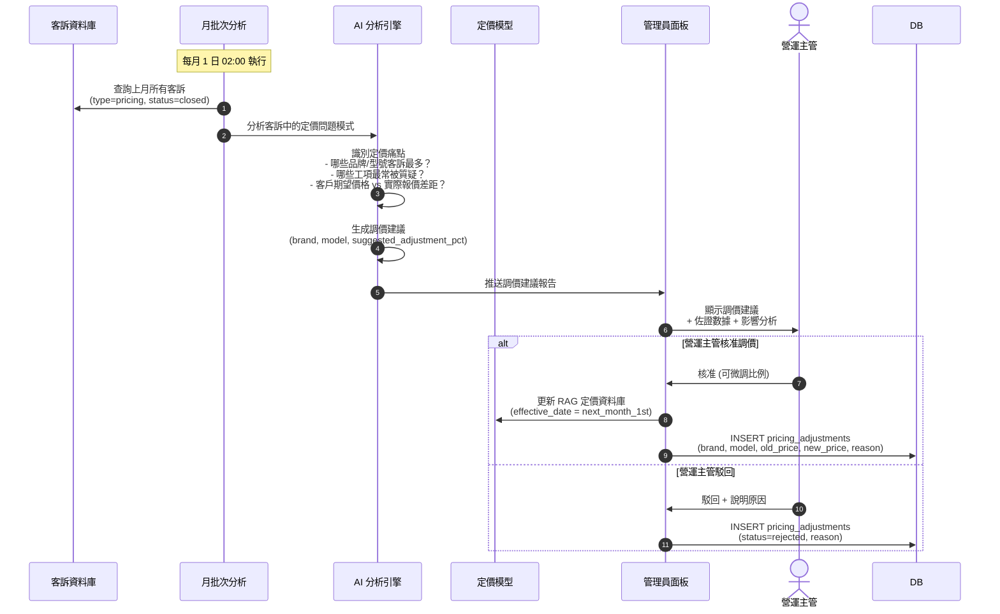

# 10 — 工單互動流程補充規格書 (Supplement)

> **文件版本**：v1.1-supplement
> **建立日期**：2026-04-02
> **狀態**：設計完成，待合併至主文件
> **用途**：本文件為 `10_work_order_interaction_flows.md` 之補充，涵蓋 Gap Analysis OP-01 至 OP-21 所識別的缺失項目。合併後應接續原文件 §15 之後、附錄 A 之前。
> **參考文件**：
> - `docs/system_design/10_work_order_interaction_flows.md` — 主文件 (Flow 1-10, §1-§15)
> - `docs/system_design/gap/GAP_ANALYSIS_REPORT.md` — 缺口分析報告
> - `docs/system_design/requirements/09_pricing_rules/README.md` — 定價規則
> - `agent/harness/task/knowledge/sop/SOP-DISPATCH-001.json` — 派工 SOP
> - `agent/harness/task/knowledge/ocap_rules.json` — OCAP 異常監控規則
> - `docs/project-docs/06_api_design_specification.md` — API 規格

---

## 目錄 (Supplement §16-§24)

16. [S1 詢問接入階段](#16-s1-詢問接入階段)
17. [S2 施工前報價確認](#17-s2-施工前報價確認)
18. [工單狀態機擴充](#18-工單狀態機擴充)
19. [Flow 11：客戶不在場](#19-flow-11客戶不在場)
20. [Flow 12：金流與支付](#20-flow-12金流與支付)
21. [Flow 13：帳款異常 EX5](#21-flow-13帳款異常-ex5)
22. [異常返回節點機制](#22-異常返回節點機制)
23. [補充業務規則](#23-補充業務規則)
24. [OKR 追蹤機制](#24-okr-追蹤機制)

---

## 16. S1 詢問接入階段

> **Gap ID**：OP-04 — 原文件缺少完整的客戶接入 (intake) 階段定義

### 16.1 觸發條件

- 客戶透過 LINE 官方帳號發送文字/圖片訊息
- 客戶撥打客服電話 (0800-xxx-xxx)，IVR 轉接至 AI 語音
- 客戶透過官方網站提交報修表單

### 16.2 參與角色

Customer, AI_System, Admin

### 16.3 三管道統一接入架構

| 管道 | 技術實作 | 接入方式 | 轉換至統一格式 |
|------|----------|----------|----------------|
| LINE | LINE Messaging API (Webhook) | 文字/圖片/影片/Flex 回覆 | `intake_event.channel = "line"` |
| 電話 | Twilio + Whisper STT → LLM | 語音轉文字後進入同一推理引擎 | `intake_event.channel = "phone"` |
| 網站 | REST API `POST /api/v1/intake` | 結構化表單 (brand, model, symptom) | `intake_event.channel = "web"` |

> **設計原則**：三個管道收斂為同一個 `intake_event` 進入 AI 推理引擎，後續所有流程完全一致。

### 16.4 流程圖



### 16.5 狀態轉換表

| 步驟 | 來源狀態 | 目標狀態 | 觸發動作 | 耗時預估 |
|------|----------|----------|----------|----------|
| 1 | — | `received` | 管道接入 intake_event | < 1 秒 |
| 2 | `received` | `classified` | AI 意圖分類完成 (confidence >= 0.6) | < 3 秒 |
| 3 | `classified` | `qualified` | ProblemCard 收集完整 (brand + model + symptom) | < 5 分鐘 |
| 4a | `received` | `unclassified` | AI confidence < 0.6 → 轉人工 | < 3 秒 |
| 4b | `classified` | `timeout` | 2 輪追問皆超時 (120 秒 x 2) | 4 分鐘 |
| 5 | `unclassified` | `qualified` | 人工客服完成資訊收集 | < 10 分鐘 |

### 16.6 通知清單

| 時機 | 通知方式 | 接收者 | 內容摘要 |
|------|----------|--------|----------|
| 接入成功 | LINE Push | Customer | 「感謝您的聯繫，正在為您分析問題」 |
| 追問 (每輪) | LINE Flex | Customer | 結構化追問 (含快速回覆按鈕) |
| 超時未回覆 | LINE Push | Customer | 超時提醒 + 客服專線 |
| 轉人工 | LINE Push | Customer | 「已為您轉接專人服務」 |
| 轉人工 | Web Alert | Admin | 待處理接入案件 + 對話歷史 |

### 16.7 業務規則

| 編號 | 規則 | 閾值 | 動作 |
|------|------|------|------|
| BR-S1-001 | AI 意圖分類信心度閾值 | confidence < 0.6 | 直接轉人工 |
| BR-S1-002 | 追問輪數上限 | 最多 2 輪 | 超過 2 輪仍無法收斂 → 轉人工 |
| BR-S1-003 | 單輪追問超時 | 120 秒 | 發送超時提醒，不重試 |
| BR-S1-004 | 連續 2 輪超時 | — | 暫停對話，記錄至 CRM 待回訪 |
| BR-S1-005 | 高風險情緒關鍵詞 | OCAP-SENTIMENT-001 觸發 | 跳過追問，立即轉人工 |
| BR-S1-006 | Red_Code 關鍵字偵測 | OCAP-EMERGENCY-001 觸發 | 跳過 S1 → 直接進入 Red_Code 派工 |

---

## 17. S2 施工前報價確認

> **Gap ID**：OP-05 — 原文件僅有 AI 自動計價，缺少報價區間概念、議價路徑、報價有效期

### 17.1 觸發條件

- S1 階段完成，ProblemCard 狀態為 `qualified`
- AI 推理引擎判斷需到府服務 (非遠端可解)
- 管理員手動建立報修需求

### 17.2 參與角色

Customer, AI_System, Pricing_Engine, Admin

### 17.3 報價區間計算邏輯

| 計算因子 | 資料來源 | 權重 | 說明 |
|----------|----------|------|------|
| 基礎工資 | RAG 定價資料庫 (brand × lock_type) | 固定 | 品牌/型號對應的標準工資 |
| 車馬費 | Google Maps API (距離 km) | 固定 | 距離 × $20/km，最低 $300 |
| 零件費 | RAG 零件價格庫 | 區間 | 依可能需更換的零件，取 min/max |
| 時段加價 | config.toml `surcharge_rules` | 乘數 | 夜間 (22:00-08:00) × 1.5、假日 × 1.3 |
| 難度係數 | ProblemCard.urgency + symptom_count | 乘數 | 複雜度高 × 1.2 |

**報價區間公式**：
```
price_min = (base_labor + travel_fee + parts_min) × time_surcharge × difficulty
price_max = (base_labor + travel_fee + parts_max) × time_surcharge × difficulty
```

> **設計原則**：對客戶呈現報價區間 (如 NT$2,800 ~ NT$3,600)，而非單一價格。最終價格由技師到場確認後決定。

### 17.4 流程圖



### 17.5 狀態轉換表

| 步驟 | 來源狀態 | 目標狀態 | 觸發動作 | 耗時預估 |
|------|----------|----------|----------|----------|
| 1 | — | `pending` | AI 生成報價區間 | < 5 秒 |
| 2a | `pending` | `accepted` | 客戶直接接受 | < 48 小時 |
| 2b | `pending` | `negotiating` | 客戶點擊議價 | < 48 小時 |
| 2c | `pending` | `declined` | 客戶暫不需要 | < 48 小時 |
| 2d | `pending` | `expired` | 48 小時未回應 | 48 小時 |
| 3a | `negotiating` | `accepted` | AI 自動議價成功 / 人工議價成功 | < 24 小時 |
| 3b | `negotiating` | `declined` | 議價失敗 | < 24 小時 |
| 4 | `accepted` | — | 觸發工單建立 (→ `created`) | < 1 秒 |

### 17.6 通知清單

| 時機 | 通知方式 | 接收者 | 內容摘要 |
|------|----------|--------|----------|
| 報價生成 | LINE Flex | Customer | 報價區間 + 明細 + 有效期 + 三選一按鈕 |
| 議價轉人工 | Web Alert | Admin | 議價案件 + 客戶期望 + 報價底線 |
| 議價成功 | LINE Flex | Customer | 最終確認報價 |
| 報價到期前 4 小時 | LINE Push | Customer | 「您的報價即將到期，是否需要服務？」 |
| 報價到期 | LINE Push | Customer | 「報價已到期，如需服務請重新諮詢」 |

### 17.7 業務規則

| 編號 | 規則 | 說明 |
|------|------|------|
| BR-S2-001 | 報價有效期 48 小時 | 超過自動標記 `expired` |
| BR-S2-002 | 報價呈現為區間 (非單一價格) | 最終價格以現場確認為準 |
| BR-S2-003 | 涉及建案/保固案件嚴禁自動報價 | 觸發 BR-001，轉人工處理 |
| BR-S2-004 | AI 自動議價空間 = price_min | 客戶期望 >= price_min 可自動成交 |
| BR-S2-005 | 客戶期望 < price_min | 必須轉人工議價，AI 不可自行降至成本以下 |
| BR-S2-006 | 報價到期前 4 小時發送提醒 | 僅提醒一次，不騷擾 |

---

## 18. 工單狀態機擴充

> **Gap ID**：OP-06 — 原文件 13 個狀態缺少 INQUIRING, QUALIFIED, BILLED

### 18.1 新增狀態定義

| 狀態 | 識別碼 | 說明 | 可停留最大時間 | 新增原因 |
|------|--------|------|----------------|----------|
| 詢問中 | `inquiring` | 客戶接入中，AI 正在收集問題資訊 | 10 分鐘 | S1 接入階段需要獨立狀態追蹤 |
| 已驗證 | `qualified` | ProblemCard 完整，待報價或待派工 | 48 小時 | S1→S2 轉換的中間狀態 |
| 已結帳 | `billed` | 帳單已開立，等待客戶付款 | 7 天 | S6 金流階段需獨立追蹤付款狀態 |

### 18.2 完整 16 狀態定義表

| # | 狀態 | 識別碼 | 說明 | 可停留最大時間 | 階段 |
|---|------|--------|------|----------------|------|
| 1 | 詢問中 | `inquiring` | AI 正在收集問題資訊 | 10 分鐘 | S1 |
| 2 | 已驗證 | `qualified` | ProblemCard 完整，待報價/派工 | 48 小時 | S1→S2 |
| 3 | 已建立 | `created` | 工單建立，等待派工 | 5 分鐘 | S3 |
| 4 | 已派工 | `assigned` | 派工引擎匹配技師 | 15 分鐘 | S3 |
| 5 | 已接受 | `accepted` | 技師確認接受 | 依預約時間 | S3 |
| 6 | 進行中 | `in_progress` | 技師到場作業 | 依工種 (2hr) | S4 |
| 7 | 範圍變更 | `scope_changed` | 現場狀況與預期不符 | 24 小時 | S4 |
| 8 | 缺料中 | `material_pending` | 等待備料 | 72 小時 | S4 |
| 9 | 延遲中 | `delayed` | 技師延遲 | 依新 ETA | S4 |
| 10 | 已完工 | `completed` | 技師回報完工 | 48 小時 | S5 |
| 11 | 返工中 | `rework_required` | 需二次處理 | 24 小時 | S5 |
| 12 | 已確認 | `confirmed` | 客戶確認完工 | 30 天 | S5 |
| 13 | 已結帳 | `billed` | 帳單開立，等待付款 | 7 天 | S6 |
| 14 | 已歸檔 | `archived` | 帳務結清 | 永久 | S7 |
| 15 | 已取消 | `cancelled` | 工單取消 | 終態 | — |
| 16 | 爭議中 | `disputed` | 爭議處理中 | 依爭議類型 | — |

### 18.3 完整 16 狀態轉換圖



### 18.4 新增狀態轉換規則 (增量)

以下為新增的 3 個狀態相關的轉換規則，與原文件 §1.3 互補：

| 來源狀態 | 目標狀態 | 觸發條件 | 授權角色 | 是否需審批 |
|----------|----------|----------|----------|-----------|
| — | `inquiring` | 客戶透過任一管道接入 | System | 否 |
| `inquiring` | `qualified` | ProblemCard 完整 (brand + model + symptom) | AI_System | 否 |
| `inquiring` | `cancelled` | 客戶放棄 / 2 輪追問超時後 24hr 未回覆 | System | 否 |
| `qualified` | `created` | 客戶接受報價，工單正式建立 | Customer | 否 |
| `qualified` | `cancelled` | 客戶拒絕報價 / 報價 48hr 到期 | Customer, System | 否 |
| `confirmed` | `billed` | 系統開立帳單 (e-invoice) | System | 否 |
| `billed` | `archived` | 付款完成 (payment_status = paid) | System | 否 |
| `billed` | `disputed` | 付款失敗 3 次 / 金額爭議 | Customer, System | 否 |

---

## 19. Flow 11：客戶不在場

> **Gap ID**：OP-03 — 技師到場但客戶不在家的處理流程

### 19.1 觸發條件

- 技師到場 GPS 打卡後，無法聯繫到客戶 (門鈴無人應答、電話未接)
- 工單狀態從 `accepted` 準備轉為 `in_progress` 時觸發

### 19.2 參與角色

Technician, Customer, Admin, Finance

### 19.3 流程圖



### 19.4 狀態轉換表

| 步驟 | 來源狀態 | 目標狀態 | 觸發動作 |
|------|----------|----------|----------|
| 1 | `accepted` | `accepted` (substatus: customer_absent) | 技師到場但客戶不在 |
| 2a | customer_absent | `in_progress` | 客戶在 15 分鐘內到場 |
| 2b | customer_absent | `cancelled` + `created` (新單) | 客戶選擇改期 |
| 2c | customer_absent | `cancelled` | 客戶取消 / 15 分鐘無回應 |

### 19.5 通知清單

| 時機 | 通知方式 | 接收者 | 內容摘要 |
|------|----------|--------|----------|
| T+0 min (到場) | LINE Push + 電話 | Customer | 技師到達通知 + 一鍵撥打 |
| T+5 min | LINE Push + 電話 | Customer | 第 2 次提醒 |
| T+10 min | LINE Flex + 電話 | Customer | 最後提醒 + 出場費告知 + 選項按鈕 |
| T+15 min (超時) | LINE Push | Customer | 工單暫停 + 出場費收取通知 |
| T+15 min (超時) | Web Alert | Admin | 客戶不在場案件需跟進 |
| 任意時刻客戶回覆 | Web Push | Technician | 客戶回應 (趕來/改期/取消) |

### 19.6 業務規則

| 編號 | 規則 | 說明 |
|------|------|------|
| BR-F11-001 | 等待時間上限 15 分鐘 | 含 3 次 LINE 推播 (5 分鐘間隔) |
| BR-F11-002 | 出場費 NT$300 | 不論取消或改期，均收取出場費 |
| BR-F11-003 | 技師不受負面記錄 | `technician_penalty = false`，客戶不在場非技師責任 |
| BR-F11-004 | 改期時出場費計入下次帳單 | 不另開帳單，隨下次工單合併收取 |
| BR-F11-005 | 客戶說「我馬上到」額外等候上限 15 分鐘 | 超過再次觸發本流程 |
| BR-F11-006 | 單一客戶 3 個月內 2 次不在場 | 標記為高風險客戶，後續工單要求預付訂金 |

---

## 20. Flow 12：金流與支付

> **Gap ID**：OP-01 — 原文件完全缺少付款階段，只有「帳務結清」一句帶過

### 20.1 觸發條件

- 工單狀態從 `confirmed` 轉為 `billed` (客戶確認完工後系統自動開帳)
- 人工補開帳單 (管理員手動觸發)

### 20.2 參與角色

Customer, Finance, Admin, Technician

### 20.3 支付方式矩陣

| 支付方式 | 金流服務商 | 手續費率 | 入帳時間 | 適用場景 |
|----------|-----------|---------|----------|----------|
| LINE Pay | LINE Pay API v3 | 2.75% | T+2 工作日 | LINE 內一鍵支付 (主推) |
| 信用卡 | 綠界 ECPay / 藍新 NewebPay | 2.5~3% | T+7 工作日 | 高單價工單 |
| 現金 | — | 0% | 即時 | 技師現場收款 (需回報) |

### 20.4 電子發票規格

| 項目 | 規格 | 說明 |
|------|------|------|
| 發票類型 | B2C 電子發票 | 財政部大平台 API |
| 載具 | 手機條碼 / 自然人憑證 / 會員載具 | 客戶 LINE 綁定時提供 |
| 格式 | 財政部 MIG 4.0 | JSON 格式上傳 |
| 發票時機 | 付款完成後 5 分鐘內 | 自動開立 |
| 保存期限 | 5 年 (依統一發票使用辦法) | — |

### 20.5 流程圖



### 20.6 狀態轉換表

| 步驟 | 來源狀態 | 目標狀態 | 觸發動作 | 耗時預估 |
|------|----------|----------|----------|----------|
| 1 | `confirmed` | `billed` | 系統自動開立帳單 | < 1 秒 |
| 2a | `billed` | `archived` | LINE Pay / 信用卡 付款成功 | < 5 分鐘 |
| 2b | `billed` | `archived` | 現金付款 + 技師確認 | < 10 分鐘 |
| 2c | `billed` | `disputed` | 付款失敗 / 金額爭議 → EX5 | — |

### 20.7 通知清單

| 時機 | 通知方式 | 接收者 | 內容摘要 |
|------|----------|--------|----------|
| 帳單開立 | LINE Flex | Customer | 帳單明細 + 支付方式選擇 |
| 付款成功 | LINE Flex | Customer | 付款確認 + 電子發票 + 交易編號 |
| 付款成功 | Web Push | Technician | 款項入帳通知 |
| 付款失敗 | LINE Push | Customer | 付款失敗 + 重試選項 |
| 付款失敗 | Web Alert | Admin | 付款異常案件 |
| 帳單逾期 (7 天) | LINE Push | Customer | 付款提醒 |
| 現金確認請求 | Web Push | Technician | 確認現金收款 |

---

## 21. Flow 13：帳款異常 EX5

> **Gap ID**：OP-02 — 原文件缺少付款失敗、金額不符、發票錯誤的處理流程

### 21.1 觸發條件

- EX5-A：客戶/技師回報金額與帳單不符
- EX5-B：線上付款失敗 (卡號錯誤、餘額不足、交易逾時)
- EX5-C：電子發票開立錯誤 (品項、金額、載具錯誤)

### 21.2 參與角色

Customer, Finance, Admin, Technician

### 21.3 流程圖



### 21.4 狀態轉換表

| 步驟 | 異常類型 | 來源狀態 | 目標狀態 | 觸發動作 |
|------|----------|----------|----------|----------|
| 1a | EX5-A | `billed` | `billed` (修正) | 差額 < $100 自動修正 |
| 1b | EX5-A | `billed` | `disputed` | 差額 >= $100 人工審核 |
| 2a | EX5-B | `billed` | `billed` (retry) | 付款失敗 → 重試 |
| 2b | EX5-B | `billed` | `billed` (manual) | 3 次失敗 → 人工催款 |
| 3 | EX5-C | `billed` / `archived` | 不變 | 發票作廢 + 重開 |

### 21.5 通知清單

| 時機 | 通知方式 | 接收者 | 內容摘要 |
|------|----------|--------|----------|
| 金額不符 (自動修正) | LINE Push | Customer | 帳單已修正 + 新發票 |
| 金額不符 (人工審核) | Web Alert | Admin | 金額爭議案件 |
| 付款失敗 | LINE Flex | Customer | 失敗原因 + 重新支付按鈕 |
| 3 次失敗 | Web Alert | Finance | 轉人工催款 |
| 發票更正完成 | LINE Push | Customer | 新發票號碼 + 明細 |
| 發票更正超時 | Web Alert | Finance | 超過 2hr SLA |

### 21.6 業務規則

| 編號 | 規則 | 閾值 | 動作 |
|------|------|------|------|
| BR-EX5-001 | 金額不符自動修正閾值 | 差額 < NT$100 | 系統自動修正 + 重開發票 |
| BR-EX5-002 | 金額不符人工審核閾值 | 差額 >= NT$100 | 建立爭議案件 → 人工核對 |
| BR-EX5-003 | 付款重試次數上限 | 3 次 | 超過轉人工催款 |
| BR-EX5-004 | 付款重試間隔 | 24 小時 | 每 24hr 發送一次付款提醒 |
| BR-EX5-005 | 發票更正 SLA | 2 小時 | 超時升級至財務主管 |
| BR-EX5-006 | 單一工單發票修正次數上限 | 3 次 | 超過需財務主管審核 |

---

## 22. 異常返回節點機制

> **Gap ID**：OP-07 — 異常處理後必須指定返回哪個階段，不可跳過

### 22.1 設計原則

1. **每個異常都必須有明確的 return_to_stage**：異常解決後不允許「懸空」，必須指定回到 S1~S6 哪個階段繼續。
2. **不可跳過階段**：從 S2 異常返回後只能回到 S2 或更早，不可跳到 S4。
3. **異常解決類型分類**：每次異常結案必須記錄 `resolution_type`。

### 22.2 異常返回節點對照表

| 異常流程 | 異常識別碼 | 可返回階段 | 預設返回節點 | 說明 |
|----------|-----------|-----------|-------------|------|
| Flow 2 拒單重派 | EX-REJECT | S3 (派工) | `assigned` | 重派成功後繼續派工流程 |
| Flow 3 範圍變更 | EX-SCOPE | S4 (施工) | `in_progress` | 客戶核准後繼續施工 |
| Flow 4 缺料 | EX-MATERIAL | S3 (派工) 或 S4 (施工) | `created` (新單) 或 `in_progress` | 備料到位後建新單或繼續 |
| Flow 5 延遲 | EX-DELAY | S3 (到場) 或 S1 (改期) | `in_progress` 或 `created` | 延遲解除或改期 |
| Flow 6 退款 | EX-REFUND | S6 (結帳) 或 終態 | `archived` 或 `cancelled` | 退款完成或全額退 |
| Flow 7 保固爭議 | EX-WARRANTY | S4 (施工) | `in_progress` | 確認保固後繼續施工 |
| Flow 8 品質不合格 | EX-REWORK | S3 (重新派工) | `assigned` (二次派工) | S 級技師重新到場 |
| Flow 9 客訴 | EX-COMPLAINT | 依客訴結果而定 | `confirmed` 或 `cancelled` | 結案後恢復或全退 |
| Flow 10 外觀變更 | EX-APPEARANCE | S4 (施工) | `in_progress` | 同意後繼續 |
| Flow 11 客戶不在場 | EX-ABSENT | S3 (改期) 或 S4 (到場) | `created` (新單) 或 `in_progress` | 改期或客戶到場 |
| Flow 13 帳款異常 | EX-BILLING | S6 (結帳) | `billed` | 修正後繼續收款 |

### 22.3 resolution_type 分類

| 類型 | 識別碼 | 說明 | 範例 |
|------|--------|------|------|
| 系統自動解決 | `AUTO` | 系統規則自動處理，無需人工介入 | 自動重派、自動修正小額差異 |
| 人工介入解決 | `HUMAN` | 管理員或客服介入處理 | 人工派工、人工議價、催款 |
| 取消結案 | `CANCELLED` | 異常無法解決，工單取消 | 客戶放棄、3 次重派失敗無人工接手 |
| 升級結案 | `ESCALATED` | 異常升級至更高層級處理 | 爭議升級至營運總監 |

### 22.4 異常記錄資料結構

```
exception_records:
  - exception_id: UUID
  - work_order_id: FK → work_orders
  - exception_type: ENUM (EX-REJECT, EX-SCOPE, ...)
  - triggered_at: TIMESTAMP
  - triggered_at_stage: ENUM (S1~S6)
  - resolved_at: TIMESTAMP | NULL
  - resolution_type: ENUM (AUTO, HUMAN, CANCELLED, ESCALATED)
  - return_to_stage: ENUM (S1~S6) | NULL
  - return_to_status: ENUM (工單狀態) | NULL
  - resolved_by: FK → users | NULL
  - notes: TEXT
```

### 22.5 業務規則

| 編號 | 規則 | 說明 |
|------|------|------|
| BR-EX-001 | 異常結案必填 return_to_stage | 資料庫 NOT NULL 約束 (除 `CANCELLED` 外) |
| BR-EX-002 | return_to_stage 不可晚於 triggered_at_stage | 例如 S2 異常不可返回 S4 |
| BR-EX-003 | 同一工單同類異常累計 >= 3 次 | 強制升級至人工處理 |
| BR-EX-004 | 異常未結案超過 SLA | 自動升級 (依 §14 升級矩陣) |

---

## 23. 補充業務規則

> **Gap ID**：OP-08 ~ OP-18 — 各階段細項補充

### 23.1 OP-08：EX1 需求不明流程

**觸發條件**：AI 意圖分類 confidence < 0.6 且 2 輪追問仍無法收斂。

| 步驟 | 動作 | SLA |
|------|------|-----|
| 1 | AI 追問第 1 輪 (開放式問題) | 120 秒 |
| 2 | AI 追問第 2 輪 (選項式問題) | 120 秒 |
| 3 | 2 輪失敗 → 自動轉人工客服 | 轉接 < 30 秒 |
| 4 | 人工客服接手 + 附帶完整對話歷史 | 首次回應 < 2 分鐘 |
| 5 | 人工客服完成 ProblemCard → 進入 S2 | < 10 分鐘 |

**OCAP 連動**：若同一症狀描述 7 天內觸發 EX1 > 20 次，通知 AI 團隊更新意圖分類模型。

### 23.2 OP-09：EX2 擴大搜尋半徑與替代時段

**觸發條件**：預設 30km 半徑內無可用技師 (或所有技師已拒單)。

| 擴圈策略 | 半徑 | 車馬費調整 | 觸發時機 |
|----------|------|-----------|----------|
| 第 1 圈 (預設) | 30 km | 標準計算 | 工單建立時 |
| 第 2 圈 (擴大) | 50 km | +$200 遠距加價 | 第 1 圈無匹配 / 3 次拒單 |
| 第 3 圈 (跨區) | 80 km | +$500 跨區加價 | 第 2 圈無匹配 (需管理員核准) |

**替代時段建議**：

| 條件 | 建議 |
|------|------|
| 當日所有技師已排滿 | 推薦隔日最早可用時段 (LINE Flex) |
| 客戶選擇特定時段無人 | 顯示前後 ±2 小時可用技師 |
| 偏遠地區 (第 3 圈) | 建議週六集中服務日 |

### 23.3 OP-10：AI 施工檢核表 (S4-F03)

技師到場後，系統依 ProblemCard 自動生成施工檢核表：

| 檢核項目類型 | 來源 | 範例 |
|-------------|------|------|
| 施工前確認 | ProblemCard.symptoms | 「確認門鎖型號為 dormakaba M5」 |
| 必帶工具 | RAG 知識庫 (brand × model) | 「十字螺絲刀 PH2、內六角 4mm」 |
| 安全檢查 | SOP-SAFETY-001 | 「確認電源已斷開」 |
| 施工步驟 | SOP-{brand}-{model} | 依品牌/型號動態生成 |
| 必拍照片 | 全域規則 | 「施工前全貌 / 施工中 / 施工後 / 功能測試」 |
| 客戶告知義務 | BR-003, BR-013 | 外觀變更提醒 (若適用) |

**技術實作**：
```
POST /api/v1/work-orders/{id}/checklist
Response: {
  checklist_id: UUID,
  items: [
    { seq: 1, category: "pre_check", text: "...", required: true, status: "pending" },
    ...
  ],
  generated_from: { problem_card_id, sop_ids: [...] }
}
```

### 23.4 OP-11：鎖種不符 AI 替代推薦 (EX3-A)

**觸發條件**：技師到場發現實際鎖種與 ProblemCard 記錄不符。

| 步驟 | 動作 |
|------|------|
| 1 | 技師拍照上傳實際鎖種 |
| 2 | AI 圖片辨識 → 識別品牌/型號 |
| 3 | RAG 查詢替代方案 (compatible_models) |
| 4 | 推薦 Top 3 替代方案 (含價差) |
| 5a | 技師有替代零件 → 範圍變更流程 (Flow 3) |
| 5b | 技師無替代零件 → 缺料流程 (Flow 4) |

**AI 替代推薦 API**：
```
POST /api/v1/recommendations/alternative-locks
Request:  { actual_brand, actual_model, photo_url }
Response: { alternatives: [{ brand, model, compatibility_score, price_diff }] }
```

### 23.5 OP-12：正式簽收流程 (S5-F02)

**觸發條件**：技師提交完工報告後。

| 簽收項目 | 必填 | 說明 |
|----------|------|------|
| 服務項目清單 | 是 | 逐項列出已完成的工項 |
| 使用零件明細 | 是 | 品名 × 數量 × 單價 |
| 最終金額確認 | 是 | 客戶確認金額 (電子簽名或 LINE 點擊確認) |
| 功能測試結果 | 是 | 指紋/密碼/藍牙/卡片 各項 Pass/Fail |
| 客戶滿意度 | 是 | 1-5 星評分 |
| 客戶備註 | 否 | 開放式文字 |

**LINE Flex Message 結構**：
```
[完工簽收單]
工單編號：WO-2026-XXXX
────────────────
服務項目：
  1. 馬達模組更換    × 1  $2,400
  2. 車馬費              $300
────────────────
合計：NT$ 2,700
────────────────
功能測試：全部 PASS ✓
────────────────
[確認簽收] [有問題要反映]
```

### 23.6 OP-13：低評分自動觸發客訴

| 評分 | 動作 |
|------|------|
| 5 星 | 正常結案 |
| 4 星 | 正常結案 + 記錄改善提示 |
| 3 星 | 標記觀察 + 24hr 內 LINE 追問不滿原因 |
| 1-2 星 | 自動建立客訴案件 (→ Flow 9) + 管理員 2hr 內回電 |

**自動客訴規則**：
```
IF rating <= 2:
  INSERT complaints (
    work_order_id,
    source = 'auto_low_rating',
    priority = 'high',
    sla_first_response = NOW() + 2hr
  )
  NOTIFY admin (Web Alert + Email)
  NOTIFY customer (LINE Push: 「我們注意到您的服務體驗不夠理想，客服將主動聯繫您」)
```

### 23.7 OP-14：人工審核台 UI 規格

| UI 區塊 | 內容 | 互動 |
|---------|------|------|
| 待審佇列 | 所有待人工處理的案件 (按 SLA 剩餘時間排序) | 點擊進入詳情 |
| SLA 倒數計時器 | 每張案件顯示剩餘時間 (綠/黃/紅燈號) | 黃燈 < 50% SLA、紅燈 < 20% SLA |
| 案件詳情面板 | 工單資訊 + 對話歷史 + ProblemCard + 照片 | 可直接回覆客戶 |
| 快速動作列 | [核准] [駁回] [轉派] [升級] [備註] | 一鍵操作 |
| 統計儀表板 | 今日待處理/已處理/平均處理時間/SLA 達成率 | 即時更新 |

**SLA 燈號邏輯**：

| 燈號 | 條件 | 顏色 |
|------|------|------|
| 綠燈 | SLA 剩餘 > 50% | `#22C55E` |
| 黃燈 | SLA 剩餘 20%~50% | `#EAB308` |
| 紅燈 | SLA 剩餘 < 20% | `#EF4444` |
| 黑燈 | SLA 已違反 | `#1F2937` (閃爍) |

### 23.8 OP-15/16/17：異常熔斷規則

三條熔斷規則保護系統不因連鎖異常崩潰：

**熔斷規則 1：同一技師連續異常熔斷**

| 條件 | 動作 |
|------|------|
| 同一技師 24hr 內觸發 >= 3 次異常 (任何類型) | 自動暫停該技師派工 |
| 暫停期間 | 24 小時 (自動恢復) |
| 通知 | Web Alert → Admin + Email → 技師 |
| 恢復條件 | 24hr 後自動恢復，或管理員手動恢復 |

**熔斷規則 2：同一工單異常堆疊熔斷**

| 條件 | 動作 |
|------|------|
| 同一工單累計 >= 5 個未結異常 | 強制凍結工單 + 升級至營運主管 |
| 凍結後 | 所有自動流程停止，僅允許人工操作 |
| 通知 | Web Alert → Admin + Ops Manager |
| 恢復條件 | 營運主管手動解凍 + 填寫處置方案 |

**熔斷規則 3：系統級異常頻率熔斷**

| 條件 | 動作 |
|------|------|
| 全系統 1hr 內異常總量 > 50 件 | 觸發系統級警報 |
| 動作 | 暫停自動派工 + 切換人工派工模式 |
| 通知 | Email + SMS → CTO + Ops Director |
| 恢復條件 | CTO 手動確認恢復自動派工 |

### 23.9 OP-18：Exception API 端點

| Method | Endpoint | 說明 | 授權 |
|--------|----------|------|------|
| `POST` | `/api/v1/exceptions` | 建立異常記錄 | System, Admin |
| `GET` | `/api/v1/exceptions?work_order_id={id}` | 查詢工單所有異常 | Admin, Technician (自身) |
| `GET` | `/api/v1/exceptions/{id}` | 查詢單一異常詳情 | Admin |
| `PATCH` | `/api/v1/exceptions/{id}/resolve` | 結案異常 (含 return_to_stage) | Admin, System |
| `GET` | `/api/v1/exceptions/stats` | 異常統計 (by type, time range) | Admin |
| `POST` | `/api/v1/exceptions/{id}/escalate` | 手動升級異常 | Admin |

**建立異常 Request Body**：
```json
{
  "work_order_id": "uuid",
  "exception_type": "EX-ABSENT",
  "triggered_at_stage": "S3",
  "severity": "medium",
  "description": "客戶到場後無人應門",
  "metadata": {
    "gps_coords": { "lat": 25.033, "lng": 121.565 },
    "attempts": 3
  }
}
```

**結案異常 Request Body**：
```json
{
  "resolution_type": "AUTO",
  "return_to_stage": "S3",
  "return_to_status": "created",
  "resolved_by": "system",
  "notes": "客戶改期，建立新工單 WO-2026-YYYY"
}
```

---

## 24. OKR 追蹤機制

> **Gap ID**：OP-19 ~ OP-21 — 缺少量化指標追蹤、AI 週報自動化、客訴回饋閉環

### 24.1 五大 OKR 定義

| # | Objective | Key Result | 目標值 | 計算方式 | 追蹤頻率 |
|---|-----------|-----------|--------|----------|----------|
| OKR-1 | 提升派工效率 | KR1-1：首次匹配成功率 | >= 85% | `COUNT(first_match_accepted) / COUNT(dispatches)` | 每日 |
| | | KR1-2：平均派工耗時 | < 3 分鐘 | `AVG(assigned_at - created_at)` | 每日 |
| | | KR1-3：技師 15 分鐘回應率 | >= 90% | `COUNT(response_within_15min) / COUNT(assigned)` | 每日 |
| OKR-2 | 提升客戶滿意度 | KR2-1：平均評分 | >= 4.5 星 | `AVG(rating)` | 每週 |
| | | KR2-2：客訴率 | < 3% | `COUNT(complaints) / COUNT(completed_orders)` | 每週 |
| | | KR2-3：NPS (淨推薦值) | >= 50 | 每月問卷調查 | 每月 |
| OKR-3 | 降低異常率 | KR3-1：異常工單佔比 | < 15% | `COUNT(orders_with_exceptions) / COUNT(all_orders)` | 每週 |
| | | KR3-2：異常平均解決時間 | < 2 小時 | `AVG(resolved_at - triggered_at)` | 每週 |
| | | KR3-3：熔斷觸發次數 | < 5 次/月 | `COUNT(circuit_breaker_triggered)` | 每月 |
| OKR-4 | 提升 AI 診斷能力 | KR4-1：AI 診斷正確率 | >= 75% | `AVG(ai_prediction_hit)` | 每週 |
| | | KR4-2：AI 轉人率 | < 20% | `COUNT(human_handoff) / COUNT(intakes)` | 每週 |
| | | KR4-3：AI 意圖分類準確率 | >= 85% | `COUNT(correct_intent) / COUNT(classified)` | 每週 |
| OKR-5 | 帳務健康 | KR5-1：付款成功率 | >= 95% | `COUNT(paid) / COUNT(billed)` | 每週 |
| | | KR5-2：平均收款天數 | < 3 天 | `AVG(paid_at - billed_at)` | 每月 |
| | | KR5-3：帳款異常率 | < 2% | `COUNT(billing_exceptions) / COUNT(invoices)` | 每月 |

### 24.2 AI 週報自動化 (OP-19：S7-F03)

**執行時間**：每週一 08:00 自動生成 + 發送

**週報內容結構**：

| 區塊 | 內容 | 資料來源 |
|------|------|----------|
| 1. 摘要指標 | 5 大 OKR 當週數值 + 較上週變化 (↑/↓/→) | `work_orders`, `invoices`, `exceptions`, `intake_events` |
| 2. 派工效率 | 匹配成功率、平均耗時、拒單率分佈 | `dispatch_logs` |
| 3. AI 診斷品質 | 正確率、轉人率、TOP 5 未覆蓋症狀 | `service_reports`, `intake_events` |
| 4. 異常分析 | 異常類型分佈圖、TOP 3 異常根因 | `exception_records` |
| 5. 客戶聲音 | 低評分 TOP 5 案例 + 客訴關鍵詞雲 | `complaints`, `ratings` |
| 6. 技師表現 | TOP 10 / BOTTOM 10 技師排名 | `technicians` |
| 7. 建議行動 | AI 生成的改善建議 (3~5 條) | LLM 分析 |

**技術實作**：
```
POST /api/v1/reports/weekly (Cron Job: 0 8 * * 1)
Response: {
  report_id: UUID,
  generated_at: TIMESTAMP,
  period: { start: "2026-03-24", end: "2026-03-30" },
  sections: [ ... ],
  recipients: ["admin@company.com", "ops@company.com"],
  delivery_status: "sent"
}
```

**發送管道**：
| 接收者 | 管道 | 格式 |
|--------|------|------|
| 營運主管 | Email | PDF + HTML |
| 管理員 | Admin Panel | 互動式儀表板 |
| CEO (月報) | Email | 精簡版 PDF (僅摘要指標) |

### 24.3 客訴回饋定價模型 (OP-20：S7-F04)

**回饋閉環**：客訴分析結果自動回饋至定價模型，形成持續優化循環。



**調價安全規則**：

| 規則 | 說明 |
|------|------|
| 單次調幅上限 ±15% | 超過需 CEO 核准 |
| 不可低於成本 | price_min >= cost × 1.1 (保底 10% 毛利) |
| 新價生效日 = 次月 1 日 | 不可追溯調整已開立的報價 |
| 調價記錄永久保存 | 供審計追溯 |

### 24.4 OKR 追蹤儀表板需求

| 儀表板視圖 | 預設時間範圍 | 關鍵元件 |
|-----------|-------------|---------|
| 營運總覽 | 今日 | 5 大 OKR 卡片 (當前值 + 目標值 + 達成率) |
| 派工效率 | 本週 | 匹配成功率趨勢圖、拒單熱力圖 (by 區域) |
| AI 表現 | 本月 | 診斷正確率趨勢、轉人率趨勢、未覆蓋症狀表 |
| 異常監控 | 本週 | 異常類型 Pie Chart、解決時間分佈、熔斷記錄 |
| 帳務健康 | 本月 | 收款漏斗圖、應收帳款老化表、異常發票列表 |
| 技師排行榜 | 本月 | 評分/接單率/完成率 綜合排名 |

**技術實作**：
- 前端框架：Next.js Dashboard (Tremor UI components)
- 即時數據：WebSocket / SSE 推送 (SLA 倒數、新異常警報)
- 歷史數據：REST API `GET /api/v1/dashboard/{view}?period={range}`
- 快取策略：Redis TTL 60 秒 (營運總覽)、300 秒 (趨勢圖)

---

## 附錄 D：補充業務規則彙總

| 編號 | 規則 | 適用章節 |
|------|------|----------|
| BR-S1-001 | AI 信心度 < 0.6 → 轉人工 | §16 |
| BR-S1-002 | 追問上限 2 輪、每輪 120 秒 | §16 |
| BR-S1-006 | Red_Code 跳過 S1 直接派工 | §16 |
| BR-S2-001 | 報價有效期 48 小時 | §17 |
| BR-S2-002 | 報價呈現為區間 (非單一價) | §17 |
| BR-S2-003 | 保固案件嚴禁自動報價 | §17 |
| BR-F11-001 | 客戶不在場等候 15 分鐘 | §19 |
| BR-F11-002 | 出場費 NT$300 | §19 |
| BR-F11-003 | 不計入技師負面記錄 | §19 |
| BR-F11-006 | 3 月內 2 次不在場 → 高風險 | §19 |
| BR-EX5-001 | 金額差異 < $100 自動修正 | §21 |
| BR-EX5-003 | 付款重試上限 3 次 | §21 |
| BR-EX5-005 | 發票更正 SLA 2 小時 | §21 |
| BR-EX-001 | 異常結案必填 return_to_stage | §22 |
| BR-EX-002 | 返回階段不可晚於觸發階段 | §22 |

## 附錄 E：補充資料模型擴展建議

| 表格名稱 | 用途 | 關聯章節 |
|----------|------|----------|
| `intake_events` | 客戶接入記錄 (三管道統一) | §16 |
| `quotes` | 報價記錄 (含區間、議價歷史) | §17 |
| `payment_attempts` | 付款嘗試記錄 | §20, §21 |
| `customer_absence_logs` | 客戶不在場記錄 | §19 |
| `exception_records` | 統一異常記錄 (含 return_to_stage) | §22 |
| `pricing_adjustments` | 定價調整歷史 (客訴回饋) | §24 |
| `weekly_reports` | AI 週報存檔 | §24 |
| `checklist_instances` | 施工檢核表實例 | §23.3 |

## 附錄 F：API 端點索引 (Supplement)

| Method | Endpoint | 說明 | 關聯章節 |
|--------|----------|------|----------|
| `POST` | `/api/v1/intake` | 統一接入 (Web 管道) | §16 |
| `POST` | `/api/v1/quotes` | 建立報價 | §17 |
| `PATCH` | `/api/v1/quotes/{id}/accept` | 客戶接受報價 | §17 |
| `PATCH` | `/api/v1/quotes/{id}/negotiate` | 議價 | §17 |
| `POST` | `/api/v1/payments` | 發起付款 | §20 |
| `POST` | `/api/v1/payments/{id}/retry` | 重試付款 | §21 |
| `POST` | `/api/v1/invoices/{id}/void` | 作廢發票 | §21 |
| `POST` | `/api/v1/invoices/{id}/reissue` | 重開發票 | §21 |
| `POST` | `/api/v1/work-orders/{id}/checklist` | 生成施工檢核表 | §23.3 |
| `POST` | `/api/v1/recommendations/alternative-locks` | 替代鎖種推薦 | §23.4 |
| `POST` | `/api/v1/exceptions` | 建立異常記錄 | §23.9 |
| `PATCH` | `/api/v1/exceptions/{id}/resolve` | 結案異常 | §23.9 |
| `POST` | `/api/v1/reports/weekly` | 生成週報 | §24.2 |
| `GET` | `/api/v1/dashboard/{view}` | 儀表板數據 | §24.4 |

---

> **文件結束** — 本補充文件涵蓋 OP-01 至 OP-21 共 21 項缺口修補，新增 §16-§24 共 9 個章節、3 個新工單狀態、3 個新業務流程 (Flow 11-13)、異常返回機制、熔斷規則、以及完整的 OKR 追蹤體系。合併至主文件後，工單全生命週期從 S1 (詢問接入) 到 S7 (歸檔與知識沉澱) 形成完整閉環。
