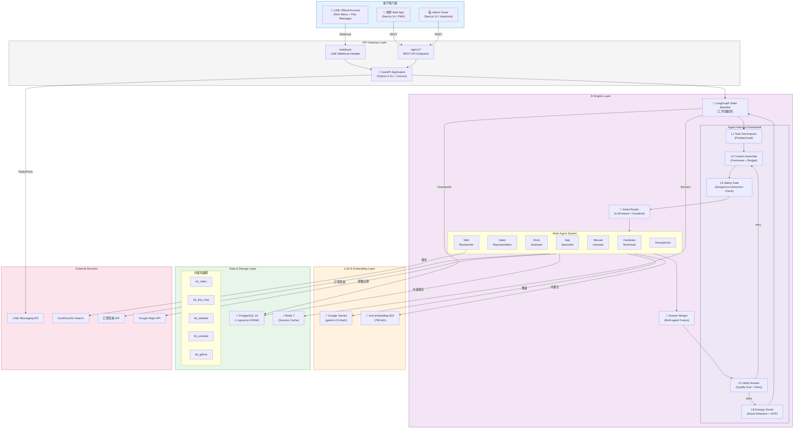

# 04 — High-Level Architecture Diagram（高層架構圖）

> **為什麼重要？** 給全體團隊共識的大藍圖，所有人對系統全貌有一致理解。

## 概述

本圖以 C4 Model Level 2 的方式，展示平台內部的主要容器（Container）及其互動方式，涵蓋前端介面、後端服務、資料儲存與外部整合。

---

## 高層架構圖

---

## 技術棧總覽

| 層級 | 技術選型 | 說明 |
|:-----|:---------|:-----|
| **前端** | Next.js 14 + Tailwind CSS + shadcn/ui | 技師 PWA + Admin Panel |
| **API 層** | FastAPI + Uvicorn | 非同步 REST API + Webhook |
| **AI 編排** | LangGraph + LangChain 0.3 (LCEL) | 多 Agent 工作流狀態機 |
| **LLM** | Google Gemini 2.5 Flash | 意圖路由、對話生成、資訊擷取 |
| **Embedding** | Google text-embedding-004 | 768 維文字向量化 |
| **主資料庫** | PostgreSQL 16 + pgvector 0.7 | 關聯式資料 + HNSW 向量索引 |
| **快取** | Redis 7 | Session 快取、Debounce Buffer |
| **ORM** | SQLAlchemy 2.0 (async) | 非同步資料庫操作 |
| **容器化** | Docker + docker-compose | 本地開發 + 生產部署 |
| **CI/CD** | GitHub Actions | 自動測試 + 部署 |

---

## 架構設計原則

| 原則 | 實踐 |
|:-----|:-----|
| **Modular Monolith** | V1.0 單體架構，模組邊界清晰，V2.0 可拆分微服務 |
| **Event-Driven** | LangGraph 狀態驅動 + Debounce 訊息緩衝 |
| **ReAct Pattern** | Agent 推論 → 工具呼叫 → 觀察結果 → 再推論 |
| **Fan-out / Fan-in** | 多 Agent 平行分派 → 合併回答 |
| **SCD Type 2** | 使用者事實歷史版本追蹤 |
| **Medallion Architecture** | 資料處理：Raw → Bronze → Silver → Gold |
