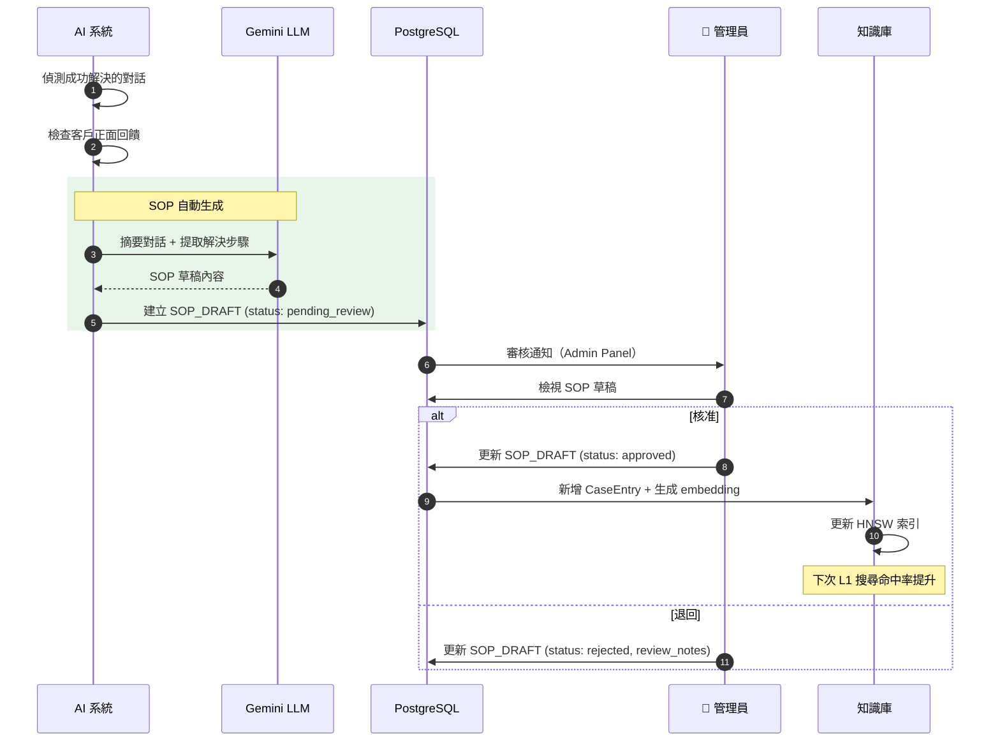
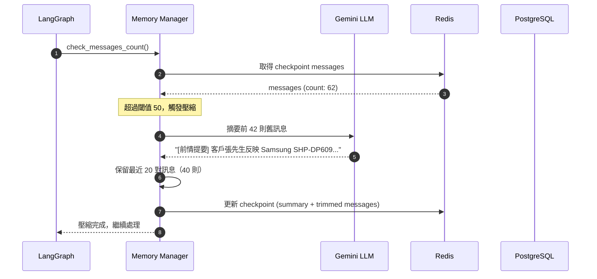
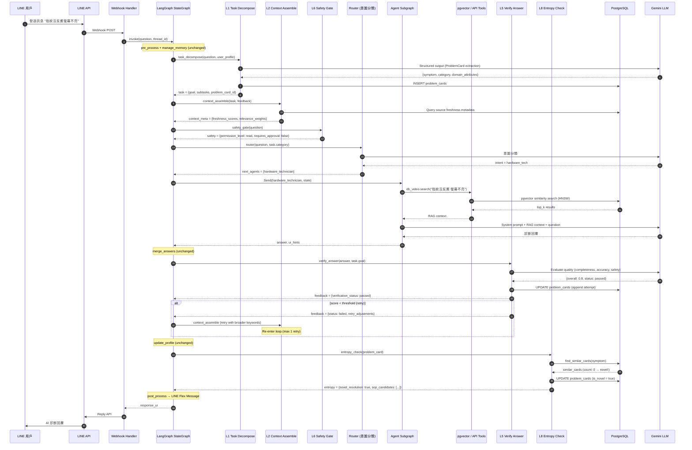

# 07 — Sequence Diagram（循序圖）

> **為什麼重要？** 定義互動順序與介接，確保各元件之間的呼叫時序正確無誤。

## 概述

本文件包含平台三大核心流程的循序圖：客戶報修對話、技師派工、以及知識庫自進化。

---

## 流程一：客戶報修對話（主流程）

```mermaid
sequenceDiagram
    autonumber
    participantCustomer as 👤 客戶
    participant LINE as LINE App
    participant Webhook as FastAPI /webhook
    participant Debounce as Debounce Buffer
    participant Graph as LangGraph StateMachine
    participant Router as Intent Router
    participant Agent as Agent (ReAct)
    participant LLM as Gemini LLM
    participant PGVec as pgvector
    participant Redis as Redis
    participant PG as PostgreSQL
    participant LineAPI as LINE API

    Customer->>LINE: 發送報修訊息
    LINE->>Webhook: POST /webhook (HMAC-SHA256)
    Webhook->>Webhook: 驗證簽章
    Webhook->>PG: 記錄 audit_log (user_raw)
    Webhook->>Debounce: add_message_to_buffer()

    Note over Debounce: 等待 1.5 秒收集後續訊息

    alt 1.5 秒內有新訊息
        Customer->>LINE: 追加補充訊息
        LINE->>Webhook: POST /webhook
        Webhook->>Debounce: append to buffer
    end

    Debounce->>Webhook: 觸發處理（合併訊息）
    Webhook->>PG: 記錄 audit_log (user)
    Webhook->>LineAPI: show_loading_animation()
    Webhook->>Graph: run_langgraph(question, thread_id)

    rect rgb(243, 229, 245)
        Note over Graph,PG: LangGraph 狀態機執行

        Graph->>PG: 載入 user_profile (facts + .md)
        Graph->>Redis: 載入 checkpoint (對話歷史)

        Graph->>Graph: pre_process (注入 profile + summary)

        opt messages > 50
            Graph->>LLM: 壓縮舊訊息摘要
            LLM-->>Graph: summary text
            Graph->>Graph: manage_memory (保留近 20 對)
        end

        Graph->>LLM: router (意圖分類 + Guardrail)
        LLM-->>Graph: intent: [hardware_tech]

        Graph->>Agent: Fan-out → hardware_technician

        rect rgb(255, 243, 224)
            Note over Agent,PGVec: ReAct Loop
            Agent->>LLM: System Prompt + 使用者問題
            LLM-->>Agent: tool_call: db_video(query)
            Agent->>PGVec: MMR 向量搜尋 (similarity ≥ 0.85)
            PGVec-->>Agent: 相關案例 + ui_hints
            Agent->>LLM: 工具結果 + 上下文
            LLM-->>Agent: 最終回答 (text)
        end

        Graph->>Graph: merge_answers
        Graph->>LLM: update_profile (擷取事實)
        LLM-->>Graph: {phone, device_brand, ...}
        Graph->>PG: upsert user_facts (SCD Type 2)
        Graph->>Graph: post_process (清除 Markdown, 建構 UI)
    end

    Graph-->>Webhook: answer + response_ui
    Webhook->>PG: 記錄 audit_log (ai)
    Webhook->>LineAPI: reply(response_ui)
    LineAPI->>LINE: Flex Message + Video Card
    LINE->>Customer: 顯示 AI 回覆
```

---

## 流程二：L3 升級 → 技師派工（V2.0）

```mermaid
sequenceDiagram
    autonumber
    participantCustomer as 👤 客戶
    participant AI as AI 系統
    participant Dispatch as 派工引擎
    participant PG as PostgreSQL
    participant Pricing as 報價引擎
    participantTechnician as 🔧 技師
    participant TechApp as 技師 Web App
    participant Maps as Google Maps
    participant LineAPI as LINE API

    AI->>AI: L1 未命中 → L2 未解決 → L3 升級
    AI->>PG: 建立 WorkOrder (status: created)
    AI->>LineAPI: 通知客戶「已安排技師服務」

    Dispatch->>PG: 查詢 ProblemCard (brand, model, location)
    Dispatch->>PG: 查詢符合技能的技師列表
    Dispatch->>Maps: 計算各技師距離
    Maps-->>Dispatch: 距離矩陣
    Dispatch->>Dispatch: 加權評分 (技能×距離×評分×可用性)
    Dispatch->>PG: 更新 WorkOrder (status: assigned)
    Dispatch->>TechApp: 推播工單通知

    TechApp->>Technician: 顯示工單詳情

    alt 技師接受
        Technician->>TechApp: 點擊「接受工單」
        TechApp->>PG: 更新 WorkOrder (status: in_progress)
        TechApp->>Maps: 導航至客戶地址
        TechApp->>LineAPI: 通知客戶「技師已出發，預計 XX 分鐘到達」

        Note over Technician: 現場維修中...

        Technician->>TechApp: 完工回報 (照片 + 零件 + 工時)
        TechApp->>Pricing: 自動計價 (brand × lock_type × difficulty)
        Pricing-->>TechApp: 報價明細
        TechApp->>PG: 更新 WorkOrder (status: completed)
        TechApp->>PG: 建立 Invoice
        TechApp->>LineAPI: 通知客戶「維修完成」+ 帳單
        LineAPI->>Customer: 收到完工通知與帳單
    else 技師拒絕 / 逾時
        TechApp->>Dispatch: 重新匹配下一位技師
        Dispatch->>Dispatch: 排除已拒絕技師，重新評分
    end
```

---

## 流程三：知識庫自進化



---

## 流程四：對話記憶管理



---

## 流程五：Agent Harness 8 層處理流程 (2026-04 Addendum)

> 以下為 Harness 框架啟用後的完整處理流程。Phase 0 階段所有 harness 節點為 pass-through。


