# 10 — 工單互動流程完整規格書

> **文件版本**：v1.0
> **建立日期**：2026-03-31
> **狀態**：設計完成，待開發實作
> **適用範圍**：V2.0 技師派工與工單全生命週期
> **參考文件**：
> - `docs/project-docs/02_project_brief_and_prd.md` — PRD 用戶故事
> - `docs/project-docs/06_api_design_specification.md` — API 規格
> - `SQL/Schema.sql` — 資料庫結構定義
> - `docs/Locksmith_Preparation_Checklist/14_派工業務規則.md` — 派工規則
> - `docs/Locksmith_Preparation_Checklist/15_師傅分級標準.md` — 技師分級
> - `docs/Locksmith_Preparation_Checklist/18_爭議處理案例.md` — 爭議案例
> - `docs/agent-harness-refactor/diagnostic-intelligence-architecture.md` — 診斷推理引擎 + 知識沉澱閉環 (Layer 6)
> - `docs/agent-harness-refactor/optimization-strategy.md` — 三層 Cascade + 派工觸發邏輯
> - `agent/harness/task/knowledge/sop/SOP-DISPATCH-001.json` — 派工決策 SOP (7 個派工信號)
> - `agent/harness/task/knowledge/sop/SOP-EMERGENCY-001.json` — Red_Code 緊急流程
> - `agent/harness/task/knowledge/ocap_rules.json` — OCAP 異常監控 + 情緒升級規則

---

## 目錄

1. [完整狀態機](#1-完整狀態機)
2. [角色定義](#2-角色定義)
3. [SLA 定義](#3-sla-定義)
4. [Flow 1：正常路徑 (Happy Path)](#4-flow-1正常路徑-happy-path)
5. [Flow 2：拒單與逾時重派](#5-flow-2拒單與逾時重派)
6. [Flow 3：範圍變更](#6-flow-3範圍變更)
7. [Flow 4：缺料處理](#7-flow-4缺料處理)
8. [Flow 5：延遲通知與改期](#8-flow-5延遲通知與改期)
9. [Flow 6：退款審批與大額雙簽](#9-flow-6退款審批與大額雙簽)
10. [Flow 7：保固爭議](#10-flow-7保固爭議)
11. [Flow 8：品質不合格與二次派工](#11-flow-8品質不合格與二次派工)
12. [Flow 9：客訴處理完整生命週期](#12-flow-9客訴處理完整生命週期)
13. [Flow 10：門外觀變更確認](#13-flow-10門外觀變更確認)
14. [升級矩陣](#14-升級矩陣)
15. [知識沉澱閉環與完工報告](#15-知識沉澱閉環與完工報告)

---

## 1. 完整狀態機

### 1.1 工單狀態定義

| 狀態 | 識別碼 | 說明 | 可停留最大時間 |
|------|--------|------|----------------|
| 已建立 | `created` | 工單由 AI 系統或管理員建立，尚未派工 | 5 分鐘 |
| 已派工 | `assigned` | 派工引擎已匹配技師，等待技師回應 | 15 分鐘 |
| 已接受 | `accepted` | 技師確認接受工單 | 依預約時間 |
| 進行中 | `in_progress` | 技師已到場開始作業 | 依工種 (一般 2 小時) |
| 範圍變更 | `scope_changed` | 現場狀況與 ProblemCard 不符，需重新報價 | 24 小時 |
| 缺料中 | `material_pending` | 現場缺少必要零件，等待備料 | 72 小時 |
| 延遲中 | `delayed` | 技師無法準時到達或作業延遲 | 依新 ETA |
| 已完工 | `completed` | 技師回報完工，等待客戶確認 | 48 小時 |
| 返工中 | `rework_required` | 客戶反映修復不良，需二次處理 | 24 小時 |
| 已確認 | `confirmed` | 客戶確認完工，觸發帳務流程 | 30 天 |
| 已歸檔 | `archived` | 帳務結清，工單歸檔 | 永久 |
| 已取消 | `cancelled` | 工單取消 (附取消原因) | 終態 |
| 爭議中 | `disputed` | 工單進入爭議處理流程 | 依爭議類型 |

### 1.2 狀態轉換圖

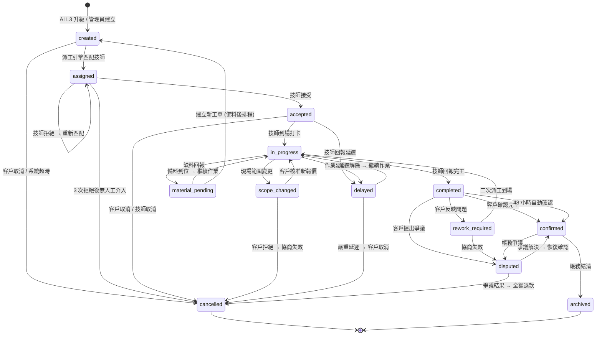
```mermaid
stateDiagram-v2
    [*] --> created : AI L3 升級 / 管理員建立

    created --> assigned : 派工引擎匹配技師
    created --> cancelled : 客戶取消 / 系統超時

    assigned --> accepted : 技師接受
    assigned --> assigned : 技師拒絕 → 重新匹配
    assigned --> cancelled : 3 次拒絕後無人工介入

    accepted --> in_progress : 技師到場打卡
    accepted --> delayed : 技師回報延遲
    accepted --> cancelled : 客戶取消 / 技師取消

    in_progress --> completed : 技師回報完工
    in_progress --> scope_changed : 現場範圍變更
    in_progress --> material_pending : 缺料回報
    in_progress --> delayed : 作業延遲

    scope_changed --> in_progress : 客戶核准新報價
    scope_changed --> cancelled : 客戶拒絕 → 協商失敗

    material_pending --> in_progress : 備料到位 → 繼續作業
    material_pending --> created : 建立新工單 (備料後排程)

    delayed --> in_progress : 延遲解除 → 繼續作業
    delayed --> cancelled : 嚴重延遲 → 客戶取消

    completed --> confirmed : 客戶確認完工
    completed --> confirmed : 48 小時自動確認
    completed --> rework_required : 客戶反映問題
    completed --> disputed : 客戶提出爭議

    rework_required --> in_progress : 二次派工到場
    rework_required --> disputed : 協商失敗

    confirmed --> archived : 帳務結清
    confirmed --> disputed : 帳務爭議

    disputed --> confirmed : 爭議解決 → 恢復確認
    disputed --> cancelled : 爭議結果 → 全額退款

    cancelled --> [*]
    archived --> [*]
```

### 1.3 狀態轉換規則表

| 來源狀態 | 目標狀態 | 觸發條件 | 授權角色 | 是否需審批 |
|----------|----------|----------|----------|-----------|
| `created` | `assigned` | 派工引擎自動匹配完成 | System | 否 |
| `created` | `cancelled` | 客戶主動取消 / 5 分鐘無匹配 | Customer, System | 否 |
| `assigned` | `accepted` | 技師點擊「接受工單」 | Technician | 否 |
| `assigned` | `assigned` | 技師拒絕 → 匹配下一位 | Technician, System | 否 |
| `assigned` | `cancelled` | 連續 3 位技師拒絕且無人工介入 | Admin | 是 |
| `accepted` | `in_progress` | 技師到場 GPS 打卡 | Technician | 否 |
| `accepted` | `delayed` | 技師回報延遲並提供新 ETA | Technician | 否 |
| `accepted` | `cancelled` | 客戶 / 技師申請取消 | Customer, Technician | 是 (Admin) |
| `in_progress` | `completed` | 技師提交完工報告 + 照片 | Technician | 否 |
| `in_progress` | `scope_changed` | 技師回報範圍變更 | Technician | 否 |
| `in_progress` | `material_pending` | 技師回報缺料 | Technician | 否 |
| `in_progress` | `delayed` | 作業時間超出預估 | Technician | 否 |
| `scope_changed` | `in_progress` | 客戶核准新報價 | Customer | 否 |
| `scope_changed` | `cancelled` | 客戶拒絕新報價且協商失敗 | Customer, Admin | 是 |
| `material_pending` | `in_progress` | 備料完成，技師恢復作業 | Technician | 否 |
| `material_pending` | `created` | 需另排時間回訪 (建立新工單) | System | 否 |
| `delayed` | `in_progress` | 延遲解除 | Technician | 否 |
| `delayed` | `cancelled` | 嚴重延遲且客戶不接受 | Customer, Admin | 是 |
| `completed` | `confirmed` | 客戶主動確認 / 48 小時自動確認 | Customer, System | 否 |
| `completed` | `rework_required` | 客戶反映同一問題 | Customer | 否 |
| `completed` | `disputed` | 客戶提出服務/價格爭議 | Customer | 否 |
| `rework_required` | `in_progress` | 二次派工技師到場 | Technician | 否 |
| `rework_required` | `disputed` | 二次維修仍不滿意 | Customer | 否 |
| `confirmed` | `archived` | 帳務結清、對帳完成 | Finance | 否 |
| `confirmed` | `disputed` | 帳務爭議 | Customer, Technician | 否 |
| `disputed` | `confirmed` | 爭議結案 → 恢復 | Admin | 是 |
| `disputed` | `cancelled` | 爭議結案 → 全額退款 | Admin, Finance | 是 (雙簽) |
| 任意狀態 | `cancelled` | 管理員強制取消 (附原因) | Admin | 是 |
| 任意狀態 | `disputed` | 客戶投訴升級 | Customer, Admin | 否 |

---

## 2. 角色定義

### 2.1 角色職責矩陣

| 角色 | 識別碼 | 介面 | 核心職責 | 系統權限 |
|------|--------|------|----------|----------|
| **客戶** | `Customer` | LINE App | 報修問題、核准報價、確認完工、提交客訴、評分回饋 | 查看自身工單、核准/拒絕報價、提交回饋 |
| **AI 系統** | `AI_System` | 內部服務 | 建立 ProblemCard、觸發 L3 升級、自動建立工單、發送通知 | 建立工單、更新對話狀態、呼叫 LLM |
| **派工引擎** | `Dispatch_Engine` | 內部服務 | 多因子技師匹配、逾時處理、重派邏輯、負載均衡 | 查詢技師、更新工單派工狀態、觸發通知 |
| **技師** | `Technician` | Web App | 接受/拒絕工單、回報進度、提交完工報告與照片、回報異常 | 管理自身工單、上傳照片、提交報告 |
| **管理員/客服** | `Admin` | 管理面板 | 手動派工、處理客訴、審批退款、監控 SLA、覆核爭議 | 完整工單管理、技師管理、退款審批 |
| **財務** | `Finance` | 管理面板 | 帳務結算、退款執行、月結對帳、撥款作業 | 帳務管理、退款執行、結算報表 |

### 2.2 角色互動關係

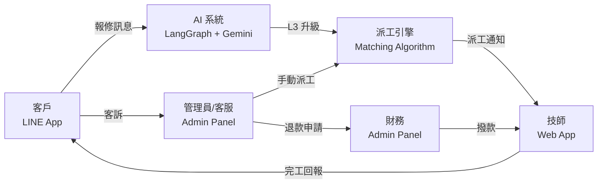
```mermaid
graph LR
    Customer["客戶<br/>LINE App"]
    AI["AI 系統<br/>LangGraph + Gemini"]
    Dispatch["派工引擎<br/>Matching Algorithm"]
    Tech["技師<br/>Web App"]
    Admin["管理員/客服<br/>Admin Panel"]
    Finance["財務<br/>Admin Panel"]

    Customer -->|報修訊息| AI
    AI -->|L3 升級| Dispatch
    Dispatch -->|派工通知| Tech
    Tech -->|完工回報| Customer
    Customer -->|客訴| Admin
    Admin -->|退款申請| Finance
    Admin -->|手動派工| Dispatch
    Finance -->|撥款| Tech
```

---

## 3. SLA 定義

### 3.1 各階段 SLA 時限

| 階段 | SLA 時限 | 計時起點 | 違反動作 | 通知對象 |
|------|----------|----------|----------|----------|
| 派工匹配 (一般) | < 5 分鐘 | 工單建立 (`created`) | 自動升級至人工派工 | Admin |
| 派工匹配 (Red_Code) | < 30 秒 | Red_Code 觸發 | 立即推播最近可用技師 | Admin + Ops Manager |
| 技師回應 (一般) | < 15 分鐘 | 工單派出 (`assigned`) | 逾時 → 自動匹配下一位候選技師 | Admin (第 2 次逾時) |
| 技師回應 (Red_Code) | < 5 分鐘 | Red_Code 派工 | 逾時 → 立即匹配下一位 + 通知主管 | Admin + Ops Manager |
| 技師到場 | 預約時段 ±30 分鐘 | 預約時間到達 | 延遲通知 → 客戶；>30 分鐘 → Admin 警報 | Customer, Admin |
| 完工時限 (一般) | 當日內 | 技師到場打卡 | Admin 警報 + 客戶通知 | Admin, Customer |
| 完工時限 (緊急) | < 2 小時 | 技師到場打卡 | 自動升級至主管 | Admin, Ops Manager |
| 客戶確認 | < 48 小時 | 技師回報完工 | 48 小時後自動確認 | Customer (提醒 @ 24hr) |
| 範圍變更回應 | < 24 小時 | 技師提交範圍變更 | 升級至管理員處理 | Admin |
| 備料到位 | < 72 小時 | 技師回報缺料 | 自動建議客戶改期 | Customer, Admin |
| 客訴處理 (一般) | < 3 個工作日 | 客訴建立 | 升級至營運主管 | Ops Manager |
| 客訴處理 (高優先) | < 24 小時 | 客訴建立 | 升級至營運主管 + 主管回電 | Ops Manager |
| 退款處理 | < 5 個工作日 | 退款核准 | 自動升級至財務主管 | Finance Manager |
| 爭議解決 | < 7 個工作日 | 爭議建立 | 升級至營運總監 | Ops Director |

### 3.2 Red_Code 緊急觸發條件

以下關鍵字觸發 Red_Code 緊急流程（來源：`SOP-EMERGENCY-001.json` + `ocap_rules.json` OCAP-EMERGENCY-001）：

| 觸發關鍵字 | 嚴重度 | SLA |
|---|---|---|
| 被鎖在外面、進不了家門 | Emergency 5 | 30 秒回應 → 15 分鐘派工 → 2 小時到場 |
| 家裡有小孩、小孩被鎖在裡面 | Emergency 5 | 同上 + 建議撥打 119 |
| 爐子還開著 | Emergency 5 | 同上 + 建議撥打 119 |
| 寵物在裡面 | Emergency 4 | 30 秒回應 → 15 分鐘派工 → 2 小時到場 |
| 很急 | Emergency 4 | 標記緊急 + 優先派工 |

> Red_Code 工單的 `priority` 自動設為 `urgent`，跳過正常排隊直接推播最近可用技師。

### 3.3 SLA 違反處理流程

```
SLA 計時器觸發
    │
    ├─ 第 1 次違反 → 系統自動通知負責人
    ├─ 第 2 次違反 (同工單) → 升級至上級主管
    └─ 第 3 次違反 (同工單) → 標記為危機工單 + 全管道通知
```

---

## 4. Flow 1：正常路徑 (Happy Path)

### 4.1 觸發條件

工單建立有三種觸發路徑：

**路徑 A — 診斷推理引擎觸發** (自動)：
- `task_decompose` 輸出 `diagnosis_status = "recommend_dispatch"`（診斷推理超過 3 輪未收斂、或 LLM 判斷需到府）
- 詳見 `diagnostic-intelligence-architecture.md` §4 PDCA Loop

**路徑 B — 品牌錯誤碼直接觸發** (自動，跳過遠端嘗試)：
以下 7 個信號直接觸發派工，不進入遠端排查：

| 品牌 | 錯誤信號 | 失效模式 | 原因 |
|---|---|---|---|
| dormakaba | 紅燈閃 4 次 | FM-MECH-002 馬達異常 | 需更換馬達模組 |
| dormakaba | 紅燈常亮 | FM-ELEC-002 系統錯誤 | 需主機板檢測 |
| Philips | 紅燈閃 3 次 | FM-MECH-003 離合器異常 | 需更換離合器 |
| Kaadas | 紅燈閃 5 次 | FM-MECH-004 馬達堵轉 | 需鎖體檢查 |
| Milre | 面板全亮後熄滅 | FM-ELEC-001 主機板異常 | 需更換主機板 |
| 所有品牌 | 門扇反弓 | FM-MECH-005 | 需專業調整門/門框 |
| 所有品牌 | 承接板嚴重偏位 | FM-MECH-006 | 需重新校正安裝 |

> 來源：`SOP-DISPATCH-001.json` check_dispatch_signals + `SOP-HW-001.json`

**路徑 C — 管理員手動建立** (人工)：
- 管理員從 Admin Panel 建立工單（客訴升級、電話接單等）

### 4.2 參與角色

Customer, AI_System, Dispatch_Engine, Technician, Admin, Finance

### 4.3 流程圖

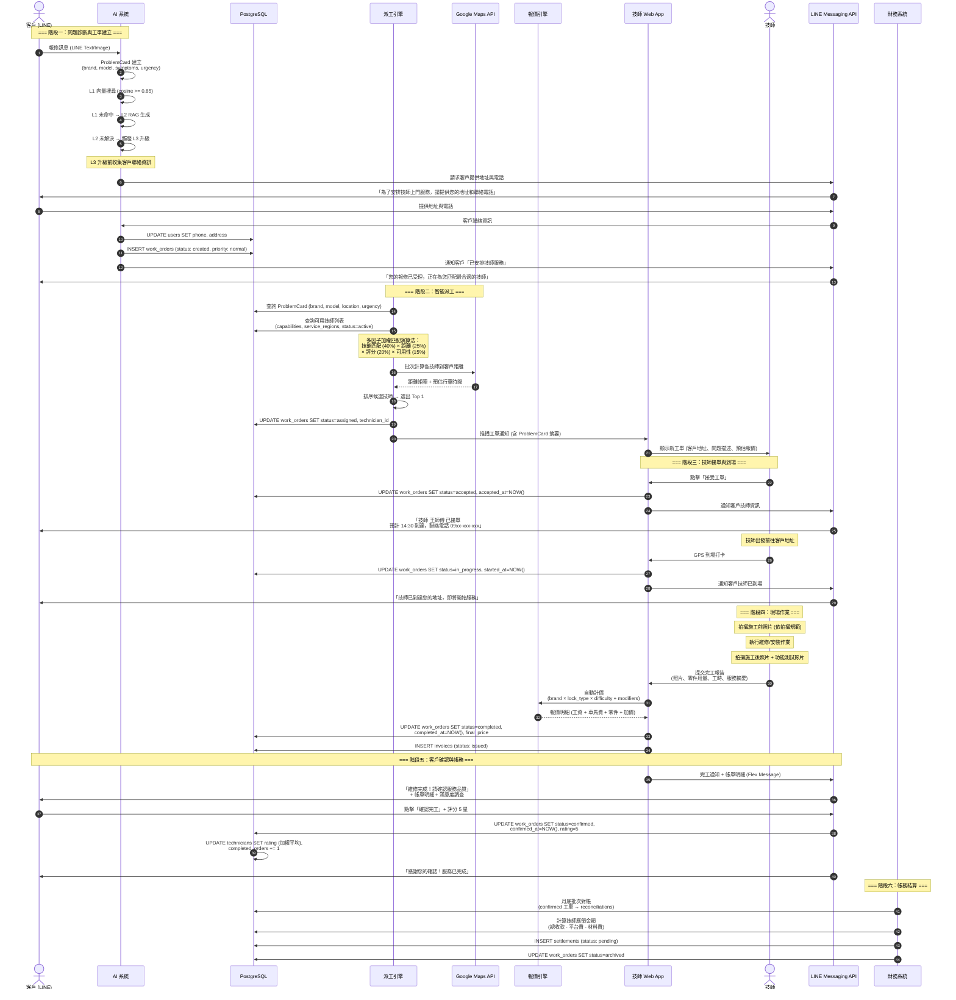
```mermaid
sequenceDiagram
    autonumber
    actor Customer as 客戶 (LINE)
    participant AI as AI 系統
    participant DB as PostgreSQL
    participant Dispatch as 派工引擎
    participant Maps as Google Maps API
    participant Pricing as 報價引擎
    participant TechApp as 技師 Web App
    actor Technician as 技師
    participant LINE as LINE Messaging API
    participant Finance as 財務系統

    Note over Customer, AI: === 階段一：問題診斷與工單建立 ===

    Customer->>AI: 報修訊息 (LINE Text/Image)
    AI->>AI: ProblemCard 建立<br/>(brand, model, symptoms, urgency)
    AI->>AI: L1 向量搜尋 (cosine >= 0.85)
    AI->>AI: L1 未命中 → L2 RAG 生成
    AI->>AI: L2 未解決 → 觸發 L3 升級

    Note over AI: L3 升級前收集客戶聯絡資訊

    AI->>LINE: 請求客戶提供地址與電話
    LINE->>Customer: 「為了安排技師上門服務，請提供您的地址和聯絡電話」
    Customer->>LINE: 提供地址與電話
    LINE->>AI: 客戶聯絡資訊
    AI->>DB: UPDATE users SET phone, address
    AI->>DB: INSERT work_orders (status: created, priority: normal)
    AI->>LINE: 通知客戶「已安排技師服務」
    LINE->>Customer: 「您的報修已受理，正在為您匹配最合適的技師」

    Note over Dispatch, Maps: === 階段二：智能派工 ===

    Dispatch->>DB: 查詢 ProblemCard (brand, model, location, urgency)
    Dispatch->>DB: 查詢可用技師列表<br/>(capabilities, service_regions, status=active)

    Note over Dispatch: 多因子加權匹配演算法：<br/>技能匹配 (40%) × 距離 (25%)<br/>× 評分 (20%) × 可用性 (15%)

    Dispatch->>Maps: 批次計算各技師到客戶距離
    Maps-->>Dispatch: 距離矩陣 + 預估行車時間
    Dispatch->>Dispatch: 排序候選技師 → 選出 Top 1
    Dispatch->>DB: UPDATE work_orders SET status=assigned, technician_id
    Dispatch->>TechApp: 推播工單通知 (含 ProblemCard 摘要)
    TechApp->>Technician: 顯示新工單 (客戶地址、問題描述、預估報價)

    Note over Technician, TechApp: === 階段三：技師接單與到場 ===

    Technician->>TechApp: 點擊「接受工單」
    TechApp->>DB: UPDATE work_orders SET status=accepted, accepted_at=NOW()
    TechApp->>LINE: 通知客戶技師資訊
    LINE->>Customer: 「技師 王師傅 已接單<br/>預計 14:30 到達，聯絡電話 09xx-xxx-xxx」

    Note over Technician: 技師出發前往客戶地址

    Technician->>TechApp: GPS 到場打卡
    TechApp->>DB: UPDATE work_orders SET status=in_progress, started_at=NOW()
    TechApp->>LINE: 通知客戶技師已到場
    LINE->>Customer: 「技師已到達您的地址，即將開始服務」

    Note over Technician: === 階段四：現場作業 ===

    Note over Technician: 拍攝施工前照片 (依拍攝規範)
    Note over Technician: 執行維修/安裝作業
    Note over Technician: 拍攝施工後照片 + 功能測試影片

    Technician->>TechApp: 提交完工報告<br/>(照片、零件用量、工時、服務摘要)
    TechApp->>Pricing: 自動計價<br/>(brand × lock_type × difficulty + modifiers)
    Pricing-->>TechApp: 報價明細 (工資 + 車馬費 + 零件 + 加價)
    TechApp->>DB: UPDATE work_orders SET status=completed,<br/>completed_at=NOW(), final_price
    TechApp->>DB: INSERT invoices (status: issued)

    Note over Customer, LINE: === 階段五：客戶確認與帳務 ===

    TechApp->>LINE: 完工通知 + 帳單明細 (Flex Message)
    LINE->>Customer: 「維修完成！請確認服務品質」<br/>+ 帳單明細 + 滿意度調查

    Customer->>LINE: 點擊「確認完工」+ 評分 5 星
    LINE->>DB: UPDATE work_orders SET status=confirmed,<br/>confirmed_at=NOW(), rating=5
    DB->>DB: UPDATE technicians SET rating (加權平均),<br/>completed_orders += 1
    LINE->>Customer: 「感謝您的確認！服務已完成」

    Note over Finance: === 階段六：帳務結算 ===

    Finance->>DB: 月底批次對帳<br/>(confirmed 工單 → reconciliations)
    Finance->>DB: 計算技師應領金額<br/>(總收款 - 平台費 - 材料費)
    Finance->>DB: INSERT settlements (status: pending)
    Finance->>DB: UPDATE work_orders SET status=archived
```

### 4.4 狀態轉換表

| 步驟 | 來源狀態 | 目標狀態 | 觸發動作 | 耗時預估 |
|------|----------|----------|----------|----------|
| 1 | — | `created` | AI 系統建立工單 | < 1 秒 |
| 2 | `created` | `assigned` | 派工引擎匹配完成 | < 5 分鐘 |
| 3 | `assigned` | `accepted` | 技師接受工單 | < 15 分鐘 |
| 4 | `accepted` | `in_progress` | 技師到場打卡 | 依預約時間 |
| 5 | `in_progress` | `completed` | 技師提交完工報告 | 30 分鐘 ~ 2 小時 |
| 6 | `completed` | `confirmed` | 客戶確認 / 48 小時自動確認 | < 48 小時 |
| 7 | `confirmed` | `archived` | 月底帳務結清 | 月結週期 |

### 4.5 通知清單

| 時機 | 通知方式 | 接收者 | 內容摘要 |
|------|----------|--------|----------|
| L3 升級 | LINE Flex | Customer | 「已安排技師服務，正在匹配中」 |
| 技師接單 | LINE Flex | Customer | 技師姓名、預計到達時間、聯絡電話 |
| 技師接單 | Web Push | Technician | 工單詳情、客戶地址、導航連結 |
| 技師到場 | LINE Push | Customer | 「技師已到達」 |
| 完工回報 | LINE Flex | Customer | 帳單明細 + 確認按鈕 + 滿意度調查 |
| 客戶確認 | Web Push | Technician | 「客戶已確認完工」 |
| 帳務結算 | Web Push | Technician | 月結對帳單 |

---

## 5. Flow 2：拒單與逾時重派

### 5.1 觸發條件

- 技師在收到工單後 15 分鐘內未回應 (逾時)
- 技師主動點擊「拒絕工單」

### 5.2 參與角色

Dispatch_Engine, Technician, Admin, Customer

### 5.3 流程圖

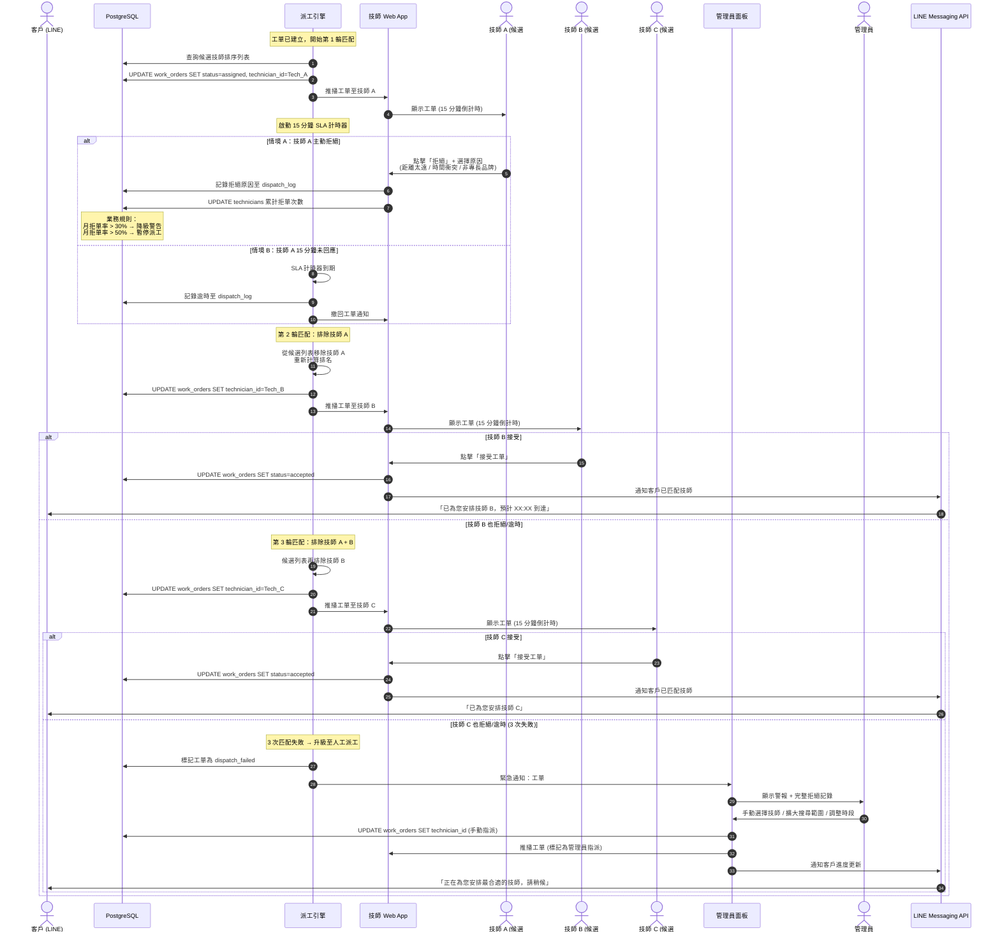
```mermaid
sequenceDiagram
    autonumber
    actor Customer as 客戶 (LINE)
    participant DB as PostgreSQL
    participant Dispatch as 派工引擎
    participant TechApp as 技師 Web App
    actor Tech1 as 技師 A (候選 #1)
    actor Tech2 as 技師 B (候選 #2)
    actor Tech3 as 技師 C (候選 #3)
    participant Admin as 管理員面板
    actor AdminUser as 管理員
    participant LINE as LINE Messaging API

    Note over Dispatch: 工單已建立，開始第 1 輪匹配

    Dispatch->>DB: 查詢候選技師排序列表
    Dispatch->>DB: UPDATE work_orders SET status=assigned, technician_id=Tech_A
    Dispatch->>TechApp: 推播工單至技師 A
    TechApp->>Tech1: 顯示工單 (15 分鐘倒計時)

    Note over Dispatch: 啟動 15 分鐘 SLA 計時器

    alt 情境 A：技師 A 主動拒絕
        Tech1->>TechApp: 點擊「拒絕」+ 選擇原因<br/>(距離太遠 / 時間衝突 / 非專長品牌)
        TechApp->>DB: 記錄拒絕原因至 dispatch_log
        TechApp->>DB: UPDATE technicians 累計拒單次數

        Note over DB: 業務規則：<br/>月拒單率 > 30% → 降級警告<br/>月拒單率 > 50% → 暫停派工
    else 情境 B：技師 A 15 分鐘未回應
        Dispatch->>Dispatch: SLA 計時器到期
        Dispatch->>DB: 記錄逾時至 dispatch_log
        Dispatch->>TechApp: 撤回工單通知
    end

    Note over Dispatch: 第 2 輪匹配：排除技師 A

    Dispatch->>Dispatch: 從候選列表移除技師 A<br/>重新計算排名
    Dispatch->>DB: UPDATE work_orders SET technician_id=Tech_B
    Dispatch->>TechApp: 推播工單至技師 B
    TechApp->>Tech2: 顯示工單 (15 分鐘倒計時)

    alt 技師 B 接受
        Tech2->>TechApp: 點擊「接受工單」
        TechApp->>DB: UPDATE work_orders SET status=accepted
        TechApp->>LINE: 通知客戶已匹配技師
        LINE->>Customer: 「已為您安排技師 B，預計 XX:XX 到達」
    else 技師 B 也拒絕/逾時
        Note over Dispatch: 第 3 輪匹配：排除技師 A + B

        Dispatch->>Dispatch: 候選列表再排除技師 B
        Dispatch->>DB: UPDATE work_orders SET technician_id=Tech_C
        Dispatch->>TechApp: 推播工單至技師 C
        TechApp->>Tech3: 顯示工單 (15 分鐘倒計時)

        alt 技師 C 接受
            Tech3->>TechApp: 點擊「接受工單」
            TechApp->>DB: UPDATE work_orders SET status=accepted
            TechApp->>LINE: 通知客戶已匹配技師
            LINE->>Customer: 「已為您安排技師 C」
        else 技師 C 也拒絕/逾時 (3 次失敗)

            Note over Dispatch: 3 次匹配失敗 → 升級至人工派工

            Dispatch->>DB: 標記工單為 dispatch_failed
            Dispatch->>Admin: 緊急通知：工單 #xxx 3 次匹配失敗
            Admin->>AdminUser: 顯示警報 + 完整拒絕記錄

            AdminUser->>Admin: 手動選擇技師 / 擴大搜尋範圍 / 調整時段
            Admin->>DB: UPDATE work_orders SET technician_id (手動指派)
            Admin->>TechApp: 推播工單 (標記為管理員指派)
            Admin->>LINE: 通知客戶進度更新
            LINE->>Customer: 「正在為您安排最合適的技師，請稍候」
        end
    end
```

### 5.4 狀態轉換表

| 步驟 | 來源狀態 | 目標狀態 | 觸發動作 |
|------|----------|----------|----------|
| 1 | `created` | `assigned` | 派工引擎匹配技師 A |
| 2a | `assigned` | `assigned` | 技師 A 拒絕 → 重新匹配技師 B |
| 2b | `assigned` | `assigned` | 技師 A 逾時 → 重新匹配技師 B |
| 3 | `assigned` | `accepted` | 技師 B (或 C) 接受 |
| 4 (異常) | `assigned` | `assigned` | 3 次失敗 → 管理員手動指派 |

### 5.5 通知清單

| 時機 | 通知方式 | 接收者 | 內容摘要 |
|------|----------|--------|----------|
| 第 2 輪重派 | — | Customer | (不通知客戶，避免焦慮) |
| 第 3 輪重派 | LINE Push | Customer | 「正在為您尋找最合適的技師」 |
| 3 次失敗 | Web Alert | Admin | 緊急：工單 3 次匹配失敗，需人工介入 |
| 人工指派完成 | LINE Flex | Customer | 已安排技師資訊 |
| 技師高拒單率 | Web Alert | Admin | 技師 xxx 月拒單率超過警戒值 |

### 5.6 業務規則

| 規則 | 閾值 | 動作 |
|------|------|------|
| 單次拒單 | — | 記錄原因，下次排序降權 |
| 月拒單率 > 30% | 30% | 系統發出降級警告 |
| 月拒單率 > 50% | 50% | 自動暫停派工 7 天 |
| 連續 3 次逾時未回應 | 3 次 | 標記為「離線」，暫停派工至手動恢復 |

---

## 6. Flow 3：範圍變更

### 6.1 觸發條件

- 技師到場後發現現場狀況與 ProblemCard 描述不符
- 需要額外工序 (如：門扇加工、更換型號)
- 維修範圍擴大導致報價變動

### 6.2 參與角色

Technician, Customer, Admin, Dispatch_Engine

### 6.3 流程圖

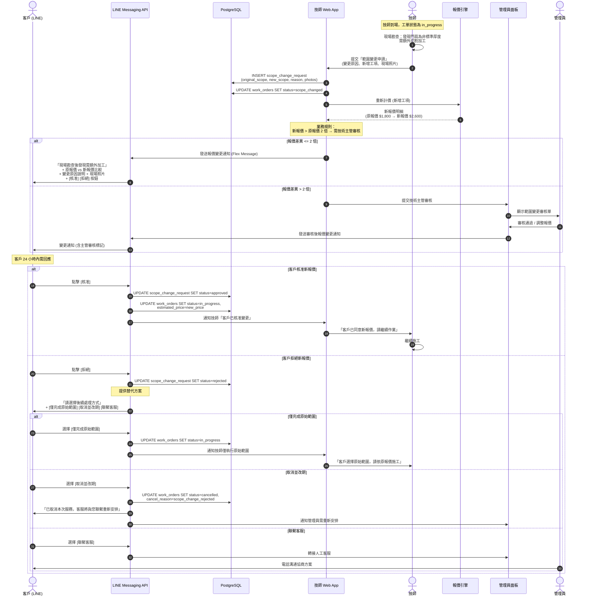
```mermaid
sequenceDiagram
    autonumber
    actor Customer as 客戶 (LINE)
    participant LINE as LINE Messaging API
    participant DB as PostgreSQL
    participant TechApp as 技師 Web App
    actor Technician as 技師
    participant Pricing as 報價引擎
    participant Admin as 管理員面板
    actor AdminUser as 管理員

    Note over Technician: 技師到場，工單狀態為 in_progress

    Technician->>Technician: 現場勘查：發現門扇為非標準厚度<br/>需額外切割加工
    Technician->>TechApp: 提交「範圍變更申請」<br/>(變更原因、新增工項、現場照片)

    TechApp->>DB: INSERT scope_change_request<br/>(original_scope, new_scope, reason, photos)
    TechApp->>DB: UPDATE work_orders SET status=scope_changed

    TechApp->>Pricing: 重新計價 (新增工項)
    Pricing-->>TechApp: 新報價明細<br/>(原報價 $1,800 → 新報價 $2,600)

    Note over TechApp: 業務規則：<br/>新報價 > 原報價 2 倍 → 需技術主管審核

    alt 報價差異 <= 2 倍
        TechApp->>LINE: 發送報價變更通知 (Flex Message)
        LINE->>Customer: 「現場勘查後發現需額外加工」<br/>+ 原報價 vs 新報價比較<br/>+ 變更原因說明 + 現場照片<br/>+ [核准] [拒絕] 按鈕
    else 報價差異 > 2 倍
        TechApp->>Admin: 提交技術主管審核
        Admin->>AdminUser: 顯示範圍變更審核單
        AdminUser->>Admin: 審核通過 / 調整報價
        Admin->>LINE: 發送審核後報價變更通知
        LINE->>Customer: 變更通知 (含主管審核標記)
    end

    Note over Customer: 客戶 24 小時內需回應

    alt 客戶核准新報價
        Customer->>LINE: 點擊 [核准]
        LINE->>DB: UPDATE scope_change_request SET status=approved
        LINE->>DB: UPDATE work_orders SET status=in_progress,<br/>estimated_price=new_price
        LINE->>TechApp: 通知技師「客戶已核准變更」
        TechApp->>Technician: 「客戶已同意新報價，請繼續作業」
        Technician->>Technician: 繼續施工

    else 客戶拒絕新報價
        Customer->>LINE: 點擊 [拒絕]
        LINE->>DB: UPDATE scope_change_request SET status=rejected

        Note over LINE: 提供替代方案

        LINE->>Customer: 「請選擇後續處理方式」<br/>+ [僅完成原始範圍] [取消並改期] [聯繫客服]

        alt 僅完成原始範圍
            Customer->>LINE: 選擇 [僅完成原始範圍]
            LINE->>DB: UPDATE work_orders SET status=in_progress
            LINE->>TechApp: 通知技師僅執行原始範圍
            TechApp->>Technician: 「客戶選擇原始範圍，請依原報價施工」
        else 取消並改期
            Customer->>LINE: 選擇 [取消並改期]
            LINE->>DB: UPDATE work_orders SET status=cancelled,<br/>cancel_reason=scope_change_rejected
            LINE->>Customer: 「已取消本次服務，客服將與您聯繫重新安排」
            LINE->>Admin: 通知管理員需重新安排
        else 聯繫客服
            Customer->>LINE: 選擇 [聯繫客服]
            LINE->>Admin: 轉接人工客服
            AdminUser->>Customer: 電話溝通協商方案
        end
    end
```

### 6.4 狀態轉換表

| 步驟 | 來源狀態 | 目標狀態 | 觸發動作 |
|------|----------|----------|----------|
| 1 | `in_progress` | `scope_changed` | 技師提交範圍變更 |
| 2a | `scope_changed` | `in_progress` | 客戶核准新報價 |
| 2b | `scope_changed` | `in_progress` | 客戶選擇僅完成原始範圍 |
| 2c | `scope_changed` | `cancelled` | 客戶拒絕且選擇取消 |

### 6.5 通知清單

| 時機 | 通知方式 | 接收者 | 內容摘要 |
|------|----------|--------|----------|
| 範圍變更提交 | LINE Flex | Customer | 原報價 vs 新報價 + 變更原因 + 照片 |
| 報價 > 2 倍 | Web Alert | Admin | 需技術主管審核 |
| 客戶核准 | Web Push | Technician | 客戶已同意新報價 |
| 客戶拒絕 | Web Push | Technician | 客戶選擇方案 (原範圍/取消/協商) |
| 24 小時未回應 | LINE Push | Customer | 提醒確認範圍變更 |
| 24 小時未回應 | Web Alert | Admin | 範圍變更超時未回應 |

---

## 7. Flow 4：缺料處理

### 7.1 觸發條件

- 技師到場後發現所需零件未攜帶或庫存不足
- 零件型號與現場實際不符需特殊零件

### 7.2 參與角色

Technician, Customer, Admin, Dispatch_Engine

### 7.3 流程圖

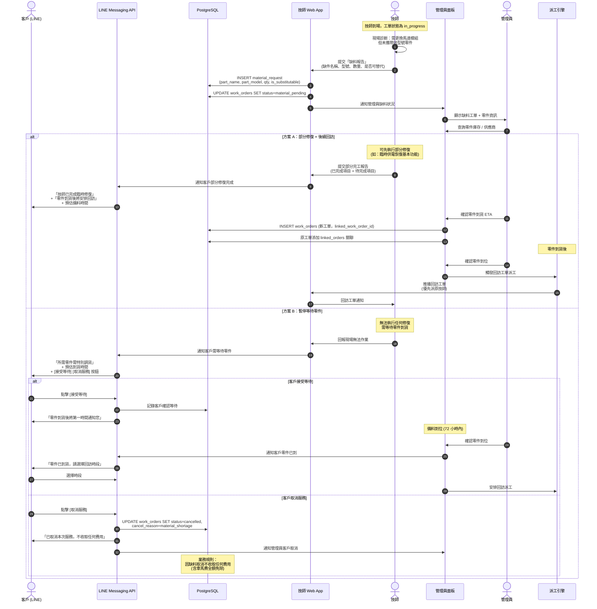
```mermaid
sequenceDiagram
    autonumber
    actor Customer as 客戶 (LINE)
    participant LINE as LINE Messaging API
    participant DB as PostgreSQL
    participant TechApp as 技師 Web App
    actor Technician as 技師
    participant Admin as 管理員面板
    actor AdminUser as 管理員
    participant Dispatch as 派工引擎

    Note over Technician: 技師到場，工單狀態為 in_progress

    Technician->>Technician: 現場診斷：需更換馬達模組<br/>但未攜帶該型號零件
    Technician->>TechApp: 提交「缺料報告」<br/>(缺件名稱、型號、數量、是否可替代)

    TechApp->>DB: INSERT material_request<br/>(part_name, part_model, qty, is_substitutable)
    TechApp->>DB: UPDATE work_orders SET status=material_pending

    TechApp->>Admin: 通知管理員缺料狀況
    Admin->>AdminUser: 顯示缺料工單 + 零件資訊

    AdminUser->>Admin: 查詢零件庫存 / 供應商

    alt 方案 A：部分修復 + 後續回訪
        Note over Technician: 可先執行部分修復<br/>(如：臨時供電恢復基本功能)

        Technician->>TechApp: 提交部分完工報告<br/>(已完成項目 + 待完成項目)
        TechApp->>LINE: 通知客戶部分修復完成
        LINE->>Customer: 「技師已完成臨時修復」<br/>+「零件到貨後將安排回訪」<br/>+ 預估備料時間

        AdminUser->>Admin: 確認零件到貨 ETA
        Admin->>DB: INSERT work_orders (新工單，linked_work_order_id)
        Admin->>DB: 原工單添加 linked_orders 關聯

        Note over Dispatch: 零件到貨後

        AdminUser->>Admin: 確認零件到位
        Admin->>Dispatch: 觸發回訪工單派工
        Dispatch->>TechApp: 推播回訪工單<br/>(優先派原技師)
        TechApp->>Technician: 回訪工單通知

    else 方案 B：暫停等待零件
        Note over Technician: 無法執行任何修復<br/>需等待零件到貨

        Technician->>TechApp: 回報現場無法作業
        TechApp->>LINE: 通知客戶需等待零件
        LINE->>Customer: 「所需零件需特別調貨」<br/>+ 預估到貨時間<br/>+ [接受等待] [取消服務] 按鈕

        alt 客戶接受等待
            Customer->>LINE: 點擊 [接受等待]
            LINE->>DB: 記錄客戶確認等待
            LINE->>Customer: 「零件到貨後將第一時間通知您」

            Note over Admin: 備料到位 (72 小時內)

            AdminUser->>Admin: 確認零件到位
            Admin->>LINE: 通知客戶零件已到
            LINE->>Customer: 「零件已到貨，請選擇回訪時段」
            Customer->>LINE: 選擇時段
            Admin->>Dispatch: 安排回訪派工

        else 客戶取消服務
            Customer->>LINE: 點擊 [取消服務]
            LINE->>DB: UPDATE work_orders SET status=cancelled,<br/>cancel_reason=material_shortage
            LINE->>Customer: 「已取消本次服務，不收取任何費用」
            LINE->>Admin: 通知管理員客戶取消

            Note over DB: 業務規則：<br/>因缺料取消不收取任何費用<br/>(含車馬費全額免除)
        end
    end
```

### 7.4 狀態轉換表

| 步驟 | 來源狀態 | 目標狀態 | 觸發動作 |
|------|----------|----------|----------|
| 1 | `in_progress` | `material_pending` | 技師回報缺料 |
| 2a | `material_pending` | `completed` (部分) | 部分修復完成 + 建立回訪工單 |
| 2b | `material_pending` | `material_pending` | 等待零件到貨 |
| 3a | `material_pending` | `in_progress` | 備料到位 → 繼續作業 |
| 3b | `material_pending` | `cancelled` | 客戶不願等待取消 |
| 回訪 | `created` (新工單) | ... | 備料完成後建立新工單 |

### 7.5 通知清單

| 時機 | 通知方式 | 接收者 | 內容摘要 |
|------|----------|--------|----------|
| 缺料回報 | Web Alert | Admin | 缺件名稱、型號、工單編號 |
| 缺料回報 | LINE Push | Customer | 缺料狀況說明 + 預估備料時間 |
| 部分修復完成 | LINE Flex | Customer | 已完成項目 + 回訪時程 |
| 零件到位 | LINE Push | Customer | 零件到貨通知 + 預約回訪 |
| 零件到位 | Web Push | Technician | 回訪工單通知 |
| 72 小時未到貨 | Web Alert | Admin | 備料超時警報 |

---

## 8. Flow 5：延遲通知與改期

### 8.1 觸發條件

- 技師預計無法在預約時段內到達
- 維修作業時間超出預估
- 交通或天氣等外部因素導致延遲

### 8.2 參與角色

Technician, Customer, Admin

### 8.3 流程圖

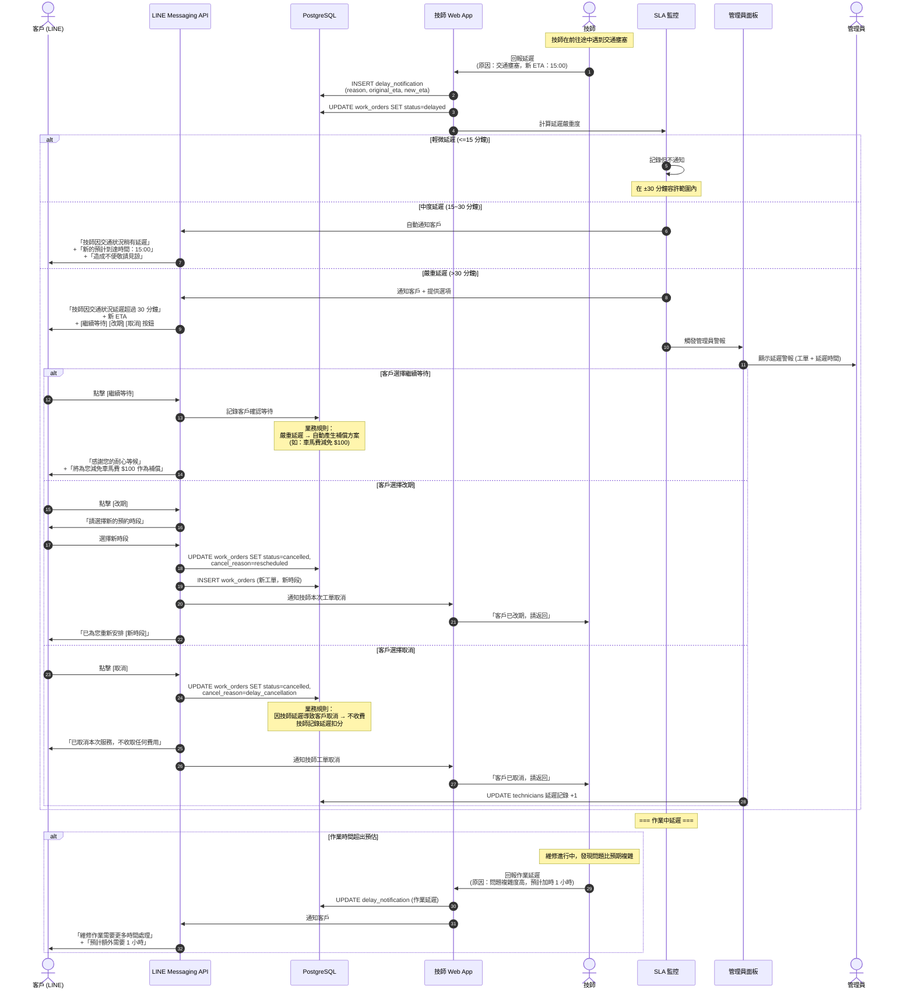
```mermaid
sequenceDiagram
    autonumber
    actor Customer as 客戶 (LINE)
    participant LINE as LINE Messaging API
    participant DB as PostgreSQL
    participant TechApp as 技師 Web App
    actor Technician as 技師
    participant SLA as SLA 監控
    participant Admin as 管理員面板
    actor AdminUser as 管理員

    Note over Technician: 技師在前往途中遇到交通壅塞

    Technician->>TechApp: 回報延遲<br/>(原因：交通壅塞，新 ETA：15:00)
    TechApp->>DB: INSERT delay_notification<br/>(reason, original_eta, new_eta)
    TechApp->>DB: UPDATE work_orders SET status=delayed

    TechApp->>SLA: 計算延遲嚴重度

    alt 輕微延遲 (<=15 分鐘)
        SLA->>SLA: 記錄但不通知
        Note over SLA: 在 ±30 分鐘容許範圍內

    else 中度延遲 (15~30 分鐘)
        SLA->>LINE: 自動通知客戶
        LINE->>Customer: 「技師因交通狀況稍有延遲」<br/>+「新的預計到達時間：15:00」<br/>+「造成不便敬請見諒」

    else 嚴重延遲 (>30 分鐘)
        SLA->>LINE: 通知客戶 + 提供選項
        LINE->>Customer: 「技師因交通狀況延遲超過 30 分鐘」<br/>+ 新 ETA<br/>+ [繼續等待] [改期] [取消] 按鈕

        SLA->>Admin: 觸發管理員警報
        Admin->>AdminUser: 顯示延遲警報 (工單 + 延遲時間)

        alt 客戶選擇繼續等待
            Customer->>LINE: 點擊 [繼續等待]
            LINE->>DB: 記錄客戶確認等待

            Note over DB: 業務規則：<br/>嚴重延遲 → 自動產生補償方案<br/>(如：車馬費減免 $100)

            LINE->>Customer: 「感謝您的耐心等候」<br/>+「將為您減免車馬費 $100 作為補償」

        else 客戶選擇改期
            Customer->>LINE: 點擊 [改期]
            LINE->>Customer: 「請選擇新的預約時段」
            Customer->>LINE: 選擇新時段

            LINE->>DB: UPDATE work_orders SET status=cancelled,<br/>cancel_reason=rescheduled
            LINE->>DB: INSERT work_orders (新工單，新時段)
            LINE->>TechApp: 通知技師本次工單取消
            TechApp->>Technician: 「客戶已改期，請返回」
            LINE->>Customer: 「已為您重新安排 [新時段]」

        else 客戶選擇取消
            Customer->>LINE: 點擊 [取消]
            LINE->>DB: UPDATE work_orders SET status=cancelled,<br/>cancel_reason=delay_cancellation

            Note over DB: 業務規則：<br/>因技師延遲導致客戶取消 → 不收費<br/>技師記錄延遲扣分

            LINE->>Customer: 「已取消本次服務，不收取任何費用」
            LINE->>TechApp: 通知技師工單取消
            TechApp->>Technician: 「客戶已取消，請返回」
            Admin->>DB: UPDATE technicians 延遲記錄 +1
        end
    end

    Note over SLA: === 作業中延遲 ===

    alt 作業時間超出預估
        Note over Technician: 維修進行中，發現問題比預期複雜

        Technician->>TechApp: 回報作業延遲<br/>(原因：問題複雜度高，預計加時 1 小時)
        TechApp->>DB: UPDATE delay_notification (作業延遲)
        TechApp->>LINE: 通知客戶
        LINE->>Customer: 「維修作業需要更多時間處理」<br/>+「預計額外需要 1 小時」
    end
```

### 8.4 狀態轉換表

| 步驟 | 來源狀態 | 目標狀態 | 觸發動作 |
|------|----------|----------|----------|
| 1 | `accepted` / `in_progress` | `delayed` | 技師回報延遲 |
| 2a | `delayed` | `in_progress` | 輕微延遲 → 技師到場 |
| 2b | `delayed` | `cancelled` + `created` | 客戶改期 → 取消舊單 + 建新單 |
| 2c | `delayed` | `cancelled` | 客戶取消 |

### 8.5 通知清單

| 時機 | 通知方式 | 接收者 | 內容摘要 |
|------|----------|--------|----------|
| 中度延遲 (15~30 min) | LINE Push | Customer | 延遲說明 + 新 ETA |
| 嚴重延遲 (>30 min) | LINE Flex | Customer | 延遲說明 + 繼續/改期/取消 選項 |
| 嚴重延遲 (>30 min) | Web Alert | Admin | 延遲警報 + 工單資訊 |
| 客戶確認等待 | — | — | 自動產生補償方案 |
| 客戶改期 | Web Push | Technician | 本次工單取消，客戶已改期 |
| 作業延遲 | LINE Push | Customer | 預計額外所需時間 |

### 8.6 補償規則

| 延遲程度 | 補償方案 | 自動/人工 |
|----------|----------|-----------|
| 15~30 分鐘 | 無補償 (在 SLA 容許範圍) | — |
| 30~60 分鐘 | 車馬費減免 $100 | 自動 |
| > 60 分鐘 | 車馬費全免 + $200 折扣碼 | 自動 |
| 技師未到 (no-show) | 全額免費 + $500 折扣碼 + 優先重派 | 自動 + 人工跟進 |

---

## 9. Flow 6：退款審批與大額雙簽

### 9.1 觸發條件

- 客戶透過 LINE 或客服申請退款
- 工單完成後客戶對服務品質/收費不滿
- 爭議處理結果為退款

### 9.2 參與角色

Customer, Admin, Finance

### 9.3 流程圖

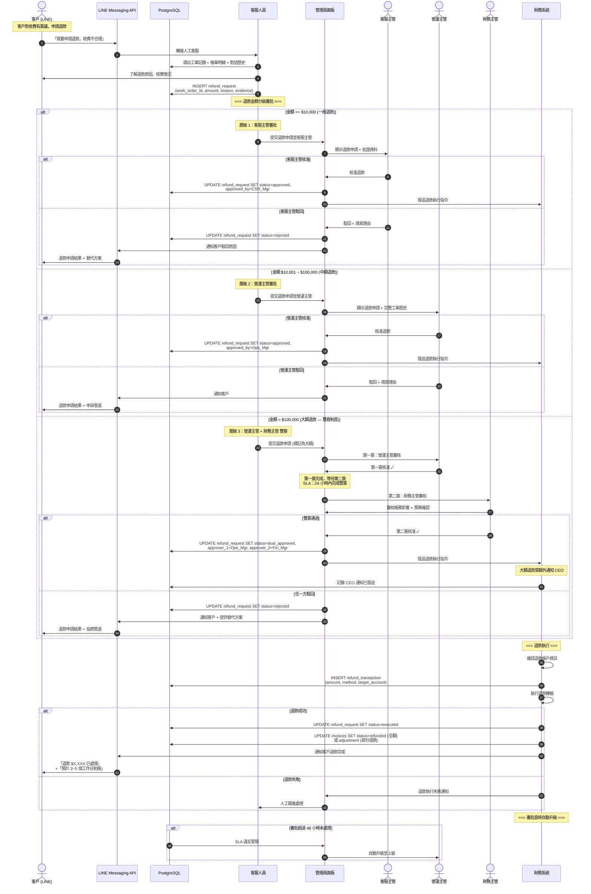
```mermaid
sequenceDiagram
    autonumber
    actor Customer as 客戶 (LINE)
    participant LINE as LINE Messaging API
    participant DB as PostgreSQL
    participant CSR as 客服人員
    participant Admin as 管理員面板
    actor CSRMgr as 客服主管
    actor OpsMgr as 營運主管
    actor FinMgr as 財務主管
    participant Finance as 財務系統

    Note over Customer: 客戶對收費有異議，申請退款

    Customer->>LINE: 「我要申請退款，收費不合理」
    LINE->>CSR: 轉接人工客服

    CSR->>DB: 調出工單記錄 + 帳單明細 + 對話歷史
    CSR->>Customer: 了解退款原因、核實情況

    CSR->>DB: INSERT refund_request<br/>(work_order_id, amount, reason, evidence)

    Note over CSR: === 退款金額分級審批 ===

    alt 金額 <= $10,000 (一般退款)
        Note over CSR: 層級 1：客服主管審批

        CSR->>Admin: 提交退款申請至客服主管
        Admin->>CSRMgr: 顯示退款申請 + 佐證資料

        alt 客服主管核准
            CSRMgr->>Admin: 核准退款
            Admin->>DB: UPDATE refund_request SET status=approved,<br/>approved_by=CSR_Mgr
            Admin->>Finance: 發送退款執行指令
        else 客服主管駁回
            CSRMgr->>Admin: 駁回 + 填寫理由
            Admin->>DB: UPDATE refund_request SET status=rejected
            Admin->>LINE: 通知客戶駁回原因
            LINE->>Customer: 退款申請結果 + 替代方案
        end

    else 金額 $10,001 ~ $100,000 (中額退款)
        Note over CSR: 層級 2：營運主管審批

        CSR->>Admin: 提交退款申請至營運主管
        Admin->>OpsMgr: 顯示退款申請 + 完整工單歷史

        alt 營運主管核准
            OpsMgr->>Admin: 核准退款
            Admin->>DB: UPDATE refund_request SET status=approved,<br/>approved_by=Ops_Mgr
            Admin->>Finance: 發送退款執行指令
        else 營運主管駁回
            OpsMgr->>Admin: 駁回 + 填寫理由
            Admin->>LINE: 通知客戶
            LINE->>Customer: 退款申請結果 + 申訴管道
        end

    else 金額 > $100,000 (大額退款 — 雙簽制度)
        Note over CSR: 層級 3：營運主管 + 財務主管 雙簽

        CSR->>Admin: 提交退款申請 (標記為大額)
        Admin->>OpsMgr: 第一簽：營運主管審核
        OpsMgr->>Admin: 第一簽核准 ✓

        Note over Admin: 第一簽完成，等待第二簽<br/>SLA：24 小時內完成雙簽

        Admin->>FinMgr: 第二簽：財務主管審核
        FinMgr->>Admin: 審核帳務影響 + 預算確認

        alt 雙簽通過
            FinMgr->>Admin: 第二簽核准 ✓
            Admin->>DB: UPDATE refund_request SET status=dual_approved,<br/>approver_1=Ops_Mgr, approver_2=Fin_Mgr
            Admin->>Finance: 發送退款執行指令

            Note over Finance: 大額退款需額外通知 CEO
            Finance->>DB: 記錄 CEO 通知已發送
        else 任一方駁回
            Admin->>DB: UPDATE refund_request SET status=rejected
            Admin->>LINE: 通知客戶 + 提供替代方案
            LINE->>Customer: 退款申請結果 + 協商管道
        end
    end

    Note over Finance: === 退款執行 ===

    Finance->>Finance: 確認退款帳戶資訊
    Finance->>DB: INSERT refund_transaction<br/>(amount, method, target_account)
    Finance->>Finance: 執行退款轉帳

    alt 退款成功
        Finance->>DB: UPDATE refund_request SET status=executed
        Finance->>DB: UPDATE invoices SET status=refunded (全額)<br/>或 adjustment (部分退款)
        Finance->>LINE: 通知客戶退款完成
        LINE->>Customer: 「退款 $X,XXX 已處理」<br/>+「預計 3~5 個工作日到帳」
    else 退款失敗
        Finance->>Admin: 退款執行失敗通知
        Admin->>CSR: 人工跟進處理
    end

    Note over Finance: === 審批逾時自動升級 ===

    alt 審批超過 48 小時未處理
        DB->>Admin: SLA 違反警報
        Admin->>OpsMgr: 自動升級至上級
    end
```

### 9.4 狀態轉換表

| 步驟 | 來源狀態 | 目標狀態 | 觸發動作 |
|------|----------|----------|----------|
| 1 | — | `refund_pending` | 客服建立退款申請 |
| 2a | `refund_pending` | `refund_approved` | 單簽核准 (<= $100K) |
| 2b | `refund_pending` | `refund_dual_approved` | 雙簽核准 (> $100K) |
| 2c | `refund_pending` | `refund_rejected` | 審批駁回 |
| 3 | `refund_approved` / `refund_dual_approved` | `refund_executed` | 財務完成退款 |
| 4 | `refund_executed` | `refund_failed` | 退款轉帳失敗 |

### 9.5 通知清單

| 時機 | 通知方式 | 接收者 | 內容摘要 |
|------|----------|--------|----------|
| 退款申請建立 | Web Alert | 審批人 (依金額) | 退款申請詳情 |
| 審批完成 | LINE Push | Customer | 審批結果 |
| 雙簽第一簽 | Web Alert | 財務主管 | 等待第二簽 |
| 退款執行完成 | LINE Flex | Customer | 退款金額 + 到帳預估 |
| 退款失敗 | Web Alert | Admin, Finance | 需人工跟進 |
| 審批超時 | Web Alert | 上級主管 | SLA 違反自動升級 |
| 大額退款 (> $100K) | Email | CEO | 大額退款通知 |

### 9.6 審批層級表

| 退款金額 | 審批層級 | 審批人 | SLA |
|----------|----------|--------|-----|
| <= $10,000 | 單簽 | 客服主管 | 24 小時 |
| $10,001 ~ $100,000 | 單簽 | 營運主管 | 24 小時 |
| > $100,000 | 雙簽 | 營運主管 + 財務主管 | 24 小時 (每簽) |
| > $100,000 (核准後) | 通知 | CEO | 知會 (不需核准) |

---

## 10. Flow 7：保固爭議

### 10.1 觸發條件

- 客戶宣稱產品在保固期內故障
- 保固起算日認定有爭議 (常見：點交日 vs 入住日)
- 保固期邊界案件

### 10.2 參與角色

Customer, AI_System, Admin

### 10.3 流程圖

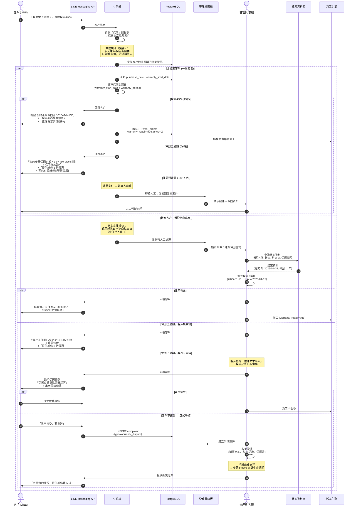
```mermaid
sequenceDiagram
    autonumber
    actor Customer as 客戶 (LINE)
    participant LINE as LINE Messaging API
    participant AI as AI 系統
    participant DB as PostgreSQL
    participant Admin as 管理員面板
    actor AdminUser as 管理員/客服
    participant ProjectDB as 建案資料庫
    participant Dispatch as 派工引擎

    Customer->>LINE: 「我的電子鎖壞了，還在保固期內」
    LINE->>AI: 客戶訊息

    AI->>AI: 偵測「保固」關鍵詞<br/>→ 標記為高風險案件

    Note over AI: 業務規則（鐵律）：<br/>涉及建案/保固期案件<br/>AI 嚴禁報價，必須轉真人

    AI->>DB: 查詢客戶地址關聯的建案資訊

    alt 非建案客戶 (一般零售)
        AI->>DB: 查詢 purchase_date / warranty_start_date
        AI->>AI: 計算保固到期日<br/>(warranty_start_date + warranty_period)

        alt 保固期內 (明確)
            AI->>LINE: 回覆客戶
            LINE->>Customer: 「經查您的產品保固至 YYYY-MM-DD」<br/>+「保固期內免費維修」<br/>+「正在為您安排技師」

            AI->>DB: INSERT work_orders<br/>(warranty_repair=true, price=0)
            AI->>Dispatch: 觸發免費維修派工

        else 保固已過期 (明確)
            AI->>LINE: 回覆客戶
            LINE->>Customer: 「您的產品保固已於 YYYY-MM-DD 到期」<br/>+ 保固條款說明<br/>+「提供維修 8 折優惠」<br/>+ [預約付費維修] [聯繫客服]

        else 保固期邊界 (±30 天內)
            Note over AI: 邊界案件 → 轉真人處理
            AI->>Admin: 轉接人工：保固期邊界案件
            Admin->>AdminUser: 顯示案件 + 保固資訊
            AdminUser->>Customer: 人工判斷處理
        end

    else 建案客戶 (社區/建商專案)
        Note over AI: 建案案件鐵律：<br/>保固起算日 = 建商點交日<br/>（非住戶入住日）

        AI->>Admin: 強制轉人工處理
        Admin->>AdminUser: 顯示案件：建案保固查詢

        AdminUser->>ProjectDB: 查詢建案資料<br/>(社區名稱, 建商, 點交日, 保固期限)
        ProjectDB-->>AdminUser: 建案資料<br/>(點交日: 2025-01-15, 保固: 1 年)

        AdminUser->>AdminUser: 計算保固到期日<br/>(2025-01-15 + 1 年 = 2026-01-15)

        alt 保固有效
            AdminUser->>LINE: 回覆客戶
            LINE->>Customer: 「經查貴社區保固至 2026-01-15」<br/>+「將安排免費維修」
            AdminUser->>Dispatch: 派工 (warranty_repair=true)

        else 保固已過期，客戶無異議
            AdminUser->>LINE: 回覆客戶
            LINE->>Customer: 「貴社區保固已於 2026-01-15 到期」<br/>+ 保固條款<br/>+「提供維修 8 折優惠」

        else 保固已過期，客戶有異議
            Note over AdminUser: 客戶堅持「住進來才半年」<br/>保固起算日有爭議

            AdminUser->>LINE: 回覆客戶
            LINE->>Customer: 說明保固條款<br/>「保固自建商點交日起算」<br/>+ 出示書面依據

            alt 客戶接受
                Customer->>LINE: 接受付費維修
                AdminUser->>Dispatch: 派工 (付費)
            else 客戶不接受 → 正式爭議
                Customer->>LINE: 「我不接受，要投訴」
                LINE->>DB: INSERT complaint<br/>(type=warranty_dispute)
                AdminUser->>Admin: 建立爭議案件
                AdminUser->>AdminUser: 收集證據<br/>(購買合約、點交記錄、保固書)

                Note over AdminUser: 爭議處理流程<br/>→ 參見 Flow 9 客訴生命週期

                AdminUser->>LINE: 提供折衷方案
                LINE->>Customer: 「考量您的情況，提供維修費 5 折」
            end
        end
    end
```

### 10.4 狀態轉換表

| 步驟 | 來源狀態 | 目標狀態 | 觸發動作 |
|------|----------|----------|----------|
| 1 | — | `created` | 保固查詢 → 確認免費維修 → 建立工單 |
| 2 | — | — | 保固過期 → 客戶選擇付費維修 → 建立工單 |
| 3 | — | `disputed` | 保固認定爭議 → 進入爭議流程 |

### 10.5 通知清單

| 時機 | 通知方式 | 接收者 | 內容摘要 |
|------|----------|--------|----------|
| 保固關鍵詞觸發 | Web Alert | Admin | 高風險案件：保固查詢 |
| 建案案件 | Web Alert | Admin | 強制轉人工：建案保固 |
| 保固確認 (有效) | LINE Flex | Customer | 保固期限 + 免費維修安排 |
| 保固確認 (過期) | LINE Flex | Customer | 到期日 + 優惠方案 |
| 爭議建立 | Web Alert | Admin | 保固爭議案件 |

### 10.6 業務規則

| 規則 | 說明 |
|------|------|
| 保固起算日 | 建案客戶 = 建商點交日；零售客戶 = 購買日 |
| AI 報價禁令 | 涉及建案/保固案件，AI 嚴禁自動報價 |
| 邊界案件 | 保固到期前後 30 天內的案件一律轉人工 |
| 善意折讓 | 保固剛過期 (< 90 天) 可提供 8 折優惠 |
| 證據保存 | 所有保固認定需保留書面查詢記錄 |

---

## 11. Flow 8：品質不合格與二次派工

### 11.1 觸發條件

- 客戶在完工後 7 天內反映相同故障症狀 (「修了又壞」)
- 系統自動偵測：同一客戶 + 同一症狀 + 7 天內

### 11.2 參與角色

Customer, AI_System, Dispatch_Engine, Technician, Admin

### 11.3 流程圖

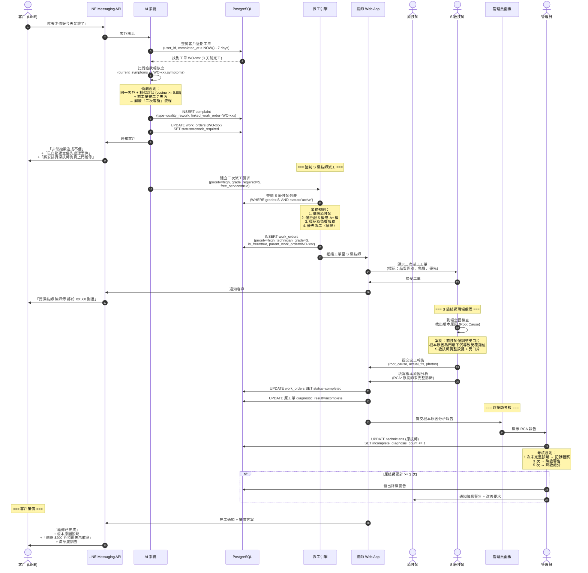
```mermaid
sequenceDiagram
    autonumber
    actor Customer as 客戶 (LINE)
    participant LINE as LINE Messaging API
    participant AI as AI 系統
    participant DB as PostgreSQL
    participant Dispatch as 派工引擎
    participant TechApp as 技師 Web App
    actor OrigTech as 原技師
    actor SGradeTech as S 級技師
    participant Admin as 管理員面板
    actor AdminUser as 管理員

    Customer->>LINE: 「昨天才修好今天又壞了」
    LINE->>AI: 客戶訊息

    AI->>DB: 查詢客戶近期工單<br/>(user_id, completed_at > NOW() - 7 days)
    DB-->>AI: 找到工單 WO-xxx (3 天前完工)

    AI->>AI: 比對症狀相似度<br/>(current_symptoms vs WO-xxx.symptoms)

    Note over AI: 偵測規則：<br/>同一客戶 + 相似症狀 (cosine >= 0.80)<br/>+ 前工單完工 7 天內<br/>→ 觸發「二次客訴」流程

    AI->>DB: INSERT complaint<br/>(type=quality_rework, linked_work_order=WO-xxx)
    AI->>DB: UPDATE work_orders (WO-xxx)<br/>SET status=rework_required

    AI->>LINE: 通知客戶
    LINE->>Customer: 「非常抱歉造成不便」<br/>+「已自動建立優先處理案件」<br/>+「將安排資深技師免費上門維修」

    Note over Dispatch: === 強制 S 級技師派工 ===

    AI->>Dispatch: 建立二次派工請求<br/>(priority=high, grade_required=S,<br/>free_service=true)

    Dispatch->>DB: 查詢 S 級技師列表<br/>(WHERE grade='S' AND status='active')

    Note over Dispatch: 業務規則：<br/>1. 排除原技師<br/>2. 僅匹配 S 級或 A+ 級<br/>3. 標記為免費服務<br/>4. 優先派工（插隊）

    Dispatch->>DB: INSERT work_orders<br/>(priority=high, technician_grade=S,<br/>is_free=true, parent_work_order=WO-xxx)
    Dispatch->>TechApp: 推播工單至 S 級技師
    TechApp->>SGradeTech: 顯示二次派工工單<br/>(標記：品質回訪、免費、優先)

    SGradeTech->>TechApp: 接受工單
    TechApp->>LINE: 通知客戶
    LINE->>Customer: 「資深技師 陳師傅 將於 XX:XX 到達」

    Note over SGradeTech: === S 級技師現場處理 ===

    SGradeTech->>SGradeTech: 到場全面檢查<br/>找出根本原因 (Root Cause)

    Note over SGradeTech: 案例：前技師僅調整受口片<br/>根本原因為門扇下沉導致反覆錯位<br/>S 級技師調整鉸鏈 + 受口片

    SGradeTech->>TechApp: 提交完工報告<br/>(root_cause, actual_fix, photos)
    SGradeTech->>TechApp: 填寫根本原因分析<br/>(RCA: 原技師未完整診斷)

    TechApp->>DB: UPDATE work_orders SET status=completed
    TechApp->>DB: UPDATE 原工單 diagnostic_result=incomplete

    Note over Admin: === 原技師考核 ===

    TechApp->>Admin: 提交根本原因分析報告
    Admin->>AdminUser: 顯示 RCA 報告

    AdminUser->>DB: UPDATE technicians (原技師)<br/>SET incomplete_diagnosis_count += 1

    Note over AdminUser: 考核規則：<br/>1 次未完整診斷 → 記錄觀察<br/>3 次 → 降級警告<br/>5 次 → 降級處分

    alt 原技師累計 >= 3 次
        AdminUser->>DB: 發出降級警告
        AdminUser->>OrigTech: 通知降級警告 + 改善要求
    end

    Note over Customer: === 客戶補償 ===

    TechApp->>LINE: 完工通知 + 補償方案
    LINE->>Customer: 「維修已完成」<br/>+ 根本原因說明<br/>+「贈送 $200 折扣碼表示歉意」<br/>+ 滿意度調查
```

### 11.4 狀態轉換表

| 步驟 | 來源狀態 | 目標狀態 | 觸發動作 |
|------|----------|----------|----------|
| 1 | `confirmed` / `completed` (原工單) | `rework_required` | 系統偵測 7 天內同症狀 |
| 2 | — (新工單) | `created` | 建立二次派工工單 |
| 3 | `created` | `assigned` | 強制 S 級技師匹配 |
| 4 | `assigned` | `accepted` | S 級技師接受 |
| 5 | `accepted` | `in_progress` | S 級技師到場 |
| 6 | `in_progress` | `completed` | 提交完工報告 + RCA |

### 11.5 通知清單

| 時機 | 通知方式 | 接收者 | 內容摘要 |
|------|----------|--------|----------|
| 二次客訴偵測 | LINE Push | Customer | 已建立優先案件 + 免費維修 |
| 二次客訴偵測 | Web Alert | Admin | 品質問題警報 + 原工單資訊 |
| S 級技師接單 | LINE Flex | Customer | 資深技師資訊 + 到達時間 |
| 完工 + RCA | Web Alert | Admin | 根本原因報告 |
| 原技師考核 | Web Push | 原技師 | 記錄通知 / 降級警告 |
| 客戶補償 | LINE Flex | Customer | 完工通知 + 折扣碼 |

### 11.6 偵測規則

| 參數 | 閾值 | 說明 |
|------|------|------|
| 時間窗口 | 7 天 | 前工單完工後 7 天內 |
| 症狀相似度 | cosine >= 0.80 | 使用 text-embedding-004 向量比對 |
| 客戶匹配 | 同一 user_id | 同一客戶帳號 |
| 自動觸發 | 是 | 無需人工介入 |

---

## 12. Flow 9：客訴處理完整生命週期

### 12.1 觸發條件

- 客戶透過 LINE 或電話提出投訴
- 系統自動偵測客戶負面情緒 (anger level >= 3)
- 其他流程升級 (如保固爭議、範圍變更糾紛)

### 12.2 參與角色

Customer, AI_System, Admin, Finance

### 12.3 客訴狀態機

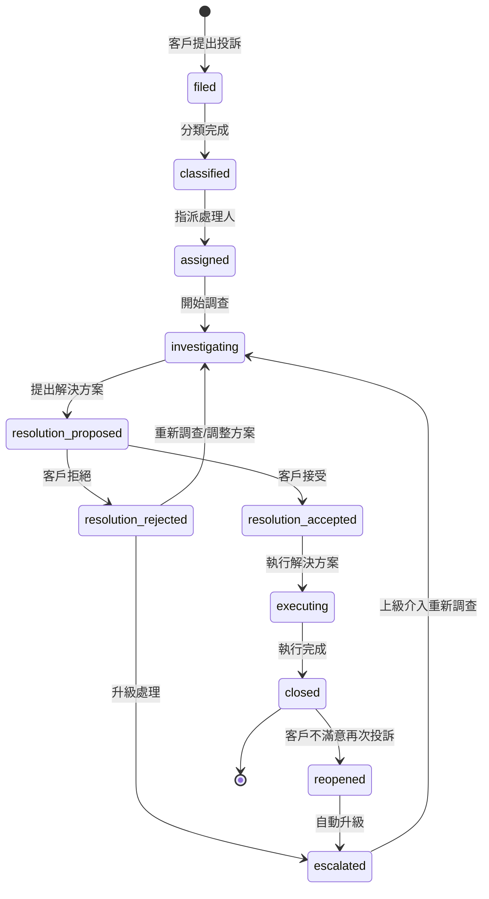
```mermaid
stateDiagram-v2
    [*] --> filed : 客戶提出投訴

    filed --> classified : 分類完成
    classified --> assigned : 指派處理人
    assigned --> investigating : 開始調查
    investigating --> resolution_proposed : 提出解決方案
    resolution_proposed --> resolution_accepted : 客戶接受
    resolution_proposed --> resolution_rejected : 客戶拒絕
    resolution_rejected --> investigating : 重新調查/調整方案
    resolution_rejected --> escalated : 升級處理
    escalated --> investigating : 上級介入重新調查
    resolution_accepted --> executing : 執行解決方案
    executing --> closed : 執行完成
    closed --> reopened : 客戶不滿意再次投訴
    reopened --> escalated : 自動升級
    closed --> [*]
```

### 12.4 流程圖

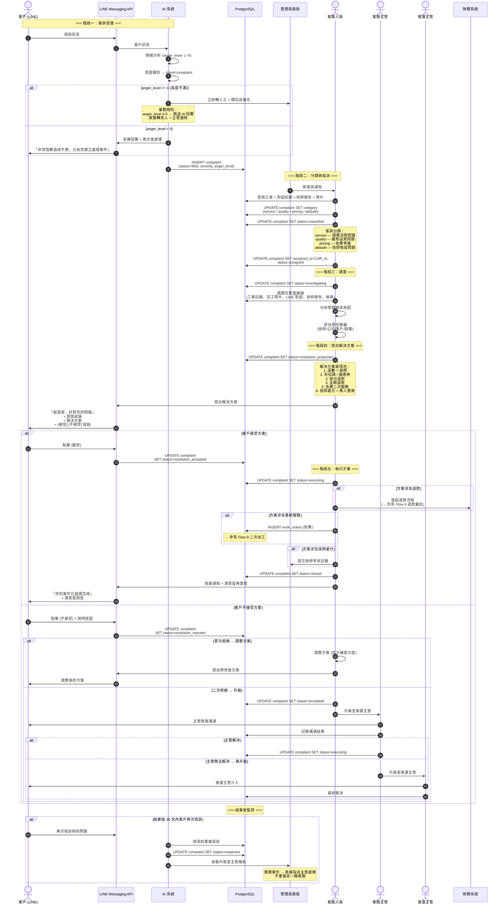
```mermaid
sequenceDiagram
    autonumber
    actor Customer as 客戶 (LINE)
    participant LINE as LINE Messaging API
    participant AI as AI 系統
    participant DB as PostgreSQL
    participant Admin as 管理員面板
    actor CSR as 客服人員
    actor CSRMgr as 客服主管
    actor OpsMgr as 營運主管
    participant Finance as 財務系統

    Note over Customer, AI: === 階段一：客訴受理 ===

    Customer->>LINE: 投訴訊息
    LINE->>AI: 客戶訊息

    AI->>AI: 情緒分析 (anger_level: 1~5)
    AI->>AI: 意圖識別 → intent=complaint

    alt anger_level >= 4 (高度不滿)
        AI->>Admin: 立即轉人工 + 標記高優先
        Note over AI: 業務規則：<br/>anger_level 4-5 → 跳過 AI 回覆<br/>直接轉真人 + 主管通知
    else anger_level < 4
        AI->>LINE: 安撫回覆 + 表示會處理
        LINE->>Customer: 「非常抱歉造成不便，已為您建立處理案件」
    end

    AI->>DB: INSERT complaint<br/>(status=filed, severity, anger_level)

    Note over Admin, CSR: === 階段二：分類與指派 ===

    Admin->>CSR: 新客訴通知
    CSR->>DB: 查詢工單 + 對話紀錄 + 技師報告 + 照片

    CSR->>DB: UPDATE complaint SET category<br/>(service / quality / pricing / attitude)
    CSR->>DB: UPDATE complaint SET status=classified

    Note over CSR: 客訴分類：<br/>service — 服務流程問題<br/>quality — 維修品質問題<br/>pricing — 收費爭議<br/>attitude — 技師態度問題

    CSR->>DB: UPDATE complaint SET assigned_to=CSR_id,<br/>status=assigned

    Note over CSR: === 階段三：調查 ===

    CSR->>DB: UPDATE complaint SET status=investigating
    CSR->>DB: 調閱完整證據鏈<br/>(工單記錄、完工照片、LINE 對話、技師報告、帳單)

    CSR->>CSR: 分析問題根本原因
    CSR->>CSR: 評估責任歸屬<br/>(技師/公司/客戶/設備)

    Note over CSR: === 階段四：提出解決方案 ===

    CSR->>DB: UPDATE complaint SET status=resolution_proposed

    Note over CSR: 解決方案選項池：<br/>1. 道歉 + 說明<br/>2. 折扣碼 / 優惠券<br/>3. 部分退款<br/>4. 全額退款<br/>5. 免費二次服務<br/>6. 技師處分 + 換人重做

    CSR->>LINE: 提出解決方案
    LINE->>Customer: 「經調查，針對您的問題」<br/>+ 調查結論<br/>+ 解決方案<br/>+ [接受] [不接受] 按鈕

    alt 客戶接受方案
        Customer->>LINE: 點擊 [接受]
        LINE->>DB: UPDATE complaint<br/>SET status=resolution_accepted

        Note over CSR: === 階段五：執行方案 ===

        CSR->>DB: UPDATE complaint SET status=executing

        alt 方案涉及退款
            CSR->>Finance: 發起退款流程<br/>(→ 參見 Flow 6 退款審批)
        end

        alt 方案涉及重新服務
            CSR->>DB: INSERT work_orders (免費)
            Note over DB: → 參見 Flow 8 二次派工
        end

        alt 方案涉及技師處分
            CSR->>Admin: 提交技師考核記錄
        end

        CSR->>DB: UPDATE complaint SET status=closed
        CSR->>LINE: 結案通知 + 滿意度再調查
        LINE->>Customer: 「您的案件已處理完成」<br/>+ 滿意度調查

    else 客戶不接受方案
        Customer->>LINE: 點擊 [不接受] + 說明原因
        LINE->>DB: UPDATE complaint<br/>SET status=resolution_rejected

        alt 首次拒絕 → 調整方案
            CSR->>CSR: 調整方案 (加大補償力度)
            CSR->>LINE: 提出修改後方案
            LINE->>Customer: 調整後的方案
        else 二次拒絕 → 升級
            CSR->>DB: UPDATE complaint SET status=escalated
            CSR->>CSRMgr: 升級至客服主管

            CSRMgr->>Customer: 主管致電溝通
            CSRMgr->>DB: 記錄溝通結果

            alt 主管解決
                CSRMgr->>DB: UPDATE complaint SET status=executing
            else 主管無法解決 → 再升級
                CSRMgr->>OpsMgr: 升級至營運主管
                OpsMgr->>Customer: 營運主管介入
                OpsMgr->>DB: 最終裁決
            end
        end
    end

    Note over DB: === 結案後監控 ===

    alt 結案後 30 天內客戶再次投訴
        Customer->>LINE: 再次投訴相同問題
        AI->>DB: 偵測到重複投訴
        AI->>DB: UPDATE complaint SET status=reopened
        AI->>Admin: 自動升級至主管層級

        Note over Admin: 重開案件 → 直接指派主管處理<br/>不重複走一線客服
    end
```

### 12.5 狀態轉換表

| 步驟 | 來源狀態 | 目標狀態 | 觸發動作 |
|------|----------|----------|----------|
| 1 | — | `filed` | 客戶投訴 / AI 偵測 |
| 2 | `filed` | `classified` | 客服分類 (service/quality/pricing/attitude) |
| 3 | `classified` | `assigned` | 指派客服人員 |
| 4 | `assigned` | `investigating` | 開始調查 |
| 5 | `investigating` | `resolution_proposed` | 提出方案 |
| 6a | `resolution_proposed` | `resolution_accepted` | 客戶接受 |
| 6b | `resolution_proposed` | `resolution_rejected` | 客戶拒絕 |
| 7a | `resolution_rejected` | `investigating` | 調整方案 |
| 7b | `resolution_rejected` | `escalated` | 二次拒絕 → 升級 |
| 8 | `escalated` | `investigating` | 上級介入重查 |
| 9 | `resolution_accepted` | `executing` | 執行方案 |
| 10 | `executing` | `closed` | 方案執行完成 |
| 11 | `closed` | `reopened` | 30 天內同問題再投訴 |
| 12 | `reopened` | `escalated` | 自動升級 |

### 12.6 通知清單

| 時機 | 通知方式 | 接收者 | 內容摘要 |
|------|----------|--------|----------|
| 投訴受理 | LINE Push | Customer | 已建立案件，處理中 |
| anger_level >= 4 | Web Alert (緊急) | CSR + 主管 | 高優先客訴 |
| 方案提出 | LINE Flex | Customer | 調查結論 + 方案 + 接受/拒絕 |
| 方案被拒 (2次) | Web Alert | 客服主管 | 需主管介入 |
| 升級至營運 | Web Alert | 營運主管 | 客訴升級 |
| 結案 | LINE Flex | Customer | 處理結果 + 滿意度調查 |
| 重開案件 | Web Alert | 主管 | 重複投訴自動升級 |

### 12.7 各類型客訴 SLA

| 客訴類型 | 嚴重度 | 首次回應 SLA | 解決 SLA | 升級時限 |
|----------|--------|-------------|----------|----------|
| 態度問題 | 中 | 2 小時 | 3 個工作日 | 24 小時 |
| 服務流程 | 中 | 2 小時 | 3 個工作日 | 24 小時 |
| 維修品質 | 高 | 1 小時 | 2 個工作日 | 12 小時 |
| 收費爭議 | 高 | 1 小時 | 2 個工作日 | 12 小時 |
| anger_level >= 4 | 緊急 | 15 分鐘 | 24 小時 | 4 小時 |
| anger_level = 5 | 危機 | 立即 | 12 小時 | 2 小時 |

---

## 13. Flow 10：門外觀變更確認

### 13.1 觸發條件

- 技師到場勘查後發現需切割非標準側板
- 安裝過程可能影響門扇外觀 (烤漆、表面處理)
- 任何可能造成門扇不可逆改變的工序

### 13.2 參與角色

Technician, Customer, Admin

### 13.3 流程圖

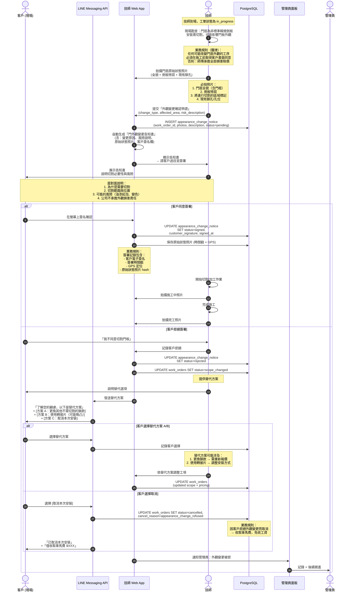
```mermaid
sequenceDiagram
    autonumber
    actor Customer as 客戶 (現場)
    participant LINE as LINE Messaging API
    participant TechApp as 技師 Web App
    actor Technician as 技師
    participant DB as PostgreSQL
    participant Admin as 管理員面板
    actor AdminUser as 管理員

    Note over Technician: 技師到場，工單狀態為 in_progress

    Technician->>Technician: 現場勘查：門扇為非標準韓規側板<br/>安裝需切割，可能影響門板外觀

    Note over Technician: 業務規則（鐵律）：<br/>任何可能改變門扇外觀的工序<br/>必須在施工前取得客戶書面同意<br/>否則：師傅承擔全部損害賠償

    Technician->>TechApp: 拍攝門扇原始狀態照片<br/>(全貌 + 側板特寫 + 現有鎖孔)

    Note over Technician: 必拍照片：<br/>1. 門扇全貌（含門框）<br/>2. 側板特寫<br/>3. 將進行切割的區域標記<br/>4. 現有鎖孔/孔位

    Technician->>TechApp: 提交「外觀變更確認申請」<br/>(change_type, affected_area, risk_description)

    TechApp->>DB: INSERT appearance_change_notice<br/>(work_order_id, photos, description, status=pending)

    TechApp->>TechApp: 自動生成「門外觀變更告知書」<br/>(含：變更原因、風險說明、<br/>原始狀態照片、客戶簽名欄)

    TechApp->>Technician: 顯示告知書<br/>→ 請客戶過目並簽署

    Technician->>Customer: 展示告知書<br/>說明切割必要性與風險

    Note over Technician, Customer: 面對面說明：<br/>1. 為什麼需要切割<br/>2. 切割範圍與位置<br/>3. 可能的風險（油漆起泡、變色）<br/>4. 公司不承擔外觀損害責任

    alt 客戶同意簽署
        Customer->>TechApp: 在螢幕上簽名確認
        TechApp->>DB: UPDATE appearance_change_notice<br/>SET status=signed,<br/>customer_signature, signed_at
        TechApp->>DB: 保存原始狀態照片 (時間戳 + GPS)

        Note over TechApp: 業務規則：<br/>簽署記錄包含：<br/>- 客戶電子簽名<br/>- 簽署時間戳<br/>- GPS 定位<br/>- 原始狀態照片 hash

        Technician->>Technician: 開始切割/加工作業
        Technician->>TechApp: 拍攝施工中照片
        Technician->>Technician: 完成施工
        Technician->>TechApp: 拍攝完工照片

    else 客戶拒絕簽署
        Customer->>Technician: 「我不同意切割門板」

        Technician->>TechApp: 記錄客戶拒絕
        TechApp->>DB: UPDATE appearance_change_notice<br/>SET status=rejected

        TechApp->>DB: UPDATE work_orders SET status=scope_changed

        Note over Technician: 提供替代方案

        Technician->>Customer: 說明替代選項

        TechApp->>LINE: 發送替代方案
        LINE->>Customer: 「了解您的顧慮，以下是替代方案」<br/>+ [方案 A：更換其他不需切割的鎖款]<br/>+ [方案 B：使用轉接片（可能略凸）]<br/>+ [方案 C：取消本次安裝]

        alt 客戶選擇替代方案 A/B
            Customer->>LINE: 選擇替代方案
            LINE->>DB: 記錄客戶選擇

            Note over Technician: 替代方案可能涉及：<br/>1. 更換鎖款 → 需重新報價<br/>2. 使用轉接片 → 調整安裝方式

            Technician->>TechApp: 依替代方案調整工項
            TechApp->>DB: UPDATE work_orders<br/>(updated scope + pricing)

        else 客戶選擇取消
            Customer->>LINE: 選擇 [取消本次安裝]
            LINE->>DB: UPDATE work_orders SET status=cancelled,<br/>cancel_reason=appearance_change_refused

            Note over DB: 業務規則：<br/>因客戶拒絕外觀變更而取消<br/>→ 收取車馬費，免收工資

            LINE->>Customer: 「已取消本次安裝」<br/>+「僅收取車馬費 $XXX」
        end

        TechApp->>Admin: 通知管理員：外觀變更被拒
        Admin->>AdminUser: 記錄 + 後續跟進
    end
```

### 13.4 狀態轉換表

| 步驟 | 來源狀態 | 目標狀態 | 觸發動作 |
|------|----------|----------|----------|
| 1 | `in_progress` | `in_progress` (暫停) | 技師偵測到外觀變更需求 |
| 2a | `in_progress` | `in_progress` (繼續) | 客戶簽署同意書 → 繼續施工 |
| 2b | `in_progress` | `scope_changed` | 客戶拒絕 → 討論替代方案 |
| 3a | `scope_changed` | `in_progress` | 客戶選擇替代方案 |
| 3b | `scope_changed` | `cancelled` | 客戶取消安裝 |

### 13.5 通知清單

| 時機 | 通知方式 | 接收者 | 內容摘要 |
|------|----------|--------|----------|
| 外觀變更申請 | — | Customer (面對面) | 告知書面對面說明 |
| 客戶簽署 | Web Push | Admin | 記錄存檔 |
| 客戶拒絕 | LINE Flex | Customer | 替代方案選項 |
| 客戶拒絕 | Web Alert | Admin | 外觀變更被拒通知 |
| 取消安裝 | LINE Flex | Customer | 取消確認 + 車馬費 |

### 13.6 證據保存規範

| 項目 | 要求 | 說明 |
|------|------|------|
| 原始狀態照片 | 最少 4 張 | 全貌、側板、切割區域、現有孔位 |
| 電子簽名 | 含時間戳 + GPS | 不可事後補簽 |
| 照片 hash | SHA-256 | 防止事後篡改 |
| 施工中照片 | 最少 1 張 | 記錄加工過程 |
| 完工照片 | 最少 2 張 | 記錄最終結果 |
| 保存期限 | 永久 | 作為爭議處理依據 |

---

## 14. 升級矩陣

### 14.1 完整升級矩陣

| 觸發事件 | Level 1 (自動) | Level 2 (主管) | Level 3 (高層) | SLA |
|----------|---------------|---------------|---------------|-----|
| 技師未到場 (no-show) | 自動重派 + 客戶通知 | 管理員手動指派 + 電話致歉 | 客戶補償 ($500 折扣碼) + 技師處分 | L1: 立即, L2: 15 分鐘, L3: 30 分鐘 |
| 連續 3+ 技師拒單 | 手動派工模式 | 加入優先佇列 + 擴大搜尋 | VIP 技師池指定派工 | L1: 立即, L2: 30 分鐘, L3: 1 小時 |
| 範圍變更 > 原報價 2 倍 | 技術主管審核報價 | 營運主管核准 | 客戶重新報價 + 可取消 | L1: 1 小時, L2: 4 小時, L3: 24 小時 |
| 客戶 anger_level = 5 | 立即轉人工 + 安撫話術 | 主管 15 分鐘內回電 | 補償方案 + 折扣 + 優先處理 | L1: 立即, L2: 15 分鐘, L3: 1 小時 |
| 7 天內同故障復發 | 自動二次派工 (S 級、免費) | 免費服務 + 原技師記缺 | 根本原因審查 + 系統改善 | L1: 立即, L2: 24 小時, L3: 3 天 |
| 退款 > $100,000 | 營運主管 + 財務主管雙簽 | CEO 知會 | — | L1: 24 小時, L2: 48 小時 |
| 技師現場加價 | 凍結交易 + 調出標準報價 | 技術主管確認實際費用 | 客戶按標準價結算 + 技師記警告 | L1: 立即, L2: 2 小時, L3: 24 小時 |
| 施工造成損害 | 現場拍照存證 + 凍結 | 技術主管到場勘查 | 公司承擔合理修復費 + 技師記缺 | L1: 立即, L2: 24 小時, L3: 3 天 |
| 保固認定爭議 | AI 轉人工 + 查建案資料庫 | 客服出示書面依據 | 折衷方案 (折扣維修) | L1: 立即, L2: 2 小時, L3: 24 小時 |
| 備料超過 72 小時 | 通知客戶 + 提供改期 | 管理員尋找替代零件 | 升級至供應鏈主管 | L1: 72 小時, L2: 96 小時, L3: 5 天 |
| 客訴 2 次方案被拒 | 客服調整方案 | 客服主管致電溝通 | 營運主管最終裁決 | L1: 4 小時, L2: 24 小時, L3: 48 小時 |
| 同技師 3+ 次客訴 | 記錄觀察 + 教育訓練 | 暫停派工 + 面談 | 降級 / 解除合作 | L1: 累計, L2: 即時, L3: 7 天內 |

### 14.2 升級通知路徑

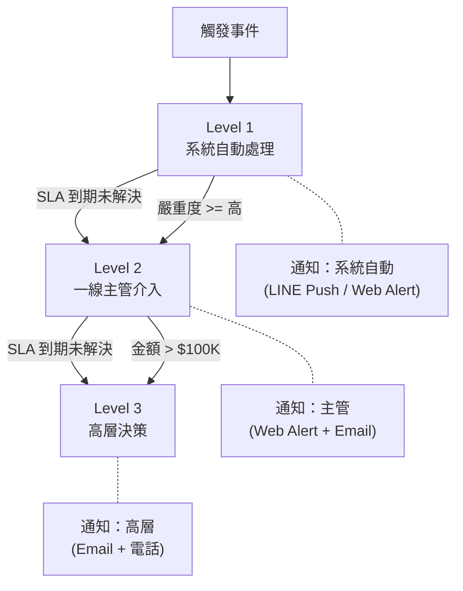
```mermaid
graph TD
    Trigger["觸發事件"]
    L1["Level 1<br/>系統自動處理"]
    L2["Level 2<br/>一線主管介入"]
    L3["Level 3<br/>高層決策"]

    Trigger --> L1
    L1 -->|SLA 到期未解決| L2
    L2 -->|SLA 到期未解決| L3
    L1 -->|嚴重度 >= 高| L2
    L2 -->|金額 > $100K| L3

    L1 -.- N1["通知：系統自動<br/>(LINE Push / Web Alert)"]
    L2 -.- N2["通知：主管<br/>(Web Alert + Email)"]
    L3 -.- N3["通知：高層<br/>(Email + 電話)"]
```

### 14.3 技師考核與升降級規則

| 指標 | 觀察 | 警告 | 處分 |
|------|------|------|------|
| 未完整診斷 (二次派工) | 1 次 | 3 次 | 5 次 → 降級 |
| 月拒單率 | — | > 30% | > 50% → 暫停 7 天 |
| 客訴次數 (月) | 1 次 | 2 次 | 3+ 次 → 暫停 + 面談 |
| 延遲到場 (月) | 1~2 次 | 3 次 | 5+ 次 → 降級警告 |
| 未執行告知義務 | 1 次 → 記缺 | 2 次 → 降級警告 | 3 次 → 降級 |
| 現場私自加價 | 1 次 → 警告 + 扣分 | 2 次 → 降級 | 3 次 → 解除合作 |

---

## 15. 知識沉澱閉環與完工報告

> 對應 `diagnostic-intelligence-architecture.md` §6 Layer 6: Knowledge Loop

### 15.1 完工報告結構化 Schema

技師提交完工報告時，除了現有的 `service_report`（TEXT）和 `photos`（JSONB），Phase 2 需擴展為結構化的 `service_reports` 表（詳見 `diagnostic-intelligence-architecture.md` §6）：

| 欄位 | 說明 | 來源 |
|---|---|---|
| `problem_card_id` | 關聯 AI 診斷的 ProblemCard | 系統自動 |
| `predicted_fm_ids` | AI 預測的 Failure Mode（來自 `task_decompose` 的 `hypothesized_failure_modes`） | 系統自動 |
| `actual_fm_id` | 技師到府確認的實際 Failure Mode | 技師填寫 |
| `ai_prediction_hit` | AI 猜對了嗎（`predicted_fm_ids` 包含 `actual_fm_id`） | 系統自動計算 |
| `defect_type` | 缺陷粗分類：`material` / `process` / `design` / `operation` / `other` | 技師選擇（下拉 5 選 1） |
| `defect_description` | 缺陷具體描述（自由文字，50 字內） | 技師填寫 |
| `corrective_action` | 修了什麼（CA — Corrective Action） | 技師填寫 |
| `preventive_action` | 建議的預防措施（PA — Preventive Action） | 技師填寫（選填） |
| `verification` | 修復後功能測試結果 JSONB `{fingerprint: pass, bluetooth: pass, ...}` | 技師填寫 |

### 15.2 知識沉澱閉環流程

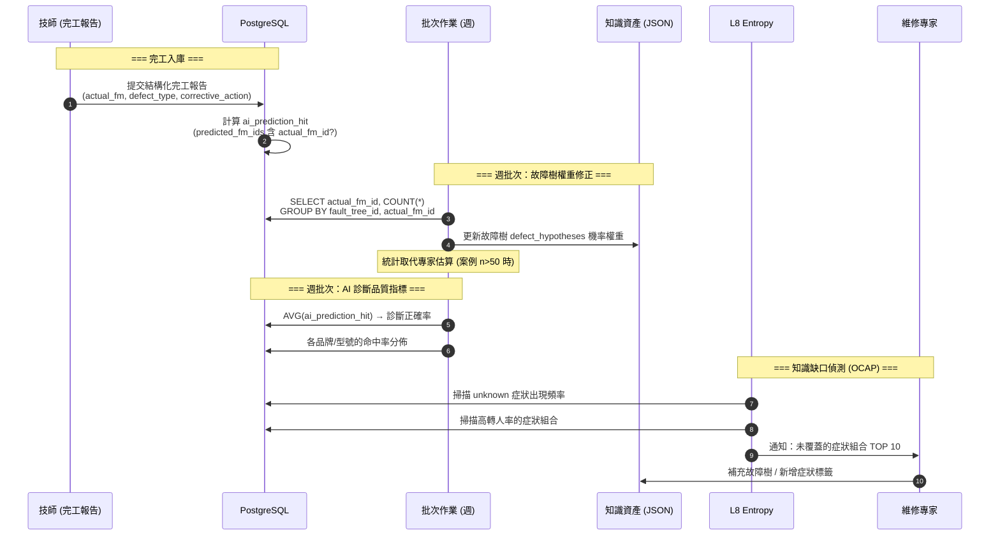
```mermaid
sequenceDiagram
    autonumber
    participant Tech as 技師 (完工報告)
    participant DB as PostgreSQL
    participant Batch as 批次作業 (週)
    participant KnowledgeBase as 知識資產 (JSON)
    participant L8 as L8 Entropy
    participant Expert as 維修專家

    Note over Tech, DB: === 完工入庫 ===
    Tech->>DB: 提交結構化完工報告<br/>(actual_fm, defect_type, corrective_action)
    DB->>DB: 計算 ai_prediction_hit<br/>(predicted_fm_ids 含 actual_fm_id?)

    Note over Batch, KnowledgeBase: === 週批次：故障樹權重修正 ===
    Batch->>DB: SELECT actual_fm_id, COUNT(*)<br/>GROUP BY fault_tree_id, actual_fm_id
    Batch->>KnowledgeBase: 更新故障樹 defect_hypotheses 機率權重
    Note over Batch: 統計取代專家估算 (案例 n>50 時)

    Note over Batch, DB: === 週批次：AI 診斷品質指標 ===
    Batch->>DB: AVG(ai_prediction_hit) → 診斷正確率
    Batch->>DB: 各品牌/型號的命中率分佈

    Note over L8, Expert: === 知識缺口偵測 (OCAP) ===
    L8->>DB: 掃描 unknown 症狀出現頻率
    L8->>DB: 掃描高轉人率的症狀組合
    L8->>Expert: 通知：未覆蓋的症狀組合 TOP 10
    Expert->>KnowledgeBase: 補充故障樹 / 新增症狀標籤
```

### 15.3 OCAP 規則與工單品質監控

以下 OCAP 規則（來源：`ocap_rules.json`）在工單完工後自動觸發：

| 規則 | 觸發條件 | 動作 |
|---|---|---|
| OCAP-001 | 同一 failure_id 24h 內 > 10 件 | 通知維修主管 + 啟動批次追溯 |
| OCAP-002 | 轉人率 7 日內 > 30% | 檢查 agent prompt + fallback_tools |
| OCAP-003 | 同型號 7 日內 > 20 件 | 標記品質異常 + 通知品牌原廠 |
| OCAP-004 | AI 診斷正確率 30 日 < 60% | 觸發故障樹全面審查 |
| OCAP-SENTIMENT-001 | 高風險情緒關鍵詞（10 個） | 立即轉人工 + 通知主管 |
| OCAP-EMERGENCY-001 | Red_Code 關鍵字（7 個） | 緊急派工 + 安全評估 |

> **知識閉環核心**：每張完工報告 = 一筆 ground truth。故障樹權重從「專家估算」漸進為「統計事實」。詳見 `diagnostic-intelligence-architecture.md` §6 + `optimization-strategy.md` §6 冷啟動策略。

---

## 附錄 A：關鍵業務規則彙總

| 編號 | 規則 | 適用流程 |
|------|------|----------|
| BR-001 | 涉及建案/保固案件，AI 嚴禁自動報價 | Flow 7 |
| BR-002 | 保固起算日 = 建商點交日，非住戶入住日 | Flow 7 |
| BR-003 | 門外觀變更必須施工前取得客戶書面同意 | Flow 10 |
| BR-004 | 7 天內同症狀復發 → 自動觸發二次客訴 | Flow 8 |
| BR-005 | 二次派工強制 S 級技師 + 免費服務 | Flow 8 |
| BR-006 | 退款 > $100K 需營運 + 財務雙簽 | Flow 6 |
| BR-007 | 因技師延遲/缺料導致取消 → 不收取任何費用 | Flow 4, 5 |
| BR-008 | 技師逾時 15 分鐘未回應 → 自動重派 | Flow 2 |
| BR-009 | 完工後 48 小時未確認 → 系統自動確認 | Flow 1 |
| BR-010 | 範圍變更報價 > 2 倍原價 → 技術主管審核 | Flow 3 |
| BR-011 | anger_level >= 4 → 跳過 AI 直接轉人工 | Flow 9 |
| BR-012 | 月拒單率 > 50% → 暫停派工 7 天 | Flow 2 |
| BR-013 | 因客戶拒絕外觀變更而取消 → 收車馬費、免工資 | Flow 10 |
| BR-014 | 客訴結案後 30 天內再投訴 → 自動升級至主管 | Flow 9 |

## 附錄 B：通知管道對照

| 管道 | 技術實作 | 適用對象 | 回應能力 |
|------|----------|----------|----------|
| LINE Push Message | LINE Messaging API | Customer | 可互動 (Flex Message) |
| LINE Flex Message | LINE Messaging API | Customer | 含按鈕、表單 |
| Web Push Notification | Browser Push API | Technician, Admin | 點擊跳轉 |
| Web Alert (面板內) | WebSocket / SSE | Admin, Finance | 即時顯示 |
| Email | SMTP / SendGrid | 高層 (CEO) | 異步通知 |
| 電話 | 手動 | Customer (高優先) | 即時溝通 |

## 附錄 C：資料模型擴展建議

基於本文件定義的流程，建議在 `SQL/Schema.sql` 中新增以下表格：

| 表格名稱 | 用途 | 關聯流程 |
|----------|------|----------|
| `dispatch_logs` | 派工嘗試記錄 (含拒絕原因) | Flow 2 |
| `scope_change_requests` | 範圍變更申請 | Flow 3 |
| `material_requests` | 缺料報告 | Flow 4 |
| `delay_notifications` | 延遲通知記錄 | Flow 5 |
| `refund_requests` | 退款申請 (含審批鏈) | Flow 6 |
| `complaints` | 客訴記錄 | Flow 9 |
| `appearance_change_notices` | 門外觀變更告知書 | Flow 10 |
| `technician_penalties` | 技師考核記錄 | Flow 2, 8 |

---

> **文件結束** — 本文件定義了工單全生命週期 10 個互動流程，涵蓋正常路徑與全部 9 個異常路徑。每個流程包含 Mermaid 循序圖、狀態轉換表、通知清單與業務規則。後續開發應嚴格遵循本文件定義的狀態機與 SLA 規範。
