# Smart Lock 高階端到端參考架構

> 視圖類型：Solution Architecture Overview  
> 抽象層級：L1 Logical Zone／L2 Major Component  
> 正典依據：`smartlock-docs/enterprise/02_BRD.md`、`12_SAD.md`、`15_SDS.md`  
> 圖面：`06-1_end-to-end-reference.drawio`／`06-1_end-to-end-reference.svg`／`06-1_end-to-end-reference.png`  
> 元件目錄：`06-2_component-catalog.drawio`／`06-2_component-catalog.svg`／`06-2_component-catalog.png`

## 1. 架構假設

### 1.1 工業視覺概念的領域轉譯

本平台不是影像辨識或 Video Streaming 系統，因此不應為了套用模板而虛構攝影機、串流協定或 Edge GPU。保留原提示詞的「多資料路徑、控制面、責任邊界」概念，並轉譯如下：

| 工業 4.0 視覺概念 | Smart Lock 平台對應概念 | 圖面線型 |
| :--- | :--- | :--- |
| Video Stream | 即時互動／交易請求：LINE 訊息、REST command、WebSocket update、Flex／LIFF 回覆 | 藍色實線 |
| AI Metadata / Event | AI 判斷結果、Problem Card、Work Order／Dispatch／Commission／Technician domain event | 綠色虛線 |
| Control / Configuration | License、租戶／品牌設定、Vertical Pack、Channel Config、OIDC／RBAC、Feature Flag | 紫色虛線 |
| Storage / Playback | SQL／JSONB 持久化、Outbox、Event Replay、Audit、對話／施工證據回放 | 橘色虛線 |
| Edge / AI Runtime | 通道與 AI Runtime：LINE Gateway、LockCore、RAG-MCP、LiteLLM Gateway | L1 Zone 2 |
| Media Distribution | 互動與事件分發：API/ACL、Realtime、Outbox、Kafka、OHS Adapter | L1 Zone 3 |
| Device Management | 通道、租戶與客戶端管理：LINE OA 綁定、技師客戶端准入、租戶 provisioning | 底部橫切能力 |

### 1.2 系統與部署假設

1. 每個品牌以 per-brand bundle 獨立部署，包含 agent、品牌 api、品牌後台、品牌庫、Redis 與 RAG-MCP；品牌資料採物理隔離。
2. technician-platform、Casdoor、SigNoz／OPIK 與平台 Console 為跨品牌集中共用能力。
3. knowledge-refinery 是 License 附加模組，所有知識落地必須通過 provenance 與 HITL gate。
4. LINE webhook 的唯一入站為 agent `/callback`；api 只處理內部 fan-out 與出站 Outbox。
5. 同步路徑處理低延遲 command／query；跨系統狀態擴散採事件、Outbox、冪等與最終一致。
6. 圖中 Kafka、完整 Casdoor OIDC、部分 Redis fan-out／自動 provisioning 是參考目標能力；落地狀態仍須依 WBS、code 與部署證據判斷。
7. AI 只負責對話判斷、知識回覆與轉真人；不得自行 final quote、開單、派工或觸發金流。

## 2. Logical Zones

| L1 Zone | 責任邊界 | 主要輸入／輸出 |
| :--- | :--- | :--- |
| Z1 Actors & Inbound Signals | 表達外部角色行為與原始訊號，不承擔業務狀態 | 客戶訊息、營運決策、技師現場事件、知識素材 |
| Z2 Channel & AI Runtime | 通道驗證、Turn 編排、模型與知識存取；不擁有派工／報價真相 | LINE webhook、Normalized Turn、Tool Call、RAG Query、LLM Request |
| Z3 Interaction & Event Distribution | 同步 ACL、即時 fan-out、可靠外送、事件骨幹與 OHS 邊界 | REST/WS、Outbox、AsyncAPI Event、OHS Query/Command |
| Z4 Domain Services & Data | 擁有問題卡、報價、工單、派工、計費、技師與知識精煉真相 | Domain Command/Event、SQL、pgvector、Evidence Object |
| Z5 Applications & External Systems | 對人提供操作面，並整合 LINE、IdP、LLM 與雲端服務 | Portal UI、Flex/LIFF、OIDC、HTTPS Model API |
| Z6 Cross-Cutting Management | 管理設定、通道／租戶、身分、安全與可觀測性，不混入業務主鏈 | Config、License、Policy、Secrets、Metrics/Trace/Log |

## 3. Component Responsibilities

| Zone | L2 Component | 核心責任 | 主要介面／資料 |
| :--- | :--- | :--- | :--- |
| Z1 | Customer Interaction Signal | 客戶 LINE 詢問、LIFF／postback 決策與評分 | LINE webhook JSON、LIFF/postback |
| Z1 | Brand Operations Decision | 小編確認問題卡、報價、派工與結算操作 | Browser command、REST JSON |
| Z1 | Technician Field Action | 接單、到場、修正報價、施工與存證 | Mobile/Web command、Evidence metadata |
| Z1 | Knowledge & Diagnostic Source | 產品素材與三方診斷對話的原始來源 | URL、Transcript、Conversation provenance |
| Z2 | LINE Gateway | 驗簽、dedup/debounce、handover 檢查、Reply/Push 轉接 | HTTPS webhook、X-Line-Signature |
| Z2 | LockCore Agent Runtime | Turn 狀態機、Skill、Memory、Tool allowlist 與轉真人 | Normalized Turn、Tool Call、Internal JSON |
| Z2 | RAG-MCP Knowledge Access | 封裝 tenant ACL、語意檢索與引用來源 | MCP、pgvector query/result |
| Z2 | LiteLLM Model Gateway | 供應商無關模型路由、fallback 與成本／錯誤隔離 | HTTPS、OpenAI-compatible JSON |
| Z3 | API / ACL Integration Gateway | OIDC／S2S 驗證、tenant／role guard、command/query ingress | REST JSON、RFC7807、Idempotency-Key |
| Z3 | Realtime WS + Redis Fan-out | 將品牌營運與派工變動跨實例推送 | WebSocket JSON、Redis pub/sub |
| Z3 | Reliable Outbox Delivery | 隔離 LINE／通知 side effect，提供 retry、dedup 與故障恢復 | Outbox row、LINE Reply/Push/Flex |
| Z3 | Event Backbone | 傳遞 workorder、dispatch、technician、commission、settlement 事件 | Kafka、AsyncAPI JSON、Replay |
| Z3 | Technician OHS Adapter | 隔離品牌域與技師域，提供查詢、媒合與 requote command | HTTPS OHS、S2S credential |
| Z4 | Brand Domain Services | Problem Card、Quote、Work Order、Dispatch、Billing 的權威狀態與規則 | Domain command/event、SQL |
| Z4 | Technician Platform | 技師身分／准入／媒合、工單 CQRS 投影與 Settlement | OHS、Kafka、REST/WS |
| Z4 | Knowledge Refinery + HITL | Medallion 精煉、provenance、人工審核與核可發布 | Bronze/Silver、Draft、Embedding/Patch |
| Z4 | Brand DB + pgvector | 品牌交易資料、對話、Outbox 與唯一事實語料 | PostgreSQL、JSONB、pgvector |
| Z4 | Technician DB | 跨品牌技師身分、技能、KYC、排班與結算真相 | PostgreSQL、Encrypted PII |
| Z4 | Platform DB / Evidence Store | License、平台治理與照片／文件／稽核證據 | PostgreSQL、GCS object + hash |
| Z5 | LINE / LIFF / Flex | 客戶即時互動、報價確認與通知交付 | Messaging API、LIFF、Flex JSON |
| Z5 | Brand Operations Portal | 對話、問題卡、報價、派工與對帳工作台 | OIDC、REST、WebSocket |
| Z5 | Technician Portal | 技師准入、接單、現場操作與 statement | OIDC、REST、WebSocket |
| Z5 | Platform Console | 租戶、License、營運與治理操作面 | OIDC、Platform API |
| Z5 | External Shared Services | Casdoor、LLM providers、GCP Runtime／Secret／Object Storage | OIDC/JWKS、HTTPS、Cloud API |
| Z6 | Control Plane | Provisioning、License、Vertical Pack 與 feature rollout | Versioned config、License policy |
| Z6 | Configuration | 品牌、模型、SLA、通道與 runtime 設定 | Config registry、Secret reference |
| Z6 | Channel & Client Management | LINE OA 綁定、webhook 健康、技師客戶端准入 | Channel credential、Client status |
| Z6 | Security & Governance | OIDC、RBAC、SoD、S2S、tenant isolation、PII policy | JWT/JWKS、Policy、Audit |
| Z6 | Observability & Operations | OTel trace/metric/log、LLM trace、SLO、alert 與 runbook | OTLP、Trace ID、Dashboard/Alert |

## 4. End-to-End Flow

### F1 客戶即時客服與轉真人

1. 客戶訊息由 LINE 以 webhook JSON 送至 LINE Gateway，先驗 `X-Line-Signature`、去重並檢查人工接管狀態。
2. LockCore 將訊息轉為單一 Turn，載入記憶／Skill；需要事實時經 RAG-MCP 查品牌 pgvector。
3. 模型呼叫統一經 LiteLLM Gateway；模型只能使用白名單工具。
4. 若需真人處理，agent 以 S2S internal JSON 送出 escalation／Problem Card metadata；派工／報價狀態仍由 Brand Domain Services 決定。
5. 回覆與 Flex 通知經 Outbox 可靠外送至 LINE；Outbox retry 不阻斷主交易。

### F2 報價、工單與品牌營運

1. Brand Portal 經 OIDC、tenant、role guard 呼叫 API / ACL Gateway。
2. Brand Domain Services 驗證報價先行、客戶確認與 Idempotency-Key，再轉移 Quote／Work Order 狀態。
3. 同一交易寫入品牌庫；通知與跨系統副作用寫 Outbox／Domain Event。
4. Realtime WS 以 Redis fan-out 推送工作台，避免多實例只看見本機事件。

### F3 技師媒合、派工與結算

1. 品牌側透過 OHS Adapter 同步查詢／媒合，不直連技師庫。
2. 派工、接單、工單更新與佣金以 Kafka／AsyncAPI event 非同步擴散。
3. Technician Platform 維護技師域真相與最小化工單 CQRS 投影。
4. Billing 留在品牌域；Settlement 留在技師平台，期末以 reconcile gate 收斂。

### F4 知識精煉閉環

1. 三方對話、Problem Card 與產品素材以 provenance 進入 knowledge-refinery。
2. Raw／Bronze／Silver 後分流為事實與行為草稿。
3. HITL 核可後，事實寫入品牌 pgvector；行為產生 append-only skill patch。
4. 下一輪對話由 RAG-MCP／Skill 消費，形成可稽核的品質閉環。

### F5 控制、設定與維運

1. Control Plane 依 License 部署／啟用 per-brand bundle 與附加模組。
2. Configuration 以版本化方式下發品牌、模型、SLA、通道與 feature 設定；Secret 只存 reference。
3. Security & Governance 對應用與服務套用 OIDC、RBAC、SoD、S2S、tenant ACL 與稽核政策。
4. 所有 runtime、gateway 與 domain service 以 OTLP 輸出 trace／metric／log；LLM 另保留模型 trace 與品質 gate。

## 5. Mermaid Architecture Diagram

```mermaid
flowchart LR
  subgraph Z1["Z1 Actors & Inbound Signals"]
    S_LINE["Customer Interaction Signal"]
    S_OPS["Brand Operations Decision"]
    S_TECH["Technician Field Action"]
    S_KNOW["Knowledge & Diagnostic Source"]
  end

  subgraph Z2["Z2 Channel & AI Runtime"]
    GW["LINE Gateway"]
    AG["LockCore Agent Runtime"]
    RAG["RAG-MCP Knowledge Access"]
    MODEL["LiteLLM Model Gateway"]
  end

  subgraph Z3["Z3 Interaction & Event Distribution"]
    API["API / ACL Integration Gateway"]
    RT["Realtime WS + Redis"]
    OUTBOX["Reliable Outbox Delivery"]
    KAFKA["Event Backbone"]
    OHS["Technician OHS Adapter"]
  end

  subgraph Z4["Z4 Domain Services & Data"]
    BRAND["Brand Domain Services"]
    TECH["Technician Platform"]
    REF["Knowledge Refinery + HITL"]
    DBB[("Brand DB + pgvector")]
    DBT[("Technician DB")]
    OBJ[("Platform DB / Evidence Store")]
  end

  subgraph Z5["Z5 Applications & External Systems"]
    APP_LINE["LINE / LIFF / Flex"]
    APP_BRAND["Brand Operations Portal"]
    APP_TECH["Technician Portal"]
    APP_PLATFORM["Platform Console"]
    EXT["Casdoor / LLM Providers / GCP"]
  end

  subgraph Z6["Z6 Cross-Cutting Management"]
    CP["Control Plane"]
    CFG["Configuration"]
    DEV["Channel & Client Management"]
    SEC["Security & Governance"]
    OBS["Observability & Operations"]
  end

  S_LINE -->|"LINE webhook JSON + X-Line-Signature"| GW
  GW -->|"Normalized Message / Turn"| AG
  AG -->|"HTTPS internal JSON + service token"| API
  API -->|"REST JSON + Idempotency-Key"| BRAND
  OUTBOX -->|"Reply / Push / Flex JSON"| APP_LINE
  RT -->|"WebSocket JSON"| APP_BRAND
  TECH -->|"REST + WebSocket JSON"| APP_TECH
  S_OPS -->|"Browser command"| API
  S_TECH -->|"Field command / evidence metadata"| OHS
  AG -->|"OpenAI-compatible JSON"| MODEL
  MODEL -->|"HTTPS model request"| EXT
  OHS -->|"HTTPS OHS command JSON / S2S"| TECH

  AG -.->|"Escalation / Problem Card metadata"| API
  BRAND -.->|"workorder.* / dispatch.* / commission.*"| KAFKA
  KAFKA -.->|"AsyncAPI event / at-least-once"| TECH
  TECH -.->|"technician.* / settlement.*"| KAFKA
  KAFKA -.->|"projection update / Redis event"| RT
  S_KNOW -.->|"provenance / diagnostic metadata"| REF
  AG -.->|"MCP query + citation"| RAG
  RAG -.->|"tenant-filtered result"| AG

  BRAND -.->|"SQL / JSONB / outbox"| DBB
  TECH -.->|"SQL / encrypted PII"| DBT
  REF -.->|"chunk + embedding / skill patch"| DBB
  BRAND -.->|"evidence object + hash"| OBJ
  BRAND -.->|"transactional outbox row"| OUTBOX
  KAFKA -.->|"event log / replay checkpoint"| OBJ

  DEV -.->|"LINE OA / client policy"| GW
  CFG -.->|"Versioned runtime config"| AG
  SEC -.->|"OIDC / RBAC / S2S / tenant policy"| API
  AG -.->|"OTLP / LLM trace / correlation ID"| OBS
  APP_PLATFORM -.->|"Governance command / OIDC"| CP

  classDef source fill:#F8FAFC,stroke:#64748B,color:#0F172A;
  classDef runtime fill:#EFF6FF,stroke:#2563EB,color:#0F172A;
  classDef distribution fill:#F0FDF4,stroke:#16A34A,color:#0F172A;
  classDef domain fill:#FFF7ED,stroke:#EA580C,color:#0F172A;
  classDef app fill:#F8FAFC,stroke:#475569,color:#0F172A;
  classDef management fill:#FAF5FF,stroke:#9333EA,color:#0F172A;
  classDef store fill:#FFF7ED,stroke:#EA580C,color:#0F172A;
  class S_LINE,S_OPS,S_TECH,S_KNOW source;
  class GW,AG,RAG,MODEL runtime;
  class API,RT,OUTBOX,KAFKA,OHS distribution;
  class BRAND,TECH,REF domain;
  class DBB,DBT,OBJ store;
  class APP_LINE,APP_BRAND,APP_TECH,APP_PLATFORM,EXT app;
  class CP,CFG,DEV,SEC,OBS management;

  linkStyle 0,1,2,3,4,5,6,7,8,9,10,11 stroke:#2563EB,stroke-width:2.5px;
  linkStyle 12,13,14,15,16,17,18,19 stroke:#16A34A,stroke-width:2px,stroke-dasharray:6 4;
  linkStyle 20,21,22,23,24,25 stroke:#EA580C,stroke-width:2px,stroke-dasharray:8 4;
  linkStyle 26,27,28,29,30 stroke:#9333EA,stroke-width:2px,stroke-dasharray:3 4;
```

## 6. 架構風險與待確認項目

| # | 風險／待確認 | 架構影響 | 建議決策 |
| :--- | :--- | :--- | :--- |
| R1 | 圖為 reference target，部分 Kafka／OIDC／Redis／provisioning 能力可能尚未完整上線 | 圖與 as-built 落差會誤導維運 | 每個 L2 元件補 `Current / Partial / Target` 狀態，release 前由 WBS + code + deployment evidence 對帳 |
| R2 | LINE webhook 單一入站門可能形成可用性瓶頸 | 客戶訊息延遲或遺失 | 驗簽後快速 ACK、入口水平擴展、dedup key、DLQ／replay 與 handoff fallback |
| R3 | OHS S2S 認證仍可能在 OIDC client-credentials 與 internal token 間未決 | 跨系統信任邊界不穩定 | 統一 mTLS 或 OAuth2 client-credentials，禁止共用長效 token |
| R4 | Kafka 事件 schema、版本與 consumer lag 治理不足 | 投影破壞、重播失敗、跨品牌不一致 | AsyncAPI + schema compatibility + consumer-driven contract + lag SLO |
| R5 | Outbox、Kafka 與 Redis 三種非同步機制責任重疊 | 重複通知、順序錯亂、難除錯 | 明定 Outbox=可靠副作用、Kafka=跨系統事實、Redis=暫態 fan-out；全路徑共用 correlation/idempotency key |
| R6 | 技師平台跨品牌，但品牌資料要求物理隔離 | PII 或工單資料跨租戶外洩 | 只同步最小化 CQRS 投影；tenant ACL 在 adapter／query 層強制，不靠 UI 自律 |
| R7 | LLM provider latency、quota、cost 與模型漂移 | 熱路徑不穩、回答品質不一致 | timeout budget、fallback、model allowlist、cost guard、offline eval 與 kill switch |
| R8 | RAG／Skill 雙軌若來源與版本未治理 | 回答引用矛盾、知識污染 | provenance、HITL、版本化發布、可回復 artifact 與引用稽核 |
| R9 | Control Plane 或設定下發失敗 | 全品牌 config drift 或錯誤 rollout | 版本化、簽章、staged rollout、last-known-good、per-brand rollback |
| R10 | OTel／LLM trace 可能夾帶對話與 PII | 監控系統成為資料外洩面 | telemetry redaction、欄位 allowlist、採樣、保留期限與權限分層 |
| R11 | 照片、同意書與施工證據的物件儲存／hash／保存年限未完全定義 | UAT、爭議處理與法遵證據不足 | 明確 GCS bucket 隔離、object hash、WORM／retention、signed URL 與 audit chain |
| R12 | 「Channel & Client Management」的 owner 可能分散在平台、品牌與技師域 | 通道憑證、webhook 健康與客戶端准入無單一責任人 | 指定 Platform Ops 為政策 owner，品牌與技師平台只管理各自 registration lifecycle |
