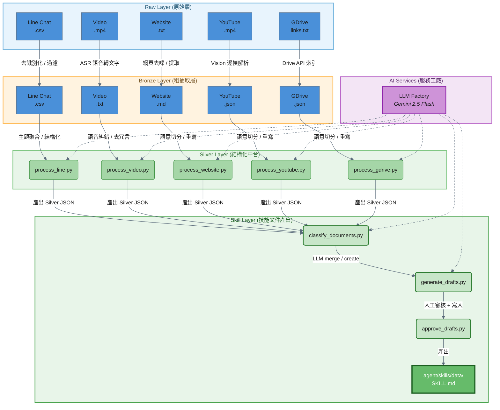

> ⚠️ **status: superseded（2026-07-09）** — 本檔的架構描述基於已刪除的 silver_to_skill 尾端與 2026-06-04 前的舊 agent 架構（26 skill / ReAct）。
> 現行流程見 `knowledge-pipeline/README.md`（雙軌產出 silver_to_knowledge，ADR-029）。本檔僅供歷史參考。

# 電子鎖 AI 客服：數據中台架構白皮書

## 1. 執行摘要 (Executive Summary)
本文件概述了為「電子鎖 AI 客服系統」量身打造的數據中台架構。系統採用 Medallion Architecture (獎章架構)，旨在將多源、異質且含有雜訊的原始資料（如 Line 聊天、語音轉錄、網頁、YouTube、Google Drive 手冊），轉化為高品質、結構化的 **SKILL.md 技能文件**，供 `agent` 的 ReAct Agent 載入使用。

## 2. 系統架構圖 (Architecture Diagram)



## 3. 核心設計模式 (Core Design Patterns)

為確保系統具備企業級的擴充性與營運穩定度，本中台嚴格遵循以下設計原則：

### 3.1 設定檔驅動 (Config-Driven)
系統摒棄了 Hardcode 的不良實踐。所有外部依賴（LLM 模型選擇、pipeline 參數、技能目錄路徑）皆由根目錄的 `config.toml` 集中管理。
*   **效益**：在測試/生產環境切換，或更換 AI 模型時，只需修改設定檔，無需更動任何一行 Python 業務邏輯。

### 3.2 依賴反轉與工廠模式 (Factory Pattern)
透過 `llms/` 目錄實現了工廠模式，提供隨插即用 (Plug-and-Play) 的架構。
*   **LLM 整合**：處理器（如 `process_video.py`）僅依賴一個抽象的 `generate_json()` 閉包，具體的 API 呼叫細節封裝於 `llms/vertexai.py` 中。
*   **效益**：未來若需從 Vertex AI 遷移至地端 Ollama，只需新增 `llms/ollama.py` 並在註冊表掛載，實現了完美的開閉原則 (Open-Closed Principle)。

### 3.3 Website 專屬技術棧

Website 資料源因鎖市官網使用 Wix SPA 架構，需要額外的技術元件：

| 套件 | 用途 | 使用階段 |
|------|------|---------|
| `playwright` | 無頭瀏覽器（headless Chromium），處理 SPA 動態網頁渲染 | Raw → Bronze |
| `beautifulsoup4` | HTML 雜訊清理（移除 script/style/nav/footer 等標籤） | Raw → Bronze |
| `markdownify` | 將清理後的 HTML 轉換為 Markdown | Raw → Bronze |

### 3.4 Silver 層作為絕對中樞 (The Silver Hub)
Silver 層是整個架構的分水嶺：
*   **Silver 之前**：百花齊放，針對不同資料源撰寫專屬的清洗腳本（利用 LLM 進行語音糾錯、去噪與知識重組）。
*   **Silver 產出**：嚴格統一為攤平的 JSON 格式（必須包含 `content` 知識文本與 `brand`、`model`、`category`、`source_type` 等欄位）。
*   **Silver 之後**：通用泛化。`silver_to_skill` pipeline 透過兩層分類（metadata 快篩 + LLM 語意分類），將所有 Silver 文件自動分配到對應的 SKILL.md 技能文件中，達成最高程度的程式碼復用。

### 3.5 Skill 產出：更新 vs. 新建

Silver → Skill 階段的核心設計是智慧判斷「更新既有 skill」或「建立新 skill」：

| 情境 | 處理方式 |
|------|---------|
| Silver 文件對應到既有 SKILL.md | LLM append-only 合併（絕不刪改既有內容） |
| Silver 文件無匹配 skill，累積 >= 3 chunks | LLM 建立新 SKILL.md（需人工審核） |
| Silver 文件無匹配 skill，< 3 chunks | 歸入 unclassified，暫不處理 |

## 4. 數據生命週期詳解

### 4.1 Bronze to Silver (客製化清洗中台 + Semantic Pre-chunking)
以 `process_video.py` 為例：
1.  **冪等性檢查**：檢查目標 JSON 是否已存在，避免重複消耗 LLM 運算資源。
2.  **LLM 介入（Semantic Pre-chunking）**：將原始 ASR 文本送入 LLM Factory，要求其扮演「資深電子鎖技術編輯」，執行語音辨識糾錯（如「掌機賣」修正為「掌靜脈」）與冗言去噪，並依語意邊界拆分為多個獨立知識點。
3.  **產出 JSON Array**：每個元素為獨立知識點（攤平結構，`content` 為知識文本），透過 API 強制 LLM 輸出結構化 JSON Array。
4.  **防呆覆寫**：客觀事實（如 `source`, `source_type`）由 Python 腳本強制覆寫，防止 LLM 產生幻覺。

### 4.2 Silver to Skill (技能文件產出引擎)

三步驟流程：

**Step 1 — 文件分類 (`classify_documents.py`)**
1.  載入所有 Silver 文件（video / youtube / website / gdrive / line_chat / problem_cards）。
2.  **Tier 1 快篩**：依 `metadata.category` + 關鍵字比對，快速分配到 26 個既有 skill。
3.  **Tier 2 LLM 分類**：Tier 1 無法判定的文件，送入 LLM 比對 skill name + description 清單。
4.  產出 `classification.json`，記錄每份文件的分類結果與信心度。

**Step 2 — 草稿產出 (`generate_drafts.py`)**
1.  按分類結果將文件分群。
2.  對每個 skill group，載入既有 SKILL.md，透過 LLM 進行 append-only 合併。
3.  對無匹配 skill 的文件群（>= 3 chunks），透過 LLM 建立全新 SKILL.md。
4.  產出 `.draft` 檔案與 unified diff。

**Step 3 — 審核寫入 (`approve_drafts.py`)**
1.  驗證 YAML frontmatter 格式完整性。
2.  驗證 `$ARGUMENTS` 佔位符保留。
3.  備份既有 SKILL.md，寫入更新後的版本到 `agent/skills/data/`。

## 5. 營運與部署手冊 (Operations Manual)

### 5.1 環境準備

所有設定檔統一放在**專案主目錄**：
- `.env`：複製 `.env.example` 並填入實際值（`cp .env.example .env`）
- `credentials.json`：GCP Service Account 金鑰檔（建議），或用 `gcloud auth application-default login`（備用）

### 5.2 執行 Pipeline
```bash
# 1. 執行特定資料源的清洗 (以 Video 為例)
python pipeline/bronze_to_silver/process_video.py --verbose

# 2. 將 Silver 文件分類到對應 skill
python pipeline/silver_to_skill/classify_documents.py --verbose

# 3. 產出 SKILL.md 草稿
python pipeline/silver_to_skill/generate_drafts.py --verbose

# 4. 預覽草稿 diff
python pipeline/silver_to_skill/approve_drafts.py --dry-run

# 5. 確認寫入到 agent/skills/data/
python pipeline/silver_to_skill/approve_drafts.py --confirm

# 6. 驗證 skill 可正常載入
cd ../agent && python -c "from skills import load_skills; s = load_skills(); print(f'{len(s)} skills loaded')"
```
