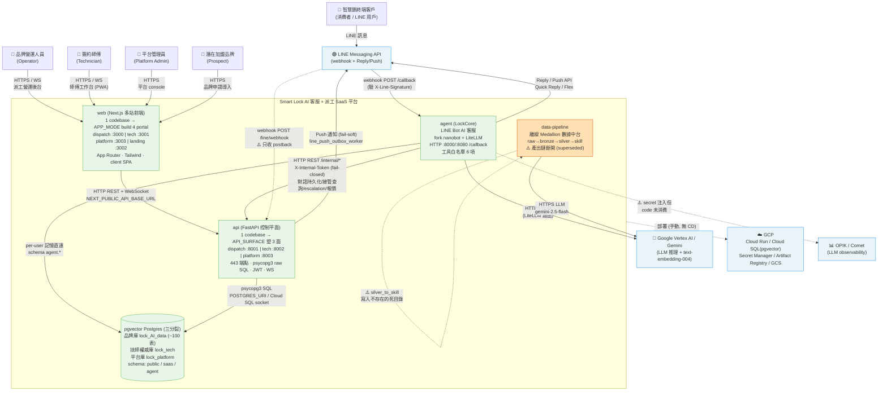
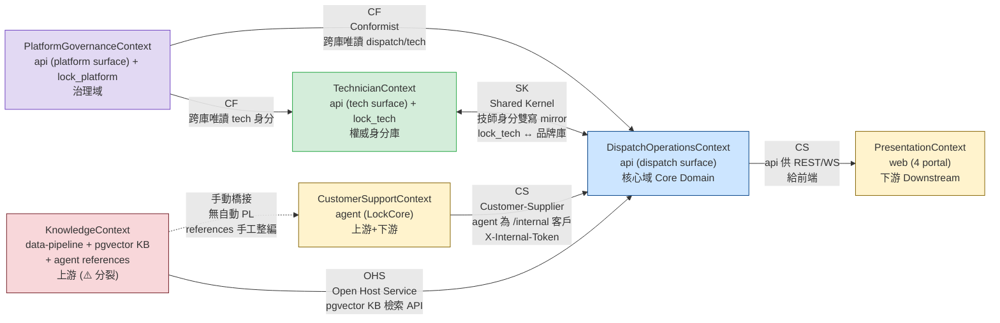

# Smart Lock 平台架構 — C4 L1 System Context

---

## 1. 元資訊

| 欄位 | 內容 |
|---|---|
| 文件版本 | v1.0 |
| 建立日期 | 2026-07-07 |
| 作者 | 平台架構師（多 agent 排查綜合）|
| 審核狀態 | 草稿（現況 baseline）|
| 涵蓋系統數 | 4 個內部子系統 + 7 個外部相依 |
| 架構層級 | C4 Level 1 — System Context |
| 佐證來源 | `web/`、`api/`、`agent/`、`data/`、`SQL/`、`docker-compose.*.yml`、`scripts/deploy/*` 實際 code |

**說明：** 本文件為 Smart Lock 平台的最高層架構描述，依據 C4 Model Level 1（System Context）繪製。所有整合關係均經**多 agent 程式碼庫比對**驗證；宣告存在但未接線者以 `⚠️` 標示；未能證實者標 `[待確認]`。

> **⚠️ 文件漂移警告**：根目錄舊 `README.md` 與 `scripts/deploy/README` 仍描述 LangGraph / ReAct / `main.py` / webhook `/webhook`——這些是 2026-06-04 前已被 **LockCore** 重寫 superseded 的舊架構。**本圖一律以 compose / code 為準**（agent 進入點為 `/callback`，核心為 `agent/lockcore/`）。

---

## 2. C4 L1 System Context

以下 Mermaid 圖涵蓋全部 4 個內部子系統與所有已知外部相依。每條箭頭標示通訊協定與語義說明。

**圖例說明：**
- 實線箭頭（`-->`）：已由 code 驗證的整合路徑
- 虛線箭頭（`-.->`）：宣告存在但未接線、只覆蓋部分語義、或斷開的路徑
- 橘色節點（`data-pipeline`）：產出鏈斷開的孤立系統
- `:port` 為通訊進入點（host port；容器內一律 8080 / 5432）

---

## 3. DDD Strategic Context Map

以下依 Domain-Driven Design 標示各限界上下文間的關係模式。本平台的一大特徵：**api 一份 codebase 內含三個限界上下文（dispatch / tech / platform surface），靠 `API_SURFACE` 與獨立 DB 做物理與邏輯隔離**。

**關係模式說明：**

| 模式 | 全名 | 語義 |
|---|---|---|
| PL | Published Language | 上游發布標準化事件 Schema，下游遵循 |
| CS | Customer-Supplier | 供應方提供服務，消費方依賴並可提需求 |
| ACL | Anti-Corruption Layer | 邊界建立轉換層，隔離外部模型污染 |
| CF | Conformist | 下游完全遵循上游模型，不轉換 |
| SK | Shared Kernel | 雙方共享部分模型，需協調變更 |
| OHS | Open Host Service | 以標準協定對外開放服務 |

> **KnowledgeContext 分裂註記**：本平台存在**兩套並存、無收斂機制**的產品知識系統——(1) `pgvector` 向量 KB（`manual_chunks` / `case_entries`，768 維 embedding，服務後台 web/api 的檢索）；(2) agent 的 filesystem `references/{Brand}/{Model}.md`（SKILL.md 明寫「no database needed」，服務 LINE agent）。data-pipeline 原設計為兩者上游，但 `silver_to_skill` 產出目標已斷開。詳見 `data-pipeline/P1/05` §KnowledgeContext。

---

## 4. 系統整合矩陣表

行 = 發送方（Sender），列 = 接收方（Receiver）。格內標示協議與 Port，空格表示無直接連線。

| 發送方 ↓ / 接收方 → | agent | api (dispatch/tech/platform) | web | data-pipeline | DB (pgvector) | 外部 |
|---|---|---|---|---|---|---|
| **agent** | — | HTTP `/internal/*` X-Internal-Token（4 端點）| | | 直連 `agent.*` 記憶/checkpoint | LINE Reply/Push Vertex LLM |
| **api** | — | —（同 codebase 三面）| REST + WS 推播 :8001/8002/8003 | | psycopg3 SQL POSTGRES_URI×3 | LINE Push（outbox worker）|
| **web** | | REST + WS NEXT_PUBLIC_API_BASE_URL | —（互跳 `*_PORTAL_URL`）| | | |
| **data-pipeline** | ⚠️ references 手工整編（非自動）| | | ⚠️ 死目錄 | | Vertex `gemini-2.5-flash` |
| **DB** | — | — | | | — | GCP Cloud SQL |
| **外部 → 平台** | LINE→agent `/callback` LINE→api `/line/webhook`(postback) | | | | | |

**補充：外部系統整合點**

| 外部系統 | 對接內部系統 | 協議 + 進入點 | 方向 |
|---|---|---|---|
| LINE Messaging API | agent | webhook `POST /callback`（X-Line-Signature）| LINE → agent |
| LINE Messaging API | agent | Reply / Push API | agent → LINE |
| LINE Messaging API | api | webhook `POST /api/v1/line/webhook`（⚠️ 只 postback）| LINE → api |
| LINE Messaging API | api | `line_push_service` + outbox worker | api → LINE |
| Google Vertex AI / Gemini | agent | LiteLLM（`vertex_ai/gemini-3.1-flash-lite`）+ embedding | agent → 外部 |
| Google Vertex AI / Gemini | data-pipeline | `gemini-2.5-flash`（各階段 LLM）| data-pipeline → 外部 |
| GCP Cloud SQL (pgvector) | api / agent | Unix socket / POSTGRES_URI | 平台 → 外部 |
| GCP Cloud Run / Secret Manager / Artifact Registry / GCS | agent / api / web | 部署與機密（asia-east1）| 部署基礎 |
| OPIK / Comet | agent | ⚠️ secret 注入但 code 未消費 | 宣告未啟用 |
| ngrok | agent（本機）| webhook tunnel `ngrok http 8000` | 本機開發 |

---

## 5. 平台架構缺口清單

| # | 缺口描述 | 涉及系統 | 風險 | 建議行動 |
|---|---|---|---|---|
| G-01 | **雲/本機拓撲不對稱** — 本機 5-bundle 多 surface（dispatch/tech/platform/landing/mock），雲端只 3 個 Cloud Run（agent/api/web），api 用預設 `API_SURFACE=all` 單體 monolith，**無 tech/platform/landing 雲端部署、技師庫雲端未接** | api、web、部署 | 🔴 高 | 對齊雲端拓撲，或於部署文件明確記載「雲端單體、本機多面」為刻意設計並補技師庫路徑 |
| G-02 | **RBAC 授權矩陣 shadow-mode** — 80+ 敏感寫入端點僅 `require_tenant` 不檢角色；12×12×4 矩陣 log-only 永不擋 | api | 🔴 高 | 逐端點補 `role_required`；矩陣由 shadow 轉 enforce；補齊 fail-open 情境 |
| G-03 | **即時通道 in-memory 單機** — WS pub-sub hub 與 11 個 cron worker 皆進程內（非 Redis），Cloud Run 多實例會跨實例事件遺失、cron 重複跑（重複 LINE 推播/告警）| api | 🔴 高 | 導入 Redis pub-sub + 分散式排程；min-instances=1 為暫時緩解 |
| G-04 | **data-pipeline 產出鏈斷開** — `silver_to_skill` 目標 `../agent/skills/data` 與 `storage/skill_drafts/` 皆不存在；文件描述已被 LockCore superseded 的 26-skill ReAct 舊架構 | data-pipeline、agent | 🔴 高 | 修復產出目標對齊 lockcore `references/`，或正式標記管線退役、文件標 superseded |
| G-05 | **知識系統角色分工**（原記「兩套無收斂」，2026-07-07 由 **ADR-004** 重定義為「pgvector 唯一事實語料 + Skill 行為驅動」，非收斂而是從屬）。⚠️ 勘查修正：pgvector「RAG」目前僅 keyword stub（`case_service.py:285` Phase 2 未建、`manual_chunks` 從未被查、無 `embed()`），**語義層對所有消費者皆 greenfield** | agent、data-pipeline、api | 🟢 分工已定 | 依 ADR-004 分階段建 RAG-via-MCP 語義層；見 `agent/P2/04_adr/ADR-004` |
| G-06 | **兩個 LINE webhook 分流不明** — agent `/callback`（主客服）與 api `/line/webhook`（只 postback）並存，infra 層分流機制未明 | agent、api | 🟡 中 | 文件化 LINE channel → webhook 路由分流；確認是否同一 channel |
| G-07 | **無統一 Auth / API Gateway** — 認證分散各 api，三/四埠直接對外；JWT 密鑰隔離靠部署紀律（dispatch/tech 共用、platform 必不同），無集中密鑰治理 | 全平台 | 🟡 中 | 評估集中式 identity / API Gateway；密鑰治理集中化 |
| G-08 | **跨庫一致性靠應用層雙寫** — 技師權威庫 `lock_tech` ↔ 品牌庫 mirror，無跨庫交易；漏設 `TECH_POSTGRES_URI` 會靜默漂移退回單庫 | api、DB | 🟡 中 | 明確化雙寫協議 + 對帳；啟動守衛檢查 URI 完整性 |
| G-09 | **v1→v2 API cutover 未完成** — v1/v2 雙掛，`DeprecationMiddleware` 仍在用，OpenAPI 仍有 v1 path，真實 v1 caller ~42，多份 CIA 待業主裁決 | api、web | 🟡 中 | 收尾 P4 cutover 5 gate；依 CIA 裁決逐一遷移 |
| G-10 | **Migration registry 雙向漂移** — 純 SQL forward-only 不可逆，`schema_migrations` 046 才建，狀態欄自承「意圖非事實」，缺 CI 比對 | DB、data-pipeline | 🟡 中 | 建 CI schema drift 檢查；補歷史套用真相 |
| G-11 | **前端認證全 client-side** — JWT 存 localStorage（`atob` 不驗簽），路由 gate 只是 UX 層（未授權 bundle 仍下載）；`rolePolicy` 未列路由 **fail-open** | web | 🟡 中 | 敏感頁改 deny-by-default；評估 cookie + middleware 保護 |
| G-12 | **無 CD pipeline** — 14 個 workflow 全 CI 無 CD，部署全手動（`scripts/deploy/*.sh`）| 全平台 | 🟢 低-中 | 逐步建立 Cloud Run 自動部署管道 |

---

## 6. 整合演進路線

### Phase 1 — 本月優先（正確性與一致性）

**目標：** 修補最高風險缺口（授權、拓撲一致、產出鏈）。

| 任務 | 負責系統 | 交付物 |
|---|---|---|
| RBAC 矩陣由 shadow 轉 enforce，逐一補 `role_required` | api | 授權中介層 + 端點盤點 |
| 修復或退役 data-pipeline 產出鏈（對齊 lockcore references）| data-pipeline | 產出目標修正 or superseded 標記 |
| 部署拓撲文件化（雲端單體 vs 本機多面）+ 補技師庫雲端路徑決策 | api、部署 | `api/P2/14` 更新 |

**驗收：** 未授權角色寫金流/派工回 403；data-pipeline 跑 `silver_to_skill` 不再寫死目錄。

### Phase 2 — 下月（可擴展性）

| 任務 | 負責系統 | 交付物 |
|---|---|---|
| WS hub 與 cron worker 遷移至 Redis pub-sub + 分散式鎖 | api | 事件匯流排 + 排程改造 |
| 統一知識真相源（references ↔ pgvector 收斂）| agent、data-pipeline | 知識同步管道 |
| LINE webhook 分流文件化 + 明確化 channel 路由 | agent、api | 整合契約 |

### Phase 3 — Q3（治理健壯化）

| 任務 | 負責系統 | 交付物 |
|---|---|---|
| 集中式 identity / API Gateway 評估與導入 | 全平台 | Gateway PoC |
| v1→v2 cutover 收尾 | api、web | ADR-v2-cutover-complete |
| Migration CI drift 檢查 + 備份/還原文件 | DB | CI workflow + RTO/RPO |
| Cloud Run CD pipeline | 全平台 | 自動部署 workflow |

---

## 7. 通用語言詞彙表

| 術語 | 定義 |
|---|---|
| **API_SURFACE** | api 的 runtime 塑形旗標，值 `dispatch`/`tech`/`platform`/`all`。決定該部署實例暴露哪些路由前綴與是否啟背景 worker。同一 image 三面部署的核心機制。 |
| **APP_MODE** | web 的 build-time 旗標（`NEXT_PUBLIC_APP_MODE`），值 `dispatch`/`tech`/`platform`/`landing`/`all`。決定 client-side 路由 gate 放行哪些頁群。 |
| **portal / 部署面** | 由 APP_MODE / API_SURFACE 塑出的邏輯部署單元。web 有 4 portal、api 有 3 surface，但各自只有一份 codebase。 |
| **品牌庫 / 技師庫 / 平台庫** | pgvector Postgres 的三向分裂：品牌庫 `lock_AI_data`（一品牌一庫，全業務 ~100 表）、技師權威庫 `lock_tech`（全品牌共用身分，CR-0112）、平台庫 `lock_platform`（管理員/品牌申請，CR-0114）。 |
| **LockCore** | agent 的核心引擎，fork 自 `HKUDS/nanobot`，位於 `agent/lockcore/`。取代已刪除的 LangGraph ReAct 架構。 |
| **Agent Skills 標準** | agent 知識與 SOP 的格式（`SKILL.md` + `references/`），可攜（複製到 Claude Code / Cursor / nanobot 直接可用）。目前兩個 builtin skill：`locksmith-product-knowledge`、`locksmith-cs-sop`。 |
| **transfer_to_human** | agent 工具白名單中唯一的「出口」工具，把案子經 `/internal/escalations/ingest` 送進派工/工單後台（建問題卡）。 |
| **Medallion（raw→bronze→silver→skill）** | data-pipeline 的分層數據架構。bronze-only sourcing：知識內容嚴格源自 bronze（YouTube 字幕/website/transcript），PDF 只引 URL。 |
| **X-Internal-Token** | agent → api 內部整合的服務間認證（`INTERNAL_API_TOKEN`），fail-closed（未設則 ingest 回 503）。 |
| **shadow-mode RBAC** | 授權矩陣目前只記 log 不實際阻擋（enforce=false），為過渡狀態。 |

---

## 附錄 A：Port 快速參考（本機 compose）

| Bundle | 服務 | Host Port | 協議 | 用途 |
|---|---|---|---|---|
| dispatch | db (pgvector) | :5433 | Postgres | 品牌庫 `lock_AI_data` |
| dispatch | api | :8001 | HTTP/WS | `API_SURFACE=dispatch`（完整面 + 背景 worker）|
| dispatch | agent | :8000 | HTTP | LockCore LINE Bot `/callback` |
| dispatch | web | :3000 | HTTP | `APP_MODE=dispatch` |
| tech | tech-db (pgvector) | :5434 | Postgres | 技師權威庫 `lock_tech` |
| tech | tech-api | :8002 | HTTP | `API_SURFACE=tech`（停背景 worker）|
| tech | tech-web | :3001 | HTTP | `APP_MODE=tech`（WS 仍指 :8001）|
| platform | platform-db (pgvector) | :5435 | Postgres | 平台庫 `lock_platform` |
| platform | platform-api | :8003 | HTTP | `API_SURFACE=platform` |
| platform | platform-web | :3003 | HTTP | `APP_MODE=platform` |
| landing | landing-web | :3002 | HTTP | `APP_MODE=landing`（無 DB/後端）|
| mock | prism-openapi | :4010 | HTTP | Prism OpenAPI mock（契約開發）|

> 容器內部一律：Postgres 5432、api/agent/web 8080、prism 4010。雲端：3 個 Cloud Run service（`smart-lock-agent` / `smart-lock-api` / `smart-lock-web`）+ Cloud SQL pgvector 實例 `lock-ai`。

---

*文件結尾 — Smart Lock 平台架構 C4 L1 v1.0 / 2026-07-07*
