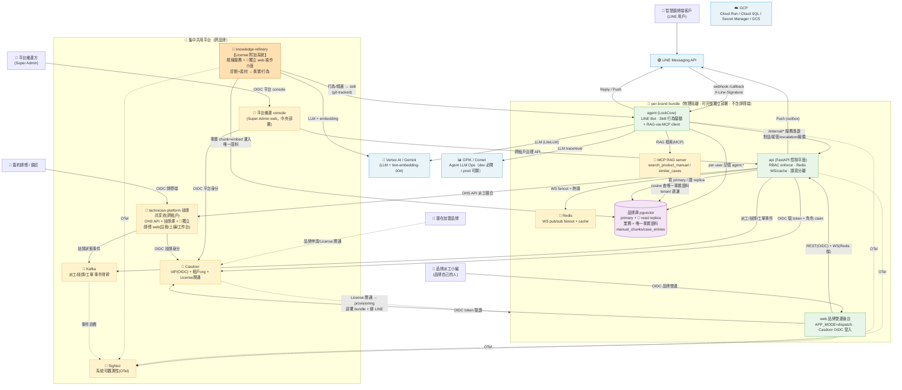
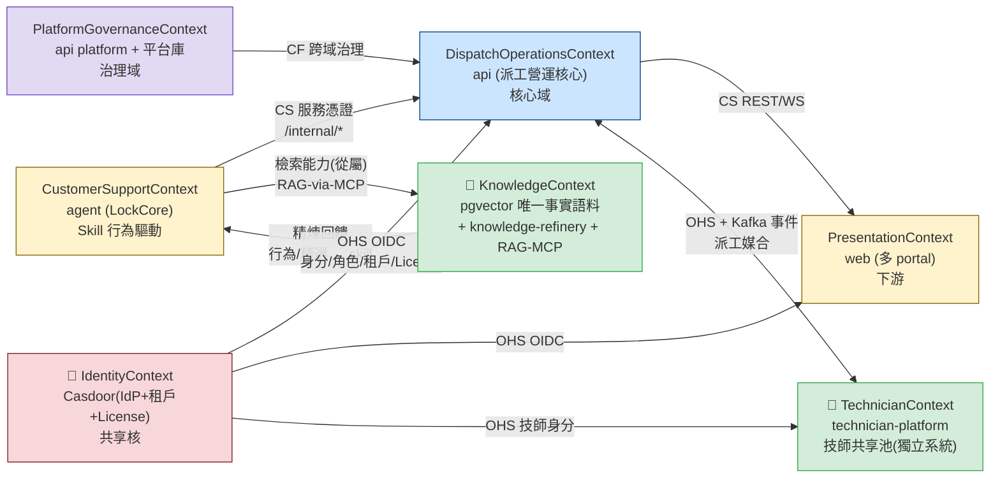

# Smart Lock 平台架構 — C4 L1 System Context（理想態 target v2）

---

## 1. 元資訊

| 欄位 | 內容 |
|---|---|
| 文件版本 | **v2.0（target-state 理想態）** |
| 建立日期 | 2026-07-07 |
| 作者 | 平台架構師（多 agent 排查 + 業主架構決策）|
| 審核狀態 | 理想態藍圖（as-is 現況 baseline 保存於 git `238f6fce`）|
| 涵蓋系統數 | **6 個內部系統**（agent / api / web / knowledge-refinery / technician-platform + 集中共用基礎設施）+ 外部相依 |
| 架構層級 | C4 Level 1 — System Context |
| 依據決策 | 平台級 ADR-P001~P007 + agent ADR-004 |

**說明：** 本文件描述 Smart Lock 平台的**理想態（target）**最高層架構——由現況 as-is 逐坑演進而來，每項決策皆有對應 ADR。凡標 `🎯` 為 target 新增/演進元件；`(現況)` 標示尚未落地、屬遷移路徑者。

> **⚠️ 現況 vs 理想態**：本文件已由 v1.0 現況（as-is）就地改寫為 v2.0 理想態。**現況 baseline 完整保存於 git commit `238f6fce`**，可 `git diff 238f6fce -- smartlock-docs/00_platform/P1/05_platform_architecture_L1.md` 對照演進。
>
> **⚠️ 文件漂移警告（仍適用）**：根目錄舊 `README.md` 仍描述 LangGraph / ReAct（2026-06-04 已被 **LockCore** superseded）。本圖一律以 compose / code + ADR 決策為準。

---

## 2. C4 L1 System Context（target）

理想態的三大結構特徵（皆服務於「License 開通」商業模式）：
1. **per-brand bundle 可獨立部署**（[[ADR-P005]]）：每品牌一套物理隔離、**可完整獨立部署的單體**——web(**僅品牌營運 dispatch**)/api/agent/品牌庫/Redis/MCP-RAG。**不含師傅端**，故品牌不依賴任何共享元件即可自成一套上線。
2. **集中共用平台**（跨品牌）：Casdoor / SigNoz / **technician-platform（技師共享池，含獨立師傅 web）** / Kafka + 平台維運 console 由平台集中營運，per-brand bundle 串接之。
3. **License 附加系統**：**knowledge-refinery（知識精煉，含獨立 web 操作介面）** 為 License 開通的**附加模組**，非基礎部署必備。「開通哪些模組」由 License 決定，整體架構圍繞此微調。

**圖例：** 實線 `-->` = target 已定案整合路徑；虛線 `-.->` = 監控/開通旁路；`🎯` = 理想態新增/演進元件；`primary + read replica` = 讀寫分離。

---

## 3. DDD Strategic Context Map（target）

理想態的限界上下文由現況的「api 一庫三面」演進為**明確的 6 個上下文**，其中 **TechnicianContext 與 KnowledgeContext 升格為獨立系統**，並新增 **IdentityContext（Casdoor）** 作為跨租戶共享核。

**關係模式：** PL 發布語言 · CS 客戶-供應 · ACL 防腐層 · CF 遵循者 · SK 共享核心 · OHS 開放主機服務。

> **🎯 KnowledgeContext（依 [[ADR-004]] 重定義）**：**Skill = 行為驅動**（HOW/WHEN 怎麼想、何時查）、**RAG = 檢索能力**（WHAT 事實，經 MCP 隨查隨取），兩者**從屬非收斂**。`pgvector`（`manual_chunks`/`case_entries`）為**唯一事實語料**，agent 經 **RAG-via-MCP** 取、後台 web/api 亦查同一份 → 舊 G-05「兩套須收斂」**溶解**。
> ⚠️ **現況勘查修正**（ADR-004 §2.2）：pgvector 語義層目前為 **greenfield**（`case_service.py:285` 僅 keyword stub、`manual_chunks` 從未被查、無 `embed()`）；MCP client 已 vendored、**server 待建**。此為遷移路徑起點，非既有能力。
>
> **🎯 TechnicianContext（[[ADR-P004]]）**：技師是**跨品牌身分**，升格為獨立共享池系統，派工平台經 **OHS API + Kafka 事件**串接（非直連技師庫），解 per-brand 隔離 vs 共享技師的矛盾。

---

## 4. 系統整合矩陣表（target）

| 發送方 ↓ / 接收方 → | agent | api | web | knowledge-refinery | technician-platform | Casdoor | 品牌庫 pgvector |
|---|---|---|---|---|---|---|---|
| **agent** | — | `/internal/*` 服務憑證 | | | | | 記憶 `agent.*`；RAG-via-MCP 查語料 |
| **api** | — | — | REST(OIDC)+WS(Redis) | | OHS API 派工媒合 + Kafka | 驗 OIDC token | 寫 primary / 讀 replica |
| **web** | | REST+WS | — | | | OIDC 登入 | |
| **knowledge-refinery** | 行為/精選→skill | | | — | | | 事實 chunk+embed 灌唯一語料 |
| **technician-platform** | | 技師狀態→Kafka | | | — | OHS 技師身分 | 技師庫 lock_tech(自有) |
| **Kafka（事件骨幹）** | | → api/技師平台消費 | | | → 消費 | | |
| **外部 → 平台** | LINE→agent `/callback` | LINE→api postback | | | | Prospect→License 開通 | |

**外部系統整合點（target）**

| 外部系統 | 對接 | 協議 | 方向 |
|---|---|---|---|
| LINE Messaging API | agent `/callback`、api push/postback | webhook / Reply / Push | 雙向 |
| Vertex AI / Gemini | agent(LLM)、knowledge-refinery(LLM+embedding)、MCP-RAG(embed) | HTTPS | 平台 → 外部 |
| OPIK / Comet | agent（LLM Ops，dev 開/prod 可關）| SDK | agent → 外部 |
| GCP（Cloud Run/SQL/Secret/GCS/Artifact）| 全平台 | 部署/機密/儲存 | 部署基礎 |

---

## 5. 缺口 → 理想態決策對照表

| # | 現況缺口 | 定案 ADR | 理想態解 | 狀態 |
|---|---|---|---|---|
| G-01 | 雲/本機拓撲不對稱 | [[ADR-P005]] | per-brand 授權部署（大單體+內部容器）+ 集中共用元件分層；License 開通綁 LINE | 🎯 已定案 |
| G-02 | RBAC shadow-mode | [[ADR-P006]] | 四方角色（Super Admin/租戶 Admin/小編/技師）；矩陣 shadow→enforce；租戶自助開帳 | 🎯 已定案 |
| G-03 | 即時 in-memory 單機 | [[ADR-P007]] | Redis(絲滑推播+cache)＋讀寫分離＋Kafka(事件骨幹)，分期 | 🎯 已定案 |
| G-04 | data-pipeline 產出鏈斷 | [[ADR-P001]] | 升格 knowledge-refinery 獨立服務+UI；落點對齊（事實→pgvector、行為→skill）| 🎯 已定案 |
| G-05 | 兩套知識無收斂 | [[ADR-004]] | **溶解**：pgvector 唯一事實語料 + skill 行為驅動（從屬非收斂）；RAG-via-MCP。⚠️ 語義層 greenfield 待建 | 🎯 已定案 |
| G-07 | 無統一 Auth | [[ADR-P003]] | Casdoor 全包 IdP+租戶+License | 🎯 已定案 |
| G-08 | 跨庫一致性靠雙寫 | [[ADR-P004]] | 技師平台為單一真相，派工經 OHS API+事件，汰除 mirror 雙寫 | 🎯 已定案 |
| G-11 | 前端 client-side auth | [[ADR-P003]] | Casdoor OIDC 授權碼流；token 安全儲存；deny-by-default | 🎯 已定案 |
| 監控空白 | 無系統可觀測性 | [[ADR-P002]] | SigNoz 系統監控（單一）+ OPIK agent LLM Ops（dev/prod 可切）| 🎯 已定案 |
| G-06 | 兩個 LINE webhook 分流 | [[ADR-005]] · CR-0121 | **已定案（方案 A）**：LINE 單 channel 單 URL → agent `/callback` 唯一入站門 + postback 前綴 fan-out → `/internal/*`；api `/line/webhook` 退役。⚠️ code 待實作 | 🎯 已定案 |
| G-09 | v1→v2 cutover 未完成 | — | 待處理：收尾 P4 cutover 5 gate | 🟡 待議 |
| G-10 | Migration registry 漂移 | — | 待處理：CI schema drift 檢查 | 🟡 待議 |
| G-12 | 無 CD pipeline | — | 待處理：Cloud Run 自動部署 + per-brand provisioning 自動化 | 🟡 待議 |

---

## 6. 演進路線（target，分階段）

> 對應各 ADR §5 執行計畫；昂貴階段 gate 在業主同意。

### Phase 1 — 正確性與絲滑即時（本月）
- **RBAC shadow→enforce**（[[ADR-P006]]）：逐端點補 `role_required`，先高風險金流/派工。
- **Redis 上線**（[[ADR-P007]]）：`ws_hub` 遷 Redis pub/sub、cron 加分散式鎖、DB 連線池（取代單一 AsyncConnection）。
- **OPIK 正確接上**（[[ADR-P002]]）：agent 消費 secret + 環境旗標；部署 SigNoz 接 OTel。
- **knowledge-refinery 止血**（[[ADR-P001]]）：移除死落點 config。

### Phase 2 — 身分/知識/技師平台（下月）
- **Casdoor 導入**（[[ADR-P003]]）：各 api 改 OIDC、web 改授權碼流、org=品牌租戶、租戶自助開帳。
- **RAG-via-MCP 語義層**（[[ADR-004]]）：建 `embed()` + 2 條 cosine query + MCP server；語料灌注（對齊 refinery）。
- **technician-platform 抽出**（[[ADR-P004]]）：由 tech-db/tech-api 升格獨立系統 + OHS API + Kafka 事件。
- **讀寫分離**（[[ADR-P007]]）：read replica + 讀路由。

### Phase 3 — 事件骨幹與治理健壯化（Q3）
- **Kafka 事件骨幹**（[[ADR-P007]]）：派工/技師/工單事件；解耦消費者（通知/SLA/結算/技師平台）。
- **per-brand provisioning 自動化**（[[ADR-P005]]）：License→部署→建庫→綁 LINE；CD pipeline（G-12）。
- **收尾**：v1→v2 cutover（G-09）、migration CI drift（G-10）。LINE webhook 分流（G-06）已定案（[[ADR-005]] · CR-0121 方案 A），待 code 實作。

---

## 7. 通用語言詞彙表（target）

| 術語 | 定義 |
|---|---|
| **per-brand bundle** | 每品牌一套物理隔離、**可完整獨立部署**的容器單體（web/api/agent/品牌庫/Redis/MCP-RAG）；**web 僅品牌營運 dispatch、不含師傅端**，故不依賴任何共享元件即可上線；需 License 授權開通並綁定該品牌 LINE（[[ADR-P005]]）。 |
| **集中共用平台 / License 附加** | 跨品牌集中營運：Casdoor / SigNoz / technician-platform（含獨立師傅 web）/ Kafka / 平台維運 console；其中 **knowledge-refinery 為 License 開通的附加系統**（含獨立 web，非基礎必備）。「開通哪些模組」由 License 決定。 |
| **Casdoor** | 統一 IdP（OAuth2/OIDC）+ 租戶 org + 角色 + License 訂閱開通（[[ADR-P003]]）。 |
| **Super Admin / 租戶 Admin / 小編 / 技師** | 四方 RBAC：平台維運=跨租戶 Super Admin；品牌=租戶 Admin（自助開帳）；派工小編=租戶內操作；技師=跨租戶現場身分（[[ADR-P006]]）。 |
| **Skill 行為驅動** | agent 的策略層：定義怎麼想、依什麼規範、何時查什麼。承載 SOP + 精選事實（[[ADR-004]]）。 |
| **RAG-via-MCP** | agent 的檢索能力：pgvector 語義查找經 MCP server 暴露為工具（繞過 CS allowlist），DB 耦合封在 server 後保住可攜性（[[ADR-004]]）。 |
| **唯一事實語料** | pgvector `manual_chunks`/`case_entries`（768 維 HNSW cosine），agent 與後台共用的單一事實來源。⚠️ 語義層現為 greenfield 待建。 |
| **knowledge-refinery** | **License 開通的附加系統**（非基礎必備）+ **獨立 web 操作介面**：診斷+素材 → 事實(灌 pgvector) + 行為(更新 skill)，human-in-the-loop 審核（[[ADR-P001]]）。 |
| **License 開通** | 商業模式核心：品牌以 License 授權開通「基礎 bundle + 綁 LINE」及各附加模組（如 knowledge-refinery）。整體架構圍繞「開通哪些模組」而定，經 Casdoor 訂閱管理（[[ADR-P003]]、[[ADR-P005]]）。 |
| **technician-platform** | 技師共享池獨立系統（跨租戶身分/技能/認證/排班）+ **獨立師傅 web**（註冊/上線/工作台）；師傅端**不放在品牌 bundle**，讓品牌可獨立部署；派工平台經 OHS API + Kafka 串接（[[ADR-P004]]）。 |
| **SigNoz / OPIK** | 分層可觀測性：SigNoz=系統/服務層（OTel，prod 常開）；OPIK=agent LLM Ops（dev 必開/prod 可關）（[[ADR-P002]]）。 |
| **Kafka / Redis** | Kafka=派工/技師/工單事件骨幹（持久/可重播/解耦）；Redis=WS pub/sub 即時 fanout + 熱讀 cache（[[ADR-P007]]）。 |
| **LockCore** | agent 核心引擎，fork 自 `HKUDS/nanobot`，取代已刪的 LangGraph ReAct。 |

---

## 附錄 A：部署拓撲（target）

**per-brand bundle（每品牌一套，物理隔離，可完整獨立部署）** — 內部容器沿用現況 compose 的 port 慣例作為模板：

| 元件 | 容器 port | 用途 |
|---|---|---|
| web | 8080 | **品牌營運後台**（APP_MODE=dispatch）· OIDC 登入；**不含師傅端** |
| api | 8080 | RBAC enforce · Redis WS/cache · 讀寫分離 |
| agent | 8080 | LockCore `/callback` · RAG-MCP client |
| MCP RAG server | (內部) | search_product_manual / similar_cases |
| Redis | 6379 | WS pub/sub + cache |
| 品牌庫 pgvector | 5432 | 業務 + 唯一事實語料（primary + read replica）|

**集中共用平台（跨品牌，各一套 HA）**

| 元件 | 用途 |
|---|---|
| Casdoor | IdP + 租戶 org + License；HA（關鍵單點）|
| SigNoz | 系統可觀測性（OTel 收集 + dashboard）|
| technician-platform | 技師共享池服務 + 技師庫 `lock_tech` + **獨立師傅 web**（註冊/上線/工作台，單一真相）|
| 平台維運 console | Super Admin web（跨租戶治理，中央部署）|
| **knowledge-refinery**（License 附加）| 精煉服務 + **獨立 web 操作介面**（非基礎必備，License 開通）|
| Kafka | 派工/技師/工單事件骨幹 |

> **現況 → target 差距**：現況雲端為 3 個 Cloud Run 單體（`API_SURFACE=all`），target 為 per-brand bundle + 集中共用平台；provisioning 自動化與 CD 屬 Phase 3（G-12）。現況 as-is port map 見 git `238f6fce`。

---

*文件結尾 — Smart Lock 平台架構 C4 L1 理想態 v2.0 / 2026-07-07*
