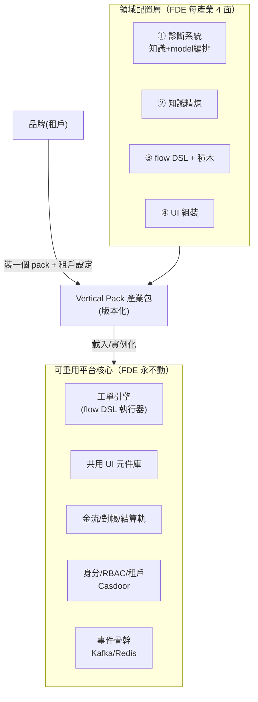
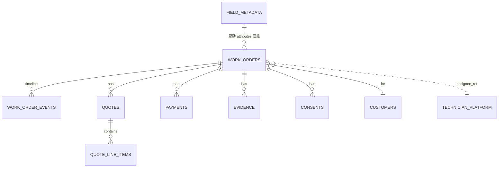

# 通用工單維運平台 — 詳細設計（SDS）

---

## 1. 元資訊

| 欄位 | 內容 |
|---|---|
| 文件版本 | v0.1（詳細設計 / §9 待業主拍板）|
| 建立日期 | 2026-07-07 |
| 層級 | 平台級（Platform）· 詳細設計（SDS）|
| 上位決策 | [[ADR-P009]]（核心 vs 配置分層）· [[ADR-P010]]（Flow-as-Blocks）· [[ADR-P011]]（AI 編譯器）· `06_platformization_strategy` |
| 範圍 | **通用工單維運後台**的領域模型 / Vertical Pack / Flow DSL + 積木 / 引擎 / 後台呈現 / FDE workflow |
| 現況接地 | 今日 `work_orders` 為智慧鎖專用（`brand/model/serial/warranty/teaching_note` 等），~10 表 FK 掛它。本 SDS 定義「通用核心 + 產業配置」的目標形態與遷移方向 |

---

## 2. 分層總覽（recap [[ADR-P009]]）



**核心原語**：引擎只認識「工單 / 狀態機 / 派工 / 報價 / 金流 / 事件」等**產業無關**概念；產業知識全在 Vertical Pack。

---

## 3. 領域模型設計（通用核心 + JSONB + field_metadata）

### 3.1 ER 概念



### 3.2 核心表（產業無關；`attributes JSONB` 承載產業欄位）

```sql
work_orders (
  id, tenant_id, industry_pack, pack_version,
  customer_id, location JSONB,          -- 地址/geo
  status TEXT,                          -- 值域由 flow DSL 定義（非 enum 寫死）
  priority, sla_due_at,
  assignee_ref TEXT,                    -- → technician-platform（跨系統 ref，不 FK，[[ADR-P004]]）
  quote_id, settlement_id, amount,
  attributes JSONB,                     -- 產業欄位：鎖{brand,model,serial,warranty} / HVAC{unit,refrigerant}
  created_at, updated_at
)
work_order_events (id, wo_id, seq, type, actor_ref, from_status, to_status, payload JSONB, at)  -- 事件溯源時間軸
quotes(id, wo_id, status, total, attributes JSONB)   quote_line_items(id, quote_id, catalog_ref, qty, unit_price, attributes JSONB)
payments(id, wo_id, method, amount, status, …)       settlements(id, …)
evidence(id, wo_id, kind, uri, meta JSONB)           consents(id, wo_id, kind, signed_by, uri, at)
field_metadata(pack, pack_version, entity, key, label, type, required, options JSONB, validation JSONB, ui_hints JSONB)
```

### 3.3 設計要點
- **核心欄位 = 各產業不變的營運骨架**（客戶/地點/狀態/指派/金額/時間軸）→ 可查詢、可索引、可報表。
- **`attributes JSONB` = 產業變動欄位**；語義由 `field_metadata` 定義（type/required/options/validation/ui_hints）→ 驅動 `DynamicForm`/`DynamicTable`/驗證。**加欄位不改 schema、不寫 code**。
- **`status` 不寫死 enum**——值域與轉移由 pack 的 flow DSL 定義（§5）。
- **`assignee_ref` 跨系統參照**技師共享池（不跨庫 FK），派工經 OHS API + Kafka（[[ADR-P004]]）。
- **現況遷移**：把 `work_orders` 的鎖專用欄位（brand/model/serial/warranty…）逐步下沉到 `attributes` + `field_metadata(pack=locksmith)`；核心欄留下。屬 refactor CR，走 CIA。

---

## 4. Vertical Pack 設計

### 4.1 Manifest

```yaml
pack: locksmith
version: 1.2.0
extends: blue-collar-service@2.x     # 可繼承藍領基底 pack（共用預設）
field_metadata: [ {entity: work_order, key: brand, type: enum, options: [...], required: true}, ... ]
flow: ./flow.dsl.json                # 工單+金流狀態機（§5）
catalog:  { services: [...], materials: [...], pricing_rules: [...] }
knowledge: { skills: [locksmith-cs-sop, locksmith-product-knowledge], rag_corpus: pgvector://locksmith }
ui_composition: { screens: [ {route: /work-orders, layout: [...component refs...]} ] }   # §7
blocks: [ dispatch, quote_approval, onsite_consent, collect_payment, settle, ... ]        # §6
```

### 4.2 版本化與實例化
- Pack 語意版本化；**品牌（租戶）= 裝一個 pack@version + 租戶級覆寫**（價目/SLA/品牌參數）。
- Pack 升級 = 版本遷移（field_metadata / flow 的向後相容檢查）。
- `blue-collar-service` 基底 pack 提供藍領共用預設，各垂直 `extends` 之（減少重複，餵飛輪）。

---

## 5. Flow DSL + 引擎（[[ADR-P010]]）

### 5.1 DSL schema（宣告式狀態機）

```json
{
  "flow": "locksmith.work_order", "version": "1.2.0", "initial": "created",
  "states": { "created": {}, "dispatched": {}, "on_site": {}, "quoted": {},
              "approved": {}, "in_progress": {}, "completed": {}, "settled": {}, "cancelled": {} },
  "transitions": [
    {"from":"created","to":"dispatched","on":"assign","guard":"role:dispatcher","do":["block:dispatch"]},
    {"from":"dispatched","to":"on_site","on":"arrive","guard":"role:technician","do":["block:onsite_consent"]},
    {"from":"on_site","to":"quoted","on":"quote","do":["block:build_quote"]},
    {"from":"quoted","to":"approved","on":"customer_approve","do":["block:quote_approval"]},
    {"from":"in_progress","to":"completed","on":"finish","do":["block:capture_evidence"]},
    {"from":"completed","to":"settled","on":"settle","do":["block:collect_payment","block:settle"]}
  ],
  "sla": [ {"state":"dispatched","due":"PT2H","on_breach":["block:notify_supervisor"]} ]
}
```

### 5.2 引擎執行模型
1. 載入 pack flow → 建狀態機。
2. 收到 action/event → **檢查 guard**（RBAC via Casdoor claim + precondition）→ **執行 block**（block 內跑 primitives）→ **持久化狀態** + **寫 `work_order_events`（事件溯源）** + **發 Kafka 事件** + **掛 SLA timer（Redis/排程）**。
3. **冪等**（event seq + idempotency key）；side-effect 經 outbox 保證。

### 5.3 積木契約

```json
{ "block":"dispatch", "kind":"domain",
  "inputs": {"technician_ref":"required","window":"optional"},
  "preconditions": ["wo.status==created","wo.location!=null"],
  "guards": ["role:dispatcher"],
  "effects": ["set assignee_ref","emit dispatch.assigned","kafka:dispatch.assigned"],
  "composed_of": ["primitive:query_technician","primitive:set_field","primitive:emit_event"] }
```

- **契約嚴謹是 AI 可安全編譯（[[ADR-P011]]）的前提**：inputs/preconditions/guards/effects 明確 → 匯入時可靜態驗證。

---

## 6. 後台呈現設計（分兩層，[[ADR-P009]] §3.3）

### 6.1 共用元件庫（核心，不隨產業改）
`DynamicForm` / `DynamicTable`（吃 field_metadata，欄位層配置驅動）· `WorkOrderBoard`（按 flow 狀態的看板）· `DispatchConsole` · `QuotePanel` · `FinancePanel` · `EvidenceViewer` · `CustomerTimeline` · `FlowEditor`（拖拉，Phase 2）。

### 6.2 兩層渲染
- **欄位層 = 配置驅動**：產業欄位透過 `field_metadata` 由 `DynamicForm/Table` 自動渲染（免 code）。
- **畫面層 = 元件組裝**：`ui_composition` 用元件庫**組裝**該產業後台畫面 + 少量**自訂 panel**（垂直逃生艙）。→ FDE 第 ④ 面（輕前端）。

---

## 7. FDE 新產業 workflow（4 配置面）

1. **field_metadata** — 定工單/報價的產業欄位。
2. **知識精煉** — skills（行為）+ RAG 語料（事實，[[ADR-004]]）。
3. **flow DSL** — 手寫狀態機（**DSL-first**，先驗證引擎跑得動）+ 選用積木。
4. **ui_composition** — 元件庫組裝畫面 + 自訂 panel。
→ 打包 **Vertical Pack@version** → 發布 → 品牌實例化。**核心引擎/元件庫/金流軌/身分 RBAC/事件骨幹全不動。**

（後續 [[ADR-P011]]：AI 把客戶 SOP 編譯成第 3 步的 draft flow DSL，人審後匯入。）

---

## 8. 演進/實作路線

| Phase | 內容 | 依賴 |
|---|---|---|
| 1 | flow DSL schema + 積木契約 + **引擎（手寫 DSL 可執行/驗證）** | [[ADR-P010]] DSL-first |
| 2 | 通用工單核心表重構（core + JSONB + field_metadata）+ DynamicForm/Table | 走 CIA（動 schema/contract）|
| 3 | locksmith Vertical Pack v0（把現況鎖邏輯搬成 pack）+ 元件庫組裝 | Phase 1-2 |
| 4 | 第 2 產業驗證分層是否真的免改核心（飛輪 bootstrap）| — |
| 5 | 拖拉 FlowEditor + AI Onboarding Compiler | [[ADR-P011]] |

---

## 9. 🛑 待業主拍板的 3 個子決策（附推薦）

### 決策 A — Flow DSL 執行引擎：自建 vs 採現成

| 選項 | 優 | 劣 |
|---|---|---|
| A1 自建輕量 executor | 掌控、藍領貼合、輕 | 自行處理持久化/重試/補償 |
| A2 採 **Temporal** 為執行後端 | durable、long-running、retry/saga 成熟 | 重、學習曲線、初期 overkill |
| A3 採 **BPMN/Camunda(Zeebe)** | 標準、有現成編輯器 | 語義通用、藍領弱、AI-gen 難、掌控低 |

> **✅ 推薦：DSL 一定自建（A1 的 DSL）+ 執行後端初期自建、保留 Temporal 為可替換後端。**
> 理由：DSL 是皇冠寶石（要 AI-可生成 + 拖拉 target + 藍領語義），**不能外包給 BPMN**；工單狀態機多是人驅動的狀態轉移 + SLA + 經 Kafka 的 side-effect，**初期不需 Temporal 的 durable/saga 重武器**；把 DSL 與 executor 解耦，未來若出現長流程/複雜補償再把後端換 Temporal，DSL 不動。

### 決策 B — 積木顆粒度

| 選項 | 說明 |
|---|---|
| B1 粗顆粒 | 一積木=一完整業務步驟（派工/報價核准/收款）|
| B2 細顆粒 | 一積木=一原子動作（發通知/查技師/寫欄位）|
| B3 **雙層** | 對外暴露粗顆粒 domain block；其內部由細顆粒 primitives 組成 |

> **✅ 推薦：B3 雙層。**
> 對外（拖拉 / AI 編譯）給**粗顆粒 domain block**（老闆看得懂「派工」，看不懂「emit event」）→ 避免拖拉爆炸；內部**細顆粒 primitives**（發通知/查技師/狀態轉移/寫欄位/外呼）讓平台團隊組合出新 domain block——**這正是積木飛輪的實作機制**（[[ADR-P011]]）。

### 決策 C — 逃生艙形式

| 選項 | 說明 |
|---|---|
| C1 inline code 節點 | flow 內嵌任意 script |
| C2 plugin SDK | 註冊型別安全的自訂 block（過審、版本化）|
| C3 webhook 外呼 | flow 呼外部 HTTP，邏輯在客戶側 |

> **✅ 推薦：C2 + C3 分風險，拒 C1。**
> 需與核心資料/交易緊耦合的自訂邏輯 → **plugin SDK**（型別安全 + 審查 + 進 Block Ontology 版本化）；只需呼叫品牌自有系統/展示邏輯 → **webhook 外呼**（最鬆耦合、核心不擔責）；**拒絕 inline code 節點**（任意執行的安全/維運噩夢，且 AI 生成更難靜態驗證，違背 [[ADR-P010]] 可驗證約束）。

---

## 10. 追溯

| 決策/需求 | 來源 |
|---|---|
| 核心 vs 配置分層、三地基、FDE 4 面 | [[ADR-P009]] |
| flow DSL + 積木 + DSL-first | [[ADR-P010]] |
| AI 編譯器 + 積木飛輪 + HITL | [[ADR-P011]] |
| 供應商無關模型編排（診斷系統①）| [[ADR-P008]] |
| 知識：事實→pgvector / 行為→skill | [[ADR-004]] · [[ADR-P001]] |
| 技師 assignee_ref 跨系統 | [[ADR-P004]] |

---

*文件結尾 — 通用工單維運平台 SDS v0.1（§9 待拍板）/ 2026-07-07*
