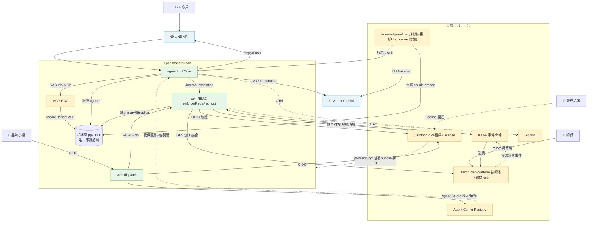

# Smart Lock 平台整合資料流 — 跨系統依賴分析（理想態 target v2）

## 1. 元資訊

| 欄位 | 內容 |
|------|------|
| 文件編號 | 00_platform / P2 / 09 |
| 版本 | **v2.0.0（target-state 理想態）** |
| 建立日期 | 2026-07-07 |
| 維護者 | 平台架構師 |
| 狀態 | 理想態藍圖（as-is 現況資料流保存於 git `238f6fce`）|
| 依據 | 平台 L1 target（05）+ 平台 ADR-P001~P013 + agent ADR-004/005 |

> **⚠️ 現況 vs 理想態**：本文件已由 as-is v1.0 就地改寫為 target v2.0。現況資料流（含「data-pipeline 斷鏈」等）見 git `238f6fce`。

### 1.1 目的
以 DAG 描述**理想態**跨系統資料流，明確各路徑協議/方向，供整合實作與 CR 藍圖使用。

### 1.2 target 結構特徵
- **per-brand bundle**（可獨立部署）：web(dispatch)/api/agent/MCP-RAG/Redis/品牌庫。
- **集中共用平台**：Casdoor / SigNoz / technician-platform(含師傅 web) / Kafka / 平台 console。
- **License 附加**：knowledge-refinery（含獨立 web）。

---

## 2. 完整資料流 DAG（target）

---

## 3. 依賴矩陣（target）

| 來源 ↓ / 目標 → | agent | api | technician-platform | knowledge-refinery | Casdoor | Kafka | 品牌庫 |
|---|---|---|---|---|---|---|---|
| **agent** | — | /internal 服務憑證 | — | — | — | — | 記憶；RAG-MCP 查語料 |
| **api** | — | — | OHS API 派工媒合 | — | OIDC 驗證 | 發派工/工單事件 | 寫primary/讀replica |
| **web** | — | REST+WS | — | — | OIDC 登入 | — | — |
| **technician-platform** | — | — | — | — | OIDC 技師身分 | 發技師狀態事件 | 技師庫 lock_tech(自有) |
| **knowledge-refinery** | 行為→skill | — | — | — | — | — | 事實灌唯一語料 |
| **Agent Config Registry** | 配置(受保護+客製) | — | — | — | — | — | — |
| **Kafka** | — | 解耦消費 | 消費 | — | — | — | — |

> 說明：agent→api 單向（服務憑證）；技師平台與派工經 **OHS API + Kafka**（非直連庫）；跨租戶隔離於 MCP-RAG 與 DB 查詢**平台鎖死**。

---

## 4. 關鍵資料流路徑（target）

### 路徑 1：客戶諮詢 → AI 客服（RAG-MCP）→ escalation 建工單
LINE `/callback` → agent turn（Skill 行為驅動）→ 需事實時 **RAG-via-MCP** 查 pgvector 唯一事實語料（tenant ACL，[[ADR-004]]）→ 回覆；需真人時 `transfer_to_human` → `/internal/escalations` 建問題卡 → 進派工。**受保護層**（domain-safety/escalation，[[ADR-P013]]）恆生效。

### 路徑 2：派工 → 技師媒合 → 完工結算（事件驅動）
問題卡 → web(dispatch) 建工單（api，通用工單引擎跑 flow DSL，[[ADR-P010]]）→ **api 經 OHS API 向 technician-platform 媒合技師**（[[ADR-P004]]）→ 派工/技師狀態事件走 **Kafka**（[[ADR-P007]]）→ 師傅於 technician-platform 師傅 web 接單 → 完工 → 對帳結算（金流軌）。跨庫一致性由技師平台單一真相 + 事件，非雙寫。

### 路徑 3：品牌導入（License → provisioning）
潛在品牌 → **Casdoor License 開通**（[[ADR-P003]]）→ provisioning 部署 per-brand bundle + 建品牌庫 + **綁該品牌 LINE**（[[ADR-P005]]）。開通哪些附加模組（knowledge-refinery 等）由 License 決定。

### 路徑 4：知識精煉（診斷+素材 → 唯一語料 + skill）
knowledge-refinery（License 附加）吃診斷對話 + 產品素材 → Medallion 提煉 → **draft → 人審（HITL）→ 事實 chunk+embed 灌 pgvector 唯一語料 + 行為更新 skill**（[[ADR-P001]]/[[ADR-004]]）。與 AI Onboarding Compiler（[[ADR-P011]]）同 HITL 骨架。

### 路徑 5：Agent Studio 品牌自服務配置
品牌（Casdoor 租戶 Admin）於 dispatch web **Agent Studio** 調 skill（匯入/編輯客製層）/ RAG 檢索權限 / system prompt → 版本化 + eval + 選配 HITL → agent 載入「受保護層+客製層」合成配置（[[ADR-P013]]）。

---

## 5. 整合風險清單（target 殘留）

| 編號 | 風險 | 緩解 |
|---|---|---|
| R-01 | Casdoor / 集中共用元件為跨品牌單點 | HA + 備份；per-brand bundle 對集中元件 fail-soft |
| R-02 | 跨系統事件（Kafka）schema 治理 | schema registry + 契約測試（consumer-driven）|
| R-03 | pgvector 語義層 greenfield（現況未建）| 依 [[ADR-004]] 分階段建 RAG-via-MCP，references 為 fallback |
| R-04 | 品牌自服務配置擴大攻擊面/品質風險 | 分層保護 + eval gate + 版本回滾 + audit（[[ADR-P013]]）|
| R-05 | flow DSL 為皇冠寶石，設計錯全鏈歪 | DSL-first（[[ADR-P010]]）：先穩引擎再疊 UI/AI |
| R-06 | 技師平台為派工關鍵依賴（可用性/延遲）| OHS API SLA + Kafka 事件降級；契約測試 |

---

## 6. 跨系統依賴原則（target）

- **DIP**：agent→api、api→技師平台 皆經契約（/internal、OHS API），方向由不穩定指向穩定。
- **ADP**：主依賴單向（web→api→DB、agent→api、api→技師平台）；技師平台↔派工靠事件+API，無服務循環。
- **SDP**：Casdoor / 品牌庫 / 技師平台 為最穩定核心，須嚴控版本；web/refinery 最不穩定不被依賴。
- **健康機制**：契約測試（/internal、OHS、Kafka schema）、SigNoz SLI（LINE push 成功率、WS 延遲、Vertex P99、事件 lag）、Chaos 演練（Casdoor/Kafka/Vertex 故障降級）。

---

*文件結束 — 00_platform / P2 / 09 target v2.0.0 / 2026-07-07*
