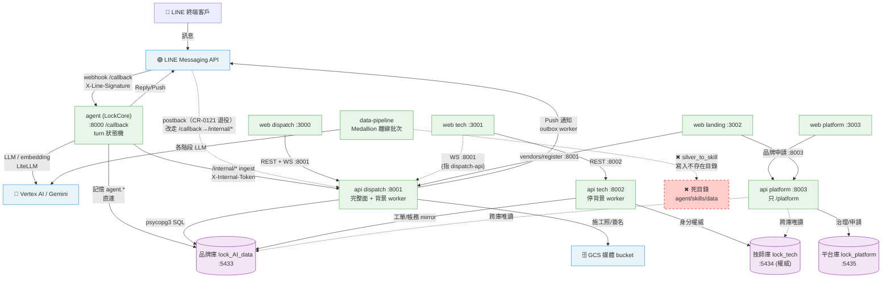

# Smart Lock 平台整合資料流 — 跨系統依賴分析

## 1. 元資訊

| 欄位 | 內容 |
|------|------|
| 文件編號 | 00_platform / P2 / 09 |
| 版本 | v1.0.0 |
| 建立日期 | 2026-07-07 |
| 維護者 | 平台架構師（多 agent 排查綜合）|
| 狀態 | 已驗證（基於現有 code / compose / migration 比對）|
| 涵蓋系統 | agent、api（dispatch/tech/platform 三面）、web（4 portal）、data-pipeline、pgvector DB（三庫）|

### 1.1 目的

以有向圖（DAG）描述 Smart Lock 平台各系統間的完整資料流，明確標注每條路徑的協議、端口、資料方向，並識別現有整合缺口與風險，供架構評審與整合改善計畫使用。

### 1.2 範圍說明

- 涵蓋 4 個內部系統的相互依賴（含 api 三面、web 四 portal 的內部塑形）
- 涵蓋外部系統（LINE、Vertex AI、GCP、OPIK）
- 標注孤立/斷鏈路徑（data-pipeline 產出鏈、OPIK 未消費）
- 標注雲端與本機拓撲的不對稱

---

## 2. 完整資料流 DAG

> 圖例：實線 = 已實作；虛線 = 部分語義/跨庫唯讀/斷鏈；紅色 = 死目標。

---

## 3. 依賴矩陣表

> 行為「來源」，列為「目標」；`→` 表發出請求/資料，`←` 表接收，`—` 表無直接依賴。

| 來源 ↓ / 目標 → | agent | api(dispatch) | api(tech) | api(platform) | 品牌庫 | 技師庫 | 平台庫 |
|---|---|---|---|---|---|---|---|
| **agent** | — | → `/internal/*`（X-Internal-Token）| — | — | → 記憶 `agent.*` | — | — |
| **api(dispatch)** | — | — | — | — | → SQL（全業務）| — | — |
| **api(tech)** | — | ← 工單/帳務 mirror | — | — | → mirror 投影 | → 身分權威 | — |
| **api(platform)** | — | → 跨庫唯讀 | → 跨庫唯讀 | — | ← 唯讀 | ← 唯讀 | → 治理/申請 |
| **web(dispatch)** | — | → REST+WS :8001 | — | — | — | — | — |
| **web(tech)** | — | → WS :8001 | → REST :8002 | — | — | — | — |
| **web(platform)** | — | — | — | → REST :8003 | — | — | — |
| **web(landing)** | — | → vendors/register | — | → 品牌申請 | — | — | — |
| **data-pipeline** | ⚠️ 手工整編（非自動）| — | — | — | — | — | — |

> 備註：
> - agent → api 為**單向**（agent 是 `/internal` 的 client）；api 從不回呼 agent。
> - `web(tech)` REST 打 :8002 但 **WS 仍打 :8001**（dispatch-api）——tech-api 未提供 WS，為已知耦合。
> - `api(platform)` 需**三連線**（平台庫 + 品牌庫唯讀 + 技師庫唯讀）以做跨域治理。
> - `TECH_POSTGRES_URI` 未設時，tech-api 靜默 fallback 回主連線（雲端目前即單庫）。

---

## 4. 關鍵資料流路徑（逐步描述）

### 路徑 1：客戶 LINE 諮詢 → AI 客服回覆 →（必要時）轉真人建工單

此為平台的核心 AI 客服端到端流程。

**步驟 1 — 進線**
- 客戶在 LINE 傳訊 → LINE 平台 `POST /callback`（agent :8000，驗 `X-Line-Signature`）。
- agent `resolve_identity` 以 LINE `userId` 為 `user_id`，session key = `tenant:user_id`。

**步驟 2 — Turn 狀態機**
- `RESTORE → COMPACT → COMMAND → BUILD → RUN → SAVE → RESPOND → DONE`。
- **BUILD**：注入該客人 `# Customer Memory` 區塊 + skill 摘要（`locksmith-product-knowledge` / `locksmith-cs-sop`）。
- **RUN**：`AgentRunner` 走 tool-loop，經 LiteLLM 呼叫 Vertex Gemini；工具白名單僅 6 項（`read_file/list_dir/find_files/grep/web_search/transfer_to_human`）。
- **SAVE**：LLM 抽取器把本輪要點寫回 `agent.*` 記憶。

**步驟 3 — 對話持久化（旁路橋接）**
- agent 經 `POST /internal/conversations/ingest`（X-Internal-Token）把對話寫入 api 品牌庫，供後台可見。

**步驟 4 — 轉真人 / 建工單（條件觸發）**
- 當客服 SOP 判定需真人介入，agent 呼叫 `transfer_to_human` → `POST /internal/escalations/ingest` → api 建 **問題卡（problem_card）**，進派工流程。
- 接管狀態經 `/internal/conversations/handover-state` 查詢（避免 AI 與真人同時回覆）。

**關鍵風險**：LLM tool-calling 不可靠（可能「口頭說已轉接」卻不呼叫工具），靠 CR-0097 deterministic 兜底補 escalation（見 `agent/P1/05` §風險）。

---

### 路徑 2：品牌派工 → 師傅接單 → 完工結算

**步驟 1 — 問題卡 → 工單**
- 品牌營運人員在 web dispatch(:3000) 檢視問題卡，建立/指派 **工單（work_order）**；REST 打 api dispatch(:8001)，寫品牌庫 `lock_AI_data`。

**步驟 2 — 通知師傅**
- api dispatch 的 `line_push_outbox_worker` 經 LINE Push 通知師傅（fail-soft + retry）。
- WS 頻道（`work-orders` / `dispatch-queue` / `pool`）即時推播派工佇列變化給前端。

**步驟 3 — 師傅作業**
- 師傅在 web tech(:3001) 接單；REST 打 tech-api(:8002)（身分驗證走技師權威庫 `lock_tech`），**WS 仍連 dispatch-api :8001**。
- 施工照/簽名寫入共享 `media` volume（本機）/ GCS bucket（雲端）；品牌後台與技師端共讀同一顆。

**步驟 4 — 結算對帳**
- 完工後 `reconciliations → settlements` 產生對帳與結算；技師身分讀技師庫、工單/帳務資料在品牌庫，靠**應用層雙寫 mirror** 維持一致（無跨庫交易）。

**關鍵風險**：跨庫一致性無交易保證；`TECH_POSTGRES_URI` 漏設會靜默漂移（見 §6 R-05）。

---

### 路徑 3：品牌申請導入（landing → platform）

**步驟 1** — 潛在品牌在 web landing(:3002) 填申請表 → REST 打 platform-api(:8003) `POST /brand-applications`，寫平台庫 `lock_platform`。
**步驟 2** — 平台管理員在 web platform(:3003) console 審核品牌申請與師傅審核（R1 骨架）。
**步驟 3** — 核准後開通品牌（一品牌一庫的 provisioning，`[待確認]` 自動化程度）。

---

### 路徑 4：產品知識產出（data-pipeline）— ⚠️ 現況斷鏈

**設計意圖**：`source_to_raw → raw_to_bronze → bronze_to_silver → silver_to_skill`，各階段走 Vertex `gemini-2.5-flash`，最終產出 agent 可載入的 skill references。
**現況問題**：`silver_to_skill` 目標 `../agent/skills/data`（`data/config.toml:57`）與 `storage/skill_drafts/` **皆不存在**；`agent/skills/` 整個目錄也不存在。管線仍是舊「26-skill ReAct」模型（架構書開宗明義寫「供 ReAct Agent 載入」），該世界已於 2026-06-04 被 LockCore superseded。
**實際知識來源**：現行 LINE agent 走 `lockcore/skills/*/references/{Brand}/{Model}.md`（6 品牌 45 檔），**獨立手工整編**，不經此管線。

---

## 5. 孤立/斷鏈系統整合建議

### 5.1 data-pipeline 產出鏈修復

- **方案 A（修復對齊）**：把 `silver_to_skill` 產出目標改為 lockcore `references/{Brand}/{Model}.md`，並更新 `data/config.toml`；管線重新成為 agent 知識的自動上游。
- **方案 B（正式退役）**：若 references 決定續走手工整編，將 `data/` 文件標 `status: superseded`，明確記載管線已退役，避免後人照 README 跑失敗。
- **建議**：先做 B（止血 + 誠實），再評估 A（恢復自動化價值）。

### 5.2 兩套知識系統收斂

- pgvector KB（`manual_chunks` / `case_entries`，768 維，HNSW cosine）服務後台 web/api 檢索；agent 走 filesystem references。
- **建議**：定義單一知識真相源（bronze），下游雙產出（references 供 agent、embedding 供 pgvector），CI 檢查兩者同源。

---

## 6. 整合風險清單

| 編號 | 類別 | 描述 | 影響範圍 | 嚴重度 | 緩解 |
|---|---|---|---|---|---|
| R-01 | 拓撲不對稱 | 本機 5-bundle 多 surface vs 雲端 3-service 單體（`API_SURFACE=all`）；tech/platform/landing 無雲端部署、技師庫雲端未接 | api、web、部署 | 高 | 對齊雲端拓撲或文件化為刻意設計；補技師庫雲端路徑 |
| R-02 | 授權 | RBAC 矩陣 shadow-mode（log-only 永不擋），80+ 敏感寫入端點僅檢租戶不檢角色 | api 全域 | 高 | 矩陣轉 enforce + 逐端點補 `role_required` |
| R-03 | 可擴展性 | WS pub-sub hub 與 11 cron worker 皆 in-memory 單機；Cloud Run 多實例 → 跨實例事件遺失、cron 重複跑（重複推播/告警）| api | 高 | Redis pub-sub + 分散式排程；暫以 min-instances=1 緩解 |
| R-04 | 知識治理 | 兩套知識系統（pgvector RAG vs filesystem references）無收斂，雙維護、易漂移 | agent、data-pipeline、api | 中 | 單一真相源 + 同步管道（見 §5.2）|
| R-05 | 跨庫一致性 | 技師權威庫 ↔ 品牌庫靠應用層雙寫 mirror，無跨庫交易；`TECH_POSTGRES_URI` 漏設靜默退回單庫 | api、DB | 中 | 雙寫協議 + 對帳 job；啟動守衛檢查 URI |
| R-06 | LINE 路由 | ~~兩個 webhook 接收端分流機制未明~~ **已決議（2026-07-07，CR-0121 方案 A + ADR-005）**：LINE 單 channel 單 webhook URL → **agent `/callback` 為唯一入站門**，postback 按前綴 fan-out（`q:*` 本地+bridge、`r:*`/`s:*`/binding → `/internal/*`）；api `/line/webhook` 退役。根因：CR-0017 §HD-5「postback 走 api」的物理分流從未成立，CR-0095 又把 quote postback 放回 agent | agent、api | ~~中~~ **已收斂**（待 code 實作，見 CR-0121 §9）| 依 CR-0121 §9 實作 |
| R-07 | LLM 可靠性 | agent tool-calling 不穩定（口頭轉接不呼叫工具）；無生產多供應商 failover（`FallbackProvider` 未接）| agent | 中 | deterministic 兜底（CR-0097）+ 接 FallbackProvider |
| R-08 | 前端安全 | JWT 存 localStorage（不驗簽）；路由 gate 只是 UX；`rolePolicy` fail-open | web | 中 | deny-by-default + cookie/middleware 保護 |
| R-09 | 記憶持久化 | agent config 仍 `backend="sqlite"` + `tempfile.mkdtemp`，容器重啟即流失（生產是否被 `POSTGRES_URI` 覆蓋待確認）| agent | 中 | 確認生產切 Postgres 後端 |
| R-10 | 部署治理 | 無 CD、部署全手動；Vertex region 混用（asia-northeast1 / us-central1 / asia-east1）；文件漂移（根 README 仍寫 ReAct/`/webhook`）| 全平台 | 低-中 | 建 CD；統一 region；修文件 |

---

## 7. 跨系統依賴原則

### 7.1 依賴反轉（DIP）

- agent → api 目前以硬編碼 URL（`LOCK_API_BASE_URL`）呼叫 `/internal/*`，屬具體實作耦合但**方向正確**（不穩定的 agent 依賴穩定的 api）。
- 建議：`/internal/*` 契約先行（OpenAPI），agent 依契約而非實作；補 consumer-driven contract test。

### 7.2 無環依賴（ADP）

- 主要依賴方向單向：`web → api → DB`、`agent → api`、`agent → DB`。**未發現服務層循環依賴**（agent 不被 api 回呼）。
- 潛在耦合：技師庫 ↔ 品牌庫雙寫 mirror 為雙向資料同步（非服務呼叫循環），需對帳而非打破。

### 7.3 穩定依賴（SDP）

| 系統 | 被依賴數 | 依賴數 | 評估 |
|---|---|---|---|
| api（dispatch 核心）| 3（web/agent/其他 api 面）| 1（DB）| 平台最穩定核心，應嚴控 API 版本（正是 v1→v2 cutover 的動機）|
| DB（品牌庫）| 3（dispatch/tech/platform 面 + agent）| 0 | 最穩定，schema 變更影響面最大 |
| agent | 0（無人依賴它）| 3（api / DB / Vertex）| 合理：邊緣系統可自由變化 |
| web | 0 | 1（api）| 最不穩定（變化最頻繁），符合「前端不被依賴」原則 |
| data-pipeline | 0（產出鏈斷）| 1（Vertex）| 假穩定：孤立非真穩定，應修復或退役 |

### 7.4 整合健康建議

1. **契約測試**：agent↔api `/internal/*`、web↔api REST/WS 皆補 contract test（現已有 Prism mock-smoke + api-types-sync workflow，可延伸）。
2. **依賴圖 CI**：已有 `reverse-import-lint` / `db-conn-lint`，可加跨系統依賴斷言。
3. **整合 SLI**：監控 LINE push 成功率、WS 連線數、Vertex 延遲 P99、跨庫 mirror lag。
4. **Chaos 演練**：模擬 Vertex / Cloud SQL 故障，驗證 agent fail-soft 與 api fail-open 行為是否符合設計。

---

*文件結束 — 00_platform / P2 / 09_integration_data_flow.md*
*最後更新：2026-07-07 | 版本：v1.0.0*
