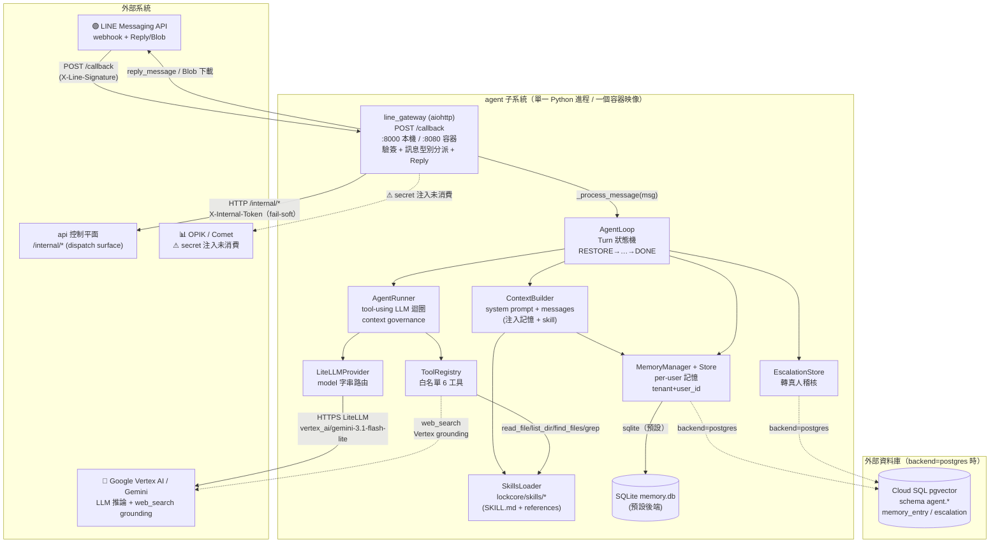
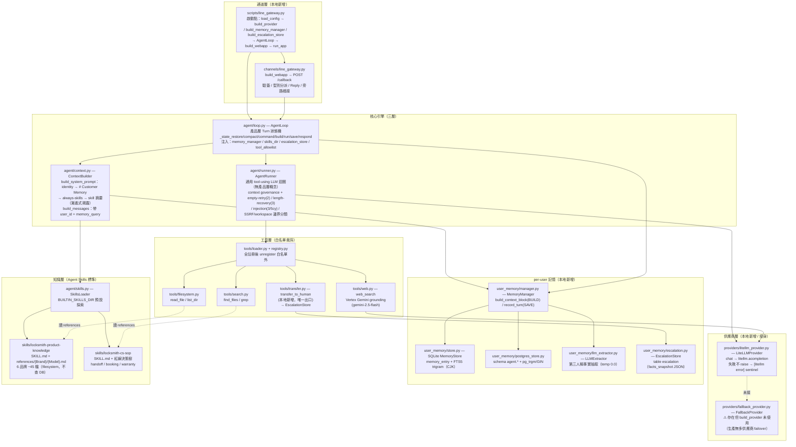
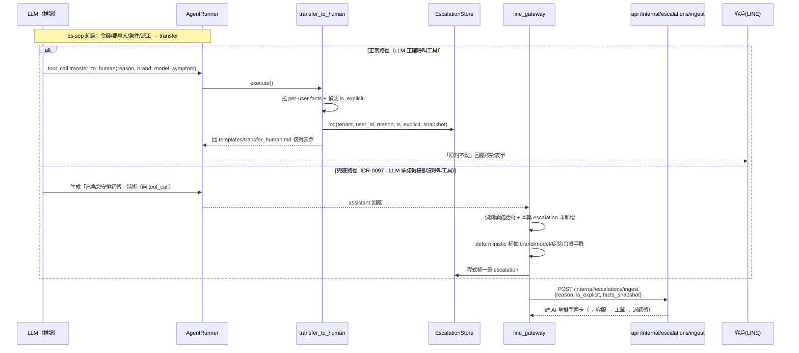
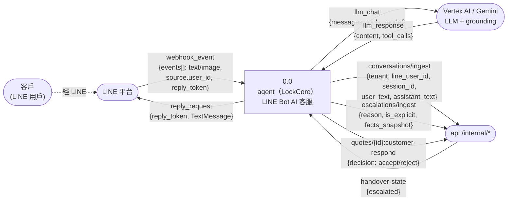
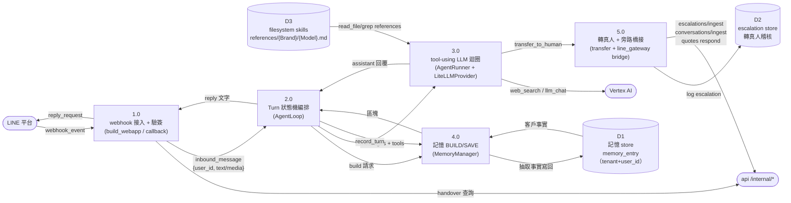
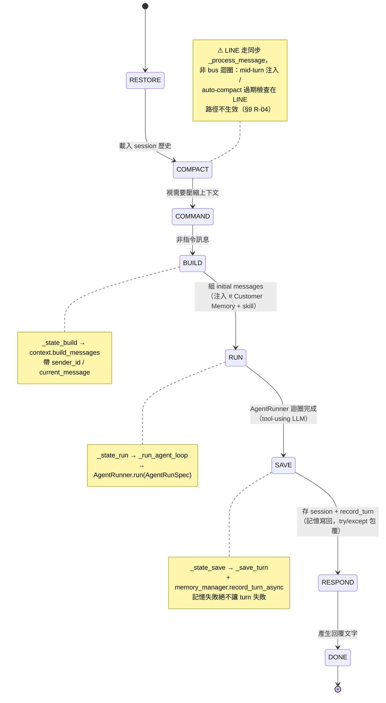
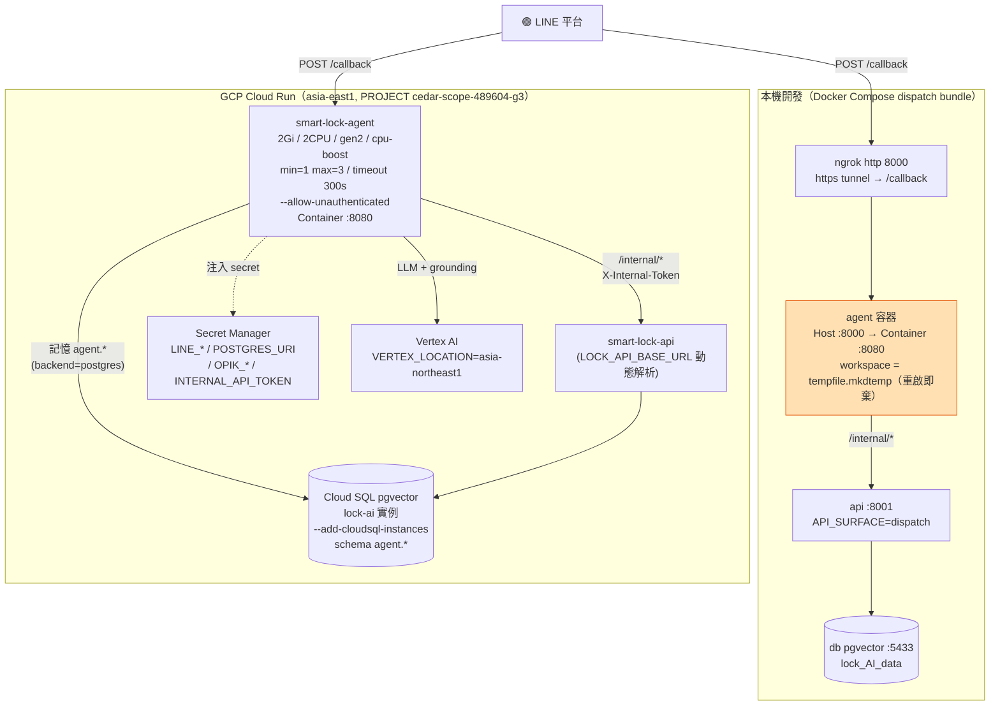

# 架構與設計文件 — agent 子系統（LockCore LINE Bot AI 客服）

**版本** v1.0 | **日期** 2026-07-07 | **狀態** 草稿（現況 as-is baseline）

---

## 目錄

1. [文件元資訊](#1-文件元資訊)
2. [Solution Landscape（Level 0 — 能力域地圖）](#solution-landscapelevel-0--能力域地圖)
3. [C4 Container 清單表](#2-c4-container-清單表)
4. [C4 L2 Container Diagram](#3-c4-l2-container-diagram)
5. [C4 L3 Component Diagram（LockCore 內部結構）](#4-c4-l3-component-diagramlockcore-內部結構)
6. [DDD 設計](#5-ddd-設計)
7. [技術選型表](#6-技術選型表)
8. [關鍵使用流程](#7-關鍵使用流程)
9. [部署視圖](#8-部署視圖)
10. [非功能性需求（NFR：目標 + 策略）](#非功能性需求nfr目標--策略)
11. [風險登記表](#9-風險登記表)
12. [演進路線](#10-演進路線)

> **註**：第 2～10 節編號沿用 acme 模板慣例（C4 Container 清單表～演進路線），「Solution Landscape」「非功能性需求」為跨章插入補充節，以標題錨點引用。

---

## 1. 文件元資訊

| 欄位 | 內容 |
|------|------|
| 子系統識別碼 | agent（LockCore LINE Bot AI 客服）|
| 文件類型 | P1 架構與設計（Architecture & Design）|
| C4 範圍 | L2 Container + L3 Component（LockCore 內部）|
| 撰寫日期 | 2026-07-07 |
| 版本 | v1.0 草稿（現況 baseline）|
| 負責架構師 | — |
| 審閱狀態 | 待審 |
| 佐證來源 | `agent/lockcore/`、`agent/scripts/line_gateway.py`、`agent/config.toml`、`agent/.env.example`、`agent/Dockerfile`、`scripts/deploy/agent.sh`、`agent/lockcore/VENDOR.md` 實際 code |

> **與平台文件的關係**：L1 System Context 統一由 `smartlock-docs/00_platform/P1/05_platform_architecture_L1.md` 管理；本文件從 L2 Container 開始描述 agent 子系統。所有整合關係、Port、外部相依均與 L1 對齊。
>
> **⚠️ 文件漂移警告**：根目錄舊 `README.md` / 部分 deploy 文件仍描述 LangGraph / ReAct / `app.py` / webhook `/webhook` —— 這些是 **2026-06-04 已被 LockCore 重寫 superseded 的舊架構**（見專案 CLAUDE.md「Architecture Lock」與 ADR-0107）。**本文件一律以 code 為準**：agent 進入點為 `POST /callback`、核心為 `agent/lockcore/`、LLM 走 LiteLLM。
>
> **誠實聲明**：本文件為「現況（as-is）」而非「理想架構」。已知缺口與技術債（health check 對不上、記憶流失風險、debounce 未接 live、無多供應商 failover 等）如實記錄於 §9 風險登記表與 P3 安全清單，不美化。

---

## Solution Landscape（Level 0 — 能力域地圖）

> **C4 之前的一層**：先用一張「能力域」總覽對齊業務與管理層，再 zoom 進 C4 L2。
> 受眾：業務 + 管理層。這層回答「agent 涵蓋哪些能力域」，**不**回答 runtime / protocol（那是 §3 L2 與 §4 L3）。

```mermaid
block-beta
  columns 1

  block:solution["Solution Boundary（agent 子系統邊界 = LockCore）"]:1
    block:channelRow["通道層（Channel）"]:1
      line["LINE Messaging API 接入\nPOST /callback（aiohttp）\n驗 X-Line-Signature\n文字 / 照片 / 其他型別"]
    end
    block:coreRow["核心能力域（LockCore Engine）"]:1
      cap1["對話編排\nTurn 狀態機\nRESTORE→…→DONE\n(AgentLoop)"] cap2["Tool-using LLM 迴圈\ncontext governance\n(AgentRunner)"] cap3["知識與 SOP\nAgent Skills 標準\n(product-knowledge / cs-sop)"] cap4["per-user 記憶\nBUILD 注入 / SAVE 寫回\ntenant+user_id 隔離"]
    end
    block:exitRow["出口與供應商"]:1
      cap5["單一進線工具\ntransfer_to_human\n→ 派工/工單後台"] cap6["LiteLLM 供應商\nmodel 字串路由\n(vertex_ai/gemini…)"]
    end
    block:dataRow["資料與整合"]:1
      db[("記憶/稽核\nSQLite（預設）\n或 Postgres agent.*")] bridge["API 旁路橋接\n/internal/* 4 端點\nX-Internal-Token"]
    end
  end

  block:external["External Systems（外部系統）"]:1
    ext1["LINE 平台\n(webhook + Reply/Blob)"] ext2["Google Vertex AI / Gemini\n(LLM 推論 + web_search grounding)"] ext3["api 控制平面\n/internal/*（對話/接管/escalation/報價）"] ext4["OPIK / Comet\n(⚠ secret 注入未消費)"]
  end
```



### Level 0 能力域說明（必填）

| 能力域 / 分群 | 說明 | 對應 C4 Container（§2）| 對應 DDD 上下文（§5.2）|
| :--- | :--- | :--- | :--- |
| 通道層 Channel | LINE webhook 接入、簽章驗證、訊息型別分派、Reply/Blob | `line_gateway`（aiohttp app）| CustomerSupportContext（上游邊界）|
| 對話編排 | Turn 狀態機（8 態）、mid-turn 注入、auto-compact | `AgentLoop`（`lockcore/agent/loop.py`）| CustomerSupportContext |
| Tool-using LLM 迴圈 | 有界 iteration、context governance、工具執行 | `AgentRunner`（`lockcore/agent/runner.py`）| CustomerSupportContext |
| 知識與 SOP | 事實層 product-knowledge + 行為層 cs-sop（filesystem references）| `SkillsLoader` + `lockcore/skills/`| KnowledgeContext（filesystem 分支）|
| per-user 記憶 | BUILD 注入客戶記憶 / SAVE 寫回、tenant+user_id 隔離 | `MemoryManager`（`lockcore/agent/user_memory/`）| CustomerSupportContext |
| 出口工具 | transfer_to_human 唯一把案子送進後台 | `TransferToHumanTool` + EscalationStore | CustomerSupportContext → DispatchOperationsContext |
| LLM 供應商 | LiteLLM 單一 adapter，model 字串路由多家 | `LiteLLMProvider` | 上游依賴（Vertex AI）|
| 資料與整合 | 記憶/稽核持久化、API 旁路橋接 | 記憶 DB + `/internal/*` bridge | 與 api 為 Customer-Supplier |

**Level 0 檢查清單**：
- [x] 只呈現能力域，無 runtime protocol 細節（protocol 在 §3 L2）
- [x] 能力域與 §2 Container 清單、§5.2 DDD 上下文可雙向對照
- [x] 外部系統與平台 L1 一致（LINE `/callback`、Vertex LLM、api `/internal/*`、OPIK 未消費）
- [x] 圖塊用業務語言命名（非 Python class 名）

---

## 2. C4 Container 清單表

> **重要**：agent 子系統在**執行期是單一 Python 進程**（`scripts/line_gateway.py`），下表的「Container」是 C4 語義的**邏輯部署單元 / 進程內主要組件**，非各自獨立的 OS 進程或容器。整個子系統只打包成一個容器映像（`agent/Dockerfile`）。

| # | Container / 組件 | 類型 | 技術棧 | Port | 狀態 |
|---|---|---|---|---|---|
| 1 | line_gateway（LINE 通道 + webapp）| Process 進入點 | Python 3.11 / aiohttp / line-bot-sdk v3 | 8000（本機）/ 8080（容器）| 現行 |
| 2 | AgentLoop（Turn 狀態機引擎）| 進程內組件 | LockCore（fork nanobot）| — | 現行 |
| 3 | AgentRunner（tool-using LLM 迴圈）| 進程內組件 | LockCore | — | 現行 |
| 4 | LiteLLMProvider（LLM 供應商層）| 進程內組件 | litellm ≥ 1.70 | — | 現行 |
| 5 | MemoryManager + Store（per-user 記憶）| 進程內組件 + 儲存 | SQLite FTS5（預設）/ Postgres pg_trgm | — | 現行 |
| 6 | EscalationStore（轉真人稽核）| 進程內組件 + 儲存 | 同記憶後端 | — | 現行 |
| 7 | SkillsLoader + 2 builtin skills | 進程內組件 + filesystem | Agent Skills 標準（SKILL.md + references）| — | 現行 |
| 8 | 記憶 DB（Postgres）| Database（外部）| Cloud SQL pgvector，schema `agent.*` | 5432 | 現行（backend=postgres 時）|

---

## 3. C4 L2 Container Diagram



**圖例**：實線＝code 驗證的整合；虛線＝條件式 / 未接線 / 宣告未啟用。Port 標於進入點（host 8000 / 容器 8080）。

---

## 4. C4 L3 Component Diagram（LockCore 內部結構）

LockCore 是 fork 自 `HKUDS/nanobot`（commit `ac8bef76`，MIT）的最小核心，只複製 `AgentLoop` 的遞移 import closure（~77 模組），本地新增記憶層、兩個 skill、LiteLLM provider、LINE 通道（見 `lockcore/VENDOR.md`）。以下依「三層引擎 + 供應商 + 工具 + 記憶 + 知識」描述內部組件。



**組件職責摘要**

| 組件 | 檔案 | 職責 | 關鍵不變量 / 註記 |
|---|---|---|---|
| AgentLoop | `agent/loop.py` | 產品層 Turn 狀態機；LINE 走 `_process_message` 直呼（非 bus 迴圈）| ⚠ mid-turn 注入 / auto-compact 依賴 bus，LINE 路徑未啟 `loop.run()` |
| AgentRunner | `agent/runner.py` | 通用 tool-using 迴圈，不含產品概念；LLM 逾時 `NANOBOT_LLM_TIMEOUT_S` 預設 300s | context governance 每輪執行 |
| ContextBuilder | `agent/context.py` | 組 system prompt（記憶區塊 + skill 漸進式揭露）| Runtime context 標 `[Runtime Context]`，SAVE 時剝除 |
| LiteLLMProvider | `providers/litellm_provider.py` | 單一 adapter，model 字串路由多家 | 失敗回 sentinel 不 raise，由 LINE 層轉友善話術 |
| MemoryManager | `user_memory/manager.py` | BUILD 注入 `<memory>` / SAVE `record_turn` | 讀寫必帶 tenant+user_id，否則 raise（default deny）|
| TransferToHumanTool | `agent/tools/transfer.py` | 唯一把案子送進後台的工具 | SOP 規定回傳訊息「原封不動」回覆客戶 |
| SkillsLoader | `agent/skills.py` | 預設探索 `lockcore/skills/` builtin skill | 兩 skill 純核心 frontmatter，可攜 |

---

## 5. DDD 設計

### 5.1 通用語言詞彙表（Ubiquitous Language）

| 術語 | 中文說明 | 備註 |
|------|---------|------|
| **LockCore（鎖芯）** | agent 核心引擎，fork 自 nanobot | `agent/lockcore/`；取代已刪的 LangGraph ReAct |
| **Turn（一輪對話）** | 一則客戶訊息 → 一個完整回覆的處理單元 | 由 8 態狀態機驅動；一個 webhook = 一個 turn |
| **Turn 狀態機（TurnState）** | RESTORE→COMPACT→COMMAND→BUILD→RUN→SAVE→RESPOND→DONE | `loop.py`，事件驅動，每態一 handler |
| **BUILD** | 組 initial messages，注入該客戶記憶 + skill | `_state_build` → `context.build_messages` |
| **SAVE** | 存 session 並把該輪對話寫回 per-user 記憶 | `_state_save`；記憶寫入以 try/except 包覆，絕不讓 turn 失敗 |
| **Agent Skills 標準** | 知識與 SOP 的可攜格式（SKILL.md + references/）| 複製到 Claude Code / Cursor / nanobot 直接可用 |
| **product-knowledge skill** | 事實層：品牌/型號產品知識 | filesystem references，明寫「no database needed」 |
| **cs-sop skill** | 行為層：意圖分類 + 紅線決策樹 | 領域外婉拒 / 金錢→transfer / 派工→transfer |
| **transfer_to_human** | 唯一把案子送進後台的工具 | 「只說不呼叫 = 案子蒸發」；SOP 鐵律 |
| **escalation（轉真人稽核紀錄）** | transfer 觸發的稽核紀錄 | table `escalation`，含 facts_snapshot JSON |
| **is_explicit** | 客戶是否「明確」要求真人 / 提金錢字眼 | 偵測邏輯 `transfer.py`；影響後台優先序 |
| **per-user 記憶** | 以 tenant+user_id 隔離的客戶事實記憶 | kind 白名單 profile/preference/fact/issue/dispatch |
| **LiteLLM model 字串** | 供應商路由前綴 | `vertex_ai/` / `gemini/` / `ollama_chat/` / `claude-*` / `gpt-4o` |
| **CS_TOOL_ALLOWLIST** | 客服工具白名單（6 項）| `read_file/list_dir/find_files/grep/web_search/transfer_to_human` |
| **X-Internal-Token** | agent → api `/internal/*` 服務間認證 | fail-soft（agent 側）/ fail-closed（api 側）|
| **兜底補 escalation（CR-0097）** | AI 承諾轉接卻沒呼叫工具時程式補一筆 | 因 LLM tool-calling 不可靠 |
| **bronze-only sourcing** | references 內容嚴格源自 `data/storage/bronze/` | PDF（GDrive）不可信，只引 URL 不抄內容 |

### 5.2 限界上下文定位（Bounded Context）

agent 子系統整體實作 **CustomerSupportContext**（客服上下文），在平台 DDD 戰略圖中同時扮演**上游**（承接客戶訊息、生成回覆）與**下游**（透過 `/internal/*` 把案子送進派工後台，為 api 的 Customer 角色）。

```
┌─────────────────────────────────────────────────────────────┐
│              CustomerSupportContext（agent / LockCore）        │
│                                                               │
│  ┌────────────────────┐   ┌──────────────────────────────┐   │
│  │  對話編排子域         │   │  知識與 SOP 子域              │   │
│  │  Conversation Orch. │   │  Knowledge & SOP             │   │
│  │                     │   │                              │   │
│  │  - Turn 狀態機       │   │  - product-knowledge         │   │
│  │  - AgentLoop        │   │  - cs-sop（紅線決策樹）       │   │
│  │  - AgentRunner      │   │  - filesystem references     │   │
│  │  - context governance│   │    （bronze-only，不查 DB）  │   │
│  └─────────┬──────────┘   └──────────────────────────────┘   │
│            │                                                  │
│  ┌─────────▼──────────┐   ┌──────────────────────────────┐   │
│  │  記憶與稽核子域       │   │  出口與供應商子域             │   │
│  │  Memory & Audit     │   │  Exit & Provider             │   │
│  │                     │   │                              │   │
│  │  - per-user 記憶     │   │  - transfer_to_human（唯一） │   │
│  │  - tenant+user_id   │   │  - LiteLLMProvider（多家）    │   │
│  │  - EscalationStore  │   │  - web_search grounding      │   │
│  └─────────────────────┘   └──────────────────────────────┘   │
└─────────────────────────────────────────────────────────────┘

上游依賴：LINE 平台（訊息來源）、Vertex AI / Gemini（LLM 推論 + grounding）
下游提供：api /internal/*（對話持久化 / escalation / 報價回覆）→ DispatchOperationsContext
關係模式：對 api 為 Customer-Supplier（CS），agent 為 /internal 客戶（X-Internal-Token）
知識來源：KnowledgeContext 的 filesystem 分支（references，與 pgvector RAG 為兩套並存無收斂系統，見平台 L1 §3）
```

> **KnowledgeContext 分工註記**（2026-07-07 由 **ADR-004** 重定義）：原記「兩套並存無收斂」為範疇錯誤。正確分工：**Skill = 行為驅動 + 精選層**（references 只留 SKILL.md + `_common` + `_brand` + domain-safety + 檢索程序）；**pgvector = 唯一完整事實語料**，長尾逐型號事實由 agent 經 **RAG-via-MCP** 語義查詢。兩者從屬非競品。⚠️ 語義 RAG 層當前為 greenfield（pgvector 僅 keyword stub、無 `embed()`），依 ADR-004 分階段建。**cutover 前 filesystem references 保留為 fallback。** 詳見 `agent/P2/04_adr/ADR-004`。

---

## 6. 技術選型表

| 類別 | 選用技術 | 版本 | 選型理由 |
|------|---------|------|---------|
| Agent 核心 | LockCore（fork HKUDS/nanobot）| commit `ac8bef76` / MIT | 捨棄自製 ReAct，取上游最小 tool-using 迴圈 + Turn 狀態機；可攜 Agent Skills 標準。詳見 ADR-001 |
| LLM 供應商層 | LiteLLM | ≥ 1.70 | 單一 adapter 以 model 字串路由多家（Vertex / Gemini / Ollama / Claude / OpenAI…），移除各家 SDK 直依賴。詳見 ADR-002 |
| 預設推論模型 | Vertex AI `gemini-3.1-flash-lite` | — | 成本 / 延遲平衡；temperature 0.7 / max_tokens 4096（`config.toml`）|
| 知識 / SOP 格式 | Agent Skills 標準（SKILL.md + references）| product v1.0.0 / sop v1.3.0 | 純核心 frontmatter、可攜、filesystem 讀取免 DB。詳見 ADR-003 |
| Web 框架（通道）| aiohttp | ≥ 3.9 | LINE webhook 伺服器；line-bot-sdk v3 async 生態 |
| LINE SDK | line-bot-sdk | v3 | WebhookParser / AsyncMessagingApi / Blob API |
| per-user 記憶（預設）| SQLite + FTS5 trigram | stdlib | 本地零依賴；FTS5 trigram 支援中文子字串檢索 |
| per-user 記憶（生產）| PostgreSQL + pg_trgm/GIN | psycopg 3 | 與 api 共用 Cloud SQL，schema `agent.*` 隔離；持久化 |
| 記憶事實抽取 | LLMExtractor（同主 provider）| — | 抽乾淨第三人稱事實、過濾閒聊（temp 0.0）|
| web_search grounding | Vertex Gemini grounding（Google Search）| `gemini-2.5-flash` | 兜底外部知識；有政策約束（見 P3 安全）|
| 設定載入 | tomllib（stdlib）| Python 3.11+ | 非機密走 `config.toml`；機密走 `.env` / Secret Manager 不入 toml |
| 套件 build | hatchling + uv workspace | — | 套件名 `lockcore`；optional extras `dev/vertex/line/eval/postgres` |
| 容器化 | Docker（multi-stage uv build）| — | build context = 專案根；`CMD python scripts/line_gateway.py` |
| 觀測性 | OPIK / Comet | — | ⚠ deploy 注入 secret 但 agent code 未消費（見 §9 R-08）|

---

## 7. 關鍵使用流程

### 7.1 LINE 訊息 → Turn → 回覆（主客服流程）

```mermaid
sequenceDiagram
    participant C as 客戶<br/>(LINE)
    participant L as LINE 平台
    participant GW as line_gateway<br/>:8000/:8080
    participant API as api /internal/*<br/>(旁路)
    participant LOOP as AgentLoop<br/>(Turn 狀態機)
    participant CTX as ContextBuilder
    participant MEM as MemoryManager
    participant RUN as AgentRunner
    participant PROV as LiteLLMProvider
    participant VX as Vertex AI

    C->>L: 傳訊息（文字/照片）
    L->>GW: POST /callback（X-Line-Signature）
    GW->>GW: 驗簽（失敗回 400）
    GW->>API: GET /internal/conversations/handover-state<br/>(阻塞, timeout 5s, fail-soft)
    alt 人工接管中（escalated=true）
        API-->>GW: {escalated: true}
        GW->>L: （AI 暫停，不回覆）
    else 正常
        API-->>GW: {escalated: false}
        GW->>LOOP: _process_message(msg, session_key)
        LOOP->>CTX: BUILD：build_messages(sender_id, current_message)
        CTX->>MEM: build_context_block(tenant, user_id, query)
        MEM-->>CTX: <memory>客戶事實</memory>
        CTX-->>LOOP: system prompt + messages（含 skill 摘要）
        LOOP->>RUN: RUN：run(AgentRunSpec)
        loop 有界 iteration（context governance 每輪）
            RUN->>PROV: chat(messages, tools)
            PROV->>VX: litellm.acompletion
            VX-->>PROV: 回覆 / tool_calls
            alt should_execute_tools
                RUN->>RUN: 執行工具（read_file/grep/web_search/transfer_to_human）
            end
        end
        RUN-->>LOOP: assistant 回覆
        LOOP->>MEM: SAVE：record_turn（try/except 包覆）
        LOOP-->>GW: 回覆文字
        GW->>API: POST /internal/conversations/ingest<br/>(fire-and-forget, timeout 20s)
        GW->>GW: sentinel/空回覆 → 友善話術；>4900 字截斷
        GW->>L: reply_message(reply_token)
        L->>C: AI 回覆
    end
```

**流程要點**：
- **同步 request/response**：`_process_message` 直呼，一個 webhook = 一個完整 turn；未跑 `loop.run()` bus 迴圈（§9 R-04）。
- **錯誤外洩防線**：LLM 回 `[litellm error]` sentinel 或空回覆 → 改 `_FALLBACK_REPLY`；單則上限 4900 字截斷。
- **旁路 fail-soft**：對話持久化與接管查詢失敗只 log，絕不阻斷客人回覆。

### 7.2 Escalation 轉真人流程（含 CR-0097 兜底）



### 7.3 資料流視圖（DFD）

#### DFD L0 — Context Diagram（agent 黑盒）



#### DFD L1 — 功能分解（主要 Process 與 Data Store）



#### DFD 與 Container 對應表

| DFD Process | 主要組件（§2）| 關鍵模組 |
|---|---|---|
| 1.0 webhook 接入 + 驗簽 | line_gateway | `channels/line_gateway.py:build_webapp` |
| 2.0 Turn 狀態機編排 | AgentLoop | `agent/loop.py` |
| 3.0 tool-using LLM 迴圈 | AgentRunner + LiteLLMProvider | `agent/runner.py`、`providers/litellm_provider.py` |
| 4.0 記憶 BUILD/SAVE | MemoryManager + Store | `agent/user_memory/manager.py`、`store.py`、`postgres_store.py` |
| 5.0 轉真人 + 旁路橋接 | TransferToHumanTool + line_gateway | `agent/tools/transfer.py`、`channels/line_gateway.py` |
| D1 記憶 store | 記憶 DB | SQLite `memory.db`（預設）/ Postgres `agent.memory_entry` |
| D2 escalation store | 稽核 store | SQLite / Postgres `agent.escalation` |
| D3 filesystem skills | SkillsLoader | `lockcore/skills/locksmith-*/references/` |

### 7.4 Turn 狀態機（State Diagram）

Turn 狀態機是 agent 產品層的核心。以下為 `loop.py` 的 `TurnState` 轉移。



> system channel 訊息走另一路 `_process_system_message`（`loop.py`），非上述客戶 turn 路徑。

---

## 8. 部署視圖



**部署要點與缺口**：
- **Port 不對稱**：本機 gateway 預設 8000；容器 / Cloud Run 8080（`Dockerfile ENV PORT=8080`）。compose `agent` 服務 map `${AGENT_PORT:-8000}:8080`。
- **⚠ health check 對不上（R-01, HIGH）**：`scripts/deploy/agent.sh` 打 `${url}/health`，但 agent code **無 `/health` 路由**（`build_webapp` 只註冊 `POST /callback`）→ deploy 腳本 health gate 誤報 FAILED。Cloud Run 本身用 TCP startup probe，容器仍可能上線。
- **⚠ 記憶流失風險（R-05, MED）**：`config.toml` commit 值為 `backend="sqlite" db_path="memory.db"`，且 LINE gateway workspace 用 `tempfile.mkdtemp`（重啟即棄）；Cloud Run 實例重啟 / SQLite 無持久 volume → 記憶流失。deploy 有注入 `POSTGRES_URI`，但生產是否覆蓋 config 改 postgres `[待確認]`。
- **品牌參數化**：`BRAND=<name>` 載 `scripts/deploy/brands/<name>.env`，一品牌一 GCP 專案。
- **無 CD**：部署全手動走 `scripts/deploy/agent.sh`。

---

## 非功能性需求（NFR：目標 + 策略）

> 每個品質屬性拆成**目標（Targets，含 ID）**與**策略（Strategies）**。未實作者標明「目標狀態」。

### 可用性 Availability

| ID | 指標 | 目標 |
| :--- | :--- | :--- |
| NFR-AVAIL-01 | LINE 回覆成功率 | 客人每則訊息都有回覆（含錯誤時的友善話術）|
| NFR-AVAIL-02 | 冷啟動容忍 | Cloud Run min=1 降低冷啟；旁路 handover 查詢短逾時 fail-soft |

**策略**：錯誤外洩防線（sentinel/空回覆 → `_FALLBACK_REPLY`）；旁路整合全 fail-soft（持久化 20s fire-and-forget、接管查詢 5s 阻塞但失敗照回）；min-instances=1。**缺口**：無多供應商 failover（`FallbackProvider` 未接，R-03）；主模型 Vertex 掛掉直接回 sentinel 轉友善話術。

### 可靠性 Reliability

| ID | 指標 | 目標 |
| :--- | :--- | :--- |
| NFR-REL-01 | 案子不蒸發 | 需轉真人的案子 100% 進後台（問題卡）|
| NFR-REL-02 | 記憶隔離 | 跨 user / 跨 tenant 記憶零洩漏 |

**策略**：`transfer_to_human` 為唯一出口 + CR-0097 兜底補 escalation（偵測承諾話術卻沒呼叫工具）；記憶讀寫必帶 tenant+user_id 否則 raise（default deny）。**缺口**：LLM tool-calling 不可靠（R-06）靠 deterministic 兜底，兜底品牌/型號/症狀為盡力而為草擬值需可更正。

### 效能 Performance

| ID | 指標 | 目標 |
| :--- | :--- | :--- |
| NFR-PERF-01 | 首次回覆延遲 | 撐過 Cloud Run 冷啟（handover 查詢短逾時、持久化移到回覆後）|
| NFR-PERF-02 | LLM 逾時上限 | `NANOBOT_LLM_TIMEOUT_S` 預設 300s |

**策略**：AgentRunner 有界 iteration（empty-retry 2 / length-recovery 3）；context governance 每輪壓縮（microcompact / tool-result budget / snip history）。**缺口**：進線 debounce（1.5s 合併）/ dedup（24h）純邏輯已備但未接 live（R-02）→ 連發訊息不合併、重送不 dedup。

### 安全性 Security

| ID | 指標 | 目標 | 現況 |
| :--- | :--- | :--- | :--- |
| NFR-SEC-01 | webhook 驗簽 | 驗 X-Line-Signature，失敗 400 | ✅ 已實施 |
| NFR-SEC-02 | 工具沙箱邊界 | 客服只開 6 唯讀/搜尋/轉接工具 | ✅ CS_TOOL_ALLOWLIST |
| NFR-SEC-03 | 服務間認證 | agent→api X-Internal-Token | ✅ agent fail-soft / api fail-closed |
| NFR-SEC-04 | 記憶 PII 隔離 | tenant+user_id default deny | ✅ 已實施 |

**策略**：詳見 P3/13 安全清單。**重要缺口**：記憶預設 SQLite tempfile 有流失風險（R-05）；OPIK secret 注入未消費（R-08）；tenant 硬編單店（R-07）。

### 可維護性 Maintainability

| ID | 指標 | 目標 |
| :--- | :--- | :--- |
| NFR-MAINT-01 | 知識可攜性 | skill 用純核心 frontmatter，複製即可用 |
| NFR-MAINT-02 | 測試覆蓋 | 關鍵治理 / 隔離 / 白名單有測試守 |

**策略**：Agent Skills 標準（不綁框架欄位）；21 個 pytest（含 e2e mock turn / 記憶隔離 / 白名單 / 紅線 / 治理 gate）。**缺口**：上游 nanobot bug fix 需手動 cherry-pick（fork 維護成本，見 VENDOR.md）。

---

## 9. 風險登記表

| # | 風險描述 | 嚴重性 | 發生可能性 | 影響範圍 | 緩解策略 |
|---|---------|--------|-----------|---------|---------|
| R-01 | **deploy health check 對不上端點** — `scripts/deploy/agent.sh` 打 `${url}/health`，但 agent code 無 `/health` 路由（只有 `POST /callback`）→ deploy 腳本 curl 拿 404、retry 後報 FAILED | 高 | 高（每次 deploy）| 部署腳本誤報失敗；運維誤判 | 新增 `GET /health` 輕量路由回 200，或把 deploy health gate 改打 `POST /callback` 期望 400/簽章錯 |
| R-02 | **進線 debounce/dedup 未接 live** — `InboundDebouncer`（1.5s 合併）/ `EventDeduplicator`（24h dedup）已實作 + 有測試，但 `build_webapp` callback 未引用 | 中 | 中 | 連發訊息不合併（多次 turn）、重送不 dedup | 在 callback 接入 debounce/dedup，或文件標記為刻意延後 |
| R-03 | **無多供應商 failover（生產）** — `FallbackProvider` 存在但 `build_provider` 只回裸 `LiteLLMProvider`；主模型 Vertex 掛 → 直接回 sentinel | 中 | 中 | 供應商中斷時全客服降級為友善話術 | `build_provider` 改建 `FallbackProvider` + fallback presets |
| R-04 | **LINE 走同步未啟 bus 迴圈** — `_process_message` 直呼未跑 `loop.run()`；mid-turn 注入 / auto-compact 過期檢查不生效 | 中 | 中（已知設計）| 長對話上下文治理部分失效 | 評估 LINE 路徑接 bus，或文件確立「單 webhook = 單 turn」為刻意設計 |
| R-05 | **記憶預設 SQLite + 容器臨時 workspace** — `config.toml` commit 值 sqlite + `memory.db`，workspace `tempfile.mkdtemp`（重啟即棄）；Cloud Run 重啟無持久 volume | 中 | 高（若未覆蓋 config）| per-user 記憶流失 | 生產切 `backend="postgres"`（deploy 已注入 POSTGRES_URI）；確認 config 覆蓋機制 `[待確認]` |
| R-06 | **LLM tool-calling 不可靠** — 會生成「已轉接」話術卻不呼叫 `transfer_to_human` | 低 | 高 | 案子可能蒸發 | CR-0097 deterministic 兜底補 escalation（已實施）；兜底草擬值需客服可更正 |
| R-07 | **tenant 硬編單店** — `resolve_identity` 固定回傳傳入 tenant，未依官方帳號反推多租戶 | 低 | 低（單店現況）| 多租戶擴展受阻 | 實作「依收到訊息的官方帳號」反推 tenant |
| R-08 | **OPIK secret 注入但未消費** — deploy 注入 `OPIK_API_KEY`/`OPIK_WORKSPACE`，但 agent Python 無任何 `opik` 引用 | 低 | —（已證實）| 觀測性未落地；secret 空掛 | 接入 OPIK 觀測，或移除未使用 secret |

---

## 10. 演進路線

### Phase 1 — 現況穩定（正確性）

**目標**：修補最高風險缺口（health check、記憶持久化、failover）。

| 任務 | 對應風險 | 交付物 |
|------|---------|--------|
| 新增 `/health` 路由或修正 deploy health gate | R-01 | 部署 health check 通過 |
| 生產確認 `backend="postgres"` 覆蓋 + 持久化驗證 | R-05 | 記憶跨重啟不流失 |
| `build_provider` 接 `FallbackProvider` | R-03 | 主供應商中斷有自動 fallback |

**驗收**：deploy 不再誤報 FAILED；重啟後客戶記憶仍在；Vertex 模擬中斷有 fallback。

### Phase 2 — 韌性與體驗

| 任務 | 對應風險 | 交付物 |
|------|---------|--------|
| callback 接入 debounce/dedup | R-02 | 連發合併、重送去重 |
| 評估 LINE 路徑接 bus（mid-turn 注入 / auto-compact）| R-04 | 長對話上下文治理生效 |
| 接入 OPIK 觀測性 | R-08 | LLM turn 可觀測 |

### Phase 3 — 多租戶與知識收斂

| 任務 | 對應 | 交付物 |
|------|------|--------|
| 多租戶 `resolve_identity`（依官方帳號反推）| R-07 | 一 agent 服務多品牌 |
| 知識真相源收斂（references ↔ pgvector）| 平台 G-05 | 單一知識來源或同步管道 |
| 上游 nanobot 同步策略文件化（cherry-pick 流程）| VENDOR | fork 維護 runbook |

---

*文件結尾 — agent 子系統架構與設計 v1.0 / 2026-07-07*
