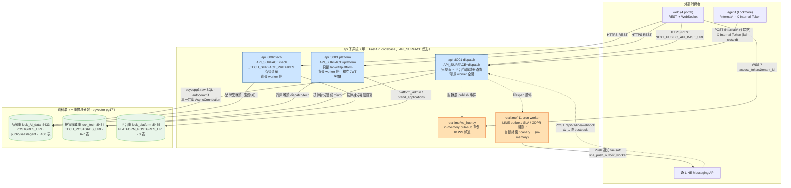
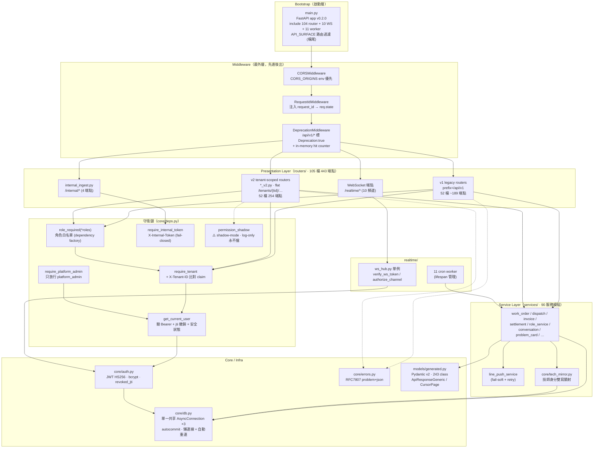
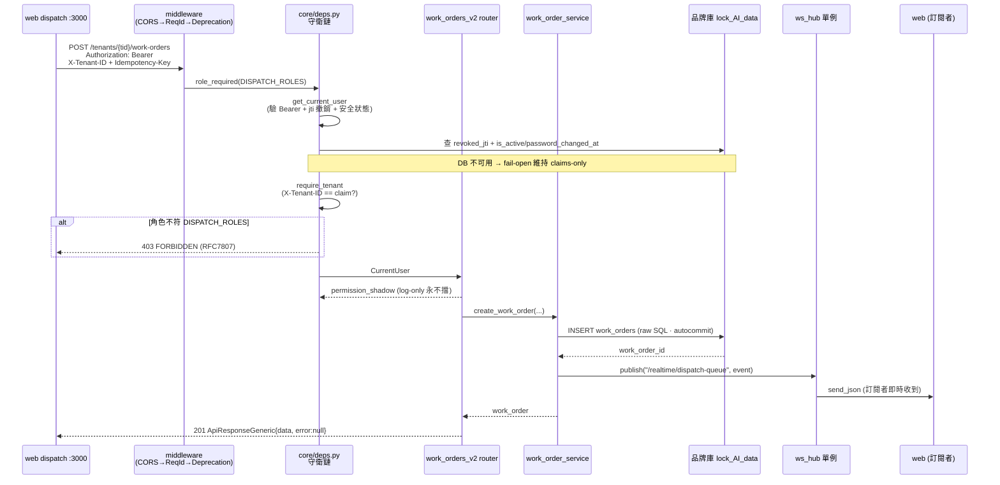
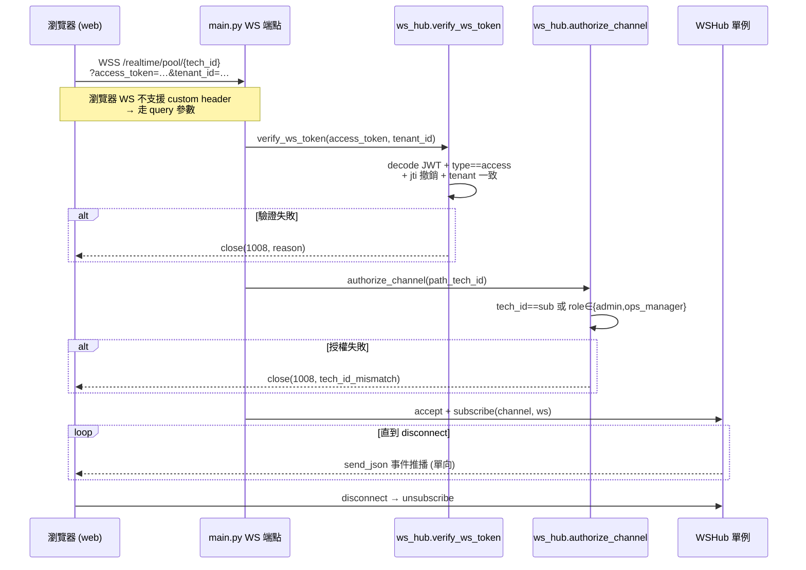
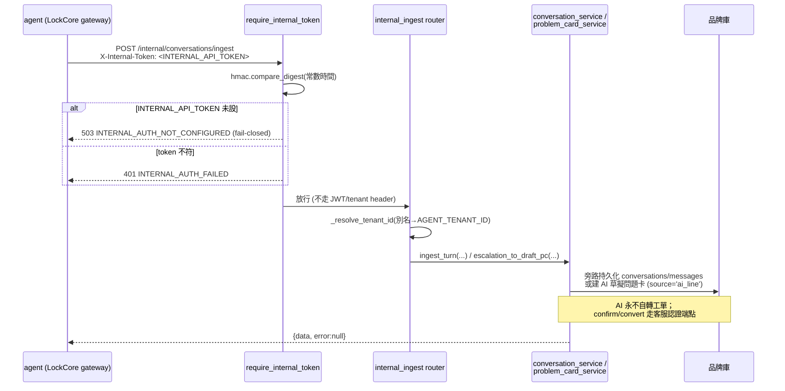
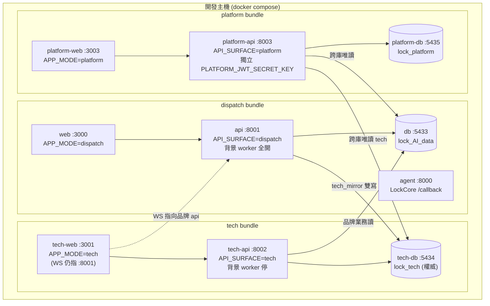
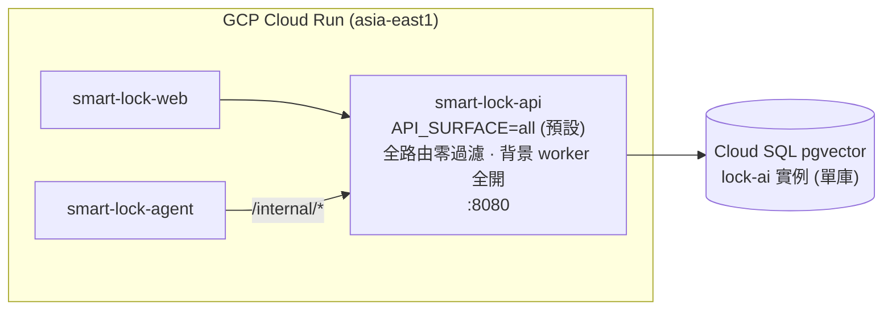

# api 子系統架構與設計 — FastAPI 派工營運控制平面

**版本** v1.0 | **日期** 2026-07-07 | **狀態** 草稿（現況 as-is baseline）

---

## 目錄

1. [文件元資訊](#1-文件元資訊)
2. [Solution Landscape（Level 0 — 能力域地圖）](#solution-landscapelevel-0--能力域地圖)
3. [C4 Container 清單表](#2-c4-container-清單表)
4. [C4 L2 Container Diagram](#3-c4-l2-container-diagram)
5. [C4 L3 Component Diagram（api 內部結構）](#4-c4-l3-component-diagramapi-內部結構)
6. [DDD 設計](#5-ddd-設計)
7. [技術選型表](#6-技術選型表)
8. [關鍵使用流程](#7-關鍵使用流程)
9. [部署視圖](#8-部署視圖)
10. [非功能性需求（NFR）](#非功能性需求nfr目標--策略)
11. [風險登記表](#9-風險登記表)
12. [演進路線](#10-演進路線)

> **註**：L1 System Context 由 `smartlock-docs/00_platform/P1/05_platform_architecture_L1.md` 集中管理，本文件從 L2 Container 起描述 api 子系統內部。所有結構均以 `api/` 實際 code 佐證；未能證實者標 `[待確認]`。

---

## 1. 文件元資訊

| 欄位 | 內容 |
|------|------|
| 子系統識別碼 | api（FastAPI 派工營運控制平面）|
| 文件類型 | P1 架構與設計（Architecture & Design）|
| C4 範圍 | L2 Container + L3 Component（api）|
| 撰寫日期 | 2026-07-07 |
| 版本 | v1.0 草稿 |
| App 版本 | `0.2.0`（`main.py:208`；`api/pyproject.toml` 套件版本 `0.1.0` 為打包號，未同步）|
| 佐證來源 | `api/main.py`、`api/core/*`、`api/realtime/*`、`api/routers/*`、`api/services/*`、`docker-compose.{dispatch,tech,platform}.yml` |
| 審閱狀態 | 待審 |

> **定位（一句話）**：同一份 FastAPI codebase，透過 `API_SURFACE` 環境變數塑形成 3 種部署面（dispatch / tech / platform），接三個物理分裂的 pgvector Postgres 庫，服務品牌後台、師傅 App、平台 console 三個前端。控制平面（工單 / 派工 / 帳務 / 結算 / 知識庫），**不含 AI 推論**——agent 為獨立子系統，反向經 internal token 寫入本 API。

---

## Solution Landscape（Level 0 — 能力域地圖）

> **C4 之前的一層**：先用「能力域 / 業務分群」對齊業務與管理層，再 zoom 進 C4 L2。受眾為業務 + 管理層，**不**回答 runtime / protocol（那在 §3 L2 與 §4 L3）。本能力域與 §5.2 DDD 三個限界上下文對齊。

```mermaid
block-beta
  columns 1

  block:solution["Solution Boundary（api 系統邊界 — 單一 FastAPI codebase）"]:1
    block:surfaceRow["部署塑形（API_SURFACE 三面，同一 image）"]:1
      s1["dispatch :8001\n品牌後台完整面\n+ 背景 worker"] s2["tech :8002\n師傅 App 精簡面\n停 worker"] s3["platform :8003\n平台 console\n只 /platform 前綴"]
    end
    block:capRow["核心能力域（443 端點 / 105 router）"]:1
      cap1["派工營運\nDispatch Ops\n(工單/派工/技師/排班)"] cap2["帳務金流\nFinance\n(invoice/refund/voucher/dispute/warranty)"] cap3["結算對帳\nSettlement\n(settlement/recon/commission/b2b)"] cap4["知識治理\nKnowledge & Governance\n(KB/SOP/audit/GDPR/config)"]
    end
    block:realtimeRow["即時與整合（進程內）"]:1
      ws["ws_hub 單例\nin-memory pub-sub\n10 WS 頻道"] cron["11 in-memory cron\nLINE outbox/SLA/GDPR/自動結案"] intn["internal ingest\nagent gateway 旁路"]
    end
  end

  block:dataRow["資料層（三庫分裂 pgvector Postgres）"]:1
    db1[("品牌庫 lock_AI_data\nPOSTGRES_URI · ~100 表")] db2[("技師權威庫 lock_tech\nTECH_POSTGRES_URI")] db3[("平台庫 lock_platform\nPLATFORM_POSTGRES_URI")]
  end

  block:external["External Systems（外部系統）"]:1
    ext1["web (4 portal)\nREST + WebSocket 消費者"] ext2["agent (LockCore)\n/internal/* 客戶\nX-Internal-Token"] ext3["LINE Messaging API\nPush(outbox) + postback webhook"]
  end
```



### Level 0 能力域說明

| 能力域 / 分群 | 說明 | 對應 C4 Container（§2）| 對應 DDD 上下文（§5.2）|
|:---|:---|:---|:---|
| 部署塑形 | 同一 image 靠 `API_SURFACE` 塑三面；非安全邊界 | api（dispatch/tech/platform surface）| 三 context 於同 codebase |
| 派工營運 | 工單（最重）、派工、技師身分/生命週期、排班、報價定價 | api + 品牌庫 + 技師權威庫 | DispatchOperations（核心域）+ Technician |
| 帳務金流 | invoice / refund / voucher / dispute / warranty / RMA | api + 品牌庫 | DispatchOperations |
| 結算對帳 | settlement / reconciliation / commission / b2b statement | api + 品牌庫 | DispatchOperations |
| 知識治理 | KB / SOP / audit / GDPR forget / config M18 / AI trace | api + 品牌庫（pgvector）| DispatchOperations |
| 平台治理 | 品牌申請、師傅平台審核、platform_admin | api（platform surface）+ 平台庫 | PlatformGovernance |
| 即時與整合 | WS 推播、cron worker、agent internal ingest、LINE push | api（realtime/）| 跨 context 基礎設施 |

**Level 0 檢查清單**：
- [x] 只呈現能力域，無 runtime protocol（protocol 在 §3 L2）
- [x] 能力域與 §2 Container、§5.2 DDD 上下文可雙向對照
- [x] 外部系統與平台 L1（web/agent/LINE）一致
- [x] 圖塊用業務語言命名

---

## 2. C4 Container 清單表

> api 子系統對外表現為「同一 image 的三個 runtime 實例」+「三個獨立 DB 實例」。三 surface 共用 `api/Dockerfile`，僅環境變數不同。

| # | Container 名稱 | 類型 | 技術棧 | Host Port | 狀態 |
|---|---------------|------|--------|-----------|------|
| 1 | api (dispatch surface) | Process | Python 3.11 / FastAPI ≥0.110 / uvicorn / psycopg3 | 8001 | 現行（本機）|
| 2 | api (tech surface) | Process | 同上（`API_SURFACE=tech`，停背景 worker）| 8002 | 現行（本機）|
| 3 | api (platform surface) | Process | 同上（`API_SURFACE=platform`，獨立 JWT 密鑰）| 8003 | 現行（本機）|
| 4 | api (all / 雲端單體) | Process | 同上（`API_SURFACE=all` 預設，全掛零過濾）| 8080（容器內）| 現行（雲端 + pytest）|
| 5 | 品牌庫 db | Database | `pgvector/pgvector:pg17` | 5433 | 現行 |
| 6 | 技師權威庫 tech-db | Database | `pgvector/pgvector:pg17` | 5434 | 現行（本機；雲端 `[待確認]` 未接）|
| 7 | 平台庫 platform-db | Database | `pgvector/pgvector:pg17` | 5435 | 現行 |

**進程內元件（非獨立 Container，隨 api process 生滅）**：

| 元件 | 位置 | 說明 |
|---|---|---|
| ws_hub 單例 | `realtime/ws_hub.py` | in-memory pub-sub，10 WS 頻道；**非 Redis** |
| 11 cron worker | `realtime/*.py` | in-memory scheduler；`API_SURFACE in (tech,platform)` 全停 |
| 中介層鏈 | `middleware/` | CORS → RequestId → Deprecation |

> **⚠️ 關鍵事實**：#1–#4 是**同一份 codebase 的四種塑形**，不是四套服務。改一處 code 影響三端。ws_hub 與 cron worker 為進程內狀態，是水平擴展的主要障礙（見 §9 R-02）。

---

## 3. C4 L2 Container Diagram



**圖例**：
- `-->` 已由 code 驗證的路徑；`-.->` 只覆蓋部分語義（如 LINE webhook 只收 postback）或進程內部相依。
- 橘色節點（ws_hub / cron）為進程內 in-memory 狀態，水平擴展會壞（§9 R-02）。
- fallback 安全閥：未設 `TECH_POSTGRES_URI` / `PLATFORM_POSTGRES_URI` 時 `core/db.py` 回主連線，單庫行為不變（`db.py:11-13,62-64`）。

---

## 4. C4 L3 Component Diagram（api 內部結構）

以「分層 + 守衛鏈」描述 api process 的內部模組結構。分層清楚：router（HTTP / 授權）→ service（業務 + SQL）→ core.db（連線）；services 不 import routers。



**分層要點**：
- **守衛鏈組合**：`role_required` → `require_tenant` → `get_current_user`（層層 `await`）；平台端另走 `require_platform_admin`（不收 X-Tenant-ID，跨品牌視角）；服務間走 `require_internal_token`（fail-closed，`hmac.compare_digest` 常數時間比對）。
- **⚠️ 任務假設的 `get_current_user_tenant_scoped` 在 code 不存在**——tenant-scoping 實作為 `require_tenant`（`deps.py:104`）+ `role_required` factory（`deps.py:207`）。
- **潛在循環規避**：`permission_shadow` 用 lazy import `from services import role_service`（`deps.py:239`）化解 core → services 反向引用。
- **回應信封**：成功走 `ApiResponseGeneric` / `CursorPage`（`models/generated.py`）；錯誤走 RFC7807 superset（`errors.py`）。

---

## 5. DDD 設計

### 5.1 通用語言詞彙表（Ubiquitous Language）

| 術語 | 中文說明 | 備註 |
|------|----------|------|
| **API_SURFACE** | runtime 塑形旗標（`all`/`dispatch`/`tech`/`platform`），決定路由前綴過濾與是否啟背景 worker | `main.py:144`；**部署塑形非安全邊界** |
| **工單 Work Order** | 派工域中樞聚合根，FK 被 ~10 表引用 | `work_orders`（品牌庫）；v1+v2 端點量最大 |
| **問題卡 Problem Card** | 客服 → 派工橋接，AI 從對話擷取結構化診斷卡 | `problem_cards`；1:1 conversation；AI 只建草擬卡不自轉工單 |
| **技師身分權威庫** | `lock_tech`，全品牌共用技師身分；品牌庫保留投影列 | CR-0112 方案 B；一致性靠 `tech_mirror` 雙寫 |
| **shadow-mode RBAC** | 12 角色 × 12 資源 × 4 動作矩陣，**目前 log-only 永不擋** | `deps.py:225`；`RBAC_SHADOW_DENY` warning |
| **SoD（職責分離）** | `X-Initiator/X-Approver/X-Executor` 任二相同 → 403 | `require_sod_actors`；BR-M17-01 |
| **jti 撤銷** | 登出寫 `revoked_jti` 表，每請求查是否撤銷 | `auth.py:134`；`deps.py:62` |
| **internal ingest** | agent gateway 旁路持久化對話 / escalation | `X-Internal-Token`；fail-closed |

### 5.2 限界上下文定位（Bounded Context）

**一大特徵**：三個限界上下文共存於同一 FastAPI codebase，靠 `API_SURFACE` 與獨立 DB 做物理與邏輯隔離。

```
┌──────────────────────────────────────────────────────────────────┐
│                   api（單一 FastAPI codebase）                      │
│                                                                    │
│  ┌───────────────────────────┐   ┌──────────────────────────────┐ │
│  │ DispatchOperationsContext │   │      TechnicianContext        │ │
│  │  核心域 Core Domain       │   │  技師身分權威（lock_tech）    │ │
│  │  API_SURFACE=dispatch     │   │  API_SURFACE=tech             │ │
│  │                           │   │                               │ │
│  │  - 工單 / 派工 / 排班     │◄─►│  - users(technician) / 認證   │ │
│  │  - 帳務金流 / 結算對帳    │SK │  - 技能 / 品牌授權 / 生命週期 │ │
│  │  - 知識庫 KB / SOP        │   │  - tech_mirror 雙寫回品牌庫   │ │
│  │  - 治理合規 GDPR/audit    │   │  (背景 worker 全停)           │ │
│  └────────────┬──────────────┘   └──────────────────────────────┘ │
│               │ CF（跨庫唯讀）                                      │
│  ┌────────────▼──────────────┐                                     │
│  │ PlatformGovernanceContext │   共享核心：core/auth.py（JWT）、   │
│  │  治理域（lock_platform）  │   core/db.py（三連線）、           │
│  │  API_SURFACE=platform     │   models/generated.py（Pydantic）  │
│  │                           │                                     │
│  │  - platform_admin 帳號    │   上游：agent（/internal 客戶）    │
│  │  - 品牌申請 brand_apps    │   下游：web（4 portal）            │
│  │  - 師傅平台審核 (獨立密鑰)│                                     │
│  └───────────────────────────┘                                     │
└──────────────────────────────────────────────────────────────────┘

上游依賴：agent（LockCore，經 /internal/* 反向寫入）
下游提供：web 4 portal（REST + WebSocket）
外部整合：LINE Messaging API（Push outbox + postback webhook）
```

**上下文關係模式**：

| 關係 | 模式 | 語義 |
|---|---|---|
| agent → DispatchOperations | CS（Customer-Supplier）| agent 為 `/internal/*` 客戶，X-Internal-Token 認證 |
| DispatchOperations ↔ Technician | SK（Shared Kernel）| 技師身分雙寫 mirror，`lock_tech` ↔ 品牌庫投影列 |
| PlatformGovernance → Dispatch/Technician | CF（Conformist）| platform surface 跨庫唯讀 |
| DispatchOperations → web | CS | api 供 REST/WS 給前端 |

---

## 6. 技術選型表

| 類別 | 選用技術 | 版本 | 選型理由 / 取捨 |
|------|---------|------|----------------|
| Web 框架 | FastAPI + uvicorn[standard] | ≥0.110 / ASGI | 原生 async、自動 OpenAPI、Pydantic v2 整合；適合高並發 REST + WebSocket |
| Schema / 驗證 | Pydantic v2（+email）| ≥2.6 | 系統邊界強型別驗證；`models/generated.py` 由 datamodel-codegen 從 openapi.yaml 生（243 class）|
| DB driver | **psycopg3（raw SQL）** | ≥3.2 | **無 SQLAlchemy、無 ORM**。取捨：直接掌控 SQL、對齊 agent profiles 連線設計；代價 = 無 repository 抽象、測試需真連線或 monkeypatch（見 §9 R-05 / P4 §3.2）|
| Migration | **純編號 `.sql`** | — | **無 alembic**。`SQL/migrations/000..089`（87 檔）+ `MIGRATION_REGISTRY.md`；forward-only、idempotent（`ADD COLUMN IF NOT EXISTS`）。取捨：簡單、可 `psql -f`；代價 = 無 down migration、registry 意圖 vs 事實漂移（詳見 ADR-002）|
| DB 引擎 | pgvector / pgvector:pg17 | pg17 | RAG embedding（`manual_chunks` / `case_entries` VECTOR(768) HNSW）+ pg_trgm 中文子字串 + pgcrypto |
| 連線模式 | **單一共享 AsyncConnection + autocommit** | — | **非連線池**。閒置斷線透明重連。取捨：MVP 簡單；代價 = 高併發瓶頸 + 全域無交易邊界（§9 R-05）|
| 認證 | JWT HS256（python-jose）+ bcrypt（passlib）| — | access 60min / refresh 30d；jti 撤銷；每請求重查安全狀態（fail-open）。詳見 P3/13 |
| 即時 | **原生 FastAPI WebSocket + in-memory ws_hub** | — | **非 Redis**。取捨：MVP 零外部依賴；代價 = 單機、多 worker 事件跨實例遺失（ADR-003 / §9 R-02）|
| 背景任務 | **11 in-memory cron worker** | — | lifespan 啟停；`API_SURFACE in (tech,platform)` 全停避免雙跑。取捨：無需 Celery/Redis；代價 = 多實例重複執行（重複 LINE 推播 / 告警）|
| PDF 生成 | reportlab | ≥4.0 | vouchers / reports |
| PII 加密 | cryptography Fernet | ≥42.0 | app 層加密 KYC 敏感欄位（`core/pii_crypto.py`，CR-0115）|
| LINE 通道 | line-bot-sdk（linebot.v3）+ aiohttp | ≥3.0 / ≥3.9 | Push（outbox worker）+ postback webhook；fail-soft |
| 套件管理 | uv workspace | — | root `pyproject.toml`；agent/api/data 共用 `.venv` / `uv.lock` |
| 測試 | pytest + pytest-asyncio | `asyncio_mode=auto` | `api/tests/` 203 個 test 檔；CI 選配 schemathesis/respx/hypothesis |

---

## 7. 關鍵使用流程

### 7.1 派工工單建立與指派（含守衛鏈 + WS 推播）



### 7.2 WebSocket 即時推播（頻道授權）



> **⚠️ 跨 stack 限制**：事件只在「動作發生的 API 實例」廣播（in-memory hub）。tech-web 的 WS 指向品牌 api（:8001）而非 tech api（:8002），因師傅端自身動作在 tech 實例不會廣播到品牌實例；師傅端即時性靠輪詢降級。

### 7.3 agent internal ingest（對話旁路持久化）



---

## 8. 部署視圖

### 8.1 本機 compose（三 surface 五 bundle 多面）



### 8.2 雲端 Cloud Run（單體不對稱 — ⚠️ 技術債）



> **⚠️ 拓撲不對稱（平台 G-01）**：本機 5-bundle 多 surface（含 tech/platform/landing），雲端只 3 個 Cloud Run，api 用預設 `API_SURFACE=all` 單體 monolith，**無 tech/platform surface 雲端部署、技師庫雲端未接** `[待確認]`。此為刻意的「雲端單體、本機多面」設計還是遷移未收尾，須於部署文件明確記載。

---

## 非功能性需求（NFR：目標 + 策略）

> 目標（Targets，含 ID）為對 stakeholder 的契約、應穩定；策略為達成手段、可隨架構演進。目標用 `NFR-<屬性>-NN` 編號。

### 效能 Performance

| ID | 指標 | 目標 |
|:---|:---|:---|
| NFR-PERF-01 | 讀取類 API 回應時間 | < 300ms（p95）[待確認] 無實測 |
| NFR-PERF-02 | WS 推播延遲 | 事件發生 → 訂閱者收到 < 1s（同實例）|

**策略**：psycopg3 raw SQL 直控查詢；pgvector HNSW 索引（m=16）加速 KB/case 檢索。**限制**：單一共享 AsyncConnection 非池，高併發下單連線序列化為瓶頸（R-05）。**驗證**：`[待確認]` 無負載測試。

### 可擴展性 Scalability

| ID | 指標 | 目標 |
|:---|:---|:---|
| NFR-SCAL-01 | 水平擴展前提 | 多 worker 須先解決 ws_hub 與 cron 的 in-memory 共享狀態 |
| NFR-SCAL-02 | 多租戶隔離 | 一品牌一 DB 物理隔離（取代 RLS 邏輯隔離）|

**策略**：`API_SURFACE` 分面部署降低單實例路由面；背景 worker 於 tech/platform 面停用避免雙跑。**阻斷**：WS pub-sub 與 11 cron 皆進程內（非 Redis / 分散式排程），Cloud Run 多實例會跨實例事件遺失、cron 重複跑（R-02 / ADR-003）。

### 可用性 Availability

| ID | 指標 | 目標 |
|:---|:---|:---|
| NFR-AVAIL-01 | 認證降級 | DB 抖動時仍可服務（fail-open）|
| NFR-AVAIL-02 | 健康檢查 | `/health` 回 DB 連線狀態（ok/degraded）|

**策略**：閒置斷線透明重連（`db.py`）；每請求安全狀態查詢 fail-open（DB 不可用退回 claims-only）。**取捨風險**：fail-open 意味 DB 抖動時停權/改密撤銷失效（停權帳號仍可用 token，R-04 / P3/13）。

### 安全性 Security

| ID | 指標 | 目標 | 現況 |
|:---|:---|:---|:---|
| NFR-SEC-01 | 授權（RBAC enforce）| 敏感寫入端點依角色阻擋 | ❌ **shadow-mode**（log-only 永不擋）；R-01 頭號缺口 |
| NFR-SEC-02 | 服務間認證 | agent → api 需 internal token | ✅ `require_internal_token` fail-closed |
| NFR-SEC-03 | JWT 密鑰隔離 | platform 獨立密鑰 | ⚠️ 靠部署紀律 + 啟動守衛（≥16 字元）|

**策略**：詳見 P3/13 安全清單。**重要**：80 個敏感寫入端點僅 `require_tenant` 不檢角色，權限矩陣仍 shadow-mode，為 HIGH 授權缺口（P3/13 §C）。

### 可維護性 Maintainability

| ID | 指標 | 目標 |
|:---|:---|:---|
| NFR-MAINT-01 | 測試覆蓋 | 關鍵路徑 pytest 覆蓋（203 test 檔現況）|
| NFR-MAINT-02 | 端點版本收斂 | v1 caller 歸零，v1 路由下線 |

**策略**：`DeprecationMiddleware` 標記所有 v1 回應；`deprecation_metrics` + `v1_inventory` admin 端點盤點安全刪除。**債**：v1/v2 雙掛，105 router 表面 = 攻擊面 + 維護成本翻倍（R-03）。

---

## 9. 風險登記表

| # | 風險描述 | 嚴重性 | 發生可能性 | 影響範圍 | 緩解策略 | 證據 |
|---|---------|--------|-----------|---------|---------|------|
| R-01 | **RBAC shadow-mode 授權漏洞**：80 個敏感寫入端點僅 `require_tenant` 不檢角色，任何登入者（含 technician/vendor）可寫金流/設定/派工；12×12×4 權限矩陣 log-only 永不擋 | **高** | 高 | 金流/派工/治理全域 | 逐端點補 `role_required`；`permission_shadow` 由 log 轉 enforce；先對帳 195 條 role_required | `deps.py:189-192,225-264` |
| R-02 | **即時通道 in-memory 單機**：ws_hub 與 11 cron worker 皆進程內（非 Redis），多 worker → WS 事件跨實例遺失、cron 重複跑（重複 LINE 推播/告警）、deprecation counter 不準 | **高** | 高（一旦水平擴展）| 即時推播 + 背景任務 | 導入 Redis pub-sub + 分散式排程；min-instances=1 暫緩 | `ws_hub.py:1-6`；`main.py:139-141,164` |
| R-03 | **v1→v2 遷移長尾未收**：v1/v2 雙掛，真實 v1 caller ~42，多份 CIA 待業主裁決，5 個 cutover gate 有 4 個未達 | 中 | 中 | 105 router 維護 + 攻擊面 | 收尾 P4 cutover；依 CIA 裁決逐一遷移 | MISSION.md:24,73,82-91 |
| R-04 | **每請求安全狀態 fail-open**：DB 不可用時停權/改密撤銷失效，退回 claims-only（停權帳號在 DB 抖動時仍可用 token）| 中 | 低（僅 DB 抖動窗口）| 認證即時性 | 記錄取捨；關鍵操作可加 fail-closed 白名單 | `deps.py:69-73`；`auth.py:108-131` |
| R-05 | **API_SURFACE 是字面前綴過濾非安全邊界**：tech/platform 面靠前綴比對塑形，真正隔離全押每端點 RBAC；某端點漏掛守衛則 surface 過濾擋不住（dispatch 面用剔除清單易漏收）| 中 | 中 | 跨面權限隔離 | 明確文件化 surface 非邊界；RBAC enforce 後降風險 | `main.py:136-143,639-659` |
| R-06 | **單一共享 AsyncConnection（非池）+ 全域 autocommit**：高併發下單連線成瓶頸；無交易邊界，多語句一致性靠應用層 | 低-中 | 中 | 高併發效能 + 一致性 | 評估 psycopg pool；關鍵多語句加顯式交易 | `db.py:27,53` |
| R-07 | **命名/職責錯置遺留**：`exceptions_v2` 實為師傅排班別名（非 M15 異常），CR-0041 標 deprecated 待遷 `technician_schedule_v2`；路由順序多處手動排序（literal vs param catch-all）易踩雷 | 低 | 低 | router 可讀性 | 依 CR-0041 遷移；補路由順序測試 | `main.py:86,311-314,319` |

---

## 10. 演進路線

### Phase 1 — 本月優先（授權正確性）

**目標**：關閉頭號授權缺口與拓撲一致性。

| 任務 | 交付物 | 驗收 |
|------|--------|------|
| RBAC 矩陣由 shadow 轉 enforce，逐一補 `role_required` | 授權盤點 + 端點補丁 | 未授權角色寫金流/派工回 403 |
| 部署拓撲文件化（雲端單體 vs 本機多面）+ 技師庫雲端決策 | 部署指南更新 | `API_SURFACE` 邊界性質白紙黑字 |

### Phase 2 — 下月（可擴展性）

| 任務 | 交付物 |
|------|--------|
| ws_hub + 11 cron worker 遷移 Redis pub-sub + 分散式鎖 | 事件匯流排 + 排程改造 |
| 單一連線改 psycopg connection pool | 連線池 + 交易邊界策略 |

### Phase 3 — Q3（治理健壯化）

| 任務 | 交付物 |
|------|--------|
| v1→v2 cutover 收尾（依 CIA 裁決）| ADR-v2-cutover-complete |
| `exceptions_v2` 遷 `technician_schedule_v2`（CR-0041）| 命名收斂 |
| fail-open 安全狀態查詢補關鍵操作 fail-closed 白名單 | 認證強化 |

---

*文件結尾 — api 子系統架構與設計 v1.0 / 2026-07-07*
