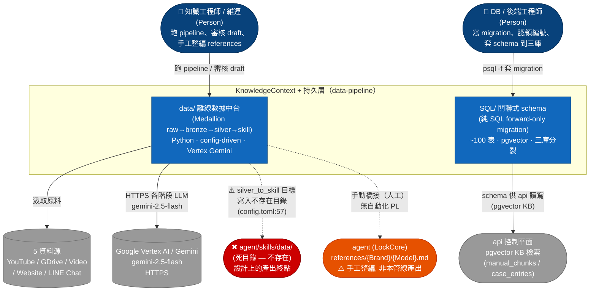
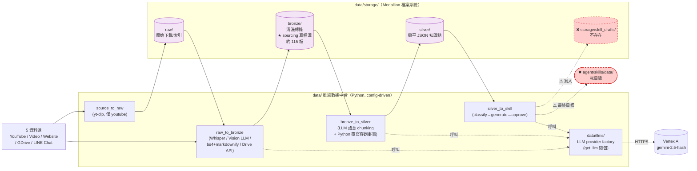
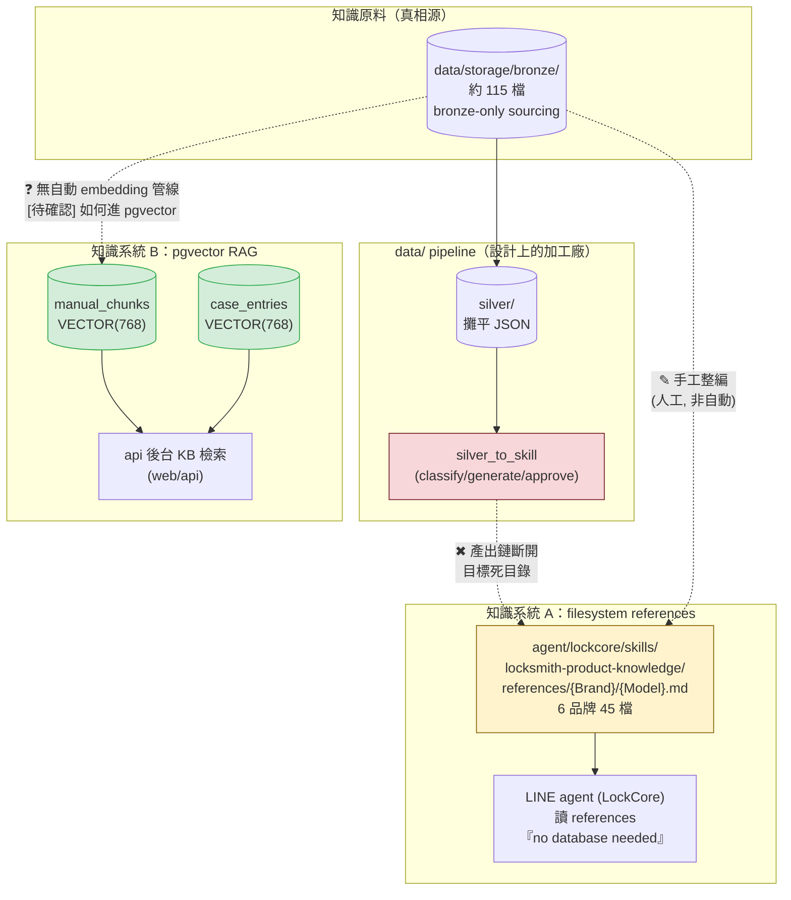
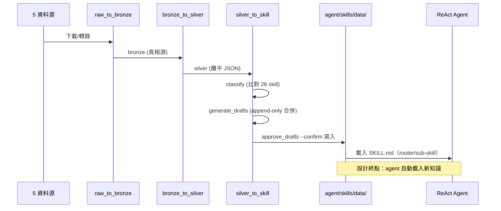
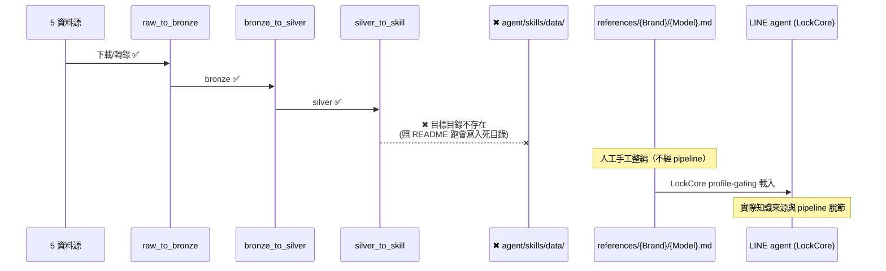
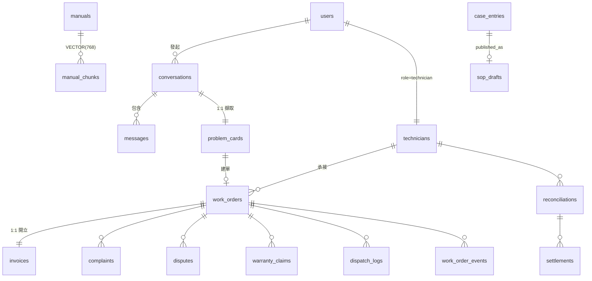

# 架構與設計文件 — data-pipeline（離線 Medallion 數據中台 + DB Schema）

| 欄位 | 內容 |
|---|---|
| 文件版本 | v1.0 |
| 建立日期 | 2026-07-07 |
| 狀態 | 草稿（現況 baseline） |
| 負責人 | 平台架構師（多 agent 程式碼庫排查綜合） |
| 涵蓋範圍 | `data/`（離線數據中台）+ `SQL/`（DB schema / migration / 三庫）|
| 架構層級 | C4 L1–L2 + Medallion 分層 + DDD KnowledgeContext + DB schema 專章 |
| 佐證來源 | `data/README.md`、`data/docs/manuals/架構書.md`、`data/config.toml`、`data/pipeline/*`、`data/llms/*`、`SQL/Schema*.sql`、`SQL/migrations/*`、`SQL/platform/Schema_platform.sql`、`scripts/db/*` 實際 code |

> ⚠️ **本文件為現況誠實記錄，非設計願景。** data-pipeline 是本平台**唯一產出鏈已斷開**的子系統：`data/` 內的 pipeline 文件（`data/README.md` / `架構書.md`）描述的是 **2026-06-04 已被 LockCore 重寫 superseded 的「26-skill ReAct」舊世界**，其自動化終點目錄 `agent/skills/data/` 已不存在。本文件會逐節標示「設計意圖 vs 現況落差」，凡與 `data/` 舊文件衝突者**以本文件為準**；凡未能由 code 證實者標 `[待確認]`。詳見 §9「現況 vs 設計意圖落差」專節。
>
> **文件層級歸屬**：`data/` 內的 README / 架構書屬 tier-4 exploration（`.claude/rules/context-stability.md`），描述「當時意圖」，**不代表現行行為**。本 SAD 屬平台文件庫，以 code 為準。

---

## Solution Landscape（Level 0 — 能力域地圖）

> **C4 之前的一層**：先用能力域總覽對齊「data-pipeline 做什麼」，再 zoom 進 C4。本系統實際涵蓋**兩個彼此獨立的能力域**：(1) 離線知識萃取管線（`data/`）、(2) 關聯式資料庫 schema 與 migration（`SQL/`）。兩者在 repo 中相鄰、共屬「數據 / 持久層」職責，故合併於同一份 SAD，但**執行時互不相依**（管線不寫 DB，DB 不讀管線輸出）。

```mermaid
block-beta
  columns 1

  block:solution["Solution Boundary（data-pipeline 系統邊界）"]:1
    block:ingestRow["資料汲取層（5 資料源）"]:1
      yt["YouTube\n(yt-dlp + Vision LLM)"] vid["訓練影片\n(Whisper ASR)"] web["鎖市官網\n(Playwright + bs4)"] gd["Google Drive\n(Drive API 索引)"] line["LINE Chat\n(CSV 匯出)"]
    end
    block:medallionRow["Medallion 分層萃取（能力域）"]:1
      raw["Raw\n(原始下載 / 索引)"] bronze["Bronze\n(清洗轉錄, sourcing 真相源)"] silver["Silver\n(攤平結構化知識點)"] skill["Skill\n(⚠️ 產出目標死目錄)"]
    end
    block:dbRow["關聯式資料庫層（能力域）"]:1
      schema["Schema / Migration\n(純 SQL forward-only)"] pgv["pgvector 雙知識系統\n(manual_chunks / case_entries)"] threedb["三庫物理分裂\n(品牌 / 技師 / 平台)"]
    end
  end

  block:external["External / 下游消費者"]:1
    vertex["Vertex AI / Gemini\n(gemini-2.5-flash, 各階段 LLM)"] apisys["api 控制平面\n(擁有 schema, 讀 pgvector KB)"] agentsys["agent (LockCore)\n(讀 filesystem references\n⚠️ 非本管線自動產出)"]
  end
```

### 能力域說明（必填）

| 能力域 / 分群 | 說明 | 現況 |
|---|---|---|
| 資料汲取層 | 5 資料源各自的下載/轉錄/爬取（`data/pipeline/raw_to_bronze/`）| ✅ 運作（bronze 約 115 檔）|
| Medallion 萃取 | `raw → bronze → silver → skill`，config-driven，全走 Vertex Gemini | ⚠️ raw→bronze→silver 運作；**silver→skill 產出鏈斷開** |
| 關聯式資料庫層 | `SQL/` 主 schema + 87 migration + 平台庫 + 三庫分裂 | ✅ 運作（api 擁有，本文件詳述 schema 現況）|
| Vertex AI / Gemini | pipeline 各階段 LLM（`gemini-2.5-flash`）| ✅ 運作（`data/config.toml`）|
| api 控制平面 | 擁有全業務 schema，讀 pgvector KB（`manual_chunks`/`case_entries`）| ⚠️ **僅 keyword 評分運作；向量檢索未建**（`case_service.py:285` 註 Phase 2、`manual_chunks` 從未被查、無 `embed()`）——語義 RAG 對後台亦 greenfield（2026-07-07 勘查，ADR-004）|
| agent (LockCore) | 讀 filesystem `references/{Brand}/{Model}.md` | ⚠️ **獨立手工整編，不經本管線** |

> **Level 0 檢查**：本層只呈現能力域，不含 runtime protocol（細節見 §3 C4）。⚠️ 標記處即為 §9 落差專節的來源。

---

## 1. C4 L1 — System Context（data-pipeline 視角）

從 data-pipeline 視角看它在平台中的位置。本系統屬 **KnowledgeContext（知識生產限界上下文）** 的**設計上的上游**，理論上應把智慧鎖產品知識萃取後餵給下游（agent references + pgvector KB）。**但現況該上游橋接已斷**（詳見 §7、§9）。

**系統邊界說明：**

| 角色 / 系統 | 關係 | 現況 |
|---|---|---|
| 知識工程師 / 維運 | 主要操作者，跑 pipeline CLI、審核 draft、手工整編 references | ✅ |
| DB / 後端工程師 | 寫 migration、認領編號、套 schema 至三庫 | ✅ |
| 5 資料源 | 上游原料（YouTube/GDrive/Video/Website/LINE） | ✅ |
| Vertex AI / Gemini | pipeline 各階段 LLM（`gemini-2.5-flash`）| ✅ `data/config.toml` |
| `agent/skills/data/` | 設計上的產出終點 | ✖ **目錄不存在（斷鏈）** |
| agent (LockCore) references | 實際知識載體 | ⚠️ 手工整編，**非本管線自動產出** |
| api 控制平面 pgvector KB | schema 的實際消費者 | ✅（但服務後台，非 LINE agent）|

---

## 2. C4 Container 清單表

> 本系統無長駐 runtime（非服務），container 概念對映為「可執行單元 / 持久資產」。

| 名稱 | 類型 | 技術棧 | 進入點 | 狀態 |
|---|---|---|---|---|
| `data/pipeline/source_to_raw/` | CLI batch | Python + yt-dlp | `process_youtube.py` | current |
| `data/pipeline/raw_to_bronze/` | CLI batch | Python + Whisper ASR / Vision LLM / bs4+markdownify / Drive API | `process_{youtube,video,website,line,gdrive}.py` | current |
| `data/pipeline/bronze_to_silver/` | CLI batch | Python + LLM 語意 chunking | `process_{youtube,video,website,line,gdrive}.py` | current |
| `data/pipeline/silver_to_skill/` | CLI batch | Python（classify→generate→approve）| `classify_documents.py` → `generate_drafts.py` → `approve_drafts.py` | ⚠️ **產出目標死目錄** |
| `data/llms/` | library | LLM provider factory（vertexai/openai/anthropic/ollama）| `get_llm(provider, model)` | current |
| `data/storage/` | 持久資產 | Medallion 檔案系統（raw/bronze/silver）| JSON / txt / md / csv | current（bronze 約 115 檔）|
| `SQL/Schema*.sql` | 持久資產 | 基底 schema（22 表 + 9 擴充檔）| `psql -f` | current |
| `SQL/migrations/*.sql` | 持久資產 | 87 個 forward-only migration + registry | `psql -f NNN-*.sql` | current |
| `SQL/platform/Schema_platform.sql` | 持久資產 | 平台庫獨立 schema（3 表）| `init-platform-db.sh` | current |
| pgvector Postgres | DB | PostgreSQL + pgvector（品牌/技師/平台三庫）| psycopg3（api 擁有）| current |

---

## 3. C4 L2 — Container Diagram（Medallion 資料流）

> 圖例：實線 = 已驗證運作；虛線 = 斷開/呼叫；紅色 = 不存在的目標。`bronze/` 標星，因它是 **bronze-only sourcing** 的知識真相源（見 §4.3）。

---

## 4. Medallion 分層架構（核心）

`data/storage/` 採**獎章架構（Medallion）**：`raw → bronze → silver → skill`，config-driven（設定集中於 `data/config.toml`），全部 LLM 階段走 Vertex `gemini-2.5-flash`。定義來源：`data/README.md:5-40`、`data/docs/manuals/架構書.md:22-96`。

### 4.1 各層職責與量級

| 層 | 目錄 | 內容 / 格式 | 各源實測檔數 | 狀態 |
|---|---|---|---|---|
| **Raw（原始層）** | `data/storage/raw/` | 下載原始檔（.mp4/.csv/links.txt），多為佔位/索引 | youtube 1、website 2、video 1、gdrive 2、line_chat 1 | ✅（近空殼，見 §10 風險）|
| **Bronze（粗抽取層）** | `data/storage/bronze/` | YouTube→.json(transcript)、Video→.txt、Website→.md、GDrive→.json、Line→.csv | **youtube 76**、gdrive 20、video 12、website 6、line_chat 1 | ✅ **sourcing 真相源** |
| **Silver（結構化中台）** | `data/storage/silver/` | 攤平 JSON array，每元素一個知識點 | youtube 76、gdrive 20、video 12、website 6、line_chat 2 | ✅ |
| **Skill（草稿）** | `data/storage/skill_drafts/`（README 宣稱）| SKILL.md.draft + diff | — | ✖ **目錄不存在（斷鏈）** |

### 4.2 資料源類型（5 種）

依 `data/README.md:128-136`：

1. **LINE Chat**（CSV 匯出）—— 客服對話歷史。
2. **訓練影片**（.MOV/.mp4 → Whisper ASR）—— 內部教學影片轉逐字稿。
3. **YouTube**（yt-dlp 下載 → Vision LLM 逐幀）—— 品牌官方安裝/故障排除影片，轉為逐幀 markdown 字幕。
4. **鎖市官網**（Playwright 爬 Wix SPA → bs4 + markdownify 去噪）—— 網站產品頁。
5. **Google Drive**（Drive API 索引）—— **PDF 只引 URL 不抄內容**（見 §4.3 sourcing rule）。

### 4.3 Bronze-only Sourcing Rule（CRITICAL）

> 產品知識內容**嚴格源自 `data/storage/bronze/`**（YouTube 字幕、website、video transcript）。**PDF（GDrive）不可信 —— references 只引 URL，不抄內容。** 依據：CLAUDE.md Architecture Lock「Sourcing rule (bronze-only)」+ `data/README.md:23`。

**Bronze 樣本實證**（`data/storage/bronze/youtube/-ZLd3d8EMTk.json`）：dict keys = `video_id / url / title / transcript`；title「AI-99 內外鏡頭確認教學」，transcript 為 Vision LLM 逐幀 markdown 逐字稿。

**Silver 樣本實證**（`data/storage/silver/youtube/-ZLd3d8EMTk.json`）：JSON list（len=5），每元素攤平欄位 `content / brand / model / category / source_type / source / url / chunk_index`；樣本 `brand="Chatlock", model="AI-99", category="knowledge", source_type="youtube"`。符合架構書 §3.4「Silver 統一為攤平 JSON」（`架構書.md:121-125`）。

### 4.4 bronze→silver 轉換（LLM 結構化）

依 `架構書.md:139-144`：冪等性檢查 → LLM 扮「資深電子鎖技術編輯」做語音糾錯 + 去冗 + 語意切塊 → 產 JSON array → **Python 強制覆寫客觀事實（source / source_type）防幻覺**。此「Python 覆寫」是防止 LLM 竄改 provenance 的關鍵設計。

### 4.5 silver→skill 三步（設計）

依 `data/README.md:99-127`、`架構書.md:146-166`：

1. **classify**（`classify_documents.py`）：兩層分類 —— Tier1（`metadata.category` + 關鍵字快篩，比對 **26 個既有 skill**）、Tier2（LLM 語意分類）。產 `classification.json`。
2. **generate_drafts**（`generate_drafts.py`）：對應既有 skill → LLM **append-only 合併**（絕不刪改）；無匹配且 ≥3 chunks → LLM 建新 SKILL.md；<3 chunks → 歸 unclassified。
3. **approve_drafts**（`approve_drafts.py`）：`--dry-run` 預覽 diff / `--confirm` 備份 + 寫入，驗 YAML frontmatter + `$ARGUMENTS` 佔位符。

> ⚠️ **此三步的產出終點是 `../agent/skills/data`（`data/config.toml:57`）—— 該目錄不存在。** 三步的分類基準（26 skill、`ts-*`/`app-*` router 結構，`_skill_registry.py:77-83`）是**已被 superseded 的舊 ReAct 架構**。見 §7、§9。

---

## 5. DDD 設計 — KnowledgeContext 定位與分裂註記

### 5.1 通用語言詞彙表

| 術語 | 定義 |
|---|---|
| **Medallion** | `raw→bronze→silver→skill` 分層數據架構；每層對前層做一次品質提升。|
| **bronze-only sourcing** | 知識內容真相源限定 bronze 層（字幕/website/transcript）；PDF 只引 URL。|
| **攤平 JSON（silver）** | 每知識點一個 dict，含 `content` + `brand/model/category/source_type/source/url/chunk_index`。|
| **skill draft** | silver→skill 產出的 `SKILL.md.draft`（設計概念，實際目錄不存在）。|
| **references** | 現行 agent 實際知識載體 `{Brand}/{Model}.md`（Agent Skills 標準），手工整編。|
| **pgvector KB** | DB 內 `manual_chunks` / `case_entries` 的 768 維向量檢索，服務後台 web/api。|
| **schema_migrations** | migration 是否已套用的**唯一真相源**表（046 建）。|
| **三庫** | 品牌庫 `lock_AI_data` / 技師庫 `lock_tech` / 平台庫 `lock_platform` 物理分裂。|

### 5.2 KnowledgeContext 限界上下文定位

data-pipeline 在平台中扮演 **KnowledgeContext（知識生產）** 的角色，其**設計上**的職責邊界：

- **上游依賴**：5 資料源（YouTube/GDrive/Video/Website/LINE）、Vertex Gemini LLM。
- **核心能力**：汲取 → 清洗轉錄（bronze）→ 語意結構化（silver）→ 知識產出（skill）。
- **下游輸出（設計意圖）**：agent 可載入的 skill references + pgvector KB embedding。
- **整合介面**：CLI + config.toml（無 REST，見 P2/06）。

### 5.3 ⚠️ KnowledgeContext 分裂註記（誠實記錄）

**本平台存在兩套並存、無收斂機制的產品知識系統**，data-pipeline 原設計為兩者上游，但橋接已斷：

**兩套系統對照：**

| 面向 | 知識系統 A：filesystem references | 知識系統 B：pgvector RAG |
|---|---|---|
| 位置 | `agent/lockcore/skills/*/references/{Brand}/{Model}.md`（6 品牌 45 檔）| DB `manual_chunks` + `case_entries`（`Schema.sql:334,369`）|
| 消費者 | **LINE agent (LockCore)**；SKILL.md 明寫「self-contained snapshot — no database or runtime needed」（`locksmith-product-knowledge/SKILL.md:16-18`）| **web/api 後台 KB/case 檢索**（CR-0005/015 KB v2）|
| 產出方式 | ⚠️ **手工整編**，非 pipeline 自動產出（目標目錄已不存在）| `[待確認]` 無明確自動 embedding 管線文件 |
| 維護 | 人工維護 `{Brand}/{Model}.md` | async 向量化（`case_entries.embedding_status`，`Schema_api_phase1.sql:55`）|

> **結論（2026-07-07 由 ADR-004 更新）**：原記「兩套並存無收斂」為範疇錯誤——references 是 **Skill 行為驅動的精選層**，pgvector 是**唯一完整事實語料**，兩者從屬非競品。ADR-004 定案：agent 經 **RAG-via-MCP** 查 pgvector（語義），references 只留精選 + 檢索程序。⚠️ 但勘查證實 pgvector 語義層目前僅 keyword stub、`manual_chunks` 未被查、無 `embed()`——**語義 RAG 為 greenfield**，須依 ADR-004 分階段建（embed + cosine query + MCP server + 灌注語料）。詳見 `agent/P2/04_adr/ADR-004`；G-04 產出鏈修復與本案 Phase 2 對齊。

---

## 6. 技術選型表

| 類別 | 選用技術 | 選型理由 | 現況取捨 / 代價 |
|---|---|---|---|
| 數據分層 | Medallion（raw→bronze→silver→skill）| 逐層品質提升、provenance 可追溯、bronze 可獨立作真相源 | ⚠️ skill 層已死；Medallion 前三層仍成立（見 ADR-001）|
| pipeline 設定 | config-driven（`data/config.toml` + `tomllib`）| 一源一 section，改設定不改 code | ✅ 但 `skills_dir` 指向死目錄未更新 |
| pipeline LLM | Vertex AI `gemini-2.5-flash`（統一）| 逐幀 vision + 長文結構化性價比佳；與 GCP 部署一致 | ✅ 全階段統一（`config.toml`）|
| LLM 抽象 | `data/llms/` provider factory（`get_llm` 閉包）| 開閉原則，支援 vertexai/openai/anthropic/ollama 切換 | ✅ **與 agent LockCore LiteLLMProvider 完全獨立**（見 §8.4）|
| DB migration | 純 SQL 檔（非 Alembic）+ forward-only + idempotent | 無 ORM 依賴、可 `psql -f` 手動套、平行 worktree 認領編號 | ⚠️ 無回滾、無版本鏈、狀態靠人工 registry（見 ADR-002）|
| 向量檢索 | pgvector VECTOR(768) + HNSW（m=16,ef=64,cosine）| 與主 Postgres 同庫、免額外向量 DB、text-embedding-004 對齊 | ✅（見 §8.3）|
| 租戶隔離 | 一品牌一 DB 物理隔離（取代 RLS）| 品牌資料強隔離、免 RLS 複雜度 | ⚠️ schema 內 `tenant_id`/`saas.tenant`/RLS 骨架成死碼（見 ADR-003）|

---

## 7. 關鍵流程 — 知識產出鏈：設計 vs 現況斷鏈對照

### 7.1 設計意圖（data/ 文件宣稱）

依 `架構書.md:4,53`、`data/README.md:125`、`_skill_registry.py:77-83`：終點是 `agent/skills/data/SKILL.md`，走「26 skill + router（`ts-*`→troubleshoot、`app-*`→app-guide）」，供 **ReAct Agent** 載入。

### 7.2 現況（實測）

**實測證據**（附 file:line）：
- `agent/skills/` **不存在**（`ls: No such file or directory`）。
- `agent/skills/data/` **不存在**。
- `data/storage/skill_drafts/` **不存在**。
- `data/config.toml:57`：`skills_dir = "../agent/skills/data"`（指向死目錄）。
- 現行知識載體：`agent/lockcore/skills/locksmith-product-knowledge/references/{Brand}/{Model}.md`（6 品牌 `3E/Chatlock/Dormakaba/Kaadas/Milre/Philips` + `_common/`，45 檔），frontmatter `brand/model/description`（`Dormakaba/ML660.md:1-5`），**獨立手工整編**。

> **落差本質**：bronze 與 lockcore references 有品牌重疊（Chatlock/Dormakaba…），原料同源（bronze-only），但 **pipeline 的自動 silver→skill 產出鏈未接到現行 references**。管線停留在 2026-06-04 被 LockCore 重寫 superseded 的舊 26-skill ReAct 世界。

---

## 8. DB Schema 架構專章

> DB schema 由 `api` 擁有（見 `smartlock-docs/README.md`），但 schema **現況**在本系統詳述（data-pipeline 與 SQL/ 同屬持久層職責）。合計 **~100 表跨三 schema**。

### 8.1 檔案結構

- **基底 schema**：`SQL/Schema.sql`（1013 行，22 表）+ 9 個 `SQL/Schema_*.sql`（`Schema_v2_extensions.sql`、`Schema_api_phase1.sql`、`Schema_media.sql`、`Schema_rbac_dynamic.sql`、`Schema_tech_schedule.sql`、`Schema_work_order_events.sql`、`Schema_doc_numbering.sql`、`Schema_harness_migration.sql`、`Schema_cr0001_integration_gaps.sql`）。
- **migrations**：`SQL/migrations/000..089`（實 87 檔，含預留缺號）+ `MIGRATION_REGISTRY.md`（編號登記簿）。
- **平台庫**：`SQL/platform/Schema_platform.sql`（91 行，3 表；與品牌庫物理分離，CR-0114）。
- **種子**：`SQL/seeds/*.sql`（20 檔）+ `scripts/seed/*.py`（demo/UAT）。

### 8.2 三個 schema namespace

| namespace | 用途 | 建於 |
|---|---|---|
| `public.*` | 主業務表（品牌/派工/工單/客服/知識/金流舊表 + 報價/技師擴充）| `Schema.sql` + `Schema_*.sql` + 多數 migration |
| `saas.*` | 治理/租戶隔離重構表（config 治理、對帳結算 v2、爭議、庫存、憑證、月結、AI trace…）| migration 004 起（`004-config-m18.sql` 建 saas schema + `saas.tenant`）|
| `agent.*` | LockCore CS agent per-user 記憶（SQLite→Postgres）| `033-agent-memory-schema.sql`（`agent.memory_entry` / `agent.escalation`）|

### 8.3 主要資料表清單（按業務領域分組）

| 領域 | 代表表 | 備註 |
|---|---|---|
| **A. 使用者 / 身分 / RBAC** | `users`（統一 5 角色 `Schema.sql:96,111-116`）、`roles`、`permissions`、`role_permissions`(034)、`saas.role_assignment`(070 雙簽 SoD)、`staff_applications`(088)、`password_reset_tokens`(035)、`revoked_jti`、`account_security` 欄位(084) | `users` = 統一身分表 |
| **B. 客服對話 / 診斷** | `conversations`(Session)、`messages`、`chat_messages`、`problem_cards`（1:1 conversation；077/065/085）| LINE Bot 上游 |
| **C. 知識庫（KB / RAG）** | `manuals`(PDF)、`manual_chunks`(VECTOR 768)、`case_entries`(案例庫 VECTOR 768)、`sop_drafts`、`saas.kb_audit_log`(015)、`saas.sop_feedback`(023) | pgvector 雙知識，見 §8.4 |
| **D. 技師 / 派工** | `technicians`(064/080)、`technician_skill`(063)、`technician_brand_authorization`(063)、`technician_certification`(081)、`technician_kyc`(089)、**`work_orders`（派工域中樞）**、`work_order_events`、`work_order_consents`(043)、`dispatch_logs`、`saas.reschedule_proposal`(014)、`saas.exception_case`(049)、`saas.technician_lifecycle_event`(020) | `work_orders` 被 ~10 表 FK 引用 |
| **E. 報價 / 目錄** | `quote`、`quote_approval`、`quote_line_items`(037)、`service_catalog`、`material_catalog`、`surcharge_rule`(087)、`saas.price_rule`(008)、`technician_payout_rule`(045/082)、`pricing_rule_snapshot` | |
| **F. 金流 / 帳務 / 結算** | `invoices`(028/037/042)、`payments`(069)、`saas.reconciliation`(005)、`saas.reconciliation_exception`(017)、`saas.settlement`(005/072)、`saas.monthly_settlement_batch`(019)、`saas.technician_statement`(025)、`saas.dispatcher_commission_statement`(026)、`saas.brand_b2b_statement`(027)、`saas.technician_penalty_bonus_ledger`(083)、`saas.voucher`+`saas.voucher_void_event`(010)、`refund_requests`(002)、`cancellation`(001) | |
| **G. 客訴 / 爭議 / 保固 / 合規** | `complaints`、`saas.dispute`(006)、`warranty_claims`(003/068)、`scope_changes`(053)、`material_requests`、`appearance_change_consents`、`family_reviews`(074 hash chain)、`saas.rma_quality_finding`(024)、`saas.forget_request`(021 GDPR) | |
| **H. 庫存 / BOM** | `saas.inventory_item`/`saas.inventory_transaction`(007)、`saas.product_model`+`saas.bom_line`(073 兩層 BOM) | |
| **I. 配置治理（M18）** | `saas.config_namespace`/`config_version`/`config_rollout`/`config_audit`(004)、`system_config`、`data_corrections`(009)、`saas.change_request`+`saas.change_request_type_dim`(008) | |
| **J. 平台/通知/審計/AI 治理** | `notifications`+`notification_template`(071)、`saas.line_binding`(018)、`line_push_outbox`、`media_files`(048/060/066)、`audit_events`(067 hash chain)、`saas.ai_decision_trace`(022)、`llm_usage_log`、`harness_traces`/`user_facts`、`schema_migrations`(046)、`agent.memory_entry`/`agent.escalation`(033) | 平台庫另有 `users`/`revoked_jti`/`brand_applications` |

**表數量級**：public ~60+、saas ~34、agent 2 → **合計 ~100 表**。

### 8.4 pgvector 雙知識系統

`CREATE EXTENSION vector`（`000-extensions.sql:18`、`Schema.sql:42`）。兩個向量欄位並存：

| 欄位 | 維度 / 索引 | 用途 | 消費者 |
|---|---|---|---|
| `manual_chunks.embedding VECTOR(768)`（`Schema.sql:334`）| 768（text-embedding-004）；HNSW m=16, ef_construction=64, `vector_cosine_ops`（`Schema.sql:1007-1013`）| L2 RAG 手冊語義搜尋 | web/api KB 檢索 |
| `case_entries.embedding VECTOR(768)`（`Schema.sql:369`）| 同上；相似度 ≥0.85 命中 | L1 案例庫語義搜尋 | web/api case 檢索 |

- 檢索：`ORDER BY embedding <=> query_vec`（`015-kb-v2-expand.sql:93-94`；註提 ivfflat，但 `Schema.sql` 實建 HNSW → 措辭不一但同欄位）。
- `case_entries.embedding_status`（`Schema_api_phase1.sql:55`；async 向量化狀態）。
- ⚠️ **現行 LINE agent 不查 pgvector**（走 filesystem references，見 §5.3）；此 pgvector 服務後台。兩套無收斂。

### 8.5 三庫物理分裂與雙寫鏡射

| DB | 實例名（範例）| schema 來源 | 內容 | 依據 |
|---|---|---|---|---|
| **品牌庫（派工/營運）** | `lock_AI_data`（:5433）| `Schema.sql` + `Schema_*.sql` + migrations 全套（~100 表）| 完整業務：客服/派工/工單/金流/知識/治理 | **一品牌一 DB**（CR-0110，20260702 裁決，`MIGRATION_REGISTRY.md:100`）|
| **技師庫** | `lock_tech`（:5434）| 品牌庫**子集**（6-7 表）| `users`(role=technician)、`technicians`、`technician_skill/brand_authorization/certification`、`technician_schedule_requests`、`saas.technician_lifecycle_event` | CR-0112 方案 B（20260703，`split-tech-db.sh:1-8`）|
| **平台庫** | `lock_platform`（:5435）| **獨立 schema** `SQL/platform/Schema_platform.sql`（3 表）| `users`(platform_admin)、`revoked_jti`、`brand_applications` | CR-0114（`Schema_platform.sql:1-11`）|

**關係語意（非同一 schema 部署三份）：**
- **品牌庫 = 全 schema**；技師庫 = 品牌庫的技師身分域子集；平台庫 = 全新 3 表 schema。
- **技師庫 = 權威庫**；品牌庫保留技師列當**投影**（35 張品牌表 FK 指向 `users/technicians`，投影讓 FK/派工/佣金 JOIN 免改）；一致性靠 api **雙寫鏡射（tech_mirror）** + `--verify` 比對（`split-tech-db.sh:5-8,38-55`）。
- 平台庫 `users` 欄位刻意對齊品牌庫 `users` 子集（含 084 帳號安全欄），使 `core/auth.py` lockout 查詢可共用（`Schema_platform.sql:24-31`）。

### 8.6 Domain Model（核心實體與關聯）

- **`users`** = 統一身分表（5 角色 line_user/admin/reviewer/technician/dispatcher，`Schema.sql:111-116`）。
- **`work_orders`** = 派工域中樞，FK 被 ~10 表引用；欄位歷經 CR-0026/0043/0047/0050 多波擴充（brand/model/serial/warranty_expiry/teaching_note…，`Schema.sql:457-508`）。
- **`problem_cards`** = 客服→派工橋接（AI 從對話擷取，completeness_score 觸發建單）。

**租戶隔離現況**：`saas.tenant`（004 建）為 FK target；`saas.*` 多表帶 `tenant_id`；但 `public.work_orders.tenant_id` 標「CR-0031；目前 single-tenant」（`Schema.sql:496`）；RLS 7 表 policy 為**預留未落地**（`004-rls`/`008-rls` 標 🔒，須先過 ADR-0030，`MIGRATION_REGISTRY.md:24,29`）。實務改走「一品牌一 DB」物理隔離（見 ADR-003）。

---

## 9. ⚠️ 現況 vs 設計意圖落差（誠實記錄專節）

> 本節是整份文件最重要的部分。data-pipeline 是本平台唯一「文件描述的世界已不存在」的系統，若後人照 `data/` README 操作會失敗。以下逐項對照。

| # | 設計意圖（data/ 文件宣稱）| 現況（實測 code）| 落差性質 | 嚴重度 |
|---|---|---|---|---|
| L-01 | `silver_to_skill` 產出 `agent/skills/data/SKILL.md`，供 agent 載入（`架構書.md:4,53`、`config.toml:57`）| `agent/skills/`、`agent/skills/data/`、`storage/skill_drafts/` **皆不存在** | **產出鏈斷開** | 🔴 HIGH |
| L-02 | pipeline 供「**ReAct Agent**」載入 26 skill + router（`架構書.md:4`）| ReAct 架構已於 2026-06-04 被 **LockCore** 重寫刪除（CLAUDE.md Architecture Lock）| 文件描述 **superseded 舊世界** | 🔴 HIGH |
| L-03 | 知識自動化上游 → agent | 現行 agent 知識 `references/{Brand}/{Model}.md` **手工整編**，不經 pipeline | 自動化承諾未兌現 | 🔴 HIGH |
| L-04 | （隱含）單一知識系統 | **兩套並存**：filesystem references（agent）+ pgvector RAG（後台），來源不同、無收斂 | 知識治理分裂 | 🟡 MEDIUM |
| L-05 | （隱含）tenant_id/RLS 做邏輯多租戶 | 實務改「一品牌一 DB」物理隔離；`tenant_id`/`saas.tenant`/RLS 骨架成**死碼**（`work_orders.tenant_id` 標 single-tenant）| 隔離策略切換未清算 | 🟡 MEDIUM |
| L-06 | registry「狀態」欄可信 | 狀態欄自承「意圖非事實」，035/045 標 idempotent 但 dev 未套；017-027 標 pending 但 dev 已存在（`MIGRATION_REGISTRY.md:7-15`）| migration 真相雙向漂移 | 🟡 MEDIUM |

**修復方向（見 §11 演進路線與 P4/08）：**
- **方案 A（修復對齊）**：把 `silver_to_skill` 產出目標改為 lockcore `references/{Brand}/{Model}.md` 格式，更新 `config.toml`，管線重新成為自動上游。
- **方案 B（正式退役）**：若 references 續走手工整編，將 `data/README.md` / `架構書.md` 標 `status: superseded`，明確記載管線退役，避免後人照 README 跑失敗。
- **建議**：先做 B（止血 + 誠實），再評估 A（恢復自動化價值）。與 `00_platform/P2/09 §5.1` 一致。

---

## 10. 非功能性需求（NFR：目標 + 策略）

> 本系統為離線批次，無線上 SLA；NFR 聚焦資料品質、可重現性、schema 演進安全。未填值標 `[待確認]`。

### 資料品質 Data Quality

| ID | 指標 | 目標 |
|---|---|---|
| NFR-DQ-01 | 知識來源可信度 | 100% 源自 bronze（bronze-only sourcing）；PDF 只引 URL |
| NFR-DQ-02 | provenance 正確性 | silver `source`/`source_type` 由 Python 強制覆寫（防 LLM 幻覺）|
| NFR-DQ-03 | bronze→silver 冪等 | 重跑同一 bronze 檔不產生重複 silver 知識點 |

**策略**：LLM 扮技術編輯做語音糾錯 + 去冗；Python 覆寫客觀事實；`架構書.md:139-144`。**驗證**：silver 樣本人工抽查（`[待確認]` 無自動品質測試套件）。

### 可重現性 Reproducibility

| ID | 指標 | 目標 |
|---|---|---|
| NFR-REP-01 | pipeline 可重跑 | config-driven，同 config 產同結構輸出 |
| NFR-REP-02 | raw→bronze 可重建 | `[待確認]`：raw 層近空殼，原始影片/CSV 是否留存未明；若不在 repo，bronze 無法從頭重建 |

**策略**：config.toml 集中設定；bronze 保留為真相源。**風險**：見 §12 R-07。

### Schema 演進安全 Schema Evolution

| ID | 指標 | 目標 |
|---|---|---|
| NFR-SCH-01 | migration 可重套 | idempotent（`ADD COLUMN IF NOT EXISTS` / `DO $$ 查 pg_constraint $$`）|
| NFR-SCH-02 | 套用真相可查 | `schema_migrations` 表為唯一真相源 |
| NFR-SCH-03 | 回滾能力 | ❌ **無**（forward-only，無 down migration，見 ADR-002）|
| NFR-SCH-04 | 多庫一致 | `[待確認]` 靠人工套用 + `--verify`，無自動 drift CI |

**策略**：純 SQL + idempotent + registry 認領編號。**風險**：見 §12 R-02、R-05。

### 向量檢索效能 Vector Search

| ID | 指標 | 目標 |
|---|---|---|
| NFR-VEC-01 | KB 檢索延遲 | `[待確認]` 無記錄；HNSW（m=16,ef=64）為效能基礎 |
| NFR-VEC-02 | 案例命中門檻 | 相似度 ≥0.85（`case_entries`）|

---

## 11. 風險登記表

| # | 風險描述 | 嚴重度 | 可能性 | 影響 | 緩解策略 |
|---|---|---|---|---|---|
| R-01 | **產出鏈斷開（架構漂移）**：`silver_to_skill` 目標死目錄；文件描述 superseded 26-skill ReAct；照 README 跑會寫入不存在目錄 | HIGH | 已發生 | 高（自動化知識更新完全失效；誤導後人）| 方案 B 標 superseded 止血 → 方案 A 修復對齊 references（§9）|
| R-02 | **Migration registry 雙向漂移**：狀態欄「意圖非事實」，046 前套用歷史多事後回填、時間點不可考；缺 CI 比對 registry vs `schema_migrations` | HIGH | 高 | 中（誤判某環境已/未套，測試 `UndefinedTable`）| 建 CI 自動比對；補歷史套用真相；以 `schema_migrations` 為唯一真相（見 ADR-002）|
| R-03 | **雙知識系統無收斂**：pgvector RAG（後台）vs filesystem references（agent）來源不同、須雙維護、易漂移；無權責邊界文件 | MEDIUM | 中 | 中（產品知識更新遺漏一側）| 定義單一真相源（bronze）；建 references↔pgvector 同步或擇一 |
| R-04 | **租戶隔離策略切換未清算**：`tenant_id`/`saas.tenant`/RLS 骨架成死碼；`work_orders.tenant_id` 明標 single-tenant | MEDIUM | 中 | 中（誤導開發者以為多租戶邏輯隔離已就緒）| 過 ADR-0030 裁決 RLS 去留；死碼標註或清除（見 ADR-003）|
| R-05 | **Forward-only 無回滾 + 多庫手動套用**：無 down migration、無 Alembic 版本鏈；`ON_ERROR_STOP=0` 容錯，真 ERROR 靠結尾 grep 人工判讀；品牌×N + tech + platform 手動套用擴散 | MED-LOW | 中 | 中（部分失敗被 benign 警告淹沒；多庫不一致）| CI drift 檢查；套用日誌保留；備份/還原文件化（見 ADR-002、P3/13）|
| R-06 | **種子/PII 治理弱**：`SQL/seeds/README.md` 明令 PII 禁入但 demo 帳號硬編於 README；無正式 master-data 匯入管線、無備份/還原策略文件 | LOW | 中 | 低-中 | 正式 seed 管線；備份策略文件；輪換 demo 憑證 |
| R-07 | **Raw 層近空殼**：raw 各源僅 1-2 檔（佔位/links），真原料在 bronze；`[待確認]` 原始資產是否留存，若不在 repo 則 bronze 無法從頭重建 | LOW | `[待確認]` | 中 | 確認並文件化原始資產保存位置與備份 |

---

## 12. 演進路線

### Phase 1 — 止血與誠實（本月）

**目標**：讓文件不再誤導，讓 migration 真相可查。

| 任務 | 交付物 | 驗收 |
|---|---|---|
| data-pipeline 產出鏈決策（修復 or 退役）| `data/README.md`/`架構書.md` 標 `status: superseded`（方案 B）或修 `config.toml` 產出目標（方案 A）| 跑 `silver_to_skill` 不再寫死目錄，或文件明載退役 |
| Migration registry 真相化 | CI 比對 `MIGRATION_REGISTRY.md` vs `schema_migrations` | drift 出現時 CI 告警 |
| 租戶隔離死碼裁決 | 過 ADR-0030：RLS 去留 + tenant_id 死碼標註 | schema 內 RLS/tenant_id 有明確 status |

### Phase 2 — 收斂與健壯（下月）

| 任務 | 交付物 |
|---|---|
| 兩套知識系統收斂 | 單一真相源（bronze）→ 雙產出（references 供 agent、embedding 供 pgvector）+ CI 同源檢查 |
| Medallion 前三層可重現性 | raw 原始資產保存策略；bronze 從頭重建驗證 |
| 多庫套用一致性 | 三庫套用腳本統一 + `--verify` 對帳 job |

### Phase 3 — 自動化恢復（Q3）

| 任務 | 交付物 |
|---|---|
| 若採方案 A：恢復自動 silver→skill→references 管線 | pipeline 產出對齊 Agent Skills 標準 references |
| 備份/還原文件 + RTO/RPO | 三庫備份策略 + 定期還原演練 |
| pgvector embedding 自動管線 | bronze/silver → embedding 自動化 + `embedding_status` 監控 |

---

## 附錄：關鍵檔案路徑

- Pipeline 文件：`data/README.md`、`data/docs/manuals/架構書.md`、`data/config.toml`
- Pipeline code：`data/pipeline/{source_to_raw,raw_to_bronze,bronze_to_silver,silver_to_skill}/`、`data/llms/`
- 資料：`data/storage/{raw,bronze,silver}/{youtube,video,website,gdrive,line_chat}/`
- 主 schema：`SQL/Schema.sql`、`SQL/Schema_*.sql`（9 檔）
- Migrations：`SQL/migrations/000..089-*.sql` + `MIGRATION_REGISTRY.md`
- 平台庫：`SQL/platform/Schema_platform.sql`
- DB 腳本：`scripts/db/{apply-schema-prod,init-platform-db,split-tech-db}.sh`
- 現行 agent 知識（非本管線產出）：`agent/lockcore/skills/locksmith-product-knowledge/references/{Brand}/{Model}.md`

---

*文件結尾 — data-pipeline / P1 / 05_architecture_and_design.md v1.0 / 2026-07-07*
