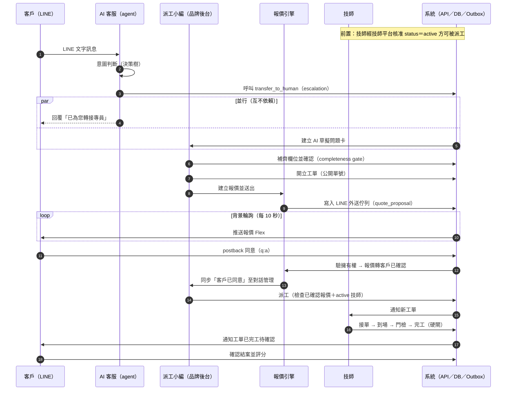

# 02 業務需求文件（BRD）

> 本文件回答：這門生意的價值主張是誰的痛？利害關係人是誰？業務流程長什麼樣？支撐營運的業務規則是什麼？商業成功如何衡量？
> 功能規格下沉至 [03_PRD](./03_PRD.md)；系統需求見 [04_SRS](./04_SRS.md)；架構見 [12_SAD](./12_SAD.md)。

---

## 1. 文件定位

| 欄位 | 內容 |
|---|---|
| 層級 | 業務層（流程 / 角色 / 規則 / KPI / 合規紅線）|
| 上位文件 | [00_Product_Strategy](./00_Product_Strategy.md) · [01_MRD](./01_MRD.md) |
| 下位文件 | [03_PRD](./03_PRD.md) · [08_User_Flow](./08_User_Flow.md) · [21_Traceability_Matrix](./21_Traceability_Matrix.md) |
| 決策依據 | 平台級 ADR-P001~P014（見 [14_ADR/](./14_ADR/) 與 `../00_platform/P2/04_adr/`）|

---

## 2. 業務背景與價值主張

### 2.1 產業機會

亞洲藍領服務業（智慧鎖售後為首發垂直）的售後客服與派工高度依賴老師傅的隱性知識：LINE 訊息湧入後靠人工逐條詢問品牌、型號、地址，紙本記錄、Excel 對帳、電話催收。新客服要 3 個月才能上手；師傅、客戶、品牌方每月因帳務爭議耗損信任。本平台以「LINE 進線 → AI 診斷 → 結構化問題卡 → 派工 → 存證 → 結算」把整條售後鏈標準化、可稽核、可分潤。

本產品導入後的量化價值：

1. 自助解決率拉到 60%，客服人力對應釋放。
2. 月結對帳由 3 天縮至 4 小時等級。
3. 新品牌（新甲方）加盟不改程式碼，走 License 開通與租戶設定即可。
4. SOP 與診斷知識沉澱在平台（知識精煉閉環），老師傅離職帶不走 know-how。

### 2.2 商業模式：License 開通

商業模式核心為 **License 開通**：

- 品牌以 License 授權開通「**基礎 per-brand bundle + 綁定該品牌 LINE 官方帳號**」——每品牌一套物理隔離、可完整獨立部署的單體（web 品牌營運後台 / api 派工控制平面 / agent AI 客服 / 品牌庫 pgvector / Redis / MCP-RAG）。
- 各**附加模組**（如 knowledge-refinery 知識精煉、AI Onboarding Compiler）另以 License 加購開通。「開通哪些模組」由 License 決定，經 **Casdoor** 訂閱管理（ADR-P003 / ADR-P005）。
- 跨品牌集中共用平台由我方統一營運：Casdoor（IdP + 租戶 + License）、SigNoz（可觀測性）、technician-platform（技師共享池，含獨立師傅 web）、Kafka 事件骨幹（🔜 規劃中，Phase 3）、平台維運 console。

### 2.3 平台化願景

平台本質是「**通用工單維運核心 + 產業配置層（Vertical Pack）**」：核心引擎（工單狀態機執行器、金流軌、身分 RBAC、事件骨幹）產業無關；垂直深度活在**積木庫、知識、flow DSL** 之中。護城河為三層複利（ADR-P011）：

1. **積木飛輪**：每落地一個產業累積新積木，後續產業 onboarding 越來越快。
2. **AI Onboarding Compiler**（🔜 規劃中）：AI 把客戶隱性流程（SOP / 訪談）編譯成 flow DSL，人審後匯入。
3. **Flow = 商業邏輯本體論**：累積的 flow 定義與積木庫編碼各產業營運邏輯，形成資料與轉換成本護城河。

定位一句話：**藍領營運的商業邏輯編譯器**——藍領原生積木本體論 × AI 編譯器 × LINE + AI 診斷落地。

---

## 3. 利害關係人與四方角色

### 3.1 四方角色（全平台唯一角色模型，權威來源 ADR-P006）

| 角色 | 對象 | 範圍 | 帳號來源 | 業務目標 |
|---|---|---|---|---|
| **Super Admin** | 我方平台維運方 | **跨租戶**（平台維運 console）| 平台建立 | 跨品牌治理、License 開通、平台健康 |
| **租戶 Admin** | 品牌方管理者 | 單一品牌租戶內 | Casdoor org admin，**自助開通帳號**給自己人 | 品牌營運自主：帳號、Agent 調校、規則設定 |
| **派工小編** | 品牌自己的人 | 租戶內操作（派工 / 工單 / 客服）| 租戶 Admin 開通 | 問題卡確認、開單、報價、派工、對話接管 |
| **技師 / 鎖匠** | 現場師傅 | **跨租戶身分**（由技師平台管，ADR-P004）| Casdoor + 技師平台 | 接單、到府施工、存證、跨品牌單一對帳 |

授權原則：Casdoor 發角色 claim，api 端 resource-level `role_required` 實際阻擋，**deny-by-default**。技師是跨品牌共享身分，一位鎖匠可服務多個品牌，不隸屬任何單一品牌租戶。

### 3.2 業務鏈外緣角色

| 角色 | 定位 |
|---|---|
| **終端客戶**（LINE 用戶）| 智慧鎖消費者：LINE 報修、與 AI 對話、LIFF 確認報價、確認結案評分 |
| **潛在加盟品牌** | 走品牌申請 → License 開通流程加入平台 |
| **家族覆核員** | 合約規定的稽核角色：SOP 覆核第二關，以事後（retrospective）事件紀錄履約 |
| **廠商（vendor）** | 品牌合作供應商，帶租戶識別隔離（fail-closed），與技師共享池分屬不同資料歸屬 |

### 3.3 各角色的價值交換

- 品牌方：買到「不用自建」的 AI 客服 + 派工 + 帳務全鏈，且知識沉澱歸品牌租戶。
- 技師：跨品牌單一工作台與單一對帳（不必逐品牌對帳），評分與認證可攜。
- 終端客戶：LINE 一個入口從報修到結案，急件 5 分鐘內接到真人。
- 平台方：License 年費 / 模組加購 + 交易鏈路資料沉澱。

---

## 4. 業務痛點與待解問題

以下為未導入本平台時，藍領售後產業的結構性困境（各痛點對應的平台解法列於右欄）：

| # | 業務痛點 | 平台解法 |
|---|---|---|
| P-1 | 客服知識活在老師傅腦中，新人 3 個月才上手、離職即流失 | AI 客服（Skill 行為驅動 + 知識庫）+ 知識精煉閉環（§5.5）|
| P-2 | 報修資訊非結構化：品牌 / 型號 / 地址靠人工反覆追問 | AI 自動擷取問題卡 + completeness gate（§6.2）|
| P-3 | 報價口頭承諾、無快照，事後爭議無憑據 | 報價 bounded context + 不可變快照 + 客戶 LINE 確認（§6.3）|
| P-4 | 派工靠電話與群組，SLA 無量測、急件無保證 | 工單狀態機 + 接單 SLA（一般 10 分 / 急件 5 分）即時監控 |
| P-5 | 現場加價「師傅說了算」，客訴與呆帳高 | 加價三段式金額分層 + 簽名 / 照片 / 稽核三件套（§6.5）|
| P-6 | 對帳每月吵：品牌、平台、師傅三方各記各的帳 | 計費（品牌）/ 結算（技師平台）分離 + 事件對帳閘門（§6.6）|
| P-7 | 技師資源被單一品牌鎖死，跨品牌重複建檔 | 技師共享池獨立系統，跨租戶單一真相（ADR-P004）|
| P-8 | 每接一個新產業 / 新品牌都要重寫系統 | Vertical Pack 產業包：核心不動、配置換裝（§2.3）|
| P-9 | AI 一旦越權承諾（免費保固 / 折扣），品牌直接賠償 | AI 職責邊界硬規則 + 200 題禁區 Eval 阻擋部署（§6.1、§7）|

---

## 5. 業務流程（全鏈路）

全鏈路：**客服（agent 對話 → 問題卡）→ 派工（工單建立 / 指派）→ 維修（到府 / 報價 / 施工 / 存證）→ 結算（收款 / 對帳 / 佣金）**，外加知識精煉閉環回饋客服。

### 5.1 客服受理（LINE 進線 → AI 診斷 → 問題卡）

1. 終端客戶於品牌 LINE 官方帳號發訊 → agent（LockCore）接收 webhook。
2. AI 依 SOP 行為層做意圖分類與紅線決策樹判斷；可自助解決者直接以產品知識回覆。
3. 急件 4 類（被鎖門外 / 門內受困 / 安全風險 / 高風險怒客）→ **繞過自助層，5 分鐘內強制轉真人**。
4. 需真人 / 需派工 → AI 呼叫 `transfer_to_human`（AI 進入後台系統的**唯一入口**），附 escalation 原因與脈絡快照。
5. 系統建立 AI 草擬問題卡（`incomplete`）→ 派工小編補齊品牌 / 型號 / 地址等欄位並確認（completeness gate）。

### 5.2 派工（問題卡 → 工單 → 指派技師）

1. 問題卡確認後，派工小編 1-click 開立工單（公開單號）；**AI 永不直接建立工單**。
2. 工單狀態機由 Vertical Pack 的 **flow DSL** 定義（狀態值域非寫死 enum）。locksmith pack 的工單生命週期：
   `created → dispatched → on_site → quoted → approved → in_progress → completed → settled`（任一非終態可 `cancelled`）。
3. 指派技師：經技師共享池（technician-platform）媒合，僅 `active` 狀態技師可被派工；接單 SLA 一般 10 分 / 急件 5 分，30 分無人接單自動擴大範圍並通知派工小編。
4. 派工前置硬閘：工單須存在客戶已確認之報價（急件走事後補審例外，§6.4）。

### 5.3 現場維修（到府 → 同意書 → 報價核准 → 施工 → 存證）

1. 技師到場（到場事件存證）→ 到府同意書 → 門檢。
2. 現場發現需加價 / 改項 → 依金額三段式處理（§6.5）；501 元以上**暫停施工**改走報價新版確認。
3. 完工硬閘三件：施工照片 ≥ 3 張 + 客戶簽名 + 安裝序號（主鎖與高價零件強制序號）。
4. 客戶確認結案並評分。

### 5.4 結算（收款 → 對帳 → 佣金）

1. 收款方式：現場收款 / 繳費連結 / 匯款（線上金流不在範圍）。
2. **計費（Billing）在品牌側**：品牌 api 依工單金額、料件、完工事實計算「該工單付技師多少」（per-job 佣金明細），發出 `commission.accrued` 事件（🔜 規劃中：Kafka 事件骨幹，Phase 3）。
3. **結算（Settlement）在技師平台**：technician-platform 訂閱各品牌佣金事件，作為技師**跨品牌單一對帳 / statement / payout 主體**（ADR-P014）。
4. 期末對帳閘門（reconcile）：品牌計費總額 vs 技師平台彙總必須對平，事件延遲屬可接受的最終一致性，但金流結算以對帳閘門把關。

### 5.5 知識精煉閉環（診斷素材 → 事實 / 行為 → 回饋客服）

knowledge-refinery（License 附加模組，ADR-P001）：

1. **輸入**：每一次診斷對話（LINE 對話 + 問題卡）+ 產品素材（YouTube / 影片 / 官網 / 手冊），走 Medallion `raw → bronze → silver` 治理。
2. **提煉**：LLM 將素材分流為（a）**事實**（逐型號手冊 chunk、案例史）、（b）**行為 / 精選**（SOP 規範、domain-safety、檢索程序）。
3. **審核**：兩類產物皆進獨立 web UI，人工 review diff 後核可（human-in-the-loop）。
4. **落地**：事實 chunk + embedding 灌入品牌庫 pgvector 唯一事實語料；行為更新 agent skill（git-tracked 可回溯）。
5. 客服 agent 經 RAG-via-MCP 檢索同一份語料（🔜 規劃中：pgvector 語義層，Phase 2）——隱性知識顯性系統化，回饋下一輪客服品質。

### 5.6 跨角色泳道時序（單次工單全程）

### 5.7 核心狀態機（7 組，business 視角摘要）

> 工單狀態值域由 pack 的 flow DSL 定義（`../00_platform/P1/07_workorder_platform_design.md` §5.1）；其餘實體狀態機完整轉移條件見 [04_SRS](./04_SRS.md)。

| 實體 | 狀態序列（主路徑）| 關鍵前置 / 後置條件 |
|---|---|---|
| **Conversation** | active → resolving → closed；resolving → escalated（AI 失敗 / 急件）；48h 無回應 → auto_closed；7 天內客戶再訊 → reopen | auto_closed 前置：resolving 且 48h 無客戶訊息 |
| **ProblemCard** | incomplete → draft → confirmed → ai_responded → resolved | confirmed 前置：completeness ≥ 0.85 且 device 已識別；resolved（AI 路徑）前置：客戶明確答覆「已釐清」；連續 3 次未釐清 → 升級真人 |
| **Quote** | draft → internal_approved → customer_sent → customer_confirmed；customer_sent → rejected / expired（48h）→ 可 re-version v+1；急件另有 retrospective_audit_only → customer_confirmed | customer_sent 前置：AI 路徑僅 range、final 需人核；保固 / 建案案件 AI 永禁觸發送出；每筆報價綁不可變定價快照（snapshot_hash）|
| **WorkOrder**（flow DSL）| created → dispatched → on_site → quoted → approved → in_progress → completed → settled；任一非終態 → cancelled | dispatched guard：role:dispatcher；approved 前置：Quote=customer_confirmed（急件 carve-out 見 §6.4）；completed 硬閘：地址非空 + 報價已確認（或急件事後補審完成）+ 存證三件 |
| **Onsite** | arrived → working → completed；working → scope_change（≤500 三件套後回 working）；working → pending_quote_v2（≥501 暫停施工）→ 客戶確認回 working；拒絕 → customer_disagreed_partial（按原報價完工）| pending_quote_v2 期間師傅不可再動料件明細 |
| **Payment / Refund** | deposit_required → paid → pending（對帳）→ 入帳；失敗 / 客戶退款 → refund_requested → 依責任歸屬 5×3 分層裁決 | 更正一律 reversal entry，帳本 append-only |
| **Evidence** | fresh → active → pending_purge（retention 到期 T0：銷毀金鑰 + 軟刪）→ purged（T+30 天硬刪）；任何時點可 legal_hold | legal_hold 永久且不可逆，解除須 ADR 變更 |

---

## 6. 業務規則（Business Rules）

> 以下為本產品現行業務規則全集（依域分類）。每條規則違反即屬 release blocker；完整條文與合規引用映射見 [04_SRS](./04_SRS.md) 與 [21_Traceability_Matrix](./21_Traceability_Matrix.md)。

### 6.1 對話 / 客服邊界規則（BR-CONV / BR-AI）

- **BR-CONV-01**：對話 48 小時無客戶回應自動結案（auto_closed）；7 天內客戶再訊自動 reopen。
- **BR-CONV-02**：負面情緒識別準確率 ≥ 90%（合約承諾值）；觸發即進入情緒分流。
- **BR-AI-01**：AI 職責僅限「對話判斷與知識回覆」；工具白名單僅 6 項（`read_file / list_dir / find_files / grep / web_search / transfer_to_human`）。
- **BR-AI-02**：AI 進入後台系統的唯一入口為 `transfer_to_human`；AI 對客戶承諾「將為您安排」必須實際呼叫此工具。
- **BR-AI-03**：AI 轉真人走 7 條硬規則，`rule_triggered_by` 必由確定性規則引擎寫入，**不得由 LLM 自報**（防 KPI gaming）。
- **BR-AI-04**：AI 禁區 200 題 Eval pipeline，通過率 < 95% 阻擋部署。
- **BR-AI-05**：AI 不做影像辨識（合約明文禁止）；圖片僅作附件保存，webhook 入口攔截任何 image-to-text 呼叫，違規次數容忍值 = 0。
- **BR-AI-06**：Prompt Injection 攔截率 ≥ 95%；內容過濾誤攔率 < 1%；輸出限定智慧鎖（該產業）話題。

### 6.2 問題卡規則（BR-PC）

- **BR-PC-01**：同一 active issue 僅開立一張問題卡（唯一鍵：對話 + 設備 + active 狀態）；新症狀 / 新設備可另開。
- **BR-PC-02**：completeness score ≥ 0.85 方可進入確認 / 自動派工路徑。
- **BR-PC-03**：completeness 不足時觸發主動照片引導（LINE Flex Message）。
- **BR-PC-04**：地址不齊不擋派工，但**結案前必須回填**（結案 422 硬閘之一）。

### 6.3 報價規則（BR-QUOTE / BR-PRICING）

- **BR-QUOTE-01**：AI 只能給**範圍價（range）**，永禁 final quote / 折扣 / 免費保固承諾；guardrail 三規則（無修飾語金額數字 / 折扣關鍵字 / 保固免費）觸發即攔截重生成。
- **BR-QUOTE-02**：AI 在對話中**不複誦個案報價金額**（即使報價已送出），僅告知報價存在並引導查看 LIFF / Flex 系統訊息；AI 訊息文字由 server 模板限定，無自由文金額數字。
- **BR-QUOTE-03**：保固期內 / 建案案件之報價，AI 永禁觸發 LIFF 送出，必由派工小編手動核可送出（server-side 403 強制）。
- **BR-QUOTE-04**：LIFF 確認窗口期間客戶觸發負面情緒 → 報價狀態凍結 + 強制轉真人 final review。
- **BR-PRICING-01**：報價引擎為 api 內獨立 bounded context；AI agent **禁止直接呼叫**定價引擎，僅能經報價聚合讀取。
- **BR-PRICING-02**：每筆報價綁定**不可變、content-addressable（sha256）定價規則快照**；已送出的報價永不重算；快照表 append-only。
- **BR-PRICING-03**：定價規則變更走 ChangeRequest 四級授權矩陣：

  | 變更類型 | 核准鏈 |
  |---|---|
  | 定價規則（全域）| 平台主管 + 法務 + 會計 + Domain Expert（四簽）|
  | 定價規則（per-contract override）| 品牌主管 + 法務 + 會計（三簽）|
  | 個案金額調整（單筆報價）| 客服主管（單簽 + audit）|
  | 急件加速通道 | 客服主管 + 24h 內會計補簽（兩階段）|

- **BR-PRICING-04**：規則生效日不得回溯（`effective_at ≥ approved_at + 24h`）；draft 報價可重掛新規則，已送出報價受快照凍結保護。

### 6.4 工單規則（BR-WO）

- **BR-WO-01**（報價硬綁定）：AI 永不直接轉換工單；工單成立必經派工小編 1-click 確認，且前置為 **Quote = customer_confirmed 或 急件類別非空**。業務語義：「報價 → 客人確認 → 才立工單」。
- **BR-WO-02**（結案雙必驗）：結案 422 硬閘 = 地址非空 **且**（報價客戶已確認 **或** 急件事後補審完成）。
- **BR-WO-03**（取消費）：取消費 5 階段由系統自判，全階段派工小編可覆寫，一律留 audit log。
- **BR-WO-04**（急件事後補審）：急件 4 類允許跳過報價直接開單施工，但 onsite 結束後 **4 小時內**必須補送 retrospective 報價供客戶 LIFF 事後確認 / 紙本簽名；逾時觸發 audit alert 升級主管；連續 ≥ 3 次逾時觸發 ChangeRequest 進入主管佇列。

### 6.5 派工 / 現場規則（BR-DISP / BR-ONSITE）

- **BR-DISP-01**：接單 SLA 一般 10 分鐘 / 急件 5 分鐘，支援 per-brand override；達成率目標 ≥ 95%。
- **BR-DISP-02**：30 分鐘無人接單 → 自動擴大媒合範圍 + 通知派工小編。
- **BR-DISP-03**：僅技師平台 `active` 狀態之技師可被派工（跨系統參照 assignee_ref，不跨庫 FK）。
- **BR-ONSITE-01**（加價三段式）：
  - **≤ 500 元**：師傅自確，三件套（客戶簽名 + 照片 + audit log）齊備後續工。
  - **501–2000 元**：**暫停施工** → 系統自動建報價 v+1 → 客戶 LIFF 確認後復工並更新料件明細。
  - **> 2000 元**：同上 + 主管覆核 + 三方協商。
- **BR-ONSITE-02**：料件 owner 三選一 ∈ {platform, brand, locksmith}，逐件標記。
- **BR-ONSITE-03**：主鎖與單價 > 1000 元高價零件**強制記錄序號**。
- **BR-ONSITE-04**（LIFF fallback）：現場 LIFF 確認失敗 → 師傅 App 出示 QR code 供客戶掃描；再失敗 → 紙本簽 + 拍照 + audit（等同三件套，> 2000 元層級升主管覆核）；客戶拒絕加價 → 按原報價完工，差額由三件套吸收 + ChangeRequest 進客服佇列。

### 6.6 結算 / 佣金規則（BR-SETTLE）

- **BR-SETTLE-01**（Billing / Settlement 分離，ADR-P014 權威）：**品牌庫 = 計費（Billing）**——per-job 佣金明細計算貼近資料源；**技師平台 = 結算（Settlement）**——技師跨品牌單一對帳 / statement / payout 主體。兩者經 `commission.accrued` 事件串接（🔜 規劃中：Kafka，Phase 3），**不跨庫雙寫**。
- **BR-SETTLE-02**：帳本 append-only，任何更正以 reversal entry 記帳，不得 UPDATE / DELETE。
- **BR-SETTLE-03**：退款依責任歸屬 5×3 = 15 分層裁決。
- **BR-SETTLE-04**：車馬費分成 80%（師傅）/ 20%（平台），級距同區 500 / 跨區 800 / 遠距 1200，支援 per-contract override。
- **BR-SETTLE-05**：期末對帳閘門：品牌側計費彙總 vs 技師平台結算彙總必須 reconcile 對平。

### 6.7 RBAC / SoD 職責分離規則（BR-RBAC）

- **BR-RBAC-01**：四方角色模型（§3.1）為全平台唯一角色模型；api resource-level `role_required` 實際阻擋，**deny-by-default**。
- **BR-RBAC-02**：跨租戶零資料洩漏；tenant_id 為一級欄位、不可 nullable、不可跨租戶可見。
- **BR-RBAC-03**（SoD 職責分離）：敏感操作要求 `X-Initiator / X-Approver / X-Executor` 三方標頭，**任二相同 → 403**。
- **BR-RBAC-04**：技師平台工單投影欄位最小化（工單摘要 / 地址 / 狀態 / 時窗 / 金額 / 該技師派工），**不整包複製品牌敏感資料**至跨租戶系統。
- **BR-RBAC-05**：角色 / 權限變更走 ChangeRequest 工作流（申請 → 核准 → 生效日 → audit）。

### 6.8 合規紅線（BR-PII / BR-AUDIT）——違反即合約終止風險

- **BR-PII-01**：legal hold 永久且不可逆，解除需 ADR 變更。
- **BR-PII-02**：GDPR 遺忘權請求 7 天內執行；與 legal hold 衝突時拒絕並發 customer notice（GDPR + 台灣個資法雙軌合規）。
- **BR-PII-03**：retention 預設分層（一般 1 年 / RMA + 3 年 / 永久類別）；兩階段清除：T0 銷毀加密金鑰 + 軟刪 → T+30 天硬刪。
- **BR-PII-04**：清除排程器僅為掃描器，實際刪除由資料治理服務（DGS）為唯一執行者；可見性過濾在讀取路徑且 fail-closed。
- **BR-AUDIT-01**（家族覆核履約）：家族覆核以 **event log 不阻擋流程** + **7 日 retrospective dispute window** 履約；event log append-only + hash chain；完整率 ≥ 95%、dispute rate ≤ 3%。
- **BR-AUDIT-02**：SOP 治理——高風險 SOP（報價 / 退款 / 法律）雙審（客服主管 + Domain Expert）、FAQ 單審；家族覆核員 SLA 24h，缺席即暫停發布並 escalate；核可後 60 秒內向量化發布。

---

## 7. 商業 KPI 與成功指標

> K1 / K3 / K8 為合約承諾值：UAT 未過 = 不得交付上線。

| 編號 | 指標 | 目標 | 量測方式 |
|:---|:---|:---|:---|
| **K1** | AI 準確率 | ≥ 80%（合約底線）/ ≥ 85%（內部目標）| 標準題集 UAT 一次 + 每月回歸 |
| **K2** | 自助解決率 | ≥ 60%（上線 3 個月後）| 對話日誌，分母排除急件硬轉真人 |
| **K3** | 家族覆核履約 | event log 完整率 ≥ 95% + dispute rate ≤ 3% | 每週 BI |
| **K5** | 接單 SLA | 一般 10 分 / 急件 5 分，達成率 ≥ 95% | 即時監控 |
| **K6** | AI 首次回應 | 5 秒內（p95）| RUM + APM |
| **K7** | 系統 Uptime | ≥ 95%（合約）/ 99.5%（內部）| 30 天 rolling |
| **K8** | AI 禁區 Eval | ≥ 95% pass，否則禁止部署 | 200 題 corpus（Domain Expert 出題）每次 deploy 跑 |
| **K9** | 同時在線 | 50 人（首年）/ 100 人（次年）| 壓測 |
| **K11** | 月結匯出退件率 | ≤ 5% | 匯出功能上線後每月量 |

**Counter-metrics（防 KPI gaming）：**

| 編號 | 副指標 | 門檻 | 防什麼 |
|:---|:---|:---|:---|
| C1 | AI 違反禁區次數 | < 1 / 萬次對話 | 準確率靠越權灌水 |
| C2 | AI 主動轉真人率 | ≤ 25%（程式判定，非 AI 自標）| K2 靠減少轉真人灌水 |
| C2b | K1 漂移警報 | 單日 < 79% 即 page；連 2 天觸發 rollback | 準確率靜默劣化 |
| C2c | 客戶放棄率 | ≤ 8% | AI 拖延讓 48h 自動結案 |
| C3 | 個資刪除請求 | ≤ 7 天完成 | 合規積壓 |
| C4 | 定價快照 hash mismatch | 0 / 月（任何 mismatch = 立即 incident）| 帳本可信度 |

**AI 客服模組層 KPI（節錄，完整見 [03_PRD](./03_PRD.md) §8）：** 意圖分類準確率 ≥ 85%、人工接手率 ≤ 30%（但不得 < 5%，防過度自信）、問題卡自動建立成功率 ≥ 70%（re-edit rate ≤ 20%）、Guardrail 攔截率 100%、RAG 引用率 ≥ 90%（stale source ≤ 10%）、多模態理解 ≥ 75%（false confidence ≤ 5%）、訊息 debounce 800ms ± 100ms、long-tail 知識命中率 ≥ 60%（Phase 2）。

---

## 8. 業務風險與緩解

| 編號 | 風險 | 嚴重度 | 緩解 |
|:---|:---|:---|:---|
| R-F4 | **合規崩潰**：情緒識別 / 家族覆核 / 個資保留未達標 → 甲方可依約終止 | 🔴 最高 | 情緒識別 ≥ 90% 進 UAT；家族覆核 event log 雙計法；個資刪除 7 天執行；全部列合約紅線驗收 |
| R-F3 | AI 越權承諾（免費保固 / 折扣）→ 品牌賠償 | 🟡 中 | 200 題 Eval 阻擋部署 + 確定性硬規則攔截（不靠 AI 自報）|
| R-F1 | 資料不沉澱，3 年後被大廠 vertical agent 取代 | 🟡 中 | Bronze 資料先收齊 + 知識精煉閉環持續煉化 |
| R-F2 | 換 LLM 供應商等於重寫 SOP | 🟡 中 | Model Orchestration Layer 供應商無關（ADR-P008）；Skill 與 LLM 解耦；規則走 RAG 不寫死 prompt |
| R-F5 | 新品牌加盟要重寫系統 | 🟡 中 | License 開通 + per-brand bundle + Vertical Pack 配置化 |
| R-C1 | 平台化冷啟動：積木庫初期太薄，AI 編譯命中率低 | 🟡 中 | 三條鐵律：DSL-first（先引擎後 UI）、頭 2-3 產業積木手工建、金流 / 派工 / 同意書流程 AI 產出必過人審（ADR-P011）|
| R-C2 | Casdoor 成關鍵單點 | 🟡 中 | HA 部署 + 備份（ADR-P003）|
| R-C3 | 事件驅動最終一致性造成對帳落差 | 🟡 中 | 技師看單可容忍延遲；金流以期末 reconcile 閘門把關（ADR-P014）|
| R-001 | LLM API 費用爆預算 | 🟡 中 | 速率限制 + 月度上限 + embedding cache + model routing |

---

## 9. 業務範圍邊界

### 9.1 做什麼（in scope）

- LINE Bot AI 客服（文字 + 圖片附件、對話記憶、情緒分流、三層解決：案例庫 → 手冊 RAG → 轉真人）。
- 問題卡 → 工單 → 報價（LINE / LIFF 客戶確認）→ 派工 → 現場存證 → 收款對帳 → 佣金結算全鏈。
- 品牌營運後台（知識庫、對話監看、儀表板、RBAC）、平台維運 console、獨立師傅 web。
- 知識精煉（License 附加）、Agent Configuration Studio 品牌自服務調校。
- 多品牌架構：License 開通、per-brand bundle、租戶隔離。

### 9.2 不做什麼（out of scope）

| 不做 | 原因 |
|:---|:---|
| 多語言 | 繁中為主，schema 預留 locale，海外擴張再開 |
| 消費者 App | LINE 為唯一消費者管道 |
| 線上金流 | 付款線下處理（現場 / 繳費連結 / 匯款）|
| 技師 GPS 即時追蹤 | 只記出發 / 到達時間 |
| 庫存管理 | 師傅自管 |
| 語音對話 | 只支援文字 + 圖片 |
| **AI 影像辨識** | 合約明文禁止，圖片只當附件存 |
| **AI final quote / 折扣 / 免費保固** | 永禁，AI 只能給範圍價 |
| **AI 直接開工單 / 派工 / 碰金流** | 永遠需人 1-click 確認 |
| 跨租戶資料可見 | tenant_id 強制隔離 |
| flow 內嵌任意 code 節點 | 拒 inline code（安全 + AI 不可靜態驗證）；逃生艙走 plugin SDK / webhook |

### 9.3 分期（業務視角）

| Phase | 業務目標 | 關鍵能力 |
|---|---|---|
| **Phase 1** | 單品牌全鏈上線正確、即時、可稽核 | RBAC deny-by-default 全端點強制、即時推播（Redis）、可觀測性（SigNoz + OPIK）、AI 禁區 Eval 常態化 |
| **Phase 2** 🔜 | 身分 / 知識 / 技師平台成形 | Casdoor 統一身分與 License、RAG-via-MCP 語義檢索、技師共享池獨立系統、租戶自助開帳 |
| **Phase 3** 🔜 | 事件骨幹與多品牌規模化 | Kafka 事件骨幹（佣金 / 工單投影）、License → provisioning 自動化、per-brand bundle 量產 |
| **Phase 4+** 🔜 | 平台化飛輪 | 第 2 產業 Vertical Pack 驗證、拖拉 FlowEditor、AI Onboarding Compiler |

---

## 10. 追溯

| 本文件章節 | 上游決策 | 下游文件 |
|---|---|---|
| §2 商業模式 | ADR-P003 / ADR-P005 | 00_Product_Strategy · 01_MRD |
| §3 四方角色 | **ADR-P006**（權威）· ADR-P004 | 03_PRD §6 · 13_Security_Architecture |
| §5 全鏈路流程 | `../00_platform/P1/07_workorder_platform_design.md` §5 · ADR-P010 | 07_Journey_Map · 08_User_Flow |
| §5.5 知識閉環 | ADR-P001 / ADR-004（agent）| 03_PRD §7.7 |
| §6.3 報價規則 | 定價 bounded context + 快照決策群 | 04_SRS · 16_API_Spec |
| §6.6 佣金 | **ADR-P014**（權威）· ADR-P004 | 15_SDS · 17_AsyncAPI |
| §6.7 RBAC / SoD | ADR-P006 · `../api/P1/05_architecture_and_design.md` §5.1 | 13_Security_Architecture |
| §7 KPI | 合約承諾值 + 產品目標 | 19_Test_Plan · 22_UAT_Report · 25_Monitoring_Spec |
| §9.3 分期 | `../00_platform/P1/05_platform_architecture_L1.md` §6 | 03_PRD §10 |

---

*02_BRD v1.0 — 2026-07-07*
