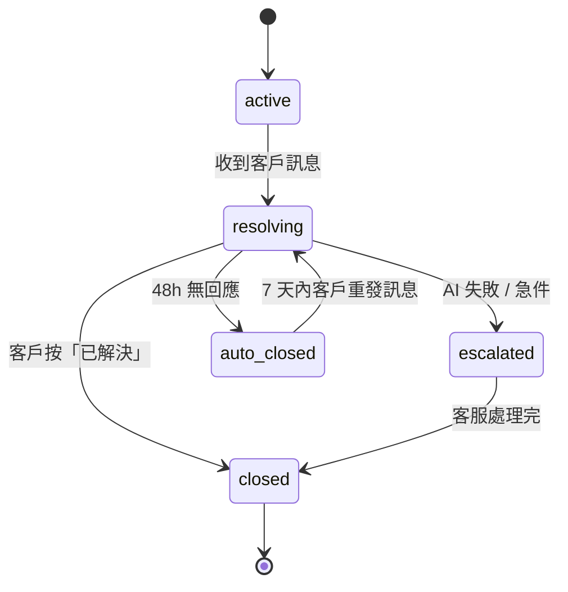
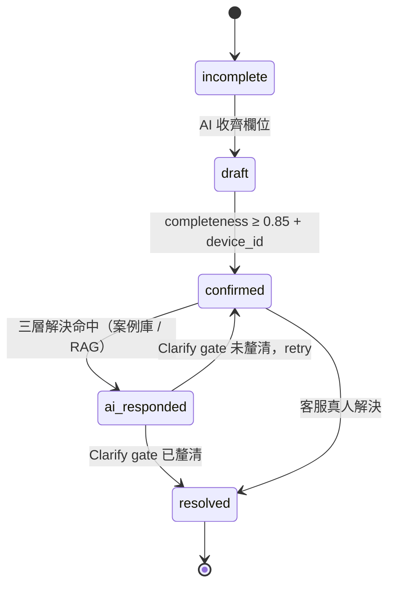
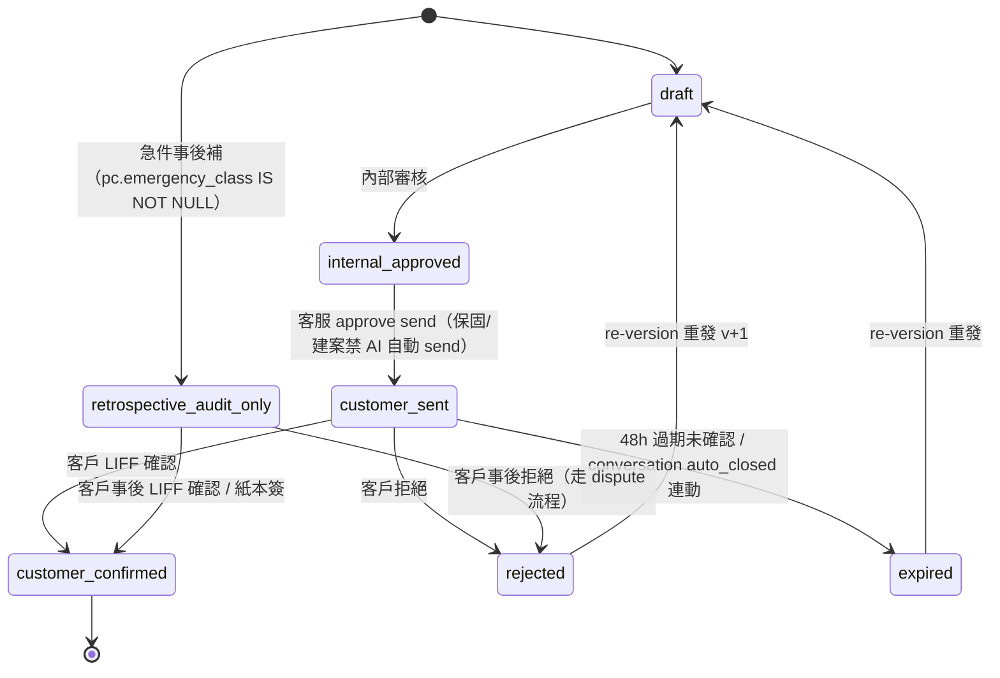
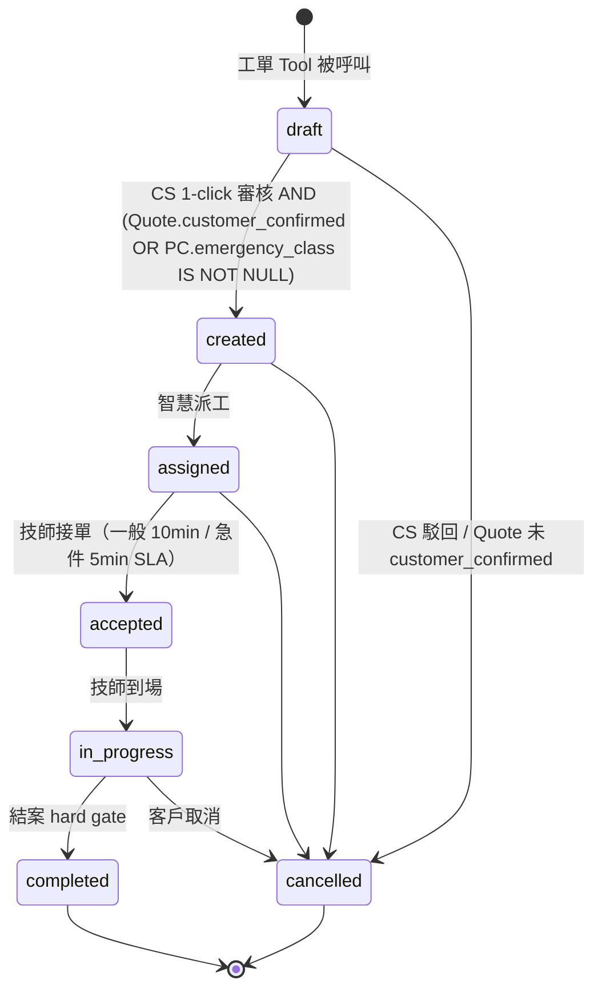
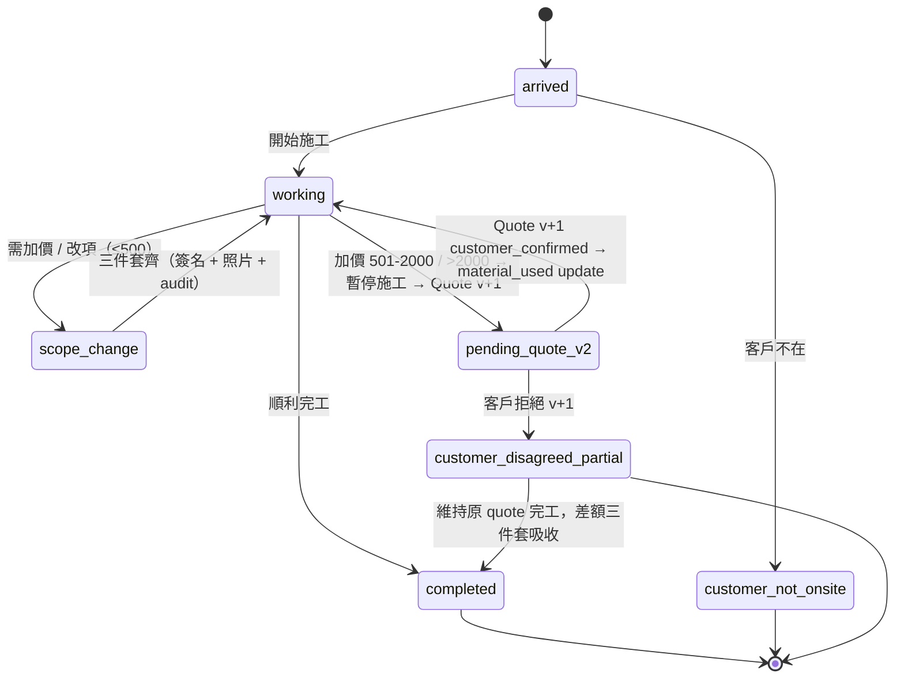
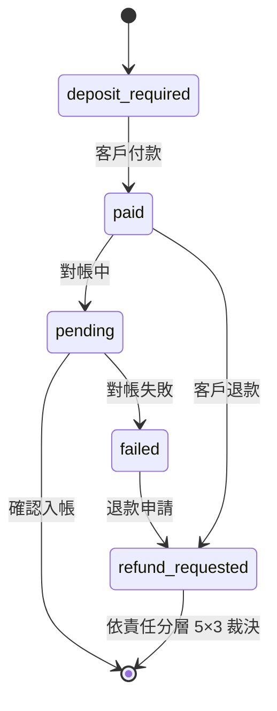
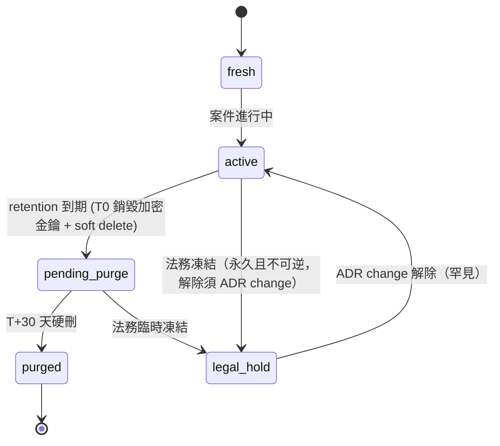

# 04 軟體需求規格書（SRS）

## §0 文件目的、範圍與編號規則

- **目的**：定義本平台「要做什麼」——逐條可驗收的功能需求（FR）、資料需求、外部介面需求與業務規則（BR）。依 ISO/IEC/IEEE 29148 定位；非功能指標一律引用 [./05_NFR.md](./05_NFR.md) 的 `NFR-*` ID，本文不重複量化。
- **讀者**：開發工程師、QA、系統分析師、UAT 負責人、跨系統整合者。
- **編號規則**：FR 依子系統分段——`FR-AGT-*`（agent）/ `FR-API-*`（api）/ `FR-WEB-*`（web）/ `FR-DAT-*`（data-pipeline）/ `FR-REF-*`（knowledge-refinery）/ `FR-TEC-*`（technician-platform）/ `FR-PLT-*`（00_platform 整合層）。業務規則沿用 `BR-<領域>-NN`。
- **與其他文件關係**：架構見 [./12_SAD.md](./12_SAD.md)；API 契約見 [./16_API_Spec.yaml](./16_API_Spec.yaml) 與 [./17_AsyncAPI.yaml](./17_AsyncAPI.yaml)；資料庫設計見 [./18_DB_Design.md](./18_DB_Design.md)；追溯矩陣見 [./21_Traceability_Matrix.md](./21_Traceability_Matrix.md)。
- **標記**：尚未落地的設計以「🔜 規劃中」標示；來源無法證實的具體數值標 `[待確認]`。

## §1 系統概觀

### 1.1 產品定位

LINE Bot AI 智慧鎖客服 agent + 派工控制平面 SaaS：消費者經 LINE 完成報修自助 → AI 三層解決或轉真人 → 問題卡（ProblemCard）→ 報價（Quote）→ 工單（WorkOrder）→ 派工媒合技師 → 到府施工存證 → 金流結算，全程可稽核。商業模式為 **License 開通**：品牌以授權開通「per-brand bundle + 綁 LINE」及附加模組（如 knowledge-refinery），經 Casdoor 訂閱管理（ADR-P003 / ADR-P005）。

### 1.2 六子系統邊界

| 子系統 | 職責 | 部署歸屬 |
|---|---|---|
| **agent**（LockCore）| LINE Bot AI 客服：`POST /callback` 進線、Turn 狀態機、Agent Skills、per-user 記憶、`transfer_to_human` 唯一出口 | per-brand bundle |
| **api**（FastAPI 控制平面）| 工單 / 派工 / 報價 / 金流 / 結算 / 知識治理 / GDPR；`API_SURFACE` 塑形 dispatch(:8001) / tech(:8002) / platform(:8003) 三面 | per-brand bundle（dispatch 面）|
| **web**（Next.js）| 一份 codebase 以 `APP_MODE` 塑 4 portal：dispatch(:3000) / tech(:3001) / landing(:3002) / platform(:3003) | per-brand（dispatch）+ 集中（其餘）|
| **data-pipeline** | Medallion（raw→bronze→silver）資料層 + 純 SQL forward-only migration + 三庫物理隔離 schema 管理 | 持久層職責（schema 由 api 擁有）|
| **knowledge-refinery** | 知識精煉 HITL：draft → 人審 → Publisher 落地（事實→pgvector、行為→skill）；License 附加模組 | 集中共用（License 附加）|
| **technician-platform** | 跨租戶技師共享池：身分/技能/授權/KYC/排班/媒合/評分/結算主體 + 獨立師傅 web | 集中共用 |
| **00_platform** | 身分 RBAC（Casdoor）、可觀測性（SigNoz/OPIK）、事件骨幹（Kafka）、Model Orchestration、工單積木引擎、Agent Config Studio | 集中共用 |

per-brand bundle = 每品牌一套物理隔離、可完整獨立部署的單體（web dispatch / api / agent / 品牌庫 pgvector / Redis / MCP-RAG server），不含師傅端（ADR-P005）。集中共用平台 = Casdoor / SigNoz / technician-platform / Kafka / 平台維運 console / Agent Config Registry。

### 1.3 平台核心 vs 領域配置分層（ADR-P009）

六大不變原語為**可重用平台核心**（FDE 永不動）：**工單引擎（flow DSL 執行器）、agent runtime（LockCore）、金流/對帳/結算軌、身分/RBAC（Casdoor）、事件骨幹（Kafka/Redis）、可觀測性（SigNoz/OPIK）**，外加技師共享池與 per-brand provisioning。**領域配置層**（FDE 每產業 4 面）：① 診斷系統（知識核心 + model 編排配方）② 知識精煉 ③ 工單/金流 flow DSL ④ 後台 UI 組裝。本文件 §3 的 FR 依此分層歸類：`FR-PLT-*` 屬平台核心，各子系統 FR 中涉產業語義者屬領域配置。

### 1.4 角色與 Actor（四方 RBAC，ADR-P006）

| 角色 | 對象 | 範圍 | 帳號來源 |
|---|---|---|---|
| **Super Admin** | 平台維運方 | 跨租戶（平台 console）| 平台建立 |
| **租戶 Admin** | 品牌方 | 單一品牌租戶內 | Casdoor org admin，自助開通帳號 |
| **派工小編** | 品牌自己的人 | 租戶內操作（派工/工單/客服）| 租戶 Admin 開通 |
| **技師（鎖匠）** | 現場師傅 | 跨租戶身分（技師平台 + Casdoor 管理）| Casdoor + 技師平台註冊 |

External actor：**消費者（LINE 用戶）**——不持平台帳號，經 LINE 綁定（`line_user_id`）互動，於 LIFF 完成報價確認與簽名。授權原則：Casdoor 發角色 claim，api 端 resource-level `role_required` enforce，**deny-by-default**。

## §2 資料需求（Domain Model）

### 2.1 業務物件與必帶欄位

多租戶邊界採**一品牌一 DB 物理隔離**（ADR-P005 / data-pipeline ADR-003）；`tenant_id` 為欄位級輔助標記（事件、跨系統投影、防禦性檢查用），非主隔離手段。

| 物件 | 類型 | 必帶欄位 |
|:---|:---|:---|
| Customer | external actor + entity | `id` / `tenant_id` / `brand_scope[]` / `locale` / `pii_retention_policy` / `line_user_id` / `phone(crypto)` / `addresses[]` |
| Site | entity | `id` / `site_group_id`（建案）/ `address(crypto)` / `geo_district` / `tenant_id` |
| Device | entity | `serial` / `brand` / `model` / `purchase_date` / `warranty_start_date` / `warranty_mode`（5 模式）/ `tenant_id` |
| Conversation | entity | `id` / `channel_type` / `summary` / `state` / `started_at` / `auto_closed_at` / `tenant_id` |
| ProblemCard | entity | `id` / `conversation_id` / `device_id` / `brand` / `model` / `symptom[]` / `urgency`（急件 4 類）/ `urgency_detected_at` / `completeness_score` / `media_refs[]` / `state` / `clarification_confirmed_at` / `clarification_attempts` / `tenant_id` |
| Quote | entity | `id` / `pc_id` / `version` / `effective_date` / `range_only`（AI 不可 final）/ `snapshot_hash`（→ `pricing_rule_snapshot`）/ `supersedes_quote_id` / `tenant_id` |
| WorkOrder | entity | `id` / `pc_id` / `state` / `state_history[]`（事件溯源 `work_order_events`）/ `address`（結案 gate）/ `idempotency_key` / `create_trigger` enum {ai_path_customer_triggered, cs_path_csagent_triggered} / `created_by` / `tenant_id` |
| Onsite | entity | `id` / `wo_id` / `arrival_proof` / `material_used[]` / `customer_signature` / `scope_change_events[]` |
| Evidence | entity | `sha256`（PK）/ `tenant_id` / `wo_id` / `retention_class` / `legal_hold` / `purged_at` / `dek_id`（envelope 加密）|
| Settlement | entity（7 帳本）| `ledger_type` / `period` / `audit_trail[]` / `partner_id` |
| ContractTemplate | entity | `id` / `tenant_id` / `partner_id` / `version` / `scope[]` / `liability_matrix` / `visibility_rule` / `sla` / `monthly_settlement_rule` |
| ChangeRequest | entity | `id` / `type`（lookup table：policy/price/pricing_rule/rbac/sla/template/contract）/ `apply_by` / `effective_date` / `audit_trail[]` |
| SOP / Skill | entity（知識資產）| `id` / `version` / `risk_level`（high/low）/ `dual_review_status` / `family_review_status` / `published_at` |
| TransferEvent | event entity | `(conversation_id, transfer_event_seq)` / `rule_triggered_by` enum {hard_rule_a..g, ai_proactive_offer, customer_explicit_request, agent_pickup}（由 deterministic rule engine 寫入）|

物理落地對齊 data-pipeline 資料表分類（A 身分/RBAC、B 對話/診斷、C 知識庫、D 技師/派工、E 報價/目錄、F 金流/結算、G 爭議/保固/合規、H 庫存/BOM、I 配置治理、J 稽核/AI 治理，合計 ~100 表跨 `public` / `saas` / `agent` 三 schema），詳見 [./18_DB_Design.md](./18_DB_Design.md)。PII 欄位（phone / address / signature）受 GDPR Art.17、個資法 §11/§27、合約 4.4(a)(d) 三層 policy 拘束；`tenant_id` 不得 nullable。

### 2.2 狀態機

#### 2.2.1 Conversation

- `auto_closed` precondition：state=resolving AND no_customer_message_since ≥ 48h；postcondition：寫 `auto_closed_at`，7 天內客戶訊息自動 reopen 回 resolving。

#### 2.2.2 ProblemCard

- `confirmed` precondition：`completeness_score ≥ 0.85` AND `device_id` non-null。
- `resolved` precondition（AI 路徑）：`clarification_confirmed_at IS NOT NULL`（AI 主動詢問「問題釐清了嗎？」且客戶答「已釐清」）。「有幫助/沒幫助」feedback 為平行品質訊號，**不可**作為 resolved trigger。CS 路徑：客服判斷已解決。
- `clarification_attempts ≥ 3` 未釐清 → 升級轉真人。

#### 2.2.3 Quote

- `customer_sent` precondition：`range_only = true`（AI 路徑）OR human approval（final quote 路徑）；**保固期內 / 建案案件的 quote，AI 永禁觸發 LIFF send**，必由客服手動 approve send（BR-Quote-003）。AI 對話中不複誦個案金額，僅 announce existence 並引導 LIFF/Flex（BR-AI-004）。
- `rejected`：客戶 LIFF 明示拒絕（reason_code ∈ {customer_rejected, customer_unreachable, quote_expired}）；可 `rejected → draft` re-version（`supersedes_quote_id` 串鏈）。
- `retrospective_audit_only`：急件（locked_out / trapped_inside / safety_risk）carve-out——WO 已建並走完 onsite 後，客服須於 onsite 結束 4h 內補 send 事後 audit quote。
- Snapshot：每筆 quote 寫 `snapshot_hash` FK → `pricing_rule_snapshot`（immutable、content-addressable by sha256、append-only）。

#### 2.2.4 WorkOrder

- 工單系統為共用 Tool，由 AI 路徑（客戶觸發）或 CS 路徑（客服觸發）呼叫；**AI 不可繞過客戶自行建單**。
- `created` precondition：`CS 1-click 通過 AND ((PC.state=resolved AND Quote.state=customer_confirmed) OR (PC.state=resolved AND PC.emergency_class IS NOT NULL))`——「客服報價 → 客人確認 → 才立工單」+ 急件 carve-out。
- `completed` precondition（結案 422 hard gate）：`address IS NOT NULL AND (Quote.state=customer_confirmed OR (PC.emergency_class IS NOT NULL AND retrospective_quote_audit_complete))`。急件事後 audit 逾 4h → alert 升級主管 review。
- 實作載體：本狀態機以 §2.3 的 flow DSL 宣告（guard/effect），語義（precondition / SLA / hard gate）為業務規則本體，不因載體而變。

#### 2.2.5 Onsite

- 金額分層：**≤500** 技師自確（三件套）；**501-2000** 暫停施工 → Quote v+1 → 客戶 LIFF 確認；**>2000** 同上 + 主管覆核 + 三方協商。
- `pending_quote_v2` 期間技師 App 顯示 blocker，不可續操作 `material_used`。
- LIFF 失敗 fallback：QR code → 客戶手機掃 LIFF → 仍失敗改紙本簽 + 拍照 + audit（等同三件套；>2000 走主管覆核）。

#### 2.2.6 Payment / Refund

- `refund_requested` 依責任歸屬 5×3=15 分層裁決。

#### 2.2.7 Evidence Lifecycle

### 2.3 工單平台宣告式狀態機（Flow-as-Blocks DSL，ADR-P010 / P011 / P014）

工單引擎把 flow 定義當**資料**解釋執行（核心產業無關，產業語義在 Vertical Pack）：

- **核心表**：`work_orders`（核心欄 + `attributes JSONB` 產業欄位 + `field_metadata` 驅動語義；`status` 值域由 flow DSL 定義，非 enum 寫死）；`work_order_events`（`id, wo_id, seq, type, actor_ref, from_status, to_status, payload, at`）為**事件溯源時間軸**；`assignee_ref` 跨系統參照技師平台（不跨庫 FK）。
- **DSL schema**：`states / transitions{from,to,on,guard,do} / sla{state,due,on_breach}`；guard 檢查 RBAC（Casdoor claim）+ precondition；`do` 執行積木（block）。
- **積木契約**：`{block, kind, inputs, preconditions, guards, effects, composed_of}`——雙層顆粒度：對外粗顆粒 domain block（dispatch / quote_approval / onsite_consent / collect_payment / settle…），內部細顆粒 primitives（query_technician / set_field / emit_event…）。契約嚴謹使 AI Onboarding Compiler（ADR-P011）產出可靜態驗證。
- **執行模型**：收到 action → 檢查 guard → 執行 block → 持久化 + 寫 `work_order_events` + 發 Kafka 事件 + 掛 SLA timer（Redis）；冪等（event seq + idempotency key）；side-effect 經 outbox。
- **逃生艙**：plugin SDK（型別安全、過審、版本化）+ webhook 外呼；**拒絕 inline code 節點**。
- **CQRS 投影**（ADR-P014）：命令端真相在品牌庫；技師視角工單投影由 Kafka 事件餵養至技師平台（欄位最小化）。
- 🔜 規劃中：DSL-first 引擎（Phase 1）→ 通用核心表重構（Phase 2）→ locksmith Vertical Pack（Phase 3）→ 拖拉 FlowEditor + AI Compiler（Phase 5）。深度參考 [../00_platform/P1/07_workorder_platform_design.md](../00_platform/P1/07_workorder_platform_design.md)。

### 2.4 領域事件目錄

**業務領域事件（品牌庫內，含 retention）：**

| Event | Retention | Trigger | Consumer |
|:---|:---|:---|:---|
| `conversation.message.received` | 1y | LINE webhook | AI agent + audit |
| `user_facts.updated` | eternal | system（SCD2）| per-user 記憶 |
| `skill.loaded` | 90d | SkillsLoader | observability |
| `problem_card.create_requested` / `.created` / `.confirmed` / `.ai_responded` | 1y | AI / system / customer | PC pipeline / UI / dispatch trigger |
| `problem_card.clarification_confirmed` / `.clarification_failed` / `.resolved` | 1y | customer / CS | resolved trigger / retry / SOP trigger |
| `work_order.create_requested` / `.created` / `.assigned` / `.accepted` / `.completed` | RMA+3y | customer 或 CS / CS / system / technician | CS 1-click queue / dispatch / 通知 / settlement |
| `evidence.uploaded` | 依 retention_class | technician / system | 稽核 + cache invalidation |
| `ai_quality.feedback` | 1y | customer | K1/K2 monitor |
| `policy.decision` | eternal | Guardrail engine | audit + observability |
| `kill_switch.activated` | eternal | ops | incident |
| `transfer_event.fired` | 1y | deterministic rule engine | 轉真人量測 |
| `contract_template.changed` | RMA+3y | API + outbox | audit + cache |
| `gdpr_forget.requested` | eternal | data subject | api GDPR cron worker |
| `legal_hold.flipped` | eternal | 法務 | push invalidation ≤ 5s |
| `purge_audit.entry` | eternal | api GDPR cron（two-phase）| ledger + hash chain |

**跨系統 Kafka 事件骨幹（ADR-P007 / P014，🔜 規劃中 Phase 2-3）：**

| Topic 群 | 方向 | 用途 |
|---|---|---|
| `technician.{registered, certified, brand_authorized, availability_changed, assignment_accepted/rejected, rating_updated, certification_revoked}` | 技師平台 → 各品牌 api | 技師狀態最終一致廣播（單一真相對外）|
| `dispatch.assigned` | 品牌 api → 技師平台 | 派工指派，觸發排班/工作量/投影更新 + 師傅推播 |
| `workorder.{dispatched, updated, completed}` | 品牌 api → 技師平台 | 技師視角工單投影（CQRS，欄位最小化）|
| `commission.accrued` / `settlement.generated` | 品牌 api ↔ 技師平台 | Billing（品牌計費）→ Settlement（技師平台結算）分離 |

事件 schema 走 schema registry + consumer-driven contract test；詳見 [./17_AsyncAPI.yaml](./17_AsyncAPI.yaml)。

## §3 功能需求（FR）

> 每條 FR 欄位：前置條件 / 主流程 / 後置條件與驗收 / 追溯。驗收細節展開於 [./20_Test_Cases.md](./20_Test_Cases.md)。

### 3.1 agent（LINE Bot AI 客服）

| 編號 | 需求 | 前置條件 | 主流程 | 後置條件與驗收 | 追溯 |
|---|---|---|---|---|---|
| FR-AGT-01 | LINE 進線與驗簽 | LINE channel 綁定 per-brand | `POST /callback` 驗 `X-Line-Signature`（失敗 400）→ 訊息型別分派（文字/照片）→ Turn | 每則訊息必有回覆（含錯誤時友善話術）；單則 ≤ 4900 字截斷 | BR-Conv-*；NFR-Perf-001 |
| FR-AGT-02 | Turn 狀態機對話編排 | webhook 已驗簽 | RESTORE→COMPACT→COMMAND→BUILD→RUN→SAVE→RESPOND→DONE；一 webhook = 一 turn | session 持久；SAVE 失敗絕不讓 turn 失敗 | agent ADR-001 |
| FR-AGT-03 | 三層解決 + Clarify gate | PC confirmed | 案例庫（相似度 ≥ 0.85）→ RAG → AI 主動詢問「問題釐清了嗎？」 | 已釐清寫 `clarification_confirmed_at`；連續 3 次未釐清升級轉真人 | BR-PC-002；UC-005 |
| FR-AGT-04 | 急件偵測強制轉真人 | Intent 階段判定急件 4 類（locked_out / trapped_inside / safety_risk / 怒客 sentiment）| bypass 三層，5min 內 transfer | TransferEvent 落檔 + `urgency_detected_at` 寫入 | BR-AI-002；合約 4.4(a) |
| FR-AGT-05 | transfer_to_human 唯一出口 + 兜底 | cs-sop 紅線命中（金錢/要真人/急件/派工）| LLM 呼叫 `transfer_to_human` → EscalationStore → `/internal/escalations/ingest`；LLM 承諾轉接未呼叫工具時由 gateway deterministic 補一筆 escalation | 需轉真人案件 100% 進後台問題卡（案子不蒸發）| NFR-Rel（05_NFR §2）|
| FR-AGT-06 | per-user 記憶 BUILD/SAVE | tenant + user_id 齊備 | BUILD 注入 `<memory>` 客戶事實；SAVE 以 LLMExtractor 抽第三人稱事實寫回 | 讀寫必帶 tenant+user_id 否則 raise（default deny）；跨 user/tenant 零洩漏 | NFR-Priv-006 |
| FR-AGT-07 | 知識取用（Skill 行為驅動 + RAG 檢索） | skill 載入成功 | cs-sop（行為/紅線決策樹）+ product-knowledge 精選事實；長尾事實經 RAG-via-MCP 語義查 pgvector 唯一語料（🔜 規劃中：`embed()` + MCP server）| references 保留為 RAG 品質 gate 通過前之 fallback | agent ADR-003/004；ADR-P001 |
| FR-AGT-08 | 工具白名單治理 | — | 客服僅開 6 工具：`read_file / list_dir / find_files / grep / web_search / transfer_to_human`（`CS_TOOL_ALLOWLIST` 單點控管）| 白名單外工具不可註冊；變更屬 architecture change 走 CIA | agent ADR-001 |
| FR-AGT-09 | 人工接管（CS takeover）| escalated=true | 每 turn 前查 `/internal/conversations/handover-state`（5s timeout, fail-soft）；接管中 AI 暫停不回覆 | 接管旗標查詢失敗不阻斷客人回覆 | FR-API-13 |
| FR-AGT-10 | 進線 debounce / dedup | — | 1.5s 訊息合併 + 24h event dedup（🔜 規劃中接入 live callback）| 連發訊息合併為單 turn；重送不重覆處理 | NFR-Perf |
| FR-AGT-11 | AI 邊界（金額/影像）| — | AI 只給價格 range 永不 final；對話不複誦個案 quote 金額；**AI 影像辨識禁用**（image 僅存證，webhook + runtime double-gate）| Guardrail 三規則 + forbidden eval 通過；violation = 0 | BR-Quote-001/002、BR-AI-004；SOW 2.1(4) |

### 3.2 api（派工控制平面）

| 編號 | 需求 | 前置條件 | 主流程 | 後置條件與驗收 | 追溯 |
|---|---|---|---|---|---|
| FR-API-01 | 問題卡收斂與確認 | agent ingest 或客服建卡 | AI 草擬卡（source='ai_line'）→ 客服補全 → completeness ≥ 0.85 confirmed | AI 永不自轉工單；confirm/convert 走客服認證端點 | BR-PC-*；FR-AGT-05 |
| FR-API-02 | 報價生命週期 | PC confirmed | draft → internal_approved → customer_sent（`POST /quotes/{id}:send-to-customer`）→ LIFF `customer-confirm`（Idempotency-Key + confirm_token TTL=48h）| `sender_role=ai_agent AND case_type∈{warranty,project}` → 403 `AI_FORBIDDEN_WARRANTY_PROJECT`；quote 內外雙視圖（客戶端不含成本欄）| BR-Quote-*；§2.2.3 |
| FR-API-03 | 定價引擎（pricing sub-module）| pricing rule 有效 | `api/pricing/` in-process 供 quote 呼叫（`PricingEngineService.calculate`）；AI agent 禁止直呼；WO/settlement 經 `quote_id`/`snapshot_hash` 引用 | pricing engine down → admin banner + 客服手填降級；override SLI > 20% 連續 7 天 → page | BR-Pricing-001~004 |
| FR-API-04 | 工單建立（CS 1-click）| Quote.customer_confirmed 或急件 | 工單 Tool draft → CS 1-click → created（§2.2.4 gate）| `create_trigger` 記錄 AI/CS 路徑；idempotency_key 防重 | BR-WO-001 |
| FR-API-05 | 自動派工 | WO created；技師池可查 | 候選池（5→10→20km 擴大）→ 5 因子權重（distance+skill+rating+load+fairness）→ tie-breaker → top-1 通知 | 通知送達 P95 ≤ 30s（急件 ≤ 15s）`[待確認]`；候選池空 → dispatch_pending + alert；急件覆寫權重（distance↓ rating↑）| BR-Disp-*；FR-TEC-03 |
| FR-API-06 | 手動派工 + 覆寫稽核 | 派工小編角色 | 小編指定技師覆寫自動建議 | 覆寫必留 audit（who/why）| BR-Disp-*；BR-RBAC |
| FR-API-07 | 接單 SLA 治理 | WO assigned | 一般 10min / 急件 5min 接單 SLA（per-brand override）；30min 無人接 → 擴大範圍 + 通知客服 | 派工→抵達 > 2hr soft SLA 標紅 + push 主管 | BR-Disp-001/002；NFR-SLA-001~003 |
| FR-API-08 | 到府存證（照片/簽名/材料）| WO in_progress | 到場證明、施工照上傳（Evidence sha256 主鍵 + envelope 加密）、材料登錄（主鎖 + >1000 零件強制 serial）、客戶簽名 | 結案前證據齊備檢核；scope change 走 §2.2.5 分層 | BR-Onsite-* |
| FR-API-09 | 結案 hard gate | in_progress | `completed` 檢核 address + quote 確認（§2.2.4）不合回 422 | 急件事後 audit 逾 4h alert | BR-WO-002/004 |
| FR-API-10 | 消費者付款 | WO completed，amount > 0 | 三軌支付（cash / Apple Pay / LINE Pay）；webhook idempotency；fallback 兩次嘗試留 audit；現金爭議進 disputes | PaymentReceived/Failed/Disputed 事件；voucher 開立 | BR-Set-*；§2.2.6 |
| FR-API-11 | 退款 / 取消費 | 退款申請 / 取消發生 | 退款依 5×3 責任分層；取消費 5 階段 system 自判 + 客服全階段可覆寫 + audit | 更正一律 reversal entry（append-only）| BR-Set-002/003、BR-WO-003 |
| FR-API-12 | 月結與 7 帳本 | 期末 | 7 帳本（Customer AR / Tech AP / Cash / Brand Settle / Dispatcher Commission / Refund / Invoice&Tax）月結批次 + 對帳例外處理 | borrow=lend；reason code 制 | BR-Set-001；NFR-Aud-002 |
| FR-API-13 | internal ingest（agent 旁路）| `X-Internal-Token` 有效 | `/internal/{conversations,escalations}/ingest`、handover-state、quotes customer-respond 共 4 端點 | fail-closed：token 未設 503 / 不符 401；常數時間比對 | FR-AGT-05/09 |
| FR-API-14 | 即時推播（WS）| 訂閱者已授權 | 10 WS 頻道；`verify_ws_token` + `authorize_channel`；服務層 publish → 訂閱者 | 🔜 規劃中：ws_hub 遷 Redis pub/sub 支援水平擴展（ADR-P007 Phase 1）| NFR-Perf-WS |
| FR-API-15 | 背景批次（11 cron worker）| dispatch 面啟動 | LINE push outbox / SLA 監測 / **GDPR 硬刪** / 自動結案 / canary 等 11 個排程 | 🔜 規劃中：分散式鎖去重（Redis）；GDPR 硬刪為 forget 流程唯一執行者 | BR-PII-003；ADR-P007 |
| FR-API-16 | GDPR forget 流程 | data subject 請求 | 受理 → legal-hold 檢查（衝突則拒絕 + 7d 內通知客戶）→ T0 銷毀 DEK + soft delete → T+30d cron 硬刪 → audit ledger | ≤ 7d 執行 OR customer notice；全程 append-only audit | BR-PII-001b/004；GDPR Art.17 |
| FR-API-17 | 保固判定 | Device.warranty_mode | 5 模式保固判定進報價/結案/退款分流 | 保固案 quote 禁 AI send（FR-API-02）| BR-Quote-003 |
| FR-API-18 | 例外審批收件匣 + SoD | 例外事件 | 例外案件（reschedule / exception_case / dispute）集中收件匣；敏感操作 `X-Initiator/X-Approver/X-Executor` 任二相同 → 403 | SoD 違反 100% 阻擋 | BR-CR-*；NFR-Aud |

### 3.3 web（多站前端）

| 編號 | 需求 | 前置條件 | 主流程 | 後置條件與驗收 | 追溯 |
|---|---|---|---|---|---|
| FR-WEB-01 | APP_MODE 多 portal | build ARG 烤入 | 一份 codebase 塑 dispatch/tech/landing/platform 4 portal；`crossModeRedirect` 路由 gate | 各 mode 只暴露白名單路由；跨端 CTA 集中解析 | web ADR-001 |
| FR-WEB-02 | 認證與路由授權 | Casdoor OIDC（🔜 規劃中授權碼流 + httpOnly cookie）| AuthGuard + rolePolicy 依角色 claim gate；未列路由 **deny-by-default** | 未授權角色不可達敏感頁；XSS 不可竊 token | ADR-P003/P006；NFR-Sec |
| FR-WEB-03 | 派工工作台 | 派工小編登入 | 工單看板 / 派工佇列 / 即時 WS 訂閱（斷線 backoff 重連、未配置靜默降級不阻塞頁面）| 即時降級 100% 不 crash | FR-API-14 |
| FR-WEB-04 | 儀表板與報表 | 角色授權 | KPI dashboard（SLA 標紅、K 系列指標）+ 報表匯出 | 數字與 API 對帳一致 | NFR-Comp |
| FR-WEB-05 | 稽核日誌檢視與匯出 | 治理層角色 | audit log 查詢 / 匯出 | 唯讀；存取行為入 access log | NFR-Aud-001 |
| FR-WEB-06 | 消費者追蹤頁（LIFF）| line_binding 有效 | 報價明細 + 條款 progressive disclosure + 確認 checkbox；工單進度追蹤 | `customer_consent_method` 區分 liff_full / flex_simple_fallback | FR-API-02 |
| FR-WEB-07 | 錯誤 / 離線頁 | — | 全域 error boundary + 離線提示 | 任何 API 失敗有友善 UI | NFR-AVAIL |

### 3.4 data-pipeline（資料層）

| 編號 | 需求 | 前置條件 | 主流程 | 後置條件與驗收 | 追溯 |
|---|---|---|---|---|---|
| FR-DAT-01 | Medallion 分層 | 5 資料源可取 | raw → bronze（真相源，bronze-only sourcing）→ silver（攤平 JSON，Python 強制覆寫 provenance）| 重跑冪等；PDF 只引 URL 不抄內容 | NFR-DQ-01~03 |
| FR-DAT-02 | 純 SQL forward-only migration | 編號登記 | `SQL/migrations/NNN-*.sql` idempotent；`schema_migrations` 表為唯一套用真相 | 🔜 規劃中：CI drift-check（registry vs `schema_migrations`）| data ADR-002；ADR-P012 |
| FR-DAT-03 | 三庫物理隔離 | — | 品牌庫 `lock_AI_data`(:5433, ~100 表) / 技師庫 `lock_tech`(:5434) / 平台庫 `lock_platform`(:5435) 物理分離 | 跨租戶 0 leakage 以物理隔離 + 三密鑰隔離驗證 | data ADR-003；ADR-P005 |
| FR-DAT-04 | pgvector 唯一事實語料 | embedding 可產 | `manual_chunks` / `case_entries` VECTOR(768) + HNSW（m=16, ef_construction=64, cosine）；案例命中門檻 ≥ 0.85 | 🔜 規劃中：`embed()` helper + cosine query + MCP server（agent ADR-004 Phase 1-2）| FR-AGT-07；FR-REF-04 |
| FR-DAT-05 | 跨系統同步鏈 | 業務事件發生 | intake 擷取 → facts master → PC 轉換 → WO 轉換 → 派工 → evidence 回寫，全鏈事件化 | 每步冪等 + outbox 保證 | §2.4 事件目錄 |
| FR-DAT-06 | 統一身分與稽核基座 | — | `users` 統一身分表；`audit_events` hash chain（append-only）；`saas.ai_decision_trace` | hash chain 完整性可驗證 | NFR-Aud-001 |

### 3.5 knowledge-refinery（知識精煉 HITL）

| 編號 | 需求 | 前置條件 | 主流程 | 後置條件與驗收 | 追溯 |
|---|---|---|---|---|---|
| FR-REF-01 | 診斷對話 + 素材汲取 | bronze 治理生效 | 診斷對話（line_chat / problem_cards）+ 產品素材（YouTube/影片/官網/手冊）→ bronze → silver | 汲取機制（api 唯讀端點 / 批次 / 事件）`[待確認]` | ADR-P001 |
| FR-REF-02 | LLM 提煉分流 | silver 就緒 | 分流為 (a) 事實（逐型號手冊 / 案例史）(b) 行為/精選（skill 規範、domain-safety、檢索程序）→ Draft Queue | append-only，不刪改既有 | agent ADR-004 |
| FR-REF-03 | HITL 審核硬 gate | draft 產出 | 審核 UI（Casdoor OIDC）呈現 diff → 核可 / 拒絕 / 退回重煉，全留 audit | **未核可零落地**（NFR-PUB-01）| ADR-P001 §3.3 |
| FR-REF-04 | Publisher 雙路落地 | 核可完成 | 事實：`embed()`（text-embedding-004）chunk+embed 灌 pgvector（必帶 tenant/brand 過濾欄）；行為：append-only git 寫 skill references/SKILL.md | Publisher 灌注前校驗 source 屬 bronze 白名單；references ↔ pgvector CI 同源檢查（🔜 規劃中）| NFR-PUB-02~04 |
| FR-REF-05 | SOP 雙審 + Family Reviewer | SOP draft risk=high | 客服主管 + Domain Expert 雙簽 → Family Reviewer 覆核（SLA 24h）→ approved 後 60s 內向量化發布 | 覆核率 100%；缺席 ≥ 24h 暫停 publish + escalate | BR-SOP-001~003；合約 4.4(d) |

### 3.6 technician-platform（技師共享池）

| 編號 | 需求 | 前置條件 | 主流程 | 後置條件與驗收 | 追溯 |
|---|---|---|---|---|---|
| FR-TEC-01 | 技師註冊（跨租戶身分）| Casdoor 可用 | 師傅 web 上線註冊 → Casdoor OIDC 建跨租戶技師身分 → profile / 技能 / 欲服務品牌 → `technician.registered` 事件 | 技師身分獨立於任何品牌租戶 | ADR-P004/P003 |
| FR-TEC-02 | KYC / 認證准入 | profile 建立 | KYC + 認證上傳（Fernet 加密敏感欄）→ 人工審核 → 認證生效 + 品牌授權 → `technician.certified` / `technician.brand_authorized` 事件 | 未過准入閘門不得進入派工候選集 | FR-TEC-03 |
| FR-TEC-03 | OHS 派工媒合 | 品牌 api 持服務憑證 | `POST /technicians:match`（技能/地區/品牌授權/可用性）→ 排序候選（評分/距離/工作量）→ OHS 契約 DTO 回品牌 ACL adapter | 同步 OHS 只做查詢/媒合；指派/接單走 Kafka 事件；品牌不直連技師庫 | ADR-P004 §3 |
| FR-TEC-04 | 接單 / 拒單 + 即時推播 | dispatch.assigned 消費 | 更新排班/工作量/投影 → WS + Redis 推播「新派工到手」→ 技師接/拒 → `technician.assignment_accepted/rejected` 回品牌 | 推播延遲見 NFR-Perf；事件可重播補投影 | ADR-P007/P014 |
| FR-TEC-05 | 技師視角工單投影（CQRS）| Kafka `workorder.*` | 訂閱各品牌工單生命週期事件 → 本地投影（摘要/地址/狀態/時窗/金額，欄位最小化）→ 師傅工作台讀投影 | 不整包複製品牌敏感資料；投影隱私審查 | ADR-P014 §2.2 |
| FR-TEC-06 | 佣金結算主體（Settlement）| `commission.accrued` 消費 | 品牌 per-job 計費（Billing 留品牌）發事件 → 技師平台彙總跨品牌 statement / 對帳 / payout | 期末 reconcile 閘門（品牌計費 vs 平台彙總）| ADR-P014 §2.1；FR-API-12 |
| FR-TEC-07 | 排班與生命週期管理 | 技師有效 | 排班/可用性設定；停權/認證撤銷即時廣播 `technician.certification_revoked` | 各品牌訂閱後更新派工可用性 | ADR-P004 §5 |

### 3.7 00_platform（平台整合層）

| 編號 | 需求 | 前置條件 | 主流程 | 後置條件與驗收 | 追溯 |
|---|---|---|---|---|---|
| FR-PLT-01 | 統一身分（Casdoor）| Casdoor HA 部署 | OAuth2/OIDC 統一發 token；org = 品牌租戶；租戶 Admin 自助開帳；各服務驗 OIDC token | 單一身分真相源；前端棄 localStorage 自解 token（🔜 規劃中授權碼流改造）| ADR-P003 |
| FR-PLT-02 | RBAC enforce | 角色 claim 可取 | 四方角色矩陣 resource-level `role_required` enforce，deny-by-default；灰度先上高風險金流/派工端點（🔜 規劃中逐端點鋪開）| 未授權寫入 100% 回 403 | ADR-P006 |
| FR-PLT-03 | License 開通與 provisioning | 品牌申請核准 | Casdoor subscription → License 開通閘門 → per-brand bundle 部署 + 建庫 + 綁 LINE（🔜 規劃中自動化 + CD，ADR-P012）| 「開通哪些模組」由 License 決定（refinery 為附加模組）| ADR-P005 |
| FR-PLT-04 | 事件骨幹（Kafka）+ 即時層（Redis）| 🔜 規劃中（Phase 1 Redis / Phase 2-3 Kafka）| Kafka 持久可重播事件骨幹；Redis WS fanout + 熱讀 cache + 分散式鎖；Postgres 讀寫分離 | 多實例無事件遺失、cron 不重複跑 | ADR-P007 |
| FR-PLT-05 | Model Orchestration Layer | LiteLLM 邊界明確化 | 供應商 = 配置（model 字串 + credential）；編排配方 per-industry 可調；多供應商 failover（FallbackProvider，🔜 規劃中接上）；快取/批次/平行工具/重試集中 | 換供應商零改碼；預設模型 Vertex `gemini-3.1-flash-lite` | ADR-P008 |
| FR-PLT-06 | 可觀測性分層 | SigNoz 部署 | SigNoz（OTel，系統層，prod 常開）收 api/agent/web/refinery trace/metric/log；OPIK（agent LLM Ops，dev 必開 / prod 環境旗標可關）| SLI dashboard：LINE push 成功率 / WS 延遲 / Vertex P99 / DB P95 / 派工事件 lag | ADR-P002 |
| FR-PLT-07 | 工單積木引擎（平台核心）| DSL schema 凍結 | §2.3 flow DSL 執行器 + 積木庫 + Vertical Pack 載入；🔜 規劃中 AI Onboarding Compiler（客戶 SOP → draft DSL → 必過人審）| 碰金流/派工/同意書的 AI 產出流程 100% 過 HITL | ADR-P010/P011 |
| FR-PLT-08 | Agent Configuration Studio | Config Registry 就緒（🔜 規劃中）| 品牌自服務調校：skill 匯入/編輯、RAG 語料檢索權限、system prompt 版本化；**受保護層（escalation / domain-safety）不可 override** + 客製層可編輯；staged rollout + eval + 選配 HITL | config 變更 100% 留 who/when/what diff/why 稽核 | ADR-P013；NFR-Aud-007 |
| FR-PLT-09 | 平台維運 console | Super Admin 登入 | 品牌申請審核、師傅平台審核、跨租戶治理 API | platform 面獨立密鑰/庫；跨庫唯讀 | api surface=platform |

## §4 外部介面需求

### 4.1 使用者介面清單

| 介面 | 使用者 | 載體 | 規格 |
|---|---|---|---|
| LINE 對話（AI 客服）| 消費者 | LINE Messaging API | 文字/照片；Flex 摘要（quote announce）|
| LIFF（報價確認 / 追蹤 / 簽名）| 消費者 | LINE LIFF | 見 [./10_UI_Spec.md](./10_UI_Spec.md) |
| 品牌營運後台 dispatch | 派工小編 / 租戶 Admin | web :3000 | 同上 |
| 師傅端（註冊/工作台/後台）| 技師 | technician-platform web :3001 | 同上 |
| 平台維運 console | Super Admin | web :3003 | 同上 |
| Landing / 品牌申請 | 潛在加盟品牌 | web :3002 | 同上 |
| refinery 審核 UI | 審核者（租戶 Admin/審核角色）| 獨立 web（License 附加）| 同上 |

### 4.2 系統介面（Integration Inventory）

| ID | 對接系統 | 方向 | 協議 | 用途 |
|---|---|---|---|---|
| INT-01 | LINE Messaging API | 雙向 | webhook（單 channel 單 URL → agent `/callback` 唯一入站門，postback 前綴 fan-out → `/internal/*`）/ Reply / Push（outbox）| 客服進線與推播 |
| INT-02 | Vertex AI / Gemini | 出站 | HTTPS（經 LiteLLM / Model Orchestration Layer）| LLM 推論（`vertex_ai/gemini-3.1-flash-lite`）+ web_search grounding + text-embedding-004 |
| INT-03 | Casdoor | 出站 | OIDC / OAuth2 | 身分 / 租戶 org / 角色 claim / License subscription |
| INT-04 | Kafka | 雙向 | Kafka protocol + schema registry | §2.4 跨系統事件骨幹（🔜 規劃中）|
| INT-05 | Redis | 內部 | RESP | WS pub/sub fanout、熱讀 cache、分散式鎖、SLA timer |
| INT-06 | SigNoz | 出站 | OTel（OTLP）| 系統層 trace/metric/log |
| INT-07 | OPIK / Comet | 出站 | SDK | agent LLM trace / prompt / eval（dev 必開 / prod 可關）|
| INT-08 | Google Maps | 出站 | REST | 派工地圖 / 距離因子（🔜 規劃中）|
| INT-09 | GCP KMS / Secret Manager | 出站 | API | per-tenant DEK envelope 加密；機密管理 |
| INT-10 | technician-platform OHS API | 內部（品牌 api → 技師平台）| REST + 服務憑證（機制 `[待確認]`：OIDC client-credentials vs internal token）| 技師查詢 / 媒合 / 排班 / 認證 |
| INT-11 | GCP（Cloud Run / Cloud SQL / GCS / Artifact）| 部署基礎 | — | 全平台部署 |
| INT-12 | 電子鎖 IoT 訊號 | 入站 | MQTT/HTTPS | 🔜 規劃中（後續版本）|
| INT-13 | 外部知識傳承平台 | 出站 | API | 🔜 規劃中（後續版本）|

### 4.3 API 邊界

REST 契約（信封 `ApiResponseGeneric{data, error}` / CursorPage / RFC7807 錯誤）見 [./16_API_Spec.yaml](./16_API_Spec.yaml)；事件契約見 [./17_AsyncAPI.yaml](./17_AsyncAPI.yaml)。服務間邊界：agent → api `/internal/*`（X-Internal-Token，api 側 fail-closed）；品牌 api → 技師平台 OHS（服務憑證）；web → api REST(OIDC) + WS。

## §5 業務規則（BR）

> policy-driven；標 🔴 者為合規紅線，**違反 = block release**。

### 對話 / 問題卡

| ID | 規則 | 引用 |
|---|---|---|
| BR-Conv-001 | 對話 48h 無回應 → auto_closed | §2.2.1 |
| BR-Conv-002 | 7d 內客戶有訊息可 reopen | §2.2.1 |
| 🔴 BR-Conv-003 | 負面情緒識別 ≥ 90%（連續 2 週 < 88% block / 4 週 < 85% incident）| 合約 4.4(a)；NFR-Comp-001 |
| BR-PC-001 | 同一 active issue 僅一張 PC；unique `(conv_id, device_id, active_status)` | §2.2.2 |
| BR-PC-002 | completeness_score ≥ 0.85 才自動派工 | §2.2.2 |
| BR-PC-003 | completeness gate 觸發 photo guide | 合約 9.3 |
| BR-PC-004 | K4 = (score ≥ 0.85 數)/(進入確認階段數)，分母排除 24h 無回應 PC | KPI |

### 報價 / AI 邊界

| ID | 規則 | 引用 |
|---|---|---|
| 🔴 BR-Quote-001 | AI 可給 range，**永禁** final 金額 / 折扣 / 保固免費承諾 | FR-AGT-11 |
| BR-Quote-002 | Guardrail 三規則（NTD 數字無修飾語 / 折扣關鍵字 / 保固免費）→ regen | NFR-Sec-006 |
| 🔴 BR-Quote-003 | 保固期內 / 建案案件 quote：AI 永禁觸發 LIFF send；server-side enforce 403 `AI_FORBIDDEN_WARRANTY_PROJECT` | FR-API-02 |
| BR-Quote-004 | LIFF 確認窗口客戶 sentiment 觸發負面 → quote 凍結 + 強制轉真人 final review | 合約 4.4(a) |
| BR-AI-004 | AI 不複誦個案 quote 金額；僅 announce existence + 引導 LIFF/Flex；AI 訊息由 server template 限定，無自由文 NTD 數字 | FR-AGT-11 |

### 工單 / 派工 / 到府

| ID | 規則 | 引用 |
|---|---|---|
| 🔴 BR-WO-001 | AI 永不直接建工單；CS 1-click 必經；`WO.created` 強制 `Quote.customer_confirmed OR emergency_class IS NOT NULL` | §2.2.4 |
| 🔴 BR-WO-002 | 結案 422 hard gate：address 必驗 AND（quote 確認 OR 急件事後 audit 完成）| §2.2.4；合約 9.3 |
| BR-WO-003 | 取消費 5 階段 system 自判 + 客服全階段可覆寫 + audit | FR-API-11 |
| BR-WO-004 | 急件 4 類 onsite 後 4h 內補事後 quote audit；逾時 alert 升主管；連續 ≥ 3 次逾時 → ChangeRequest 進主管佇列 | §2.2.3 |
| BR-Disp-001 | 接單 SLA 一般 10min / 急件 5min + per-brand override | FR-API-07 |
| BR-Disp-002 | 30min 無人接 → 擴大範圍 + 通知客服 | FR-API-05 |
| BR-Onsite-001 | scope change 三件套（簽名+照片+audit）+ 金額分層（≤500 / 501-2000 / >2000）| §2.2.5 |
| BR-Onsite-002 | 材料 owner ∈ {platform, brand, locksmith} | FR-API-08 |
| BR-Onsite-003 | 主鎖 + >1000 高價零件強制 serial 登錄 | FR-API-08 |
| BR-Onsite-004 | LIFF 確認失敗 fallback：QR → 紙本簽 + 拍照 + audit；客戶拒 v+1 → `customer_disagreed_partial` 維持原 quote 完工 | §2.2.5 |

### 定價治理

| ID | 規則 | 引用 |
|---|---|---|
| BR-Pricing-001 | pricing engine 落 `api/pricing/`；quote in-process 呼叫；AI 禁直呼；WO/settlement 經 reference；engine down → 手填降級 | FR-API-03 |
| BR-Pricing-002 | quote snapshot 採 immutable content-addressable `pricing_rule_snapshot`（sha256、append-only、不入 journal hash chain）；retention = settlement 後 5 年硬刪 | FR-API-03 |
| BR-Pricing-003 | pricing rule 變更走 `change_request.type='pricing_rule'`；審批四級：全域（平台主管+Legal+會計+Domain Expert 四簽）/ per-contract（三簽）/ 個案（客服主管單簽+audit）/ 急件加速（客服主管 + 24h backfill 會計）| FR-API-03 |
| BR-Pricing-004 | `effective_at ≥ approved_at + 24h grace`（禁 retroactive）；已 send quote 不重算；draft 重 attach 新 rule | FR-API-03 |

### 金流 / 結算

| ID | 規則 | 引用 |
|---|---|---|
| BR-Set-001 | 7 帳本制（Customer AR / Tech AP / Cash / Brand Settle / Dispatcher Commission / Refund / Invoice&Tax）| FR-API-12 |
| BR-Set-002 | append-only ledger；更正用 reversal entry | NFR-Aud-002 |
| BR-Set-003 | 退款依責任歸屬 5×3=15 分層 | FR-API-11 |
| BR-Set-004 | 車馬費 80% 技師 / 20% 平台（同區 500 / 跨區 800 / 遠距 1200，per-contract override）| FR-API-12 |
| BR-Set-005 | 佣金 Billing（品牌 per-job 計費）/ Settlement（技師平台結算主體）分離；`commission.accrued` 事件 + 期末 reconcile 閘門 | ADR-P014 |

### RBAC / 多租戶

| ID | 規則 | 引用 |
|---|---|---|
| BR-RBAC-001 | 四方角色模型（Super Admin / 租戶 Admin / 派工小編 / 技師）；Casdoor 為角色與租戶唯一來源 | ADR-P006 |
| 🔴 BR-RBAC-002 | 跨租戶零洩漏；隔離手段 = 一品牌一 DB 物理隔離 + 三密鑰隔離 | ADR-P005；NFR-Priv-006 |
| BR-RBAC-003 | 授權 enforce：resource-level `role_required`，deny-by-default；技師跨租戶授權經技師平台 + Casdoor | ADR-P006 |

### PII / Evidence（合約紅線）

| ID | 規則 | 引用 |
|---|---|---|
| 🔴 BR-PII-001a | legal-hold 永久且不可逆（解除需 ADR change）| 合約 4.4(d) |
| 🔴 BR-PII-001b | GDPR forget ≤ 7d；legal-hold 生效則拒絕並 customer notice | GDPR Art.17 |
| 🔴 BR-PII-001c | retention default 1y / RMA+3y / eternal（legal_hold）| 個資法 §11 |
| 🔴 BR-PII-001d | visibility filter 在 read 路徑且 fail-closed | 個資法 §27 |
| BR-PII-002 | fail-closed 三層（mutation full deny / read flagged full deny / read unflagged last-known-good + header）| NFR-Priv |
| BR-PII-003 | retention 掃描與硬刪由 api GDPR cron worker 統一執行（單一執行者）；其他元件不得直接 DELETE PII | FR-API-15/16 |
| BR-PII-004 | two-phase purge：T0 銷毀加密金鑰 + T+30d 硬刪 | §2.2.7 |

### AI 治理 / SOP / 知識

| ID | 規則 | 引用 |
|---|---|---|
| 🔴 BR-AI-001 | AI Forbidden 200 題 Eval pipeline，pass < 95% block deploy | NFR-Sec-007 |
| BR-AI-002 | AI 轉真人 7 條硬規則（deterministic）| FR-AGT-04/05 |
| BR-AI-003 | `rule_triggered_by` 必由 deterministic rule engine 寫入（非 LLM 自報）| §2.1 TransferEvent |
| BR-SOP-001 | 高風險 SOP（報價/退款/法律）雙審 = 客服主管 + Domain Expert | FR-REF-05 |
| 🔴 BR-SOP-002 | Family Reviewer 第二關，SLA 24h；缺席 ≥ 24h 暫停 publish + escalate；累計 ≥ 3 件未審觸發替補提名 | 合約 4.4(d) |
| BR-SOP-003 | SOP approved → 60s 內向量化發布 | FR-REF-05 |
| BR-KN-001 | bronze-only sourcing：知識內容 100% 源自 bronze；PDF 只引 URL；Publisher 灌注前校驗來源白名單 | FR-DAT-01；FR-REF-04 |
| BR-KN-002 | 未核可零落地：draft 未經 HITL 核可不得寫入 pgvector / skill | FR-REF-03 |

### ChangeRequest / 合約模板

| ID | 規則 | 引用 |
|---|---|---|
| BR-CR-001 | 政策/價格/權限/SLA/模板/合約變更走 `apply → approve → effective_date → audit` | FR-API-18 |
| BR-CR-002 | 緊急走 emergency track（簡化簽核、audit 完整）| 同上 |
| BR-CT-001~003 | ContractTemplate：CRUD 限 draft state；schema 凍結到欄位級；row-level 禁 DB 直改 + ChangeRequest 強制入口 | FR-API |
| 🔴 SOW-2.1(4) | AI 影像辨識禁用，violation count = 0（webhook + runtime double-gate）| FR-AGT-11；NFR-Sec-008 |

## §6 驗收標準

1. **FR 驗收**：§3 每條 FR 的「後置條件與驗收」欄為驗收基準；測試案例映射見 [./20_Test_Cases.md](./20_Test_Cases.md)。
2. **KPI 驗收**：K1 AI 準確率（200 題）、K3 負面情緒（100 題/月）、K8 forbidden eval（200 題，每次 deploy block gate）、K4 PC 完整率（daily）、K5 接單 SLA 達成率（daily）、K6 AI 首回應 p95、K7 uptime 30d、K9 併發峰值——量化目標見 [./05_NFR.md](./05_NFR.md)。
3. **合約紅線 100% pass**（違反 = block release）：GDPR forget 流程（FR-API-16）、影像辨識禁用（SOW 2.1(4)）、Family Reviewer 覆核（BR-SOP-002）、BR-PII-001a~d、負面情緒 ≥ 90%（BR-Conv-003）。
4. **系統級 exit criteria**：per-brand bundle 可獨立部署上線；技師平台 OHS + Kafka 契約測試通過；RBAC enforce 未授權寫入 100% 回 403。

## §7 需求追溯錨點

追溯鏈：**FR ↔ BR ↔ ADR ↔ NFR ↔ TC**，由 [./21_Traceability_Matrix.md](./21_Traceability_Matrix.md) 維護。錨點規則：

- 每條 FR 的「追溯」欄至少指向一個 BR 或 ADR。
- 合約紅線 BR（標 🔴）必須有對應 TC 且列入 release gate。
- 平台級決策以 `ADR-P001~P014` 為正典（見 [./14_ADR/](./14_ADR/)）；各子系統 ADR 見 `../{system}/P2/04_adr/`。

## §8 假設、相依與待確認清單

**假設與相依**：LINE Messaging API 配額與簽章機制穩定；Vertex AI 供應區域 asia-northeast1；Casdoor subscription 能表達 License 語義（超出時補 license 服務層）；Kafka / Redis / SigNoz 屬集中共用平台，per-brand bundle 不依賴其可獨立上線（技師派工除外）。

**待確認清單**：

| # | 項目 | 出處 |
|---|---|---|
| 1 | OHS 服務憑證機制（OIDC client-credentials vs internal token）| INT-10；FR-TEC-03 |
| 2 | refinery 診斷對話汲取機制（api 唯讀端點 / 批次匯出 / Kafka 事件）| FR-REF-01 |
| 3 | 派工通知送達時限（P95 ≤ 30s / 急件 ≤ 15s）之實測驗證 | FR-API-05 |
| 4 | 師傅即時推播（WS + Redis）之系統歸屬（技師平台自有 vs 共用）| FR-TEC-04 |
| 5 | Casdoor 跨租戶技師身分之 org 建模 | FR-TEC-01 |
| 6 | 支付 provider 最終選型（LINE Pay / Apple Pay 接入次序）| FR-API-10 |

---

*文件結尾 — 04_SRS v1.0 / 2026-07-07*
