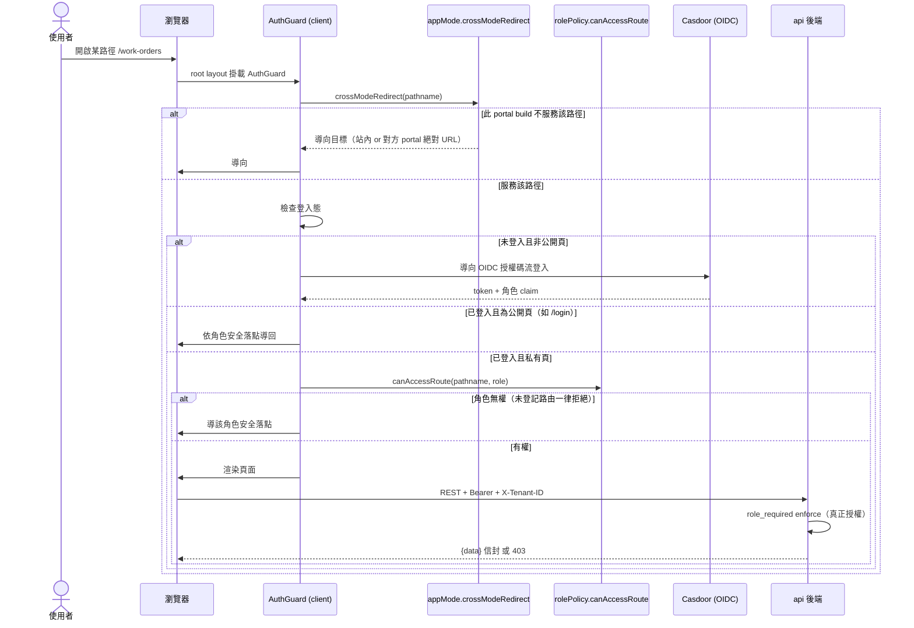
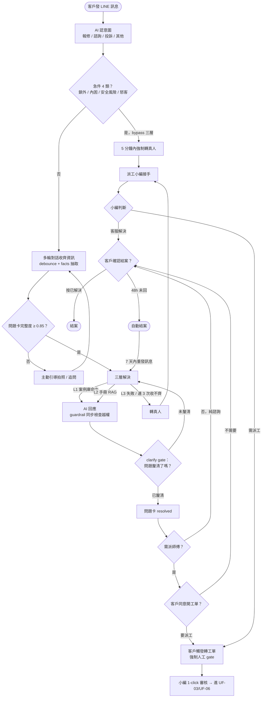
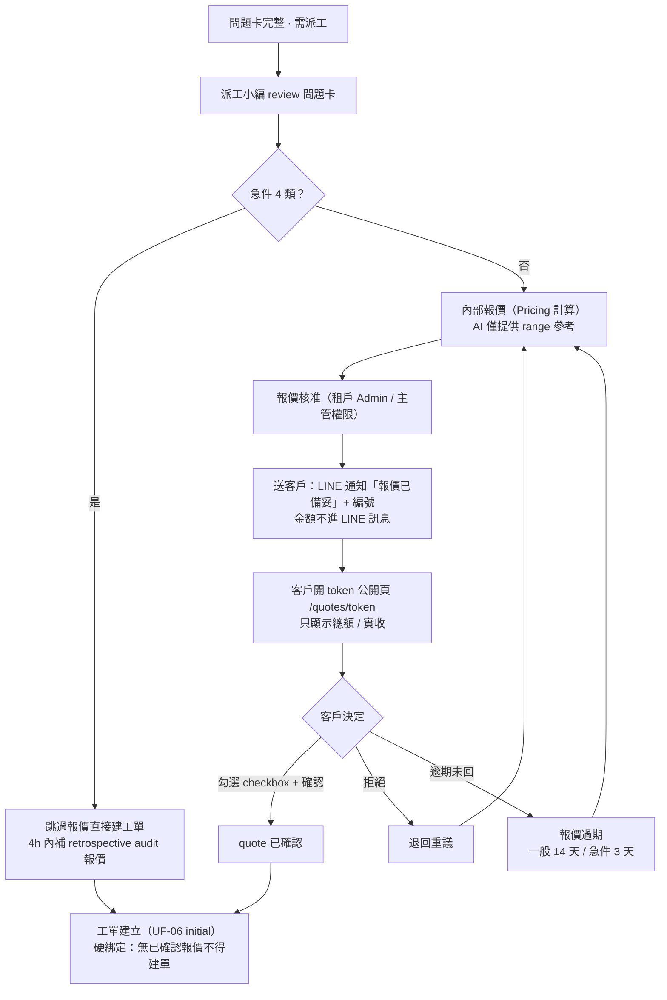
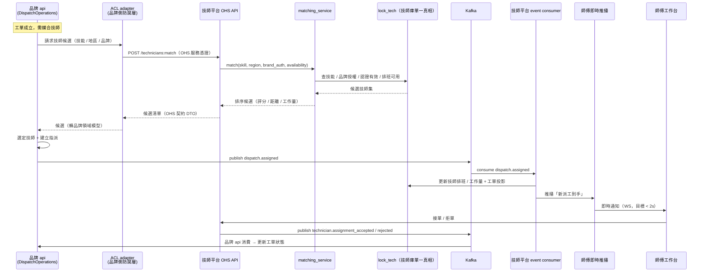
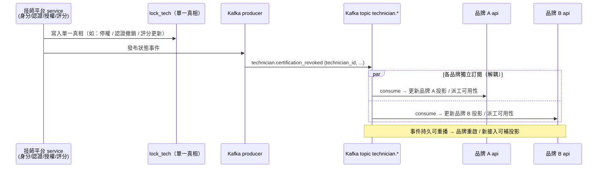

# 使用者流程 — Smart Lock AI 客服與派工 SaaS 平台

> 本文件給開發、QA、跨系統整合工程師：每個關鍵任務的逐步流程、決策分支、前置 / 後置條件、例外與錯誤路徑、系統間訊息傳遞。
> 高層旅程見 [07_Journey_Map](./07_Journey_Map.md)；頁面組織見 [09_IA](./09_IA.md)；UI 逐狀態規格屬 [10_UI_Spec](./10_UI_Spec.md)。

---

## 1. 流程總覽與命名規則

流程編號 `UF-NN`，依「角色 × 任務」矩陣組織：

| 編號 | 流程 | 主要角色 | 章節 |
|---|---|---|---|
| UF-01 | 登入與路由 gate | 全部登入角色 | §2 |
| UF-02 | 終端客戶報修（LINE → AI → 問題卡 → 接手） | 終端客戶、派工小編 | §3 |
| UF-03 | 報價與客戶確認 | 派工小編、終端客戶 | §4 |
| UF-04 | 派工媒合（OHS + 事件） | 派工小編、簽約師傅 | §5 |
| UF-05 | 師傅現場（6 子流程） | 簽約師傅 | §6 |
| UF-06 | 工單狀態機（Flow DSL） | 系統 | §7 |
| UF-07 | 帳務 / 退款 / 取消 / 加價分層 | 派工小編、租戶 Admin | §8 |
| UF-08 | 治理（品牌審核 / 師傅准入 / 配置變更） | Super Admin、租戶 Admin | §9 |
| UF-09 | 技師狀態廣播（跨品牌一致） | 系統 | §10 |
| UF-10 | 例外與邊界情境 | — | §11 |

**授權原則（全流程適用）**：認證走 Casdoor OIDC 授權碼流（🔜 全面接線規劃中），角色 claim 由 Casdoor 發；授權在 api 端 resource-level `role_required` **deny-by-default** 實際阻擋（ADR-P006）。前端各 gate（AuthGuard / appMode / rolePolicy）僅為 UX 分站與導覽過濾，不是安全邊界。

---

## 2. UF-01 登入與路由 gate 流程

web 為單一 codebase 依 `APP_MODE` build 出 4 個 portal（見 [09_IA §2](./09_IA.md)）。任一路徑進站時經三段 gate：



### 各 portal 路由範圍（appMode gate）

| mode | 允許路由 | 其餘導向 |
|---|---|---|
| `dispatch`（:3000） | 品牌營運後台全部頁群 | `/` → `/login`；`/platform/*` → `/login`；師傅路由（`/home /pool /my-orders /account`）與 `/tech-register` → 師傅 portal |
| `tech`（:3001） | 白名單：`/`、`/tech-login`、`/tech-register`、`/forgot-password`、`/reset-password` + 師傅 app 前綴 | 其餘 → dispatch portal（未配置回 `/tech-login`） |
| `platform`（:3003） | 只 `/platform/*` 頁群 | 一律 `/platform/login` |
| `landing`（:3002） | 只 `/` | dispatch portal 對應路徑 |

**前置條件**：portal 間互導 URL（`PEER/TECH/DISPATCH/PLATFORM_PORTAL_URL`）於 build 時配置。
**設計要點**：dispatch build 刻意擋 `/tech-register` 並導向師傅 portal——避免師傅註冊表單打到品牌 API，在品牌庫產生平台看不到的「幽靈師傅」。

---

## 3. UF-02 終端客戶報修流程（LINE → agent → 問題卡 → 接手）



### 關鍵規則

| 規則 | 內容 |
|---|---|
| 急件 4 類 | 意圖判定後即刻偵測，任一命中 bypass 三層、5 分鐘內轉真人 |
| AI 越權 guardrail | AI 不可自行建工單、不可說 final 報價、不可承諾免費保固——系統攔截並改口範圍價 |
| clarify gate | AI 回應後必須客戶確認「已釐清」才標 resolved；「有幫助 / 沒幫助」為平行品質訊號，不影響案件流轉 |
| 負面回饋 follow-up | 「沒幫助」+ 客戶沉默 → 30 秒內 AI 主動追問，避免沉默自動結案的 silent failure |
| 人工接手鏈（HITL） | AI 轉真人時攜帶來源標記、AI 信心值、缺失欄位清單，小編接手即見完整脈絡 |

### 系統間傳遞

- agent（LockCore）處理 LINE webhook `/callback`；對話 / 接手 / escalation / 報價互動經 `/internal/*` 服務憑證呼叫 api。
- 問題卡（problem card）是對話 → 工單的橋接實體：AI 草擬 → 小編確認；**大多數問題卡不會變工單**（L1/L2 已解決），只有需到場的才開單。

---

## 4. UF-03 報價與客戶確認流程



### 規則表

| 規則 | 內容 |
|---|---|
| Quote–WO 硬綁定 | 工單建立前置 = 報價客戶已確認；API 以 425/409 雙閘擋未確認建單；急件 4 類 carve-out（事後 4h 內補稽核報價） |
| 金額可見性 | 客戶只見總額 / 實收；內部成本拆分（品牌價 / 師傅成本 / 佣金）不出現在客戶面 |
| AI 不複誦金額 | LINE 訊息僅告知報價存在 + 編號；數字一律在簽章 token 頁 |
| 報價重版 | 重新議價產生 v+1；舊版連結自動失效並導向新版 |
| 確認頁防重送 | 確認請求帶 Idempotency-Key；報價狀態衝突回 409 並提示「報價已被重新議價」 |

現場加價（範圍變更）三段分層見 §8.3。

---

## 5. UF-04 派工媒合流程（OHS API + Kafka 事件）

品牌**不直連技師庫**：同步媒合走技師共享池 OHS API，指派 / 接單走 Kafka 事件（🔜 Kafka 事件骨幹規劃中）。完整依據：`../technician-platform/P1/05_architecture_and_design.md` §7.1。



### 要點

- **同步只做查詢 / 媒合**（讀、低延遲、即時排序，目標 p95 < 300ms `[待確認]`）；**指派 / 接單走事件**（寫、解耦、可重播、最終一致）。
- 品牌 api 以 ACL adapter 隔離技師平台契約，技師領域模型變動不外溢品牌領域。
- 拒單 / 逾時未接：回派工佇列擴大候選範圍並通知派工小編（手動派工 `admin/dispatch-manual/` 為 fallback）。
- 搶單池模式：非指定派工的案件進 `pool`，師傅主動搶單，先接先得。

---

## 6. UF-05 師傅現場流程（接單 → 到場 → 6 子流程 → 完工）

師傅端路由樹（獨立師傅 web）：`my-orders/[id]/{delay, door-check, material-request, reschedule, scope-change, signature}`。

| 步驟 | 子流程 | 觸發條件 | 規則 |
|---|---|---|---|
| 1. 接單 | — | 收到指派推播 / 搶單池 | 接單後輸入 ETA，系統經 LINE 通知客戶 |
| 2. 延遲回報 | `delay` | 塞車 / 前單超時 | 更新 ETA、通知客戶與派工小編 |
| 3. 到場 | — | 抵達現場 | 到場簽到（記錄到達時間；不做 GPS 即時追蹤） |
| 4. 門況檢查 | `door-check` | 到場例行 | 記錄門材質 / 門厚 / 遮雨等環境欄位（此時才知道的資訊此時填） |
| 5. 叫料 | `material-request` | 現場缺料 | 材料歸屬三選一（平台 / 品牌 / 師傅），月結自動分流 |
| 6. 改期 | `reschedule` | 客戶不在 / 無法施工 | 填 reason code；取消費依 UF-07 分層 |
| 7. 範圍變更 | `scope-change` | 現場需加價 | 依金額三段分層（§8.3）；客戶經 `/scope-change/[token]` 簽章同意 |
| 8. 完工 + 簽名 | `signature` | 施工完成 | 拍照上傳 → 完工報告 → 客戶簽名（唯本人，後台不可代簽）；簽名失敗走紙本 fallback + 稽核留痕 |

**後置條件（結案 hard gate）**：地址完整 + 報價已客戶確認（或急件已補 retrospective audit），任一缺 → API 回 422 強制回填後才可標 completed。

**漸進式資料蒐集原則**：派工單 6 模組（基礎案件 / 設備環境 / 類型狀態 / 免責合規 / 計費核銷 / 雙方簽認）的欄位攤平到生命週期各階段，由「該階段知道答案的角色」填寫；免責同意與簽名唯讀防偽（客戶本人於 LINE / 現場完成，後台僅顯示狀態）。

---

## 7. UF-06 工單狀態機（Flow DSL 宣告式）

工單狀態機由 **Flow DSL 宣告式定義**（ADR-P010，`status` 值域不寫死 enum），引擎執行 guard（RBAC + 前置條件）→ block → 持久化 + 事件溯源（`work_order_events`）+ Kafka 事件 + SLA timer。完整設計見 `../00_platform/P1/07_workorder_platform_design.md` §5。

### 狀態轉移表（locksmith pack）

| From | To | 事件（on） | Guard（角色 + 前置） | 執行 block |
|---|---|---|---|---|
| `created` | `dispatched` | assign | role:dispatcher；`location != null` | dispatch |
| `dispatched` | `on_site` | arrive | role:technician | onsite_consent |
| `on_site` | `in_progress` | start（線上報價與現場相符） | role:technician | — |
| `on_site` | `quoted` | requote（現場複核不符：估價誤差 / 加價 / 改項） | role:technician | build_quote |
| `quoted` | `approved` | customer_approve | 客戶確認 quote v+1（LIFF；fallback QR / 紙本） | quote_approval |
| `approved` | `in_progress` | start | role:technician | — |
| `in_progress` | `completed` | finish | 結案 gate：address + quote 已確認（或急件 retrospective audit）；缺 → 422 | capture_evidence |
| `completed` | `settled` | settle | — | collect_payment、settle |
| （任一未完工態） | `cancelled` | cancel | 取消費分層計算（UF-07）+ reason code 必填 | — |

**SLA 範例**：`dispatched` 狀態逾 2 小時未到場 → 觸發 `notify_supervisor` block。
**冪等與一致性**：事件 seq + idempotency key；side-effect 經 outbox 保證。
**前置鏈**：工單 initial 進入 `created` 的前置 = 問題卡確認 + 最低開單欄位（服務地址必填 + 聯絡人 / 電話選填）+ 完整度 gate（缺品牌 / 型號 / 症狀 / 急迫度 → 422，需主管填強制開單原因 override）**+ 線上報價已客戶確認（急件類別非空 carve-out，BR-WO-01——報價先、客戶確認後才開單派工）**。

---

## 8. UF-07 帳務 / 退款 / 取消 / 加價分層流程

### 8.1 取消費分層（5+1 階段，依工單狀態自動計算）

| 階段 | 工單狀態 | 取消費 |
|---|---|---|
| S1 線上報價未確認 | 工單未成立（報價階段） | 0 |
| S1.5 已確認未派工 | created、未 assign | 0 |
| S2 派工未出發 | dispatched（未出發） | 定額車馬費起徵（NTD 300 `[待確認]`） |
| S3 出發後未到場 | en route | 車馬費 |
| S4 到場後未施工 | on_site | 車馬費 + 檢測費 |
| S5 已施工 | in_progress | 按施工比例計費（含樓地板價） |

- 全階段派工小編可覆寫金額，**強制留 audit log**（誰 / 何時 / 原金額 / 覆寫原因）。
- reason code 必填（由租戶配置管理的 lookup 維護），缺項 → 422。
- **師傅發起取消**三軌：當月首次免責（權重微降）／同月第 2 次起扣款 + 自動改派／不可抗力上傳憑證免責 + 營運核准留痕。

### 8.2 退款核准分層（SoD 職責分離）

| 層級 | 金額帶 | 核准鏈 |
|---|---|---|
| L1 低額 | 小額（閾值由租戶配置） | 師傅可發起、派工小編核准 |
| L2–L3 中額 | 中額帶 | 派工小編發起 + 主管（租戶 Admin 權限）核准 |
| L4–L5 高額 | 高額帶 | 主管 + 財務**雙簽**（SoD） |

- SoD 三維（發起人 / 核准人 / 執行人）：同一使用者同時擔任發起 + 核准 → 系統攔截（409）。
- 退款寫入 AR ledger + audit；部分退款依責任歸屬分類。
- 各層金額閾值為租戶配置值 `[待確認]`（依品牌合約而異）。

### 8.3 現場加價三段分層（範圍變更）

| 金額帶 | 程序 |
|---|---|
| ≤ 500 | 師傅自證三件套：師傅簽名 + 照片 + audit 留痕 |
| 501–2000 | 暫停施工 → 報價 v+1 → 客戶經 `/scope-change/[token]` 簽章確認 → 續工 |
| > 2000 | 強制報價 v+1 + 營運主管覆核（三方在線）後才可續工 |

師傅單獨決定最終收款 → 系統攔截；結案金額 = 已確認報價快照 + 已簽章的範圍變更。

---

## 9. UF-08 治理流程

### 9.1 品牌申請審核（Super Admin）

```
landing 雙 CTA → platform/apply 提交申請 → platform/brand-applications 審核佇列
  → 核准 → Casdoor 建 org + License 訂閱（決定開通模組集）
  → provisioning：部署 per-brand bundle + 建品牌庫 + 綁定品牌 LINE channel + 健康檢查（🔜 自動化規劃中）
  → 租戶 Admin 首登 → 自助開帳給派工小編
```

### 9.2 師傅認證准入（Super Admin × 技師平台）

依 `../technician-platform/P1/05_architecture_and_design.md` §7.2：

1. 師傅於獨立師傅 web 註冊 → Casdoor 建跨租戶技師身分（role=technician）。
2. 建 profile（技能 / 欲服務品牌）→ 發 `technician.registered` 事件。
3. 上傳 KYC + 證照 → 敏感欄位 Fernet 加密入庫。
4. 平台管理員於 `platform/technician-approvals` 人工審核（准入閘門）。
5. 通過 → 認證生效 + 品牌授權（`technician_brand_authorized`）→ 事件廣播各品牌 → 進入派工媒合候選集。
6. 認證撤銷 / 停權：同路徑反向事件，各品牌訂閱後即時移出候選集（見 UF-09）。

### 9.3 配置變更（租戶 Admin，Agent Configuration Studio + Flow DSL）

- **Agent 調校**（skill / RAG 檢索權限 / system prompt）：品牌僅可編輯**客製層**；受保護層（escalation、domain-safety、租戶資料邊界）平台鎖死不可 override。所有變更版本化 + 可回滾 + audit；改動經 eval gate（回歸不過可擋 / 告警）；高風險改動選配 HITL 審核（ADR-P013）。
- **工單流程配置**：狀態機 / 積木以 Flow DSL 宣告（ADR-P010），變更即 pack 版本升級，經向後相容檢查後發布。
- **RBAC**：可編輯配置者 = Casdoor 租戶 Admin 角色；派工小編無配置權。

---

## 10. UF-09 技師狀態廣播與跨品牌一致流程

技師平台為技師身分**單一真相**；狀態變更以事件最終一致廣播至各品牌（🔜 Kafka 事件骨幹規劃中）。依據：`../technician-platform/P1/05_architecture_and_design.md` §7.3。



- 事件族：`technician.{registered, certified, brand_authorized, availability_changed, assignment_accepted, rating_updated, certification_revoked}`。
- 反向：品牌發 `workorder.*` / `commission.accrued` 事件 → 技師平台維護技師視角工單投影（欄位最小化）與跨品牌結算 statement（ADR-P014 CQRS）。
- 一致性語義：最終一致；品牌訂閱端當機恢復後可重播補投影。

---

## 11. UF-10 例外與邊界情境清單

| # | 情境 | 處理 | 對應流程 |
|---|---|---|---|
| 1 | 急件 4 類（含怒客） | bypass 三層、5 分鐘轉真人；跳過報價直接建單 + 4h 補稽核報價 | UF-02 / UF-03 |
| 2 | 地址缺失 | 三段補：對話追問 → 後台補 → 派工不擋；**結案時 422 硬擋** | UF-05 / UF-06 |
| 3 | 資料連 3 次收不齊 | 自動轉真人 | UF-02 |
| 4 | 報價過期 | 一般 14 天 / 急件 3 天；對話自動結案時報價同步失效 | UF-03 |
| 5 | AI 越權嘗試（final 價 / 自行建單 / 免費保固） | guardrail 系統攔截 + 改口範圍價；一律人工 gate 建單 | UF-02 |
| 6 | 現場加價未走分層 | 師傅單獨收款 → 系統攔截；必須客戶簽章 + 留痕 | UF-05 / §8.3 |
| 7 | 客戶簽名失敗 / 不在場 | 客戶手機簽章頁優先 → QR 跨裝置 → 紙本 fallback + audit | UF-05 |
| 8 | 取消費 / 退款分層違反 | 派工後 0 元取消被擋；SoD 同人發起 + 核准 → 409 | UF-07 |
| 9 | 師傅發起取消 | 首次免責 / 重複扣款 + 自動改派 / 不可抗力憑證 | UF-07 |
| 10 | 師傅拒單 / 接單逾時 | 回佇列擴大候選 + 通知派工小編；手動派工 fallback | UF-04 |
| 11 | 認證撤銷 / 技師停權 | 事件廣播 → 各品牌即時移出候選集；進行中工單改派 | UF-09 |
| 12 | 配置誤改（mis-config） | 受保護層不可 override；變更經 eval gate + 版本回滾；高風險選配 HITL | UF-08 |
| 13 | 同一對話多個問題 | 同一 active issue 只開一張問題卡；新症狀 / 新設備另開 | UF-02 |
| 14 | 跨租戶存取嘗試 | api deny-by-default 403/404 + audit 記錄違規嘗試 | 全流程 |

> 〔標注 2026-07-22：本表 #3「資料連 3 次收不齊 → 自動轉真人」與 UF-02 圖中「L3 失敗／連 3 次收不齊」分支已由 SOP 演進取代——缺項情境式一次列齊、紅線觸發即轉（[ADR-033](./14_ADR/ADR-033_轉真人判準_SOP情境式紅線_取代三輪硬計數.md)）；轉真人出口（transfer_to_human 唯一進線）與 deterministic 兜底不變。〕

---

*相關文件：[07_Journey_Map](./07_Journey_Map.md) · [09_IA](./09_IA.md) · [16_API_Spec](./16_API_Spec.yaml) · [17_AsyncAPI](./17_AsyncAPI.yaml) · 深度參考 `../00_platform/P1/07_workorder_platform_design.md`、`../technician-platform/P1/05_architecture_and_design.md`*
