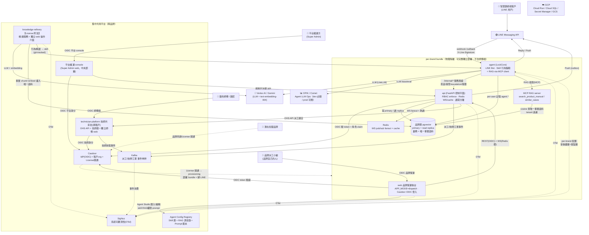
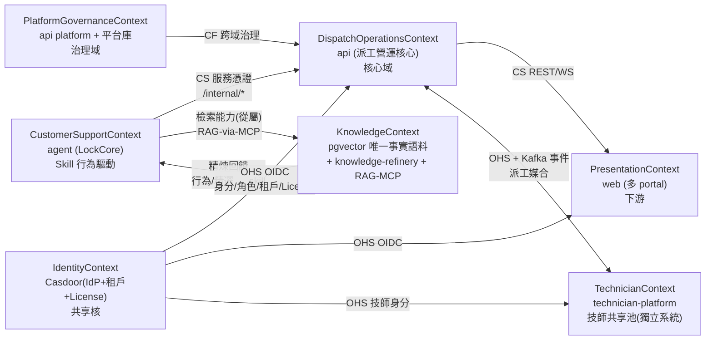
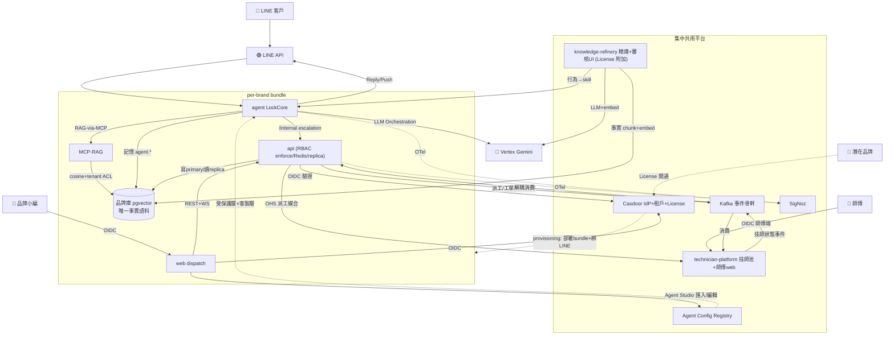

# 12. 系統架構設計文件（SAD）

> 本文件是平台架構的正典入口：C4 L1/L2、DDD Context Map、整合矩陣、資料流 DAG、部署拓撲、NFR 摘要與風險登記。逐系統深度細節請沿相對路徑進入各系統文件（`../{system}/P1/05_architecture_and_design.md`）。
> 尚未落地的能力一律標 **🔜 規劃中（Phase N）**；無法由真相源證實的數字標 `[待確認]`。

---

## 1. 文件元資訊

| 欄位 | 內容 |
|---|---|
| 涵蓋系統 | 6 個內部系統：agent / api / web / knowledge-refinery / technician-platform / data-pipeline + 集中共用平台 |
| 架構層級 | C4 L1（System Context）+ L2（Container）+ DDD 戰略設計 |
| 依據決策 | 平台級 ADR-P001~P014 + 各系統 ADR（見 §9、`./14_ADR/`） |
| 相關文件 | `./13_Security_Architecture.md`（安全架構）、`./15_SDS.md`（詳細設計）、`./05_NFR.md` |

---

## 2. 架構總覽與結構特徵

平台的三大結構特徵，皆服務於「**License 開通**」商業模式：

1. **per-brand bundle 可獨立部署**（ADR-P005）：每品牌一套物理隔離、可完整獨立部署的單體 —— web（僅品牌營運 dispatch）/ api / agent / 品牌庫 / Redis / MCP-RAG。**不含師傅端**，品牌不依賴任何共享元件即可自成一套上線。
2. **集中共用平台**（跨品牌）：Casdoor（IdP）/ SigNoz（可觀測性）/ **technician-platform（技師共享池，含獨立師傅 web）** / Kafka（事件骨幹）/ 平台維運 console，由平台方集中營運，per-brand bundle 串接之。
3. **License 附加模組**：**knowledge-refinery（知識精煉，含獨立 web 操作介面）** 為 License 開通的附加模組，非基礎部署必備。「開通哪些模組」由 License 決定，整體架構圍繞此微調。

部署形態為「**大單體 + 內部容器**」：單一部署邏輯內含容器化的內部服務，非分散式微服務網（ADR-P005 §3.2）。

---

## 3. C4 L1 — System Context

**圖例**：實線 `-->` = 已定案整合路徑；虛線 `-.->` = 監控 / 開通旁路。其中 Casdoor OIDC 全面導入、Redis/Kafka、MCP-RAG 語義層、Agent Config Registry、per-brand provisioning 為 **🔜 規劃中**（分期見 §13）。〔標注 2026-07-10：Agent Config Registry 於 §13 未排入、WBS 亦無條目——排程斷鏈待業主裁決（依 0707 裁決推定階段二）。〕

---

## 4. C4 L2 — Container 視圖（逐系統）

> 每系統完整 mermaid Container Diagram 與 L3 組件圖見 `../{system}/P1/05_architecture_and_design.md` §3-4。本節收斂為 container 清單與互動要點。

### 4.1 agent（LockCore LINE Bot AI 客服）

執行期為**單一 Python 進程**（`scripts/line_gateway.py`），單一容器映像。

| Container / 組件 | 技術棧 | Port | 說明 |
|---|---|---|---|
| line_gateway（LINE 通道 + webapp）| Python 3.11 / aiohttp / line-bot-sdk v3 | 8000（本機）/ 8080（容器）| `POST /callback` 唯一入站門 |
| AgentLoop / AgentRunner | LockCore（fork 自 `HKUDS/nanobot`）| — | Turn 狀態機 + tool-using LLM 迴圈 |
| LiteLLMProvider | litellm ≥ 1.70 | — | 單一供應商層，model 字串路由多家 |
| MemoryManager + Store / EscalationStore | SQLite FTS5 / Postgres pg_trgm | — | per-user 記憶 + 轉真人稽核 |
| SkillsLoader + 2 builtin skills | Agent Skills 標準（SKILL.md + references）| — | `locksmith-product-knowledge` / `locksmith-cs-sop` |
| 記憶 DB（Postgres schema `agent.*`）| Cloud SQL pgvector | 5432 | backend=postgres 時 |

### 4.2 api（FastAPI 派工營運控制平面）

同一 image 依 `API_SURFACE` 環境變數塑形為多個 runtime 面：

| Container | Port（本機）| 說明 |
|---|---|---|
| api dispatch surface | 8001 | 品牌營運面（Python 3.11 / FastAPI ≥0.110 / psycopg3）|
| api tech surface | 8002 | 技師面（背景 worker 全停）|
| api platform surface | 8003 | 平台治理面（獨立 JWT 密鑰）|
| 品牌庫 db（pgvector pg17）| 5433 | 業務 + 唯一事實語料 |
| 技師權威庫 tech-db | 5434 | 技師身分域 |
| 平台庫 platform-db | 5435 | 管理員 / 品牌申請 |

進程內元件：ws_hub（WS 10 頻道；🔜 規劃中遷 Redis pub/sub，ADR-P007 Phase 1）、11 個 cron worker（🔜 規劃中加分散式鎖）、中介層鏈（CORS → RequestId → Deprecation）。〔標注 2026-07-10：CR-0134（2026-07-09）已落地 Redis pub/sub 橋（opt-in）＋ PG advisory lock 領導者選舉（cron 分散式鎖）；殘項＝部署面 `REDIS_URL` 設定（OPS）與 DB 連線池（排程待業主）。〕

### 4.3 web（Next.js 多站前端）

單一 codebase 以 `APP_MODE` 建置為多 portal（web ADR-001）：〔標注 2026-07-10：ADR-028（2026-07-09）已改為四站完全獨立專案——`web/{brand-portal,tech-portal,landing,platform-console}` 各自 lockfile／Dockerfile／docker-compose，supersedes ADR-023；本段「單一 codebase 多 portal」描述已成歷史。〕

| Portal | Host Port | APP_MODE | REST base |
|---|---|---|---|
| dispatch-web | 3000 | `dispatch` | :8001 |
| tech-web（PWA 響應式）| 3001 | `tech` | :8002 |
| platform-web | 3003 | `platform` | :8003 |
| landing-web（一頁式無登入態）| 3002 | `landing` | :8001 + :8003 |

技術棧：Next.js 15 / React 19 / TypeScript strict / Tailwind v4；容器內一律 EXPOSE 8080（standalone `node server.js`）。

### 4.4 knowledge-refinery（知識精煉服務 + 審核 UI）【License 附加】

| Container | 說明 |
|---|---|
| 精煉服務 API/worker | 長駐服務 + 佇列 worker 🔜 規劃中（Phase 2）|
| 審核 web UI | Next.js，Casdoor OIDC，共用 HITL 審核骨架（ADR-P011）🔜 規劃中〔標注 2026-07-10：as-built＝FastAPI 內嵌審核 UI（:8004）；interim auth＝HS256 共驗（CR-0140 D4），Casdoor 化隨 2.1.1 R3。〕|
| raw_to_bronze / bronze_to_silver 汲取模組 | Python + Whisper ASR / Vision LLM / bs4 / Drive API |
| 提煉分流器（refiner）→ Draft Queue → Publisher | silver → 事實（灌 pgvector）+ 行為（更新 skill）🔜 規劃中 |
| storage/（raw/bronze/silver）| Medallion 檔案系統（bronze 約 115 檔）|

### 4.5 technician-platform（跨租戶技師共享池）【集中共用】

| Container | 說明 |
|---|---|
| 技師 web（technician-web）| Next.js `APP_MODE=tech`，Casdoor OIDC，跨品牌共用一套 |
| 技師平台 api | FastAPI / psycopg3；OHS API + Kafka client + OIDC 驗證 🔜 規劃中獨立部署（Phase 2）|
| 技師庫 `lock_tech` | pgvector pg17；技師身分域**單一真相** |
| 事件層（Kafka producer/consumer）| 技師狀態事件發布 + 派工/工單事件訂閱 🔜 規劃中（Phase 3）|
| 師傅即時推播（WS + Redis）| 派工到手 / 工單變更推播 🔜 規劃中 `[待確認]` 歸屬 |

### 4.6 data-pipeline（離線 Medallion 數據中台 + DB Schema）

無長駐 runtime（CLI batch + 持久資產）：

| 單元 | 說明 |
|---|---|
| `data/pipeline/{source_to_raw,raw_to_bronze,bronze_to_silver}/` | CLI batch（yt-dlp / Whisper / LLM 語意 chunking）〔標注 2026-07-10：ADR-029（2026-07-09）已將 `data/` 改名為 `knowledge-pipeline/`。〕|
| `data/llms/` | LLM provider factory（vertexai/openai/anthropic/ollama）|
| `SQL/Schema*.sql` + `SQL/migrations/*.sql` | 基底 schema（22 表 + 9 擴充）+ 87 個 forward-only migration〔標注 2026-07-10：migration 現已累計至 097。〕|
| `SQL/platform/Schema_platform.sql` | 平台庫獨立 schema（3 表）|

---

## 5. DDD 戰略設計 — Context Map

平台劃分為 **6 個限界上下文** + 1 個跨租戶共享核（IdentityContext）：

**關係模式**：PL 發布語言 · CS 客戶-供應 · ACL 防腐層 · CF 遵循者 · SK 共享核心 · OHS 開放主機服務。

- **KnowledgeContext**（agent ADR-004）：**Skill = 行為驅動**（HOW/WHEN 怎麼想、何時查）、**RAG = 檢索能力**（WHAT 事實，經 MCP 隨查隨取），兩者**從屬非收斂**。pgvector（`manual_chunks` / `case_entries`）為**唯一事實語料**，agent 經 RAG-via-MCP 取、後台 web/api 查同一份。語義層（`embed()` + cosine query + MCP server）🔜 規劃中（Phase 2）；建成前 filesystem references 為 fallback。〔標注 2026-07-10：語義層已由 CR-0124／CR-0125／CR-0142 建成（`rag/` 全鏈，249 chunk 可檢索）；主表已改名 `rag_manual_chunks`（CR-0142）。〕
- **TechnicianContext**（ADR-P004 / ADR-P014）：技師是**跨品牌身分**，獨立共享池系統；派工平台經 **OHS API + Kafka 事件**串接（非直連技師庫）。佣金採 **Billing（品牌計費）/ Settlement（技師平台結算主體）分離**；技師工單可見性採 **Kafka-fed read-model（CQRS 投影，欄位最小化）**。
- **IdentityContext**（ADR-P003）：Casdoor = IdP（OAuth2/OIDC）+ 租戶 org + 角色 claim + License 訂閱，身分/租戶/角色/授權的單一真相源。🔜 規劃中（Phase 2 導入）。

領域實體、聚合與生命週期細節見 `./15_SDS.md` 與 `./18_DB_Design.md`。

---

## 6. 系統整合矩陣

| 發送方 ↓ / 接收方 → | agent | api | web | knowledge-refinery | technician-platform | Casdoor | 品牌庫 pgvector |
|---|---|---|---|---|---|---|---|
| **agent** | — | `/internal/*` 服務憑證 | | | | | 記憶 `agent.*`；RAG-via-MCP 查語料 |
| **api** | — | — | REST(OIDC)+WS(Redis) | | OHS API 派工媒合 + Kafka | 驗 OIDC token | 寫 primary / 讀 replica |
| **web** | | REST+WS | — | | | OIDC 登入 | |
| **knowledge-refinery** | 行為/精選→skill | | | — | | | 事實 chunk+embed 灌唯一語料 |
| **technician-platform** | | 技師狀態→Kafka | | | — | OHS 技師身分 | 技師庫 `lock_tech`（自有）|
| **Kafka（事件骨幹）** | | → api/技師平台消費 | | | → 消費 | | |
| **外部 → 平台** | LINE→agent `/callback` | LINE→api postback | | | | Prospect→License 開通 | |

**外部系統整合點**

| 外部系統 | 對接 | 協議 | 方向 |
|---|---|---|---|
| LINE Messaging API | agent `/callback`（唯一入站門，agent ADR-005 / CR-0121 方案 A；橋接 fan-out 🔜 規劃中）、api push | webhook / Reply / Push | 雙向 |
| Vertex AI / Gemini | agent（LLM）、knowledge-refinery（LLM+embedding）、MCP-RAG（embed）| HTTPS | 平台 → 外部 |
| OPIK / Comet | agent（LLM Ops，dev 必開 / prod 可關）| SDK | agent → 外部 |
| GCP（Cloud Run/SQL/Secret/GCS/Artifact）| 全平台 | 部署/機密/儲存 | 部署基礎 |

---

## 7. 資料流 DAG 與依賴矩陣

**依賴矩陣**

| 來源 ↓ / 目標 → | agent | api | technician-platform | knowledge-refinery | Casdoor | Kafka | 品牌庫 |
|---|---|---|---|---|---|---|---|
| **agent** | — | /internal 服務憑證 | — | — | — | — | 記憶；RAG-MCP 查語料 |
| **api** | — | — | OHS API 派工媒合 | — | OIDC 驗證 | 發派工/工單事件 | 寫primary/讀replica |
| **web** | — | REST+WS | — | — | OIDC 登入 | — | — |
| **technician-platform** | — | — | — | — | OIDC 技師身分 | 發技師狀態事件 | 技師庫 `lock_tech`（自有）|
| **knowledge-refinery** | 行為→skill | — | — | — | — | — | 事實灌唯一語料 |
| **Agent Config Registry** | 配置(受保護+客製) | — | — | — | — | — | — |
| **Kafka** | — | 解耦消費 | 消費 | — | — | — | — |

> agent→api 為單向（服務憑證）；技師平台與派工經 **OHS API + Kafka**（非直連庫）；跨租戶隔離於 MCP-RAG 與 DB 查詢**平台鎖死**。

**關鍵資料流路徑**

1. **客戶諮詢 → AI 客服 → escalation 建工單**：LINE `/callback` → agent turn（Skill 行為驅動）→ 需事實時 RAG-via-MCP 查 pgvector 唯一事實語料（tenant ACL）→ 回覆；需真人時 `transfer_to_human` → `/internal/escalations` 建問題卡 → 進派工。受保護層（domain-safety / escalation，ADR-P013）恆生效。
2. **派工 → 技師媒合 → 完工結算（事件驅動）**：問題卡 → web(dispatch) 建工單（通用工單引擎跑 flow DSL，ADR-P010）→ api 經 OHS API 向 technician-platform 媒合 → 派工/技師狀態事件走 Kafka → 師傅於師傅 web 接單 → 完工 → 對帳結算（`commission.accrued` 事件，ADR-P014）。
3. **品牌導入（License → provisioning）**：潛在品牌 → Casdoor License 開通 → provisioning 部署 per-brand bundle + 建品牌庫 + 綁該品牌 LINE。🔜 規劃中（Phase 3 自動化）。
4. **知識精煉**：診斷對話 + 產品素材 → Medallion 提煉 → draft → 人審（HITL）→ 事實灌 pgvector + 行為更新 skill（ADR-P001）。
5. **Agent Studio 品牌自服務配置**：租戶 Admin 於 dispatch web 調 skill 客製層 / RAG 檢索權限 / system prompt → 版本化 + eval + 選配 HITL → agent 載入「受保護層 + 客製層」合成配置（ADR-P013）。

---

## 8. 部署拓撲

### 8.1 per-brand bundle（每品牌一套，物理隔離，可完整獨立部署）

| 元件 | 容器 port | 用途 |
|---|---|---|
| web | 8080 | 品牌營運後台（APP_MODE=dispatch）· OIDC 登入；不含師傅端 |
| api | 8080 | RBAC enforce · Redis WS/cache · 讀寫分離 |
| agent | 8080 | LockCore `/callback` · RAG-MCP client |
| MCP RAG server | （內部）| search_product_manual / similar_cases 🔜 規劃中（Phase 2）|
| Redis | 6379 | WS pub/sub + cache 🔜 規劃中（Phase 1）|
| 品牌庫 pgvector | 5432 | 業務 + 唯一事實語料（primary + read replica 🔜 規劃中）|

### 8.2 集中共用平台（跨品牌，各一套 HA）

| 元件 | 用途 |
|---|---|
| Casdoor | IdP + 租戶 org + License；HA（關鍵單點）🔜 規劃中（Phase 2）|
| SigNoz | 系統可觀測性（OTel 收集 + dashboard）🔜 規劃中（Phase 1）|
| technician-platform | 技師共享池服務 + 技師庫 `lock_tech` + 獨立師傅 web（單一真相）|
| 平台維運 console | Super Admin web（跨租戶治理，中央部署）|
| knowledge-refinery（License 附加）| 精煉服務 + 獨立 web 操作介面 |
| Kafka | 派工/技師/工單事件骨幹 🔜 規劃中（Phase 3）|

### 8.3 License provisioning 流程

License 開通（Casdoor subscription）→ provisioning：部署 bundle → 建品牌庫 → 綁定該品牌 LINE channel 與設定 → 健康檢查（ADR-P005 §5）。provisioning 自動化（IaC / 腳本）與 CD pipeline 為 **🔜 規劃中（Phase 3，ADR-P012）**。雲端執行環境為 GCP Cloud Run + Cloud SQL；本機開發環境以 docker compose 對齊同一拓撲模板。

---

## 9. 關鍵架構決策索引

完整 ADR 見 `./14_ADR/` 與各系統 `../{system}/P2/04_adr/`。

**平台級（ADR-P001~P014）**

| ADR | 一句話決策 |
|---|---|
| ADR-P001 | knowledge-refinery 升格獨立容器服務 + 審核 UI；事實灌 pgvector、行為更新 skill，HITL 核可後落地 |
| ADR-P002 | SigNoz 單一系統可觀測性平台（OTel，prod 常開）；OPIK 專職 agent LLM Ops（dev 必開 / prod 可關）|
| ADR-P003 | Casdoor 全包：統一 IdP（OIDC）+ 租戶 org + 角色 claim + License 訂閱開通 |
| ADR-P004 | 技師共享池升格獨立系統（跨租戶）；派工經 OHS API + Kafka 事件串接，汰除雙寫 |
| ADR-P005 | per-brand 授權部署：大單體 + 內部容器、物理隔離；集中共用元件分層；License → provisioning |
| ADR-P006 | 四方 RBAC（Super Admin / 租戶 Admin / 小編 / 技師）；resource-level enforce，deny-by-default |
| ADR-P007 | Redis（WS fanout + cache + 分散式鎖）+ 讀寫分離 + Kafka（事件骨幹）三層分期導入 |
| ADR-P008 | Model Orchestration Layer 供應商無關：供應商 = 配置（model 字串），code 不依賴任何家 SDK |
| ADR-P009 | 平台核心（FDE 永不動）vs 領域配置四面（診斷/知識/flow/UI）分層；Vertical Pack 產業包 |
| ADR-P010 | Flow-as-Blocks 宣告式 DSL、DSL-first：引擎解釋執行、粗顆粒 domain block + 細顆粒 primitives、拒 inline code |
| ADR-P011 | AI Onboarding Compiler + Block Ontology + HITL 審核（與知識精煉共用骨架）|
| ADR-P012 | 執行債清償排程：migration drift CI → API v1→v2 cutover → 基礎 CD → per-brand provisioning |
| ADR-P013 | Agent Configuration Studio：skill / RAG 權限 / prompt 品牌自服務，受保護層 + 客製層分層保護 |
| ADR-P014 | 佣金 Billing（品牌）/ Settlement（技師平台）分離；技師工單可見性 = Kafka-fed CQRS 投影 |

**系統級**

| 系統 | ADR 摘要 |
|---|---|
| agent | ADR-001 LockCore（fork nanobot）核心引擎；ADR-002 LiteLLM 統一供應商；ADR-003 Agent Skills 標準 + filesystem references；ADR-004 RAG-via-MCP 檢索 / Skill 行為分工；ADR-005 整合風格三分類（MCP vs HTTP vs 不暴露；agent = LINE 唯一入站門）|
| api | ADR-001 API_SURFACE 單體多面部署；ADR-002 psycopg3 raw SQL + 純 SQL migration；ADR-003 in-memory WS hub 與 cron worker（🔜 規劃中遷 Redis / 分散式排程）|
| web | ADR-001 單一 codebase APP_MODE 多 portal；ADR-002 純 React Context（不用狀態管理庫）；ADR-003 瀏覽器直連後端（client SPA、無 BFF）|
| data-pipeline | ADR-001 Medallion 分層數據架構；ADR-002 純 SQL forward-only migration（不用 Alembic）；ADR-003 三庫物理隔離為唯一租戶隔離策略 |

---

## 10. NFR 架構摘要

> 完整 NFR 目標與策略見 `./05_NFR.md` 與各系統 P1/05 NFR 節。此處摘平台級關鍵指標。

| 品質屬性 | 關鍵目標 | 主要策略 |
|---|---|---|
| **可用性** | LINE 每則訊息必有回覆（含友善錯誤話術）；WS 斷線靜默降級不阻塞頁面 | sentinel 攔截 + `_FALLBACK_REPLY`；旁路整合 fail-soft；Cloud Run min-instances=1；多供應商 failover（FallbackProvider）🔜 規劃中〔標注 2026-07-10：FallbackProvider 類別已存在（`lockcore/providers/fallback_provider.py`），唯 `build_provider` 尚未接線（ADR-009 附註）。〕|
| **可靠性** | 需轉真人案子 100% 進後台；跨 user / 跨 tenant 記憶零洩漏 | `transfer_to_human` 唯一出口 + deterministic 兜底補 escalation；記憶讀寫必帶 tenant+user_id（default deny）|
| **效能** | api 讀取 p95 < 300ms `[待確認]`；WS 推播 < 1s（同實例）；OHS 媒合 p95 < 300ms `[待確認]`；師傅派工推播 < 2s | pgvector HNSW（m=16, ef=64）；GET 30s cache；讀寫分離 🔜 規劃中；LLM 逾時上限 300s |
| **可擴展性** | 新增品牌 = 新增 bundle + OHS 消費者，技師平台不需 per-brand 複製 | per-brand 物理隔離線性擴展；Redis pub/sub + Kafka 解耦 🔜 規劃中（水平擴展前提）|
| **安全** | 授權 deny-by-default 資源級 enforce；三庫物理隔離 fail-closed | 見 `./13_Security_Architecture.md` |
| **可維護性** | 契約測試護跨系統邊界；skill 純標準 frontmatter 可攜；v1 端點收斂歸零 | consumer-driven contract（/internal、OHS、Kafka schema）；OpenAPI SSOT + 型別生成器 |

---

## 11. 跨系統依賴原則

- **DIP**：agent→api、api→技師平台皆經契約（`/internal/*`、OHS API），方向由不穩定指向穩定。
- **ADP**：主依賴單向（web→api→DB、agent→api、api→技師平台）；技師平台↔派工靠事件 + API，無服務循環。
- **SDP**：Casdoor / 品牌庫 / 技師平台為最穩定核心，嚴控版本；web / refinery 最不穩定、不被依賴。
- **健康機制**：契約測試（/internal、OHS、Kafka schema）、SigNoz SLI（LINE push 成功率、WS 延遲、Vertex P99、事件 lag）、Chaos 演練（Casdoor / Kafka / Vertex 故障降級）。

---

## 12. 架構風險登記表

**平台級整合風險**

| 編號 | 風險 | 緩解 |
|---|---|---|
| R-01 | Casdoor / 集中共用元件為跨品牌單點 | HA + 備份；per-brand bundle 對集中元件 fail-soft |
| R-02 | 跨系統事件（Kafka）schema 治理 | schema registry + consumer-driven 契約測試 |
| R-03 | pgvector 語義層尚未建成，事實灌注價值待兌現 | 依 agent ADR-004 分階段建 RAG-via-MCP；references 為 fallback〔標注 2026-07-10：CR-0124／CR-0125／CR-0142 已翻新 `rag/` 全鏈，249 chunk 可檢索，本風險已解除。〕|
| R-04 | 品牌自服務配置擴大攻擊面 / 品質風險 | 分層保護 + eval gate + 版本回滾 + audit（ADR-P013）|
| R-05 | flow DSL 為皇冠寶石，設計錯全鏈歪 | DSL-first（ADR-P010）：先穩引擎再疊 UI/AI |
| R-06 | 技師平台為派工關鍵依賴（可用性/延遲）| OHS API SLA + Kafka 事件降級；契約測試 |

**系統級關鍵風險（摘錄；grounded file:line 座標見下方附錄，原文封存 git `238f6fce`）**

| 系統 | 風險 | 嚴重性 | 緩解 |
|---|---|---|---|
| api | WS hub 與 cron 為進程內狀態，水平擴展會事件遺失 / cron 重跑 | 高 | Redis pub/sub + 分散式鎖（Phase 1）；擴展前 min-instances=1〔標注 2026-07-10：CR-0134（2026-07-09）已落 Redis 橋 opt-in＋PG advisory 領導者選舉；殘項＝部署面 `REDIS_URL`（OPS）與 DB 連線池（排程待業主）。〕|
| api | 單一共享 AsyncConnection 非池，高併發序列化瓶頸 | 低-中 | 連線池（隨 ADR-P007 Phase 1）|
| agent | 主 LLM 供應商中斷時降級為友善話術 | 中 | FallbackProvider + fallback presets（Phase 1）|
| agent | LLM tool-calling 不可靠（生成轉接話術卻不呼叫工具）| 低機率高影響 | deterministic 兜底補 escalation（既有控制）|
| technician-platform | 遷移期「雙寫 + 事件」雙路並存易漂移 | 高（遷移期）| 明確 cutover gate；影子並存驗證後切斷雙寫 |
| data-pipeline | migration 為 forward-only 無回滾；多庫套用一致性 | 中 | drift CI + 備份/還原 SOP 🔜 規劃中（ADR-P012）|
| web | 完成度落差（示意 UI 12 頁 / 待接入 25 頁）| 中 | `UAT_HIDE_FAKE_FLOWS` 隱藏假流程；逐項接後端 |

**as-is grounded 技術債座標**（保留自 subsystem P1/05 + P4 稽核；原文封存 git `238f6fce`，各系統 P1–P4 已整併進本組合）：

- **api**（P1/05 R-01–R-07）：RBAC shadow-mode 80+ 寫端點只檢租戶（`deps.py:189-192,225-264`）〔標注 2026-07-10：已由 CR-0127／CR-0130／CR-0131 清償（WBS 1.1.x ✅ 2026-07-09）〕；in-memory `ws_hub` + 11 cron（`ws_hub.py:1-6`、`main.py:139-141`）；單一共享 `AsyncConnection` 非池（`db.py:27,53`）；auth fail-open（`deps.py:69-73`、`auth.py:108-131`）；`API_SURFACE` 非安全邊界（`main.py:136-143`）。
- **web**：role 由 `atob` 讀**未驗簽** JWT（`api.ts:196-206`）；fallback-tenant 資料外洩 TODO（`api.ts:130`）；`rolePolicy` 未列路由 fail-open（`rolePolicy.ts:24-82`）；94 個 `page.tsx` 全 `"use client"`。
- **data-pipeline**：唯一產出鏈**已斷**（`silver→skill` 死目標 `agent/skills/data/` 不存在）；87 migrations / bronze ~115 檔；死目錄/superseded 盤點見（原）P4/08 §4。
- **knowledge-refinery**：pgvector 語義層 greenfield——`case_service.py:285` 僅關鍵字 stub、`<=>`/`vector_cosine` 零 query、`manual_chunks` 從未被查、無 `embed()`、MCP server 待建（「灌了也查不到」）。〔標注 2026-07-10：CR-0124／CR-0125／CR-0142 已翻新——`rag/` 全鏈（embed＋cosine 檢索＋MCP server）建成，249 個 chunk 可檢索；主表已改名 `rag_manual_chunks`（CR-0142）。〕

---

## 13. 演進路線

> 對應各 ADR §5 執行計畫；昂貴階段 gate 在業主同意。

### Phase 1 — 正確性與絲滑即時（本月）
- **RBAC 資源級角色守衛逐端點落地**（ADR-P006）：先高風險金流 / 派工端點。
- **Redis 上線**（ADR-P007）：ws_hub 遷 Redis pub/sub、cron 加分散式鎖、DB 連線池。
- **可觀測性接通**（ADR-P002）：agent 接 OPIK；部署 SigNoz 收 OTel。
- **knowledge-refinery 配置對齊**（ADR-P001）。

### Phase 2 — 身分 / 知識 / 技師平台（下月）
- **Casdoor 導入**（ADR-P003）：各 api 改 OIDC、web 改授權碼流、org = 品牌租戶、租戶自助開帳。
- **RAG-via-MCP 語義層**（agent ADR-004）：`embed()` + cosine query + MCP server；語料灌注。
- **technician-platform 獨立部署**（ADR-P004）：獨立服務 + 自有庫 + OHS API。
- **讀寫分離**（ADR-P007）：read replica + 讀路由。

### Phase 3 — 事件骨幹與治理健壯化（Q3）
- **Kafka 事件骨幹**（ADR-P007 / ADR-P014）：派工 / 技師 / 工單 / 佣金事件；解耦消費者。
- **per-brand provisioning 自動化 + CD pipeline**（ADR-P005 / ADR-P012）：License→部署→建庫→綁 LINE。
- **執行債清償**（ADR-P012）：migration drift CI → API v1→v2 cutover → v1 路由下線；LINE postback fan-out 橋接實作（agent ADR-005）。

---

## 14. 通用語言詞彙表

| 術語 | 定義 |
|---|---|
| **per-brand bundle** | 每品牌一套物理隔離、可完整獨立部署的容器單體（web/api/agent/品牌庫/Redis/MCP-RAG）；web 僅品牌營運 dispatch、不含師傅端；需 License 授權開通並綁定該品牌 LINE（ADR-P005）|
| **集中共用平台 / License 附加** | 跨品牌集中營運：Casdoor / SigNoz / technician-platform（含師傅 web）/ Kafka / 平台維運 console；knowledge-refinery 為 License 附加系統。「開通哪些模組」由 License 決定 |
| **Casdoor** | 統一 IdP（OAuth2/OIDC）+ 租戶 org + 角色 + License 訂閱開通（ADR-P003）|
| **四方 RBAC** | Super Admin（跨租戶）/ 租戶 Admin（自助開帳）/ 派工小編（租戶內操作）/ 技師（跨租戶身分）（ADR-P006）|
| **Skill 行為驅動** | agent 策略層：定義怎麼想、依什麼規範、何時查什麼；承載 SOP + 精選事實（agent ADR-004）|
| **RAG-via-MCP** | agent 檢索能力：pgvector 語義查找經 MCP server 暴露為工具，DB 耦合封在 server 後保住可攜性 |
| **唯一事實語料** | pgvector `manual_chunks` / `case_entries`（768 維 HNSW cosine），agent 與後台共用的單一事實來源〔標注 2026-07-10：主表已改名 `rag_manual_chunks`（CR-0142）；語義檢索鏈已由 CR-0124／CR-0125／CR-0142 建成。〕|
| **knowledge-refinery** | License 附加系統 + 獨立 web：診斷 + 素材 → 事實（灌 pgvector）+ 行為（更新 skill），HITL 審核（ADR-P001）|
| **License 開通** | 商業模式核心：品牌以 License 授權開通「基礎 bundle + 綁 LINE」及各附加模組，經 Casdoor 訂閱管理 |
| **Agent Configuration Studio** | 品牌 dispatch web 自服務調校介面 + 集中 Agent Config Registry；分層保護（受保護層不可 override）+ RBAC + eval + 選配 HITL（ADR-P013）|
| **technician-platform** | 技師共享池獨立系統（跨租戶身分/技能/認證/排班/結算）+ 獨立師傅 web；經 OHS API + Kafka 串接（ADR-P004）|
| **SigNoz / OPIK** | 分層可觀測性：SigNoz = 系統/服務層（prod 常開）；OPIK = agent LLM Ops（dev 必開 / prod 可關）（ADR-P002）|
| **Kafka / Redis** | Kafka = 派工/技師/工單事件骨幹（持久/可重播/解耦）；Redis = WS pub/sub 即時 fanout + 熱讀 cache（ADR-P007）|
| **LockCore** | agent 核心引擎，fork 自 `HKUDS/nanobot` 的最小核心套件 |
| **flow DSL / Flow-as-Blocks** | 工單生命週期 + 金流步驟的宣告式狀態機資料（states/transitions/guards/actions/SLA），通用工單引擎解釋執行（ADR-P010）|
| **Block Ontology** | 有契約的型別積木庫（版本化 + 治理），跨產業累積的藍領營運本體論（ADR-P011）|
| **Vertical Pack** | 產業配置打包：field_metadata + flow DSL + catalog + knowledge + ui_composition + blocks，品牌從產業包實例化（ADR-P009）|

---

*文件結尾 — 12_SAD.md v1.0 / 2026-07-07*
