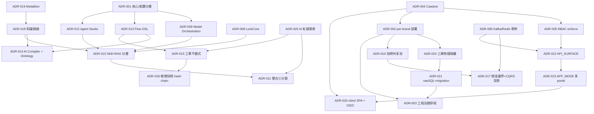

# 14_ADR 索引 — 架構決策紀錄總覽

本目錄收錄平台全部 27 篇架構決策紀錄（ADR-001 ~ ADR-027），每篇統一五段式：Status（表格欄位 + 末段附註）/ Context / Decision / Alternatives / Consequences。

**與鄰近文件邊界**：[12_SAD](../12_SAD.md) 是決策的「結果態」（結構與元件視圖），引 ADR 不重述取捨；[13_Security_Architecture](../13_Security_Architecture.md) 承載安全機制細節，ADR 只記安全決策點；[15_SDS](../15_SDS.md) 承載細部設計（DSL schema、狀態機欄位），ADR 只記「採哪條路」；純業務參數（費率階梯、SLA 時數、保固模式）屬 [03_PRD](../03_PRD.md) / [04_SRS](../04_SRS.md)，不進 ADR。

**狀態語彙**：`Accepted`（已定案且無分期）／`規劃中`（設計定案、實作分期未完）／`排程中`（執行項排程）。

## 狀態矩陣

| 編號 | 標題 | 層級 | 狀態 | 關聯 ADR |
|---|---|---|---|---|
| **群 A — 平台奠基與部署** |||||
| [ADR-001](./ADR-001_平台核心與領域配置分層.md) | 平台核心 vs 領域配置分層（TRIZ 按系統層級分離）| 平台 | Accepted | 009 · 013 · 014 · 002 |
| [ADR-002](./ADR-002_per-brand授權部署.md) | per-brand 授權部署（大單體 + 內部容器 + 集中共用元件）| 平台 | Accepted | 004 · 016 · 020 · 006 |
| [ADR-003](./ADR-003_工程治理排程_API收斂_migration_CD.md) | 平台工程治理排程（migration 防漂移・API 收斂・CD）| 平台 | 排程中 | 002 · 021 · 022 |
| **群 B — 身分與授權** |||||
| [ADR-004](./ADR-004_Casdoor統一IdP租戶License.md) | Casdoor 統一 IdP + 租戶 + License 授權 | 平台 | Accepted | 005 · 002 · 024 |
| [ADR-005](./ADR-005_四方RBAC模型與enforce.md) | 四方 RBAC 模型 + enforce（deny-by-default）| 平台 | Accepted | 004 · 016 · 022 |
| **群 C — 即時、事件與可觀測性** |||||
| [ADR-006](./ADR-006_即時高併發骨幹_Kafka_Redis_讀寫分離.md) | 即時高併發骨幹（Kafka 事件 + Redis fanout + 讀寫分離）| 平台 | 規劃中 | 002 · 016 · 017 · 007 |
| [ADR-007](./ADR-007_可觀測性分層_SigNoz_OPIK.md) | 可觀測性分層（SigNoz 系統監控 + OPIK Agent LLM Ops）| 平台 | Accepted | 002 · 009 · 012 |
| **群 D — Agent 與模型** |||||
| [ADR-008](./ADR-008_Agent核心採LockCore.md) | Agent 核心採 LockCore（fork nanobot 最小核心）| 系統(agent) | Accepted | 009 · 010 · 011 · 025 |
| [ADR-009](./ADR-009_Model_Orchestration_Layer.md) | Model Orchestration Layer 供應商無關（LiteLLM 實作）| 平台 | Accepted | 001 · 008 · 010 · 007 |
| [ADR-010](./ADR-010_知識分層_Skill行為驅動_RAG-via-MCP.md) | 知識分層：Skill 行為驅動 + RAG-via-MCP 檢索（從屬非收斂）| 系統(agent) | Accepted | 008 · 011 · 018 · 019 · 012 |
| [ADR-011](./ADR-011_Agent整合風格三分類.md) | Agent 整合風格三分類（MCP / HTTP-internal / 不暴露）| 系統(agent) | Accepted | 010 · 025 · 015 |
| [ADR-012](./ADR-012_Agent_Configuration_Studio.md) | Agent Configuration Studio 品牌自服務調校 | 平台 | Accepted | 001 · 010 · 009 · 005 · 018 |
| **群 E — 工單平台與流程自動化** |||||
| [ADR-013](./ADR-013_Flow-as-Blocks宣告式DSL.md) | Flow-as-Blocks 宣告式 DSL + 配置驅動引擎（DSL-first）| 平台 | Accepted（分期）| 001 · 014 · 015 |
| [ADR-014](./ADR-014_AI_Onboarding_Compiler_Block_Ontology.md) | AI Onboarding Compiler + Block Ontology（護城河）| 平台 | 規劃中（北極星）| 013 · 018 · 001 |
| [ADR-015](./ADR-015_工單狀態機核心不變式.md) | 工單狀態機核心不變式（locksmith flow 首個實例）| 系統(api) | Accepted | 013 · 025 · 026 |
| **群 F — 技師平台** |||||
| [ADR-016](./ADR-016_技師共享池獨立系統.md) | 技師共享池獨立系統（跨租戶單一真相）| 平台 | Accepted | 002 · 017 · 006 · 004 |
| [ADR-017](./ADR-017_技師平台佣金邊界與工單CQRS投影.md) | 技師平台佣金邊界 + 工單可見性（CQRS 投影）| 平台 | Accepted | 016(refines) · 002 · 006 |
| **群 G — 知識精煉與數據** |||||
| [ADR-018](./ADR-018_知識精煉獨立服務.md) | 知識精煉獨立服務（draft → HITL 審核 → 寫入）| 平台 | Accepted | 010 · 019 · 014 · 004 |
| [ADR-019](./ADR-019_Medallion分層數據架構.md) | Medallion 分層數據架構（raw→bronze→silver→refinery）| 系統(data) | Accepted | 018 · 010 |
| [ADR-020](./ADR-020_三庫物理隔離租戶模型.md) | 三庫物理隔離的租戶隔離模型 | 系統(data) | Accepted | 002 · 016 · 017 · 021 |
| [ADR-021](./ADR-021_psycopg3_rawSQL與純SQL_migration.md) | psycopg3 raw SQL + 純 SQL forward-only migration | 系統(api/data) | Accepted | 020 · 003 |
| **群 H — API 與 Web 形態** |||||
| [ADR-022](./ADR-022_API_SURFACE單體多面塑形.md) | API_SURFACE 單體多面塑形（一 codebase → 三暴露面）| 系統(api) | Accepted | 005 · 004 · 006 · 002 |
| [ADR-023](./ADR-023_單一codebase_APP_MODE多portal.md) | 單一 codebase 以 APP_MODE build 多 portal | 系統(web) | Accepted | 022 · 024 |
| [ADR-024](./ADR-024_client_SPA_無BFF_Context狀態_OIDC.md) | web 為 client SPA（無 BFF）+ Context 狀態 + OIDC 認證 | 系統(web) | Accepted | 023 · 004 · 005 |
| **群 I — 領域安全紅線** |||||
| [ADR-025](./ADR-025_AI話術邊界與永不自轉工單憲章.md) | AI 話術邊界與「永不自轉工單」紅線憲章 | 平台 | Accepted | 011 · 015 · 012 |
| [ADR-026](./ADR-026_報價快照hash-chain不可否認性.md) | 報價快照 hash-chain 不可否認性 | 系統(api) | Accepted | 015 · 021 |
| **群 J — 跨系統流程邊界** |||||
| [ADR-027](./ADR-027_現場報價修正發起邊界_技師平台command_品牌api權威.md) | 現場報價修正發起邊界——技師平台只發 command、品牌 api 為報價唯一權威 | 平台 | Accepted | 016 · 017 · 026 |

## 依賴關係圖

關鍵依賴語義：
- **ADR-014 依賴 ADR-013**（DSL 未穩不能先做 AI 編譯）；兩者皆屬 ADR-001 的配置層。
- **ADR-017 refines ADR-016**（補佣金邊界與工單可見性的精確界定）。
- **ADR-010 從屬 ADR-009 編排層**（RAG / skill 為編排配方的一部分）；**ADR-025 由 ADR-012 受保護層承載**。
- **ADR-006 Phase 1 為水平擴展的硬前置**；ADR-017 依賴其 Phase 2 Kafka。

## 新產業落地視角（核心永不動 vs 配置可調）

- **核心層（FDE 永不動）**：ADR-001 / 002 / 004 / 005 / 006 / 007 / 008 / 016 / 020 / 021 / 022 / 025 / 026。
- **配置層（per-industry / per-brand 可調）**：ADR-009（編排配方）/ 010（知識包）/ 012（品牌自服務）/ 013（flow DSL）/ 014（AI 編譯）；ADR-015 為 locksmith 產業包的 flow 實例。

## 舊 → 新編號對照（供既有文件交叉引用回溯）

| 新 | 舊 smartlock-docs（各系統 P2/04_adr）| 舊 docs/architecture/adr |
|---|---|---|
| ADR-001 | ADR-P009 | — |
| ADR-002 | ADR-P005 | — |
| ADR-003 | ADR-P012 | — |
| ADR-004 | ADR-P003 | 0042（RBAC 原則部分）|
| ADR-005 | ADR-P006 | 0042 / 0092 |
| ADR-006 | ADR-P007 + api ADR-003 | 0029 |
| ADR-007 | ADR-P002 | — |
| ADR-008 | agent ADR-001 | 0107（governance 索引）|
| ADR-009 | ADR-P008 + agent ADR-002 | 0003 / 0007 / 0027 |
| ADR-010 | agent ADR-003 + agent ADR-004 | 0008 / 0057 / 0058 / 0101 |
| ADR-011 | agent ADR-005 | 0009 / 0055 |
| ADR-012 | ADR-P013 | — |
| ADR-013 | ADR-P010 | — |
| ADR-014 | ADR-P011 | — |
| ADR-015 | （api P1 佐證）| 0031 / 0032 / 0066 + work-order-flow-design-rationale |
| ADR-016 | ADR-P004 | 0043 / 0061 |
| ADR-017 | ADR-P014 | 0041 / 0062 |
| ADR-018 | ADR-P001 | 0058 |
| ADR-019 | data ADR-001 | — |
| ADR-020 | data ADR-003 | 0030 |
| ADR-021 | api ADR-002 + data ADR-002 | — |
| ADR-022 | api ADR-001 | — |
| ADR-023 | web ADR-001 | 0005 |
| ADR-024 | web ADR-002 + web ADR-003 | 0011 / 0111 |
| ADR-025 | （agent ADR-005 類別 3 呼應）| 0047 / 0048 / 0063 |
| ADR-026 | — | 0064 |
| ADR-027 | —（業主裁決 2026-07-07 現場報價修正輪）| — |

> 純業務參數類舊 ADR（取消費階梯 0039/0102、退款核准階梯 0040、車馬費拆分 0041、保固起算 0044、驗收 SLA 0045、急件紅碼定義 0034、序號控管 0053 等）歸 [03_PRD](../03_PRD.md) / [04_SRS](../04_SRS.md)，不列入本決策集。

## ADR 治理規則

1. **append-only**：已 Accepted 的 ADR 不改內容；推翻須新開 ADR 並於舊檔標注 superseded_by。
2. 涉及 flow / contract / data / architecture 的變更先過 CIA，再立 ADR。
3. 每篇 ADR 的「重評觸發」條件命中時，開新 ADR 重審，不原地修改。
4. 深度細節以相對路徑指向各系統文件（`../../{system}/P1-P4/`），ADR 保持決策密度。
