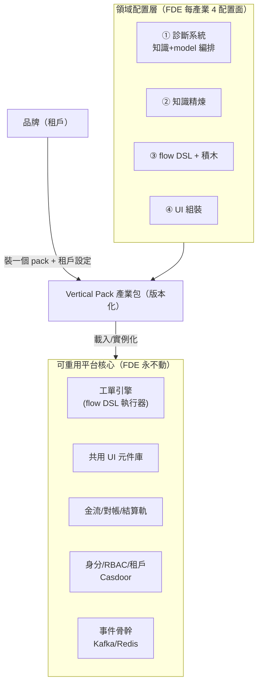
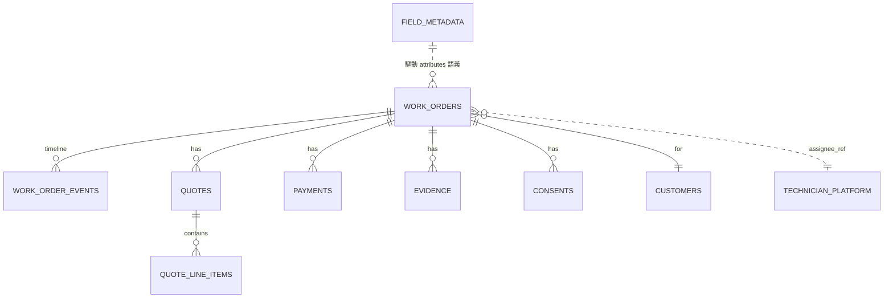
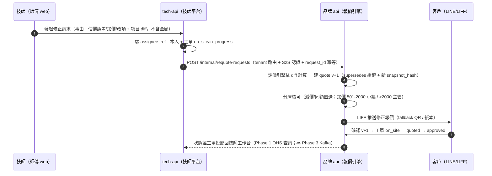
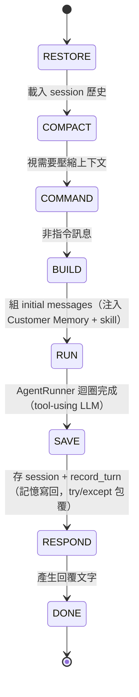
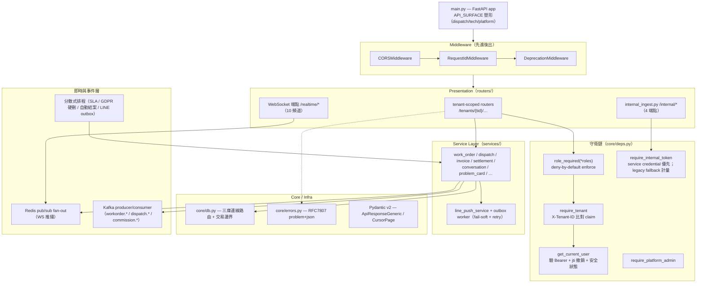
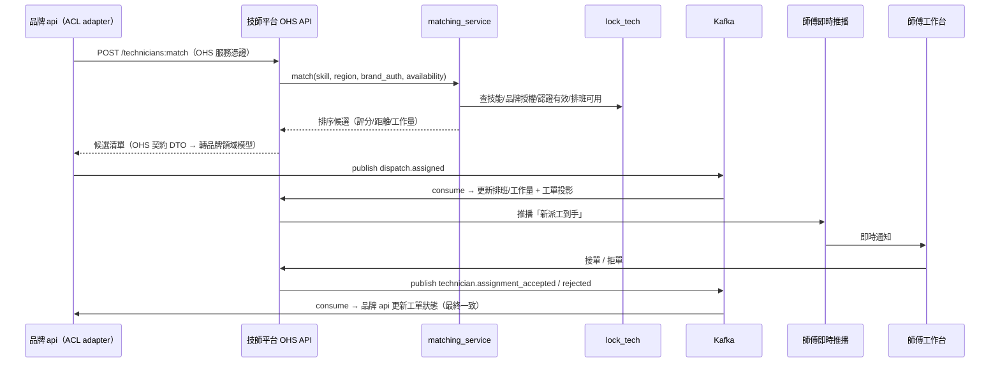

# 15. 軟體詳細設計書（SDS）

## 1. 文件元資訊與範圍

| 欄位 | 內容 |
|---|---|
| 層級 | 系統詳細設計（C3/L3 元件、狀態機、關鍵序列、健壯性機制）|
| 上位文件 | [12_SAD](./12_SAD.md)（容器級架構）· [13_Security_Architecture](./13_Security_Architecture.md)（安全政策）· [14_ADR/](./14_ADR/)（決策紀錄）|
| 下位對接 | [16_API_Spec](./16_API_Spec.yaml)（REST schema）· [17_AsyncAPI](./17_AsyncAPI.yaml)（事件契約）· [18_DB_Design](./18_DB_Design.md)（DDL/索引）· [19_Test_Plan](./19_Test_Plan.md) |
| 範圍 | 通用工單維運平台核心 + 六個子系統（agent / api / technician-platform / web / knowledge-refinery / 平台整合層）的內部元件設計 |
| 不含 | NFR 量化數字（歸 [05_NFR](./05_NFR.md)）、安全政策正文（歸 13）、API/事件 schema 正文（歸 16/17）、DDL（歸 18）、部署與維運（歸 [23](./23_Deployment_Guide.md)/[24](./24_Runbook.md)/[25](./25_Monitoring_Spec.md)）|

分階段交付註記：本書描述完整設計；標 **🔜 規劃中** 者為已定案、分期落地的元件（如 Phase 2 導入 Redis/Kafka 事件骨幹、Phase 5 導入 AI Onboarding Compiler），其餘為 Phase 1 交付範圍。

---

## 2. 設計總則

### 2.1 分層原則：可重用平台核心 vs 領域配置層（Vertical Pack）



**核心原語**：引擎只認識「工單 / 狀態機 / 派工 / 報價 / 金流 / 事件」等產業無關概念；產業知識全在 Vertical Pack。新產業 = 裝一個 pack + 輕組裝，核心零改碼（ADR-P009）。

### 2.2 設計約束（引 14_ADR）

| 約束 | 內容 | 依據 |
|---|---|---|
| 核心 vs 配置分層 | 通用核心欄 + JSONB + field_metadata；Vertical Pack 為交付單位 | ADR-P009 |
| Flow-as-Blocks | 工單/金流流程為宣告式 DSL 資料，引擎解釋執行；DSL-first（先穩引擎，後疊 UI/AI）| ADR-P010 |
| 技師共享池獨立 | technician-platform 為獨立系統，`assignee_ref` 跨系統參照不 FK；整合走 OHS API + Kafka | ADR-P004 |
| 模型編排層 | 供應商 = 配置（LiteLLM model 字串路由）、多供應商 fallback、調用效率集中最佳化 | ADR-P008 |
| 佣金/工單投影邊界 | Billing 留品牌、Settlement 歸技師平台；工單可見性走 CQRS 投影 | ADR-P014 |
| 事件與即時 | Kafka 事件骨幹 + Redis pub/sub + 讀寫分離 | ADR-P007 |

### 2.3 跨系統元件命名與依賴方向

- **DIP**：agent→api（`/internal/*` 契約）、api→technician-platform（OHS API 契約），依賴由不穩定指向穩定。
- **ADP**：主依賴單向 `web → api → DB`、`agent → api`、`api → technician-platform`；技師平台與派工靠事件 + API，無服務循環。
- **SDP**：Casdoor / 品牌庫 / technician-platform 為最穩定核心，嚴控版本；web / knowledge-refinery 最不穩定、不被依賴。
- 分層命名慣例（全系統一致）：`routers/`（HTTP 入口 + 授權）→ `services/`（業務 + SQL）→ `core/`（橫切）；services 不 import routers。

---

## 3. 通用工單維運平台詳細設計

### 3.1 領域模型（通用核心欄 + attributes JSONB + field_metadata）



核心表（產業無關；`attributes JSONB` 承載產業欄位；DDL 全文見 [18_DB_Design](./18_DB_Design.md)）：

```sql
work_orders (
  id, tenant_id, industry_pack, pack_version,
  customer_id, location JSONB,          -- 地址/geo
  status TEXT,                          -- 值域由 flow DSL 定義（非 enum 寫死）
  priority, sla_due_at,
  assignee_ref TEXT,                    -- → technician-platform（跨系統 ref，不 FK，ADR-P004）
  quote_id, settlement_id, amount,
  attributes JSONB,                     -- 產業欄位：鎖{brand,model,serial,warranty} / HVAC{unit,refrigerant}
  created_at, updated_at
)
work_order_events (id, wo_id, seq, type, actor_ref, from_status, to_status, payload JSONB, at)  -- 事件溯源時間軸
quotes(id, wo_id, status, total, attributes JSONB)   quote_line_items(id, quote_id, catalog_ref, qty, unit_price, attributes JSONB)
payments(id, wo_id, method, amount, status, …)       settlements(id, …)
evidence(id, wo_id, kind, uri, meta JSONB)           consents(id, wo_id, kind, signed_by, uri, at)
field_metadata(pack, pack_version, entity, key, label, type, required, options JSONB, validation JSONB, ui_hints JSONB)
```

設計要點：

- **核心欄位 = 各產業不變的營運骨架**（客戶/地點/狀態/指派/金額/時間軸）→ 可查詢、可索引、可報表。
- **`attributes JSONB` = 產業變動欄位**；語義由 `field_metadata` 定義（type/required/options/validation/ui_hints），驅動 `DynamicForm` / `DynamicTable` 與驗證。**加欄位不改 schema、不寫 code**。
- **`status` 值域由 pack 的 flow DSL 定義**（§3.3），不寫死 enum。
- **`assignee_ref` 跨系統參照**技師共享池（不跨庫 FK），派工經 OHS API + Kafka。
- locksmith pack 範例：智慧鎖產業欄位（`brand` / `model` / `serial` / `warranty_mode` / `door_material` / `door_thickness` / `teaching_note`）全數落於 `attributes`，語義由 `field_metadata(pack=locksmith)` 定義。

### 3.2 Vertical Pack 結構與 Manifest

```yaml
pack: locksmith
version: 1.2.0
extends: blue-collar-service@2.x     # 繼承藍領基底 pack（共用預設）
field_metadata: [ {entity: work_order, key: brand, type: enum, options: [...], required: true}, ... ]
flow: ./flow.dsl.json                # 工單+金流狀態機（§3.3）
catalog:  { services: [...], materials: [...], pricing_rules: [...] }
knowledge: { skills: [locksmith-cs-sop, locksmith-product-knowledge], rag_corpus: pgvector://locksmith }
ui_composition: { screens: [ {route: /work-orders, layout: [...component refs...]} ] }   # §3.7
blocks: [ dispatch, quote_approval, onsite_consent, collect_payment, settle, ... ]        # §3.5
```

- Pack 語意版本化；**品牌（租戶）= 裝一個 pack@version + 租戶級覆寫**（價目/SLA/品牌參數）。
- Pack 升級走版本相容流程：field_metadata / flow 的向後相容檢查通過才可發布。
- `blue-collar-service` 基底 pack 提供藍領共用預設，各垂直 `extends` 之，減少重複並餵積木飛輪。

### 3.3 Flow DSL schema（宣告式狀態機）

```json
{
  "flow": "locksmith.work_order", "version": "1.2.0", "initial": "created",
  "states": { "created": {}, "dispatched": {}, "on_site": {}, "quoted": {},
              "approved": {}, "in_progress": {}, "completed": {}, "settled": {}, "cancelled": {} },
  "transitions": [
    {"from":"created","to":"dispatched","on":"assign","guard":"role:dispatcher","do":["block:dispatch"]},
    {"from":"dispatched","to":"on_site","on":"arrive","guard":"role:technician","do":["block:onsite_consent"]},
    {"from":"on_site","to":"in_progress","on":"start","guard":"role:technician"},
    {"from":"on_site","to":"quoted","on":"requote","guard":"role:technician","do":["block:build_quote"]},
    {"from":"quoted","to":"approved","on":"customer_approve","do":["block:quote_approval"]},
    {"from":"approved","to":"in_progress","on":"start","guard":"role:technician"},
    {"from":"in_progress","to":"completed","on":"finish","do":["block:capture_evidence"]},
    {"from":"completed","to":"settled","on":"settle","do":["block:collect_payment","block:settle"]}
  ],
  "sla": [ {"state":"dispatched","due":"PT2H","on_breach":["block:notify_supervisor"]} ]
}
```

> 工單 `created` 的前置（**線上報價已客戶確認**，或急件類別非空）由開單 gate 把守（BR-WO-01），不在 FSM 值域內；`on_site → quoted → approved` 為**現場報價修正輪**——線上估價與現場不符（報錯 / 加價 / 改項）時建 quote v+1 由客戶再確認，無異動則 `on_site → in_progress` 直進。

**DSL 四約束**（皆為第一約束，ADR-P010）：AI 可生成 · 人可編輯 · 引擎可執行 · 可驗證（匯入時檢查積木契約 + 商業不變式）。拖拉 FlowEditor 為薄編輯器，只產出/編修 DSL（🔜 規劃中，Phase 2 疊加）。

### 3.4 引擎執行模型

1. 載入 pack flow → 建狀態機。
2. 收到 action/event → **檢查 guard**（RBAC via Casdoor claim + precondition）→ **執行 block**（block 內跑 primitives）→ **持久化狀態** + **寫 `work_order_events`（事件溯源）** + **發 Kafka 事件** + **掛 SLA timer**（Redis/排程）。
3. **冪等**：event seq + idempotency key；**side-effect 經 outbox 保證**（見 §12）。

**執行後端裁定（設計定論）**：flow DSL 自建（DSL 是皇冠寶石——需 AI 可生成 + 拖拉編輯 + 藍領語義，不外包給 BPMN）；executor 自建輕量實作、**與 DSL 解耦，保留 Temporal 為可替換後端**——工單狀態機多為人驅動的狀態轉移 + SLA + 經 Kafka 的 side-effect，不需 durable/saga 重武器；未來出現長流程/複雜補償再換後端，DSL 不動。

### 3.5 積木契約與雙層積木

```json
{ "block":"dispatch", "kind":"domain",
  "inputs": {"technician_ref":"required","window":"optional"},
  "preconditions": ["wo.status==created","wo.location!=null"],
  "guards": ["role:dispatcher"],
  "effects": ["set assignee_ref","emit dispatch.assigned","kafka:dispatch.assigned"],
  "composed_of": ["primitive:query_technician","primitive:set_field","primitive:emit_event"] }
```

**雙層顆粒度（設計定論）**：對外（拖拉 / AI 編譯）只暴露**粗顆粒 domain block**（派工/技師媒合/到府同意/報價核准/收款/對帳結算/通知/escalation）——老闆看得懂「派工」，看不懂「emit event」，避免拖拉爆炸；內部由**細顆粒 primitives**（發通知/查技師/狀態轉移/寫欄位/外呼）組成，平台團隊以 primitives 組合出新 domain block——這是積木飛輪（ADR-P011）的實作機制。契約嚴謹（inputs/preconditions/guards/effects 明確）是 AI 可安全編譯的前提：匯入時可靜態驗證。

### 3.6 逃生艙（plugin SDK / webhook）

**設計定論**：依風險分流、**拒絕 inline code 節點**（任意執行的安全/維運風險，且 AI 生成難以靜態驗證，違反 DSL 可驗證約束）。

| 場景 | 逃生艙 | 治理 |
|---|---|---|
| 需與核心資料/交易緊耦合的自訂邏輯 | **plugin SDK**：註冊型別安全的自訂 block | 過審 + 版本化 + 進 Block Ontology |
| 只需呼叫品牌自有系統/展示邏輯 | **webhook 外呼**：flow 呼外部 HTTP，邏輯在客戶側 | 最鬆耦合，核心不擔責 |

### 3.7 後台呈現分層（兩層渲染）

- **共用元件庫（核心，不隨產業改）**：`DynamicForm` / `DynamicTable`（吃 field_metadata）· `WorkOrderBoard`（按 flow 狀態的看板）· `DispatchConsole` · `QuotePanel` · `FinancePanel` · `EvidenceViewer` · `CustomerTimeline` · `FlowEditor`（🔜 規劃中）。
- **欄位層 = 配置驅動**：產業欄位透過 `field_metadata` 由 DynamicForm/Table 自動渲染（免 code）。
- **畫面層 = 元件組裝**：`ui_composition` 用元件庫組裝該產業後台畫面 + 少量自訂 panel（垂直逃生艙）→ FDE 第 ④ 配置面（輕前端）。

**FDE 新產業 workflow（4 配置面）**：① field_metadata → ② 知識精煉（skills + RAG 語料）→ ③ flow DSL（DSL-first 手寫 + 選用積木）→ ④ ui_composition → 打包 Vertical Pack@version → 品牌實例化。核心引擎/元件庫/金流軌/RBAC/事件骨幹全不動。

---

## 4. 工單狀態機與生命週期

### 4.1 核心工單狀態機（Flow DSL 值域）

核心值域由 §3.3 的 flow DSL 定義：

```
created → dispatched → on_site → in_progress → completed → settled     ← 主路徑
on_site → quoted → approved → in_progress                              ← 現場報價修正輪（線上報價與現場不符時）
（任一非終態 → cancelled；created 前置＝線上報價已客戶確認或急件，BR-WO-01）
```

〔標注 2026-07-10 業主裁決——階段一 as-built 對映：本節 flow DSL 值域（dispatched／on_site／quoted／approved／settled）依 18_DB「status 值域由 flow DSL 定義」與 WBS 4.1，屬 **M4 flow DSL 引擎 to-be**；階段一實作值域＝created／assigned／accepted／in_progress／completed／confirmed／cancelled（api/services/work_order_service.py），全值域切換隨 M4 落地。現行對映：on_site≡in_progress（現場作業）、quoted→approved 修正輪發生在 **quote 層狀態機**（工單停留 in_progress，CR-0144／ADR-027）、settled≡confirmed＋月結鏈。〕

`status` 不是資料庫 enum——引擎依 pack flow DSL 驗證每次轉移的 `on` 事件、`guard` 與 block preconditions；換 pack 即換值域，核心 code 不改。

### 4.2 locksmith Vertical Pack 狀態細化

以下為 locksmith pack 對核心狀態機的細粒度設計（pack 級配置，非核心）；凡與 §4.1 核心值域衝突，以 Flow DSL 為準。

**設計原則（pack flow 的骨架）**：

1. **漸進式資料蒐集**——欄位在「自然產生的那一刻」由「知道它的角色」填：線上報價確認（客戶）→ 開單（客服）→ 派工（調度）→ 現場（技師，含現場報價複核）→ 完工回報 → 計費 → 客戶簽收。免責/個資簽名必由客戶本人於 LINE 完成（後台唯讀，代簽無法律效力）；費用明細源自報價（single source of truth）。
2. **問題卡與工單分離**——問題卡屬診斷/分流（三層解決：L1 AI 直接回 / L2 遠端指導〔文字客服 / 小編公司電話回撥，客人可留手機〕/ L3 才現場派工），只有 L3 才開工單，避免假工單淹沒派工佇列。**問題卡採漸進式、分角色、分時間收集，以雙 gate 管控，詳見 §4.6。**
3. **開單最低門檻 3 欄位**：服務地址（必填，AI 草擬卡無地址、客服 HITL 補）+ 聯絡人 + 電話。
4. **四道硬性閘門（block preconditions/guards）**：問題卡完整度 ≥ 0.8 才開單（缺品牌/型號/症狀/急迫度 → 422，主管填原因可 override；此為問題卡 **Gate ① 進料閘**，另有結案時的 **Gate ② 知識閘** 管精煉汲取，見 §4.6）；開單前須有客戶已確認之線上報價（急件 carve-out）、派工須 active 技師；完工需照片 ≥ 3 + 簽名 + 序號；過期報價視同未同意。

**Quote 子狀態機**：`draft → internal_approved → customer_sent → customer_confirmed / rejected / expired`；`rejected|expired → draft` 走 re-version v+1（`supersedes_quote_id` 串鏈）。急件（locked_out / trapped_inside / safety_risk）走 `retrospective_audit_only` 路徑：先施工、onsite 結束後 4 小時內補送事後 audit 報價，客戶 LIFF 確認或紙本簽補完 audit 鏈；逾時告警升級主管。每筆 quote 綁 immutable pricing snapshot（content-addressable hash），已送出報價不重算。

**WorkOrder 硬綁定**：`created` precondition = 客服 1-click 審核通過 AND（`Quote.customer_confirmed` OR 急件 carve-out）；`completed` precondition = 地址非空 AND（`Quote.customer_confirmed` OR 急件已補事後 audit）。AI 永不自行轉工單（見 §6.2）。

**Onsite 三段式（現場加價金額分層）**：

| 加價金額 | 流程 |
|---|---|
| ≤ 500 | 技師自確 → 三件套（客戶簽名 + 照片證據 + audit log）→ 回 `working` |
| 501–2000 | `working → pending_quote_v2`（暫停施工）→ 自動建 Quote v+1 → 客戶 LIFF 確認 → 回 `working` 並更新 `material_used` |
| > 2000 | 同上 + 主管覆核 + 三方協商 |

客戶拒絕 v+1 → `customer_disagreed_partial`：維持原報價完工，差額由三件套吸收，ChangeRequest 進客服 escalate 佇列。LIFF 失敗 fallback：QR code → 紙本簽 + 拍照 + audit。

**Payment / Refund**：`deposit_required → paid → pending（對帳）→ 入帳`；`failed / paid → refund_requested`，退款依責任歸屬 5×3 分層裁決。**取消費 5 階段**（cancelled 轉移的 block effect）：未確認 0 元 / 已派工未出發 0 元 / 出發後收車馬費 / 到場後收車馬費 + 檢測費 / 已施工按比例計收；全階段客服可帶原因覆寫 + audit log；技師發起的取消依平台政策另計。

**Evidence Lifecycle**：`fresh → active → pending_purge → purged`；`legal_hold` 凍結（永久且不可逆，解除須決策變更）；two-phase purge——T0 銷毀加密金鑰 + soft delete，T+30 天硬刪。

### 4.3 SLA 逾時與 breach 動作

SLA 宣告於 flow DSL（如 `{"state":"dispatched","due":"PT2H","on_breach":["block:notify_supervisor"]}`）。引擎於狀態進入時掛 timer（Redis/分散式排程），逾時觸發 breach block（通知主管/升級/擴大派工範圍）。locksmith pack 接單 SLA：一般 10 分鐘 / 急件 5 分鐘（per-brand 可覆寫）；30 分鐘無人接單 → 擴大範圍 + 通知客服。

### 4.4 現場報價修正輪的跨系統發起（ADR-027）

報價 bounded context 在**品牌 api（品牌庫）**，技師身分與工作台在**跨租戶 technician-platform**——修正輪的發起走「**技師平台 command → 品牌 api 權威**」邊界（完整決策見 [../14_ADR/ADR-027](../14_ADR/ADR-027_現場報價修正發起邊界_技師平台command_品牌api權威.md)）：



**硬規則**：技師端**零定價權**（只提交 diff，金額一律品牌引擎算）；技師平台**永不寫品牌庫**；保固 / 建案案件自動送出由品牌端 403（BR-QUOTE-03）；通道故障降級＝技師電話回報、小編後台代發（audit 標 `initiated_via=cs_fallback`）。

### 4.5 急件 carve-out 事後補審引擎（🔜 規劃中——本節為補齊設計）

現況支援度：急件 4 類判定（agent 決策樹）、`urgency` 欄位、接單 SLA 5 分鐘**已設計**；但 **4h 補審 timer、補審佇列、事後確認鏈在系統中不存在**，依本節補齊（宿主：品牌 api）：

1. **開單**：小編急件開單，`emergency_class` 必填寫入工單；開單 gate 免事前報價（BR-WO-01 carve-out），audit 記 `emergency_bypass`。
2. **派工**：急件優先推播，SLA 5 分鐘（§4.3 既有機制）。
3. **補審 timer**：onsite 結束事件觸發建立 `retrospective_audit` 任務，`due = onsite_end + PT4H`，掛用 §4.3 同一 SLA timer 機制。
4. **補審佇列**：派工小編工作台「待補審報價」佇列；補送 `retrospective_audit_only` 報價（急件加價暫定固定額 NTD 1500 `[待確認]`，SQL seed URG-01 待業主定案）→ 客戶 LIFF 事後確認 / 紙本簽 + 拍照。
5. **逾時升級**：逾 4h → audit alert 升主管 review；同品牌連續 ≥ 3 次逾時 → 自動開 ChangeRequest 進主管佇列（BR-WO-04）。
6. **結案 gate**：`retrospective_quote_audit_complete` 為急件結案 422 硬閘之一（04_SRS §2.2.4 既有）。

### 4.6 問題卡（診斷卡）漸進式生命週期與雙 gate（🔜 規劃中——本節為補齊設計）

**定位**：問題卡是「一次客訴的結構化診斷紀錄」，屬診斷/分流層（§4.2.2），是**派工**與**知識精煉**（§9）的共同上游。它**不是一步填完**——AI 起手整理對話可能有遺漏、L3 根因要現場維修後才知道——故採**漸進式、分角色、分時間**收集（對齊 §4.2.1），並以**兩道語意不同的 gate** 分管「能不能派工」與「能不能沉澱知識」。

**生命週期狀態機**：

```
[AI 起草 draft] ──① 進料 gate──▶ [已分流 triaged] ──┬─ L1 ──────────────────▶ [已處理 handled]
   (AI 抽對話,可能缺)  ⤴ 小編補缺                     ├─ L2 ─(文字客服/電話回撥)─▶ [已處理 handled]
                                                       └─ L3 ─▶ 開工單→派工→現場完工→(小編/技師補寫)─▶ [已處理]
[已處理] ──② 知識 gate──▶ [知識完整 knowledge_ready] ──▶ 精煉服務汲取（§9）
   └─ 未過②：進「待補知識佇列」，事後補 ◀────────────────┘
```

`status` 業務值域（對齊 §4.1 / 04_SRS）：`draft(=incomplete) → triaged → handled(resolved)`；另加旗標 `knowledge_ready`（②gate 通過）與既有 `converted_at`（轉工單）。**「operational 已處理」與「知識完整」是兩件事**——卡可先結案，知識欄事後補。

**三層分流細化**（refine §4.2.2）：

| 層級 | 處理 | `resolution_channel` | 處置由誰寫 | 開工單 |
|---|---|---|---|---|
| L1 | AI 直接回 | `ai_auto` | AI 自動 | ✗ |
| L2a | 真人文字客服 | `line_text_cs` | 文字客服 | ✗ |
| L2b | 小編公司電話回撥（客人留手機） | `phone_callback` | 小編（通話後補寫） | ✗ |
| L3 | 現場派工維修 | `onsite` | 技師完工 → 小編/技師補寫 | ✓（過 §4.2.4 四閘） |

**Gate ① 進料閘（派工/處理前）**——即 §4.2.4 完整度閘，細化必填集，以 `intake_completeness` 計分：

| 必填 | 說明 |
|---|---|
| `contact_phone` | 任何真人跟進（L2b 回撥 / L3）皆需 |
| `brand` + `model` | 產品識別（AI 抽不到 → 小編確認，或標「已確認未知」） |
| `failure_mode` | 失效模式分類（enum） |
| `triage_tier` | L1/L2/L3 分流決策 |
| `service_address` | **條件必填：僅 L3**（既有 HITL 補址） |

未過①：AI 起草缺欄記 `ai_missing_fields` → 小編佇列補齊才放行。

**Gate ② 知識閘（結案/精煉前，可事後補）**——RMA/QA 失效分析 spine，以 `resolution_completeness` 計分：

| 必填 | 說明 |
|---|---|
| `root_cause` + `root_cause_category` | 根因（無根因＝軼事非知識） |
| `corrective_action` | 矯正措施 / 處置步驟（SOP payload） |
| `verification` | 是否驗證修復（8D D6；未驗證的解法會污染知識庫） |
| `disposition` | 處置分類 enum：換貨 / 維修 / 軟體更新 / 誤操作教育 / 現場服務 / NTF 無法重現 |
| `resolution_channel` + `resolved_by` | 哪個管道 / 誰解的 |
| `firmware_version` / `serial` | **L3 額外**——技師現場採集，RMA 批次瑕疵關聯 |

未過②不阻擋 operational 結案，但**擋「進精煉」**；卡進「待補知識佇列」提示小編/技師補完。精煉服務（§9 汲取層）**只汲取 `knowledge_ready=true`** 的卡。

**兩個下游各取所需**：派工只看 Gate ①（快速放行、防假工單）；精煉只吃 Gate ②（要 spine 完整）——互不綁架，也承接「沒辦法一步到位」的現實時序。

**Schema 調整（🔜 動 `problem_cards`，須走 CIA + migration；18_DB_Design 同步）**：
- 拆 `completeness_score` → `intake_completeness` / `resolution_completeness`（一個分數不能同時服務兩道 gate）。
- 新增失效分析 spine：`root_cause`、`root_cause_category`、`corrective_action`、`verification`、`disposition`、`resolution_channel`、`resolved_by`、`firmware_version`、`serial`、`knowledge_ready`。
- 補 `tenant_id`（現況靠 `conversation_id` 間接推；精煉為跨租戶共享池，隔離需直接租戶欄）。
- 廢除舊 harness 遺留死欄（LockCore 已不寫、且與 L1/L2/L3 分流概念混淆）：`attempts`（L5 ResolutionAttempt）、`diagnosis_status`（PDCA）、`is_novel`、`card_id`、`domain_attributes`。

**開放決策 [待裁決]**：
- (a) Gate ② 是否硬擋「最終結案」，還是只擋「精煉汲取」（先結案、知識非同步補）。
- (b) `firmware_version` / `serial` 由技師 app 現場採集的來源與必填強度。
- (c)「待補知識佇列」的 SLA 與逾時升級（比照 §4.3 timer）。
- (d) 跨租戶 / License：未購精煉 License 的租戶其卡是否進共享語料、產出 SOP 歸品牌私有或回饋共享（連 §9 bronze-only 治理與 ADR-018）。

---

## 5. agent 子系統詳細設計（LockCore LINE Bot AI 客服）

### 5.1 L3 元件

agent 為單一 Python 進程（aiohttp），核心引擎 LockCore 採「三層引擎 + 供應商 + 工具 + 記憶 + 知識」結構：

| 元件 | 檔案 | 職責 |
|---|---|---|
| line_gateway | `lockcore/channels/line_gateway.py` | `POST /callback` 驗簽（X-Line-Signature）、訊息型別分派、Reply、`/internal/*` 旁路橋接 |
| Photo Guide resolver | `lockcore/channels/line_gateway.py` `_extract_photo_guides` + `config.toml [photo_guides]` | 剝除 `photo-guide` 標記並附核准 ImageMessage；目前 Chatlock-only，未知 key fail-soft |
| Quote postback message mapper | `lockcore/channels/line_gateway.py` `_quote_fail_reply` | 依 `QUOTE_EXPIRED` / `QUOTE_ALREADY_DECIDED` / 404 / 403 等 error_code 產精確客戶話術 |
| WebhookIdempotencyStore | `lockcore/app_config.py` + `user_memory/postgres_store.py` | reserve-first 永久 event PK；重送在進 Turn 前略過 |
| AgentLoop | `lockcore/agent/loop.py` | 產品層 Turn 狀態機（8 態），一個 webhook = 一個 turn |
| ContextBuilder | `lockcore/agent/context.py` | 組 system prompt：identity → Customer Memory → always-skills → skill 摘要（漸進式揭露）|
| AgentRunner | `lockcore/agent/runner.py` | 通用 tool-using LLM 迴圈（無產品層概念），context governance 每輪執行 |
| LiteLLMProvider + FallbackProvider | `lockcore/providers/` | Model Orchestration Layer：model 字串路由多家（`vertex_ai/` / `gemini/` / `claude-*` / `gpt-4o`…）；多供應商 failover |
| ToolRegistry | `lockcore/agent/tools/` | 工具白名單 `CS_TOOL_ALLOWLIST` 6 項：`read_file / list_dir / find_files / grep / web_search / transfer_to_human` |
| MemoryManager + Store | `lockcore/agent/user_memory/` | per-user 記憶：BUILD 注入 / SAVE 寫回；Postgres schema `agent.*`（pg_trgm/GIN）；讀寫必帶 tenant+user_id，缺則 raise（default deny）|
| EscalationStore | `lockcore/agent/user_memory/escalation.py` | 轉真人稽核紀錄（含 facts_snapshot JSON）|
| ReplyGuard / SentimentClassifier | `lockcore/agent/{reply_guard,sentiment}.py` | 攔截價格/型號/假轉接等違規回覆；負面情緒旁路分類 |
| SkillsLoader + 2 builtin skills / SkillSync | `lockcore/skills/` + `lockcore/agent/skill_sync.py` | builtin + workspace overlay；輪詢並原子交換 DB 已發布 skill revision |

長尾逐型號事實檢索走 **RAG-via-MCP** 查 pgvector 唯一事實語料（`rag_manual_chunks` / `case_entries`；manual 表原名撞 kb-v2 表，CR-0142 改名自持）；skill 只留行為 + 精選事實（🔜 規劃中，語義層依 agent ADR-004 分階段建置，filesystem references 於品質 gate 通過前為 fallback）。〔標注 2026-07-10：本句「fallback／cutover」語意已被 ADR-030（2026-07-09 業主裁決）取代——filesystem references 永為 agent 主路徑、cutover 取消、RAG 引用率轉輔助品質指標〕

### 5.2 Turn 狀態機



記憶寫入以 try/except 包覆——記憶失敗絕不讓 turn 失敗。

### 5.3 關鍵序列

**LINE 訊息 → Turn → 回覆**：LINE `POST /callback` → 驗簽（失敗 400）→ 查 api `GET /internal/conversations/handover-state`（阻塞 5s、fail-soft；人工接管中則 AI 靜默）→ `AgentLoop._process_message` 跑 Turn → BUILD 注入 `<memory>` 客戶事實 + skill 摘要 → AgentRunner 有界迴圈（chat → tool_calls → 執行工具）→ SAVE 記憶寫回 → 回覆前 `POST /internal/conversations/ingest`（fire-and-forget 20s）→ sentinel/空回覆轉友善話術、單則 > 4900 字截斷 → `reply_message`。

**照片與品牌樣本圖**：客戶照片只經媒體持久化旁路，不送 vision；AI 若依 cs-sop 在回覆文末輸出 `[[photo-guide:chatlock-pre-install]]`，gateway 先剝除標記，再由 `[photo_guides]` 白名單附 ImageMessage。品牌 gate 在 Skill 明定「只有已確認 Chatlock」；其他品牌維持純文字。未知 key、標記截斷或圖片設定缺失均只略過圖片，不外洩標記、不阻斷文字回覆。

**Escalation 轉真人（含兜底）**：cs-sop 紅線（金錢/要真人/急件/派工）→ LLM 呼叫 `transfer_to_human(reason, brand, model, symptom)` → 拉 per-user facts + 偵測 `is_explicit` → 寫 EscalationStore → 回核對表單（原封不動回覆客戶）。**兜底路徑**：LLM 生成「已為您安排師傅」話術卻未呼叫工具時，gateway 偵測承諾話術 + 本輪 escalation 未新增 → deterministic 補抽品牌/型號/症狀/手機 → 程式補一筆 escalation。2026-07-27 as-built 改為位置感知判定：只有 marker 前的條件／評估語氣才抑制；同子句否定與徵詢問句不算承諾；真承諾後的時間修飾不得漏接。兩路皆 `POST /internal/escalations/ingest` → api 建 AI 草擬問題卡（→ 客服 → 工單 → 派工）。

**LINE postback 微格式契約**（客戶點 Flex 按鈕 → agent `/callback` 依前綴 deterministic fan-out 旁路呼 api，見 [CR-0121](../../docs/4-exploration/CR-0121-line-webhook-routing.md) 方案 A / ADR-011 類別 2）：

| postback 前綴 | 語義 | 旁路端點 |
|---|---|---|
| `q:a\|<quote_id>` / `q:r\|<quote_id>` | 報價同意 / 拒絕（CR-0095）| `POST /internal/quotes/{id}:customer-respond` |
| `r:c\|…` / `r:r\|…` | 改約 confirm / reject | 🔜 `POST /internal/reschedule/*` |
| `s:a\|…` / `s:r\|…` | 範圍變更 accept / reject | 🔜 `POST /internal/scope-change/*` |

報價同決定重送由 API 冪等回放；相反終態回 `QUOTE_ALREADY_DECIDED`，過期回 `QUOTE_EXPIRED`。gateway 依扁平 `error_code` 顯示對應話術，非 JSON 或未知 code 才使用通用 fallback。

### 5.4 錯誤處理與重試

| 機制 | 設計 |
|---|---|
| 有界重試 | empty-retry 上限 2 / length-recovery 上限 3 / injection guard 3 次·5 循環 |
| 邊界分類 | SSRF / workspace 邊界違規由 Runner 分類攔截 |
| context governance | 每輪執行：microcompact、tool-result budget、snip history |
| 供應商失敗 | LiteLLMProvider 失敗不 raise → `[litellm error]` sentinel → LINE 層轉友善話術；FallbackProvider 多供應商 failover（ADR-P008）|
| 調用效率 | 快取 / 批次 / 平行工具呼叫 / 逾時重試集中於 Model Orchestration Layer；LLM 逾時上限 `NANOBOT_LLM_TIMEOUT_S`（預設 300s）|
| 旁路 fail-soft | `/internal/*` 持久化與接管查詢失敗只 log，絕不阻斷客人回覆 |

---

## 6. api 子系統詳細設計（派工營運控制平面）

### 6.1 L3 元件（分層 + 守衛鏈）



- **守衛鏈組合**：`get_current_user → require_tenant → role_required`（程式以依賴鏈組合）；`get_current_user` 另可先以 Portal Claim Guard 對 `ALLOWED_TOKEN_PORTALS` 拒絕跨 brand／tech／platform surface token。平台端走 `require_platform_admin`（不收 X-Tenant-ID，跨品牌視角）；服務間走 `require_internal_token`（fail-closed）。授權採 **deny-by-default enforce**，逐端點掛 `role_required`；Portal Claim Guard 未設定環境變數時僅保留本機／測試相容行為，正式部署必須啟用。RBAC 矩陣全表歸 [13_Security_Architecture](./13_Security_Architecture.md)。
- **資源歸屬矩陣**：`core/resource_ownership.py` 對 runtime mutation + sensitive
  read/export 分類並連結負向測試；矩陣是 completeness CI，不取代每個 router/service
  的 tenant/resource-owner SQL。
- **服務間憑證**：`require_internal_token` 先驗 `X-Service-Credential` 的 principal、
  hash、audience、scope、tenant、expiry/revoke，再使用有時限 `X-Internal-Token`
  fallback；新 credential 失敗不得降級。管理 API 只掛 platform surface。
- **回應信封**：成功 `ApiResponseGeneric` / `CursorPage`；錯誤 RFC7807 problem+json superset。
- **部署塑形**：同一 codebase 靠 `API_SURFACE` 塑形部署面；塑形是路由過濾，非安全邊界——隔離押在每端點 RBAC。

### 6.2 關鍵序列

**工單建立 + WS 推播**：web `POST /tenants/{tid}/work-orders`（Bearer + X-Tenant-ID + Idempotency-Key）→ 守衛鏈（角色不符 403 RFC7807）→ `work_order_service.create_work_order` → INSERT `work_orders` → publish 至 Redis 頻道 `/realtime/dispatch-queue` → 所有實例的訂閱者收到 → 回 `201 ApiResponseGeneric{data}`。

**WS 頻道授權**：瀏覽器 `WSS /realtime/pool/{tech_id}?tenant_id=…`，access credential
只由 HttpOnly cookie 提供，不放 query/string/log。`verify_ws_token` 驗 type/jti/tenant，
`authorize_channel` 驗 tech owner/角色，失敗 close 1008。若 web 與 realtime host 無法
共享 cookie，`NEXT_PUBLIC_REALTIME_BASE_URL` 保持空值，頁面以 REST 降級，不得回退
`access_token` URL。

**agent internal ingest**：agent `POST /internal/conversations/ingest`
（優先 `X-Service-Credential`，過渡期才 `X-Internal-Token`）→ service principal
audience/scope/tenant 或 legacy fail-closed guard → `_resolve_tenant_id` → 旁路持久化
conversations/messages 或 escalation 建 AI 草擬問題卡（`source='ai_line'`）。**AI 永不
自轉工單**——confirm/convert 一律走客服認證端點。

**問題卡照片與轉工單欄位承接**：AI 建卡時 `problem_card_service._conversation_media_urls` 反查同一 conversation 近 24h 照片，依時間正序最多 5 張 append 到 `problem_cards.media_urls`；查詢失敗只略過照片。客服 convert 時 `work_order_service.create_work_order` 在鎖定問題卡後承接客戶姓名/電話/地址、品牌、型號與 `serial`，並以 transaction + idempotency 防重。

**免責同意連結**：品牌後台 `POST /tenants/{tenantId}/work-orders/{id}/consents:send-link` → 角色/租戶守衛 → `consent_service.send_sign_link` 產 public token 與 hash audit → 已綁 LINE 則 push，否則回 `public_path` 供人工複製。客戶在 `/consent/{token}` 讀取並 upsert 三段 consent；token 明文不進稽核資料。

**LINE 入站單一路徑**：LINE webhook 唯一入站為 agent `/callback`；postback 由 agent fan-out 至 api `/internal/*`。api 不設 LINE 入站端點；出站 Push 走 LINE outbox worker。

### 6.3 即時與背景

| 機制 | 設計 | 交付期 |
|---|---|---|
| WS 推播 | Redis pub/sub fan-out——事件跨實例廣播，支援水平擴展 | PARTIAL：程式已落地；需 `REDIS_URL` |
| 事件骨幹 | Kafka producer/consumer：現行 topic `workorder.lifecycle` / `commission.accrued` / `technician.lifecycle` | PARTIAL：程式與 projection schema 已落地；需 `KAFKA_BOOTSTRAP` |
| 背景任務 | 14-job registry + `worker_main.py` + PostgreSQL advisory lock；API mode=`api|hybrid|external`；Run Job pilot=`webhook-idempotency-cleanup` | CODE READY；GCP Scheduler shadow/cutover/rollback 待 SIT |
| DB 連線 | 品牌/技師/平台三庫連線路由 + request-scoped pool；`DB_URI_STRICT` 可拒絕缺 URI；migration 依 target 分流套用與逐庫 drift-check | PARTIAL：read replica、環境套用水位與三庫負向驗證仍須以 deployment/SIT 證據確認 |
| LINE 推播 | outbox worker：fail-soft + retry + outbox 冪等，推播失敗不阻斷業務寫入 | AS-BUILT |

### 6.4 錯誤處理

- **錯誤信封**：RFC7807 problem+json（`core/errors.py` 全域 exception handler）。
- **冪等**：所有 mutation 端點收 `Idempotency-Key`，`core/idempotency.py` 重放（IdempotencyReplay）。
- **outbox 保證**：DB 寫入與事件/推播 side-effect 以 outbox 分離，worker 重試至成功。
- **服務間認證 fail-closed**：service credential 使用 peppered hash、audience/scope/tenant/
  lifecycle guard；legacy token 只作遷移 fallback且使用常數時間比對，兩者皆未配置回 503。

---

## 7. technician-platform 子系統詳細設計（跨租戶技師共享池）

### 7.1 L3 元件

邏輯上是獨立系統 + 自有庫 `lock_tech`（技師身分/技能/品牌授權/認證/排班/評分/佣金 profile 的單一真相），部署上有獨立 `tech-db + tech-api + tech-web` stack；但 codebase 實際共用 `api/`，由 `API_SURFACE=tech` 裁切路由並停用品牌背景 worker，前端為獨立 `web/tech-portal/`。

| 元件群 | 內容 |
|---|---|
| API_SURFACE router filter | `api/main.py` 保留技師路由白名單；塑形不是授權邊界 |
| OHS API routers（目標邊界）| `GET /technicians` · `POST /technicians:match` · 排班/認證查詢；獨立 OHS service 尚未拆出 |
| self-service routers | 上線註冊 / profile / 技能授權 / 認證上傳 / 排班設定 / 工作台 |
| WS 端點 | `/realtime/pool/{tech_id}` 師傅即時推播（Redis pub/sub 撐）；權威歸屬已由 [ADR-043](./14_ADR/ADR-043_技師即時channel歸屬technician-platform.md) 定版為 **technician-platform 持有師傅專屬 channel**（brand API 只留品牌營運 channel）；現行 tech portal 連品牌 API 為 interim，遷移受 Redis／Kafka production 證據約束。 |
| 守衛鏈 | Casdoor OIDC bearer 驗證（技師 = 跨租戶身分）→ role enforce（deny-by-default）；OHS 服務憑證已由 [ADR-040](./14_ADR/ADR-040_OHS服務間憑證定版受控opaque credential.md) 定版為受控 opaque credential（`X-Service-Credential`）；跨品牌技師身分依 [ADR-041](./14_ADR/ADR-041_跨品牌技師身分單一平台principal加品牌membership.md) 為單一平台 principal + 品牌 membership claim。 |
| Service 層 | `technician_service`、KYC/認證/生命週期/品牌授權/排班/LINE；現行候選評分在品牌 `dispatch_service` 直接讀 tech authority |
| Tech DB router + mirror | `core/db.py` 依 `TECH_POSTGRES_URI` 導向權威庫；`core/tech_mirror.py` 保留過渡相容鏡射 |
| 事件與投影 | `core/event_bus.py` + `realtime/event_consumer.py`；現行 topic `workorder.lifecycle` / `commission.accrued` / `technician.lifecycle`，更新 `technician_workorder_projection` / `technician_commission_projection`；`KAFKA_BOOTSTRAP` opt-in |

**目標架構**仍是品牌不直連技師庫，改經 OHS + Kafka；**現行 interim** 的 `dispatch_service` 會透過三庫連線路由直接查 tech authority。SAD/SDS 與 BOM 必須同時標出 current/target，不能把目標 OHS 當成已完成。

### 7.2 關鍵序列

**派工媒合（同步 OHS + 非同步 Kafka）**：



同步 OHS 只做「查詢/媒合」（讀、低延遲）；指派/接單走 Kafka 事件（寫、解耦、可重播）。OHS 短暫不可用時品牌側 ACL adapter 降級策略 [待確認：快取上次候選 / 排隊重試]。

**上線註冊 + 認證准入**：師傅 → 技師 web → Casdoor OIDC 授權碼流建立跨租戶身分（role=technician）→ 建 profile（`users/technicians/technician_skill`）→ publish `technician.registered` → 上傳 KYC/認證（Fernet 加密存 `technician_kyc/certification`）→ 人工審核（准入閘門）→ 認證生效 + 品牌授權 → publish `technician.certified` + `technician.brand_authorized` → 各品牌 api 訂閱更新可派工技師投影。通過准入後才進入媒合候選集。

**技師狀態廣播**：技師平台 service 寫入 `lock_tech` 單一真相（停權/認證撤銷/評分更新）→ producer 發 `technician.*` → 各品牌獨立訂閱更新本地投影/派工可用性；事件持久可重播，品牌重啟/新接入可補投影。

### 7.3 佣金 Billing/Settlement 分離 + 工單 CQRS 投影（ADR-P014）

technician-platform = **品牌事件的 CQRS 消費端**：命令端（工單/計費）真相在品牌庫，查詢端（技師視角/結算）在技師平台，共用同一 Kafka 事件骨幹。

- **Billing（品牌庫）**：per-job 佣金明細計算（依賴工單金額/料件/完工，皆品牌側資料）→ 發 `commission.accrued` 事件。計費引擎留品牌，貼近資料源、避免跨庫依賴。
- **Settlement（技師平台）**：訂閱各品牌 `commission.accrued` → 技師**跨品牌單一對帳 / statement / payout** 主體（`technician_statement` / `technician_payout_rule` 落於技師平台）。最終一致性以期末對帳閘門（reconcile 品牌計費 vs 技師平台彙總）收斂。
- **工單可見性 = Kafka-fed CQRS 投影**：品牌 api 發 `workorder.{dispatched,updated,completed}` → 技師平台維護「技師視角工單投影」（**欄位最小化**：摘要/地址/狀態/時窗/金額/該技師派工，不整包複製品牌敏感資料）→ 師傅工作台讀投影，**不直連品牌庫**（守 per-brand 物理隔離）。

---

## 8. web 子系統詳細設計（多站前端）

### 8.1 L3 元件

四個獨立 Next.js 專案（`brand-portal` / `tech-portal` / `landing` / `platform-console`），各自
build、lockfile、Dockerfile 與 compose。四站只共享固定版本無 UI 的
`@smartlock/shared-contract@0.1.0`；HTTP 經本站 route proxy 轉送 API，proxy 不持有業務
狀態或 DB，因此不是領域 BFF。

| 元件 | 檔案 | 職責 |
|---|---|---|
| AuthGuard / appMode / rolePolicy | 各站 `src/components/layout/AuthGuard.tsx`、`src/lib/{appMode,rolePolicy}.ts` | 跨站導向、token/role UX gate；後端仍是唯一授權邊界 |
| api client / runtime proxy / realtime | 各站 `src/lib/{api,runtimeConfig,serverApiProxy,realtime,sse}.ts` + `src/app/api-proxy/` | HttpOnly cookie、runtime API target、多值 Set-Cookie、WS/SSE 無 URL token、靜默降級 |
| shared contract / 型別 facade | `web/shared-contract/` + 各站 `src/types/api.generated.ts` | runtime OpenAPI、RFC7807、mutation/conflict、capability/session；四站 facade 不複製 generated 本體 |
| Mutation runner | `web/shared-contract/src/mutation.ts`；Brand `NotificationDrawer.tsx` | optimistic/server-confirmed 分級、rollback、精準 invalidation、stable retry key、409 |
| Preferences / Command Palette | Brand `src/lib/{preferences,commandRegistry}.ts`、`CommandPalette.tsx` | 三庫同步偏好；Ctrl/⌘+K capability/role-filtered 導覽，不授予 API 權限 |
| AuthImage / AuthImageLightbox | `web/brand-portal/src/components/media/AuthImage.tsx` | 對受保護媒體做授權 fetch→Blob URL、縮圖/失敗佔位/lightbox/revoke |
| ConsentPanel | `web/brand-portal/src/components/work-orders/DispatchOrderView.tsx` | 顯示三段 consent 狀態、發送 LINE 或提供複製連結 |
| PIIScrubSpanProcessor | 各站 `src/observability/piiScrub.ts` | trace 匯出前遮 email/電話/地址/token，LINE UID hash |

### 8.2 APP_MODE 分站機制

`NEXT_PUBLIC_APP_MODE` 仍作各專案的 build-time 路徑保護與相容設定；主要隔離已由四個獨立專案/Docker image 達成。品牌 bundle 只部署 `brand-portal`，師傅端歸 `tech-portal`。

| mode | 允許路由 | 其餘導向 |
|---|---|---|
| all（預設）| 全部（gate 恆 null）| — |
| dispatch | 品牌後台全部 | `/`→`/login`；`/platform/*`→`/login`；師傅路由→技師平台 portal |
| platform | 只 `/platform/*` | `/platform/login` |
| landing | 只 `/` | `DISPATCH_PORTAL_URL + pathname` |

跨端導向以 `PEER/TECH/DISPATCH/PLATFORM_PORTAL_URL` env 集中解析；dispatch build 特意擋 `/tech-register`，避免在品牌庫產生平台 console 看不到的幽靈師傅。

### 8.3 關鍵序列

**登入 gate 三段**：開啟路徑 → AuthGuard 掛載 → ① `crossModeRedirect(pathname)` → ②
`bootstrapSession()` 以 HttpOnly access/refresh cookie 讀 `/api/v2/auth/session`（平台面
為 `/api/v2/platform/auth/session`），失敗刷新一次，無 session 且非公開頁導登入 → ③
`rolePolicy.canAccessRoute` → 渲染頁面。登入／refresh 帶
`X-Auth-Response-Mode: cookie`，API JSON 不回 access/refresh；本站 proxy 完整轉送兩個
Set-Cookie。真正授權仍由後端 tenant/role/resource guard 執行。

**分頁抓取 + GET cache**：`usePaginatedFetch` → `api.get` → cache key =
`GET:{fullUrl}:{tenant}` → 命中回共享 in-flight/快取；miss → cookie fetch → 401 則 refresh
後重放。新 mutation 必須依 mutation contract 提供精準 prefix；legacy 全域 invalidation
只允許漸進收斂，不作新功能範本。

**WS 訂閱（backoff + 靜默降級）**：`REALTIME_BASE_URL` 未配置 → `status=disabled`，頁面
照常 fetch；有值 → cookie + `tenant_id` routing hint 連線（URL 無 token）→ onmessage →
callback；onclose/onerror 依 1s→30s backoff 重連。跨 host cookie 未被瀏覽器送出時應停用
realtime，不准以 query token 修補。

---

## 9. knowledge-refinery 子系統詳細設計（知識精煉 + 審核 UI）

### 9.1 L3 元件

License 開通的附加系統（集中共用，非 per-brand bundle）：長駐精煉服務 + 審核 web UI（Casdoor OIDC）。

| 元件 | 職責 |
|---|---|
| 汲取層 | 兩類輸入：診斷對話（`line_chat` / `problem_cards`，汲取機制現況＝**直連品牌 DB 唯讀輪詢**——只撿 `knowledge_ready=TRUE` 的卡，`REFINERY_TENANT_ID` default-deny，比照 rag 服務治理；2026-07-10 CR-0139 D1 裁決銷案，實作 `refinery/`。**〔標注 2026-07-28：[ADR-042](./14_ADR/ADR-042_refinery資料進入契約定版受控API.md) 已定版 refinery 主入口為受控 API（因 refinery 確立為可售收費服務）；本直讀路徑自此為 interim，比照 `X-Internal-Token` 加使用量計數、歸零後移除 `REFINERY_POSTGRES_URI`。〕**）+ 產品素材（YouTube / 影片 / 官網 / 手冊）〔標注 2026-07-11：CR-0157 佈局重整，實作目錄遷至 `knowledge-pipeline/refinery/`〕|
| raw_to_bronze | ASR（Whisper）/ Vision LLM / bs4+markdownify 清洗轉錄 |
| bronze_to_silver | 冪等性檢查 → LLM 語音糾錯 + 去冗 + 語意切塊 → 產 JSON array → **Python 強制覆寫 `source`/`source_type`（provenance 防幻覺）** |
| 提煉分流器 | LLM 依第一性原則分流：「定義 agent 怎麼行為」→ 行為/精選；「被查找的事實」→ 事實 |
| Draft Queue | 提煉產物落地前的審核佇列（事實 draft + provenance；行為 draft + diff vs 既有 skill）。落地＝品牌庫 `knowledge_drafts` 表（migration 094，CR-0139 D2）：兩軌分流 + `UNIQUE(tenant_id, draft_key)` 冪等 + 狀態機欄 |
| 審核 UI backend | draft 狀態機（§9.2）+ diff 呈現；與 AI Onboarding Compiler 共用 HITL 審核骨架（ADR-P011 孿生）|
| Publisher | 核可後才落地：事實 → `embed()`（text-embedding-004，768 維）chunk+embed 灌 pgvector `rag_manual_chunks` / `case_entries`（帶 tenant/brand 過濾欄）；行為 → append-only git 寫入 lockcore `references/{Brand}/{Model}.md` + SKILL.md 〔標注 2026-07-10 落地實況：①embed 模型＝與 rag 共用 `RAG_EMBED_MODEL` env，預設 `vertex_ai/text-multilingual-embedding-002`（CR-0124 勘誤：004 對中文短文本退化；CR-0140 D3）；②行為軌＝核可產 patch artifact → `apply_behavior` CLI 落檔 `locksmith-cs-sop/references/refined/`（append-only 新檔、人審 git commit），非直接寫 {Brand}/{Model}.md＋SKILL.md（CR-0140 D5：服務容器無 skills 檔案系統）〕|

`rag_manual_chunks`（rag 擁有）/ `case_entries`（api 資料層擁有，095 併形）的 schema 各歸其主；本系統僅為寫入方。

### 9.2 審核狀態機

```
draft → pending → approved（Publisher 落地）
                → rejected（留 audit）
                → re-refine（退回提煉分流器重煉）
```

**HITL 硬 gate**：任何產物核可前絕不寫入 pgvector / skill；skill 更新 append-only 只增不刪改，git 可完整回溯。

### 9.3 關鍵序列與 bronze-only 治理

**診斷 → 精煉 → 審核 → 落地**：素材 + 診斷對話 → raw_to_bronze → bronze（★ sourcing 真相源）→ bronze_to_silver（Python 覆寫 provenance）→ 提煉分流（事實 / 行為）→ Draft Queue → 審核者（Casdoor OIDC）看 diff → 核可（事實）→ embed → 灌 pgvector；核可（行為）→ append-only 更新 skill；退回 → re-refine；拒絕 → 留 audit。下游：agent 經 RAG-via-MCP 查語料 + 載入 skill；api 後台查同一份語料（唯一事實語料，單一真相）。

**Bronze-only Sourcing（不變鐵律）**：知識內容嚴格源自 bronze 層（YouTube 字幕 / website / video transcript）；**PDF（GDrive）不可信——只引 URL、不抄內容**。治理落點：Python 覆寫 provenance、Publisher 灌注前校驗 draft `source` 屬 bronze 白名單、CI 做 references ↔ pgvector 同源檢查。〔標注 2026-07-10 落地實況：bronze 白名單校驗依軌分工——素材軌由 knowledge-pipeline 的 `audit_corpus` gate 把關（ADR-029 決策 4）；refinery 對話軌 draft 溯源＝強制綁 `problem_card` provenance（非 bronze），Publisher 端未另設 bronze 校驗〕

---

## 10. AI Onboarding Compiler 與 Block Ontology（🔜 規劃中，ADR-P011 / Phase 5）

- **AI Onboarding Compiler**：輸入客戶 tacit 流程（SOP 文件 / 訪談 / 舊系統匯出）→ AI 對映 Block Ontology 詞彙 → 產出 **draft flow DSL** + 標記缺口（需新積木的步驟）→ 拖拉 UI 呈現 → **人審後匯入**。碰**金流 / 派工 / 同意書**的流程必過人審，不盲匯入。
- **Block Ontology（積木飛輪）**：每落地一產業 → 發現新積木 → 進庫（版本化 + 治理 + 向後相容）；積木庫 = 累積的藍領營運本體論，越後面的產業越多是重組 → onboarding 越快。冷啟動誠實原則：頭 2–3 個產業積木手工建、AI 命中率低，不對外過早承諾「AI 一鍵匯入」。
- **HITL 孿生**：與 knowledge-refinery 共用 draft → 人審 diff → 落地的審核 UI 骨架（一煉知識、一煉流程）。
- **依賴序**：嚴格後於 flow DSL 穩定（§3 Phase 1）——Phase 0 DSL + 引擎 → Phase 1 Block Ontology v0（locksmith 手工積木）→ Phase 2 Compiler MVP → Phase 3 飛輪運轉、量測 AI 命中率。

---

## 11. 跨系統整合設計

### 11.1 事件骨幹（Kafka topic 命名）

| Topic 前綴 | 事件 | 生產者 → 消費者 |
|---|---|---|
| `technician.*` | `registered / certified / brand_authorized / availability_changed / assignment_accepted / rejected / rating_updated / certification_revoked` | technician-platform → 各品牌 api |
| `dispatch.*` | `assigned` | 品牌 api → technician-platform |
| `workorder.*` | `dispatched / updated / completed` | 品牌 api → technician-platform（CQRS 投影）|
| `commission.*` | `accrued` | 品牌 api（Billing）→ technician-platform（Settlement）|
| `settlement.*` | `generated` | technician-platform → 品牌 api / statement |

事件 schema 契約與版本治理見 [17_AsyncAPI](./17_AsyncAPI.yaml)；schema registry + consumer-driven contract test 防破壞。

### 11.2 同步整合

| 路徑 | 協議 | 認證 |
|---|---|---|
| 品牌 api → technician-platform | OHS API（查詢/媒合/排班/認證）| `X-Service-Credential`（ADR-040 定版長期模式） |
| agent → api | `/internal/*` 4 端點（conversations ingest / handover-state / escalations ingest / quotes respond）| `X-Service-Credential` 優先；`X-Internal-Token` fallback |
| web → api | HTTP 走 same-origin proxy；WS/SSE 直連 | HttpOnly cookie + X-Tenant-ID；realtime URL 無 token |
| knowledge-refinery → api/品牌庫 | **寫回**：API ingest 或 Publisher 灌事實語料；**讀取**：ADR-042 定版走受控 intake API（現況直讀 DB 為 interim）| `X-Service-Credential`；schema 由 api 擁有 |
| LINE → agent | webhook `POST /callback`（唯一入站；postback fan-out → `/internal/*`）| X-Line-Signature 驗簽 |

### 11.3 冪等 / 重播 / 最終一致原則

- **同步寫入冪等**：mutation 端點一律收 `Idempotency-Key`；引擎轉移以 event seq 去重。
- **事件可重播**：Kafka 事件持久化；消費端投影可由重播重建（品牌重啟 / 新品牌接入補投影）。
- **最終一致 + 對帳閘門**：跨系統狀態（工單投影 / 佣金彙總）接受事件延遲；金流結算以期末 reconcile 收斂差異。
- **跨租戶隔離平台鎖死**：MCP-RAG 與 DB 查詢層強制 tenant ACL，非應用層自律。

---

## 12. 錯誤處理與韌性通則

| 系統 | 機制 | 摘要 |
|---|---|---|
| agent | 有界重試 + sentinel | empty-retry(2) / length-recovery(3) / injection(3/5cy)；LLM 失敗回 sentinel 轉友善話術；旁路 fail-soft |
| api | RFC7807 + outbox + idempotency | 統一錯誤信封；side-effect 走 outbox；Idempotency-Key 重放；internal token fail-closed |
| 工單引擎 | 冪等 + outbox | event seq + idempotency key；side-effect（通知/事件）經 outbox 保證送達 |
| technician-platform | 事件重播 + 對帳 | Kafka 可重播補投影；Settlement 期末對帳閘門 |
| web | 靜默降級 | WS/SSE 未配置或斷線 → disabled/backoff，頁面照常以 REST 運作 |
| knowledge-refinery | 冪等 + provenance 覆寫 | bronze→silver 冪等性檢查；Python 強制覆寫 provenance 防 LLM 幻覺；HITL 硬 gate |

**設計層降級原則**（操作步驟歸 [24_Runbook](./24_Runbook.md)）：

1. **kill switch 三層**：AI 回覆層（AI 靜默、全量轉真人）→ 通道層（暫停 LINE 出站推播）→ 系統層（服務下線、fail handoff）。任一層啟動皆保「案子不蒸發」——escalation 兜底照寫、outbox 暫存待送。
2. **fail-soft 優先於 fail-closed**，惟安全邊界（internal token、tenant 隔離、HITL gate）恆 fail-closed。
3. **每則客戶訊息都有回覆**：任何內部失敗最終收斂為友善話術，不外洩錯誤細節。

---

## 13. 追溯表（設計元件 → ADR / 上位需求）

| 本 SDS 設計元件 | 章節 | 依據 |
|---|---|---|
| 核心 vs 配置分層、FDE 4 配置面、Vertical Pack | §2.1, §3.2, §3.7 | ADR-P009 |
| Flow DSL + 積木契約 + DSL-first + 逃生艙 | §3.3–§3.6, §4.1 | ADR-P010 + 平台 SDS §9 三子決策裁定 |
| AI Onboarding Compiler + Block Ontology + HITL | §10 | ADR-P011 |
| Model Orchestration Layer（供應商=配置、fallback）| §5.1, §5.4 | ADR-P008、agent ADR-002 |
| LockCore Turn 狀態機 / Agent Skills / 工具白名單 | §5 | agent ADR-001 / ADR-003 |
| RAG-via-MCP + Skill 行為驅動分工 | §5.1, §9.3 | agent ADR-004 |
| 技師共享池獨立、assignee_ref 不 FK、OHS + Kafka | §3.1, §7 | ADR-P004 |
| Kafka / Redis / 讀寫分離 / 分散式排程 | §6.3, §11 | ADR-P007 |
| 佣金 Billing/Settlement 分離、工單 CQRS 投影 | §7.3 | ADR-P014 |
| 知識精煉獨立服務 + HITL 審核 + 雙產物 | §9 | ADR-P001 |
| Casdoor OIDC / deny-by-default enforce | §6.1, §7.1, §8.3 | ADR-P003 / ADR-P006（正文歸 13_Security）|
| LINE 單一入站（agent /callback）| §6.2, §11.2 | ADR-P012 G-06 方案 A |
| Mutation／偏好／Command Palette | §8 | ADR-034 |
| Resource ownership matrix | §6.1 | ADR-035 |
| Service principal／credential | §6.1–§6.4 | ADR-036 |
| Job registry／獨立 worker runtime | §6.3 | ADR-037 |
| web/shared-contract 窄例外 | §8.1 | ADR-039 |
| locksmith pack 狀態細化（Quote/WO/Onsite/退款/證據）| §4.2 | system-spec 狀態機 + ARCH-0006 流程設計 |

---

## 附錄：元件 — 檔案路徑對照

| 系統 | 元件 | 路徑 |
|---|---|---|
| agent | Turn 狀態機 / Runner / Context | `agent/lockcore/agent/{loop,runner,context}.py` |
| agent | LLM 供應商層 | `agent/lockcore/providers/{litellm_provider,fallback_provider}.py` |
| agent | 工具（白名單 6 項）| `agent/lockcore/agent/tools/`（filesystem / search / web / transfer）|
| agent | per-user 記憶 + escalation | `agent/lockcore/agent/user_memory/{manager,store,postgres_store,escalation}.py` |
| agent | 知識 skill | `agent/lockcore/skills/locksmith-{product-knowledge,cs-sop}/` |
| agent | LINE 通道 / 啟動點 / Photo Guide / Quote mapper | `agent/lockcore/channels/line_gateway.py` · `agent/scripts/line_gateway.py` · `agent/config.toml` |
| agent | ReplyGuard / Sentiment / SkillSync / webhook 冪等 | `agent/lockcore/agent/{reply_guard,sentiment,skill_sync}.py` · `agent/lockcore/agent/user_memory/postgres_store.py` |
| api | 守衛鏈 / ownership / 錯誤 / 冪等 / DB | `api/core/{deps,resource_ownership,errors,idempotency,db,auth,auth_cookie,pii_crypto}.py` |
| api | 路由 / 服務分層 | `api/routers/`（tenant-scoped）· `api/services/`（業務 + SQL）|
| api | 偏好 / service principal | `api/{routers,services}/{preferences,preference_service,platform_service_principals,service_credential_service}.py` · migrations 120/121 |
| api | 即時 / 背景 worker | `api/realtime/`、`api/realtime/job_registry.py`、`api/worker_main.py`、`scripts/deploy/worker-job.sh` |
| api | API schema | `api/models/generated.py`（由 openapi.yaml 生成）|
| api | 三庫 / tech mirror / event bus / CQRS consumer | `api/core/{db,tech_mirror,event_bus}.py` · `api/realtime/event_consumer.py` |
| api | consent / problem-card media / 工單欄位承接 | `api/services/{consent_service,problem_card_service,work_order_service}.py` · `api/routers/work_orders_v2.py` |
| web | 四站 gate / cookie proxy / 消費層 | `web/{brand-portal,tech-portal,landing,platform-console}/src/{app/api-proxy,components/layout,lib,types}/` |
| web | shared contract / Brand Palette | `web/shared-contract/` · `web/brand-portal/src/{components/layout/CommandPalette.tsx,lib/commandRegistry.ts,lib/preferences.ts}` |
| web | 認證媒體 / consent / OTel PII scrub | `web/brand-portal/src/components/{media/AuthImage.tsx,work-orders/DispatchOrderView.tsx}` · 各站 `src/{instrumentation.ts,observability/piiScrub.ts}` |
| knowledge-refinery | Medallion pipeline | `knowledge-pipeline/pipeline/{raw_to_bronze,bronze_to_silver}/` · `knowledge-pipeline/llms/` · `knowledge-pipeline/storage/{raw,bronze,silver}/`（原 `data/`，2026-07-09 ADR-029 改名）|
| knowledge-refinery | 精煉服務 / 審核 UI / Publisher | `refinery/`（uv workspace member，2026-07-10 CR-0139/0140 落地）〔標注 2026-07-11：CR-0157 遷至 `knowledge-pipeline/refinery/`，member 路徑同步更新，服務性質不變〕|
| technician-platform | tech runtime stack | 共用 `api/` codebase（`API_SURFACE=tech`）+ `web/tech-portal/` + `SQL/tech_authority/`；`web/tech-portal/docker-compose.yml` 為獨立部署拓撲 |
| technician-platform | 現行媒合 / 目標 OHS | 現行 `api/services/dispatch_service.py` 直讀 tech authority；OHS/MatchingService 獨立服務邊界為 To-Be |

深度參考：各系統 as-is 逐系統設計（P1/05、P2/06、P3/13、P4/08）已整併進本 enterprise 組合，原文封存於 git baseline `238f6fce`（`git show 238f6fce:smartlock-docs/{system}/P1/05_architecture_and_design.md`）。grounded 技術債座標見 [12_SAD](./12_SAD.md) §12 附錄，安全發現見 [13_Security_Architecture](./13_Security_Architecture.md) §8.6。

---

*文件結尾 — 15_SDS 軟體詳細設計書 v1.2 / 2026-07-27*
