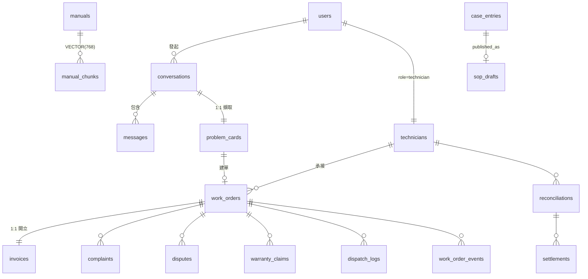

# 18. 資料庫設計（DB Design）

## 1. 文件目的與範圍

本文件是平台資料庫設計的單一正典（tier-2 契約級），回答七個核心問題：資料存在哪幾個物理資料庫、各庫有哪些 schema namespace 與核心表、租戶如何隔離、向量知識與 agent 記憶怎麼存、schema 如何演進（migration 策略）、PII 與資料保留如何治理、通用工單資料模型的 roadmap。

**讀者**：後端 / DB 工程師、資料架構師、DevOps（套 schema / 備份 / migration）、平台整合工程師；次要讀者為安全稽核與新進工程師。

**擁有權**：**DB 業務 schema 由 `api` 子系統擁有**，以 **psycopg3 raw SQL** 存取（無 ORM、無 SQLAlchemy）。API 層的資料模型是 Pydantic v2 schema（`models/generated.py`），與 DB schema 分離。詳見 [../api/P2/04_adr/ADR-002_psycopg3_raw_SQL_與純SQL_migration.md](../api/P2/04_adr/ADR-002_psycopg3_raw_SQL_與純SQL_migration.md)。

**範圍**：三個物理資料庫（合計品牌庫 ~100 表）、pgvector 向量知識、agent 記憶 schema、migration 策略、命名慣例、PII / 保留治理、離線 Medallion 檔案分層（非 DB 但屬持久層設計）、通用工單資料模型 roadmap。

相關文件：部署拓撲見 [./12_SAD.md](./12_SAD.md)；PII 加密機制細節見 [./13_Security_Architecture.md](./13_Security_Architecture.md)；端點 ↔ 表對應見 [./16_API_Spec.yaml](./16_API_Spec.yaml)。

---

## 2. 資料庫拓撲總覽（三庫物理隔離）

### 2.1 三庫一覽

平台採 **PostgreSQL + pgvector**，資料分佈於三個物理獨立的資料庫實例：

| DB | 實例名（範例）| Port | 連線環境變數 | schema 來源 | 內容 |
|---|---|---|---|---|---|
| **品牌庫（派工 / 營運）** | `lock_AI_data` | :5433 | `POSTGRES_URI` | `SQL/Schema.sql` + `SQL/Schema_*.sql` + `SQL/migrations/*` 全套 | 完整業務 schema（~100 表）：客服 / 派工 / 工單 / 金流 / 知識 / 治理；**一品牌一庫** |
| **技師庫（權威）** | `lock_tech` | :5434 | `TECH_POSTGRES_URI` | 品牌庫的技師身分域**子集**（6–7 表）| `users`(role=technician)、`technicians` 及技師技能 / 認證 / 排班表（見 §8.1）|
| **平台庫** | `lock_platform` | :5435 | `PLATFORM_POSTGRES_URI` | **獨立 schema** `SQL/platform/Schema_platform.sql`（3 表）| `users`(platform_admin)、`revoked_jti`、`brand_applications` |

建庫腳本：品牌庫 `scripts/db/apply-schema-prod.sh`、技師庫 `scripts/db/split-tech-db.sh`（含 `--verify` 對帳）、平台庫 `scripts/db/init-platform-db.sh`。

### 2.2 隔離模型：一品牌一 DB（物理隔離）

智慧鎖品牌（Chatlock / Dormakaba / Kaadas…）互為競爭對手，客服、派工、工單、金流資料**必須強隔離**。本平台的租戶隔離策略是**一品牌一 DB 物理隔離**（[../data-pipeline/P2/04_adr/ADR-003_三庫物理隔離取代_RLS租戶隔離.md](../data-pipeline/P2/04_adr/ADR-003_三庫物理隔離取代_RLS租戶隔離.md)）。設計時比較過三個選項：

| 選項 | 隔離強度 | fail 模式 | 取捨 |
|---|---|---|---|
| **A. 一品牌一 DB 物理隔離（採用）** | 最強：品牌資料在不同 DB 實例，物理不可跨 | **fail-closed**：連錯庫就是連不到，不會靜默洩漏 | 部署隨品牌數擴散；跨庫無交易 |
| B. RLS 邏輯隔離 | 中：靠 policy + app 正確設 session | fail-open 風險：漏設 session 即跨租戶洩漏 | 單庫省實例，但 policy 落地複雜、競品同庫信任成本高 |
| C. schema-per-tenant | 中高 | — | migration 需對每 schema 套；仍是同實例 |

**選 A 的關鍵理由**：(1) 品牌是競品，物理隔離的信任成本最低；(2) fail-closed 的失效模式最安全；(3) 「技師跨品牌共用」的需求由獨立技師權威庫解決（§8），不必在單庫內做複雜的部分隔離。

**明確接受的代價**：每品牌一庫，migration 套用、備份、監控成本乘以品牌數；跨庫無 ACID 交易，一致性靠應用層雙寫 + 對帳（§8.3）。

> **`tenant_id` 欄位語義**：品牌庫內多表（`work_orders`、`saas.*` 各表）帶 `tenant_id` 欄位並以 `saas.tenant` 為 FK target。此為**單庫內的租戶標記欄**（供 v2 tenant-scoped API `/tenants/{tid}/...` 路徑對齊與稽核歸屬）；**跨品牌隔離由物理分庫保證**，不依賴此欄位做資料過濾。

### 2.3 三庫關係語意

三庫**不是**同一 schema 部署三份，關係語意如下：

1. **品牌庫 = 全 schema，每品牌部署一份**（物理多租戶）。
2. **技師庫 = 技師身分權威庫**；品牌庫保留技師列作為**投影**（35 張品牌表 FK 指向 `users` / `technicians`，投影讓派工 / 佣金 JOIN 與既有 FK 免改）；一致性靠 api **雙寫鏡射（tech_mirror）** + `split-tech-db.sh --verify` 對帳。
3. **平台庫 = 獨立最小 schema**；其 `users` 欄位刻意對齊品牌庫 `users` 子集（含帳號安全欄位，migration 084），使 `core/auth.py` 的 lockout 查詢邏輯可跨庫共用。

### 2.4 連線契約

- api 的 `core/db.py` 提供三條懶連線（`POSTGRES_URI` / `TECH_POSTGRES_URI` / `PLATFORM_POSTGRES_URI`），單一共享 `AsyncConnection` + `autocommit=True`，閒置斷線透明重連。
- 安全閥：`TECH_POSTGRES_URI` / `PLATFORM_POSTGRES_URI` 未設時回主連線（單庫部署行為）。🔜 規劃中：部署啟動守衛，斷言三庫連線可達，防止漏設 URI 導致的單庫漂移。
- **連線字串禁止手動構建**：一律 `./scripts/deploy/agent.sh --update-db-uri`（自動 URL-encode + round-trip 驗證）；機密走 GCP Secret Manager。

---

## 3. Schema Namespace 分層（品牌庫內）

品牌庫內以三個 PostgreSQL schema namespace 分層：

| namespace | 用途 | 建立來源 |
|---|---|---|
| `public.*` | 主業務表：品牌 / 派工 / 工單 / 客服 / 知識 / 金流 + 報價 / 技師擴充 | `Schema.sql`（基底 22 表）+ 9 個 `Schema_*.sql` 擴充檔 + 多數 migration |
| `saas.*` | 治理與結算層：config 治理、對帳結算 v2、爭議、庫存、憑證、月結、AI trace、GDPR | migration `004-config-m18.sql` 起（建 `saas` schema + `saas.tenant`）|
| `agent.*` | LockCore CS agent per-user 記憶與轉真人稽核 | migration `033-agent-memory-schema.sql`（`agent.memory_entry` / `agent.escalation`）|

**界線原則**：`public` 承載被 API 直接讀寫的營運主資料；`saas` 承載治理 / 財務結算等需獨立審計軌的表；`agent` 專屬 AI 客服記憶，只由 agent 的 `user_memory` 模組讀寫（api 不直接觸碰）。

---

## 4. 核心領域資料模型（ERD）

### 4.1 核心 ERD



文字版聚合根關聯（與 api 領域對照，[../api/P2/06_api_design_specification.md](../api/P2/06_api_design_specification.md) §6.1）：

```
users (1) ──< conversations ──< messages
                    │(1:1 UNIQUE)
                    └── problem_cards ──(1:1)── work_orders
users(technician) ──1:1── technicians ──< work_orders
work_orders ──1:1── invoices
work_orders ──< complaints / scope_changes / material_requests /
                disputes / dispatch_logs / refund_requests /
                warranty_claims / work_order_events
technicians ──< reconciliations ──< settlements
```

### 4.2 `work_orders` — 派工域中樞

`work_orders` 是全平台的資料中樞，**被 ~10 張表 FK 引用**（events / dispatch_logs / complaints / disputes / warranty_claims / scope_changes / material_requests / refund_requests / invoices…）。欄位涵蓋派工營運全生命週期，含智慧鎖領域欄位（`brand` / `model` / `serial` / `warranty_expiry` / `teaching_note` 等）。狀態轉移由工單狀態機驅動，每次轉移寫入 `work_order_events`（timeline / 事件溯源）。領域欄位下沉為 JSONB 的通用化設計見 §13 roadmap。

### 4.3 客服 → 派工橋接（`problem_cards`）

`problem_cards` 與 `conversations` 為 1:1（UNIQUE 約束）：AI 從 LINE 對話擷取問題卡草稿，`completeness_score` 達門檻後由客服經認證端點確認建單（**AI 永不自轉工單**——AI 最多建草擬卡，confirm / convert 走客服端點）。這是 CustomerSupportContext 進入 DispatchOperationsContext 的唯一資料橋。

### 4.4 身分與 RBAC

- **`users` = 統一身分表**，基底 5 角色：`line_user` / `admin` / `reviewer` / `technician` / `dispatcher`；系統角色全集 12 個（另含 `brand_oem` / `accounting` / `supervisor` / `customer_service` / `auditor` / `family_reviewer` / `distributor`）。
- RBAC 動態層：`roles` / `permissions` / `role_permissions`（034）+ `saas.role_assignment`（070，**雙簽 SoD**：指派需 initiator / approver 分離）。
- Token 治理：`revoked_jti`（登出撤銷）、`password_reset_tokens`（035）、帳號安全欄位（084：lockout / password_changed_at）。
- RBAC enforce 全貌與權限矩陣見 [./13_Security_Architecture.md](./13_Security_Architecture.md)。

---

## 5. 業務資料表分域清單（10 域，品牌庫 ~100 表）

| 域 | 代表表（括號 = 建立 migration 編號）| schema |
|---|---|---|
| **A. 身分 / RBAC** | `users`（統一 5 角色）、`roles`、`permissions`、`role_permissions`(034)、`saas.role_assignment`(070 雙簽 SoD)、`staff_applications`(088)、`password_reset_tokens`(035)、`revoked_jti`、帳號安全欄位(084) | public / saas |
| **B. 客服對話 / 診斷** | `conversations`（Session）、`messages`、`chat_messages`、`problem_cards`（1:1 conversation，completeness_score；077/065/085）| public |
| **C. 知識庫（KB / RAG）** | `manuals`（PDF 手冊）、`manual_chunks`（VECTOR(768)）、`case_entries`（案例庫 VECTOR(768)）、`sop_drafts`、`saas.kb_audit_log`(015)、`saas.sop_feedback`(023) | public / saas |
| **D. 技師 / 派工** | `technicians`(064/080)、`technician_skill`(063)、`technician_brand_authorization`(063)、`technician_certification`(081)、`technician_kyc`(089)、**`work_orders`（派工域中樞）**、`work_order_events`、`work_order_consents`(043)、`dispatch_logs`（match_factors）、`saas.reschedule_proposal`(014)、`saas.exception_case`(049)、`saas.technician_lifecycle_event`(020) | public / saas（技師身分表權威在技師庫，見 §8）|
| **E. 報價 / 目錄** | `quote`、`quote_approval`、`quote_line_items`(037)、`service_catalog`、`material_catalog`、`surcharge_rule`(087)、`saas.price_rule`(008)、`technician_payout_rule`(045/082)、`pricing_rule_snapshot` | public / saas |
| **F. 金流 / 帳務 / 結算** | `invoices`(028/037/042)、`payments`(069)、`saas.reconciliation`(005)、`saas.reconciliation_exception`(017)、`saas.settlement`(005/072)、`saas.monthly_settlement_batch`(019)、`saas.technician_statement`(025)、`saas.dispatcher_commission_statement`(026)、`saas.brand_b2b_statement`(027)、`saas.technician_penalty_bonus_ledger`(083)、`saas.voucher` + `saas.voucher_void_event`(010)、`refund_requests`(002)、`cancellation`(001) | public / saas |
| **G. 客訴 / 爭議 / 保固 / 合規** | `complaints`、`saas.dispute`(006)、`warranty_claims`(003/068)、`scope_changes`(053)、`material_requests`、`appearance_change_consents`、`family_reviews`(074，hash chain)、`saas.rma_quality_finding`(024)、`saas.forget_request`(021，GDPR) | public / saas |
| **H. 庫存 / BOM** | `saas.inventory_item` / `saas.inventory_transaction`(007)、`saas.product_model` + `saas.bom_line`(073，兩層 BOM) | saas |
| **I. 配置治理（M18）** | `saas.config_namespace` / `config_version` / `config_rollout` / `config_audit`(004)、`system_config`、`data_corrections`(009)、`saas.change_request` + `saas.change_request_type_dim`(008) | public / saas |
| **J. 平台 / 通知 / 審計 / AI 治理** | `notifications` + `notification_template`(071)、`saas.line_binding`(018)、`line_push_outbox`、`media_files`(048/060/066)、`audit_events`(067，hash chain)、`saas.ai_decision_trace`(022)、`llm_usage_log`、`harness_traces` / `user_facts`、`schema_migrations`(046)、`agent.memory_entry` / `agent.escalation`(033) | public / saas / agent |

**表數量級**：`public` ~60+、`saas` ~34、`agent` 2 → **品牌庫合計 ~100 表**。平台庫另有獨立 3 表（§8.2）。

---

## 6. 向量知識庫（pgvector）

### 6.1 擴充與雙向量欄位

品牌庫啟用 pgvector：`CREATE EXTENSION vector`（`000-extensions.sql` / `Schema.sql`）。兩個向量欄位承載後台知識檢索語料：

| 契約項 | `manual_chunks` | `case_entries` |
|---|---|---|
| 向量欄位 | `embedding VECTOR(768)` | `embedding VECTOR(768)` |
| 維度來源 | Google `text-embedding-004`（768 維）| 同 |
| 用途 | L2 手冊語義搜尋（PDF 手冊 chunk）| L1 案例庫語義搜尋 |
| 消費者 | web / api 後台 KB 檢索 | web / api 後台 case 檢索 |
| 向量化狀態欄 | [待確認] | `embedding_status`（async 向量化）|
| 軟刪 | `deleted_at` + partial index `WHERE deleted_at IS NULL` | 同 |

### 6.2 索引

兩欄位皆建 **HNSW** 索引：`m=16`、`ef_construction=64`、`vector_cosine_ops`（`Schema.sql`）。

### 6.3 檢索語義

- 檢索算子：cosine 距離 `ORDER BY embedding <=> :query_vec`。
- 案例庫命中門檻：相似度 **≥ 0.85**。
- 概念查詢：

```sql
-- L1 案例庫檢索（相似度 ≥0.85 命中）
SELECT id, content, 1 - (embedding <=> :query_vec) AS similarity
FROM case_entries
WHERE deleted_at IS NULL
ORDER BY embedding <=> :query_vec
LIMIT :k;
```

- 檢索延遲目標：[待確認]（HNSW 參數為效能基礎，無實測記錄）。

### 6.4 知識分工與語義 RAG 灌注管線（🔜 規劃中）

知識體系採「**一個事實語料 + 一套行為驅動**」分工（[../agent/P2/04_adr/ADR-004_RAG-via-MCP檢索能力與Skill行為驅動分工.md](../agent/P2/04_adr/ADR-004_RAG-via-MCP檢索能力與Skill行為驅動分工.md)）：

- **pgvector = 唯一完整事實語料**（大語料語義檢索的資料源）。
- **agent filesystem references（`references/{Brand}/{Model}.md`）= 精選層**（Skill 行為驅動：定義 agent 何時、依什麼規範去查什麼）。
- 🔜 **Phase 2 規劃**：embedding 產生器（`embed()` helper）、cosine 向量查詢路徑、RAG-via-MCP server、bronze/silver 語料自動灌注 pgvector + `embedding_status` 監控。灌注管線由 knowledge-refinery 承載（見 [../knowledge-refinery/P1/](../knowledge-refinery/P1/)）。

---

## 7. Agent 記憶 Schema（`agent.*`）

### 7.1 兩張表

| 表 | 用途 | 關鍵欄位 |
|---|---|---|
| `agent.memory_entry` | per-user 客戶事實記憶（LLM 第三人稱事實抽取，temp 0.0）| `tenant` + `user_id`（複合隔離鍵）、`kind`（白名單：`profile` / `preference` / `fact` / `issue` / `dispatch`）、內容文字 |
| `agent.escalation` | 轉真人稽核紀錄（`transfer_to_human` 工具觸發；含承諾話術兜底補錄）| `tenant` + `user_id`、`reason`、`is_explicit`、`facts_snapshot`（JSON）|

寫入時機接 agent turn 狀態機：**BUILD** 階段注入 `<memory>` context block、**SAVE** 階段 `record_turn` 寫回。

### 7.2 per-user 記憶隔離（default-deny）

記憶讀寫**必帶 `tenant` + `user_id`，否則 raise**（default deny）。跨 user / 跨 tenant 記憶零洩漏為 NFR 硬指標（NFR-REL-02 / NFR-SEC-04）。

### 7.3 檢索後端（雙後端同介面）

| 後端 | 技術 | 適用 |
|---|---|---|
| **生產** | PostgreSQL + `pg_trgm` / GIN 索引（品牌庫 `agent.*` schema）| 與 api 共用 Cloud SQL，schema 隔離、持久化 |
| **本地** | SQLite + FTS5 trigram（CJK 子字串檢索）| 零依賴本地開發 fallback（`memory.db`）|

生產部署強制 `backend="postgres"`（deploy 注入 `POSTGRES_URI`），避免 SQLite tempfile 隨實例重啟流失。

---

## 8. 技師庫與平台庫

### 8.1 技師權威庫 `lock_tech`

技師跨品牌服務（一位師傅服務多品牌），故技師身分域自品牌庫抽出為**權威庫**，包含品牌庫技師身分域子集 6–7 表：

`users`(role=technician)、`technicians`、`technician_skill`、`technician_brand_authorization`、`technician_certification`、`technician_schedule_requests`、`saas.technician_lifecycle_event`。

### 8.2 平台庫 `lock_platform`

獨立 3 表：`users`(platform_admin)、`revoked_jti`、`brand_applications`（品牌申請導入）。`users` 欄位對齊品牌庫 `users` 子集（含帳號安全欄），認證邏輯跨庫共用。

### 8.3 技師身分投影與雙寫鏡射

- **技師庫為權威**；品牌庫保留技師列作**投影**，讓 35 張品牌表的 FK（派工 / 佣金 JOIN）不需跨庫。
- 同步機制：api **雙寫鏡射（tech_mirror）**——技師身分寫入同時落技師庫與品牌庫投影；一致性以 `split-tech-db.sh --verify` 對帳。
- 跨庫無 ACID 交易為明確接受的代價；對帳即補償機制。

### 8.4 技師工單 CQRS 投影與佣金結算主體（🔜 規劃中，ADR-P014）

技師共享池平台（technician-platform）定位為**品牌事件的 CQRS 消費端**（[../00_platform/P2/04_adr/ADR-P014_技師平台佣金邊界與工單CQRS投影.md](../00_platform/P2/04_adr/ADR-P014_技師平台佣金邊界與工單CQRS投影.md)）：

1. **佣金：Billing（品牌）/ Settlement（技師平台）分離** — 品牌庫負責 per-job 計費（依工單金額 / 料件 / 完工，皆品牌側資料），發 `commission.accrued` 事件（Kafka）；技師平台訂閱各品牌事件，作為**跨品牌單一對帳 / statement / payout 結算主體**（佣金 statement / ledger 遷入技師平台自有庫）。
2. **技師工單可見性：Kafka-fed read-model** — 品牌 api 發工單生命週期事件（`workorder.dispatched` / `updated` / `completed`）→ 技師平台維護「技師視角工單投影」；**投影欄位最小化**（工單摘要 / 地址 / 狀態 / 時窗 / 金額 / 該技師派工），不整包複製品牌敏感資料。
3. **統一視圖** — 命令端（工單 / 計費）真相在品牌庫；查詢端（技師工單視圖）+ 結算（佣金彙總）在技師平台，靠 Kafka 事件骨幹同步。最終一致性以期末 reconcile 對帳閘門守住金流正確性；事件 schema 走 registry + 契約測試。

> 現行同步機制為 §8.3 雙寫鏡射；事件驅動投影為 roadmap 演進方向，事件契約定義後逐步導入。

---

## 9. Migration 策略

### 9.1 純 SQL、forward-only、idempotent（不用 Alembic）

依 [../data-pipeline/P2/04_adr/ADR-002_純SQL_forward-only_migration_不用Alembic.md](../data-pipeline/P2/04_adr/ADR-002_純SQL_forward-only_migration_不用Alembic.md)：

- api 用 psycopg3 raw SQL、無 ORM model，Alembic autogenerate 無用武之地；純 SQL 檔以 `psql -f` 套用，與工具鏈一致。
- **forward-only**：無 down migration；**idempotent**：`ADD COLUMN IF NOT EXISTS`、`DO $$ 查 pg_constraint $$`、`ON CONFLICT DO NOTHING`，同一檔可對多庫、多環境安全重套。
- 現行規模：`SQL/migrations/000..089`（87 檔，含預留缺號）。

### 9.2 命名與編號認領

- 檔名：**`NNN-domain-feature.sql`**（三位數編號 + kebab 描述）。
- 平行 worktree 開發前**先在 `SQL/MIGRATION_REGISTRY.md` 認領編號**再開檔（防撞號）。REGISTRY 的定位是**編號認領登記簿（人工意圖）**，不是套用狀態真相。

### 9.3 套用順序

`scripts/db/apply-schema-prod.sh`：

```
1. SQL/Schema.sql              （基底 22 表）
2. SQL/Schema_*.sql            （字母序，9 個擴充檔）
3. SQL/migrations/*.sql        （編號序，000..089）
4. 回填 public.schema_migrations
```

prod 套用經 cloud-sql-proxy；容忍 benign「already exists」（idempotent 重跑），結尾 grep 攔真 ERROR。

### 9.4 套用真相源：`public.schema_migrations`

**某環境是否已套用某 migration，唯一真相是該環境的 `public.schema_migrations` 表**（migration 046 建）：

```sql
SELECT version, applied_at, note FROM schema_migrations ORDER BY version;
```

語意鐵律：registry 的 🟢 idempotent 標記 =「設計可安全重套」≠「已套用」。查實況一律以 `schema_migrations` 為準。

### 9.5 三庫套用一致性

- 品牌庫（×N）、技師庫、平台庫各自 `psql -f` 套用；技師庫以 `split-tech-db.sh --verify` 對帳。
- 🔜 規劃中：**migration drift CI** — 自動比對 `MIGRATION_REGISTRY.md` / `migrations/` 目錄 vs 各環境 `schema_migrations`，drift 即告警；三庫套用腳本統一入口。

### 9.6 回滾策略

- **forward-fix 為唯一補救**：套錯不 downgrade，寫新 migration 修正。
- **套用前必建備份**：prod 套用前先 `gcloud sql backups create`（腳本提醒；🔜 規劃中改為自動前置）。
- 頻繁需要回滾時的重評觸發：對關鍵 migration 手寫配套 `down-NNN.sql`。

---

## 10. 命名與慣例

| 項目 | 慣例 | 範例 |
|---|---|---|
| 表名 | snake_case、複數或領域名詞 | `work_orders`、`technician_skill`、`saas.reconciliation_exception` |
| schema namespace | 三層：`public`（業務）/ `saas`（治理結算）/ `agent`（AI 記憶）| `saas.monthly_settlement_batch` |
| migration 檔 | `NNN-domain-feature.sql` | `033-agent-memory-schema.sql`、`070-role-assignment-sod.sql` |
| 索引 | `idx_<表縮寫>_<欄位組>` | `idx_dc_tenant_status_created` |
| 向量索引 | HNSW + `vector_cosine_ops` | `manual_chunks` / `case_entries` |
| 軟刪 | `deleted_at` + partial index | `WHERE deleted_at IS NULL` |
| 稽核不可竄改 | hash chain 欄位鏈接前筆 | `audit_events`(067)、`family_reviews`(074) |
| 事件溯源 | `*_events` 表 + `seq` | `work_order_events` |
| Schema 擴充檔 | `Schema_<主題>.sql` | `Schema_rbac_dynamic.sql`、`Schema_work_order_events.sql` |

---

## 11. PII 與資料保留

> 加密機制（envelope / DEK、金鑰管理）詳見 [./13_Security_Architecture.md](./13_Security_Architecture.md)；本節只列 schema 面。

### 11.1 敏感欄位

- 客戶 PII：`users`（LINE 身分、聯絡方式）、`conversations` / `messages`（對話內容）、`work_orders`（地址）、`agent.memory_entry`（客戶事實記憶）。
- 技師 PII：`technicians`、`technician_kyc`(089)。
- agent 記憶 PII 落 Cloud SQL 加密層，並以 tenant+user_id default-deny 隔離（§7.2）。

### 11.2 稽核 hash chain

- `audit_events`(067)：治理事件稽核，hash chain 防竄改（每筆含前筆 hash）。
- `family_reviews`(074)：家庭審核紀錄，同樣走 hash chain。
- `saas.ai_decision_trace`(022)：AI 決策 trace 存證（AI 治理）。

### 11.3 GDPR 遺忘權

- `saas.forget_request`(021)：遺忘權請求登記；**T+30 天硬刪**流程由 api `POST /tenants/{tid}/gdpr-forget` 端點驅動（FULL_ACCESS 角色）。

### 11.4 保留期與封存

- 各域資料保留天數與冷儲存封存策略：[待確認]（無正典數值；訂定後回寫本節）。
- 生產備份：Cloud SQL 備份（migration 套用前手動觸發；🔜 規劃中：定期備份 + 還原演練 + RTO/RPO 文件化）。

---

## 12. 離線數據分層（Medallion 檔案系統，非 DB）

知識原料的離線加工採 **Medallion 檔案分層**（`data/storage/`，[../data-pipeline/P2/04_adr/ADR-001_Medallion_分層數據架構.md](../data-pipeline/P2/04_adr/ADR-001_Medallion_分層數據架構.md)）：

| 層 | 目錄 | 內容 | 品質承諾 |
|---|---|---|---|
| **Raw** | `data/storage/raw/` | 原始下載 / 索引（.mp4 / .csv / links）| 忠實保存，可重現性基礎 |
| **Bronze** | `data/storage/bronze/` | 清洗轉錄：YouTube→Vision 逐幀字幕 JSON、Video→Whisper ASR、Website→markdown、GDrive→索引、LINE→CSV（約 115 檔）| **sourcing 真相源** |
| **Silver** | `data/storage/silver/` | 攤平 JSON 知識點：`content / brand / model / category / source_type / source / url / chunk_index` | LLM 語意切塊 + **Python 強制覆寫 `source` / `source_type`（防 LLM 竄改 provenance）** |

**硬約束（bronze-only sourcing）**：產品知識內容嚴格源自 bronze 層；**PDF（GDrive）不可信，只引 URL 不抄內容**。此為跨系統不變式，任何下游（agent references / pgvector 語料）都必須遵守。

**與品牌庫的關係**：Medallion 是檔案系統非 DB，執行時與品牌庫互不相依。其產出供兩個下游：(1) agent 精選 references（`references/{Brand}/{Model}.md`）；(2) 🔜 規劃中——silver 語料自動灌注 pgvector（`manual_chunks` / `case_entries` embedding），由 knowledge-refinery 承載（§6.4）。

---

## 13. 通用工單資料模型 Roadmap（Vertical Pack）

平台戰略為「核心通用 + 領域配置」分層（[../00_platform/P2/04_adr/ADR-P009_平台核心_vs_領域配置分層.md](../00_platform/P2/04_adr/ADR-P009_平台核心_vs_領域配置分層.md)）。工單資料模型的目標形態（🔜 規劃中，屬 refactor CR，動 schema 須走 CIA）：

### 13.1 通用核心表草圖

```sql
work_orders (
  id, tenant_id, industry_pack, pack_version,
  customer_id, location JSONB,          -- 地址/geo
  status TEXT,                          -- 值域由 flow DSL 定義（非 enum 寫死）
  priority, sla_due_at,
  assignee_ref TEXT,                    -- → technician-platform（跨系統 ref，不 FK）
  quote_id, settlement_id, amount,
  attributes JSONB,                     -- 產業欄位：鎖{brand,model,serial,warranty} / HVAC{unit,refrigerant}
  created_at, updated_at
)
work_order_events (id, wo_id, seq, type, actor_ref, from_status, to_status, payload JSONB, at)
field_metadata (pack, pack_version, entity, key, label, type, required,
                options JSONB, validation JSONB, ui_hints JSONB)
```

### 13.2 設計要點

- **核心欄位 = 各產業不變的營運骨架**（客戶 / 地點 / 狀態 / 指派 / 金額 / 時間軸）→ 可查詢、可索引、可報表。
- **`attributes JSONB` = 產業變動欄位**；語義由 `field_metadata` 定義（type / required / options / validation / ui_hints），驅動 `DynamicForm` / `DynamicTable` 與驗證——**加欄位不改 schema、不寫 code**。
- **`status` 不寫死 enum**：值域與轉移由 Vertical Pack 的 flow DSL 定義。
- **`assignee_ref` 跨系統參照**技師共享池（不跨庫 FK），派工經 API + Kafka。

### 13.3 Vertical Pack 版本化與品牌實例化

- Pack 語意版本化（`locksmith@1.2.0`，可 `extends: blue-collar-service@2.x`）；**品牌（租戶）= 裝一個 pack@version + 租戶級覆寫**（價目 / SLA / 品牌參數）。
- Pack 升級 = 版本遷移，含 `field_metadata` / flow 的向後相容檢查。
- 導入路徑：現行 `work_orders` 智慧鎖領域欄位逐步下沉到 `attributes` + `field_metadata(pack=locksmith)`，核心欄留下；詳見 [../00_platform/P1/07_workorder_platform_design.md](../00_platform/P1/07_workorder_platform_design.md)。

---

## 14. 附錄

### 14.1 關鍵檔案路徑

| 資產 | 路徑 |
|---|---|
| 基底 schema | `SQL/Schema.sql`（1013 行，22 表）|
| 擴充 schema（9 檔）| `SQL/Schema_{v2_extensions,api_phase1,media,rbac_dynamic,tech_schedule,work_order_events,doc_numbering,harness_migration,cr0001_integration_gaps}.sql` |
| Migrations | `SQL/migrations/000..089-*.sql`（87 檔）+ `SQL/MIGRATION_REGISTRY.md` |
| 平台庫 schema | `SQL/platform/Schema_platform.sql`（91 行，3 表）|
| 種子 | `SQL/seeds/*.sql`（20 檔）+ `scripts/seed/*.py` |
| DB 腳本 | `scripts/db/{apply-schema-prod,init-platform-db,split-tech-db}.sh` |
| Medallion 資料 | `data/storage/{raw,bronze,silver}/{youtube,video,website,gdrive,line_chat}/` |
| agent 記憶模組 | `agent/lockcore/agent/user_memory/{manager,store,postgres_store,llm_extractor,escalation}.py` |

### 14.2 量級速查

| 項目 | 數字 |
|---|---|
| 品牌庫表數 | ~100（public ~60+、saas ~34、agent 2）|
| 技師庫表數 | 6–7（技師身分域子集）|
| 平台庫表數 | 3 |
| Migration 檔數 | 87（編號 000..089，含預留缺號）|
| 向量欄位 | 2（`manual_chunks.embedding` / `case_entries.embedding`，皆 VECTOR(768)）|
| `work_orders` 被 FK 引用 | ~10 表 |
| 技師投影相關品牌表 | 35 表 FK 指向 `users` / `technicians` |

---

*文件結尾 — enterprise/18_DB_Design.md v1.0 / 2026-07-07*
