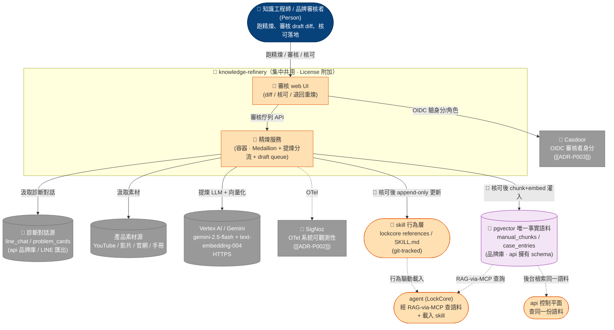
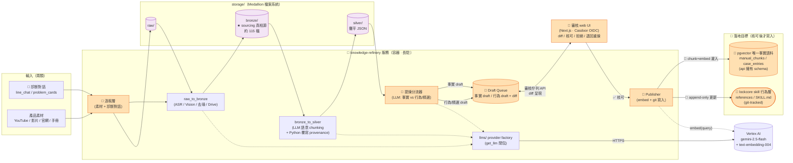
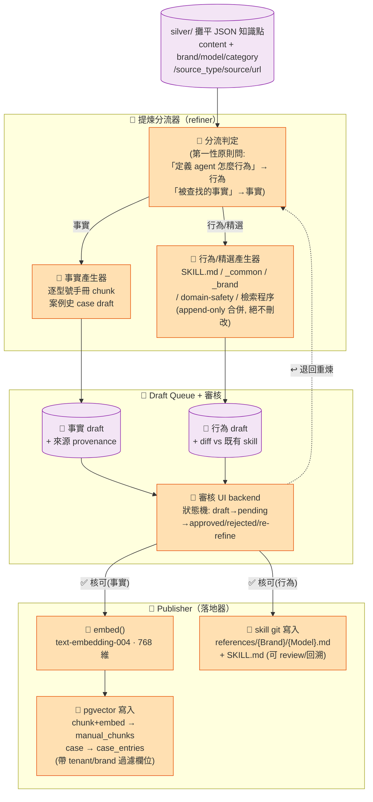
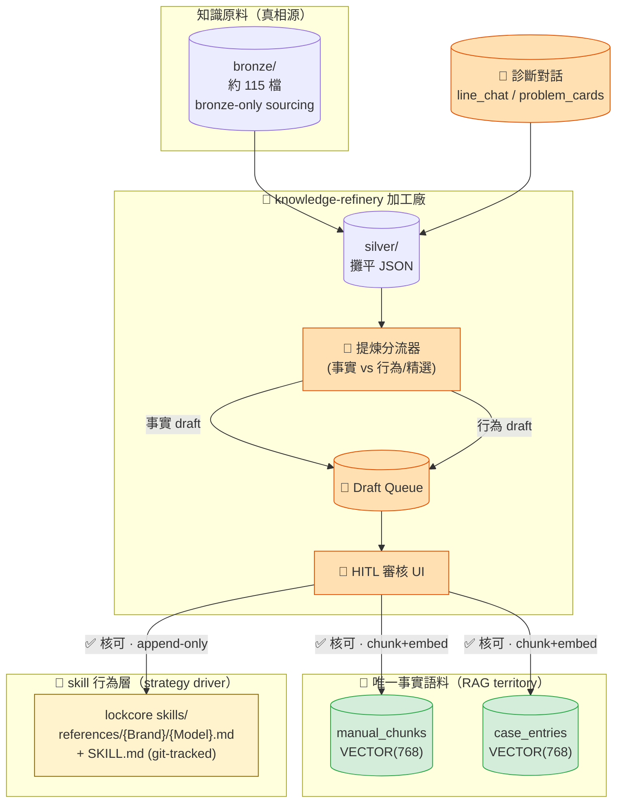
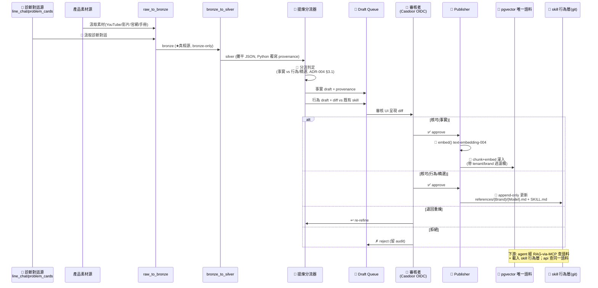

# 架構與設計文件 — knowledge-refinery（知識精煉獨立服務 + 審核 UI）

**版本** v2.0（target-state 理想態）| **日期** 2026-07-07 | **狀態** 理想態藍圖（target）

---

> 🎯 **本文件為 target 態 SAD。** `knowledge-refinery` 由現況 `data-pipeline` 離線 Medallion script **升格**而來（[[ADR-P001]]）。as-is 現況（含真實 Medallion 資料事實、產出鏈斷裂記錄、~100 表 DB schema 現況）保存於 `../data-pipeline/P1/05_architecture_and_design.md`。凡標 `🎯` 為理想態新增/演進元件；凡標 `(現況)` 為尚未落地、屬遷移路徑者；凡未能定案者標 `[待確認]`。

> **與平台文件的關係**：L1 System Context 統一由 `smartlock-docs/00_platform/P1/05_platform_architecture_L1.md` 管理（`REFINERY` 節點列於「集中共用平台」）；本文件從 L2 Container 描述 knowledge-refinery 子系統。所有整合關係、命名（KnowledgeContext / pgvector 唯一事實語料 / RAG-via-MCP / bronze-only sourcing）均與 L1 target 對齊。

> **DB schema 歸屬聲明**：現況 data-pipeline SAD 詳述的 **~100 表 DB schema 不屬本系統**——那是 **api 資料層**的職責（`manual_chunks`/`case_entries`/`schema_migrations`/三庫分裂等由 api 擁有與演進）。本 SAD 只在 §「落地」把 `manual_chunks`/`case_entries` 當作**寫入目標語料**引用，schema 定義與 migration 治理**移交 api**（見 `api/P1/05`）。

---

## 目錄

1. [文件元資訊](#1-文件元資訊)
2. [Solution Landscape（Level 0 — 能力域地圖）](#solution-landscapelevel-0--能力域地圖)
3. [C4 L1 定位（knowledge-refinery 在平台中的位置）](#2-c4-l1-定位knowledge-refinery-在平台中的位置)
4. [C4 Container 清單表](#3-c4-container-清單表)
5. [C4 L2 — Container Diagram](#4-c4-l2--container-diagram)
6. [C4 L3 — Component Diagram（精煉引擎內部）](#5-c4-l3--component-diagram精煉引擎內部)
7. [DDD 設計 — KnowledgeContext 定位](#6-ddd-設計--knowledgecontext-定位)
8. [Medallion 分層架構](#7-medallion-分層架構)
9. [關鍵流程 — 診斷→精煉→審核→灌語料/更新 skill](#8-關鍵流程--診斷精煉審核灌語料更新-skill)
10. [Bronze-only Sourcing 治理](#9-bronze-only-sourcing-治理)
11. [系統整合矩陣](#10-系統整合矩陣)
12. [非功能性需求（NFR：目標 + 策略）](#11-非功能性需求nfr目標--策略)
13. [風險登記表](#12-風險登記表)
14. [演進路線（現況斷鏈 → target 修復對齊）](#13-演進路線現況斷鏈--target-修復對齊)

> **註**：節編號沿用 acme 模板慣例；「Solution Landscape」「Bronze-only Sourcing 治理」為跨章插入補充節，以標題錨點引用。

---

## 1. 文件元資訊

| 欄位 | 內容 |
|------|------|
| 子系統識別碼 | knowledge-refinery（知識精煉獨立服務 + 審核 UI）|
| 文件類型 | P1 架構與設計（Architecture & Design）— **target 態** |
| C4 範圍 | L1 定位 + L2 Container + L3 Component（精煉引擎內部）|
| 撰寫日期 | 2026-07-07 |
| 版本 | **v2.0（target-state 理想態）** |
| 定位 | 🎯 **獨立容器服務 + 審核 UI**；**License 開通的附加系統**（非基礎部署必備）|
| 部署歸屬 | 🎯 集中共用平台（跨品牌，非 per-brand bundle，[[ADR-P005]] §6）|
| 依據決策 | [[ADR-P001]]（知識精煉獨立服務）· [[ADR-004]]（RAG-via-MCP + Skill 行為驅動分工）· [[ADR-P011]]（AI Onboarding Compiler 孿生 HITL）· [[ADR-P013]]（RAG 權限 / skill registry）· [[ADR-P002]]（OPIK/SigNoz 觀測）· [[ADR-P003]]（Casdoor 認證）|
| as-is baseline | `../data-pipeline/P1/05_architecture_and_design.md`（現況誠實記錄；產出鏈斷裂 §9）|

**一句話定位**：把**每一次診斷對話 + 全部產品素材**融入 AI agent，沿用 Medallion `raw→bronze→silver` 提煉為**兩類產物**——**事實**（灌 pgvector 唯一事實語料）與 **行為/精選**（更新 skill 行為層），全程 **human-in-the-loop 審核（draft → 人審 → 落地）**，將隱性知識**顯性系統化**（[[ADR-P001]]）。

---

## Solution Landscape（Level 0 — 能力域地圖）

> **C4 之前的一層**：先用能力域總覽對齊「knowledge-refinery 做什麼」，再 zoom 進 C4。受眾：業務 + 管理層。與現況 data-pipeline 的關鍵差別——**現況是「離線批次 script + 產出鏈斷裂」，target 是「長駐容器服務 + 審核 UI + 產出鏈修復對齊」**。

```mermaid
block-beta
  columns 1

  block:solution["🎯 Solution Boundary（knowledge-refinery 系統邊界 = 精煉服務 + 審核 UI）"]:1
    block:inputRow["輸入汲取層（診斷 + 素材兩類輸入）"]:1
      diag["🎯 診斷對話\n(line_chat / problem_cards\n每次與用戶的診斷過程)"] mat["產品素材\n(YouTube / 影片 / 官網 / 手冊)"]
    end
    block:medallionRow["Medallion 分層萃取（沿用 raw→bronze→silver）"]:1
      raw["Raw\n(原始下載 / 索引)"] bronze["Bronze\n(清洗轉錄 · sourcing 真相源)"] silver["Silver\n(攤平結構化知識點)"]
    end
    block:refineRow["🎯 提煉分流（LLM 分兩類產物，對齊 [[ADR-004]]）"]:1
      fact["🎯 事實產物\n(逐型號手冊 / 案例史\n→ chunk+embed)"] behav["🎯 行為/精選產物\n(SKILL.md / _common / _brand\n/ domain-safety / 檢索程序)"]
    end
    block:reviewRow["🎯 審核層（human-in-the-loop）"]:1
      draft["🎯 Draft Queue\n(取代死目錄)"] ui["🎯 審核 UI\n(diff 檢視 / 核可 / 拒絕 / 退回重煉\n共用 [[ADR-P011]] 骨架)"]
    end
    block:publishRow["🎯 落地層（核可後才寫入）"]:1
      pgv["🎯 灌 pgvector 唯一事實語料\n(manual_chunks / case_entries)"] skill["🎯 更新 skill 行為層\n(git-tracked references)"]
    end
  end

  block:external["External / 下游消費者"]:1
    vertex["Vertex AI / Gemini\n(gemini-2.5-flash 提煉\n+ text-embedding-004 向量化)"] agentsys["agent (LockCore)\n經 RAG-via-MCP 查語料\n+ 載入 skill 行為層"] apisys["api 控制平面\n(擁有 DB schema\n查同一份唯一事實語料)"]
  end
```

### 能力域說明

| 能力域 / 分群 | 說明 | 現況 → target |
|---|---|---|
| 🎯 輸入汲取層 | 兩類輸入：**診斷對話**（`line_chat` + `problem_cards`）+ **產品素材**（5 素材源）| 現況只汲取素材源；target **新增診斷對話**為第一類輸入（[[ADR-P001]] §3.1）。**業主裁決 2026-07-07**：對話存檔須含客戶 / AI / 真人接管三方**全量**訊息（`sender_role` 標記），任一方缺漏閉環不成立（enterprise BR-CONV-03）|
| Medallion 萃取 | `raw → bronze → silver`，config-driven，走 Vertex Gemini | ✅ 前三層現況已運作（bronze 約 115 檔）；target 沿用不變 |
| 🎯 提煉分流 | LLM 把 silver 語料分流為 **事實** vs **行為/精選**（[[ADR-004]] 分工）| 現況 `silver_to_skill` 走**舊 26-skill ReAct** 且落點死目錄；target 改分兩類、對齊 lockcore |
| 🎯 審核層（HITL） | draft → 人工 review diff → 核可/拒絕/退回；獨立 web UI | 現況無 UI、無 HITL；target 為核心新增（與 [[ADR-P011]] 共用骨架）|
| 🎯 落地層 | 核可後：事實 chunk+embed 灌 pgvector；行為/精選更新 skill（git）| 現況產出鏈斷裂（寫死目錄）；target **修復對齊**（[[ADR-P001]] §3.4）|
| Vertex AI / Gemini | 提煉 LLM（`gemini-2.5-flash`）+ 向量化（`text-embedding-004`, 768 維）| 現況只用提煉 LLM；target **新增 embedding**（灌語料需要）|
| agent (LockCore) 下游 | 經 **RAG-via-MCP** 查語料 + 載入 skill 行為層 | ⚠️ RAG 語義層現為 **greenfield**（見 §6.3）|
| api 控制平面 下游 | 擁有 DB schema；查**同一份**唯一事實語料 | 共用單一語料 → G-05 溶解（[[ADR-004]]）|

---

## 2. C4 L1 定位（knowledge-refinery 在平台中的位置）

knowledge-refinery 在 L1 屬**集中共用平台**的一員，且為 **License 開通的附加系統**——「開通哪些模組」由 Casdoor License 決定，非基礎 per-brand bundle 必備（[[ADR-P001]] §6、[[ADR-P005]]）。它是 **KnowledgeContext（知識生產限界上下文）** 的**上游**，把診斷 + 素材提煉後餵給兩個下游消費者：agent（skill 行為層 + RAG 語料）與 api（同一份語料）。

**與現況 L1 的關鍵差異**（對照 `../data-pipeline/P1/05 §1`）：現況圖有兩條**紅色死鏈**（`silver_to_skill → ✖ agent/skills/data/` 死目錄、`bronze -.手工整編.-> references`）；target 圖把這兩條**修復對齊**為「核可後 → 灌 pgvector 語料 + append-only 更新 lockcore skill」的正式落地路徑，並**新增診斷對話輸入**與**審核 UI + Casdoor 認證**。

---

## 3. C4 Container 清單表

> 現況 data-pipeline **無長駐 runtime**（CLI batch）；target 升格為**長駐容器服務 + web UI**（[[ADR-P001]] §3「獨立容器服務 + 自有 web 操作介面」）。

| 名稱 | 類型 | 技術棧 | 進入點 | 狀態 |
|---|---|---|---|---|
| 🎯 精煉服務 API/worker | 長駐服務 | Python（FastAPI or 等價）+ 佇列 worker | HTTP + 背景 job | 🎯 target（現況為 CLI batch）|
| 🎯 審核 web UI | 前端 | Next.js（共用 [[ADR-P011]] 審核 UI 骨架）· Casdoor OIDC | 瀏覽器 | 🎯 target 新增 |
| `raw_to_bronze` 汲取 | batch 模組 | Python + Whisper ASR / Vision LLM / bs4+markdownify / Drive API | `process_{youtube,video,website,line,gdrive}.py` | ✅ 現況沿用 |
| 🎯 診斷對話汲取 | batch/stream 模組 | Python（讀 `line_chat` / `problem_cards`）| `[待確認]` 汲取機制（api 匯出 / 唯讀連線 / 事件）| 🎯 target 新增 |
| `bronze_to_silver` 結構化 | batch 模組 | Python + LLM 語意 chunking + Python 覆寫客觀事實 | `process_*.py` | ✅ 現況沿用 |
| 🎯 提煉分流器（refiner） | 服務模組 | Python + Vertex Gemini（分流事實 / 行為）| silver → draft | 🎯 target（取代舊 `silver_to_skill` classify/generate/approve）|
| 🎯 Draft Queue | 持久資產 | 檔案系統 / DB 佇列（取代死目錄 `storage/skill_drafts/`）| draft 記錄 + diff | 🎯 target |
| 🎯 Publisher（落地器） | 服務模組 | Python + `embed()`（text-embedding-004）+ git 寫入 | 核可 → 灌 pgvector / 更新 skill | 🎯 target |
| `llms/` provider factory | library | LLM factory（vertexai/openai/anthropic/ollama）| `get_llm(provider, model)` | ✅ 現況沿用（與 agent LiteLLMProvider 獨立）|
| `storage/`（raw/bronze/silver） | 持久資產 | Medallion 檔案系統 | JSON / txt / md / csv | ✅ 現況沿用（bronze 約 115 檔）|

---

## 4. C4 L2 — Container Diagram

> 圖例：`🎯` = target 新增/演進；`★ bronze` = bronze-only sourcing 真相源（見 §9）；實線 = target 已定案落地路徑。**關鍵設計**：Medallion 前三層（`raw→bronze→silver`）**沿用現況已運作能力**，target 的價值增量集中在**提煉分流 + Draft Queue + 審核 UI + Publisher 四個新元件**。

---

## 5. C4 L3 — Component Diagram（精煉引擎內部）

聚焦 target 新增的「提煉分流 → 審核 → 落地」核心（現況 `silver_to_skill` 三步的**重新定位版本**——不再走舊 26-skill ReAct 分類、不再寫死目錄，改為 [[ADR-004]] 的事實/行為兩類分流）。

**元件職責（target）：**

| 元件 | 職責 | 對齊 ADR |
|---|---|---|
| 🎯 分流判定 | 用 [[ADR-004]] §3.1 第一性原則把 silver 知識點判為**事實**或**行為/精選** | [[ADR-004]] |
| 🎯 事實產生器 | 逐型號手冊事實 → chunk；案例史 → case draft（灌 `manual_chunks`/`case_entries` 的候選）| [[ADR-P001]] §3.2(a)|
| 🎯 行為/精選產生器 | SKILL.md / `_common` / `_brand` / domain-safety / 檢索程序；**append-only 合併，絕不刪改既有** | [[ADR-P001]] §3.2(b)|
| 🎯 審核 UI backend | draft 狀態機（`draft→pending→approved/rejected/re-refine`）；diff 呈現；**與 [[ADR-P011]] 共用骨架** | [[ADR-P001]] §3.3、[[ADR-P011]] §3.3 |
| 🎯 embed() | Vertex `text-embedding-004`（768 維）——**現況 codebase 不存在，須新建**（[[ADR-004]] §2.2）| [[ADR-004]] |
| 🎯 pgvector 寫入 | 核可事實 chunk+embed 灌入 `manual_chunks`/`case_entries`（帶 `tenant_id`/brand 過濾欄）| [[ADR-P001]] §3.4、[[ADR-004]] §3.4 |
| 🎯 skill git 寫入 | 核可行為 append-only 更新 lockcore references（git-tracked，可 review/回溯）| [[ADR-P001]] §3.4 |

> ⚠️ **schema 不在此定義**：`manual_chunks`/`case_entries` 的 DDL、索引（HNSW m=16/ef=64 `vector_cosine_ops`）、`embedding_status` 等由 **api 資料層擁有**（見 `api/P1/05`）；本系統只是**寫入方**，不做 schema migration。

---

## 6. DDD 設計 — KnowledgeContext 定位

### 6.1 通用語言詞彙表（target）

| 術語 | 定義 |
|---|---|
| **knowledge-refinery** | 🎯 License 開通的附加系統 + 獨立 web 審核 UI：診斷 + 素材 → 事實（灌 pgvector）+ 行為（更新 skill），HITL 審核（[[ADR-P001]]）。|
| **Medallion** | `raw→bronze→silver` 分層數據架構（target 不再有 `skill` 死層）；每層對前層做一次品質提升。|
| **bronze-only sourcing** | 知識內容真相源限定 bronze 層（字幕/website/transcript）；**PDF（GDrive）只引 URL 不抄內容**（§9）。|
| **提煉分流** | 🎯 LLM 把 silver 知識點分為**事實**（RAG 語料）與**行為/精選**（skill）兩類（[[ADR-004]] §3.1）。|
| **事實產物 / 唯一事實語料** | 🎯 逐型號手冊 `manual_chunks` + 案例史 `case_entries`（768 維 HNSW cosine）；agent 與後台**共用單一份**（[[ADR-004]] §3.4）。|
| **行為/精選產物** | 🎯 skill 行為層：SKILL.md / `_common` / `_brand` / domain-safety / 檢索程序（[[ADR-004]] §3.1）。|
| **Draft Queue** | 🎯 提煉產物落地前的審核佇列（取代現況死目錄 `storage/skill_drafts/`）。|
| **HITL 審核** | 🎯 human-in-the-loop：draft → 人工 review diff → 核可才落地（[[ADR-P001]] §3.3）；與 [[ADR-P011]] 流程精煉**共用 UI 骨架**。|
| **RAG-via-MCP** | agent 的檢索能力：pgvector 語義查找經 MCP server 暴露為工具；DB 耦合封在 server 後保住可攜性（[[ADR-004]]）。|
| **append-only 合併** | 更新既有 skill 時只增不刪改，保留審計與回溯（[[ADR-P001]] §3.2）。|

### 6.2 KnowledgeContext 限界上下文定位

knowledge-refinery 是 **KnowledgeContext（知識生產）** 的**上游生產者**（L1 §3 target 定義）：

- **上游依賴**：🎯 診斷對話（`line_chat`/`problem_cards`）+ 5 素材源 + Vertex Gemini（提煉 + embedding）。
- **核心能力**：汲取 → 清洗轉錄（bronze）→ 語意結構化（silver）→ **提煉分流（事實/行為）→ HITL 審核 → 落地**。
- **下游輸出**：🎯 pgvector 唯一事實語料（agent 經 RAG-via-MCP 取、api 亦查同份）+ skill 行為層（agent 載入）。
- **整合介面**：審核 web UI（Casdoor OIDC）+ Publisher 寫入（pgvector + git）。

**與 L1 Context Map 的關係模式**：`KN --精煉回饋(行為/精選→skill)--> CS`（客戶-供應）；`CS --檢索能力(從屬)RAG-via-MCP--> KN`。knowledge-refinery 是 KnowledgeContext 的**生產側**，RAG-MCP server 是**消費側**——兩者同屬 KnowledgeContext，共用 `manual_chunks`/`case_entries` 唯一語料。

### 6.3 ⚠️ 對齊 [[ADR-004]]：從屬非收斂 + greenfield 註記

**Skill = 行為驅動（HOW/WHEN 怎麼想、何時查）、RAG = 檢索能力（WHAT 事實，隨查隨取），兩者從屬非收斂**（[[ADR-004]] §3.1）。knowledge-refinery 的**兩類產物正好對映此分工**：行為/精選 → skill 層；事實 → RAG 語料層。舊平台 G-05「兩套知識須收斂」是**範疇錯誤，已溶解**——本來就只有一份事實語料 + 一套行為驅動。

> ⚠️ **greenfield 現況警示（[[ADR-004]] §2.2 code 勘查）**：pgvector 語義層目前對**所有消費者**都是 greenfield：
> - api 只做**關鍵字評分**（`case_service.py:285` 註「vector cosine 走 Phase 2」），全 repo `<=>`/`vector_cosine` **零 query 點**；
> - `manual_chunks` **從未被查詢**；**無 `embed()` helper**（text-embedding-004 產生器不存在於 codebase）；
> - MCP client 已 vendored、**server 待建**。
>
> 因此本系統的**「灌 pgvector 語料」落地路徑，其下游檢索能力尚未建成**——refinery 的 Publisher 與 [[ADR-004]] Phase 1（`embed()` + 2 條 cosine query + MCP server）**互為前置/協同**：灌注需 `embed()`（[[ADR-004]] Phase 2「語料灌注」與本案 [[ADR-P001]] §3.4 對齊）。此為**遷移路徑起點，非既有能力**。

### 6.4 與 [[ADR-P011]] 孿生（一煉知識、一煉流程）

knowledge-refinery（煉**知識**）與 AI Onboarding Compiler（[[ADR-P011]]，煉**流程**）是**同一 HITL 模式的孿生**：

| 面向 | knowledge-refinery（[[ADR-P001]]）| AI Onboarding Compiler（[[ADR-P011]]）|
|---|---|---|
| 輸入 | 診斷對話 + 產品素材 | 客戶 tacit 流程（SOP / 訪談 / 舊系統匯出）|
| AI 提煉 | LLM 分流事實/行為 | AI 編譯成 draft flow DSL + 標記缺口 |
| **共用** | **draft → 人審 diff → 落地** 的 **HITL 審核 UI 骨架** | **同一骨架**（[[ADR-P011]] §3.3 明載「與 [[ADR-P001]] 同一模式、共用審核 UI 骨架」）|
| 落地 | 灌 pgvector 語料 + 更新 skill | 匯入 flow（金流/派工/同意書必過人審）|

> **架構自洽收益**：兩系統共用審核 UI 骨架 → 降維運面、統一 diff/核可/回退互動、統一 Casdoor 認證與 audit。

---

## 7. Medallion 分層架構

`storage/` 沿用**獎章架構（Medallion）**，但 target 修正為 **`raw → bronze → silver → (提煉分流) → 兩類產物`**——**刪除現況的 `skill` 死層**（該層產出鏈斷裂，見 as-is §4.1、§9）。

**各層職責與量級（target）：**

| 層 | 目錄 / 目標 | 內容 / 格式 | 狀態 |
|---|---|---|---|
| **Raw** | `storage/raw/` | 下載原始檔（.mp4/.csv/links.txt）| ✅ 沿用（近空殼，見風險 R-06）|
| **Bronze** | `storage/bronze/` | 各源清洗轉錄；★ **sourcing 真相源** | ✅ 沿用（約 115 檔）|
| **Silver** | `storage/silver/` | 攤平 JSON array，每元素一知識點；🎯 **新增診斷對話來源** | ✅ 沿用 + 擴充輸入 |
| ~~Skill（草稿）~~ | ~~`storage/skill_drafts/`~~ | — | ❌ **刪除死層**（target 由 Draft Queue 取代）|
| 🎯 事實產物 | `manual_chunks` / `case_entries` | chunk+embed（768 維）| 🎯 target（下游檢索 greenfield，§6.3）|
| 🎯 行為產物 | lockcore `references/` + SKILL.md | append-only git 寫入 | 🎯 target |

**bronze→silver 轉換（沿用現況關鍵設計）**：冪等性檢查 → LLM 扮「資深電子鎖技術編輯」做語音糾錯 + 去冗 + 語意切塊 → 產 JSON array → **Python 強制覆寫客觀事實（source/source_type）防幻覺**。此「Python 覆寫 provenance」是防 LLM 竄改來源的關鍵，target **保留不變**。

---

## 8. 關鍵流程 — 診斷→精煉→審核→灌語料/更新 skill

**流程關鍵治理點：**

1. **HITL 硬 gate**：任何產物**核可前絕不落地**（[[ADR-P001]] §3.3）；拒絕/退回皆留 audit。
2. **兩類分流即兩條落地路徑**：事實走 `embed()→pgvector`；行為走 `git append-only`——對映 [[ADR-004]] Skill/RAG 分工。
3. **append-only 不刪改**：更新既有 skill 只增不刪，保回溯（[[ADR-P001]] §3.2）。
4. **fallback 原則（[[ADR-004]] cutover）**：filesystem references 於 RAG 通過品質 gate 前**保留為 fallback**，避免「拆了舊的、新的還沒穩」的空窗。
5. **tenant 隔離**：灌入 pgvector 的事實**必帶 `tenant_id`/brand 過濾欄**（複用 api `case_service` 過濾慣例，[[ADR-004]] §6.5）；語料 ACL 由 [[ADR-P013]] RAG Source Registry 於 MCP 查詢時 enforce。

---

## 9. Bronze-only Sourcing 治理

> **CRITICAL — 不變鐵律。** 產品知識內容**嚴格源自 `storage/bronze/`**（YouTube 字幕、website、video transcript）。**PDF（GDrive）不可信 —— 事實產物只引 URL，不抄內容。** 依據：CLAUDE.md Architecture Lock「Sourcing rule (bronze-only)」+ [[ADR-P001]] §3.5 + [[ADR-004]] §3.4「bronze-only sourcing 仍為該語料的來源治理鐵律」。

**治理落點（target 強化）：**

| 治理點 | 機制 | 依據 |
|---|---|---|
| 內容真相源 | 只有 bronze 層（字幕/website/transcript）可作事實來源 | bronze-only sourcing |
| PDF 政策 | GDrive PDF 只引 URL，**不抄內容進 `manual_chunks`** | [[ADR-P001]] §3.5 |
| Provenance 防幻覺 | bronze→silver 時 Python 強制覆寫 `source`/`source_type` | 現況沿用 |
| 灌注前守門 | 🎯 Publisher 於 `embed()` 前校驗 draft 的 `source` 屬 bronze 白名單 | 🎯 target 新增 |
| CI 同源檢查 | 🎯 references ↔ pgvector 同源檢查（[[ADR-P001]] §5.5）| 🎯 target |

---

## 10. 系統整合矩陣

| 發送方 ↓ / 接收方 → | 精煉服務 | 審核 UI | pgvector 語料 | skill 行為層 | agent | api | Casdoor | Vertex | SigNoz |
|---|---|---|---|---|---|---|---|---|---|
| **精煉服務** | — | 審核佇列 API | 🎯 chunk+embed 灌入 | 🎯 append-only git 寫入 | | | | 提煉 LLM + embedding | OTel |
| **審核 UI** | 核可/拒絕/退回 | — | | | | | OIDC 驗身分 | | OTel |
| **agent (下游)** | | | RAG-via-MCP 查詢 | 行為驅動載入 | — | | | | |
| **api (下游)** | | | 查同一語料 | | | — | | | |
| **外部 → 本系統** | line_chat/problem_cards(診斷) · 5 素材源 | 審核者(OIDC) | | | | | | | |

**外部整合點（target）：**

| 外部系統 | 對接 | 協議 | 方向 |
|---|---|---|---|
| Vertex AI / Gemini | 精煉服務（`gemini-2.5-flash` 提煉）+ Publisher（`text-embedding-004` 向量化）| HTTPS | 本系統 → 外部 |
| Casdoor | 審核 UI OIDC 登入（審核者身分/角色）| OIDC | 本系統 → 外部（[[ADR-P003]]）|
| SigNoz | 精煉服務 / 審核 UI OTel trace/metric/log | OTel | 本系統 → 外部（[[ADR-P002]]）|
| pgvector 品牌庫 | Publisher 灌事實語料（schema **api 擁有**）| psycopg3 | 本系統 → api 資料層 |
| lockcore skill repo | Publisher append-only git 寫入 references/SKILL.md | git | 本系統 → agent 知識層 |
| 🎯 診斷對話源 | 汲取 `line_chat`/`problem_cards`（`[待確認]` api 匯出 / 唯讀連線 / 事件）| `[待確認]` | 外部 → 本系統 |

> **[待確認]**：診斷對話（`problem_cards` 位於 api 品牌庫）的汲取機制——api 匯出檔 / 唯讀連線 / Kafka 事件——尚未定案；建議走 api 的 `/internal/*` 唯讀端點或批次匯出，避免 refinery 直連 api 業務庫破壞 bounded context。

---

## 11. 非功能性需求（NFR：目標 + 策略）

> target 態較現況新增**線上服務**（審核 UI）與**落地寫入**兩面向的 NFR；離線批次面向沿用現況。未填值標 `[待確認]`。

### 資料品質 Data Quality

| ID | 指標 | 目標 |
|---|---|---|
| NFR-DQ-01 | 知識來源可信度 | 100% 源自 bronze（bronze-only sourcing）；PDF 只引 URL |
| NFR-DQ-02 | provenance 正確性 | silver `source`/`source_type` 由 Python 強制覆寫；🎯 Publisher 灌注前再校驗 |
| NFR-DQ-03 | 🎯 審核核可率 / 誤放率 | HITL 為品質防線；`[待確認]` 目標核可通過率與抽樣誤放率門檻 |

### 落地正確性 Publish Integrity

| ID | 指標 | 目標 |
|---|---|---|
| NFR-PUB-01 | 🎯 未核可零落地 | 任何 draft 未經 HITL 核可**不得**寫入 pgvector / skill |
| NFR-PUB-02 | 🎯 append-only 保證 | skill 更新只增不刪改；git 可完整回溯每次落地 |
| NFR-PUB-03 | 🎯 references↔pgvector 同源 | CI 同源檢查通過（[[ADR-P001]] §5.5）|
| NFR-PUB-04 | 🎯 tenant 隔離 | 灌入事實必帶 `tenant_id`/brand；default deny（[[ADR-004]] §6.5）|

### 審核 UI 服務品質 Review Service

| ID | 指標 | 目標 |
|---|---|---|
| NFR-UI-01 | 🎯 認證 | 審核者經 Casdoor OIDC；RBAC 租戶 Admin/審核者角色（[[ADR-P003]]/[[ADR-P013]]）|
| NFR-UI-02 | 🎯 可觀測性 | 精煉服務 / UI 接 SigNoz OTel（[[ADR-P002]]）；LLM 提煉 trace 可送 OPIK（dev 開/prod 可關）|
| NFR-UI-03 | 🎯 審核延遲 | `[待確認]` diff 呈現與核可往返延遲目標 |

### 可重現性 Reproducibility

| ID | 指標 | 目標 |
|---|---|---|
| NFR-REP-01 | pipeline 可重跑 | config-driven，同 config 產同結構輸出 |
| NFR-REP-02 | raw→bronze 可重建 | `[待確認]`：raw 層近空殼，原始資產留存策略未明（風險 R-06）|

---

## 12. 風險登記表

| # | 風險描述 | 嚴重度 | 可能性 | 影響 | 緩解策略 |
|---|---|---|---|---|---|
| R-01 | **RAG 檢索下游 greenfield**：灌入 pgvector 的事實**尚無語義檢索路徑**（無 `embed()`、`<=>` 零 query、MCP server 待建）；灌了也查不到 | HIGH | 已發生 | 高（落地價值無法兌現）| Publisher 的 `embed()` 與 [[ADR-004]] Phase 1 協同；灌注（本案）依賴 embed 先建；references 保留為 fallback 至 RAG 通過 gate（[[ADR-004]] cutover）|
| R-02 | **現況產出鏈斷裂遺留**：舊 `silver_to_skill` 目標死目錄 + 走 superseded 26-skill ReAct；若沿用舊 code 會寫死目錄 | HIGH | 已發生 | 高（誤導 + 自動化失效）| target 刪除 skill 死層；提煉分流改對齊 lockcore references；移除 `config.toml` 死落點（[[ADR-P001]] §5.2）|
| R-03 | **提煉品質依賴 LLM**：分流誤判 / 幻覺 / 竄改 provenance | MEDIUM | 中 | 中（錯知識入語料）| HITL 審核為硬 gate；Python 覆寫 provenance；bronze-only 守門；抽樣人審（[[ADR-P001]] §4 重評觸發）|
| R-04 | **審核工作量過大**：兩類產物皆須人審，量大時瓶頸 | MEDIUM | 中 | 中（知識更新變慢）| [[ADR-P001]] §4 觸發：評估自動核可信心門檻 + 抽樣人審；與 [[ADR-P011]] 共用骨架攤薄成本 |
| R-05 | **診斷對話汲取跨界**：refinery 直連 api 業務庫破壞 bounded context / PII 外洩 | MEDIUM | `[待確認]` | 中 | 走 api `/internal/*` 唯讀端點或批次匯出；PII scrubbing；`[待確認]` 汲取機制定案 |
| R-06 | **Raw 層近空殼**：raw 各源僅 1-2 檔；`[待確認]` 原始資產是否留存，若不在 repo 則 bronze 無法從頭重建 | LOW | `[待確認]` | 中 | 確認並文件化原始資產保存位置與備份 |
| R-07 | **孿生骨架耦合**：與 [[ADR-P011]] 共用 UI 骨架，一方變更波及另一方 | LOW | 中 | 低-中 | 骨架抽為共用元件 + 版本化；契約測試隔離 |

---

## 13. 演進路線（現況斷鏈 → target 修復對齊）

> 對應 [[ADR-P001]] §5 執行計畫；與 [[ADR-004]] Phase 1-4、平台 L1 §6 Phase 2 對齊；昂貴階段 gate 在業主同意。

### Phase 1 — 止血與服務化（本月）

| 任務 | 交付物 | 對齊 |
|---|---|---|
| 移除死落點 config | 刪 `data/config.toml:57` `skills_dir` 死目錄指向；`silver_to_skill` 改「產 draft → 審核佇列」 | [[ADR-P001]] §5.2 |
| 服務骨架 | knowledge-refinery 容器 + 模組邊界（現況 CLI batch → 長駐服務）| [[ADR-P001]] §5.1 |
| 現況文件標記 | `data/README.md`/`架構書.md` 標 `status: superseded`（誠實止血，見 as-is §9 方案 B）| as-is §9 |

### Phase 2 — 精煉分流 + 審核 UI + 落地（下月）

| 任務 | 交付物 | 對齊 |
|---|---|---|
| 提煉分流器 | LLM 分流事實/行為（取代舊 26-skill classify）| [[ADR-004]] §3.1、[[ADR-P001]] §3.2 |
| 審核 UI | diff 檢視 / 核可 / 拒絕 / 退回重煉；Casdoor OIDC；**共用 [[ADR-P011]] 骨架** | [[ADR-P001]] §5.3、[[ADR-P011]] §3.3 |
| Publisher（行為側先行） | 核可行為 append-only 寫入 lockcore references/SKILL.md（git）| [[ADR-P001]] §5.4 |
| `embed()` + 語料灌注 | `text-embedding-004` helper + 事實 chunk+embed 灌 pgvector；與 [[ADR-004]] Phase 1-2 協同 | [[ADR-004]] Phase 2、[[ADR-P001]] §3.4 |

### Phase 3 — 收斂與治理健壯化（Q3）

| 任務 | 交付物 | 對齊 |
|---|---|---|
| CI 同源檢查 | references ↔ pgvector 同源檢查 job | [[ADR-P001]] §5.5 |
| 診斷對話汲取定案 | `line_chat`/`problem_cards` 汲取機制（api 唯讀端點 / 批次 / 事件）| R-05、`[待確認]` |
| RAG 語料 ACL | 對接 [[ADR-P013]] RAG Source Registry；MCP 查詢時 enforce 語料權限 | [[ADR-P013]] §3.2 |
| 自動核可評估 | 信心門檻 + 抽樣人審（審核量過大時）| [[ADR-P001]] §4、R-04 |

---

## 附錄：關鍵檔案路徑

- **as-is baseline（現況誠實記錄）**：`../data-pipeline/P1/05_architecture_and_design.md`
- **依據 ADR**：`../00_platform/P2/04_adr/ADR-P001_知識精煉獨立服務_draft審核後寫入.md`、`../agent/P2/04_adr/ADR-004_RAG-via-MCP檢索能力與Skill行為驅動分工.md`、`ADR-P011`、`ADR-P013`、`ADR-P002`、`ADR-P003`
- **平台 L1 target**：`../00_platform/P1/05_platform_architecture_L1.md`（`REFINERY` 節點 + KnowledgeContext）
- **Pipeline code（沿用）**：`data/pipeline/{raw_to_bronze,bronze_to_silver}/`、`data/llms/`、`data/storage/{raw,bronze,silver}/`
- **落地目標（下游，schema 由 api 擁有）**：`manual_chunks`/`case_entries`（見 `api/P1/05`）、`agent/lockcore/skills/locksmith-product-knowledge/references/{Brand}/{Model}.md`

---

*文件結尾 — knowledge-refinery / P1 / 05_architecture_and_design.md v2.0（target-state 理想態）/ 2026-07-07*
</content>
</invoke>
