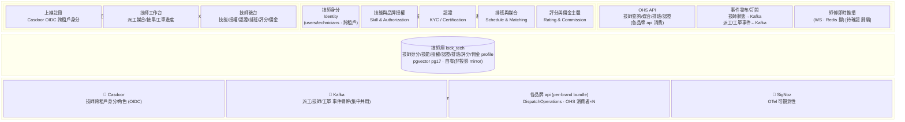
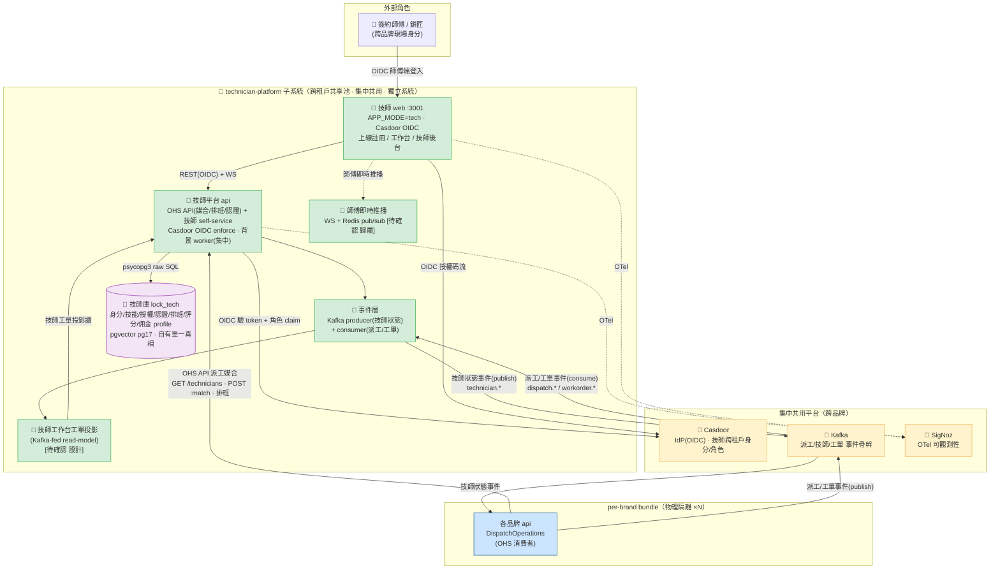
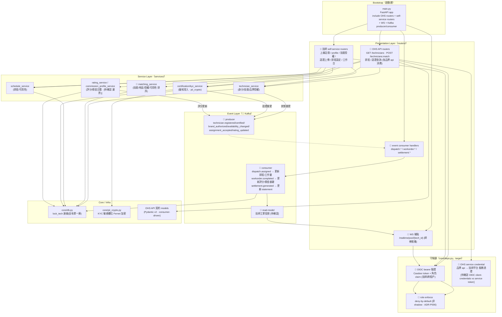
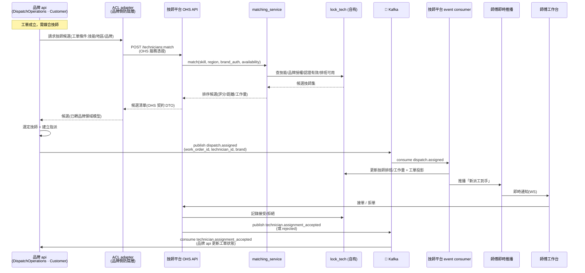
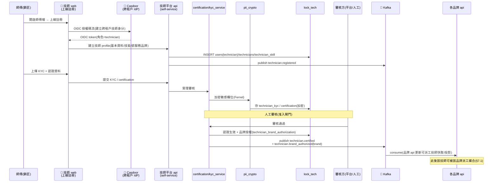
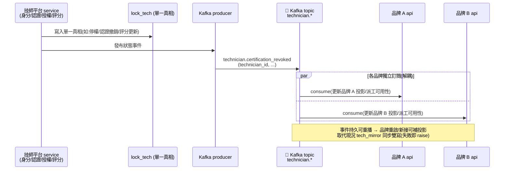
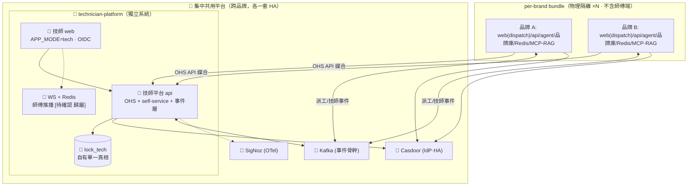

# technician-platform 子系統架構與設計 — 跨租戶技師共享池獨立系統（target 理想態）

**版本** v1.0（target-state 理想態）| **日期** 2026-07-07 | **狀態** 理想態藍圖（依 [[ADR-P004]] 定案）

---

## 目錄

1. [文件元資訊](#1-文件元資訊)
2. [Solution Landscape（Level 0 — 能力域地圖）](#solution-landscapelevel-0--能力域地圖)
3. [C4 Container 清單表（target）](#2-c4-container-清單表target)
4. [C4 L2 Container Diagram（target）](#3-c4-l2-container-diagramtarget)
5. [C4 L3 Component Diagram（技師平台 api 內部結構，target）](#4-c4-l3-component-diagram技師平台-api-內部結構target)
6. [DDD 設計](#5-ddd-設計)
7. [技術選型表](#6-技術選型表)
8. [關鍵使用流程](#7-關鍵使用流程)
9. [部署視圖（target）](#8-部署視圖target)
10. [非功能性需求（NFR）](#非功能性需求nfr目標--策略)
11. [風險登記表](#9-風險登記表)
12. [演進路線](#10-演進路線)

> **註**：L1 System Context 由 `smartlock-docs/00_platform/P1/05_platform_architecture_L1.md`（v2.0 理想態）集中管理，本文件從 L2 Container 起描述 technician-platform 子系統內部。**本文件為 target 理想態**：凡標 `🎯` 為理想態新增/演進元件；「(現況)」標示尚未落地、屬遷移路徑起點者；未能由 ADR/L1/現況事實證實者標 `[待確認]`。現況 as-is 事實由 tech-db（`lock_tech`）+ tech-api surface（`API_SURFACE=tech`）+ `tech_mirror` 雙寫佐證（見 §10 演進）。

---

## 1. 文件元資訊

| 欄位 | 內容 |
|------|------|
| 子系統識別碼 | technician-platform（跨租戶技師共享池獨立系統）|
| 文件類型 | P1 架構與設計（Architecture & Design）|
| C4 範圍 | L2 Container + L3 Component（technician-platform）|
| 撰寫日期 | 2026-07-07 |
| 版本 | v1.0（target-state 理想態）|
| 依據決策 | [[ADR-P004]]（技師共享池獨立系統，核心）、[[ADR-P005]]（集中共用元件 + 獨立師傅 web）、[[ADR-P006]]（四方 RBAC，技師=跨租戶身分）、[[ADR-P007]]（Kafka/Redis 事件與即時）、[[ADR-P003]]（Casdoor 統一 IdP）|
| 現況佐證來源 | `docker-compose.tech.yml`、`api/main.py`（`API_SURFACE=tech` 塑形）、`api/routers/technician*`、`api/core/tech_mirror.py`、`api/core/db.py`、`SQL/migrations/*technician*`、`scripts/db/split-tech-db.sh` |
| 審閱狀態 | 理想態藍圖（待業主/架構師覆核）|

> **定位（一句話）**：technician-platform 是**跨租戶技師共享池的獨立系統**（[[ADR-P004]]）——技師是**跨品牌身分**（一個鎖匠可服務多個品牌），不鎖進任何單一品牌 bundle。系統擁有技師身分/技能/品牌授權/認證（KYC/certification）/排班/評分/佣金主體，以 `lock_tech` 為**單一真相**；**含獨立師傅 web**（上線註冊 / 工作台 / 技師後台，[[ADR-P005]]）。各品牌**派工/工單平台（api）經 OHS API + Kafka 事件**串接（非直連技師庫）；技師身分接 **Casdoor**（跨租戶，[[ADR-P003]]/[[ADR-P006]]）。

---

## Solution Landscape（Level 0 — 能力域地圖）

> **C4 之前的一層**：先用「能力域 / 業務分群」對齊業務與管理層，再 zoom 進 C4 L2。受眾為業務 + 管理層，**不**回答 runtime / protocol（那在 §3 L2 與 §4 L3）。本能力域與 §5.2 DDD 的 TechnicianContext 對齊。



### Level 0 能力域說明

| 能力域 / 分群 | 說明 | 對應 C4 Container（§2）| 對應 DDD 上下文（§5.2）|
|:---|:---|:---|:---|
| 獨立師傅 web | 上線註冊 / 工作台 / 技師後台；**跨品牌共用、不進品牌 bundle**（[[ADR-P005]]）| 🎯 技師 web | TechnicianContext（Presentation）|
| 技師身分 | `users(role=technician)` / `technicians`；**跨租戶單一真相** | 🎯 技師平台 api + 🎯 lock_tech | TechnicianContext |
| 技能與品牌授權 | `technician_skill` / `technician_brand_authorization`；決定可服務哪些品牌 | 🎯 技師平台 api + 🎯 lock_tech | TechnicianContext |
| 認證（KYC/cert）| `technician_kyc` / `technician_certification`；審核准入閘門 | 🎯 技師平台 api + 🎯 lock_tech | TechnicianContext |
| 排班與媒合 | `technician_schedule_requests` / 可用性；派工媒合候選排序 | 🎯 技師平台 api（OHS matching）| TechnicianContext ↔ DispatchOperations |
| 評分與佣金主體 | 評分、佣金 profile / payout rule；**金額計算屬派工平台，主體歸技師平台**（[[待確認]] 邊界切分）| 🎯 技師平台 api + 🎯 lock_tech | TechnicianContext（與 DispatchOperations CS）|
| 對外整合面 | OHS API（同步供給）+ Kafka 事件（非同步解耦）| 🎯 技師平台 api（OHS + 事件層）| TechnicianContext（OHS/PL）|

**Level 0 檢查清單**：
- [x] 只呈現能力域，無 runtime protocol（protocol 在 §3 L2）
- [x] 能力域與 §2 Container、§5.2 DDD 上下文可雙向對照
- [x] 外部系統與平台 L1（Casdoor/Kafka/各品牌 api/SigNoz）一致
- [x] 圖塊用業務語言命名；target 元件標 🎯

---

## 2. C4 Container 清單表（target）

> technician-platform 為**集中共用元件（非 per-brand）**，跨所有品牌一套 HA（[[ADR-P004]] §6、[[ADR-P005]] §3.4）。以下為理想態組成；現況對應物見「演進來源」欄。

| # | Container 名稱 | 類型 | 技術棧（target）| 狀態 | 演進來源（現況）|
|---|---------------|------|--------|------|------|
| 1 | 🎯 技師 web（technician-web）| Web（SPA）| Next.js（`APP_MODE=tech`）· Casdoor OIDC 授權碼流 | 理想態（跨品牌共用）| tech-web :3001（`APP_MODE=tech`，登入走共用 JWT）|
| 2 | 🎯 技師平台 api（technician-platform-api）| Process | Python 3.11 / FastAPI / psycopg3；**OHS API + Kafka client + OIDC 驗證** | 理想態（獨立系統）| tech-api surface（`API_SURFACE=tech`，`_TECH_SURFACE_PREFIXES` 保留清單，背景 worker 全停）|
| 3 | 🎯 技師庫 lock_tech | Database | `pgvector/pgvector:pg17`；**自有單一真相**（非品牌庫投影 mirror）| 理想態 | tech-db :5434（`lock_tech`，品牌庫子集 6-7 表；靠 `tech_mirror` 雙寫回品牌庫）|
| 4 | 🎯 事件層（Kafka producer + consumer）| 進程內元件 | 技師狀態事件 producer；派工/工單事件 consumer（[[ADR-P007]]）| 理想態 | 無（現況無事件骨幹，靠 `tech_mirror` 同步寫）|
| 5 | 🎯 師傅即時推播（WS）| 進程內元件 + Redis | 師傅工作台即時推播（派工到手/工單變更）；Redis pub/sub 撐（[[ADR-P007]]）| 理想態 `[待確認]` 歸屬 | tech-web 的 WS 指向品牌 api :8001（in-memory，非自有）|

**外部相依（集中共用平台 / per-brand，非本系統 Container）**：

| 元件 | 關係 | 依據 |
|---|---|---|
| 🎯 Casdoor | 技師跨租戶身分 / 角色 claim 來源（OIDC）| [[ADR-P003]] / [[ADR-P006]] |
| 🎯 Kafka | 事件骨幹（集中共用）：技師狀態發布 + 派工/工單訂閱 | [[ADR-P007]] |
| 各品牌 api（per-brand bundle）×N | **OHS 消費者**：經 OHS API 查詢/媒合技師、經 Kafka 訂閱技師狀態 | [[ADR-P004]] §3 |
| 🎯 SigNoz | OTel 可觀測性（集中共用）| [[ADR-P002]] |

> **⚠️ 關鍵演進事實**：現況 technician-platform 尚未獨立——它是 api 的一個 `API_SURFACE=tech` 塑形面（與 dispatch/platform 同一份 codebase、共用 `API_JWT_SECRET_KEY`），且 `lock_tech` 為品牌庫**子集投影 + 雙寫 mirror**。理想態將其抽出為**獨立 codebase / 服務 + 自有庫**，並以 OHS API + Kafka 取代雙寫（[[ADR-P004]] §5、§10）。

---

## 3. C4 L2 Container Diagram（target）



**圖例**：
- 實線 `-->` = target 已定案整合路徑（依 ADR）；虛線 `-.->` = 監控旁路 / 即時推播 / 進程內相依。
- **整合三路（[[ADR-P004]] §3）**：① 各品牌 api → 技師平台 **OHS API**（同步查詢/媒合/排班）；② 技師平台 → **Kafka** 發布技師狀態事件（[[ADR-P007]]）；③ 技師平台 ← **Kafka** 訂閱派工/工單事件更新排班/評分/佣金與工單投影。**品牌不直連技師庫。**
- 🎯 技師工作台工單投影（read-model）為理想態設計提案：per-brand 物理隔離下，技師平台無法直連各品牌庫讀工單，改以 Kafka 事件餵養本地投影供師傅工作台檢視——**設計細節 `[待確認]`，非 ADR 明訂**。

---

## 4. C4 L3 Component Diagram（技師平台 api 內部結構，target）

以「分層 + 守衛鏈 + 事件層」描述 technician-platform-api 的內部模組結構。沿用現況 api 的分層慣例（router → service → core.db，services 不 import routers），並新增 **OHS 對外面**與 **Kafka 事件層**。



**分層要點（target）**：
- **守衛鏈全面 OIDC 化**：現況 tech surface 靠共用 `API_JWT_SECRET_KEY`（師傅 token 可打品牌 API），理想態改 **Casdoor OIDC**（技師=跨租戶身分，[[ADR-P003]]/[[ADR-P006]]），`role_required` 由 shadow-mode 轉 **deny-by-default enforce**。
- **OHS 服務憑證**：各品牌 api 呼叫技師平台 OHS API 屬 service-to-service，需獨立服務憑證（`[待確認]`：採 OIDC client-credentials 或 internal token，對齊現況 `require_internal_token` fail-closed 模式）。
- **事件層雙向**：producer 發技師狀態（`technician.*`）；consumer 收派工/工單（`dispatch.*` / `workorder.*` / `settlement.*`）更新排班、評分、佣金基礎與工單投影。**技師狀態事件為單一真相對外的最終一致廣播**（取代 `tech_mirror` 雙寫）。
- **KYC/PII**：認證敏感欄位沿用 app 層 Fernet 加密（`core/pii_crypto.py`，現況 CR-0115）。

---

## 5. DDD 設計

### 5.1 通用語言詞彙表（Ubiquitous Language）

| 術語 | 中文說明 | 備註 |
|------|----------|------|
| **技師共享池** | 跨租戶技師身分單一真相；一個鎖匠可服務多品牌，不屬任何單一品牌 bundle | [[ADR-P004]]；核心定位 |
| **OHS API** | Open Host Service——技師平台對各品牌 api 暴露的穩定同步介面（查詢/媒合/排班/認證）| [[ADR-P004]] §3；供給方 |
| **技師狀態事件** | `technician.*` Kafka 事件（註冊/認證/授權/上線離線/接單/評分）；最終一致廣播 | [[ADR-P007]]；取代 `tech_mirror` 雙寫 |
| **品牌授權（brand authorization）** | 技師可服務哪些品牌的授權關係 | `technician_brand_authorization`；決定媒合候選集 |
| **認證准入（KYC/certification）** | 技師 KYC + 技能認證審核閘門，通過才可接單 | `technician_kyc` / `technician_certification` |
| **派工媒合（matching）** | 給定工單條件（技能/地區/品牌），回傳排序技師候選 | `matching_service`；OHS `POST /technicians:match` |
| **佣金主體** | 技師的佣金 profile / payout rule / statement 身分歸屬技師平台；**金額計算由派工平台工單觸發** | 邊界切分 `[待確認]`（見 §5.3）|
| **技師工單投影（read-model）** | Kafka 事件餵養的本地工單讀模型，供師傅工作台檢視（per-brand 隔離下不直連品牌庫）| 理想態設計提案 `[待確認]` |
| **技師跨租戶身分** | Casdoor 管理的技師身分，獨立於品牌租戶 token（有別於現況共用 JWT）| [[ADR-P003]]/[[ADR-P006]] |

### 5.2 限界上下文定位（Bounded Context）

**核心特徵**：TechnicianContext 由現況「api 一庫三面」中的 tech surface **升格為獨立限界上下文 + 獨立系統**（[[ADR-P004]]），與 DispatchOperationsContext（各品牌 api）以 **OHS + Kafka 事件**解耦，而非現況的 Shared Kernel 雙寫 mirror。

```
┌──────────────────────────────────────────────────────────────────────┐
│              🎯 technician-platform（獨立系統 · 跨租戶共享池）           │
│                                                                        │
│  ┌──────────────────────────────────────────────────────────────┐    │
│  │                      TechnicianContext                          │    │
│  │  支撐域 → 升格獨立系統（Supporting → Standalone）              │    │
│  │                                                                 │    │
│  │  - 技師身分 users(technician) / technicians（跨租戶單一真相）   │    │
│  │  - 技能 technician_skill / 品牌授權 brand_authorization         │    │
│  │  - 認證 KYC / certification（准入閘門）                         │    │
│  │  - 排班 schedule / 媒合 matching / 評分 rating                  │    │
│  │  - 佣金主體 commission profile（金額計算屬 Dispatch，見 §5.3）  │    │
│  │  - 自有庫 lock_tech（單一真相，非投影 mirror）                  │    │
│  └───────┬───────────────────────────────────┬────────────────────┘    │
│          │ OHS（同步供給）                    │ PL（Kafka 事件發布）    │
└──────────┼───────────────────────────────────┼─────────────────────────┘
           │                                   │
   ┌───────▼────────────────┐         ┌────────▼──────────────────┐
   │ DispatchOperationsCtx  │         │  Kafka 事件骨幹（PL）       │
   │ 各品牌 api（per-brand） │◄────────│  technician.* / dispatch.*  │
   │ Customer（下游消費者）  │  訂閱   │  workorder.* / settlement.* │
   │ 經 ACL adapter 呼 OHS  │         └─────────────────────────────┘
   └────────────────────────┘
           ▲
           │ OHS OIDC（技師身分/角色/租戶）
   ┌───────┴────────────────┐
   │ IdentityContext         │
   │ Casdoor（IdP·跨租戶）   │
   └─────────────────────────┘

上游供給：technician-platform（OHS API + Kafka 事件）→ 各品牌 api
身分來源：Casdoor（技師跨租戶身分/角色 claim）
下游消費：各品牌 api（DispatchOperations，Customer，經 ACL adapter 串接）
```

**上下文關係模式（對齊 L1 §3 圖）**：

| 關係 | 模式 | 語義 |
|---|---|---|
| technician-platform → 各品牌 api | **OHS（Open Host Service）** | 技師平台為供給方，暴露穩定 OHS API 給 N 個品牌消費者 |
| 各品牌 api → technician-platform | **CS（Customer-Supplier）** + **ACL** | 品牌 api 為 Customer（下游），以防腐層 adapter 包裝技師平台呼叫，避免耦合技師領域模型 |
| technician-platform ↔ Kafka ↔ 各品牌 api | **PL（Published Language）** | 技師狀態事件 / 派工事件以共享 schema 發布，雙向解耦訂閱 |
| Casdoor → technician-platform | **OHS OIDC** | 技師身分/角色/租戶由 Casdoor 集中供給（[[ADR-P003]]）|

> **對照現況（as-is）**：現況 DispatchOperations ↔ Technician 為 **SK（Shared Kernel）**——同一 codebase、`lock_tech` 為品牌庫子集投影、靠 `tech_mirror` 雙寫維持一致（G-08）。理想態 **SK → OHS+PL 解耦**，消除跨庫雙寫耦合（[[ADR-P004]]）。

### 5.3 邊界待確認：佣金主體 vs 金額計算 `[待確認]`

[[ADR-P004]] §3 明訂技師平台職責含「佣金主體」，但佣金**金額**源自派工平台的工單/結算（現況 `saas.technician_statement` / `technician_penalty_bonus_ledger` / `technician_commission` 位於品牌庫）。理想態合理切分（**待業主/架構師裁決**）：

- **技師平台擁有**：技師佣金 profile、payout rule 綁定技師身分、對技師的 statement 呈現主體。
- **派工平台擁有**：工單觸發的佣金金額計算、對帳、B2B 結算；經 `settlement.generated` 事件通知技師平台更新 statement。
- **未定**：statement 產生的實體歸屬（技師平台 aggregate vs 派工平台 aggregate + 技師平台投影）、`technician_payout_rule` 遷移落點——列入 §10 演進 Phase C 的 contract 設計項。

---

## 6. 技術選型表

| 類別 | 選用技術（target）| 選型理由 / 取捨 | 現況起點 |
|------|---------|----------------|------|
| Web 框架（師傅 web）| Next.js（`APP_MODE=tech`）+ Casdoor OIDC 授權碼流 | 沿用平台 web 技術棧；**跨品牌共用一套、不進品牌 bundle**（[[ADR-P005]]）| tech-web :3001（現況登入走共用 JWT）|
| API 框架 | FastAPI + uvicorn / psycopg3 raw SQL | 沿用現況 api 分層與連線設計，降遷移成本；抽出為獨立 codebase | tech-api surface（`API_SURFACE=tech`）|
| 身分/認證 | **Casdoor OIDC**（棄共用 HS256）| 技師=跨租戶身分，集中 IdP 消除「師傅 token 可打品牌 API」風險（[[ADR-P003]]/[[ADR-P006]]）| 現況共用 `API_JWT_SECRET_KEY` |
| 授權 | **role_required deny-by-default enforce**（非 shadow）| 對齊四方 RBAC，技師角色跨租戶（[[ADR-P006]]）| 現況 shadow-mode（log-only）|
| 資料庫 | **lock_tech 自有**（pgvector/pgvector:pg17）| 升格單一真相；沿用 pg17 + pgcrypto（KYC）| tech-db :5434（品牌庫子集投影 + 雙寫 mirror）|
| 對外整合（同步）| **OHS API**（consumer-driven contract）| 穩定供給面，各品牌以 ACL adapter 消費，避免直連技師庫（[[ADR-P004]]）| 現況品牌 api 直讀 `TECH_POSTGRES_URI` + 雙寫 |
| 對外整合（非同步）| **Kafka 事件骨幹**（集中共用）| 技師狀態最終一致廣播 + 派工/工單訂閱；持久/可重播/解耦（[[ADR-P007]]）| 現況 `tech_mirror` 同步雙寫（無事件）|
| 即時推播 | **WS + Redis pub/sub** `[待確認 歸屬]` | 師傅工作台派工到手即時通知，水平擴展（[[ADR-P007]]）| 現況 tech-web WS 指向品牌 api :8001（in-memory）|
| PII 加密 | cryptography Fernet（`core/pii_crypto.py`）| KYC 敏感欄位 app 層加密 | 現況 CR-0115（已存在）|
| 可觀測性 | SigNoz（OTel）| 集中系統監控（[[ADR-P002]]）| 現況無 |
| 部署 | 集中共用元件（跨品牌一套 HA）| 非 per-brand；provisioning 隨集中平台（[[ADR-P005]]）| 現況 tech stack `external` 掛 dispatch network |

---

## 7. 關鍵使用流程

### 7.1 派工媒合（各品牌 api 經 OHS API + Kafka，target）

> 對應 [[ADR-P004]] §3、L1 §3「DO ↔ TC：OHS + Kafka 事件 派工媒合」。**品牌不直連技師庫**；媒合走同步 OHS，指派/接單走非同步事件。



**要點**：
- **同步 OHS 只做「查詢/媒合」**（讀，低延遲、需即時排序）；**指派/接單走 Kafka 事件**（寫、解耦、可重播）。
- 品牌 api 以 **ACL adapter** 隔離技師平台契約，技師領域模型變動不外溢品牌領域（[[ADR-P004]] CS/ACL）。
- 技師「接單/拒單」以 `technician.assignment_accepted/rejected` 事件回品牌 api，非同步收斂工單狀態——最終一致（[[ADR-P007]]）。

### 7.2 技師上線註冊 + 認證准入（獨立師傅 web，target）

> 對應 [[ADR-P004]] §3.2「含獨立師傅 web」、[[ADR-P005]]「師傅端不進品牌 bundle」、[[ADR-P003]] Casdoor 跨租戶身分。



**要點**：
- 註冊即建立 **Casdoor 跨租戶身分**（有別於現況共用 JWT 的品牌內註冊 `register_technician`）；師傅端**完全在技師平台**，品牌 bundle 不含師傅端（[[ADR-P005]]）。
- **認證/KYC 為准入閘門**：通過並取得 `technician.brand_authorized` 後，才進入 §7.1 派工媒合候選集。
- 認證/授權變更以 `technician.certified` / `technician.brand_authorized` 事件廣播，各品牌 api 訂閱更新——**取代現況 `tech_mirror` 雙寫回品牌庫**（[[ADR-P004]] §5、[[ADR-P007]]）。

### 7.3 技師狀態變更廣播（汰除雙寫 mirror 的核心機制，target）



> **與現況對比**：現況 `core/tech_mirror.py` 在技師身分寫入權威庫後，**同步** upsert/刪除鏡射回品牌庫的技師列（35 張品牌表 FK 指向 users/technicians），鏡射失敗大聲 raise（強耦合、跨庫無交易保證，G-08）。理想態改 **Kafka 事件最終一致廣播**，各品牌獨立訂閱、可重播補投影，解除跨庫雙寫耦合（[[ADR-P004]] §5、[[ADR-P007]]）。

---

## 8. 部署視圖（target）

> technician-platform 為**集中共用元件（跨品牌一套 HA）**，非 per-brand bundle（[[ADR-P004]] §6、[[ADR-P005]] §3.4）。各 per-brand bundle 經 OHS API + Kafka 串接。



**部署要點**：
- **師傅 web 跨品牌共用一套**：這是 [[ADR-P005]] 讓 per-brand bundle 「可完整獨立部署、不依賴共享元件」的關鍵——師傅端抽離到集中技師平台，品牌 bundle 只含品牌營運 dispatch web。
- **lock_tech 集中一套**：非「一品牌一庫」（品牌庫才是 per-brand）；技師跨租戶單一真相。
- **HA 需求**：技師平台成跨品牌單點（媒合是派工必經路徑），OHS API + lock_tech 需 HA + 讀寫分離（[[ADR-P007]] read replica，清單/查詢走 replica）。
- **演進來源（現況拓撲）**：現況 tech stack（tech-web :3001 / tech-api :8002 / tech-db :5434）以 `external: true` 掛 dispatch stack network、共享 `media` volume、WS 指向品牌 api :8001；雲端目前為單庫 fallback（技師庫雲端未接）。理想態需解除此耦合並獨立部署（見 §10）。

---

## 非功能性需求（NFR：目標 + 策略）

> 目標（Targets，含 ID）為對 stakeholder 的契約、應穩定；策略為達成手段、可隨架構演進。目標用 `NFR-<屬性>-NN` 編號。

### 效能 Performance

| ID | 指標 | 目標 |
|:---|:---|:---|
| NFR-PERF-01 | OHS 媒合查詢回應（`POST /technicians:match`）| < 300ms（p95）`[待確認]` 無實測 |
| NFR-PERF-02 | 師傅工作台派工推播延遲 | 指派事件 → 師傅收到 < 2s（跨 Kafka + WS）|

**策略**：媒合查詢走 read replica（[[ADR-P007]]）；技能/授權/排班索引；候選排序在 service 層。**限制**：媒合為派工必經同步路徑，延遲直接影響派工體驗——需監控 + 快取熱資料。

### 可擴展性 Scalability

| ID | 指標 | 目標 |
|:---|:---|:---|
| NFR-SCAL-01 | 大量技師上工不卡頓 | 支撐後續大量技師併發上線/接單（[[ADR-P007]] 業主目標）|
| NFR-SCAL-02 | 多品牌線性擴展 | 新增品牌 = 新增 OHS 消費者 + Kafka 訂閱者，技師平台不需 per-brand 複製 |

**策略**：WS 推播走 Redis pub/sub（取代 in-memory，水平擴展）；Kafka 事件解耦品牌訂閱者；讀寫分離擴展查詢量（[[ADR-P007]]）。**現況阻斷**：tech surface 現與 dispatch 同 codebase、WS 靠品牌 api in-memory hub，無法獨立水平擴展（見 §10）。

### 可用性 Availability

| ID | 指標 | 目標 |
|:---|:---|:---|
| NFR-AVAIL-01 | 技師平台 HA | 集中單點，OHS API + lock_tech 需 HA（媒合不可用 → 全品牌派工受阻）|
| NFR-AVAIL-02 | 事件最終一致 | Kafka 持久可重播，品牌訂閱者當機恢復後可補投影 |

**策略**：技師平台與 Casdoor 同屬集中關鍵單點，需 HA + 備份（[[ADR-P005]] §4）；派工媒合 OHS 若短暫不可用，品牌側 ACL adapter 應有降級策略（`[待確認]`：快取上次候選 / 排隊重試）。

### 安全性 Security

| ID | 指標 | 目標 | 現況起點 |
|:---|:---|:---|:---|
| NFR-SEC-01 | 技師身分認證 | Casdoor OIDC 跨租戶身分，deny-by-default | ❌ 現況共用 JWT（師傅 token 可打品牌 API，密鑰紀律風險）|
| NFR-SEC-02 | 授權 enforce | 技師 self-service / OHS 端點 role enforce | ❌ 現況 shadow-mode（log-only）|
| NFR-SEC-03 | OHS 服務憑證 | 品牌 api → 技師平台 service-to-service 認證 | `[待確認]` 憑證機制（OIDC client-credentials vs internal token）|
| NFR-SEC-04 | KYC/PII 保護 | 認證敏感欄位 app 層加密 | ✅ `core/pii_crypto.py` Fernet（CR-0115 已有）|

**策略**：詳見技師平台 P3 安全清單（`[待確認]` 待建）。**重點**：現況「師傅 token 與品牌 token 互通」是明確攻擊面，Casdoor OIDC 化 + 技師跨租戶身分為理想態關鍵安全改善。

### 可維護性 Maintainability

| ID | 指標 | 目標 |
|:---|:---|:---|
| NFR-MAINT-01 | 跨系統契約測試 | consumer-driven contract（品牌 api ↔ OHS API + Kafka event schema）|
| NFR-MAINT-02 | 汰除雙寫 mirror | `tech_mirror` 移除，一致性全走事件 |

**策略**：OHS API + Kafka event schema 為版本化契約，以 consumer-driven contract test 防破壞（[[ADR-P004]] §5.5）；遷移期並存「雙寫 + 事件」兩路，逐步 cutover 後移除 `tech_mirror`（見 §10 Phase C）。

---

## 9. 風險登記表

| # | 風險描述 | 嚴重性 | 發生可能性 | 影響範圍 | 緩解策略 | 依據 |
|---|---------|--------|-----------|---------|---------|------|
| R-01 | **技師平台成跨品牌單點**：媒合是所有品牌派工的必經同步路徑，OHS API / lock_tech 不可用 → 全品牌派工受阻 | **高** | 中 | 全平台派工 | HA + read replica（[[ADR-P007]]）；品牌側 ACL 降級策略 `[待確認]` | [[ADR-P004]] §4 |
| R-02 | **遷移期並存雙寫 + 事件雙路**：抽出獨立系統與汰除 `tech_mirror` 之間，身分一致性同時靠雙寫與事件，易漂移/重複 | **高** | 高（遷移期）| 技師身分一致性 | 明確 cutover gate；先影子並存驗證再切斷雙寫（見 §10 Phase C）| [[ADR-P004]] §4/§5 |
| R-03 | **佣金主體邊界未定**：技師平台「佣金主體」與派工平台「金額計算」切分未定案，statement 歸屬 + `technician_payout_rule` 落點懸置 | 中 | 中 | 結算/佣金正確性 | §5.3 列裁決項；Phase C contract 設計前先定案 | [[ADR-P004]] §3 · `[待確認]` |
| R-04 | **技師工單投影設計未定**：per-brand 隔離下師傅工作台如何看工單（Kafka read-model vs OHS 反向呼叫）非 ADR 明訂 | 中 | 中 | 師傅工作台體驗 | 定義 read-model 事件 + CQRS 投影設計 `[待確認]`；contract 測試 | 本文 §3/§5.1 |
| R-05 | **現況強耦合解除成本**：tech stack 與 dispatch stack 共享 network / `media` volume、WS 指向品牌 api、同 codebase、共用 JWT——抽出獨立需逐一解耦 | 中 | 高 | 部署/遷移工作量 | 分階段抽出（codebase → 認證 → 庫 → 事件），每步契約測試 | 現況 `docker-compose.tech.yml` / `main.py` |
| R-06 | **Casdoor 跨租戶技師身分建模**：技師非屬單一品牌 org，Casdoor org/角色如何表達跨租戶技師身分需設計 | 中 | 中 | 身分/授權正確性 | 與 [[ADR-P003]]/[[ADR-P006]] 協調技師 org 模型 `[待確認]` | [[ADR-P006]] §3 |
| R-07 | **雲端技師庫未接**：現況雲端為單庫 fallback（`TECH_POSTGRES_URI` 未設），技師庫雲端接入屬後續（AI-2/AI-3）| 低-中 | 中 | 雲端上線 | 隨集中共用平台 provisioning（[[ADR-P005]]）補雲端技師庫 | 現況 `brands/locksmart.env` 註 |

---

## 10. 演進路線

> 對應 [[ADR-P004]] §5 執行計畫：由現況（tech-db + tech-api surface + 雙寫 mirror）→ 抽出獨立系統 → 汰除 mirror。昂貴階段 gate 在業主同意。與平台 L1 §6 Phase 2「technician-platform 抽出」對齊。

### 現況 baseline（as-is 起點）

- **codebase**：與 dispatch/platform 同一份 FastAPI，靠 `API_SURFACE=tech` 塑形（`_TECH_SURFACE_PREFIXES` 保留清單、背景 worker 全停）。
- **資料**：`lock_tech` 為品牌庫**子集投影**（6-7 表）+ **權威庫**；一致性靠 `core/tech_mirror.py` **同步雙寫**回品牌庫（35 表 FK 投影）+ `split-tech-db.sh --verify` 事後比對（G-08）。
- **認證**：共用 `API_JWT_SECRET_KEY`（師傅 token 與品牌 token 互通）；shadow-mode RBAC。
- **部署**：tech stack `external` 掛 dispatch network、共享 `media` volume、WS 指向品牌 api :8001；雲端單庫 fallback。

### Phase A — 抽出獨立服務 + 庫（對應 [[ADR-P004]] §5.1）

| 任務 | 交付物 | 驗收 |
|------|--------|------|
| 由 tech-api surface 抽出 `technician-platform` 獨立 codebase / 服務 | 獨立 repo/service 骨架 | 技師平台可獨立啟動，不依賴 dispatch codebase |
| `lock_tech` 升格自有單一真相庫（含 KYC/cert/schedule 全域）| 自有 schema + 資料遷移計畫 | lock_tech 不再是品牌庫子集投影 |
| 解除部署耦合（獨立 network / 媒體 / WS）| 獨立部署拓撲 | 不共享 dispatch network / volume |

### Phase B — OHS API + Kafka 事件契約 + Casdoor（對應 [[ADR-P004]] §5.2/§5.4）

| 任務 | 交付物 | 驗收 |
|------|--------|------|
| 定義技師平台 OHS API（查詢/媒合/排班/認證）| OHS API 契約（OpenAPI）| 品牌 api 可經 OHS 取代直讀技師庫 |
| 定義技師狀態事件契約（`technician.*` → Kafka）| Kafka event schema（[[ADR-P007]]）| 技師狀態變更發布可被訂閱 |
| 技師身分接 Casdoor（跨租戶 OIDC）| OIDC 驗證 + 技師 org 模型 | 棄共用 JWT，技師=跨租戶身分（[[ADR-P003]]/[[ADR-P006]]）|
| RBAC shadow → enforce（技師端點）| deny-by-default 授權 | 未授權角色寫技師資料回 403 |

### Phase C — 汰除雙寫 mirror（對應 [[ADR-P004]] §5.3/§5.5）

| 任務 | 交付物 | 驗收 |
|------|--------|------|
| 品牌 api 改經 ACL adapter 串接 OHS + 訂閱 Kafka 事件 | 品牌側 ACL adapter + consumer | 品牌不再直連 `TECH_POSTGRES_URI` |
| 影子並存驗證（雙寫 + 事件並行比對）後切斷雙寫 | cutover gate + 比對報告 | 一致性全走事件，`tech_mirror` 可安全移除 |
| 移除 `core/tech_mirror.py` 雙寫 | 雙寫下線 | G-08 收斂，跨庫耦合解除 |
| 佣金主體邊界定案 + statement 契約（§5.3）| 佣金切分 ADR/CR + 事件契約 | `settlement.generated` 事件驅動 statement |
| consumer-driven contract 測試 | 跨系統契約測試套件 | 品牌 api ↔ OHS/事件 契約破壞可被 CI 攔截 |

### 重新評估觸發（[[ADR-P004]] §4）

> 若最終只單一品牌營運 → 技師平台可**退化為 api 內模組**（獨立系統的價值來自跨品牌共享；單品牌下 OHS + Kafka 的解耦成本可能不划算）。

---

*文件結尾 — technician-platform 子系統架構與設計 v1.0（target 理想態）/ 2026-07-07*
