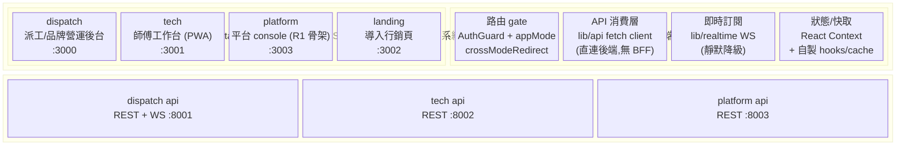
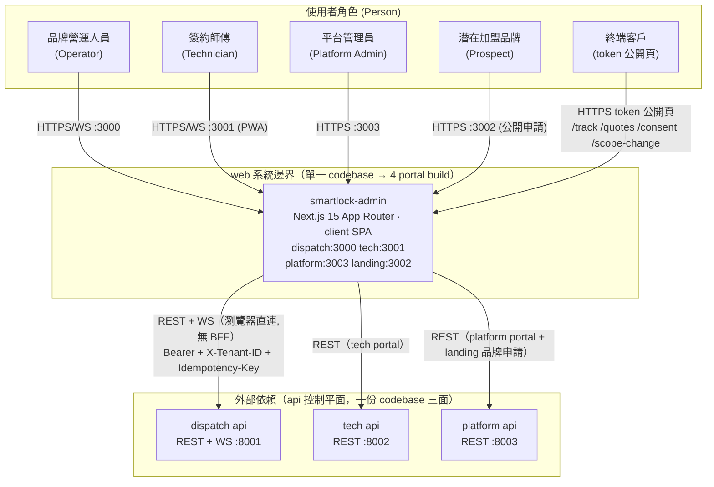
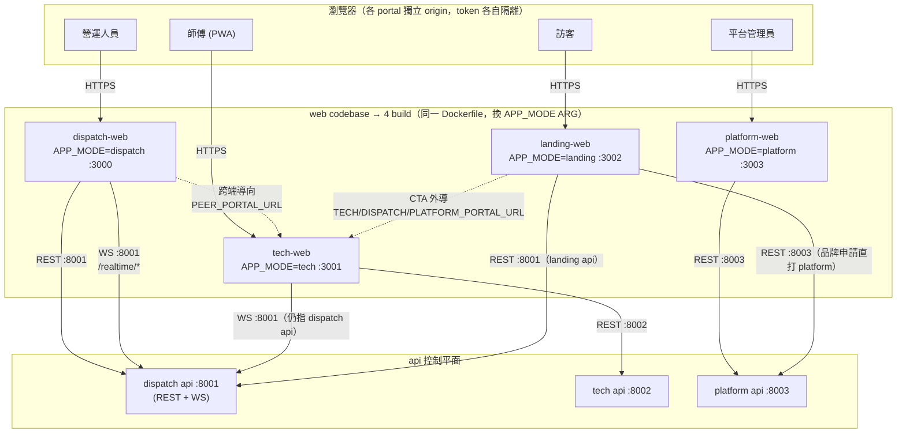
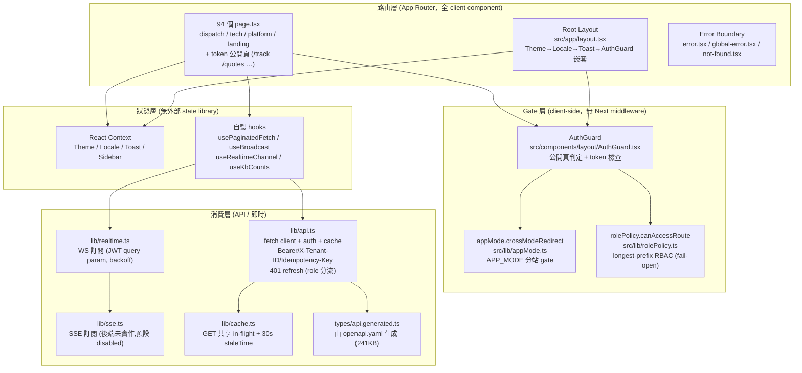
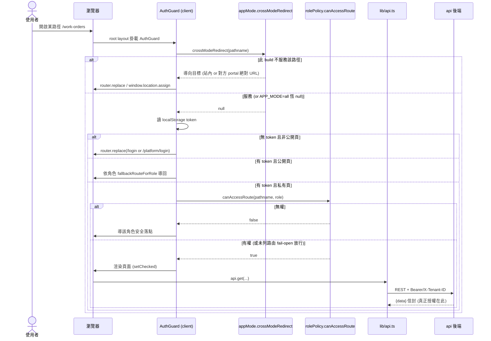
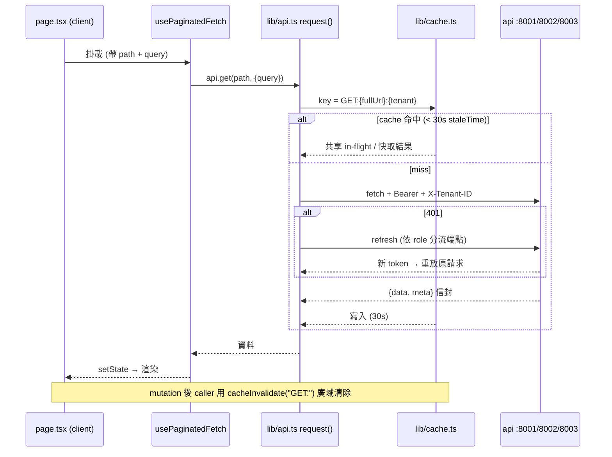
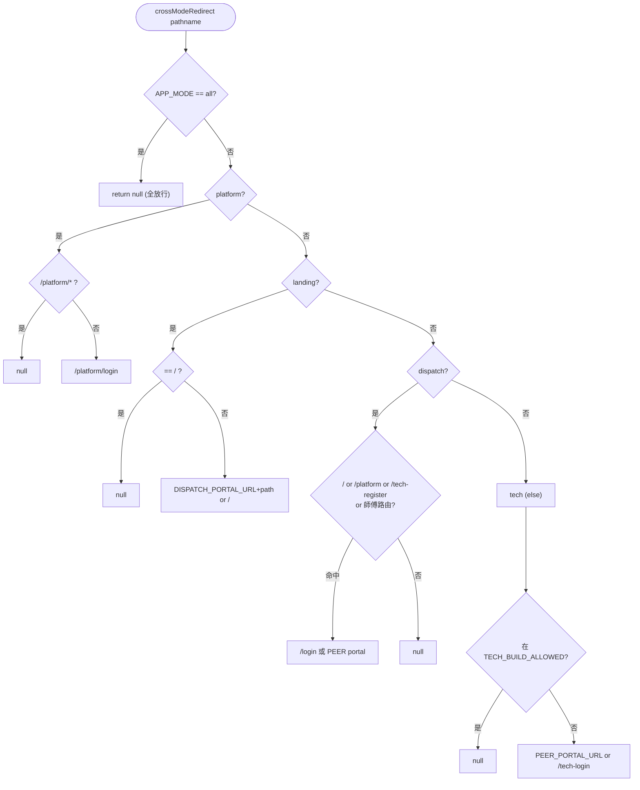
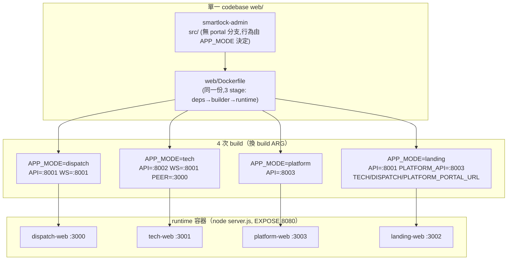

# 架構與設計文件 — web 子系統（Smart Lock 多站前端）

## 1. 元資訊

| 欄位 | 內容 |
|---|---|
| 文件版本 | v1.0 |
| 建立日期 | 2026-07-07 |
| 作者 | web 技術文件撰寫者（現況調查綜合）|
| 審核狀態 | 草稿（現況 baseline）|
| 架構層級 | C4 L1（定位）→ L2 Container → L3 Component |
| 涵蓋範圍 | 單一 Next.js codebase（`web/`，`smartlock-admin` v0.1.0）→ APP_MODE build 出 4 個 portal |
| 佐證來源 | `web/src/`、`web/Dockerfile`、`web/next.config.ts`、`docker-compose.{dispatch,tech,platform,landing}.yml` 實際 code（附 `file:line`）|
| 平台定位 | PresentationContext（下游展示層 Downstream），對應平台 C4 L1 的 `web` 節點 |

**說明：** 本文件為 web 子系統的現況（as-is）架構描述。所有整合關係、port、gate 機制均以 `web/` code 與 compose 為準；宣告存在但後端未接線者以 `⚠️` 標示，未能證實者標 `[待確認]`。

> **本質定位（必讀）**：web 表面掛在 Next.js **App Router** 上，但**沒有任何 async server component 做資料抓取**（`src/app` 內 `export default async` 零命中），全部 94 個 `page.tsx` 皆標 `"use client"`。因此本子系統實質是一個**掛在 App Router 之上的 client-side SPA**：路由由 App Router 檔案系統提供，但渲染、狀態、資料抓取、認證 gate 全在瀏覽器端執行。所有「架構決策」都應在此前提下理解。

---

## 2. Solution Landscape（Level 0 — 能力域地圖）

> **C4 之前的一層**：先用「能力域 / portal 分群」對齊業務與管理層，再 zoom 進 C4。
> 受眾：業務 + 管理層。這層回答「web 涵蓋哪些前端能力域、切成哪幾個 portal」，**不**回答 runtime / protocol（那是 §4 L2）。

web 為 Smart Lock 平台的**多站營運前端**。同一份 codebase 透過 build-time 旗標 `NEXT_PUBLIC_APP_MODE` 塑出 4 個對外 portal，各自服務不同角色、連不同的 api surface。後端業務邏輯與持久層一律委由 api 控制平面（無自有 DB）。



### 能力域說明

| 能力域 / portal | 說明 | 對應 C4 Container（§3） |
|---|---|---|
| dispatch portal | 完整營運後台：進線 case、對話、問題卡、工單（列表/看板/地圖）、派工佇列、報價、技師/客戶主檔、帳務/退款/保固/爭議、知識庫、KPI 報表、角色/治理 | 同一 `smartlock-admin` 容器，`APP_MODE=dispatch` |
| tech portal | 師傅工作台（PWA 響應式）：儀表板、搶單池、我的工單 + 6 子流程、帳戶/排班/對帳 | 同一容器，`APP_MODE=tech` |
| platform portal | 平台方 console（R1 骨架）：儀表板、品牌申請審核、師傅審核、公開申請頁 | 同一容器，`APP_MODE=platform` |
| landing portal | 一頁式行銷（無登入態）：雙 CTA 外導師傅 / 品牌申請 | 同一容器，`APP_MODE=landing` |
| 共用能力域 | gate / API 消費 / 即時 / 狀態，四者為所有 portal 共用的 lib 層 | `src/lib/`、`src/hooks/`、`src/components/` |
| 外部系統 | api 控制平面提供業務資料與 WS 推播 | dispatch `:8001` / tech `:8002` / platform `:8003` |

**Level 0 檢查清單：**
- [x] 只呈現「portal 分群 / 能力域」，protocol 細節留 §4 L2
- [x] portal 與 §3 Container 清單可雙向對照（皆為同一 `smartlock-admin` 容器換 APP_MODE）
- [x] 外部系統分群與平台 L1（`00_platform/P1/05`）一致（api 三面 :8001/:8002/:8003）
- [x] 圖塊用業務語言命名

---

## 3. C4 L1 定位 — web 在平台中的位置

從 web 視角看，其為平台的**下游展示層（PresentationContext / Downstream）**，遵循 api 的 OpenAPI 契約（CF Conformist），無自有資料庫。



**平台定位說明：**

| 項目 | 說明 |
|---|---|
| 角色 | 下游展示層（Downstream Presentation Layer）|
| 上游依賴 | api 三面（dispatch/tech/platform surface），OpenAPI 契約 |
| 反腐層（ACL）| **無 BFF / 無 route handler**（`find src/app -name route.ts` 零命中）——瀏覽器直連後端，錯誤格式轉換在 client（`lib/apiError.ts`）|
| 自有持久層 | 無（No Own DB）；僅瀏覽器 localStorage 存 token / 偏好 |
| CF 遵循規範 | api OpenAPI（`types/api.generated.ts` 由 `openapi.yaml` 生成）|
| 授權邊界 | **不在 web**：client-side gate 只是 UX 層，真正授權靠後端 `role_required`（見 P3-13）|

---

## 4. C4 L2 Container Diagram

同一份 `smartlock-admin` codebase 用 `NEXT_PUBLIC_APP_MODE` build 出 4 個容器映像（實際共用同一 `web/Dockerfile`，只換 build ARG）。各容器內部程式碼完全相同，差異只在 build-time 烤入的 env（API base、APP_MODE、跨端 portal URL）。



### Container 清單

| 名稱 | 類型 | 技術棧 | Host Port | APP_MODE | REST base | WS base | 證據 |
|---|---|---|---|---|---|---|---|
| dispatch-web | process | Next.js 15 / React 19 / TS strict / Tailwind v4 | 3000 | `dispatch` | :8001 | ws://…:8001 | `docker-compose.dispatch.yml:122-133` |
| tech-web | process | 同上（PWA 響應式 TechShell）| 3001 | `tech` | :8002 | ws://…:8001 | `docker-compose.tech.yml:76-87` |
| platform-web | process | 同上（R1 骨架）| 3003 | `platform` | :8003 | — | `docker-compose.platform.yml:81-89` |
| landing-web | process | 同上（一頁式，無登入態）| 3002 | `landing` | :8001 + :8003 | — | `docker-compose.landing.yml:24-41` |

> 容器內部一律 EXPOSE 8080（`web/Dockerfile:103`），入口 `node server.js`（standalone）。表中 Port 為 host published port。tech-web 的 WS base 仍指 dispatch api `:8001`（即時 hub 在 dispatch surface）。

---

## 5. C4 L3 Component Diagram

以下為 `smartlock-admin` 的內部元件結構。因無 server component / BFF，分層以「路由層 → gate 層 → 消費層 → 狀態層」呈現，全部在瀏覽器執行。



**元件職責：**

| 元件 | 檔案 | 職責 |
|---|---|---|
| Root Layout | `src/app/layout.tsx:74-80` | Provider 嵌套 Theme→Locale→Toast→AuthGuard；FOUC 防閃白 inline script |
| AuthGuard | `src/components/layout/AuthGuard.tsx` | 掛 root layout，client-side 路由保護：先跑 crossModeRedirect，再 token / 公開頁 / role gate |
| appMode gate | `src/lib/appMode.ts:65-98` | APP_MODE 分站：判定當前 build 是否服務此路徑，否則導向對方 portal |
| rolePolicy | `src/lib/rolePolicy.ts:24-82` | route→roles longest-prefix 表；`/platform/*` deny-by-default，其餘未列**fail-open** |
| api client | `src/lib/api.ts` | 統一 fetch，header 注入、401 refresh、錯誤信封解析、GET cache |
| realtime | `src/lib/realtime.ts` | WS 訂閱層，一 channel 一 socket，backoff 重連，未配置靜默降級 |
| Context | `src/components/{theme,i18n,ui,layout}` | Theme / Locale / Toast（root layout）+ Sidebar（AuthGuard 認證後 subtree，`AuthGuard.tsx:119`）|

---

## 6. DDD 設計

### 6.1 限界上下文定位

web 在平台中扮演 **PresentationContext（展示上下文）**，為 **Downstream / Conformist**：

- **上游依賴**：api 三面（dispatch / tech / platform surface），透過 OpenAPI 契約遵循（CF）
- **職責邊界**：UI 渲染、client-side 路由 gate、瀏覽器端狀態管理、token 會話管理、即時訂閱降級
- **不跨越的邊界**：不直接連 DB、不持有業務規則（僅呈現後端決策）、**不做真正授權**（授權在 api）
- **無 ACL**：不同於 acme 的 BFF 反腐層，web 瀏覽器直連後端，錯誤格式相容性轉換（RFC7807 / legacy）在 client `lib/apiError.ts` 完成

### 6.2 通用語言詞彙表

| 術語 | 英文 | 定義 |
|---|---|---|
| APP_MODE | App Mode | build-time 旗標 `NEXT_PUBLIC_APP_MODE`，值 `all`/`dispatch`/`tech`/`platform`/`landing`。決定 client gate 放行哪些頁群（`appMode.ts:9`）|
| portal | Portal | 由 APP_MODE build 出的邏輯部署單元。web 有 4 portal，但只有一份 codebase |
| crossModeRedirect | — | APP_MODE gate 函式：判定當前 build 是否服務某路徑，否則回傳導向目標（`appMode.ts:65`）|
| PEER portal | Peer Portal | dispatch↔tech 配對用的對方 portal 絕對 URL（`NEXT_PUBLIC_PEER_PORTAL_URL`）|
| AuthGuard | Auth Guard | 掛 root layout 的 client-side 路由守衛（`AuthGuard.tsx`）|
| rolePolicy | Role Policy | 前端 route→roles 政策表，longest-prefix-wins（`rolePolicy.ts`）|
| fallback tenant | Fallback Tenant ID | 無 tenant 時退回的 1 號租戶 UUID（`api.ts:130`，含資料外洩 TODO）|
| 靜默降級 | Silent Degrade | WS/SSE base 未配置時不噴錯、不訂閱，頁面仍以一般 fetch 運作（`realtime.ts:50-53`）|
| token 公開頁 | Public Token Page | 客戶用簽章 token 存取的公開頁（`/track /quotes /consent /scope-change`）|

---

## 7. 技術選型表

| 類別 | 技術 | 版本 | 選型理由與取捨 |
|---|---|---|---|
| 前端框架 | Next.js（App Router）| ^15.0.0 | 用 App Router 檔案系統路由 + standalone 輸出；**但捨棄 server component**（全 `"use client"`），實為 client SPA。取捨：放棄 SSR/RSC 的首屏與安全優勢，換取單純的 client 心智模型 |
| UI 函式庫 | React | ^19.0.0 | 與 Next 15 配套 |
| 語言 | TypeScript | ^5.7.0 (`strict`) | 型別安全；API 型別由 `openapi.yaml` 生成，降低契約漂移 |
| CSS / UI | Tailwind v4 + Radix primitives | ^4.0.0 | 自建 `components/ui/`（dialog/popover/toast），**非完整 shadcn**。取捨：可控但需自維護元件 |
| Icons / Charts | lucide-react / recharts | 0.468 / 2.15 | build 時 `optimizePackageImports` tree-shake（`next.config.ts:13`）|
| 虛擬列表 | @tanstack/react-virtual | ^3.13 | 大列表效能 |
| 狀態管理 | **純 React Context** | — | **無 redux/zustand/react-query/swr**。取捨：省依賴與樣板，代價是資料抓取/快取全自製（`hooks/` + `lib/cache.ts`），跨頁一致性靠約定（見 ADR-002）|
| 資料抓取 | 自製 fetch client | — | `lib/api.ts` 直連後端（見 ADR-003）。無 BFF。取捨：少一層代理、少一次 hop，但 token/tenant 全暴露在瀏覽器 |
| 即時 | 原生 WebSocket / EventSource | — | `lib/realtime.ts` / `lib/sse.ts`，JWT 走 query param（多數 WS server 不支援 custom header）|
| 建置輸出 | `output: standalone` | — | Cloud Run 用，image 200MB 級（`next.config.ts:7`）|
| Runtime | Node 20 alpine（非 root uid 1001）| — | `web/Dockerfile:82-102` |
| E2E 測試 | Playwright | ^1.48 | 唯一測試框架（無 Jest/Vitest 單元測試）|

---

## 8. 關鍵使用流程

### 8.1 登入 → AuthGuard → crossModeRedirect（gate 三段）



> **關鍵**：role 從 `atob` decode JWT 讀取（`api.ts:196-206`），**不驗簽章**。整個 gate 在瀏覽器跑，未授權頁的 JS bundle 仍會下載。真正授權由後端 `role_required` 把關（見 P3-13 C 節）。

### 8.2 資料抓取（usePaginatedFetch + GET cache）



### 8.3 WebSocket 訂閱（backoff + 靜默降級）

```mermaid
flowchart TD
    Start([頁面掛載 useRealtimeChannel])
    Check{NEXT_PUBLIC_REALTIME_BASE_URL 有值?}
    Disabled["status=disabled\n不訂閱,頁面照常 fetch"]
    Build["buildUrl: base + channelPath\n?access_token=JWT&tenant_id=TID"]
    Conn["new WebSocket(url)\nstatus=connecting"]
    Open{onopen?}
    Recv["onmessage → JSON.parse → callback"]
    ClosedErr["onclose/onerror\nstatus=closed/error"]
    Backoff["scheduleReconnect\n1s→2s→5s→10s→30s"]
    End([卸載 → socket.close(1000)])

    Start --> Check
    Check -->|否| Disabled
    Check -->|是| Build --> Conn --> Open
    Open -->|是 retryCount=0| Recv
    Open -->|否| ClosedErr
    Recv --> ClosedErr
    ClosedErr --> Backoff --> Conn
    Start -.卸載.-> End

    style Disabled stroke-dasharray: 5 5
```

---

## 9. APP_MODE 分站機制專節

**核心檔**：`src/lib/appMode.ts`。這是 web「一份 codebase 塑 4 portal」的關鍵，也是本子系統最特殊的架構決策（見 ADR-001）。

### 9.1 讀取與型別

- 讀取點：`process.env.NEXT_PUBLIC_APP_MODE || "all"`（`appMode.ts:11`）；**用 `||` 讓空字串也 fallback**（Docker build-arg 未傳時 ENV 是 `""` 非 undefined）。
- 型別：`AppMode = "all" | "dispatch" | "tech" | "landing" | "platform"`（`appMode.ts:9`）；非白名單值退回 `"all"`（`appMode.ts:12-15`）。
- **build 時經 Dockerfile ARG→ENV 烤入 bundle**（`web/Dockerfile:57-60`），**runtime 不可改**（standalone 後固化）。

### 9.2 Gate：無 Next.js middleware

路由 gating **全走 client-side**（`find src/ -name middleware.ts` 零命中），由 root layout 的 AuthGuard 呼叫 `crossModeRedirect(pathname)`（`AuthGuard.tsx:49`；掛在 `layout.tsx:77`）。導向時：絕對 URL 用 `window.location.assign`、站內用 `router.replace`（`AuthGuard.tsx:50-56`）。

### 9.3 各 mode 路由範圍表

| mode | 允許路由 | 其餘導向 | 證據 |
|---|---|---|---|
| **all**（預設）| 全部（gate 恆 `null`，單庫零行為變化）| — | `appMode.ts:66` |
| **platform** | 只 `/platform/*` 頁群 | 一律 `/platform/login` | `appMode.ts:67-71` |
| **landing** | 只 `/` | `DISPATCH_PORTAL_URL + pathname`（未配置回 `/`）| `appMode.ts:72-76` |
| **dispatch** | 品牌後台全部 | `/`→`/login`；`/platform/*`→`/login`；`/tech-register`→PEER tech portal；師傅路由（`/home /pool /my-orders /account`）→PEER portal | `appMode.ts:77-94` |
| **tech** | 白名單 `TECH_BUILD_ALLOWED`：`/`、`/tech-login`、`/tech-register`、`/forgot-password`、`/reset-password` + 師傅 app 前綴 | 其餘→`PEER_PORTAL_URL`（未配置回 `/tech-login`）| `appMode.ts:44-54,95-97` |

**補充行為：**
- tech build 的 `/` 由 landing 頁 effect 直接 `router.replace("/tech-login")`（`src/app/page.tsx:49-51`）。
- tech/dispatch build 的 landing 頁 `page.tsx` 直接 `return null` 不渲染行銷內容（`src/app/page.tsx:62`）。
- 跨端 CTA href 集中解析：`techRegisterHref()` / `dispatchLoginHref()` / `brandApplyHref()`（`appMode.ts:103-125`）。
- dispatch build 特意擋 `/tech-register`：否則表單會 POST 品牌 API，在品牌庫產生平台 console 看不到的「幽靈師傅」（`appMode.ts:84-89` 註解）。

### 9.4 Gate 流程圖



### 9.5 跨端 URL env（build-time ARG）

`NEXT_PUBLIC_PEER_PORTAL_URL`（dispatch↔tech 配對）、`NEXT_PUBLIC_TECH_PORTAL_URL`、`NEXT_PUBLIC_DISPATCH_PORTAL_URL`、`NEXT_PUBLIC_PLATFORM_PORTAL_URL`（預設 `http://localhost:3003`）、`NEXT_PUBLIC_PLATFORM_API_BASE_URL`（landing 品牌申請直打平台 API，預設 `http://localhost:8003`）。全部 `appMode.ts:19-41`，皆為 build ARG（`web/Dockerfile:61-73`）。

---

## 10. 部署視圖

**核心特徵：一份 codebase，4 次 build，每次 build 把該 portal 的所有 `NEXT_PUBLIC_*` 烤入 bundle。** 同一 image 無法 runtime 切 API base / portal URL。



**部署事實：**
- 三階段 multi-stage build（`web/Dockerfile:8-11`）：deps（`npm ci`）→ builder（`npm run build`）→ runtime（alpine 非 root，只 copy `.next/standalone` + `.next/static` + `public`）。
- 8 個 `NEXT_PUBLIC_*` build-time 烤入（`Dockerfile:44-73`）：`REALTIME_BASE_URL`、`API_BASE_URL`、`APP_MODE`、`PEER_PORTAL_URL`、`TECH_PORTAL_URL`、`DISPATCH_PORTAL_URL`、`PLATFORM_API_BASE_URL`、`PLATFORM_PORTAL_URL`。
- 雲端：對應平台 L1「3 個 Cloud Run」——雲端 web 為單一 `smart-lock-web`（`API_SURFACE=all` 對應 monolith api）；本機 compose 才拆 4 portal（見平台 L1 缺口 G-01「雲/本機拓撲不對稱」）。

---

## 11. 非功能性需求（NFR：目標 + 策略）

> **服務性質**：web 為前端服務，NFR 聚焦前端載入、gate 正確性、即時降級韌性、安全與可維護性；後端容量/吞吐屬 api。

### 效能 Performance

| ID | 指標 | 目標 |
|---|---|---|
| NFR-PERF-01 | 首次內容繪製 FCP（生產）| ≤ 3 秒 `[待確認]`（未由 PRD 量化）|
| NFR-PERF-02 | 列表分頁回應（P95，含 30s GET cache 命中）| ≤ 2 秒 `[待確認]` |
| NFR-PERF-03 | WS 事件端到端延遲 | ≤ 5 秒 `[待確認]`（後端部分頻道未啟用）|

**策略**：`optimizePackageImports` tree-shake lucide/recharts（`next.config.ts:13`）；GET 共享 in-flight + 30s staleTime（`lib/cache.ts`）；`@tanstack/react-virtual` 虛擬列表；standalone 減 image。**代價**：無 SSR/RSC，首屏靠 client bundle。

### 可用性 Availability

| ID | 指標 | 目標 |
|---|---|---|
| NFR-AVAIL-01 | 即時通道斷線降級（不阻塞頁面）| 100%（未配置/斷線靜默降級）|

**策略**：WS backoff 重連（`realtime.ts:43`）；base 未配置 → `disabled` 靜默降級（`realtime.ts:50-53`）；SSE 獨立 env 避免無限重連（`sse.ts:10-14`）。RTO/RPO 不適用（無持久層）。

### 安全性 Security

| ID | 指標 | 目標 |
|---|---|---|
| NFR-SEC-01 | Token 儲存 | **目前未達標**：JWT 存 localStorage（`api.ts:109-118`），XSS 可竊 |
| NFR-SEC-02 | 路由授權為真正邊界 | **目前未達標**：client-side gate 只是 UX，未授權 bundle 仍下載 |
| NFR-SEC-03 | 未列路由 deny-by-default | **目前未達標**：rolePolicy 未列路由 fail-open（`rolePolicy.ts:80`）|
| NFR-SEC-04 | 多租戶隔離 | **目前有風險**：無 tenant 靜默退回 1 號租戶（`api.ts:120-130` TODO 標資料外洩）|

**策略/缺口**：詳見 **P3-13 安全與生產準備檢查清單**。修復路徑：cookie + server 驗證、deny-by-default、fallback tenant 擋下導登入。

### 可維護性 Maintainability

| ID | 指標 | 目標 |
|---|---|---|
| NFR-MAINT-01 | TypeScript strict | 已啟用（`tsconfig.json:7`）|
| NFR-MAINT-02 | API 型別與後端同步 | 由 `openapi.yaml` 生成 `types/api.generated.ts` |
| NFR-MAINT-03 | E2E 覆蓋關鍵流程 | 部分（Playwright，覆蓋範圍 `[待確認]`）|

**策略**：gate 單一真相源（AuthGuard + rolePolicy 共用）；lib 層集中（api/appMode/realtime）；型別生成器降契約漂移。

---

## 12. 風險登記表

| # | 風險描述 | 嚴重性 | 可能性 | 影響 | 緩解策略 |
|---|---|---|---|---|---|
| R1 | **認證全 client-side + JWT 存 localStorage**：token 非 httpOnly cookie，前端 `atob` 不驗簽（`api.ts:109-118,183-206`），gate 只是 UX 層 | 高 | 高 | XSS 可竊 token；未授權路由 bundle 仍下載 | 改 httpOnly cookie + server 端驗證；評估 Next middleware / RSC gate |
| R2 | **rolePolicy 未列路由 fail-open**（`rolePolicy.ts:80`）：新增敏感頁忘記登記即對所有角色開放，與 deny-by-default 相反 | 中 | 中 | 敏感頁誤開放 | catch-all 改 deny-by-default；新頁強制登記 CI 檢查 |
| R3 | **多租戶 fallback 靜默退回 1 號租戶**（`api.ts:120-130`，code 內 TODO 標資料外洩）| 高 | 低-中 | 跨租戶資料外洩 | 無有效 tenant 時擋下導登入（屬跨 12 頁行為變更，待業主裁決）|
| R4 | **NEXT_PUBLIC_* build-time 烤入**（`Dockerfile:44-73`）：改後端網域須 rebuild 全部 web image，每環境每 portal 各一 build | 中 | 高 | 部署僵化、環境切換慢 | runtime 注入 env（如 `__ENV.js` 或反代改寫），或接受並文件化 |
| R5 | **完成度落差**：platform console R1 骨架；page-status.md 統計 🟡示意 UI 12 + ⏳待接入 25（含金流退款不真退錢）| 中 | 高 | UAT 誤測、上線誤導 | UAT 期 `UAT_HIDE_FAKE_FLOWS=true` 隱藏假流程（`uatFlags.ts`）；逐項接後端 |
| R6 | **Realtime/SSE 後端部分未啟用**：dispatch-queue WS server 待啟用、diagnostics SSE 未實作（`sse.ts:10-14`）| 低-中 | 中 | 即時功能不完整（但靜默降級不 crash）| 後端補齊；前端訂閱層已就緒 |

---

## 13. 演進路線

### Phase 1 — 安全正確性（本月優先）

| 任務 | 交付物 |
|---|---|
| JWT 改 httpOnly cookie + server 端驗證（消除 XSS 竊 token / localStorage）| cookie 認證 + Next middleware/RSC gate PoC |
| rolePolicy catch-all 改 deny-by-default | `rolePolicy.ts` 未列路由改拒絕 + 新頁登記檢查 |
| fallback tenant 擋下導登入（跨頁行為變更，先出 CIA 待裁決）| `api.ts` fallback 決策 + CR |

**驗收**：XSS 無法竊 token；未登記敏感頁預設拒絕；無有效 tenant 導登入而非退 1 號租戶。

### Phase 2 — 完成度收斂

| 任務 | 交付物 |
|---|---|
| platform console R1→R2/R3（品牌/師傅建立/編輯/認證管理）| console 功能補齊 |
| 🟡示意 UI 12 / ⏳待接入 25 逐項接後端（含退款金流真接通）| page-status 綠燈率提升 |
| Realtime dispatch-queue / diagnostics SSE 後端啟用 | 即時頻道全綠 |

### Phase 3 — 架構最佳化

| 任務 | 交付物 |
|---|---|
| 評估抽出 BFF / route handler（tenant/token 不再全暴露瀏覽器）| BFF 層 PoC（見 ADR-003 重評觸發）|
| runtime env 注入（消除 build-time 烤入僵化）| 4 portal 共用單一 image |
| 補齊 E2E 覆蓋關鍵營運流程 | Playwright 套件擴充 |

---

*文件結尾 — web 子系統架構與設計 v1.0 / 2026-07-07*
</content>
</invoke>
