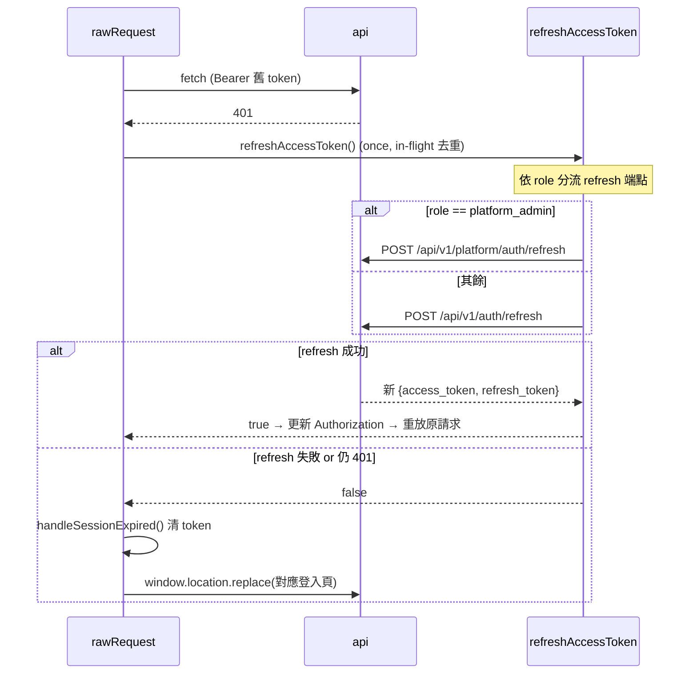
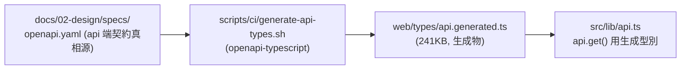

# API 設計規範 — web 子系統（前端消費契約視角）

## 0. 元資訊

| 欄位 | 內容 |
|---|---|
| 文件版本 | v1.0 |
| 建立日期 | 2026-07-07 |
| 維護者 | web 技術文件撰寫者 |
| 視角 | **消費端契約**（web 如何呼叫 api），非 api 端定義。api 端契約源為 `docs/02-design/specs/openapi.yaml` |
| 佐證來源 | `web/src/lib/api.ts`、`realtime.ts`、`sse.ts`、`appMode.ts`、`web/Dockerfile` |

> **與 acme 的關鍵差異**：acme-pro-web 有 BFF 代理層（`/api/[...slug]`），web **沒有**（`find src/app -name route.ts` 零命中）。web 的「API 設計」是**瀏覽器直連後端**的消費契約：header 怎麼注入、信封怎麼解、401 怎麼 refresh、WS 怎麼訂閱。本文件描述的是 client 側行為，端點的 request/response schema 權威在 api 的 OpenAPI。

---

## 1. 設計約定

### 1.1 風格

| 項目 | 說明 |
|---|---|
| 主要風格 | RESTful HTTP + JSON；統一 `{data, meta}` / RFC7807 錯誤信封 |
| 即時 | WebSocket（`lib/realtime.ts`）；SSE（`lib/sse.ts`，後端未實作故預設關）|
| 呼叫方式 | **瀏覽器直連後端**（無 BFF / 無同源代理）|
| 型別同步 | `openapi.yaml` → `types/api.generated.ts`（生成，見 §6）|

### 1.2 Base URL（各 portal 對應不同 api）

api base 由 build-time env 決定，**用 `||` fallback**（空字串也退回本機預設，`api.ts:28`）。

| portal（APP_MODE）| REST base env | 未傳時 fallback | WS base | 證據 |
|---|---|---|---|---|
| dispatch | `NEXT_PUBLIC_API_BASE_URL` | `http://localhost:8001` | `ws://localhost:8001` | `docker-compose.dispatch.yml:122-133` |
| tech | `NEXT_PUBLIC_API_BASE_URL`（tech api :8002）| :8002 | `ws://…:8001`（仍指 dispatch）| `docker-compose.tech.yml:76-87` |
| platform | `NEXT_PUBLIC_API_BASE_URL`（platform api :8003）| :8003 | — | `docker-compose.platform.yml:81-89` |
| landing | :8001（landing api）+ `NEXT_PUBLIC_PLATFORM_API_BASE_URL` :8003（品牌申請）| :8001 / :8003 | — | `docker-compose.landing.yml:24-41` |

> 容器內部一律 8080；表列為 host published port。tech portal 的 WS 刻意指 dispatch api（即時 hub 在 dispatch surface）。

### 1.3 認證方式

- **機制**：JWT Bearer token（**非 cookie**）。token 存瀏覽器 **localStorage**（`api.ts:109-118`）。
- **儲存 keys**（`api.ts:30-35`）：`smartlock.access_token` / `smartlock.refresh_token` / `smartlock.tenant_id` / `smartlock.email`。
- **傳遞**：每次非公開請求由 `rawRequest` 注入 `Authorization: Bearer <token>` + `X-Tenant-ID`（`api.ts:288-292`）。
- **Session 解析**：前端 `atob` decode JWT payload 取 `sub`/`role`/`tenant_id`（`api.ts:183-206`）——**不驗簽章，只讀 claim**。
- **更新**：HTTP 401 → 自動 refresh（once）→ 重放原請求；refresh 失敗 → 清 token 導登入頁（`api.ts:316-324`）。
- **角色**：JWT `role` claim，值如 `admin`/`operations_manager`/`dispatcher`/`customer_service`/`reviewer`/`technician`/`vendor`/`platform_admin`（前端 gate 用，`rolePolicy.ts`）。

> **安全註記**：localStorage token + 不驗簽是本子系統的頭號安全缺口（見 P3-13 B/C 節）。此處僅描述現況契約。

### 1.4 欄位命名

| 規則 | 說明 |
|---|---|
| JSON 欄位 | 後端多為 `snake_case`（如 `access_token`、`tenant_id`、`refresh_token`）|
| 錯誤信封 | RFC7807（`type`/`title`/`status`/`detail`/`instance`）+ legacy（`error_code`/`message`/`request_id`）superset（`api.ts:45-59`）|
| 成功信封 | `{data: {...}, message?}`（如 `LoginResponse`，`api.ts:532-540`）|

### 1.5 無 BFF —— 直連後端

`find src/app -name route.ts` 零命中：web 沒有 Next route handler，也沒有 catch-all proxy。所有 REST 由 `lib/api.ts` 的 fetch client 從**瀏覽器直接**打到後端 api。此決策見 ADR-003；取捨（token/tenant 全暴露瀏覽器、CORS 依賴後端）見 P3-13。

---

## 2. lib/api.ts fetch client 契約

核心檔 `web/src/lib/api.ts`（24KB，統一 fetch client）。對外 API：`api.get/post/put/patch/delete/upload/download`（`api.ts` 尾段 object）。

### 2.1 Header 注入（`rawRequest`，`api.ts:285-305`）

| Header | 值 | 條件 |
|---|---|---|
| `Authorization` | `Bearer <access_token>` | 非 `skipAuth` 且有 token |
| `X-Tenant-ID` | `auth.getTenantId()`（localStorage → 缺退 `FALLBACK_TENANT_ID`）| 非 `skipAuth` |
| `Idempotency-Key` | caller 給的值或自動生成 | **所有非 GET** 一律帶（`api.ts:298-300`）|
| `Content-Type` | `application/json` | 有 body 時 |
| 額外 headers | 如 SoD `X-Initiator`/`X-Approver`/`X-Executor` | caller 傳入，最後合併可覆寫 |

> **Idempotency-Key 為何一律帶**：後端部分端點以 `idempotency_guard` 強制要求（如 `monthly-settlements:generate`），缺則 400 `MISSING_IDEMPOTENCY_KEY`；未掛 guard 的端點忽略此 header（無害）（`api.ts:294-300` 註解）。

### 2.2 信封解析（`api.ts:326-338`）

```
res.status == 204          → return undefined
content-type 含 json/       → payload = res.json()
  problem+json (RFC7807)
其他                        → payload = res.text()
!res.ok                    → throw new ApiError(status, body)
```

`ApiError`（`api.ts:70-86`）：訊息優先序 `detail`（RFC7807）→ `message`（legacy）→ `title` → `HTTP {status}`；`errorCode` 優先 `error_code` → 由 `type` URI（`urn:smartlock:error:{code}`）推導 → `UNKNOWN`。**caller 不得 fetch `type` URI**（只是識別字串）。友善訊息轉換在 `src/lib/apiError.ts`。

### 2.3 401 自動 refresh 流程（`api.ts:316-324`）



- refresh 端點依 role 分流（`api.ts:229-232`）：`platform_admin` → `/api/v1/platform/auth/refresh`；其餘 → `/api/v1/auth/refresh`。
- 並發 401 只 refresh 一次（`refreshInFlight` 去重，`api.ts:219-252`）。
- session 失效導頁依當前 location（`api.ts:257-267`）：`/platform*`→`/platform/login`；`/vendor*`→`/login`；師傅路由→`/tech-login`；其餘→`/login`。

### 2.4 GET cache（`api.ts:345-360` + `lib/cache.ts`）

- 只有 GET 且無 `signal`/`skipAuth` 才走 cache（`api.ts:350-351`）。
- key = `GET:${完整URL}:${tenant}`（`api.ts:356-358`）——**含 BASE_URL host**，故 path-prefix 對不上 `startsWith`。
- 共享 in-flight promise + 30s staleTime（`lib/cache.ts`）。
- mutation 後 caller 用 `cacheInvalidate("GET:")` **廣域清除全部 GET 快取**（`api.ts:18-21` 註解）。

### 2.5 多租戶路徑 helper

- `tenantPath("/foo")` → `/tenants/{tid}/foo`（`api.ts:171-174`），tenant 來源 = `auth.getTenantId()`（localStorage，與 X-Tenant-ID header 一致）。
- 頁面層另有 `resolveTenantId()`（`api.ts:215-217`）走 **JWT claim**（非 localStorage）；多數情境兩者相同。
- 兩者缺 tenant 皆退回 `FALLBACK_TENANT_ID = 00000000-…-0001`（`api.ts:130`，含資料外洩 TODO）。

---

## 3. 登入端點（各 portal 隔離）

4 條隔離登入端點，回傳同一 `{data:{access_token, refresh_token, token_type, expires_in}}` 信封（`api.ts:542-597`）。

| 函式 | 端點 | 產出 role | 說明 | 證據 |
|---|---|---|---|---|
| `login` | `POST /api/v1/auth/login` | admin/客服/後台 | body `{email, password}` | `api.ts:542-550` |
| `loginTechnician` | `POST /api/v1/technicians/login` | technician | body `{identifier, password}`，identifier=手機或 email | `api.ts:556-567` |
| `loginVendor` | `POST /api/v1/vendors/login` | vendor | body `{email, password}` | `api.ts:571-582` |
| `loginPlatformAdmin` | `POST /api/v1/platform/auth/login` | platform_admin | 平台庫帳號池，與品牌/技師完全隔離 | `api.ts:586-597` |

相關輔助端點：
- 登出：`POST /api/v1/auth/logout`（`api.ts:630`）、`POST /api/v1/platform/auth/logout`（平台，撤銷寫 `revoked_jti`，`api.ts:600-612`）。
- 忘記密碼：`POST /api/v1/auth/request-password-reset`（一律 200 不洩漏帳號存在）、`confirm-password-reset`（成功 204）（`api.ts:614-628`）。

> 全部登入/refresh/reset 用 `skipAuth: true`（登入前無 token）。login 成功後 `auth.setTokens` + `setEmail` 寫 localStorage。

---

## 4. WebSocket 契約（`lib/realtime.ts`）

### 4.1 連線設計

| 項目 | 值 | 證據 |
|---|---|---|
| base | `NEXT_PUBLIC_REALTIME_BASE_URL`（未設 → `disabled` 靜默降級）| `realtime.ts:15,50-53` |
| 拓撲 | 一 channelPath 一獨立 WebSocket | `realtime.ts:5-6` |
| 認證 | JWT + tenant 走 **query param**（`access_token` / `tenant_id`）| `realtime.ts:63-70` |
| 重連 | exponential backoff `[1s, 2s, 5s, 10s, 30s]`，max 30s | `realtime.ts:43,77-82` |
| 訊息 | server 推 JSON string → `JSON.parse` → `onMessage(RealtimeMessage)` | `realtime.ts:105-116` |
| 卸載 | `socket.close(1000, "client_unsubscribe")` | `realtime.ts:133-144` |
| React hook | `useRealtimeChannel`（`src/hooks/useRealtimeChannel.ts`）| — |

> JWT 走 query param 而非 header 的原因：多數 WS server 不支援 custom header（`realtime.ts:6`）。**安全註記**：token 會出現在 WS URL（可能被 proxy log），屬 localStorage token 缺口的延伸。

### 4.2 訂閱頻道（6 條）

| channelPath | 用途 | 訂閱點 | 後端狀態 |
|---|---|---|---|
| `/realtime/rbac` | 權限變更 banner | `RbacChangedBanner.tsx:19`（AuthGuard 認證後 subtree）+ `admin/roles/page.tsx:162` | 已用 |
| `/realtime/sla-alerts` | SLA 告警 | `dashboard/SlaAlertBanner.tsx:96` | 已用 |
| `/realtime/notifications/{userId}` | 通知中心 | `notifications/page.tsx:199` | 已用 |
| `/realtime/pool/{techId}` | 師傅搶單池 | `pool/page.tsx:58` | 已用 |
| `/realtime/work-orders/{id}` | 工單即時 | `my-orders/[id]/reschedule/page.tsx:205` | 已用 |
| `/realtime/dispatch-queue` | 派工佇列 | page-status.md 載明 | ⚠️ 前端已訂閱、**後端 server 待啟用** |

### 4.3 SSE 契約（`lib/sse.ts`，獨立解耦）

- 獨立 env `NEXT_PUBLIC_DIAGNOSTICS_SSE_BASE_URL`（與 WS 的 `REALTIME_BASE_URL` 解耦，`sse.ts:22-24`）。
- 用瀏覽器原生 `EventSource`，JWT 走 query param（EventSource 不支援 custom header）。
- 目標頻道 `/realtime/diagnostics/{id}`（`DiagnosticReasoningPanel.tsx`）——**⚠️ 後端尚未實作**（api/main.py 只有 WS）。
- 故獨立 env 預設關閉，避免開 WS 連帶把不存在的 SSE 打開造成 EventSource 404 無限重連（`sse.ts:10-14` 註解）。

---

## 5. 錯誤碼對應（client 解讀）

client 從信封解出 `ApiError`（`api.ts:70-86`），常見 HTTP 狀態語意：

| HTTP | client 行為 | 說明 |
|---|---|---|
| `200`/`201` | 解 `{data}` 信封回傳 | 成功 |
| `204` | 回傳 `undefined` | 無內容（如 delete、confirm-reset）|
| `400` | throw `ApiError`（如 `MISSING_IDEMPOTENCY_KEY`）| 缺 header / 參數錯誤 |
| `401` | 自動 refresh → 重放；再 401 → 清 token 導登入 | token 過期 |
| `403` | throw `ApiError` → 頁面顯示（**真正授權在此**）| 角色不足（後端 `role_required`）|
| `404`/`409`/`422` | throw `ApiError` → `apiError.ts` 轉友善訊息 | 資源/狀態/語意錯誤 |
| `5xx` | throw `ApiError` | 後端異常 |

> **關鍵**：前端 gate（rolePolicy）擋不住的授權，最終由後端回 403 把關。前端 gate 只是 UX 層（見 P3-13）。

---

## 6. 型別同步機制（openapi.yaml → types.generated.ts）



- 型別權威來自 api 的 `openapi.yaml`，經 `scripts/ci/generate-api-types.sh` 生成 `web/types/api.generated.ts`（`api.ts:10,14`）。
- **契約漂移防護**：api 改 schema → 重生成型別 → web 端型別編譯錯誤即暴露不相容。
- caller 以泛型帶入（`api.get<SomeType>(path)`），型別安全靠此鏈維持。

---

## 7. 跨 portal 導頁契約（`*_PORTAL_URL`）

web 各 portal 為獨立 origin，跨端跳轉靠 build-time 烤入的絕對 URL。href 解析集中在 `appMode.ts:103-125`。

| helper | landing 時目標 | dispatch 時目標 | 其餘 | 用途 |
|---|---|---|---|---|
| `techRegisterHref()` | `TECH_PORTAL_URL/tech-register` | `PEER_PORTAL_URL/tech-register` | 站內 `/tech-register` | 師傅註冊 CTA |
| `dispatchLoginHref()` | `DISPATCH_PORTAL_URL/login` | 站內 `/login` | 站內 `/login` | 派工登入入口 |
| `brandApplyHref()` | `PLATFORM_PORTAL_URL/platform/apply` | 站內 `/platform/apply` | 站內 | 品牌申請導入 |

跨 origin token 隔離：各 port 獨立 origin，token 各自獨立；AuthGuard 有殘留 token 防呆（別站 token 落本站 → `auth.clear()` 留公開頁，`AuthGuard.tsx:75-78`）。跨 tab 登出同步：監聽 `storage` 事件，token 被清 → 導登入頁（`AuthGuard.tsx:95-110`）。

---

## 8. 客戶公開頁（token 簽章，不走 api client）

`/track/[token]`、`/scope-change/[token]`、`/quotes/[token]`、`/consent/[token]`（`AuthGuard.tsx:36` PUBLIC_PREFIXES）為客戶用簽章 token 存取的公開頁，**未登入**，故各自 inline 讀 `NEXT_PUBLIC_API_BASE_URL` 直打後端 public 端點，**不經 `lib/api` client**（無 Bearer/tenant 注入，`facts §5` 對照）。授權靠 token 本身的簽章驗證（後端）。

---

*文件結尾 — web 前端消費契約 v1.0 / 2026-07-07*
</content>
